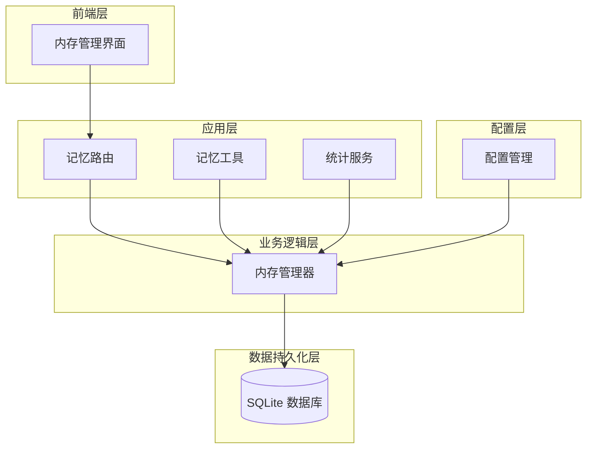
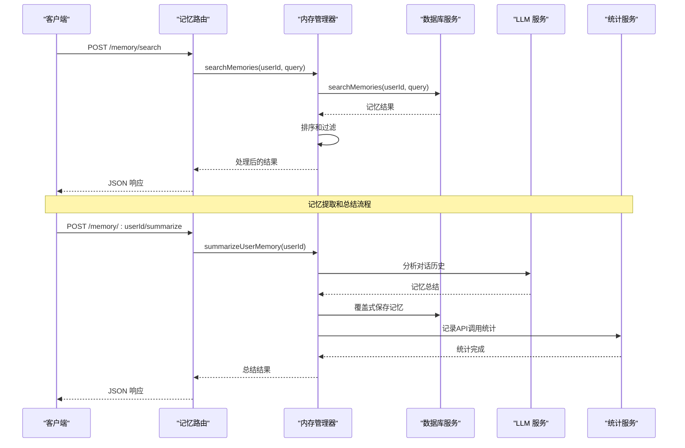
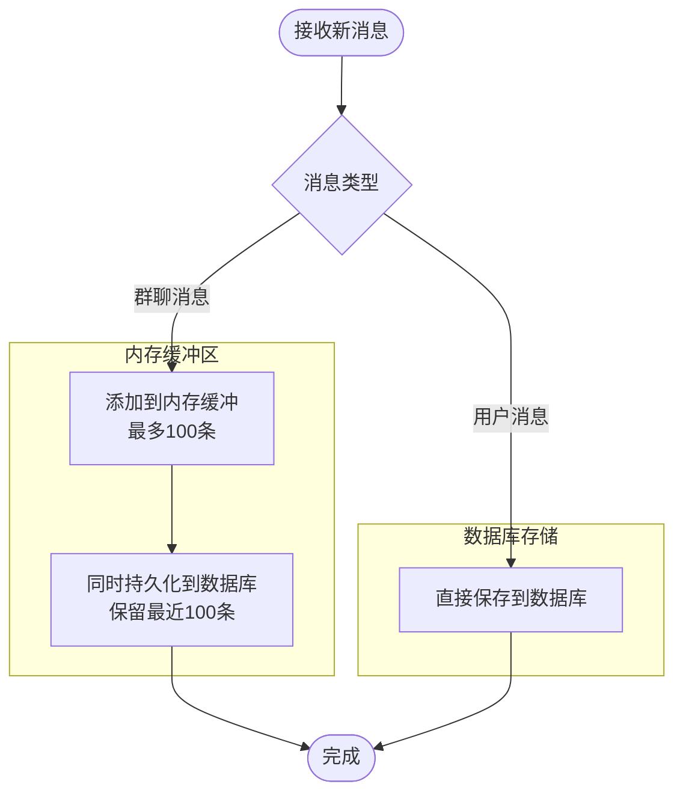
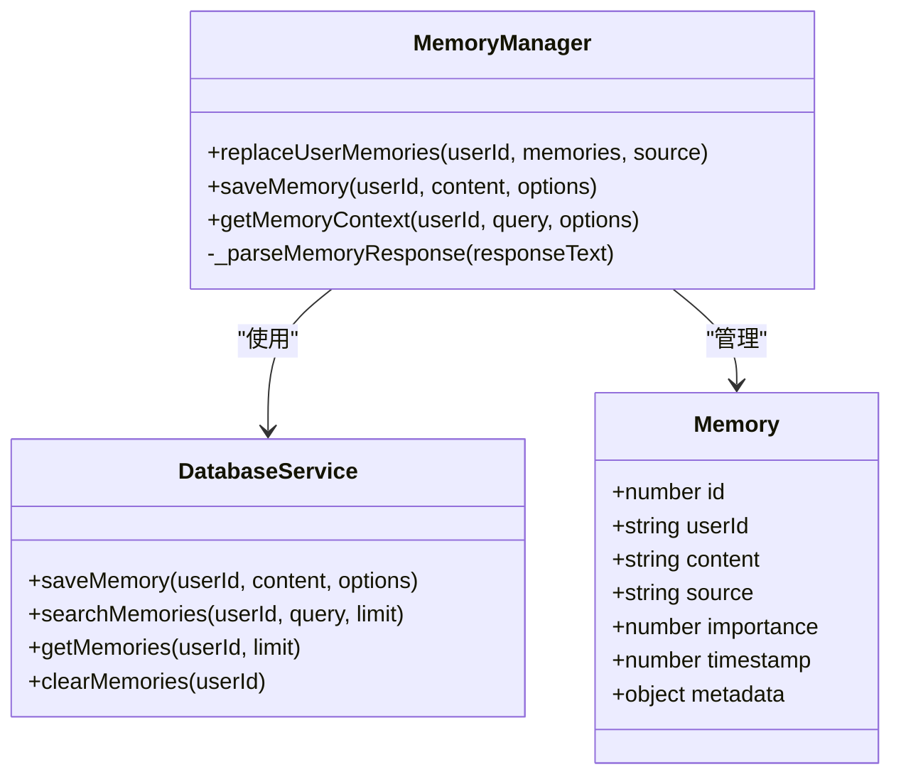
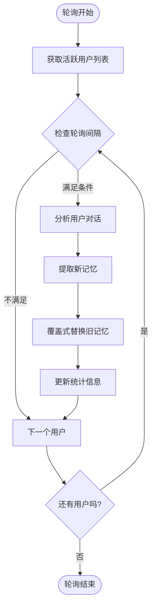
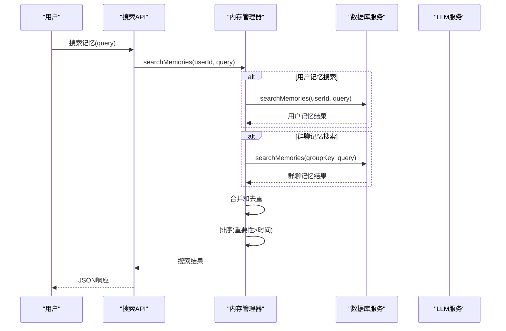
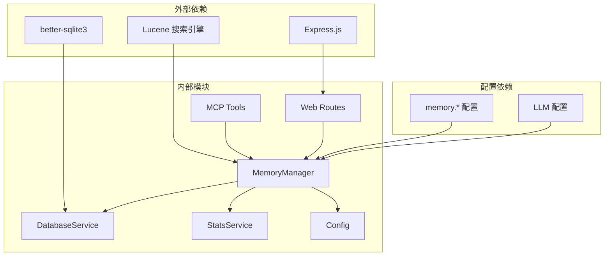

# 内存管理机制

<cite>
**本文档引用的文件**
- [MemoryManager.js](file://src/services/storage/MemoryManager.js)
- [DatabaseService.js](file://src/services/storage/DatabaseService.js)
- [memory.js](file://src/mcp/tools/memory.js)
- [memoryRoutes.js](file://src/services/routes/memoryRoutes.js)
- [config.js](file://config/config.js)
- [StatsService.js](file://src/services/stats/StatsService.js)
- [page.tsx](file://frontend/app/(dashboard)/memory/page.tsx)
</cite>

## 目录
1. [简介](#简介)
2. [项目结构](#项目结构)
3. [核心组件](#核心组件)
4. [架构概览](#架构概览)
5. [详细组件分析](#详细组件分析)
6. [依赖关系分析](#依赖关系分析)
7. [性能考虑](#性能考虑)
8. [故障排除指南](#故障排除指南)
9. [结论](#结论)
10. [附录](#附录)

## 简介
本文件详细阐述了该聊天插件中的内存管理机制，重点涵盖短期记忆和长期记忆的存储策略、重要性评分系统、时间戳管理、自动清理机制、检索算法、去重机制、存储优化以及与数据库的同步机制。文档还提供了管理员监控、清理和维护的指导。

## 项目结构
该内存管理系统主要由以下模块组成：
- 存储层：基于 SQLite 的数据库服务，负责实际的数据持久化
- 管理层：内存管理器，负责周期性分析、记忆提取、覆盖式总结
- 工具层：MC MCP 工具接口，提供外部调用能力
- 路由层：Web API 路由，提供 RESTful 接口
- 配置层：内存管理相关配置项
- 统计层：API 调用统计，记录记忆服务的使用情况
- 前端界面：内存管理仪表板，提供可视化监控和操作

**图表来源**
- [MemoryManager.js](file://src/services/storage/MemoryManager.js#L12-L31)
- [DatabaseService.js](file://src/services/storage/DatabaseService.js#L19-L45)
- [memoryRoutes.js](file://src/services/routes/memoryRoutes.js#L1-L137)
- [memory.js](file://src/mcp/tools/memory.js#L1-L179)

**章节来源**
- [MemoryManager.js](file://src/services/storage/MemoryManager.js#L1-L80)
- [DatabaseService.js](file://src/services/storage/DatabaseService.js#L1-L80)

## 核心组件
本节深入分析内存管理的核心组件及其职责分工。

### 内存管理器 (MemoryManager)
内存管理器是整个系统的核心控制器，负责：
- 周期性轮询分析用户对话历史
- 自动提取和总结记忆
- 覆盖式记忆管理
- 群聊上下文分析
- 记忆检索和排序

关键特性：
- **双模式运行**：既支持自动轮询分析，也支持手动触发总结
- **覆盖式管理**：定期清理旧记忆，保留最新有效的信息
- **多维度分析**：支持用户个人记忆和群聊上下文记忆
- **智能去重**：通过内容哈希和时间窗口防止重复存储

### 数据库服务 (DatabaseService)
提供完整的数据持久化能力：
- **表结构设计**：memories 表存储用户记忆，messages 表存储对话历史
- **索引优化**：为 user_id、timestamp 等关键字段建立索引
- **查询优化**：支持 LIKE 查询、前缀匹配、范围查询
- **事务保证**：使用 WAL 模式确保并发安全性

### 配置管理 (Config)
内存管理的关键配置项：
- `memory.enabled`：启用/禁用记忆功能
- `memory.pollInterval`：轮询间隔（分钟）
- `memory.maxMemories`：每用户最大记忆数
- `memory.groupContext`：群聊上下文配置
- `memory.model`：记忆提取使用的模型

**章节来源**
- [MemoryManager.js](file://src/services/storage/MemoryManager.js#L12-L1538)
- [DatabaseService.js](file://src/services/storage/DatabaseService.js#L19-L809)
- [config.js](file://config/config.js#L343-L360)

## 架构概览
系统采用分层架构设计，确保职责清晰分离：

**图表来源**
- [memoryRoutes.js](file://src/services/routes/memoryRoutes.js#L42-L111)
- [MemoryManager.js](file://src/services/storage/MemoryManager.js#L535-L653)
- [StatsService.js](file://src/services/stats/StatsService.js#L230-L360)

## 详细组件分析

### 记忆存储策略
系统采用混合存储策略，结合短期和长期记忆的特点：

#### 短期记忆（内存缓冲）
- **群消息缓冲**：内存中缓存最近的群聊消息，最多100条
- **时间窗口**：消息保留时间受内存限制，自动清理最旧消息
- **快速访问**：内存中的消息用于实时上下文分析

#### 长期记忆（数据库存储）
- **持久化存储**：所有用户记忆永久保存在 SQLite 数据库中
- **索引优化**：为 user_id 和 timestamp 建立索引，提升查询性能
- **容量控制**：每用户最大记忆数限制，超出时自动清理最旧记忆

**图表来源**
- [MemoryManager.js](file://src/services/storage/MemoryManager.js#L114-L156)
- [DatabaseService.js](file://src/services/storage/DatabaseService.js#L263-L327)

**章节来源**
- [MemoryManager.js](file://src/services/storage/MemoryManager.js#L114-L156)
- [DatabaseService.js](file://src/services/storage/DatabaseService.js#L83-L98)

### 重要性评分系统
系统实现了多维度的重要性评分机制：

#### 内置重要性等级
- **评分范围**：1-10 分制
- **默认值**：5 分
- **覆盖式保存**：手动保存时默认重要性为 6 分
- **排序依据**：重要性降序，时间降序

#### 动态重要性评估
- **自动提取**：根据用户表达的重要程度动态调整
- **上下文影响**：群聊环境下的信息通常具有更高的重要性
- **重复出现**：多次提及的信息会被赋予更高重要性

**图表来源**
- [MemoryManager.js](file://src/services/storage/MemoryManager.js#L694-L716)
- [DatabaseService.js](file://src/services/storage/DatabaseService.js#L83-L120)

**章节来源**
- [MemoryManager.js](file://src/services/storage/MemoryManager.js#L694-L716)
- [DatabaseService.js](file://src/services/storage/DatabaseService.js#L111-L119)

### 时间戳管理
系统采用统一的时间戳管理策略：

#### 时间戳生成
- **精确时间**：使用 `Date.now()` 获取毫秒级时间戳
- **一致性**：所有存储操作使用相同的时间源
- **排序依据**：时间戳用于记忆的排序和清理决策

#### 清理策略
- **容量限制**：当记忆数量超过 `maxMemories` 配置时触发清理
- **优先级**：保留最重要的记忆，删除最旧的记忆
- **批量清理**：一次性清理超出限制的所有旧记忆

**章节来源**
- [MemoryManager.js](file://src/services/storage/MemoryManager.js#L910-L923)
- [DatabaseService.js](file://src/services/storage/DatabaseService.js#L117-L118)

### 自动清理机制
系统实现了智能的自动清理机制：

#### 轮询清理
- **周期性检查**：根据 `pollInterval` 配置定期执行
- **频率控制**：使用 `minPollInterval` 防止过度轮询
- **增量处理**：每次轮询最多处理 100 个用户，避免阻塞

#### 覆盖式清理
- **总结驱动**：通过 LLM 分析生成的新记忆覆盖旧记忆
- **去重处理**：自动识别和删除重复或过时的信息
- **质量优先**：保留最有价值的记忆，删除低质量内容

**图表来源**
- [MemoryManager.js](file://src/services/storage/MemoryManager.js#L489-L529)
- [MemoryManager.js](file://src/services/storage/MemoryManager.js#L535-L653)

**章节来源**
- [MemoryManager.js](file://src/services/storage/MemoryManager.js#L489-L529)
- [MemoryManager.js](file://src/services/storage/MemoryManager.js#L694-L716)

### 检索算法
系统提供了多种检索方式，支持从简单到复杂的查询需求：

#### 文本匹配检索
- **模糊匹配**：使用 SQL LIKE 操作符进行模糊匹配
- **转义处理**：自动转义 LIKE 特殊字符防止注入
- **长度限制**：查询字符串限制在 200 字符以内

#### 排序策略
- **重要性优先**：重要性高的记忆排在前面
- **时间优先**：重要性相同时，最新的记忆排在前面
- **数量限制**：默认返回 10 条结果，可配置

#### 群聊上下文检索
- **多源合并**：同时从用户记忆和群聊记忆中检索
- **去重处理**：自动去除重复的记忆条目
- **上下文增强**：结合查询关键词和上下文信息

**图表来源**
- [MemoryManager.js](file://src/services/storage/MemoryManager.js#L844-L862)
- [DatabaseService.js](file://src/services/storage/DatabaseService.js#L125-L164)

**章节来源**
- [DatabaseService.js](file://src/services/storage/DatabaseService.js#L125-L164)
- [MemoryManager.js](file://src/services/storage/MemoryManager.js#L844-L896)

### 去重机制
系统实现了多层次的去重保护：

#### 内容去重
- **哈希计算**：对消息内容和角色进行哈希计算
- **时间窗口**：检查最近 5 条消息的哈希值
- **自动跳过**：发现重复内容时自动跳过保存

#### 记忆去重
- **覆盖式保存**：新记忆覆盖旧记忆，避免重复累积
- **智能合并**：通过 LLM 分析合并相似的记忆条目
- **去重过滤**：在解析阶段过滤掉无效和重复的内容

#### 缓冲区去重
- **内存缓冲**：群消息缓冲区限制在 100 条以内
- **先进先出**：超出限制时自动移除最旧的消息
- **实时清理**：防止内存无限增长

**章节来源**
- [DatabaseService.js](file://src/services/storage/DatabaseService.js#L263-L308)
- [MemoryManager.js](file://src/services/storage/MemoryManager.js#L114-L156)

### 存储优化
系统采用了多项存储优化技术：

#### 数据库优化
- **WAL 模式**：启用写-ahead logging 提升并发性能
- **索引优化**：为常用查询字段建立索引
- **查询优化**：使用 LIMIT 限制结果集大小

#### 内存优化
- **缓冲区限制**：群消息缓冲区限制在 100 条
- **增量处理**：轮询时限制每次处理的用户数量
- **懒加载**：按需初始化数据库连接

#### 序列化优化
- **JSON 序列化**：统一使用 JSON 格式存储复杂对象
- **元数据存储**：将额外信息存储在 metadata 字段中
- **压缩存储**：对长文本内容进行适当的压缩处理

**章节来源**
- [DatabaseService.js](file://src/services/storage/DatabaseService.js#L39-L45)
- [DatabaseService.js](file://src/services/storage/DatabaseService.js#L195-L211)

### 与数据库的同步机制
系统确保内存和数据库之间的数据一致性：

#### 写入同步
- **即时同步**：用户操作立即同步到数据库
- **事务保证**：使用 SQLite 事务确保数据完整性
- **错误处理**：写入失败时提供详细的错误信息

#### 读取优化
- **缓存策略**：热门数据在内存中缓存
- **批量查询**：支持批量获取用户记忆
- **分页处理**：大数据量时使用分页查询

#### 数据迁移
- **格式转换**：支持新旧消息格式的自动转换
- **向后兼容**：确保新版本能够处理旧数据
- **数据验证**：导入时进行数据完整性检查

**章节来源**
- [DatabaseService.js](file://src/services/storage/DatabaseService.js#L380-L409)
- [DatabaseService.js](file://src/services/storage/DatabaseService.js#L517-L530)

## 依赖关系分析

**图表来源**
- [MemoryManager.js](file://src/services/storage/MemoryManager.js#L1-L10)
- [DatabaseService.js](file://src/services/storage/DatabaseService.js#L1-L10)
- [StatsService.js](file://src/services/stats/StatsService.js#L1-L15)

系统的主要依赖关系：
- **数据库层**：依赖 better-sqlite3 提供高性能的本地数据库
- **Web 层**：依赖 Express.js 提供 RESTful API 服务
- **搜索层**：依赖 Lucene 提供全文搜索能力
- **配置层**：依赖 YAML 配置文件提供灵活的配置管理

**章节来源**
- [MemoryManager.js](file://src/services/storage/MemoryManager.js#L1-L10)
- [DatabaseService.js](file://src/services/storage/DatabaseService.js#L1-L10)
- [StatsService.js](file://src/services/stats/StatsService.js#L1-L15)

## 性能考虑
系统在设计时充分考虑了性能优化：

### 查询性能
- **索引优化**：为 user_id 和 timestamp 字段建立索引
- **LIMIT 限制**：默认限制查询结果数量，避免大量数据传输
- **缓存策略**：热门查询结果在内存中缓存

### 内存管理
- **缓冲区限制**：群消息缓冲区限制在 100 条以内
- **增量处理**：轮询时限制每次处理的用户数量
- **垃圾回收**：及时释放不再使用的内存

### 并发处理
- **WAL 模式**：启用写-ahead logging 提升并发性能
- **异步操作**：大量使用 Promise 和 async/await
- **队列管理**：使用队列管理后台任务

### API 性能
- **RPM 控制**：实时监控请求速率，防止过载
- **超时处理**：合理设置超时时间，避免长时间阻塞
- **错误重试**：对临时性错误进行自动重试

## 故障排除指南
本节提供常见问题的诊断和解决方案：

### 记忆功能无法启用
**症状**：记忆功能始终处于禁用状态
**排查步骤**：
1. 检查配置文件中的 `memory.enabled` 设置
2. 确认数据库服务正常启动
3. 查看内存管理器的初始化日志

**解决方案**：
- 将 `memory.enabled` 设置为 `true`
- 检查数据库连接权限
- 重启服务确保配置生效

### 记忆检索结果为空
**症状**：搜索记忆总是返回空结果
**排查步骤**：
1. 确认用户确实有记忆数据
2. 检查查询关键词是否正确
3. 验证数据库连接状态

**解决方案**：
- 确保用户已经产生足够的对话历史
- 使用更通用的查询关键词
- 检查数据库表结构是否正确

### 内存使用过高
**症状**：系统内存占用持续增长
**排查步骤**：
1. 检查群消息缓冲区大小
2. 监控轮询频率设置
3. 查看内存泄漏迹象

**解决方案**：
- 调整 `maxMemories` 配置值
- 增加轮询间隔时间
- 定期重启服务释放内存

### API 调用失败
**症状**：记忆相关的 API 调用返回错误
**排查步骤**：
1. 检查 LLM 服务连接状态
2. 验证 API 密钥配置
3. 查看详细的错误日志

**解决方案**：
- 重新配置 LLM 服务连接
- 更新有效的 API 密钥
- 检查网络连接稳定性

**章节来源**
- [MemoryManager.js](file://src/services/storage/MemoryManager.js#L489-L529)
- [StatsService.js](file://src/services/stats/StatsService.js#L230-L360)

## 结论
该内存管理系统通过精心设计的架构和算法，实现了高效、可靠的短期和长期记忆管理。系统的主要优势包括：

1. **智能存储策略**：结合内存缓冲和数据库持久化，平衡性能和可靠性
2. **强大的检索能力**：支持多种检索方式和智能排序
3. **自动化管理**：通过轮询和 LLM 分析实现自动化的记忆管理
4. **完善的监控**：提供详细的统计信息和性能指标
5. **灵活的配置**：支持丰富的配置选项满足不同需求

系统在设计时充分考虑了性能、可扩展性和易用性，为用户提供了一个强大而可靠的内存管理解决方案。

## 附录

### 管理员操作指南

#### 监控内存使用
- 通过前端仪表板查看内存使用情况
- 监控 RPM（每分钟请求）统计
- 查看 API 调用成功率和耗时

#### 清理和维护
- 定期执行内存清理任务
- 监控磁盘空间使用情况
- 备份数据库以防数据丢失

#### 性能调优
- 根据实际负载调整轮询间隔
- 优化数据库索引配置
- 监控系统资源使用情况

#### 故障处理
- 查看详细的错误日志
- 检查依赖服务的健康状态
- 实施适当的故障转移策略

**章节来源**
- [page.tsx](file://frontend/app/(dashboard)/memory/page.tsx#L234-L453)
- [StatsService.js](file://src/services/stats/StatsService.js#L431-L489)