# 数据存储系统

<cite>
**本文档引用的文件**
- [index.js](file://index.js)
- [README.md](file://README.md)
- [package.json](file://package.json)
- [config.js](file://config/config.js)
- [DatabaseService.js](file://src/services/storage/DatabaseService.js)
- [KnowledgeService.js](file://src/services/storage/KnowledgeService.js)
- [MemoryManager.js](file://src/services/storage/MemoryManager.js)
- [memoryRoutes.js](file://src/services/routes/memoryRoutes.js)
- [knowledgeRoutes.js](file://src/services/routes/knowledgeRoutes.js)
</cite>

## 目录
1. [简介](#简介)
2. [项目结构](#项目结构)
3. [核心组件](#核心组件)
4. [架构概览](#架构概览)
5. [详细组件分析](#详细组件分析)
6. [依赖关系分析](#依赖关系分析)
7. [性能考虑](#性能考虑)
8. [故障排除指南](#故障排除指南)
9. [结论](#结论)

## 简介

数据存储系统是 ChatAI 插件的核心基础设施，负责管理对话历史、用户记忆、知识库文档和预设配置等关键数据。该系统基于 SQLite 数据库存储，采用模块化设计，提供了完整的数据生命周期管理能力。

系统主要特性包括：
- **多模型支持**：支持 OpenAI、Google Gemini、Anthropic Claude 等多种 LLM 模型
- **智能对话管理**：多轮上下文记忆、用户/群组会话隔离
- **长期记忆系统**：自动提取关键信息、向量相似度搜索、用户画像分析
- **知识库管理**：结构化知识存储、智能检索和预设关联
- **Web 管理面板**：可视化配置、实时监控、数据管理

## 项目结构

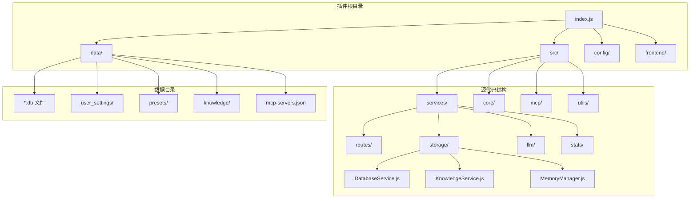

**图表来源**
- [index.js](file://index.js#L1-L258)
- [DatabaseService.js](file://src/services/storage/DatabaseService.js#L1-L809)

**节来源**
- [index.js](file://index.js#L1-L258)
- [README.md](file://README.md#L356-L396)

## 核心组件

### 数据库服务 (DatabaseService)

DatabaseService 是整个数据存储系统的核心，基于 better-sqlite3 实现，提供以下核心功能：

#### 数据库初始化
- 自动创建数据目录和数据库文件
- 启用 WAL 模式提升并发性能
- 创建必要的表结构和索引

#### 核心数据表设计
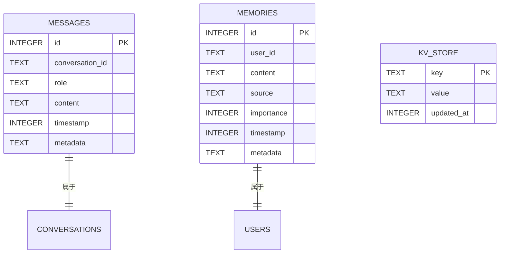

**图表来源**
- [DatabaseService.js](file://src/services/storage/DatabaseService.js#L47-L78)

#### 主要功能模块
- **消息存储**：保存对话历史，支持去重和内容解析
- **记忆管理**：用户记忆的增删改查和搜索
- **键值存储**：通用配置和状态管理
- **用户管理**：用户设置和状态跟踪

### 知识库服务 (KnowledgeService)

KnowledgeService 提供结构化的知识管理能力，支持多种文档格式和智能检索：

#### 文档管理
- **多格式支持**：纯文本、Markdown、JSON 格式
- **自动扫描**：发现和导入未索引的文档
- **索引管理**：维护文档元数据和内容索引

#### 智能检索
- **全文搜索**：基于关键词和实体的智能匹配
- **相关性评分**：基于内容相似度的排序
- **预设关联**：知识库与预设的动态绑定

### 记忆管理器 (MemoryManager)

MemoryManager 实现了智能记忆提取和管理机制：

#### 自动记忆提取
- **周期性分析**：定期轮询活跃用户对话
- **上下文分析**：区分私聊和群聊的不同处理逻辑
- **覆盖式总结**：基于 LLM 的智能总结和去重

#### 记忆存储策略
- **短期记忆**：基于会话的临时记忆
- **长期记忆**：持久化的用户特征和偏好
- **群组记忆**：共享的群聊上下文信息

**节来源**
- [DatabaseService.js](file://src/services/storage/DatabaseService.js#L19-L809)
- [KnowledgeService.js](file://src/services/storage/KnowledgeService.js#L31-L931)
- [MemoryManager.js](file://src/services/storage/MemoryManager.js#L12-L1538)

## 架构概览

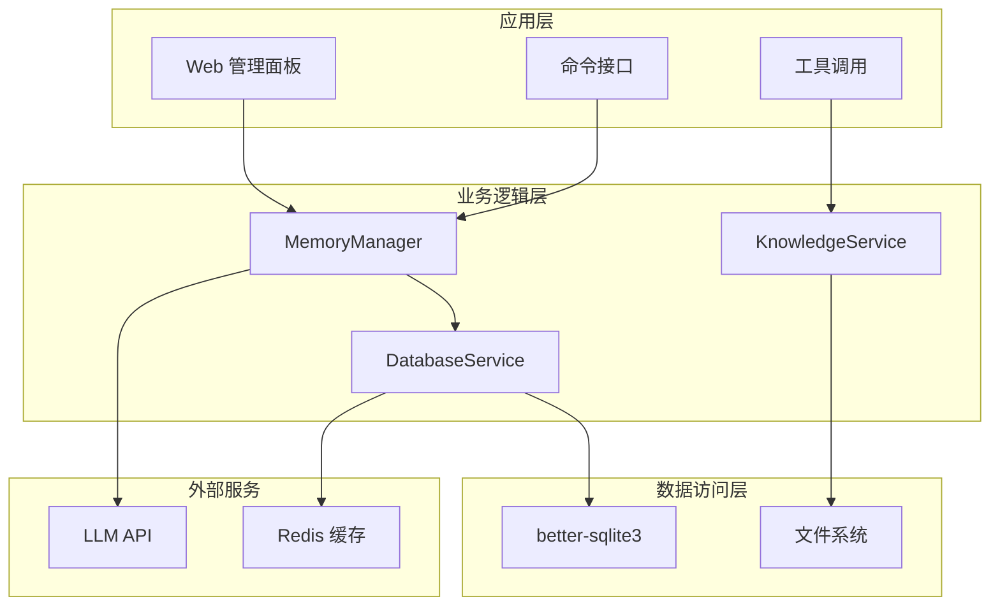

**图表来源**
- [index.js](file://index.js#L38-L66)
- [MemoryManager.js](file://src/services/storage/MemoryManager.js#L23-L31)

系统采用分层架构设计，各层职责清晰分离：

1. **应用层**：提供 Web 界面和命令接口
2. **业务逻辑层**：处理具体的业务规则和算法
3. **数据访问层**：封装数据库和文件系统的访问
4. **外部服务**：集成 LLM API 和缓存服务

## 详细组件分析

### 数据库设计详解

#### 表结构设计原则
- **消息表 (messages)**：存储完整的对话历史，支持去重和内容解析
- **记忆表 (memories)**：存储用户长期记忆，支持重要性排序和搜索
- **键值存储表 (kv_store)**：存储配置和状态信息

#### 索引优化策略
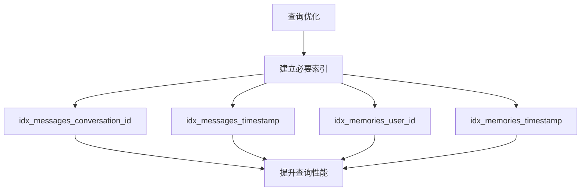

**图表来源**
- [DatabaseService.js](file://src/services/storage/DatabaseService.js#L57-L70)

#### 数据一致性保证
- **事务处理**：关键操作使用事务确保原子性
- **数据验证**：输入数据的完整性和有效性检查
- **错误处理**：完善的异常捕获和恢复机制

### 内存管理机制

#### 短期记忆 vs 长期记忆
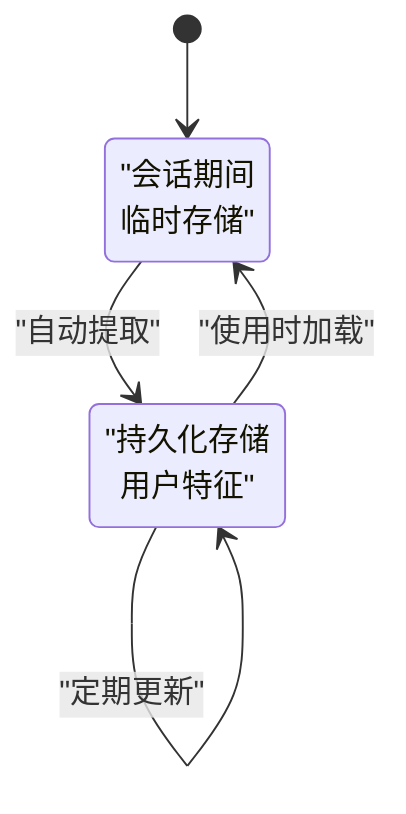

#### 记忆提取算法
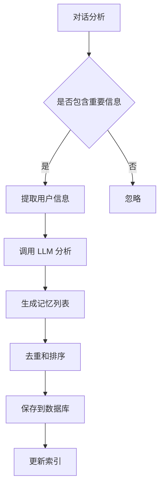

**图表来源**
- [MemoryManager.js](file://src/services/storage/MemoryManager.js#L724-L808)

### 知识库服务实现

#### 知识提取和存储
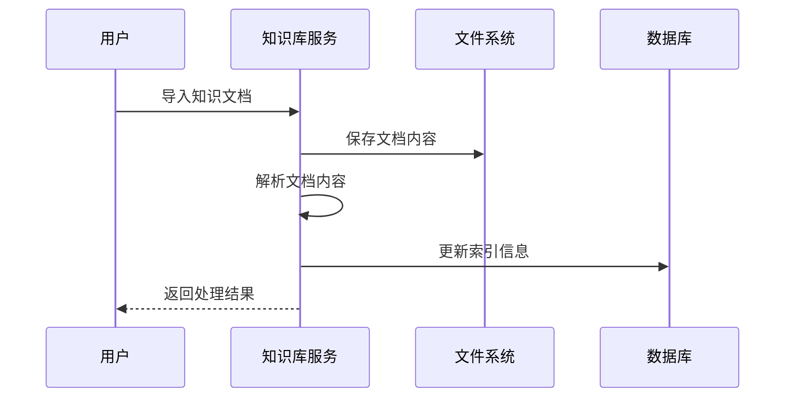

**图表来源**
- [KnowledgeService.js](file://src/services/storage/KnowledgeService.js#L262-L323)

#### 智能检索机制
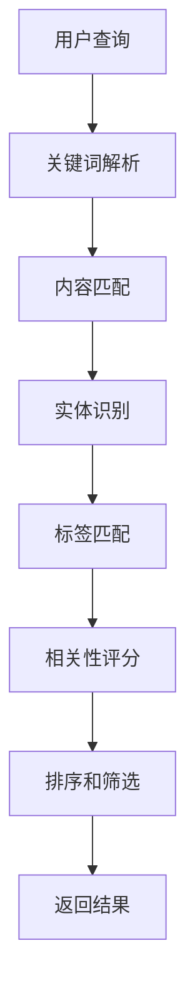

**图表来源**
- [KnowledgeService.js](file://src/services/storage/KnowledgeService.js#L750-L827)

### API 路由设计

#### 记忆管理 API
| 端点 | 方法 | 功能 | 权限 |
|------|------|------|------|
| `/memory/users` | GET | 获取所有有记忆的用户 | 管理员 |
| `/memory/search` | POST | 搜索用户记忆 | 所有人 |
| `/memory/group/:groupId/summarize` | POST | 群记忆总结 | 管理员 |
| `/memory/:userId` | GET | 获取用户记忆 | 所有人 |
| `/memory` | POST | 添加记忆 | 所有人 |

#### 知识库管理 API
| 端点 | 方法 | 功能 | 权限 |
|------|------|------|------|
| `/knowledge/` | GET | 获取所有知识库文档 | 管理员 |
| `/knowledge/search` | GET | 搜索知识库 | 管理员 |
| `/knowledge/:id` | GET | 获取单个文档 | 管理员 |
| `/knowledge` | POST | 创建知识库 | 管理员 |
| `/knowledge/:id/link/:presetId` | POST | 关联到预设 | 管理员 |

**节来源**
- [memoryRoutes.js](file://src/services/routes/memoryRoutes.js#L1-L137)
- [knowledgeRoutes.js](file://src/services/routes/knowledgeRoutes.js#L1-L131)

## 依赖关系分析

### 外部依赖
```mermaid
graph TB
subgraph "核心依赖"
A[better-sqlite3] --> B[SQLite 数据库]
C[express] --> D[Web 服务]
E[yaml] --> F[配置管理]
end
subgraph "AI 服务"
G[@anthropic-ai/sdk] --> H[Claude API]
I[@google/generative-ai] --> J[Gemini API]
K[openai] --> L[GPT API]
end
subgraph "工具库"
M[axios] --> N[HTTP 请求]
O[jsonwebtoken] --> P[JWT 处理]
Q[uuid] --> R[ID 生成]
end
```

**图表来源**
- [package.json](file://package.json#L16-L45)

### 内部模块依赖
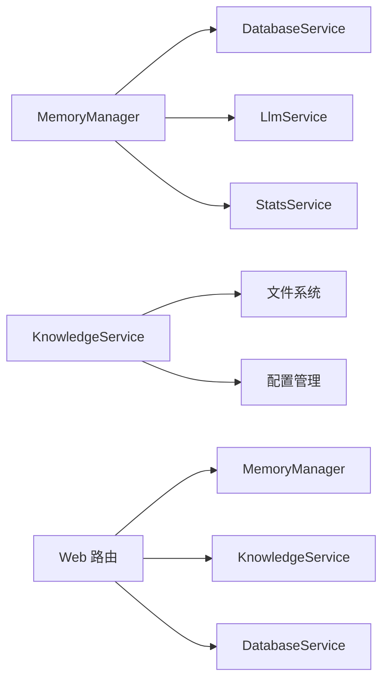

**图表来源**
- [MemoryManager.js](file://src/services/storage/MemoryManager.js#L1-L20)
- [KnowledgeService.js](file://src/services/storage/KnowledgeService.js#L1-L20)

**节来源**
- [package.json](file://package.json#L1-L53)

## 性能考虑

### 数据库性能优化
- **WAL 模式**：启用写-ahead logging 提升并发性能
- **索引策略**：为常用查询字段建立索引
- **查询优化**：使用参数化查询防止 SQL 注入
- **连接池**：合理管理数据库连接

### 缓存策略
- **Redis 缓存**：可选的缓存层提升读取性能
- **内存缓存**：热点数据的内存缓存
- **CDN 加速**：静态资源的 CDN 加速

### 扩展性设计
- **水平扩展**：支持多实例部署
- **读写分离**：主从数据库架构
- **分库分表**：大数据量时的分片策略

## 故障排除指南

### 常见问题诊断

#### 数据库初始化失败
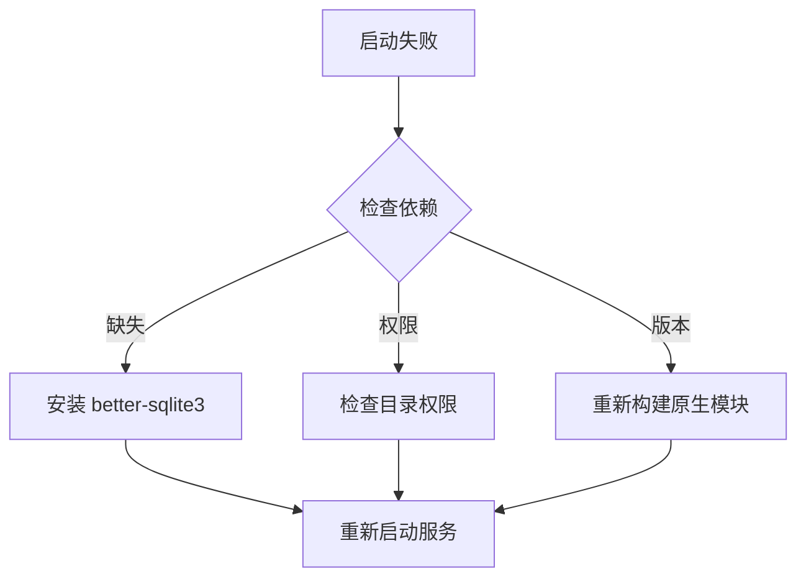

#### 记忆提取异常
- **检查 LLM 配置**：确保 API 密钥和模型设置正确
- **验证数据格式**：确认对话数据格式符合预期
- **查看日志信息**：分析具体的错误原因

#### 知识库检索性能问题
- **优化索引**：检查和重建相关索引
- **调整查询**：优化搜索关键词和查询条件
- **增加缓存**：为热门查询结果增加缓存

### 监控和维护

#### 系统监控指标
- **数据库性能**：查询响应时间、连接数、锁等待
- **内存使用**：进程内存、缓存命中率
- **API 调用**：LLM API 调用次数、成功率、响应时间

#### 备份和恢复
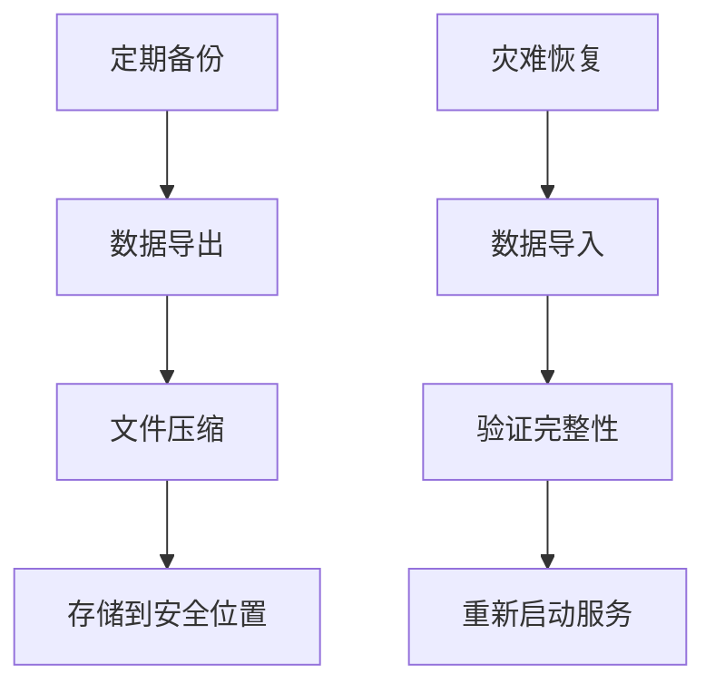

**节来源**
- [README.md](file://README.md#L773-L793)

## 结论

数据存储系统通过模块化设计实现了高效、可靠的数据管理能力。系统的主要优势包括：

1. **完整的数据生命周期管理**：从数据采集、存储到检索的全流程支持
2. **智能的数据处理**：基于 LLM 的自动记忆提取和知识库管理
3. **灵活的扩展性**：支持多种数据格式和存储策略
4. **完善的监控体系**：提供全面的性能监控和故障诊断能力

该系统为 ChatAI 插件提供了坚实的数据基础，支持复杂的对话管理和知识管理需求。通过合理的架构设计和性能优化，能够满足生产环境的高可用性和高性能要求。

未来可以进一步优化的方向包括：
- 实现分布式数据库支持
- 增强数据加密和访问控制
- 优化大规模数据的查询性能
- 增加数据迁移和同步功能