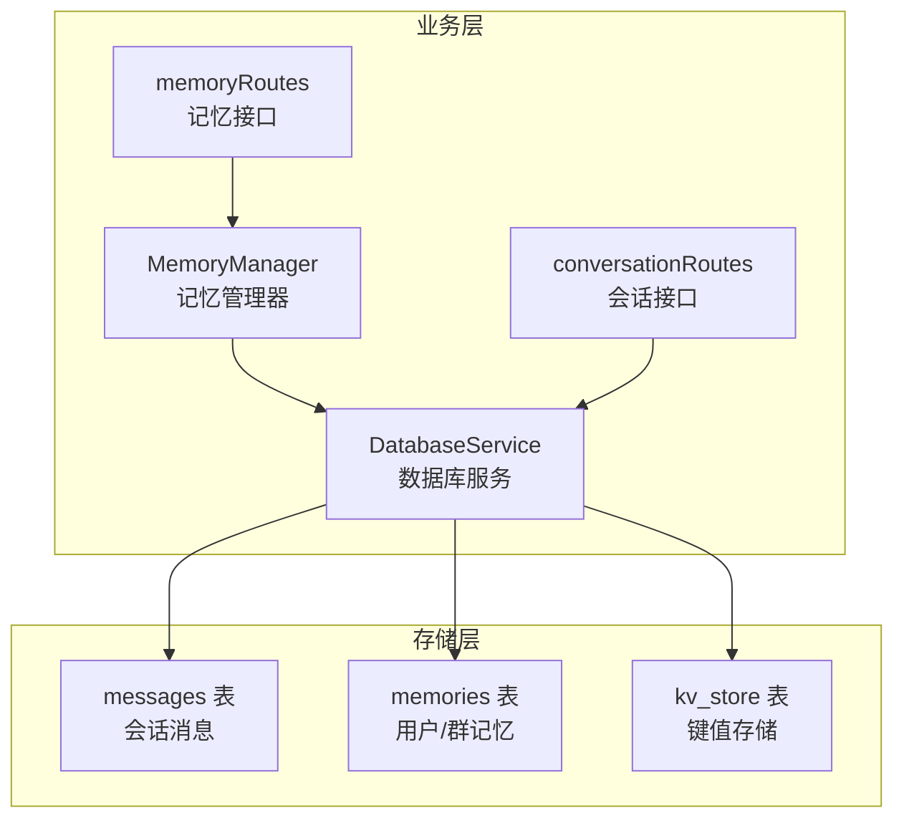
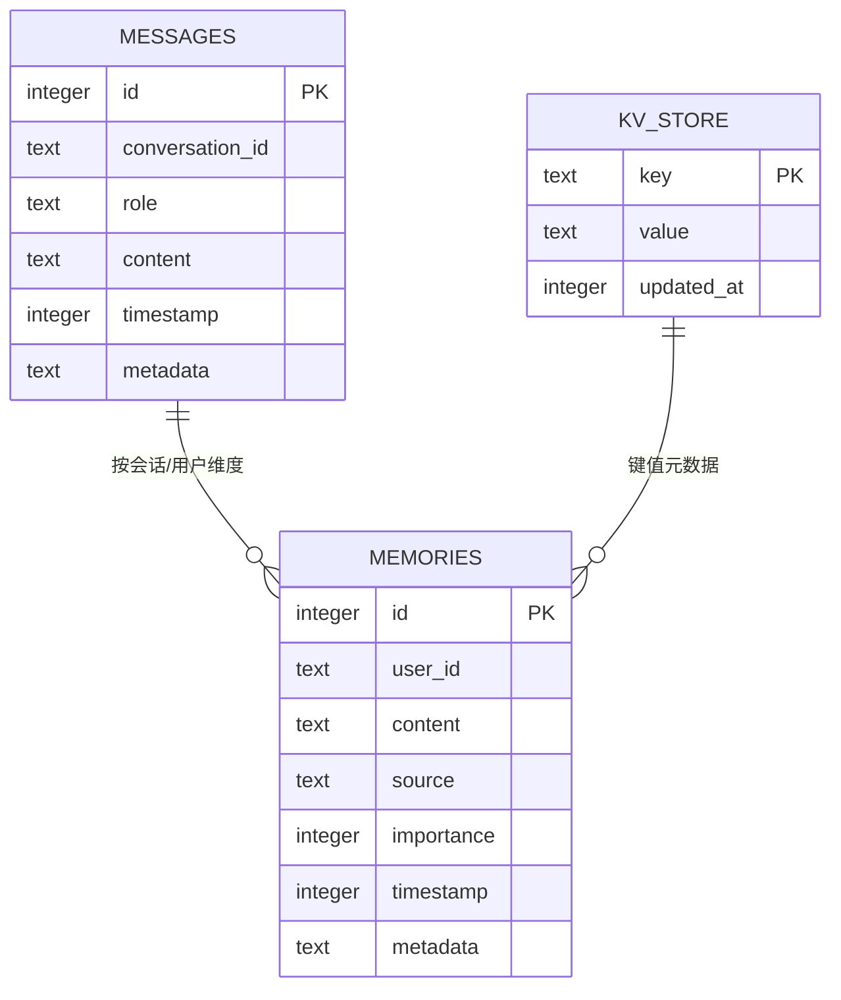
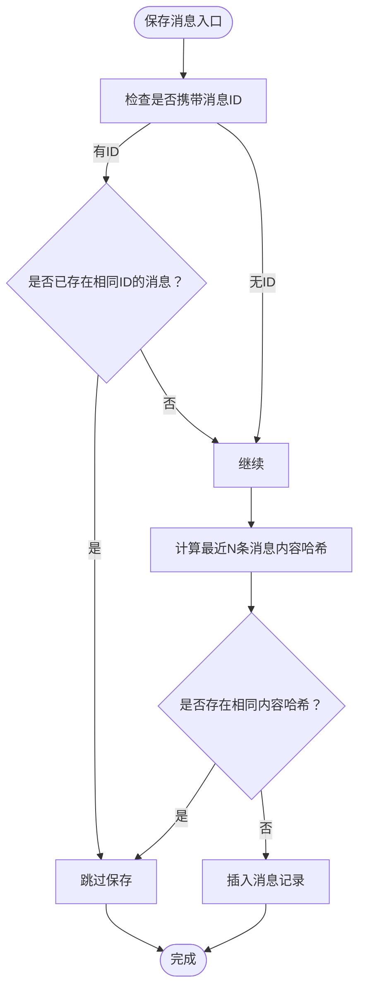
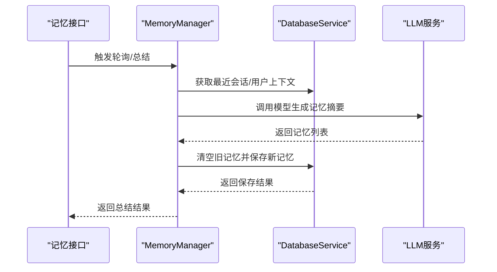
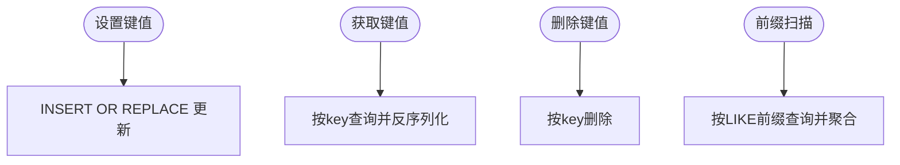
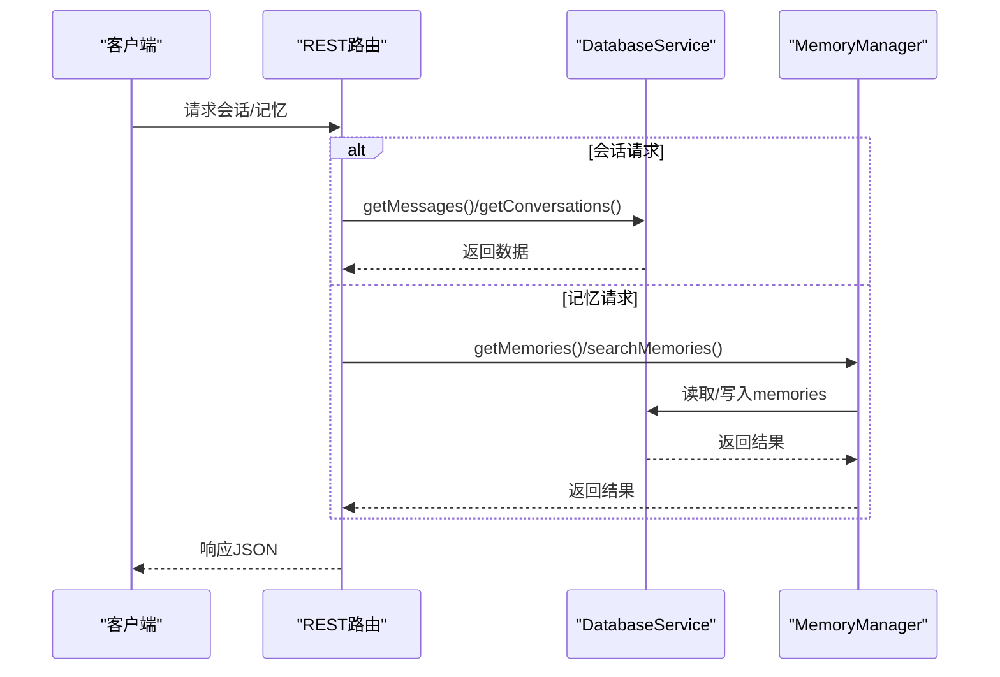
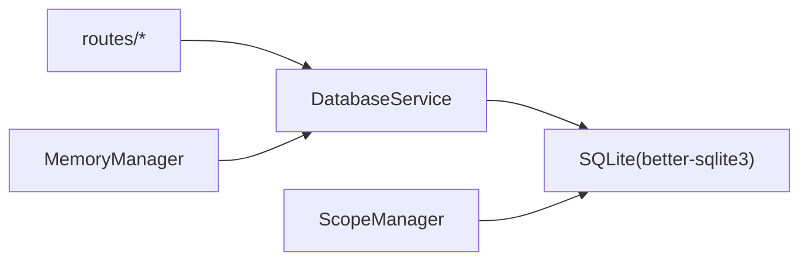

# 数据库设计

<cite>
**本文引用的文件**
- [DatabaseService.js](file://src/services/storage/DatabaseService.js)
- [MemoryManager.js](file://src/services/storage/MemoryManager.js)
- [memoryRoutes.js](file://src/services/routes/memoryRoutes.js)
- [conversationRoutes.js](file://src/services/routes/conversationRoutes.js)
- [ScopeManager.js](file://src/services/scope/ScopeManager.js)
- [config.js](file://config/config.js)
</cite>

## 目录
1. [简介](#简介)
2. [项目结构](#项目结构)
3. [核心组件](#核心组件)
4. [架构总览](#架构总览)
5. [详细组件分析](#详细组件分析)
6. [依赖分析](#依赖分析)
7. [性能考量](#性能考量)
8. [故障排查指南](#故障排查指南)
9. [结论](#结论)
10. [附录](#附录)

## 简介
本文件面向开发者，系统化阐述本项目中 SQLite 数据库的整体架构与表结构设计，重点覆盖以下方面：
- messages 表：会话消息的存储与索引策略，字段作用与去重逻辑
- memories 表：用户/群记忆的结构设计与检索能力
- kv_store 表：键值存储机制与典型应用场景
- 表间关系与数据流：消息、记忆、键值的协同工作方式
- 索引优化策略、查询性能考虑与数据完整性约束
- 扩展指导与最佳实践

## 项目结构
数据库服务集中于存储层，围绕三条核心表展开：
- messages：按 conversation_id 维度存储对话历史
- memories：按 user_id 维度存储用户/群记忆
- kv_store：通用键值存储，支持前缀扫描与更新时间维护

图表来源
- [DatabaseService.js](file://src/services/storage/DatabaseService.js#L47-L77)
- [MemoryManager.js](file://src/services/storage/MemoryManager.js#L12-L31)
- [memoryRoutes.js](file://src/services/routes/memoryRoutes.js#L1-L137)
- [conversationRoutes.js](file://src/services/routes/conversationRoutes.js#L1-L118)

章节来源
- [DatabaseService.js](file://src/services/storage/DatabaseService.js#L19-L78)
- [ScopeManager.js](file://src/services/scope/ScopeManager.js#L42-L87)

## 核心组件
- DatabaseService：负责数据库初始化、表结构创建、索引建立、消息与记忆的增删改查、KV 存取等
- MemoryManager：基于 DatabaseService 的记忆管理，周期性轮询、上下文采集、记忆总结与覆盖
- Routes：对外暴露记忆与会话的 REST 接口，内部调用 MemoryManager 或 DatabaseService

章节来源
- [DatabaseService.js](file://src/services/storage/DatabaseService.js#L19-L809)
- [MemoryManager.js](file://src/services/storage/MemoryManager.js#L12-L800)
- [memoryRoutes.js](file://src/services/routes/memoryRoutes.js#L1-L137)
- [conversationRoutes.js](file://src/services/routes/conversationRoutes.js#L1-L118)

## 架构总览
数据库采用 SQLite + better-sqlite3，WAL 模式提升并发读写性能；三张核心表承担不同职责：
- messages：承载对话历史，支持按会话检索、去重、裁剪
- memories：承载用户/群记忆，支持按用户检索、前缀检索、统计与清理
- kv_store：承载配置、状态、临时数据等键值对

图表来源
- [DatabaseService.js](file://src/services/storage/DatabaseService.js#L49-L76)

## 详细组件分析

### messages 表设计与索引策略
- 字段说明
  - id：自增主键，保证唯一性
  - conversation_id：会话标识，用于分组与检索
  - role：消息角色（如 user/assistant/system）
  - content：消息内容，JSON 序列化存储（含 id、parentId、content、toolCalls 等）
  - timestamp：消息时间戳，用于排序与去重
  - metadata：附加元数据，JSON 序列化
- 索引策略
  - idx_messages_conversation_id：加速按会话检索
  - idx_messages_timestamp：加速按时间排序与裁剪
- 去重与一致性
  - 保存前先检查相同 id 的消息是否存在
  - 保存前检查最近若干条消息内容哈希，避免重复触发
- 查询与维护
  - 支持按会话获取消息列表，支持限制返回条数并保持时间顺序
  - 支持按会话裁剪，仅保留最近 N 条
  - 支持删除会话、清理过期会话、统计消息与会话数量

图表来源
- [DatabaseService.js](file://src/services/storage/DatabaseService.js#L263-L327)

章节来源
- [DatabaseService.js](file://src/services/storage/DatabaseService.js#L49-L58)
- [DatabaseService.js](file://src/services/storage/DatabaseService.js#L263-L327)
- [DatabaseService.js](file://src/services/storage/DatabaseService.js#L352-L378)
- [DatabaseService.js](file://src/services/storage/DatabaseService.js#L425-L442)
- [DatabaseService.js](file://src/services/storage/DatabaseService.js#L448-L504)
- [DatabaseService.js](file://src/services/storage/DatabaseService.js#L545-L557)

### memories 表设计与检索能力
- 字段说明
  - id：自增主键
  - user_id：用户或群标识（支持 group:groupId:topics 等前缀）
  - content：记忆内容
  - source：记忆来源（如 manual、group_context、auto_extract 等）
  - importance：重要性评分（默认 5，用于检索排序）
  - timestamp：创建/更新时间
  - metadata：附加元数据，JSON 序列化
- 索引策略
  - idx_memories_user_id：加速按用户/群检索
  - idx_memories_timestamp：加速按时间排序
- 检索与统计
  - 支持按用户获取记忆列表，按时间倒序
  - 支持按前缀检索（如 group:groupId:user:）
  - 支持按用户检索并按 importance+timestamp 排序
  - 支持统计某用户记忆数量与最早/最晚时间
  - 支持清理用户/全部记忆
- 业务集成
  - MemoryManager 周期性轮询会话，提取用户/群记忆并覆盖式保存
  - 支持按群上下文采集与总结，形成 topics、relations、user: 昵称 的记忆键空间

图表来源
- [MemoryManager.js](file://src/services/storage/MemoryManager.js#L489-L653)
- [DatabaseService.js](file://src/services/storage/DatabaseService.js#L83-L98)
- [DatabaseService.js](file://src/services/storage/DatabaseService.js#L694-L716)

章节来源
- [DatabaseService.js](file://src/services/storage/DatabaseService.js#L60-L70)
- [DatabaseService.js](file://src/services/storage/DatabaseService.js#L103-L120)
- [DatabaseService.js](file://src/services/storage/DatabaseService.js#L125-L164)
- [DatabaseService.js](file://src/services/storage/DatabaseService.js#L195-L211)
- [DatabaseService.js](file://src/services/storage/DatabaseService.js#L216-L229)
- [DatabaseService.js](file://src/services/storage/DatabaseService.js#L178-L190)
- [MemoryManager.js](file://src/services/storage/MemoryManager.js#L489-L653)

### kv_store 表的键值存储机制
- 字段说明
  - key：主键，唯一标识
  - value：值，JSON 序列化存储
  - updated_at：更新时间戳
- 应用场景
  - 存储配置、状态、临时数据
  - 支持前缀扫描，便于批量读取
  - 支持设置/获取/删除键值对
- 与业务的协作
  - 与 MemoryManager 的周期性任务配合，记录轮询时间、上下文缓存等
  - 与 Web 路由配合，提供键值读写接口

图表来源
- [DatabaseService.js](file://src/services/storage/DatabaseService.js#L748-L775)
- [DatabaseService.js](file://src/services/storage/DatabaseService.js#L781-L805)

章节来源
- [DatabaseService.js](file://src/services/storage/DatabaseService.js#L72-L76)
- [DatabaseService.js](file://src/services/storage/DatabaseService.js#L748-L805)

### 表之间的关系与数据流
- messages 与 memories：分别按 conversation_id 与 user_id 维度组织，彼此独立但共同构成“历史+记忆”的双轨数据
- kv_store：为两类表提供元数据与运行态状态支撑（如轮询时间、上下文缓存）
- 路由层：memoryRoutes 与 conversationRoutes 分别对接记忆与会话的 CRUD 与查询

图表来源
- [conversationRoutes.js](file://src/services/routes/conversationRoutes.js#L18-L72)
- [memoryRoutes.js](file://src/services/routes/memoryRoutes.js#L9-L134)
- [DatabaseService.js](file://src/services/storage/DatabaseService.js#L352-L378)
- [MemoryManager.js](file://src/services/storage/MemoryManager.js#L489-L653)

## 依赖分析
- DatabaseService 依赖 better-sqlite3，负责表结构、索引、CRUD、统计与清理
- MemoryManager 依赖 DatabaseService 与 LLM 服务，负责周期性任务与记忆总结
- Routes 依赖 MemoryManager 与 DatabaseService，提供对外接口
- ScopeManager 在同一数据库中还维护作用域相关表，与存储层共用数据库实例

图表来源
- [DatabaseService.js](file://src/services/storage/DatabaseService.js#L19-L45)
- [ScopeManager.js](file://src/services/scope/ScopeManager.js#L42-L87)

章节来源
- [DatabaseService.js](file://src/services/storage/DatabaseService.js#L19-L45)
- [ScopeManager.js](file://src/services/scope/ScopeManager.js#L42-L87)

## 性能考量
- 索引策略
  - messages：按 conversation_id 与 timestamp 建立索引，满足会话检索与时间排序
  - memories：按 user_id 与 timestamp 建立索引，满足用户检索与时间排序
- 查询优化
  - 会话消息：按时间倒序取最近 N 条，使用子查询保证最终顺序正确
  - 记忆检索：按 importance+timestamp 排序，限制返回条数
  - 前缀检索：使用 LIKE 前缀匹配，注意前缀长度与模式复杂度
- 去重与一致性
  - 消息保存前进行 ID 与内容哈希去重，避免重复触发
- 并发与事务
  - WAL 模式提升并发读写性能，适合高并发场景
- 数据清理
  - 支持按会话裁剪、清理过期会话、清理用户/全部记忆，避免历史无限增长

章节来源
- [DatabaseService.js](file://src/services/storage/DatabaseService.js#L57-L58)
- [DatabaseService.js](file://src/services/storage/DatabaseService.js#L69-L70)
- [DatabaseService.js](file://src/services/storage/DatabaseService.js#L263-L327)
- [DatabaseService.js](file://src/services/storage/DatabaseService.js#L352-L378)
- [DatabaseService.js](file://src/services/storage/DatabaseService.js#L425-L442)
- [DatabaseService.js](file://src/services/storage/DatabaseService.js#L545-L557)

## 故障排查指南
- 搜索记忆报错（LIKE 模式复杂）
  - 现象：LIKE 或 GLOB 模式过于复杂导致错误
  - 处理：限制查询长度、转义特殊字符、捕获异常并返回空数组
- JSON 解析异常
  - 现象：消息内容或元数据 JSON 解析失败
  - 处理：捕获异常并记录日志，避免中断流程
- 数据库未初始化
  - 现象：首次访问时报错
  - 处理：ensureInit 自动初始化，确保数据目录存在
- 记忆覆盖式保存失败
  - 现象：轮询总结时保存失败
  - 处理：记录统计并忽略，不影响主流程

章节来源
- [DatabaseService.js](file://src/services/storage/DatabaseService.js#L125-L164)
- [DatabaseService.js](file://src/services/storage/DatabaseService.js#L405-L408)
- [DatabaseService.js](file://src/services/storage/DatabaseService.js#L234-L238)
- [MemoryManager.js](file://src/services/storage/MemoryManager.js#L621-L638)

## 结论
本数据库设计以“会话历史 + 用户记忆 + 通用键值”为核心，通过合理的索引与查询策略，兼顾检索效率与数据一致性。messages 与 memories 分属不同维度，kv_store 提供灵活的状态与配置支撑。配合 MemoryManager 的周期性任务与 Routes 的接口封装，形成从数据到业务闭环的完整方案。

## 附录

### 表结构与字段说明（摘要）
- messages
  - 字段：id、conversation_id、role、content、timestamp、metadata
  - 索引：conversation_id、timestamp
- memories
  - 字段：id、user_id、content、source、importance、timestamp、metadata
  - 索引：user_id、timestamp
- kv_store
  - 字段：key、value、updated_at

章节来源
- [DatabaseService.js](file://src/services/storage/DatabaseService.js#L49-L76)

### 扩展指导与最佳实践
- 新增索引
  - 若存在高频按 user_id+importance 查询，可考虑复合索引
  - 若存在按 source 过滤，可考虑为 memories 增加 source 索引
- 查询优化
  - 限制返回条数与时间窗口，避免全表扫描
  - 使用 EXPLAIN QUERY PLAN 分析慢查询
- 数据清理
  - 定期清理过期会话与记忆，控制表规模
  - 使用批量删除与事务包裹，减少锁竞争
- 元数据管理
  - 将配置与运行态状态放入 kv_store，便于统一管理与前缀扫描
- 兼容性
  - 保持 JSON 字段的序列化/反序列化健壮性，增加异常处理
- 安全性
  - 对外部输入进行长度与字符限制，防止 SQL 注入与模式复杂度问题