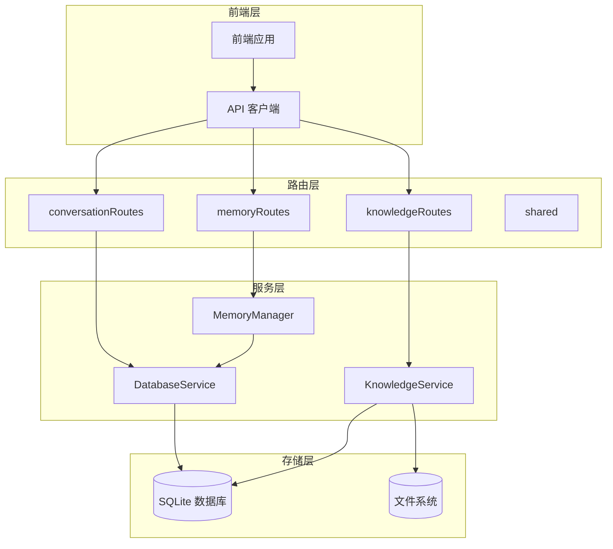
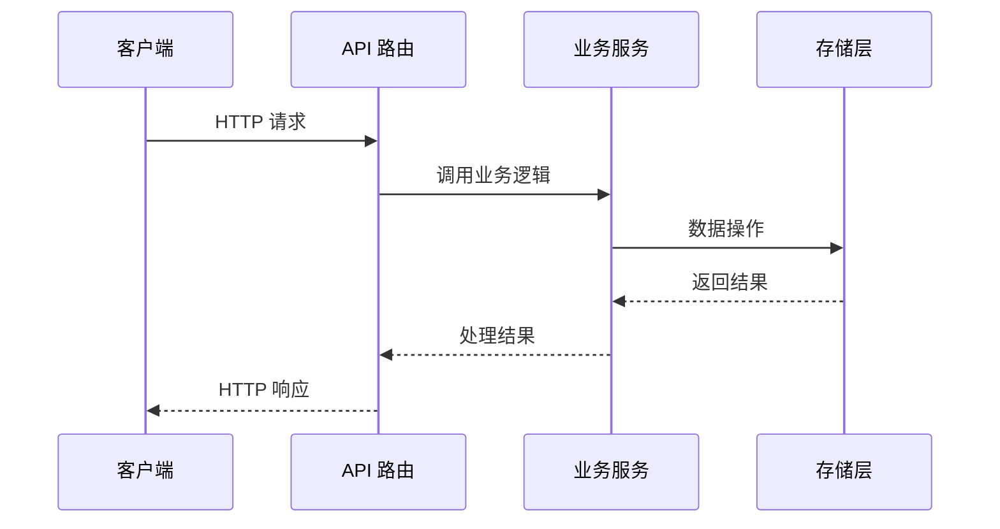
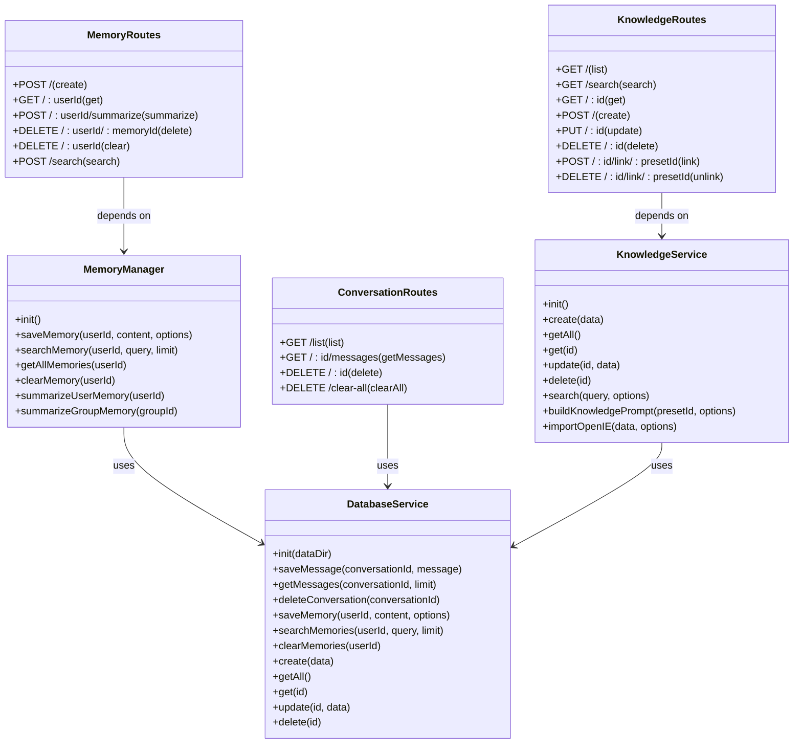
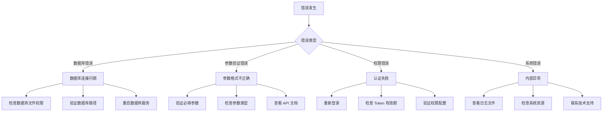

# 数据操作接口

<cite>
**本文档引用的文件**
- [DatabaseService.js](file://src/services/storage/DatabaseService.js)
- [KnowledgeService.js](file://src/services/storage/KnowledgeService.js)
- [MemoryManager.js](file://src/services/storage/MemoryManager.js)
- [memoryRoutes.js](file://src/services/routes/memoryRoutes.js)
- [conversationRoutes.js](file://src/services/routes/conversationRoutes.js)
- [knowledgeRoutes.js](file://src/services/routes/knowledgeRoutes.js)
- [shared.js](file://src/services/routes/shared.js)
- [api.ts](file://frontend/lib/api.ts)
- [config.js](file://config/config.js)
</cite>

## 目录
1. [简介](#简介)
2. [项目结构](#项目结构)
3. [核心组件](#核心组件)
4. [架构概览](#架构概览)
5. [详细组件分析](#详细组件分析)
6. [依赖关系分析](#依赖关系分析)
7. [性能考虑](#性能考虑)
8. [故障排除指南](#故障排除指南)
9. [结论](#结论)

## 简介

本文件档为 ChatGPT 插件的数据操作接口提供完整的 API 参考文档。该插件基于 Yunzai 框架构建，提供了完善的消息存储、记忆管理和知识库操作功能。文档涵盖了所有公共数据操作方法和接口规范，包括：

- **消息存储接口**：saveMessage、getMessages、deleteConversation 等方法的参数、返回值和使用示例
- **记忆管理接口**：saveMemory、searchMemories、clearMemories 等方法的完整规范
- **知识库操作接口**：知识的增删改查和批量操作方法
- **错误处理机制**：异常情况和调试技巧
- **最佳实践**：接口使用的最佳实践和性能优化建议

## 项目结构

该项目采用模块化架构设计，主要分为以下几个核心模块：



**图表来源**
- [DatabaseService.js](file://src/services/storage/DatabaseService.js#L1-L809)
- [KnowledgeService.js](file://src/services/storage/KnowledgeService.js#L1-L931)
- [MemoryManager.js](file://src/services/storage/MemoryManager.js#L1-L1538)

**章节来源**
- [DatabaseService.js](file://src/services/storage/DatabaseService.js#L1-L809)
- [KnowledgeService.js](file://src/services/storage/KnowledgeService.js#L1-L931)
- [MemoryManager.js](file://src/services/storage/MemoryManager.js#L1-L1538)

## 核心组件

### 数据库服务 (DatabaseService)

DatabaseService 是整个系统的核心数据存储组件，负责：
- 消息存储和检索
- 用户记忆管理
- 键值对存储
- 数据库初始化和维护

主要特性：
- 使用 SQLite 数据库进行高性能本地存储
- 支持消息去重和内容哈希
- 提供完整的 CRUD 操作
- 支持索引优化查询性能

**章节来源**
- [DatabaseService.js](file://src/services/storage/DatabaseService.js#L19-L809)

### 知识库服务 (KnowledgeService)

KnowledgeService 提供完整的知识库管理功能：
- 文档的创建、读取、更新、删除
- 知识库内容的搜索和关联
- OpenIE 格式导入支持
- 预设与知识库的关联管理

**章节来源**
- [KnowledgeService.js](file://src/services/storage/KnowledgeService.js#L31-L931)

### 记忆管理器 (MemoryManager)

MemoryManager 负责智能记忆管理：
- 自动从对话中提取用户记忆
- 周期性轮询分析对话历史
- 群聊上下文记忆管理
- 记忆的覆盖式总结和更新

**章节来源**
- [MemoryManager.js](file://src/services/storage/MemoryManager.js#L12-L1538)

## 架构概览

系统采用分层架构设计，确保了良好的可维护性和扩展性：



**图表来源**
- [memoryRoutes.js](file://src/services/routes/memoryRoutes.js#L1-L137)
- [conversationRoutes.js](file://src/services/routes/conversationRoutes.js#L1-L118)
- [knowledgeRoutes.js](file://src/services/routes/knowledgeRoutes.js#L1-L131)

## 详细组件分析

### 消息存储接口

#### saveMessage 方法

**功能描述**：保存消息到数据库，包含智能去重机制

**参数规范**：
- `conversationId` (string): 会话标识符
- `message` (Object): 消息对象，包含以下字段：
  - `id` (string, 可选): 消息唯一标识
  - `parentId` (string, 可选): 父消息标识
  - `content` (any): 消息内容
  - `toolCalls` (Array, 可选): 工具调用信息
  - `metadata` (Object, 可选): 元数据信息
  - `timestamp` (number, 可选): 时间戳

**返回值**：void

**实现逻辑**：
1. 检查是否存在相同 ID 的消息（基于内容 LIKE 匹配）
2. 检查最近 5 条消息是否有相同内容
3. 使用 JSON 序列化存储完整消息对象
4. 自动设置时间戳

**章节来源**
- [DatabaseService.js](file://src/services/storage/DatabaseService.js#L258-L327)

#### getMessages 方法

**功能描述**：获取指定会话的所有消息

**参数规范**：
- `conversationId` (string): 会话标识符
- `limit` (number, 可选): 获取消息数量限制，默认 100

**返回值**：Array<Object>

**消息对象结构**：
- `id` (string): 消息唯一标识
- `parentId` (string): 父消息标识
- `role` (string): 消息角色（user/assistant/system）
- `content` (any): 消息内容
- `toolCalls` (Array): 工具调用信息
- `timestamp` (number): 时间戳
- `metadata` (Object): 元数据信息

**实现逻辑**：
1. 支持获取最后 N 条消息但保持升序排列
2. 自动解析 JSON 内容
3. 兼容新旧两种消息格式
4. 过滤解析失败的消息

**章节来源**
- [DatabaseService.js](file://src/services/storage/DatabaseService.js#L346-L378)

#### deleteConversation 方法

**功能描述**：删除指定会话的所有消息

**参数规范**：
- `conversationId` (string): 会话标识符

**返回值**：void

**章节来源**
- [DatabaseService.js](file://src/services/storage/DatabaseService.js#L411-L418)

### 记忆管理接口

#### saveMemory 方法

**功能描述**：保存用户记忆

**参数规范**：
- `userId` (string): 用户标识符
- `content` (string): 记忆内容
- `options` (Object, 可选): 选项配置
  - `source` (string): 记忆来源，默认 'manual'
  - `importance` (number): 重要程度，默认 5
  - `metadata` (Object): 元数据信息

**返回值**：number

**实现逻辑**：
1. 自动设置时间戳
2. JSON 序列化元数据
3. 返回新插入记录的 ID

**章节来源**
- [DatabaseService.js](file://src/services/storage/DatabaseService.js#L80-L98)

#### searchMemories 方法

**功能描述**：搜索用户记忆

**参数规范**：
- `userId` (string): 用户标识符
- `query` (string): 搜索关键词
- `limit` (number): 结果数量限制，默认 10

**返回值**：Array<Object>

**搜索优化**：
- 限制查询字符串长度为 200 字符
- 转义 LIKE 特殊字符
- 按重要性和时间排序

**章节来源**
- [DatabaseService.js](file://src/services/storage/DatabaseService.js#L122-L164)

#### clearMemories 方法

**功能描述**：清空用户所有记忆

**参数规范**：
- `userId` (string): 用户标识符

**返回值**：number

**实现逻辑**：
- 删除指定用户的所有记忆记录
- 返回删除的记录数量

**章节来源**
- [DatabaseService.js](file://src/services/storage/DatabaseService.js#L175-L182)

### 知识库操作接口

#### create 方法

**功能描述**：创建知识库文档

**参数规范**：
- `data` (Object): 文档数据
  - `id` (string): 文档 ID（可选）
  - `name` (string): 文档名称
  - `content` (string): 文档内容
  - `type` (string): 文档类型（text/markdown/json）
  - `tags` (Array): 标签数组
  - `presetIds` (Array): 关联的预设 ID 数组
  - `saveToFile` (boolean): 是否保存到文件，默认 true

**返回值**：Object

**章节来源**
- [KnowledgeService.js](file://src/services/storage/KnowledgeService.js#L258-L323)

#### search 方法

**功能描述**：搜索知识库文档

**参数规范**：
- `query` (string): 搜索关键词
- `options` (Object): 选项配置
  - `limit` (number): 结果数量限制，默认 10
  - `presetId` (string): 预设 ID（可选）

**返回值**：Array<Object>

**搜索算法**：
- 标题精确匹配权重高
- 实体标题匹配（【实体名】格式）
- 内容关键词匹配
- 标签匹配
- 按相关度评分排序

**章节来源**
- [KnowledgeService.js](file://src/services/storage/KnowledgeService.js#L744-L827)

#### buildKnowledgePrompt 方法

**功能描述**：构建知识库提示词

**参数规范**：
- `presetId` (string): 预设 ID
- `options` (Object): 选项配置
  - `maxLength` (number): 最大长度，默认 15000
  - `separator` (string): 分隔符，默认 '\n\n'
  - `includeTriples` (boolean): 是否包含三元组，默认 true

**返回值**：string

**章节来源**
- [KnowledgeService.js](file://src/services/storage/KnowledgeService.js#L470-L543)

## 依赖关系分析

系统各组件之间的依赖关系如下：



**图表来源**
- [DatabaseService.js](file://src/services/storage/DatabaseService.js#L19-L809)
- [KnowledgeService.js](file://src/services/storage/KnowledgeService.js#L31-L931)
- [MemoryManager.js](file://src/services/storage/MemoryManager.js#L12-L1538)
- [memoryRoutes.js](file://src/services/routes/memoryRoutes.js#L1-L137)
- [conversationRoutes.js](file://src/services/routes/conversationRoutes.js#L1-L118)
- [knowledgeRoutes.js](file://src/services/routes/knowledgeRoutes.js#L1-L131)

**章节来源**
- [DatabaseService.js](file://src/services/storage/DatabaseService.js#L19-L809)
- [KnowledgeService.js](file://src/services/storage/KnowledgeService.js#L31-L931)
- [MemoryManager.js](file://src/services/storage/MemoryManager.js#L12-L1538)

## 性能考虑

### 数据库优化策略

1. **索引优化**
   - 会话 ID 索引：加速消息查询
   - 时间戳索引：支持时间范围查询
   - 用户 ID 索引：支持用户相关查询

2. **WAL 模式**
   - 启用写前日志模式提升并发性能
   - 支持更好的读写分离

3. **消息去重**
   - 基于内容哈希的智能去重
   - 防止重复触发和消息风暴

### 缓存策略

1. **内存缓存**
   - 群聊消息缓冲区（最多 100 条）
   - 记忆上下文缓存
   - 预设知识库缓存

2. **配置缓存**
   - 配置文件缓存
   - 统计数据缓存

### 异步处理

1. **周期性任务**
   - 记忆轮询分析（默认 5 分钟）
   - 群聊上下文采集（默认 10 分钟）
   - 自动清理过期数据

2. **批量操作**
   - 知识库文档批量导入
   - 记忆批量清理
   - 会话批量删除

## 故障排除指南

### 常见错误类型



**图表来源**
- [shared.js](file://src/services/routes/shared.js#L7-L69)

### 错误代码对照表

| 错误代码 | 错误类型 | 描述 |
|---------|---------|------|
| 0 | SUCCESS | 操作成功 |
| -1 | UNKNOWN | 未知错误 |
| 1001 | VALIDATION_FAILED | 参数验证失败 |
| 1002 | AUTH_REQUIRED | 需要登录认证 |
| 1003 | AUTH_INVALID | 认证信息无效 |
| 2001 | NOT_FOUND | 资源不存在 |
| 3001 | CHANNEL_ERROR | 渠道请求出错 |
| 4001 | RATE_LIMITED | 请求频率过高 |
| 5001 | INTERNAL_ERROR | 系统内部错误 |

### 调试技巧

1. **启用调试模式**
   ```javascript
   // 在配置中启用调试
   config.set('basic.debug', true)
   ```

2. **查看日志**
   - 检查数据库操作日志
   - 监控 API 调用统计
   - 查看错误堆栈信息

3. **性能监控**
   - 监控数据库查询时间
   - 跟踪内存使用情况
   - 分析 API 响应时间

**章节来源**
- [shared.js](file://src/services/routes/shared.js#L7-L150)

## 结论

本数据操作接口提供了完整而强大的数据管理能力，具有以下特点：

1. **功能完整性**：涵盖消息存储、记忆管理和知识库操作的完整生命周期
2. **性能优化**：采用索引优化、WAL 模式和智能缓存策略
3. **易用性**：提供清晰的 API 接口和完善的错误处理机制
4. **可扩展性**：模块化设计支持功能扩展和定制

开发者在使用过程中应重点关注：
- 合理设置查询限制，避免大量数据操作
- 利用去重机制防止数据冗余
- 定期清理过期数据，维护系统性能
- 善用异步处理，避免阻塞主线程

通过遵循本文档的最佳实践，可以充分发挥该接口的性能优势，构建稳定可靠的应用程序。