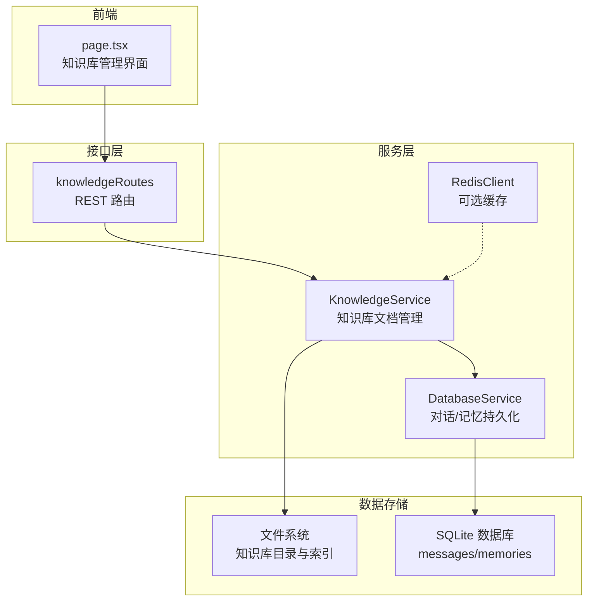
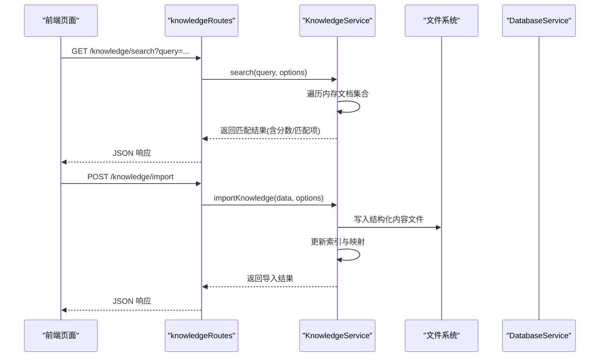
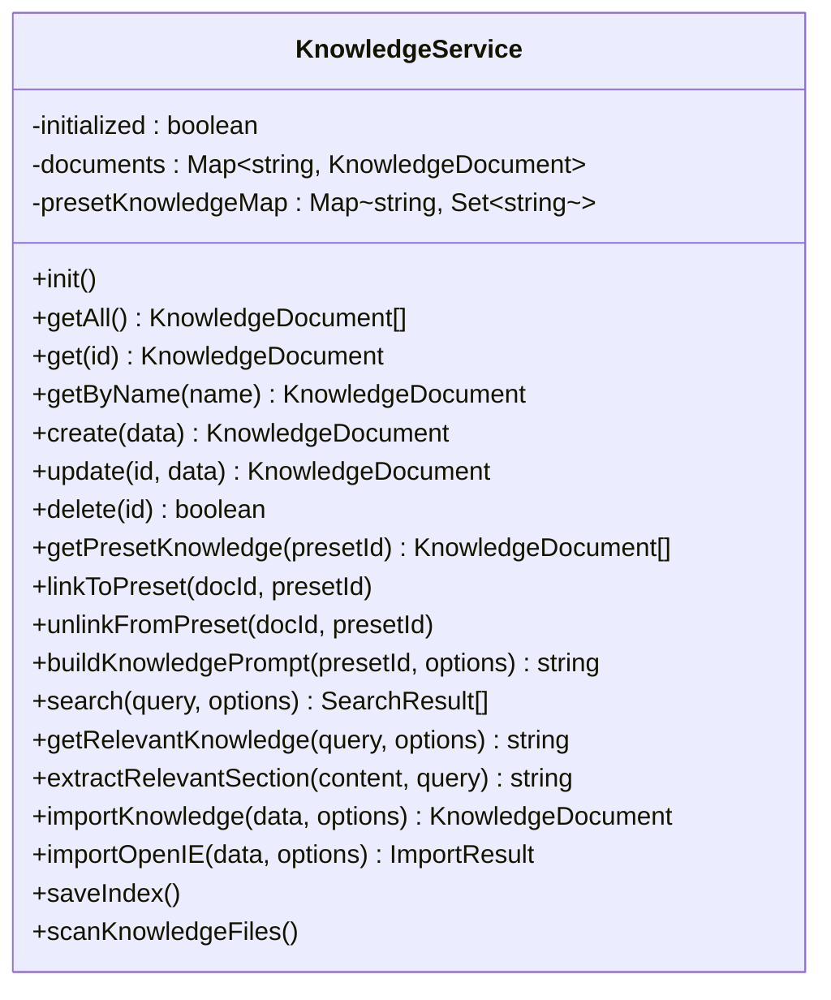
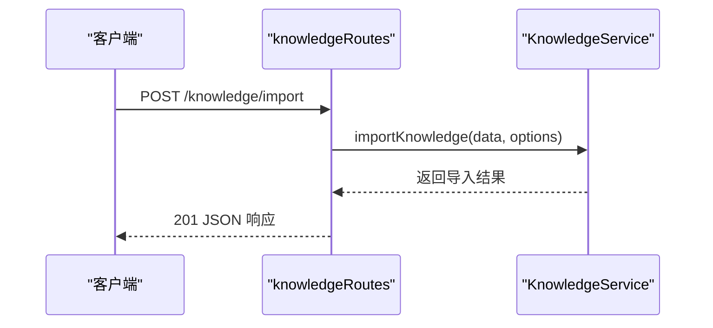
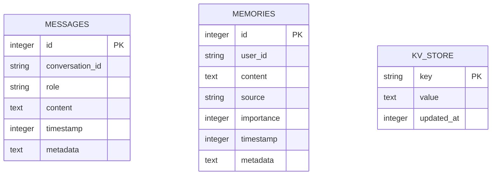
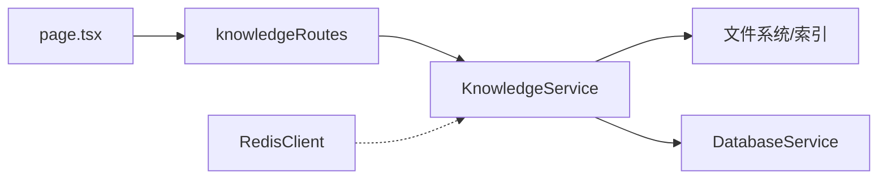

# 知识库服务

## 目录
1. [简介](#简介)
2. [项目结构](#项目结构)
3. [核心组件](#核心组件)
4. [架构总览](#架构总览)
5. [详细组件分析](#详细组件分析)
6. [依赖关系分析](#依赖关系分析)
7. [性能考虑](#性能考虑)
8. [故障排除指南](#故障排除指南)
9. [结论](#结论)
10. [附录](#附录)

## 简介
本技术文档围绕知识库服务展开，系统阐述知识的提取、存储、组织与检索机制，涵盖数据结构设计（元数据管理、分类体系、标签系统）、导入导出功能（支持格式与转换算法）、全文检索（包含模糊匹配与相关性排序）、版本管理与更新策略、缓存机制，以及维护工具、批量操作与性能优化建议。知识库服务通过文件系统持久化与索引管理实现高效的知识组织，并提供 Web 管理面板进行可视化维护。

## 项目结构
知识库服务位于插件根目录下的服务层与前端管理界面中，核心文件包括：
- 存储服务：KnowledgeService（知识文档管理）、DatabaseService（对话与记忆持久化）
- 路由接口：knowledgeRoutes（REST API）
- 缓存：RedisClient（可选）
- 前端：Next.js 页面组件（知识库管理界面）

图表来源
- [KnowledgeService.js](file://src/services/storage/KnowledgeService.js#L31-L67)
- [knowledgeRoutes.js](file://src/services/routes/knowledgeRoutes.js#L1-L131)
- [DatabaseService.js](file://src/services/storage/DatabaseService.js#L19-L78)
- [RedisClient.js](file://src/core/cache/RedisClient.js#L4-L41)
- [page.tsx](file://frontend/app/(dashboard)/knowledge/page.tsx#L59-L125)

章节来源
- [index.js](file://index.js#L31-L36)
- [README.md](file://README.md#L356-L396)

## 核心组件
- 知识库服务（KnowledgeService）：负责知识文档的创建、读取、更新、删除、索引与搜索；支持 OpenIE 格式导入与结构化内容构建；提供预设关联与提示词构建能力。
- 存储服务（DatabaseService）：基于 SQLite 的对话与记忆持久化，提供消息去重、索引与统计功能。
- 路由接口（knowledgeRoutes）：提供知识库的 REST API，包括列表、搜索、创建、导入、更新、删除、关联/取消关联预设等。
- 缓存（RedisClient）：可选的 Redis 缓存客户端，提供键值、列表、哈希等常用操作。
- 前端界面（page.tsx）：知识库管理的可视化界面，支持搜索、导入、编辑、删除与预设关联。

章节来源
- [KnowledgeService.js](file://src/services/storage/KnowledgeService.js#L31-L67)
- [knowledgeRoutes.js](file://src/services/routes/knowledgeRoutes.js#L9-L131)
- [DatabaseService.js](file://src/services/storage/DatabaseService.js#L19-L78)
- [RedisClient.js](file://src/core/cache/RedisClient.js#L4-L41)
- [page.tsx](file://frontend/app/(dashboard)/knowledge/page.tsx#L59-L125)

## 架构总览
知识库服务采用“文件系统 + 索引 + 数据库”的混合存储架构：
- 知识文档内容以文件形式存储在 data/knowledge 目录，索引文件 index.json 记录元数据与文件路径。
- 搜索与提示词构建在内存 Map 中进行，提高检索效率。
- 对话与记忆使用 SQLite 持久化，配合消息去重与索引提升查询性能。
- 可选 Redis 用于缓存热点数据与会话状态。

图表来源
- [knowledgeRoutes.js](file://src/services/routes/knowledgeRoutes.js#L30-L41)
- [KnowledgeService.js](file://src/services/storage/KnowledgeService.js#L750-L827)
- [KnowledgeService.js](file://src/services/storage/KnowledgeService.js#L551-L742)

## 详细组件分析

### 知识库服务（KnowledgeService）
- 数据结构与元数据管理
  - 文档对象包含：id、name、content、type（text/markdown/json）、tags、createdAt、updatedAt、presetIds、filePath（可选）。
  - 内存 Map 存储文档，Map<String, KnowledgeDocument>；预设-文档映射为 Map<String, Set<String>>。
- 存储与索引
  - 索引文件 index.json 记录文档元数据与文件路径，不保存完整内容；内容保存在独立文件中，避免索引膨胀。
  - 初始化时扫描目录，自动发现未索引的新文件并创建文档。
- CRUD 操作
  - create/update/delete：确保持久化（写入文件/更新索引），并维护预设映射。
  - 支持内容截断与文件命名安全处理，避免非法字符与长度限制。
- 预设关联与提示词构建
  - linkToPreset/unlinkFromPreset：建立/解除预设与文档的关联。
  - buildKnowledgePrompt：按预设聚合相关文档，智能截断与格式化，生成提示词。
- 搜索与相关性排序
  - search：支持按标题、实体标题、内容关键词、标签匹配，计算综合分数并排序。
  - getRelevantKnowledge：基于查询动态提取相关片段，限制总长度。
  - extractRelevantSection：按 Markdown 标题层级提取相关内容片段。
- 导入导出与格式转换
  - importOpenIE：解析 OpenIE JSON（docs 数组），按实体为中心构建结构化内容（实体关系、知识条目、快速查询索引），支持合并/替换策略。
  - importKnowledge：统一导入入口，内部根据 format 选择 raw 或 openie 流程。
- 版本管理与更新策略
  - 通过 updatedAt 字段跟踪变更；文件命名包含 ID 前缀，避免冲突。
  - 自动清理损坏文档记录，延迟保存索引以保证一致性。

图表来源
- [KnowledgeService.js](file://src/services/storage/KnowledgeService.js#L31-L67)
- [KnowledgeService.js](file://src/services/storage/KnowledgeService.js#L232-L405)
- [KnowledgeService.js](file://src/services/storage/KnowledgeService.js#L475-L543)
- [KnowledgeService.js](file://src/services/storage/KnowledgeService.js#L750-L827)
- [KnowledgeService.js](file://src/services/storage/KnowledgeService.js#L835-L927)
- [KnowledgeService.js](file://src/services/storage/KnowledgeService.js#L551-L742)

章节来源
- [KnowledgeService.js](file://src/services/storage/KnowledgeService.js#L18-L29)
- [KnowledgeService.js](file://src/services/storage/KnowledgeService.js#L38-L67)
- [KnowledgeService.js](file://src/services/storage/KnowledgeService.js#L72-L134)
- [KnowledgeService.js](file://src/services/storage/KnowledgeService.js#L262-L323)
- [KnowledgeService.js](file://src/services/storage/KnowledgeService.js#L331-L377)
- [KnowledgeService.js](file://src/services/storage/KnowledgeService.js#L384-L405)
- [KnowledgeService.js](file://src/services/storage/KnowledgeService.js#L412-L422)
- [KnowledgeService.js](file://src/services/storage/KnowledgeService.js#L429-L446)
- [KnowledgeService.js](file://src/services/storage/KnowledgeService.js#L453-L467)
- [KnowledgeService.js](file://src/services/storage/KnowledgeService.js#L475-L543)
- [KnowledgeService.js](file://src/services/storage/KnowledgeService.js#L551-L742)
- [KnowledgeService.js](file://src/services/storage/KnowledgeService.js#L750-L827)
- [KnowledgeService.js](file://src/services/storage/KnowledgeService.js#L835-L927)

### 路由接口（knowledgeRoutes）
- 提供 REST API：
  - GET /knowledge：列出知识库文档（列表模式返回摘要）。
  - GET /knowledge/search：按关键词搜索，支持 presetId 限定与 limit 控制。
  - GET /knowledge/:id：获取单个文档。
  - POST /knowledge：创建文档。
  - POST /knowledge/import：导入知识库（支持 raw/openie）。
  - PUT /knowledge/:id：更新文档。
  - DELETE /knowledge/:id：删除文档。
  - POST /knowledge/:id/link/:presetId：关联到预设。
  - DELETE /knowledge/:id/link/:presetId：取消关联。
- 统一响应包装（ChaiteResponse），异常捕获并返回错误信息。

图表来源
- [knowledgeRoutes.js](file://src/services/routes/knowledgeRoutes.js#L68-L79)
- [knowledgeRoutes.js](file://src/services/routes/knowledgeRoutes.js#L56-L67)

章节来源
- [knowledgeRoutes.js](file://src/services/routes/knowledgeRoutes.js#L9-L131)

### 存储服务（DatabaseService）
- 基于 SQLite 的对话与记忆持久化，表结构：
  - messages：会话消息（conversation_id、role、content、timestamp、metadata）。
  - memories：用户记忆（user_id、content、source、importance、timestamp、metadata）。
  - kv_store：键值存储。
- 索引优化：messages 表按 conversation_id 与 timestamp 建立索引。
- 消息去重：基于消息 ID 与内容哈希的双重去重策略，防止重复保存。
- 记忆搜索：支持按用户 ID 与关键词搜索，转义特殊字符避免 LIKE 模式复杂度问题。
- 统计与清理：提供统计接口与过期会话清理。

图表来源
- [DatabaseService.js](file://src/services/storage/DatabaseService.js#L47-L77)

章节来源
- [DatabaseService.js](file://src/services/storage/DatabaseService.js#L19-L78)
- [DatabaseService.js](file://src/services/storage/DatabaseService.js#L263-L344)
- [DatabaseService.js](file://src/services/storage/DatabaseService.js#L124-L164)

### 缓存（RedisClient）
- 可选 Redis 客户端，支持连接配置与事件监听。
- 提供常用操作：get/set/del、keys、lpush/lrange/ltrim、hset/hget/hgetall/hincrby、expire/incr/llen/exists 等。
- 适用于缓存热点知识、会话状态与统计指标。

章节来源
- [RedisClient.js](file://src/core/cache/RedisClient.js#L4-L41)
- [RedisClient.js](file://src/core/cache/RedisClient.js#L43-L126)

### 前端界面（page.tsx）
- 知识库管理页面，支持：
  - 列表展示、搜索、刷新、导入、新建/编辑、删除、关联/取消关联预设。
  - 导入支持 OpenIE 与原始文本/JSON，自动检测格式，提供合并模式（创建/合并/替换）。
  - Markdown 编辑器，支持 Markdown 预览与编辑。
- 与后端 API 交互，统一错误提示与加载状态。

章节来源
- [page.tsx](file://frontend/app/(dashboard)/knowledge/page.tsx#L59-L125)
- [page.tsx](file://frontend/app/(dashboard)/knowledge/page.tsx#L247-L259)
- [page.tsx](file://frontend/app/(dashboard)/knowledge/page.tsx#L313-L359)

## 依赖关系分析
- 知识库服务依赖文件系统与索引文件，通过 Map 维护内存数据结构，提供高性能检索。
- 路由层依赖知识库服务，统一处理异常与响应。
- 存储服务与数据库耦合，提供消息去重与索引优化。
- 前端通过 API 与后端交互，实现知识库的可视化管理。

图表来源
- [knowledgeRoutes.js](file://src/services/routes/knowledgeRoutes.js#L1-L131)
- [KnowledgeService.js](file://src/services/storage/KnowledgeService.js#L31-L67)
- [DatabaseService.js](file://src/services/storage/DatabaseService.js#L19-L78)
- [RedisClient.js](file://src/core/cache/RedisClient.js#L4-L41)
- [page.tsx](file://frontend/app/(dashboard)/knowledge/page.tsx#L59-L125)

章节来源
- [knowledgeRoutes.js](file://src/services/routes/knowledgeRoutes.js#L1-L131)
- [KnowledgeService.js](file://src/services/storage/KnowledgeService.js#L31-L67)
- [DatabaseService.js](file://src/services/storage/DatabaseService.js#L19-L78)
- [RedisClient.js](file://src/core/cache/RedisClient.js#L4-L41)
- [page.tsx](file://frontend/app/(dashboard)/knowledge/page.tsx#L59-L125)

## 性能考虑
- 检索性能
  - 内存 Map 存储文档，O(1) 获取；搜索遍历文档集合，按关键词与实体标题加权评分，适合中小规模知识库。
  - 建议：对大规模知识库，可引入倒排索引或向量检索（需扩展实现）。
- 文件系统与索引
  - 索引文件仅保存元数据，内容单独文件存储，避免索引膨胀；自动扫描新增文件，减少人工维护。
- SQLite 优化
  - 为 messages 表建立索引，加速按会话与时间查询；消息去重减少重复 IO。
- 缓存策略
  - Redis 可缓存热点知识与统计信息，降低后端压力；注意 TTL 与失效策略。
- 前端交互
  - 列表模式返回摘要，按需请求完整内容；导入时自动检测格式，减少错误重试。

## 故障排除指南
- 知识库初始化失败
  - 确认 data/knowledge 目录存在且具备写权限；检查 index.json 格式与文件完整性。
- 导入失败
  - OpenIE 格式需包含 docs 数组；非 JSON 文件按原始文本导入；合并模式选择错误会导致覆盖或重复。
- 搜索无结果
  - 确认关键词长度与分词；预设限定搜索范围；检查标签与实体标题匹配。
- 消息去重异常
  - 检查消息 ID 与内容哈希逻辑；确认最近消息去重阈值设置。
- Redis 连接问题
  - 检查配置项 redis.enabled、host、port、password；确认网络连通性。

章节来源
- [KnowledgeService.js](file://src/services/storage/KnowledgeService.js#L72-L134)
- [KnowledgeService.js](file://src/services/storage/KnowledgeService.js#L551-L742)
- [DatabaseService.js](file://src/services/storage/DatabaseService.js#L263-L344)
- [RedisClient.js](file://src/core/cache/RedisClient.js#L10-L41)

## 结论
知识库服务通过文件系统与索引的组合实现了轻量级、易维护的知识管理能力，配合 SQLite 的对话与记忆持久化，满足日常知识组织与检索需求。前端管理界面提供直观的操作体验，支持导入导出、搜索与预设关联。对于更大规模的知识库，建议引入向量检索与分布式缓存以进一步提升性能与可扩展性。

## 附录
- 支持的数据格式
  - OpenIE：包含 docs 数组，每条包含 extracted_entities、extracted_triples、passage 等字段。
  - 原始文本/JSON：按内容直接导入，支持 text/markdown/json 类型。
- 相关性排序算法要点
  - 标题匹配权重高；实体标题匹配额外加分；内容关键词出现次数决定权重；标签匹配辅助评分；最终按综合分数降序排列。
- 维护工具与批量操作
  - 前端支持批量导入、搜索、关联/取消关联预设；后端提供 REST API 支持自动化脚本集成。
- 性能优化建议
  - 大规模知识库：引入倒排索引或向量检索；使用 Redis 缓存热点知识；拆分知识库按主题或预设分区。
  - 存储优化：定期清理损坏文档与过期索引；合理设置文件命名与大小限制。
