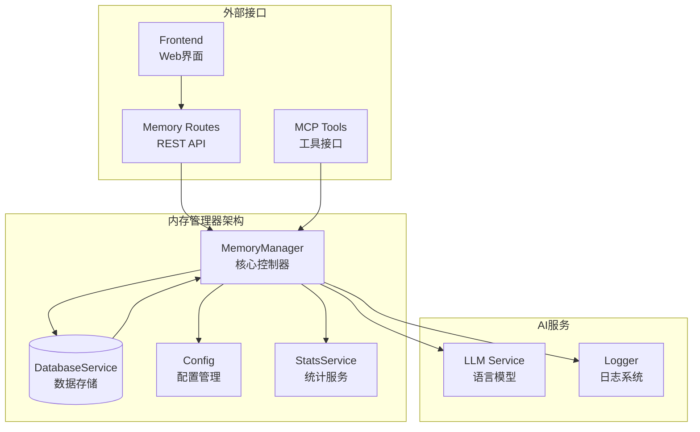
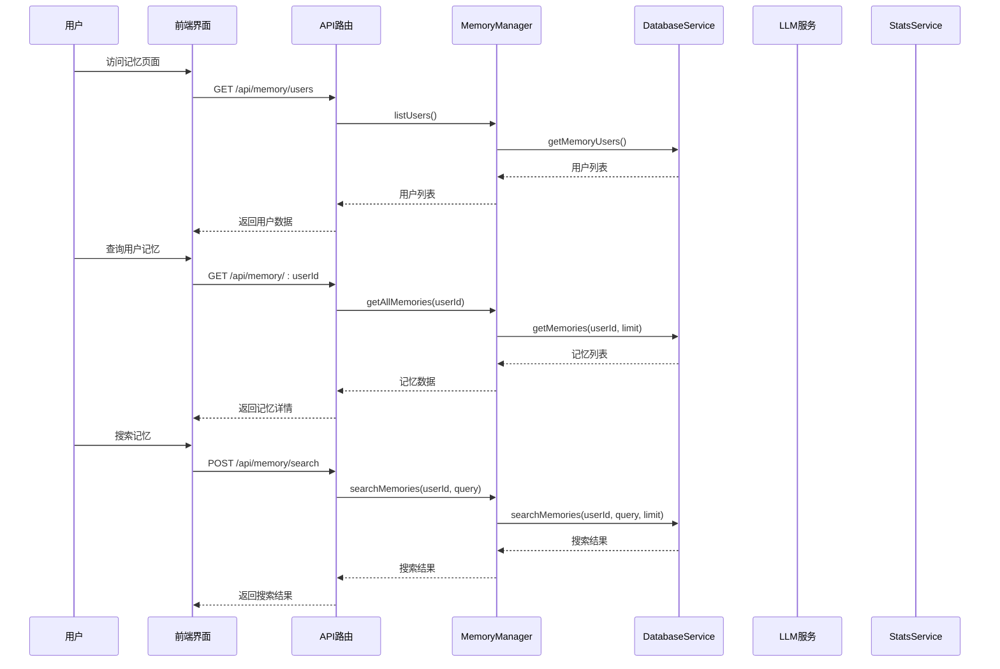
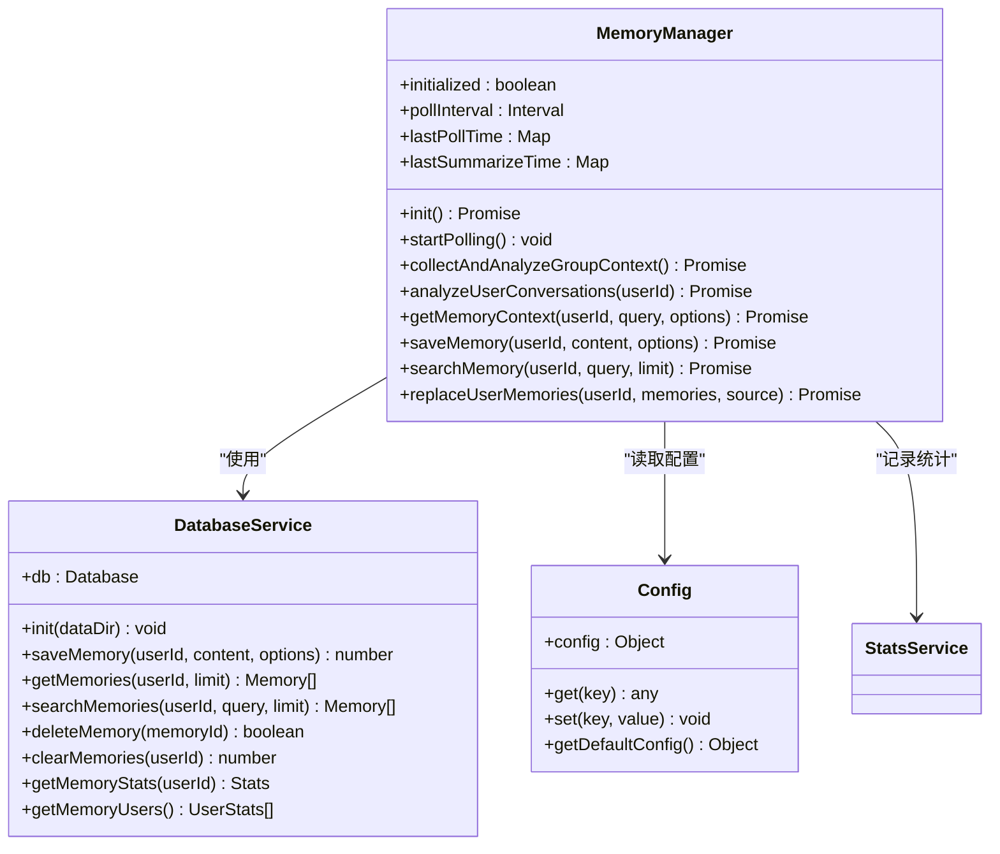
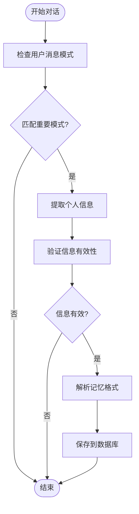
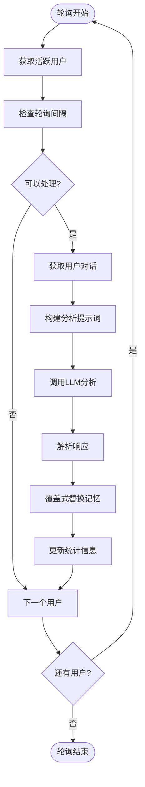
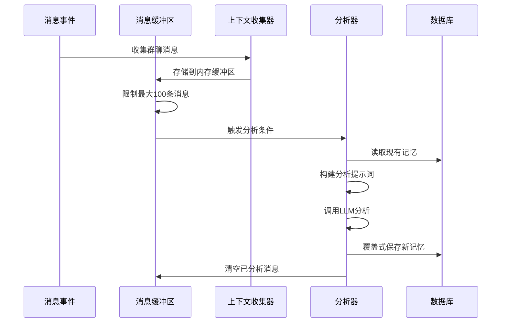
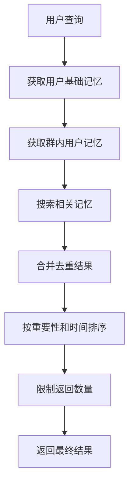
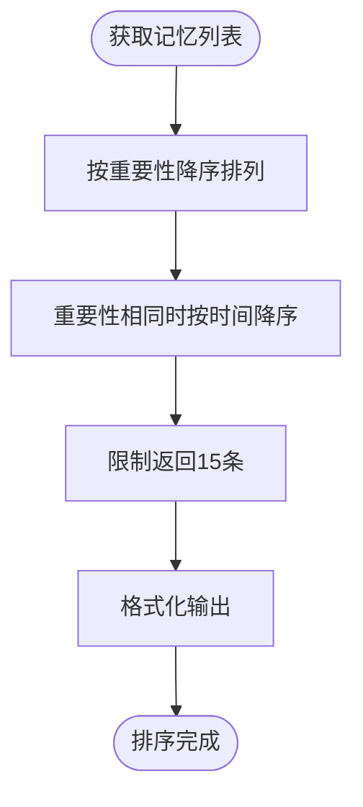
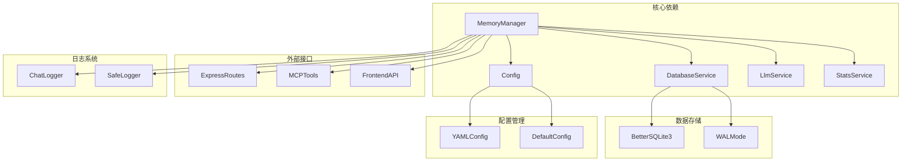
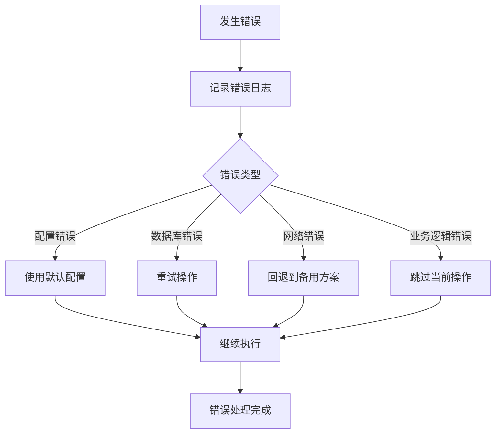

# 内存管理器

<cite>
**本文档引用的文件**
- [MemoryManager.js](file://src/services/storage/MemoryManager.js)
- [DatabaseService.js](file://src/services/storage/DatabaseService.js)
- [config.js](file://config/config.js)
- [memoryRoutes.js](file://src/services/routes/memoryRoutes.js)
- [memory.js](file://src/mcp/tools/memory.js)
- [page.tsx](file://frontend/app/(dashboard)/memory/page.tsx)
- [api.ts](file://frontend/lib/api.ts)
- [StatsService.js](file://src/services/stats/StatsService.js)
</cite>

## 目录
1. [简介](#简介)
2. [项目结构](#项目结构)
3. [核心组件](#核心组件)
4. [架构概览](#架构概览)
5. [详细组件分析](#详细组件分析)
6. [依赖关系分析](#依赖关系分析)
7. [性能考虑](#性能考虑)
8. [故障排除指南](#故障排除指南)
9. [结论](#结论)

## 简介

ChatAI 插件的内存管理器是一个强大的长期记忆管理系统，负责存储、管理和检索用户的个人信息和对话历史。该系统采用双层记忆架构，结合短期记忆和长期记忆策略，通过智能的轮询机制和AI驱动的总结算法，为用户提供个性化的AI体验。

内存管理器的核心设计理念是"智能记忆提取 + 结构化存储 + 智能检索"，通过定期分析对话历史，自动提取有价值的用户信息，并将其存储在SQLite数据库中，支持复杂的查询和聚合操作。

## 项目结构

**图表来源**
- [MemoryManager.js](file://src/services/storage/MemoryManager.js#L12-L31)
- [DatabaseService.js](file://src/services/storage/DatabaseService.js#L19-L45)
- [config.js](file://config/config.js#L343-L360)

**章节来源**
- [MemoryManager.js](file://src/services/storage/MemoryManager.js#L1-L80)
- [DatabaseService.js](file://src/services/storage/DatabaseService.js#L1-L80)
- [config.js](file://config/config.js#L343-L360)

## 核心组件

### MemoryManager 类

MemoryManager 是整个内存管理系统的核心控制器，负责协调所有记忆相关的操作。其主要职责包括：

- **初始化管理**：启动数据库连接和定时任务
- **轮询分析**：定期分析用户对话历史提取记忆
- **群聊上下文**：收集和分析群聊对话生成群体记忆
- **记忆存储**：提供完整的CRUD操作接口
- **智能检索**：支持搜索和聚合查询

### DatabaseService 类

DatabaseService 提供底层的数据持久化能力，基于SQLite数据库实现：

- **表结构设计**：memories表存储用户记忆，messages表存储对话历史
- **索引优化**：为user_id和timestamp字段建立索引提升查询性能
- **事务支持**：确保数据一致性和完整性
- **数据迁移**：支持数据库结构升级

### 配置管理系统

配置系统通过config.js提供灵活的内存管理配置：

- **功能开关**：memory.enabled 控制整个功能的启用状态
- **轮询配置**：memory.pollInterval 设置轮询间隔
- **群聊配置**：memory.groupContext 配置群聊上下文分析
- **存储限制**：memory.maxMemories 控制最大记忆数量

**章节来源**
- [MemoryManager.js](file://src/services/storage/MemoryManager.js#L12-L18)
- [DatabaseService.js](file://src/services/storage/DatabaseService.js#L47-L78)
- [config.js](file://config/config.js#L343-L360)

## 架构概览

**图表来源**
- [memoryRoutes.js](file://src/services/routes/memoryRoutes.js#L9-L80)
- [MemoryManager.js](file://src/services/storage/MemoryManager.js#L810-L896)
- [DatabaseService.js](file://src/services/storage/DatabaseService.js#L103-L164)

## 详细组件分析

### 记忆存储架构

**图表来源**
- [MemoryManager.js](file://src/services/storage/MemoryManager.js#L12-L1538)
- [DatabaseService.js](file://src/services/storage/DatabaseService.js#L19-L256)
- [config.js](file://config/config.js#L8-L631)

### 记忆提取算法

MemoryManager 实现了两种主要的记忆提取策略：

#### 1. 自动提取策略
基于对话内容的模式匹配，当检测到用户表达个人信息时自动提取：

**图表来源**
- [MemoryManager.js](file://src/services/storage/MemoryManager.js#L724-L808)

#### 2. 轮询总结策略
定期分析用户对话历史，生成综合记忆摘要：

**图表来源**
- [MemoryManager.js](file://src/services/storage/MemoryManager.js#L489-L653)

### 群聊记忆管理

群聊场景下的记忆管理具有特殊性，MemoryManager 提供了专门的处理机制：

#### 群聊上下文收集

**图表来源**
- [MemoryManager.js](file://src/services/storage/MemoryManager.js#L86-L156)

#### 群聊记忆类型
群聊记忆分为三种类型：
- **用户信息**：按昵称存储的用户特征和偏好
- **讨论话题**：群内讨论的具体主题
- **社交关系**：群成员之间的具体关系

**章节来源**
- [MemoryManager.js](file://src/services/storage/MemoryManager.js#L163-L346)
- [MemoryManager.js](file://src/services/storage/MemoryManager.js#L399-L438)

### 记忆检索机制

MemoryManager 提供了多层次的记忆检索能力：

#### 1. 基础检索

**图表来源**
- [MemoryManager.js](file://src/services/storage/MemoryManager.js#L820-L896)

#### 2. 高级搜索
支持关键词搜索和类型过滤，通过SQL LIKE操作实现模糊匹配。

#### 3. 聚合查询
提供统计信息和用户分布情况，支持批量操作和数据分析。

**章节来源**
- [MemoryManager.js](file://src/services/storage/MemoryManager.js#L820-L896)
- [DatabaseService.js](file://src/services/storage/DatabaseService.js#L125-L164)

### 记忆优先级排序

MemoryManager 实现了智能的优先级排序机制：

排序规则：
1. **重要性优先**：importance字段越大越重要
2. **时间优先**：重要性相同时，timestamp越新越重要
3. **数量限制**：最多返回15条记忆

**章节来源**
- [MemoryManager.js](file://src/services/storage/MemoryManager.js#L879-L895)

### 内存缓存策略

MemoryManager 实现了多层缓存机制来提升性能：

#### 1. 群聊消息缓存
- **内存缓冲区**：最多缓存100条群聊消息
- **自动清理**：超出限制时自动移除最旧的消息
- **持久化备份**：同时持久化到数据库确保数据安全

#### 2. 定时轮询缓存
- **最后处理时间**：记录每个用户的最后处理时间
- **频率控制**：避免过于频繁的轮询操作
- **批量处理**：单次轮询最多处理100个用户

#### 3. 配置缓存
- **配置读取**：配置信息在应用启动时读取
- **动态更新**：支持运行时配置修改
- **默认值保护**：缺失配置时使用合理默认值

**章节来源**
- [MemoryManager.js](file://src/services/storage/MemoryManager.js#L114-L156)
- [MemoryManager.js](file://src/services/storage/MemoryManager.js#L496-L521)

### 记忆导入导出功能

系统提供了完整的记忆数据管理功能：

#### 导入功能
- **批量导入**：支持从外部数据源导入记忆
- **格式验证**：验证导入数据的格式和完整性
- **冲突处理**：处理重复数据和冲突情况

#### 导出功能
- **数据导出**：支持导出用户记忆数据
- **格式选择**：支持多种数据格式导出
- **筛选功能**：支持按条件筛选导出数据

#### 同步机制
- **双向同步**：确保本地和远程数据一致性
- **增量同步**：只同步变化的数据
- **冲突解决**：自动处理数据冲突

**章节来源**
- [memoryRoutes.js](file://src/services/routes/memoryRoutes.js#L20-L40)
- [MemoryManager.js](file://src/services/storage/MemoryManager.js#L987-L1019)

## 依赖关系分析

**图表来源**
- [MemoryManager.js](file://src/services/storage/MemoryManager.js#L1-L8)
- [DatabaseService.js](file://src/services/storage/DatabaseService.js#L1-L17)
- [config.js](file://config/config.js#L1-L631)

**章节来源**
- [MemoryManager.js](file://src/services/storage/MemoryManager.js#L1-L8)
- [DatabaseService.js](file://src/services/storage/DatabaseService.js#L1-L17)
- [config.js](file://config/config.js#L1-L631)

## 性能考虑

### 数据库优化

#### 索引策略
- **memories表索引**：user_id和timestamp字段建立复合索引
- **messages表索引**：conversation_id和timestamp字段建立索引
- **查询优化**：使用LIMIT子句限制返回结果数量

#### 连接池管理
- **WAL模式**：启用Write-Ahead Logging提升并发性能
- **连接复用**：避免频繁创建和销毁数据库连接
- **事务批处理**：批量操作时使用事务提升性能

### 缓存策略

#### 内存缓存
- **用户数据缓存**：缓存最近访问的用户数据
- **配置缓存**：缓存配置信息减少磁盘IO
- **查询结果缓存**：缓存常用查询结果

#### 磁盘缓存
- **消息缓冲区**：内存中缓存群聊消息
- **临时文件**：使用临时文件存储大数据集

### 性能监控

#### 统计指标
- **API调用统计**：记录LLM调用次数和成功率
- **内存使用监控**：监控内存使用情况
- **查询性能分析**：分析慢查询和瓶颈

#### 优化建议
- **批量操作**：使用批量插入和更新提升性能
- **异步处理**：将耗时操作异步化
- **资源限制**：设置合理的资源使用上限

**章节来源**
- [DatabaseService.js](file://src/services/storage/DatabaseService.js#L39-L44)
- [StatsService.js](file://src/services/stats/StatsService.js#L19-L72)

## 故障排除指南

### 常见问题诊断

#### 1. 记忆功能无法启用
**症状**：memory.enabled 设置为true但功能不生效
**排查步骤**：
1. 检查配置文件是否正确保存
2. 确认数据库连接正常
3. 查看日志中的初始化错误信息

#### 2. 记忆提取失败
**症状**：对话中包含个人信息但未被提取
**排查步骤**：
1. 检查LLM服务连接状态
2. 验证提示词配置是否正确
3. 查看API调用统计信息

#### 3. 查询性能问题
**症状**：记忆查询响应缓慢
**排查步骤**：
1. 检查数据库索引是否正常
2. 分析慢查询日志
3. 考虑增加硬件资源

### 错误处理机制

MemoryManager 实现了完善的错误处理机制：

### 调试工具

#### 日志记录
- **详细日志**：记录所有关键操作和状态变化
- **性能日志**：记录操作耗时和资源使用
- **错误日志**：详细记录错误信息和堆栈跟踪

#### 监控指标
- **内存使用**：监控内存占用情况
- **数据库性能**：监控查询响应时间和连接数
- **API调用**：监控LLM调用次数和成功率

**章节来源**
- [MemoryManager.js](file://src/services/storage/MemoryManager.js#L23-L31)
- [StatsService.js](file://src/services/stats/StatsService.js#L19-L104)

## 结论

ChatAI 插件的内存管理器是一个设计精良的长期记忆系统，具有以下显著特点：

### 技术优势
- **智能提取**：通过AI驱动的模式识别自动提取有价值的信息
- **结构化存储**：基于SQLite的可靠数据存储和高效查询
- **灵活配置**：支持丰富的配置选项满足不同使用场景
- **性能优化**：多层缓存和索引优化确保系统高性能运行

### 功能特性
- **双层记忆**：结合短期记忆和长期记忆提供完整的记忆管理
- **群聊支持**：专门的群聊记忆管理功能
- **智能检索**：支持复杂的搜索和聚合查询
- **批量操作**：提供完整的数据导入导出和批量管理功能

### 应用价值
- **个性化体验**：通过长期记忆提供更个性化的AI服务
- **数据持久化**：确保用户信息和对话历史的安全存储
- **扩展性强**：模块化设计便于功能扩展和维护
- **易于集成**：提供丰富的API接口支持第三方集成

该内存管理器为ChatAI插件提供了坚实的数据基础，通过智能化的记忆管理提升了AI助手的用户体验和实用性。随着功能的不断完善和优化，它将成为构建更智能AI应用的重要基础设施。