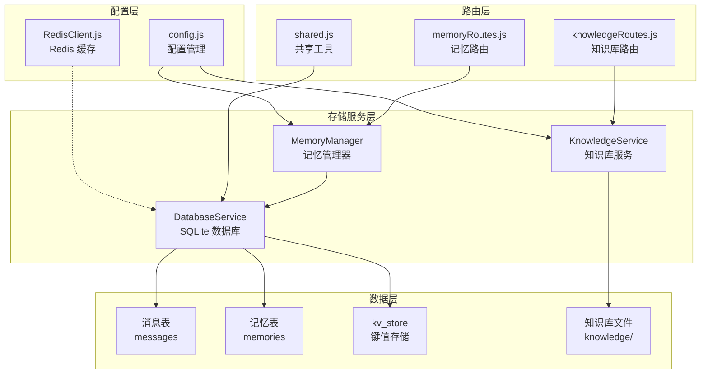
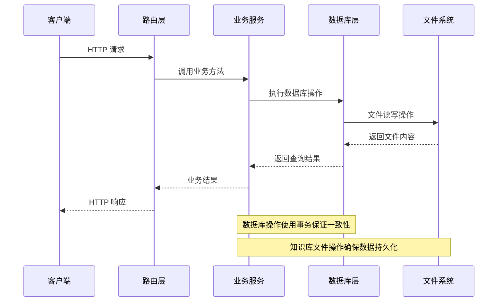
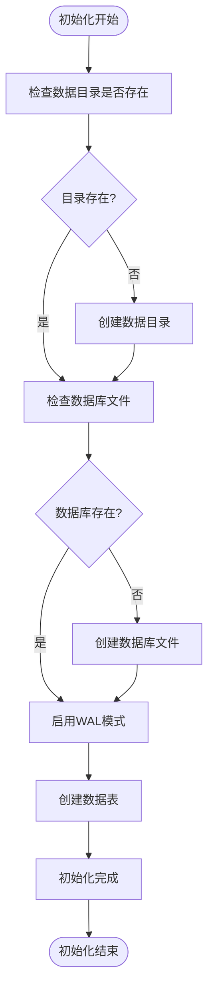
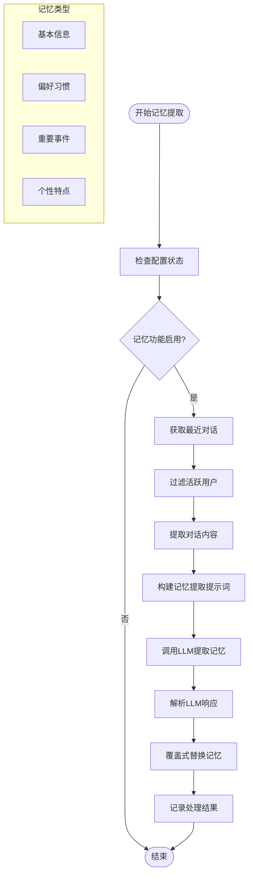
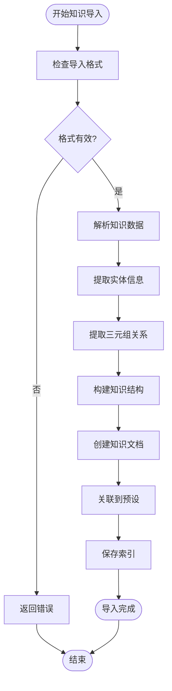
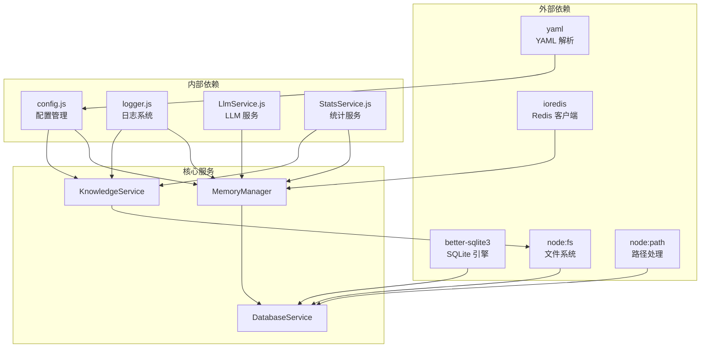

# 存储服务系统

<cite>
**本文档引用的文件**
- [DatabaseService.js](file://src/services/storage/DatabaseService.js)
- [MemoryManager.js](file://src/services/storage/MemoryManager.js)
- [KnowledgeService.js](file://src/services/storage/KnowledgeService.js)
- [config.js](file://config/config.js)
- [RedisClient.js](file://src/core/cache/RedisClient.js)
- [memoryRoutes.js](file://src/services/routes/memoryRoutes.js)
- [knowledgeRoutes.js](file://src/services/routes/knowledgeRoutes.js)
- [shared.js](file://src/services/routes/shared.js)
</cite>

## 目录
1. [简介](#简介)
2. [项目结构](#项目结构)
3. [核心组件](#核心组件)
4. [架构概览](#架构概览)
5. [详细组件分析](#详细组件分析)
6. [依赖关系分析](#依赖关系分析)
7. [性能考虑](#性能考虑)
8. [故障排除指南](#故障排除指南)
9. [结论](#结论)
10. [附录](#附录)

## 简介

ChatAI 插件的存储服务系统是一个基于 SQLite 的混合存储解决方案，主要负责以下核心功能：
- **消息持久化**：存储对话历史和消息记录
- **记忆管理**：维护用户个性化记忆和上下文
- **知识库管理**：管理预设关联的知识文档
- **配置存储**：提供键值对存储功能

系统采用模块化设计，通过 DatabaseService 提供统一的数据访问层，MemoryManager 和 KnowledgeService 分别处理记忆和知识库业务逻辑，配合 Express 路由提供 RESTful API 接口。

## 项目结构

存储服务系统位于 `src/services/storage/` 目录下，包含三个核心服务组件：

**图表来源**
- [DatabaseService.js](file://src/services/storage/DatabaseService.js#L1-L809)
- [MemoryManager.js](file://src/services/storage/MemoryManager.js#L1-L1538)
- [KnowledgeService.js](file://src/services/storage/KnowledgeService.js#L1-L931)

**章节来源**
- [DatabaseService.js](file://src/services/storage/DatabaseService.js#L1-L809)
- [MemoryManager.js](file://src/services/storage/MemoryManager.js#L1-L1538)
- [KnowledgeService.js](file://src/services/storage/KnowledgeService.js#L1-L931)

## 核心组件

### DatabaseService - 数据库服务

DatabaseService 是整个存储系统的核心，基于 better-sqlite3 提供高性能的本地数据库访问。

**主要特性：**
- **WAL 模式**：启用 Write-Ahead Logging 提升并发性能
- **自动初始化**：首次使用时自动创建数据库和表结构
- **数据去重**：智能去重机制防止重复消息存储
- **全文搜索**：支持记忆内容的模糊搜索
- **事务安全**：所有操作都在事务中执行保证数据一致性

**数据表结构：**
- `messages`：存储对话消息，包含会话ID、角色、内容、时间戳
- `memories`：存储用户记忆，包含用户ID、内容、重要性、来源
- `kv_store`：键值对存储，用于配置和临时数据

**章节来源**
- [DatabaseService.js](file://src/services/storage/DatabaseService.js#L19-L809)

### MemoryManager - 内存管理器

MemoryManager 专门处理用户记忆的提取、存储和管理，支持自动和手动两种模式。

**核心功能：**
- **周期性轮询**：定期分析用户对话提取记忆
- **群聊上下文**：支持群聊场景的记忆提取和管理
- **记忆总结**：使用 LLM 对记忆进行覆盖式总结
- **智能去重**：防止重复记忆的产生
- **批量操作**：支持记忆的批量清理和导出

**记忆类型：**
- 用户基本信息：姓名、年龄、职业、兴趣爱好
- 偏好习惯：喜欢/不喜欢的事物
- 重要事件：生日、纪念日、计划等
- 个性特点：兴趣爱好、性格等

**章节来源**
- [MemoryManager.js](file://src/services/storage/MemoryManager.js#L12-L1538)

### KnowledgeService - 知识服务

KnowledgeService 管理预设关联的知识库文档，提供知识的存储、检索和管理功能。

**主要能力：**
- **多格式支持**：支持 txt、md、json 格式文档
- **智能索引**：自动扫描和索引知识库文件
- **结构化存储**：支持实体关系图谱和知识条目的结构化存储
- **关联管理**：支持知识库与预设的关联和解绑
- **搜索功能**：提供基于关键词和实体的智能搜索

**知识库结构：**
- 实体关系图谱：以实体为中心的关系网络
- 知识条目：原始文本片段集合
- 快速查询索引：三元组简表

**章节来源**
- [KnowledgeService.js](file://src/services/storage/KnowledgeService.js#L31-L931)

## 架构概览

存储服务系统采用分层架构设计，确保各组件职责清晰、耦合度低：

**图表来源**
- [memoryRoutes.js](file://src/services/routes/memoryRoutes.js#L1-L137)
- [knowledgeRoutes.js](file://src/services/routes/knowledgeRoutes.js#L1-L131)
- [DatabaseService.js](file://src/services/storage/DatabaseService.js#L26-L45)

## 详细组件分析

### DatabaseService 详细分析

#### 数据库初始化流程

**图表来源**
- [DatabaseService.js](file://src/services/storage/DatabaseService.js#L26-L45)

#### 数据访问模式

DatabaseService 提供了三种主要的数据访问模式：

1. **消息存储模式**：用于存储对话历史，支持去重和时间戳排序
2. **记忆存储模式**：用于存储用户个性化记忆，支持重要性排序和搜索
3. **键值存储模式**：用于存储配置和临时数据，支持 JSON 序列化

**章节来源**
- [DatabaseService.js](file://src/services/storage/DatabaseService.js#L47-L809)

### MemoryManager 详细分析

#### 记忆提取流程

**图表来源**
- [MemoryManager.js](file://src/services/storage/MemoryManager.js#L535-L653)

#### 群聊记忆管理

MemoryManager 特别针对群聊场景提供了完整的记忆管理功能：

**群聊记忆类型：**
- `group:{groupId}:topics`：讨论话题记忆
- `group:{groupId}:relations`：用户关系记忆  
- `group:{groupId}:user:{nickname}`：用户信息记忆

**群聊上下文采集：**
- 支持按时间窗口的记忆总结
- 自动去重和合并相似信息
- 支持多维度的记忆提取（用户信息、话题、关系）

**章节来源**
- [MemoryManager.js](file://src/services/storage/MemoryManager.js#L163-L346)
- [MemoryManager.js](file://src/services/storage/MemoryManager.js#L1125-L1377)

### KnowledgeService 详细分析

#### 知识库导入流程

**图表来源**
- [KnowledgeService.js](file://src/services/storage/KnowledgeService.js#L551-L742)

#### 知识库搜索算法

KnowledgeService 实现了智能的知识库搜索算法：

**搜索策略：**
1. **标题匹配**：优先匹配文档标题
2. **实体匹配**：识别文档中的实体并匹配
3. **内容匹配**：基于关键词的全文搜索
4. **标签匹配**：基于标签的相关性评分

**评分机制：**
- 标题匹配权重最高 (15分)
- 实体匹配权重 (20分)
- 内容关键词匹配 (每词2分)
- 标签匹配 (每标签5分)

**章节来源**
- [KnowledgeService.js](file://src/services/storage/KnowledgeService.js#L750-L827)

## 依赖关系分析

存储服务系统的主要依赖关系如下：

**图表来源**
- [DatabaseService.js](file://src/services/storage/DatabaseService.js#L1-L17)
- [MemoryManager.js](file://src/services/storage/MemoryManager.js#L1-L7)
- [KnowledgeService.js](file://src/services/storage/KnowledgeService.js#L1-L16)

**章节来源**
- [config.js](file://config/config.js#L1-L631)
- [RedisClient.js](file://src/core/cache/RedisClient.js#L1-L129)

## 性能考虑

### 数据库性能优化

**索引策略：**
- `messages` 表：按 `conversation_id` 和 `timestamp` 建立复合索引
- `memories` 表：按 `user_id` 和 `timestamp` 建立复合索引
- 所有 LIKE 查询都使用 ESCAPE 转义，避免模式复杂度问题

**查询优化：**
- 使用子查询优化 LIMIT 查询，避免全表扫描
- 实现消息去重机制，减少重复存储
- 支持消息修剪，控制数据库大小

### 缓存策略

**Redis 缓存：**
- MemoryManager 使用 Redis 缓存群聊消息缓冲区
- 支持内存消息数量限制 (100条)
- 提供快速的群聊上下文访问

**内存缓存：**
- KnowledgeService 内存中缓存已加载的文档
- 支持自动扫描新文件，动态更新索引
- 提供预设-文档映射缓存

### 并发控制

**WAL 模式：**
- 启用 Write-Ahead Logging 提升并发读写性能
- 支持多进程并发访问
- 减少锁竞争和阻塞

**事务管理：**
- 所有数据库操作都在事务中执行
- 确保数据一致性和原子性
- 支持回滚机制

## 故障排除指南

### 常见问题及解决方案

**数据库连接失败：**
- 检查数据目录权限
- 确认 SQLite 文件完整性
- 验证 WAL 模式配置

**记忆提取失败：**
- 检查 LLM 服务连接状态
- 验证记忆配置参数
- 查看日志获取详细错误信息

**知识库导入失败：**
- 检查文件格式和编码
- 验证知识库结构完整性
- 确认磁盘空间充足

**章节来源**
- [DatabaseService.js](file://src/services/storage/DatabaseService.js#L160-L164)
- [MemoryManager.js](file://src/services/storage/MemoryManager.js#L526-L528)
- [KnowledgeService.js](file://src/services/storage/KnowledgeService.js#L127-L130)

### 日志监控

系统提供了完善的日志记录机制：

**日志级别：**
- `info`：系统初始化和正常操作
- `warn`：警告信息和可恢复错误
- `error`：严重错误和异常情况
- `debug`：调试信息和详细流程

**关键日志点：**
- 数据库初始化完成
- 记忆提取成功/失败
- 知识库导入进度
- API 调用统计

## 结论

ChatAI 插件的存储服务系统通过精心设计的架构实现了高效、可靠的数据持久化和管理。系统的主要优势包括：

**技术优势：**
- 基于 SQLite 的轻量级设计，部署简单
- 智能的去重和修剪机制，控制数据增长
- 支持多种数据类型的灵活存储
- 完善的错误处理和日志记录

**业务价值：**
- 提供个性化的用户体验
- 支持复杂的记忆和知识管理场景
- 良好的扩展性和维护性
- 完整的 API 接口支持

**未来改进方向：**
- 考虑引入分布式缓存提升性能
- 支持更多的数据库后端选择
- 增强数据备份和恢复机制
- 优化大规模数据的查询性能

## 附录

### 配置选项详解

**记忆服务配置：**
- `memory.enabled`：启用/禁用记忆功能
- `memory.pollInterval`：轮询间隔（分钟）
- `memory.maxMemories`：每用户最大记忆数
- `memory.groupContext.enabled`：启用群聊上下文采集

**知识库配置：**
- `knowledge.storage`：知识库存储位置
- `knowledge.autoImport`：自动导入新文件
- `knowledge.maxFileSize`：最大文件大小限制

**章节来源**
- [config.js](file://config/config.js#L343-L360)

### API 接口规范

**记忆管理 API：**
- `GET /memory/users`：获取所有有记忆的用户
- `POST /memory/:userId/summarize`：用户记忆总结
- `POST /memory/group/:groupId/summarize`：群记忆总结

**知识库 API：**
- `GET /knowledge/search`：搜索知识库
- `POST /knowledge/import`：导入知识库
- `POST /knowledge/:id/link/:presetId`：关联知识库到预设

**章节来源**
- [memoryRoutes.js](file://src/services/routes/memoryRoutes.js#L1-L137)
- [knowledgeRoutes.js](file://src/services/routes/knowledgeRoutes.js#L1-L131)