# 数据库服务


## 目录
1. [简介](#简介)
2. [项目结构](#项目结构)
3. [核心组件](#核心组件)
4. [架构概览](#架构概览)
5. [详细组件分析](#详细组件分析)
6. [依赖关系分析](#依赖关系分析)
7. [性能考虑](#性能考虑)
8. [故障排除指南](#故障排除指南)
9. [结论](#结论)
10. [附录](#附录)

## 简介

ChatAI 插件的数据库服务是整个系统的核心数据基础设施，基于 SQLite3 实现，提供了完整的消息存储、记忆管理和键值存储功能。该服务采用 better-sqlite3 库，支持 WAL 模式以提升并发性能，包含三个主要数据表：messages（消息表）、memories（记忆表）和 kv_store（键值存储表）。

数据库服务不仅负责基础的数据持久化，还集成了智能去重机制、数据清理策略和查询优化功能，为聊天机器人提供了可靠的数据支撑。

## 项目结构

数据库服务在整个项目中的位置和组织方式如下：

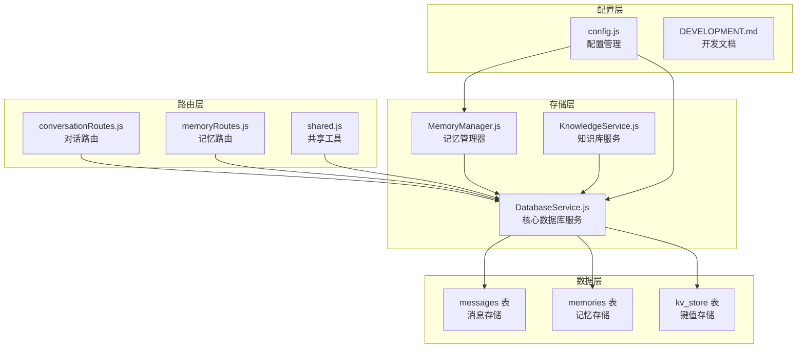

**图表来源**
- [DatabaseService.js](file://src/services/storage/DatabaseService.js#L1-L809)
- [MemoryManager.js](file://src/services/storage/MemoryManager.js#L1-L1538)
- [conversationRoutes.js](file://src/services/routes/conversationRoutes.js#L1-L118)
- [memoryRoutes.js](file://src/services/routes/memoryRoutes.js#L1-L137)

**章节来源**
- [DatabaseService.js](file://src/services/storage/DatabaseService.js#L1-L809)
- [config.js](file://config/config.js#L1-L631)

## 核心组件

### DatabaseService 类架构

DatabaseService 是整个数据库系统的核心类，采用单例模式设计，提供了完整的数据库操作接口：

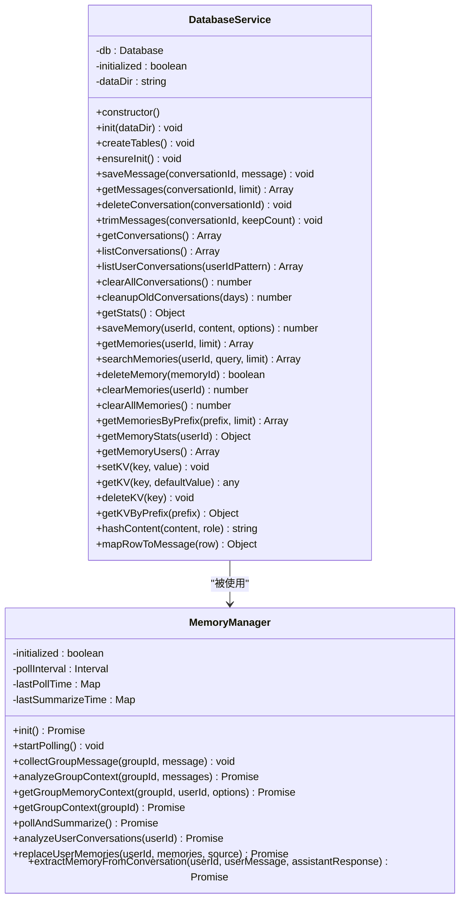

**图表来源**
- [DatabaseService.js](file://src/services/storage/DatabaseService.js#L19-L809)
- [MemoryManager.js](file://src/services/storage/MemoryManager.js#L12-L800)

### 数据表设计

数据库包含三个核心表，每个表都有特定的用途和优化策略：

#### Messages 表（消息存储）
- **用途**：存储所有对话消息，支持消息去重和历史记录管理
- **索引**：conversation_id（会话ID），timestamp（时间戳）
- **特点**：支持消息去重、内容哈希、时间戳排序

#### Memories 表（记忆存储）
- **用途**：存储用户长期记忆，支持搜索和管理
- **索引**：user_id（用户ID），timestamp（时间戳）
- **特点**：支持重要性评分、来源标记、元数据存储

#### KV Store 表（键值存储）
- **用途**：存储系统配置和临时数据
- **特点**：主键索引，自动更新时间戳

**章节来源**
- [DatabaseService.js](file://src/services/storage/DatabaseService.js#L47-L77)

## 架构概览

数据库服务采用分层架构设计，确保了良好的可维护性和扩展性：

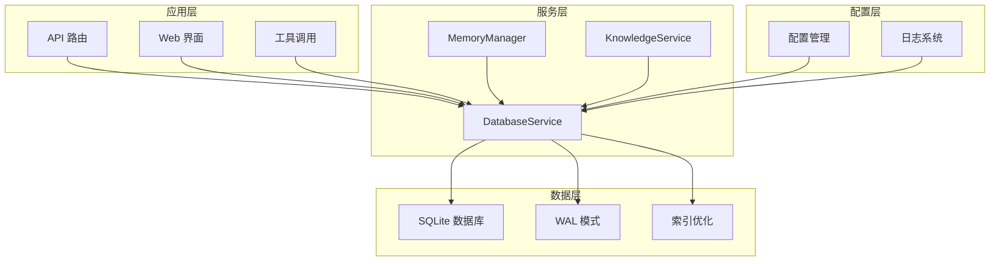

**图表来源**
- [DatabaseService.js](file://src/services/storage/DatabaseService.js#L26-L45)
- [MemoryManager.js](file://src/services/storage/MemoryManager.js#L23-L31)

## 详细组件分析

### 消息存储模块

消息存储是数据库服务的核心功能之一，实现了智能的消息去重和历史管理：

#### 消息去重机制

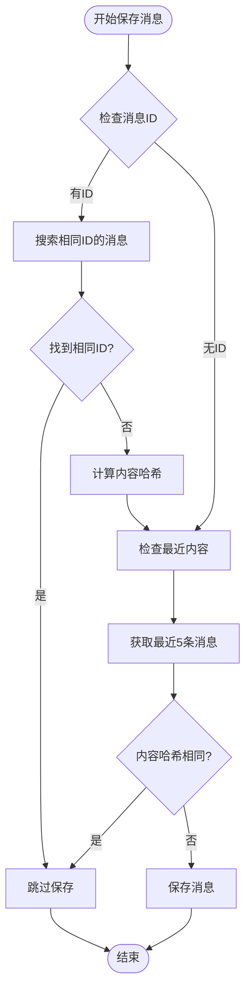

**图表来源**
- [DatabaseService.js](file://src/services/storage/DatabaseService.js#L263-L327)

#### 消息存储流程

消息存储采用了双重去重策略：
1. **ID 去重**：检查相同 conversation_id 下是否存在相同 ID 的消息
2. **内容去重**：检查最近 5 条消息中是否有相同内容（基于哈希）

#### 查询优化策略

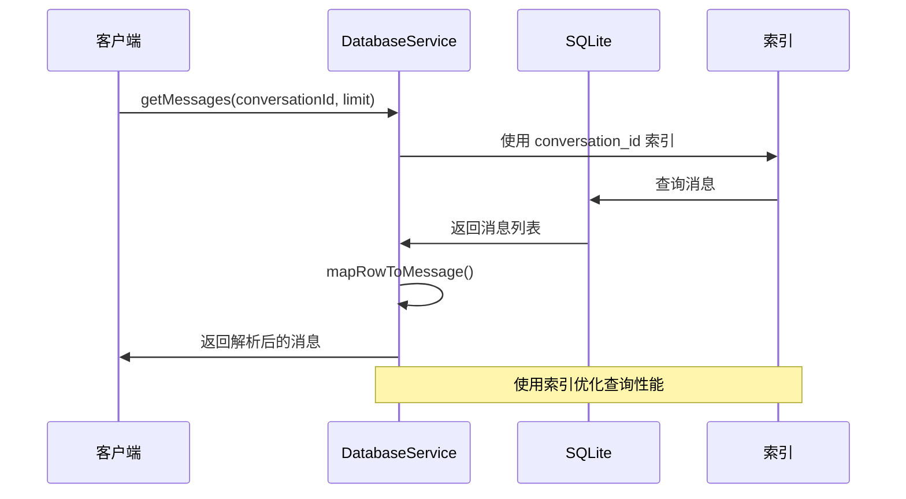

**图表来源**
- [DatabaseService.js](file://src/services/storage/DatabaseService.js#L352-L378)

**章节来源**
- [DatabaseService.js](file://src/services/storage/DatabaseService.js#L263-L327)
- [DatabaseService.js](file://src/services/storage/DatabaseService.js#L352-L409)

### 记忆管理模块

记忆管理模块提供了完整的长期记忆存储和检索功能：

#### 记忆存储接口

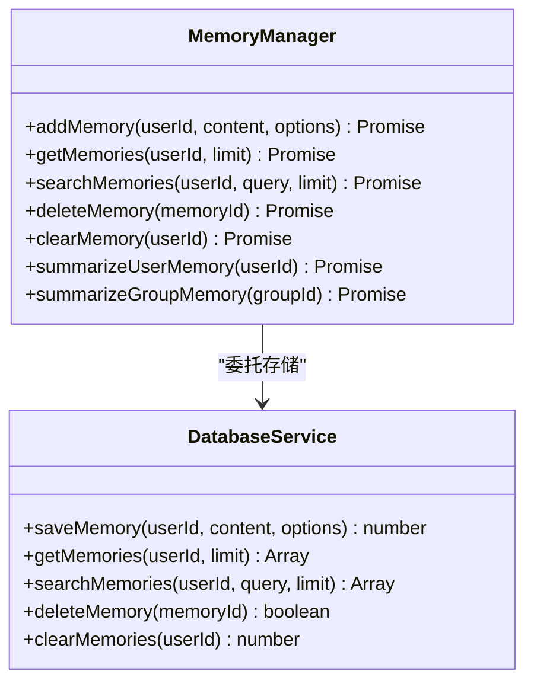

**图表来源**
- [MemoryManager.js](file://src/services/storage/MemoryManager.js#L694-L716)
- [DatabaseService.js](file://src/services/storage/DatabaseService.js#L83-L190)

#### 记忆搜索算法

记忆搜索实现了安全的 LIKE 查询，防止模式复杂度过高：

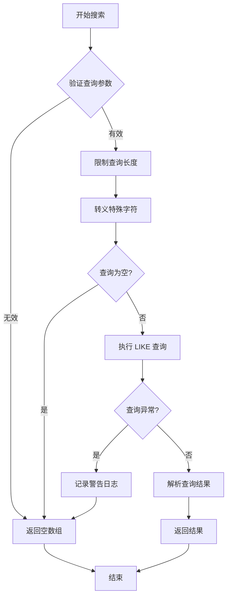

**图表来源**
- [DatabaseService.js](file://src/services/storage/DatabaseService.js#L125-L164)

**章节来源**
- [MemoryManager.js](file://src/services/storage/MemoryManager.js#L694-L716)
- [DatabaseService.js](file://src/services/storage/DatabaseService.js#L125-L164)

### 键值存储模块

键值存储提供了简单的键值对持久化功能：

#### KV 存储特性

- **主键约束**：key 字段为主键，确保唯一性
- **自动更新**：updated_at 字段自动更新
- **JSON 支持**：值支持任意 JSON 序列化数据
- **前缀查询**：支持按前缀获取键值对

**章节来源**
- [DatabaseService.js](file://src/services/storage/DatabaseService.js#L743-L805)

### 数据清理和维护

数据库服务提供了完善的数据清理和维护功能：

#### 会话清理策略

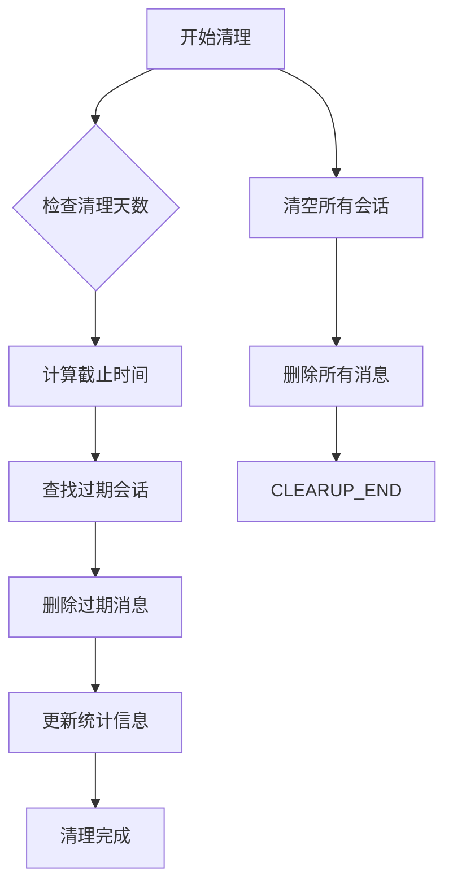

**图表来源**
- [DatabaseService.js](file://src/services/storage/DatabaseService.js#L545-L557)

#### 用户数据清理

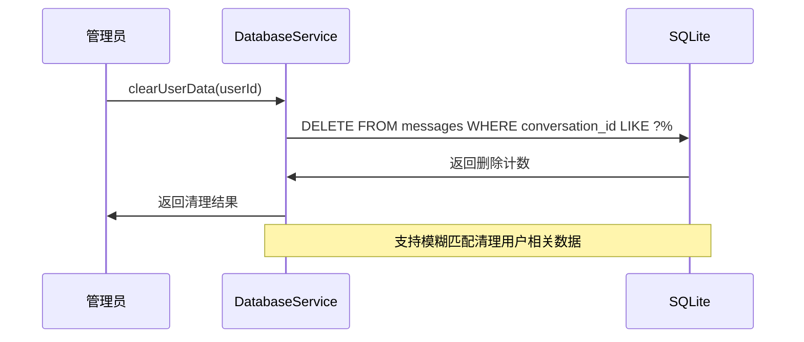

**图表来源**
- [DatabaseService.js](file://src/services/storage/DatabaseService.js#L734-L741)

**章节来源**
- [DatabaseService.js](file://src/services/storage/DatabaseService.js#L545-L557)
- [DatabaseService.js](file://src/services/storage/DatabaseService.js#L734-L741)

## 依赖关系分析

数据库服务的依赖关系展现了清晰的分层架构：

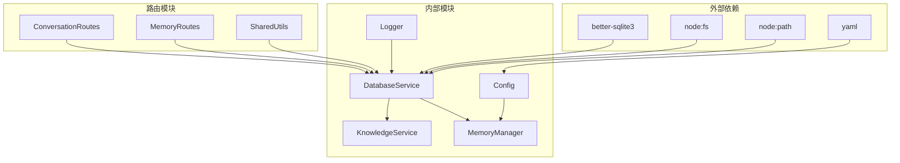

**图表来源**
- [DatabaseService.js](file://src/services/storage/DatabaseService.js#L1-L10)
- [config.js](file://config/config.js#L1-L10)

### 路由集成

数据库服务通过路由模块提供 API 接口：

#### 对话路由集成

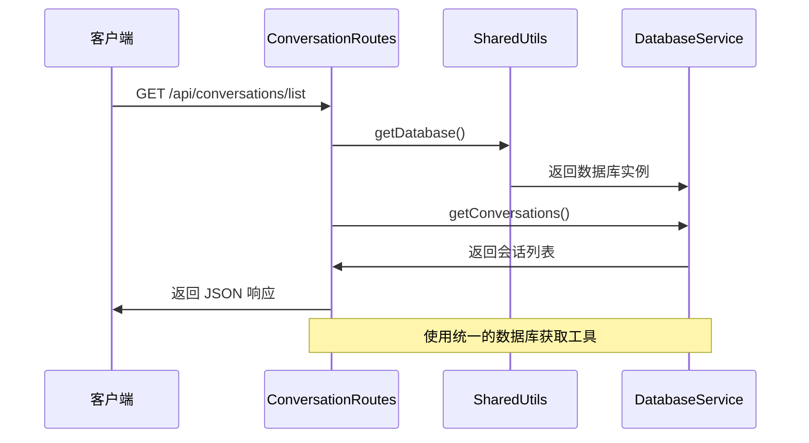

**图表来源**
- [conversationRoutes.js](file://src/services/routes/conversationRoutes.js#L18-L26)
- [shared.js](file://src/services/routes/shared.js#L131-L136)

**章节来源**
- [conversationRoutes.js](file://src/services/routes/conversationRoutes.js#L1-L118)
- [memoryRoutes.js](file://src/services/routes/memoryRoutes.js#L1-L137)
- [shared.js](file://src/services/routes/shared.js#L1-L150)

## 性能考虑

数据库服务在设计时充分考虑了性能优化：

### 索引优化策略

| 表名 | 索引字段 | 用途 | 性能影响 |
|------|----------|------|----------|
| messages | conversation_id | 会话查询 | O(log n) |
| messages | timestamp | 时间排序 | O(log n) |
| memories | user_id | 用户查询 | O(log n) |
| memories | timestamp | 时间排序 | O(log n) |
| kv_store | key | 主键查询 | O(1) |

### 查询优化技术

1. **WAL 模式**：启用 WAL（Write-Ahead Logging）模式提升并发性能
2. **索引使用**：为常用查询字段建立索引
3. **查询限制**：对搜索和列表查询设置合理的限制
4. **批量操作**：支持批量删除和清理操作

### 内存管理

- **连接池**：使用单例模式管理数据库连接
- **预编译语句**：使用 prepared statements 提升执行效率
- **垃圾回收**：及时释放不再使用的资源

## 故障排除指南

### 常见问题及解决方案

#### 数据库初始化失败

**症状**：数据库无法初始化，抛出初始化异常

**原因分析**：
1. 数据目录权限不足
2. SQLite 文件损坏
3. 路径配置错误

**解决方案**：
```javascript
// 检查数据目录权限
if (!fs.existsSync(targetDir)) {
    fs.mkdirSync(targetDir, { recursive: true });
}

// 验证数据库文件可写
try {
    const testDb = new Database(dbPath);
    testDb.close();
} catch (error) {
    // 处理权限问题
}
```

#### 查询性能问题

**症状**：查询响应缓慢

**诊断步骤**：
1. 检查索引使用情况
2. 分析查询执行计划
3. 优化查询条件

**优化建议**：
- 确保查询条件使用索引字段
- 避免 SELECT *
- 合理使用 LIMIT 限制结果集

#### 内存泄漏问题

**症状**：进程内存持续增长

**排查方法**：
1. 检查数据库连接是否正确关闭
2. 确认预编译语句是否正确释放
3. 监控大结果集的处理

**预防措施**：
```javascript
// 确保资源正确释放
db.close();
stmt.finalize();
```

**章节来源**
- [DatabaseService.js](file://src/services/storage/DatabaseService.js#L26-L45)

## 结论

ChatAI 插件的数据库服务是一个设计精良、功能完整的数据存储解决方案。通过采用 SQLite3 和 better-sqlite3 库，系统实现了高性能、可靠的本地数据存储。

### 主要优势

1. **架构清晰**：分层设计，职责分离明确
2. **性能优秀**：索引优化、WAL 模式、预编译语句
3. **功能完整**：支持消息存储、记忆管理、键值存储
4. **易于维护**：代码结构清晰，文档完善

### 技术亮点

- 智能消息去重机制
- 安全的记忆搜索算法
- 完善的数据清理策略
- 统一的错误处理和日志记录

该数据库服务为 ChatAI 插件提供了坚实的数据基础，支持复杂的聊天机器人应用场景。

## 附录

### API 使用示例

#### 基础数据库操作

```javascript
import { databaseService } from '../services/storage/DatabaseService.js'

// 保存消息
await databaseService.saveMessage('user:123', {
    id: 'msg_001',
    role: 'user',
    content: '你好',
    timestamp: Date.now()
})

// 获取消息
const messages = await databaseService.getMessages('user:123', 50)

// 清理会话
await databaseService.deleteConversation('user:123')
```

#### 记忆管理操作

```javascript
import { memoryManager } from '../services/storage/MemoryManager.js'

// 添加记忆
await memoryManager.addMemory('user:123', '用户喜欢编程', {
    category: 'preference',
    importance: 0.8
})

// 搜索记忆
const results = await memoryManager.searchMemories('user:123', '编程')

// 获取用户记忆
const memories = await memoryManager.getMemories('user:123')
```

### 最佳实践

1. **索引设计**：为常用查询字段建立索引
2. **查询优化**：使用 LIMIT 限制结果集大小
3. **错误处理**：完善的异常捕获和日志记录
4. **资源管理**：确保数据库连接正确关闭
5. **数据备份**：定期备份重要数据

**章节来源**
- [DEVELOPMENT.md](file://docs/DEVELOPMENT.md#L362-L383)
