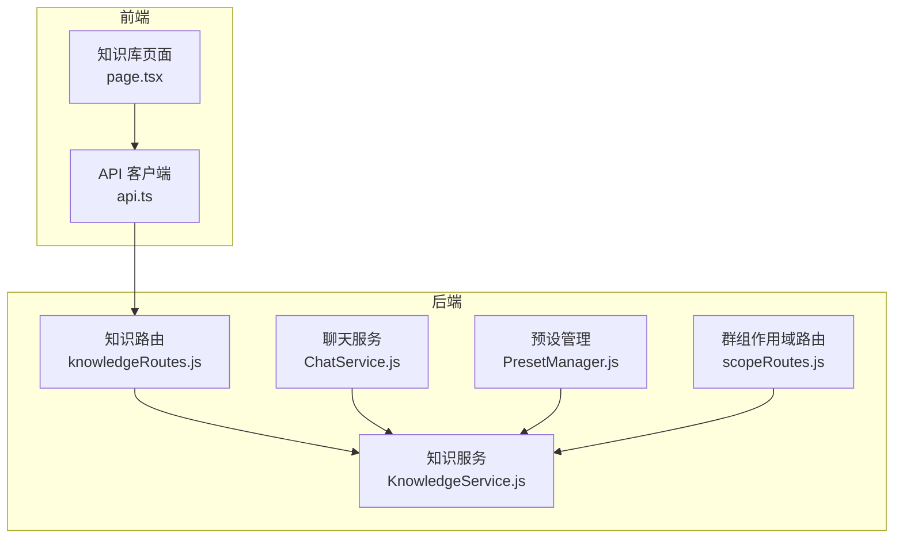
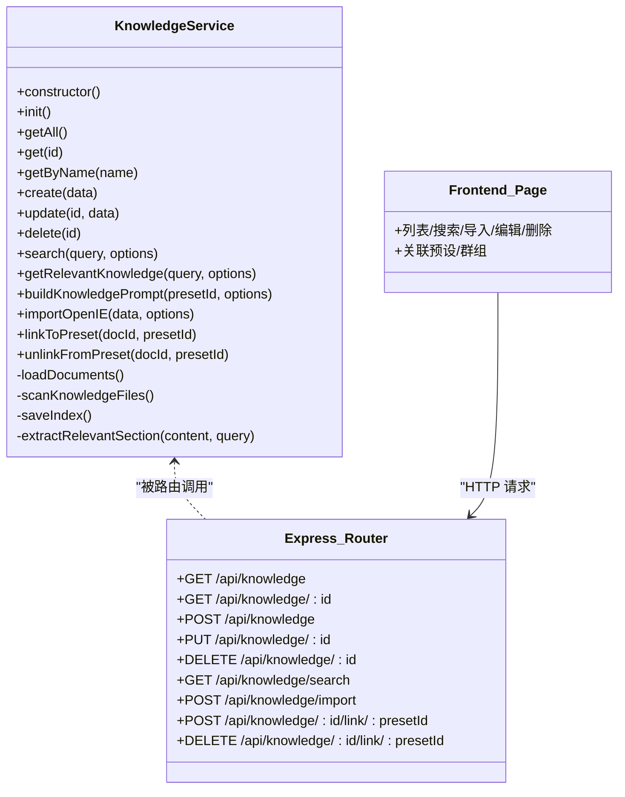
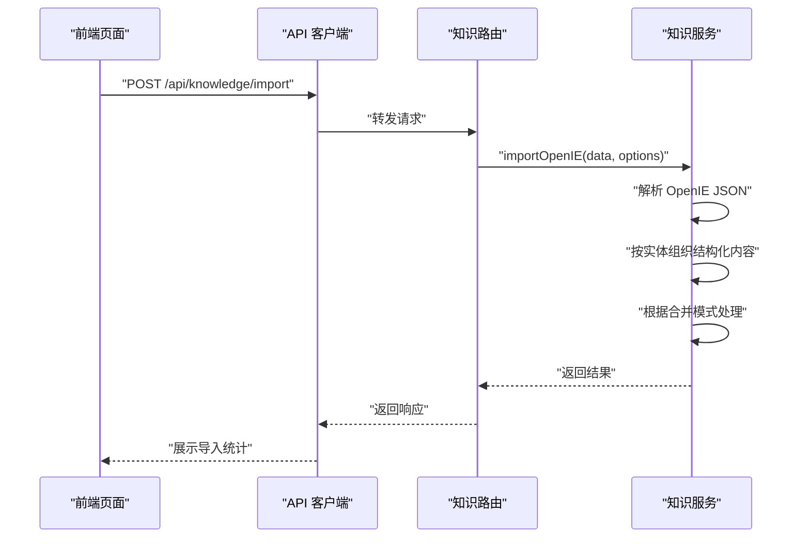
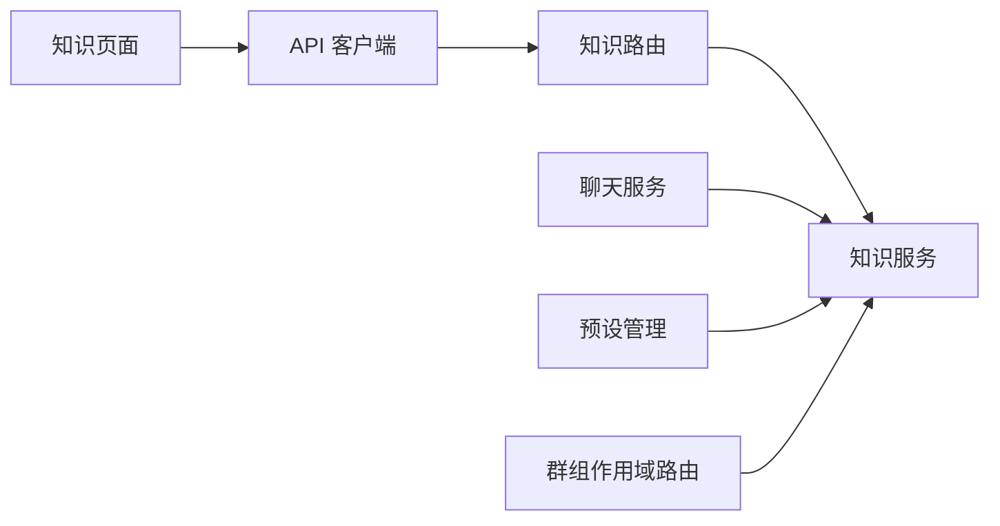

# 知识服务

<cite>
**本文引用的文件**
- [KnowledgeService.js](file://src/services/storage/KnowledgeService.js)
- [knowledgeRoutes.js](file://src/services/routes/knowledgeRoutes.js)
- [api.ts](file://frontend/lib/api.ts)
- [page.tsx](file://frontend/app/(dashboard)/knowledge/page.tsx)
- [ChatService.js](file://src/services/llm/ChatService.js)
- [PresetManager.js](file://src/services/preset/PresetManager.js)
- [scopeRoutes.js](file://src/services/routes/scopeRoutes.js)
- [DatabaseService.js](file://src/services/storage/DatabaseService.js)
</cite>

## 目录
1. [简介](#简介)
2. [项目结构](#项目结构)
3. [核心组件](#核心组件)
4. [架构总览](#架构总览)
5. [详细组件分析](#详细组件分析)
6. [依赖分析](#依赖分析)
7. [性能考虑](#性能考虑)
8. [故障排查指南](#故障排查指南)
9. [结论](#结论)
10. [附录](#附录)

## 简介
本文件面向 ChatAI 插件的知识服务子系统，围绕 KnowledgeService 类展开，系统性阐述知识库的构建、索引、检索与提示词组装机制；详解知识条目的存储格式、分类与元数据管理；给出检索算法、相似度计算与片段提取策略；覆盖导入导出、批量处理与数据转换能力；并提供 API 接口说明、使用示例与配置扩展建议。

## 项目结构
知识服务位于后端存储层，通过 Express 路由暴露 REST API，前端 Next.js 页面通过统一 API 客户端进行交互。知识服务还与预设管理、群组作用域、聊天服务等模块协作，形成“知识库 → 预设/群组 → 对话”的知识注入链路。

图表来源
- [knowledgeRoutes.js](file://src/services/routes/knowledgeRoutes.js#L1-L131)
- [KnowledgeService.js](file://src/services/storage/KnowledgeService.js#L31-L931)
- [page.tsx](file://frontend/app/(dashboard)/knowledge/page.tsx#L1-L764)
- [api.ts](file://frontend/lib/api.ts#L98-L118)
- [ChatService.js](file://src/services/llm/ChatService.js#L747-L774)
- [PresetManager.js](file://src/services/preset/PresetManager.js#L618-L636)
- [scopeRoutes.js](file://src/services/routes/scopeRoutes.js#L191-L230)

章节来源
- [knowledgeRoutes.js](file://src/services/routes/knowledgeRoutes.js#L1-L131)
- [KnowledgeService.js](file://src/services/storage/KnowledgeService.js#L31-L931)
- [page.tsx](file://frontend/app/(dashboard)/knowledge/page.tsx#L1-L764)
- [api.ts](file://frontend/lib/api.ts#L98-L118)

## 核心组件
- 知识服务（KnowledgeService）：负责知识库文档的增删改查、持久化、索引维护、预设关联、检索与提示词组装、导入导出与 OpenIE 结构化转换。
- 知识路由（knowledgeRoutes.js）：提供 REST API，封装知识服务的业务逻辑。
- 前端知识页面（page.tsx）：提供知识库的增删改查、搜索、导入、关联预设/群组等交互。
- API 客户端（api.ts）：封装 /api/knowledge 相关请求。
- 聊天服务（ChatService）：在对话构建系统提示词时，调用知识服务组装知识库上下文。
- 预设管理（PresetManager）：提供知识库与预设的关联/解绑操作。
- 群组作用域路由（scopeRoutes.js）：提供群组知识库与继承配置的读写接口。

章节来源
- [KnowledgeService.js](file://src/services/storage/KnowledgeService.js#L31-L931)
- [knowledgeRoutes.js](file://src/services/routes/knowledgeRoutes.js#L1-L131)
- [page.tsx](file://frontend/app/(dashboard)/knowledge/page.tsx#L1-L764)
- [api.ts](file://frontend/lib/api.ts#L98-L118)
- [ChatService.js](file://src/services/llm/ChatService.js#L747-L774)
- [PresetManager.js](file://src/services/preset/PresetManager.js#L618-L636)
- [scopeRoutes.js](file://src/services/routes/scopeRoutes.js#L191-L230)

## 架构总览
知识服务采用“内存 Map + 文件系统 + 索引 JSON”的混合持久化方案：
- 内存 Map 存储当前进程内的知识文档对象，提供 O(1) 查找与更新。
- 索引文件 index.json 记录文档元数据与文件路径，避免每次启动都扫描全盘。
- 知识内容按类型分别保存为 .txt/.md/.json 文件，便于直接编辑与版本控制。
- 预设与知识库之间通过 Map/Set 维护多对多映射，支持按预设筛选检索。

图表来源
- [KnowledgeService.js](file://src/services/storage/KnowledgeService.js#L31-L931)
- [knowledgeRoutes.js](file://src/services/routes/knowledgeRoutes.js#L1-L131)
- [page.tsx](file://frontend/app/(dashboard)/knowledge/page.tsx#L1-L764)

## 详细组件分析

### 知识服务类（KnowledgeService）
- 初始化与索引加载
  - 确保知识库目录存在；加载 index.json 并逐个读取文档内容；自动清理损坏记录并延迟保存索引。
  - 扫描目录中未被索引引用的新文件，按扩展名与时间戳生成文档对象，实现“自动发现”能力。
- 文档生命周期
  - create：可选持久化到文件，生成安全文件名，记录类型、标签、预设ID等元数据；更新预设映射并保存索引。
  - update：支持内容增量更新与文件落盘；更新预设映射；保存索引。
  - delete：删除文件与内存记录，更新预设映射并保存索引。
- 检索与相似度
  - search：支持按预设过滤；基于查询词拆分与小写匹配，计算标题命中、实体标题命中、内容词频、标签命中等加权得分；按分数降序返回前 N。
  - getRelevantKnowledge：基于 search 结果，调用 extractRelevantSection 提取上下文片段，拼接成“查询相关知识”提示。
  - extractRelevantSection：识别 Markdown 标题层级，优先提取包含查询词的章节与上下文，否则返回开头若干行。
- 提示词组装
  - buildKnowledgePrompt：按预设聚合关联文档，智能截断，优先保留“实体关系”结构化内容，再拼接“知识条目”，最后附加使用说明。
- 导入导出与数据转换
  - importOpenIE：接收 OpenIE JSON（含 extracted_entities、extracted_triples、passage），按实体为中心组织结构化内容（属性+关系），同时保留原始片段与三元组索引；支持合并/替换/新建三种模式。
  - importKnowledge：预留通用导入入口（当前路由调用的是 importKnowledge，但实现位于 importOpenIE 中，后续可扩展 raw/其他格式）。
- 预设与群组关联
  - linkToPreset/unlinkFromPreset：维护预设-文档映射；前端页面与群组作用域路由均可调用。

图表来源
- [knowledgeRoutes.js](file://src/services/routes/knowledgeRoutes.js#L68-L79)
- [KnowledgeService.js](file://src/services/storage/KnowledgeService.js#L551-L742)
- [api.ts](file://frontend/lib/api.ts#L110-L117)
- [page.tsx](file://frontend/app/(dashboard)/knowledge/page.tsx#L314-L359)

章节来源
- [KnowledgeService.js](file://src/services/storage/KnowledgeService.js#L38-L134)
- [KnowledgeService.js](file://src/services/storage/KnowledgeService.js#L262-L323)
- [KnowledgeService.js](file://src/services/storage/KnowledgeService.js#L331-L377)
- [KnowledgeService.js](file://src/services/storage/KnowledgeService.js#L384-L405)
- [KnowledgeService.js](file://src/services/storage/KnowledgeService.js#L412-L422)
- [KnowledgeService.js](file://src/services/storage/KnowledgeService.js#L429-L446)
- [KnowledgeService.js](file://src/services/storage/KnowledgeService.js#L453-L467)
- [KnowledgeService.js](file://src/services/storage/KnowledgeService.js#L475-L543)
- [KnowledgeService.js](file://src/services/storage/KnowledgeService.js#L551-L742)
- [KnowledgeService.js](file://src/services/storage/KnowledgeService.js#L750-L827)
- [KnowledgeService.js](file://src/services/storage/KnowledgeService.js#L835-L860)
- [KnowledgeService.js](file://src/services/storage/KnowledgeService.js#L868-L927)

### 知识路由（knowledgeRoutes.js）
- 提供知识库的 CRUD、搜索、导入、与预设关联/解绑等接口。
- 所有接口均先执行知识服务初始化，保证索引与内存状态一致。

章节来源
- [knowledgeRoutes.js](file://src/services/routes/knowledgeRoutes.js#L9-L28)
- [knowledgeRoutes.js](file://src/services/routes/knowledgeRoutes.js#L30-L41)
- [knowledgeRoutes.js](file://src/services/routes/knowledgeRoutes.js#L43-L54)
- [knowledgeRoutes.js](file://src/services/routes/knowledgeRoutes.js#L56-L66)
- [knowledgeRoutes.js](file://src/services/routes/knowledgeRoutes.js#L68-L79)
- [knowledgeRoutes.js](file://src/services/routes/knowledgeRoutes.js#L81-L91)
- [knowledgeRoutes.js](file://src/services/routes/knowledgeRoutes.js#L93-L104)
- [knowledgeRoutes.js](file://src/services/routes/knowledgeRoutes.js#L106-L116)
- [knowledgeRoutes.js](file://src/services/routes/knowledgeRoutes.js#L118-L128)

### 前端知识页面（page.tsx）
- 列表/搜索/导入/编辑/删除/关联预设/群组等完整 UI 流程。
- 支持 OpenIE/原始文本/JSON 文件导入，自动检测格式并提供合并模式选择。
- 与 API 客户端配合，实现懒加载完整内容、标签解析、时间格式化等功能。

章节来源
- [page.tsx](file://frontend/app/(dashboard)/knowledge/page.tsx#L101-L125)
- [page.tsx](file://frontend/app/(dashboard)/knowledge/page.tsx#L170-L205)
- [page.tsx](file://frontend/app/(dashboard)/knowledge/page.tsx#L207-L217)
- [page.tsx](file://frontend/app/(dashboard)/knowledge/page.tsx#L224-L245)
- [page.tsx](file://frontend/app/(dashboard)/knowledge/page.tsx#L247-L259)
- [page.tsx](file://frontend/app/(dashboard)/knowledge/page.tsx#L262-L311)
- [page.tsx](file://frontend/app/(dashboard)/knowledge/page.tsx#L314-L359)
- [page.tsx](file://frontend/app/(dashboard)/knowledge/page.tsx#L361-L381)

### 与聊天服务的集成
- 聊天服务在构建系统提示词时，调用知识服务的 buildKnowledgePrompt，将预设关联的知识库内容拼接到系统提示词中，实现“上下文增强”。

章节来源
- [ChatService.js](file://src/services/llm/ChatService.js#L747-L774)

### 预设与群组的作用域关联
- 预设管理提供 linkKnowledge/unlinkKnowledge，底层委托知识服务完成预设-文档映射更新。
- 群组作用域路由提供群组知识库集合与继承配置的读写接口，前端页面可直接调用。

章节来源
- [PresetManager.js](file://src/services/preset/PresetManager.js#L621-L636)
- [scopeRoutes.js](file://src/services/routes/scopeRoutes.js#L195-L230)

## 依赖分析
- 内部耦合
  - 路由依赖知识服务；前端页面依赖 API 客户端；聊天服务依赖知识服务；预设管理依赖知识服务；群组作用域路由与知识服务解耦但通过前端页面间接使用。
- 外部依赖
  - 文件系统：读写知识库目录与 index.json。
  - better-sqlite3：数据库服务用于消息与记忆等其他领域，知识服务不依赖数据库。
- 潜在风险
  - 索引与文件一致性：若 index.json 与文件系统不一致，需依赖自动扫描与清理流程。
  - 并发写入：多实例或多进程同时写入同一知识文件可能导致覆盖，建议通过上层协调或锁机制。

图表来源
- [knowledgeRoutes.js](file://src/services/routes/knowledgeRoutes.js#L1-L131)
- [KnowledgeService.js](file://src/services/storage/KnowledgeService.js#L31-L931)
- [page.tsx](file://frontend/app/(dashboard)/knowledge/page.tsx#L1-L764)
- [api.ts](file://frontend/lib/api.ts#L98-L118)
- [ChatService.js](file://src/services/llm/ChatService.js#L747-L774)
- [PresetManager.js](file://src/services/preset/PresetManager.js#L618-L636)
- [scopeRoutes.js](file://src/services/routes/scopeRoutes.js#L191-L230)

## 性能考虑
- 内存 Map 查找：O(1)，适合高频读取；注意文档数量增长带来的内存占用。
- 检索评分：基于词频与命中位置加权，复杂度 O(N×M)，N 为文档数，M 为平均词数；可通过分页与 limit 控制结果规模。
- 文件 IO：创建/更新/删除均涉及磁盘写入；建议批量导入时合并写入，减少频繁落盘。
- 索引维护：保存索引为同步写入，建议在后台任务中延时清理与重建索引，避免阻塞主线程。
- 提示词拼接：按预设聚合与智能截断，避免超限；可配置 maxLength 与分段策略。

## 故障排查指南
- 索引加载失败
  - 现象：启动时报错或索引缺失。
  - 处理：检查 index.json 是否损坏；如损坏，服务会自动清理并重建索引；必要时手动删除索引后重启。
- 文件读取失败
  - 现象：日志出现文件读取异常。
  - 处理：确认文件权限与路径正确；检查文件是否存在；服务会跳过损坏文件并记录警告。
- 搜索无结果
  - 现象：search 返回空或分数很低。
  - 处理：确认查询词长度与分词；检查文档标签与内容是否包含关键词；尝试缩小到特定预设范围。
- 导入失败
  - 现象：OpenIE 导入报错或内容未生效。
  - 处理：确认 JSON 结构包含 docs 数组；检查合并模式与目标文档是否冲突；查看返回的统计信息定位问题。
- 预设关联无效
  - 现象：聊天中未看到知识库上下文。
  - 处理：确认文档已关联到对应预设；检查聊天服务是否正确调用 buildKnowledgePrompt；核对预设 ID。

章节来源
- [KnowledgeService.js](file://src/services/storage/KnowledgeService.js#L75-L130)
- [KnowledgeService.js](file://src/services/storage/KnowledgeService.js#L139-L195)
- [KnowledgeService.js](file://src/services/storage/KnowledgeService.js#L750-L827)
- [knowledgeRoutes.js](file://src/services/routes/knowledgeRoutes.js#L68-L79)
- [ChatService.js](file://src/services/llm/ChatService.js#L747-L774)

## 结论
KnowledgeService 以“内存 Map + 文件系统 + 索引 JSON”的架构实现了轻量高效的知识库管理：具备完善的增删改查、检索与提示词组装能力，支持 OpenIE 结构化导入与多模式合并策略，并与预设、群组、聊天服务形成清晰的职责边界。建议在生产环境中加强并发控制与索引一致性校验，持续优化检索评分与提示词截断策略，以提升用户体验与稳定性。

## 附录

### API 接口文档
- 获取所有知识库文档
  - 方法：GET
  - 路径：/api/knowledge
  - 响应：列表（仅摘要，内容会被截断）
- 搜索知识库
  - 方法：GET
  - 路径：/api/knowledge/search?q=关键词&presetId=预设ID&limit=数量
  - 响应：按分数排序的结果数组
- 获取单个知识库
  - 方法：GET
  - 路径：/api/knowledge/:id
  - 响应：完整文档
- 创建知识库
  - 方法：POST
  - 路径：/api/knowledge
  - 请求体：name, content, type, tags, presetIds...
  - 响应：创建后的文档
- 更新知识库
  - 方法：PUT
  - 路径：/api/knowledge/:id
  - 请求体：name, content, type, tags...
  - 响应：更新后的文档
- 删除知识库
  - 方法：DELETE
  - 路径：/api/knowledge/:id
  - 响应：空
- 导入知识库
  - 方法：POST
  - 路径：/api/knowledge/import
  - 请求体：data, format=openie/raw, name, tags[], presetIds[], mergeMode=create/merge/replace
  - 响应：导入结果与统计
- 关联到预设
  - 方法：POST
  - 路径：/api/knowledge/:id/link/:presetId
  - 响应：成功
- 取消关联
  - 方法：DELETE
  - 路径：/api/knowledge/:id/link/:presetId
  - 响应：成功

章节来源
- [knowledgeRoutes.js](file://src/services/routes/knowledgeRoutes.js#L9-L28)
- [knowledgeRoutes.js](file://src/services/routes/knowledgeRoutes.js#L30-L41)
- [knowledgeRoutes.js](file://src/services/routes/knowledgeRoutes.js#L43-L54)
- [knowledgeRoutes.js](file://src/services/routes/knowledgeRoutes.js#L56-L66)
- [knowledgeRoutes.js](file://src/services/routes/knowledgeRoutes.js#L68-L79)
- [knowledgeRoutes.js](file://src/services/routes/knowledgeRoutes.js#L81-L91)
- [knowledgeRoutes.js](file://src/services/routes/knowledgeRoutes.js#L93-L104)
- [knowledgeRoutes.js](file://src/services/routes/knowledgeRoutes.js#L106-L116)
- [knowledgeRoutes.js](file://src/services/routes/knowledgeRoutes.js#L118-L128)
- [api.ts](file://frontend/lib/api.ts#L98-L118)

### 使用示例
- 在前端页面中导入 OpenIE 文件
  - 步骤：点击“导入”，选择 .json 文件，自动检测格式，填写文档名称与标签，选择合并模式，提交后查看导入统计。
  - 参考：[page.tsx](file://frontend/app/(dashboard)/knowledge/page.tsx#L262-L359)
- 在聊天中启用知识库上下文
  - 步骤：在预设中关联知识库文档；发起对话时，聊天服务会自动拼接知识提示词。
  - 参考：[ChatService.js](file://src/services/llm/ChatService.js#L747-L774)

### 配置与扩展建议
- 配置项（可在聊天服务中传入）
  - maxLength：知识提示词最大长度
  - includeTriples：是否包含三元组索引
  - 参考：[ChatService.js](file://src/services/llm/ChatService.js#L747-L751)
- 扩展点
  - 新增导入格式：在 importOpenIE 基础上扩展 importKnowledge 的分支处理。
  - 检索算法：可引入 TF-IDF 或向量相似度，结合嵌入模型实现语义检索。
  - 索引优化：增加倒排索引或全文索引，提升大规模文档检索性能。
  - 并发控制：在多实例部署时增加分布式锁或队列，避免竞态条件。