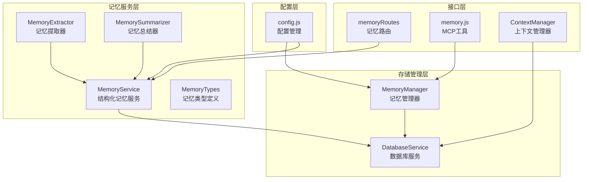
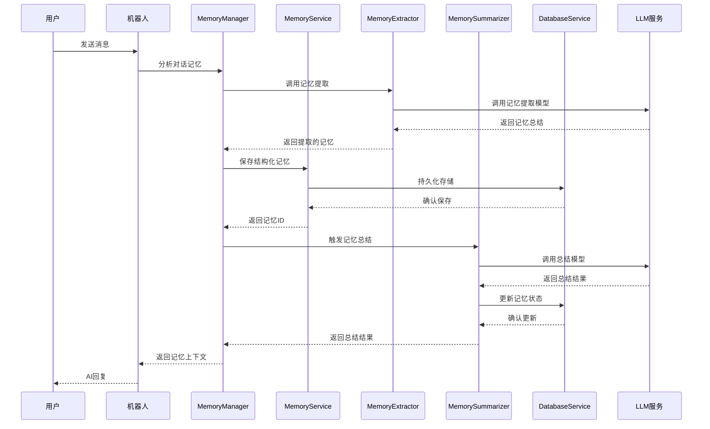
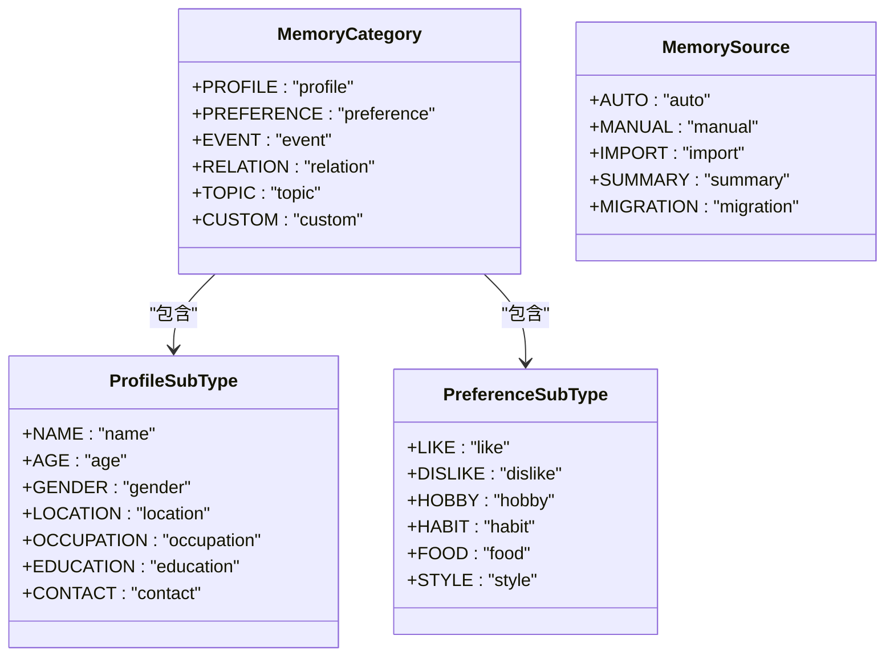
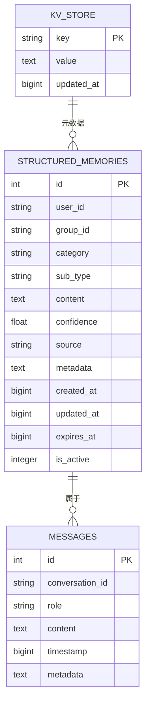
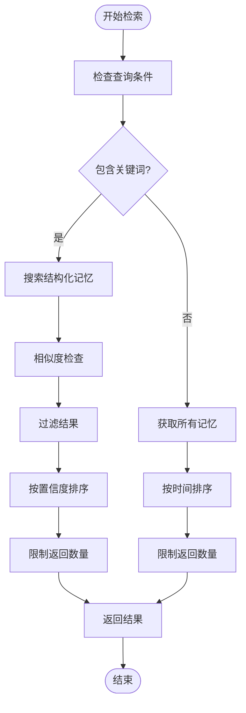
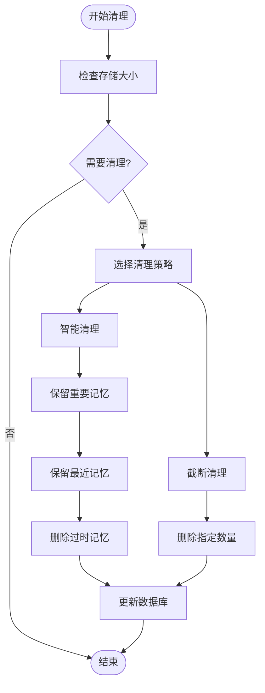
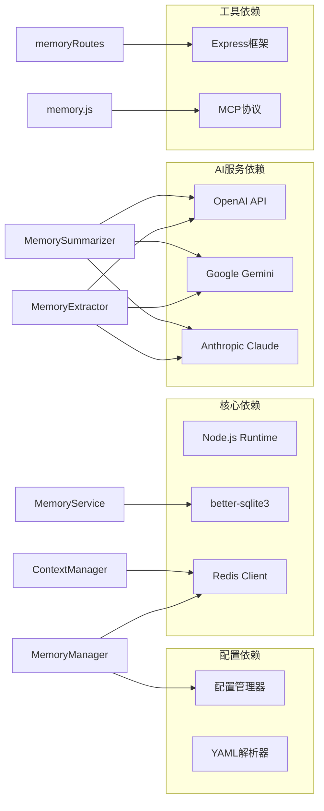
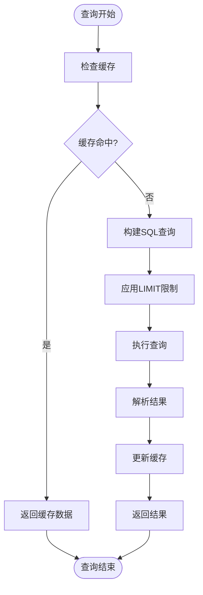

# 记忆管理系统

<cite>
**本文档引用的文件**
- [MemoryService.js](file://src/services/memory/MemoryService.js)
- [MemoryExtractor.js](file://src/services/memory/MemoryExtractor.js)
- [MemorySummarizer.js](file://src/services/memory/MemorySummarizer.js)
- [MemoryTypes.js](file://src/services/memory/MemoryTypes.js)
- [MemoryManager.js](file://src/services/storage/MemoryManager.js)
- [memoryRoutes.js](file://src/services/routes/memoryRoutes.js)
- [memory.js](file://src/mcp/tools/memory.js)
- [DatabaseService.js](file://src/services/storage/DatabaseService.js)
- [ContextManager.js](file://src/services/llm/ContextManager.js)
- [config.js](file://config/config.js)
- [记忆配置.md](file://docs/content/配置管理/记忆配置.md)
- [记忆与上下文工具.md](file://docs/content/工具调用系统/内置工具管理/记忆与上下文工具.md)
</cite>

## 目录
1. [简介](#简介)
2. [项目结构](#项目结构)
3. [核心组件](#核心组件)
4. [架构概览](#架构概览)
5. [详细组件分析](#详细组件分析)
6. [依赖关系分析](#依赖关系分析)
7. [性能考虑](#性能考虑)
8. [故障排除指南](#故障排除指南)
9. [结论](#结论)

## 简介

记忆管理系统是 ChatAI 插件的核心功能模块，负责管理用户记忆、维护对话上下文和提供历史记录查询。该系统集成了多种 AI 模型支持，包括 OpenAI、Google Gemini、Anthropic Claude 等，为 Yunzai-Bot 带来"全栈 AI"体验。

系统的主要功能包括：
- **用户记忆管理**：自动提取和存储用户个人信息、偏好和重要事件
- **对话上下文维护**：智能管理多轮对话的历史记录和上下文状态
- **群聊上下文分析**：基于群聊对话自动提取话题、关系和用户信息
- **知识库集成**：与预设系统结合提供结构化知识支持
- **持久化存储**：使用 SQLite 数据库存储所有记忆和对话历史

## 项目结构

**图表来源**
- [MemoryService.js](file://src/services/memory/MemoryService.js#L11-L24)
- [MemoryManager.js](file://src/services/storage/MemoryManager.js#L12-L31)
- [memoryRoutes.js](file://src/services/routes/memoryRoutes.js#L5-L11)

## 核心组件

### MemoryService - 结构化记忆服务

MemoryService 是记忆系统的核心服务，提供统一的记忆管理接口：

- **基础 CRUD 操作**：完整的记忆创建、读取、更新、删除功能
- **相似记忆检测**：避免重复记忆的智能去重机制
- **树状结构组织**：按分类组织记忆的层次化展示
- **上下文构建**：为 AI 模型提供格式化的记忆上下文
- **批量操作支持**：高效处理大量记忆的批量保存和清理

### MemoryExtractor - 记忆提取器

MemoryExtractor 负责从对话中自动提取有价值的记忆信息：

- **规则匹配提取**：使用正则表达式快速识别用户信息
- **LLM 智能提取**：基于对话内容生成结构化记忆
- **混合提取策略**：结合规则和 AI 的双重提取机制
- **内容相似度判断**：避免重复和冗余信息的智能过滤

### MemorySummarizer - 记忆总结器

MemorySummarizer 提供记忆的智能总结和清理功能：

- **分类总结**：对不同类型的记忆进行针对性总结
- **冲突解决**：处理新旧记忆之间的矛盾信息
- **低质量清理**：自动删除过期和低价值的记忆
- **可信度衰减**：随时间降低未被引用记忆的重要性

### MemoryManager - 记忆管理器

MemoryManager 是记忆系统的中央控制器：

- **周期性分析**：定时扫描用户对话历史进行总结和更新
- **群聊上下文分析**：收集群聊消息并提取有价值的群体信息
- **自动记忆提取**：基于对话内容自动识别和提取重要信息
- **记忆存储管理**：提供完整的 CRUD 操作接口

## 架构概览

**图表来源**
- [MemoryManager.js](file://src/services/storage/MemoryManager.js#L535-L653)
- [MemoryExtractor.js](file://src/services/memory/MemoryExtractor.js#L104-L147)
- [MemorySummarizer.js](file://src/services/memory/MemorySummarizer.js#L72-L137)

## 详细组件分析

### 记忆类型系统

系统定义了完整的记忆分类体系：

**图表来源**
- [MemoryTypes.js](file://src/services/memory/MemoryTypes.js#L7-L14)
- [MemoryTypes.js](file://src/services/memory/MemoryTypes.js#L17-L25)

### 记忆存储结构

系统采用统一的存储格式来管理不同类型的记忆：

**图表来源**
- [DatabaseService.js](file://src/services/storage/DatabaseService.js#L169-L191)

### 检索算法实现

系统实现了多种检索算法来优化记忆查询：

**图表来源**
- [MemoryService.js](file://src/services/memory/MemoryService.js#L366-L402)

### 清理策略机制

系统提供了多种清理策略来管理存储空间：

**图表来源**
- [MemorySummarizer.js](file://src/services/memory/MemorySummarizer.js#L243-L286)

## 依赖关系分析

**图表来源**
- [MemoryManager.js](file://src/services/storage/MemoryManager.js#L1-L20)
- [MemoryExtractor.js](file://src/services/memory/MemoryExtractor.js#L5-L17)
- [MemorySummarizer.js](file://src/services/memory/MemorySummarizer.js#L5-L9)

**章节来源**
- [MemoryManager.js](file://src/services/storage/MemoryManager.js#L1-L20)
- [MemoryExtractor.js](file://src/services/memory/MemoryExtractor.js#L5-L17)
- [MemorySummarizer.js](file://src/services/memory/MemorySummarizer.js#L5-L9)

## 性能考虑

### 存储优化策略

系统采用了多项存储优化技术：

1. **WAL 模式**：启用 Write-Ahead Logging 提高并发性能
2. **索引优化**：为常用查询字段建立高效索引
3. **消息去重**：防止重复消息的存储和处理
4. **内存缓存**：使用 Map 结构缓存热点数据

### 查询性能优化

**图表来源**
- [DatabaseService.js](file://src/services/storage/DatabaseService.js#L352-L378)

### 并发控制机制

系统实现了完善的并发控制机制：

- **异步锁**：防止多个请求同时修改同一用户数据
- **请求计数器**：监控并发请求数量
- **队列管理**：确保消息处理的顺序性
- **超时控制**：防止死锁和资源泄露

## 故障排除指南

### 常见问题诊断

| 问题类型 | 症状 | 可能原因 | 解决方案 |
|---------|------|---------|---------|
| 记忆提取失败 | `自动提取记忆失败` | LLM API 调用异常 | 检查 API 密钥和网络连接 |
| 数据库初始化失败 | `数据库初始化失败` | better-sqlite3 编译问题 | 重新构建原生模块 |
| 上下文清理异常 | `智能清理失败` | 配置参数错误 | 检查 context.cleaningStrategy 配置 |
| 内存溢出 | `内存占用过高` | 缺少定期清理 | 配置自动清理策略 |

### 配置调试建议

1. **启用调试模式**：在配置中设置 `debug: true`
2. **检查日志级别**：使用 `logger.debug()` 输出详细信息
3. **监控资源使用**：定期检查内存和磁盘使用情况
4. **验证配置**：确保所有配置项都正确设置

**章节来源**
- [config.js](file://config/config.js#L343-L360)
- [MemoryManager.js](file://src/services/storage/MemoryManager.js#L36-L81)

## 结论

记忆管理系统为 ChatAI 插件提供了强大的 AI 助手能力。通过智能的记忆提取、高效的上下文管理和可靠的持久化存储，系统能够为用户提供自然流畅的对话体验。

主要优势：
- **智能化记忆管理**：自动识别和提取重要信息
- **灵活的上下文控制**：支持多种隔离和清理策略
- **高性能存储**：基于 SQLite 的高效数据访问
- **可扩展架构**：模块化设计便于功能扩展

未来改进方向：
- 增强记忆检索的语义搜索能力
- 优化大规模数据的处理性能
- 扩展更多 AI 模型的支持
- 提供更丰富的记忆可视化界面