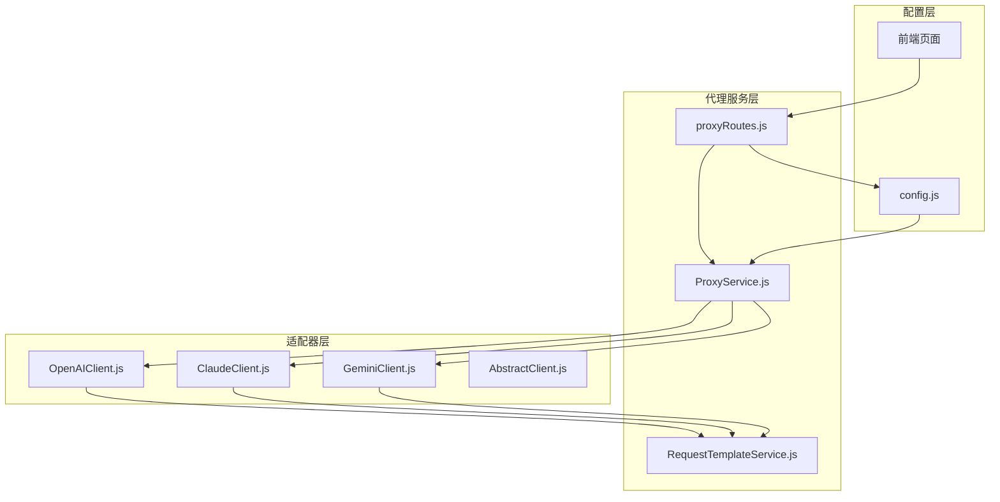
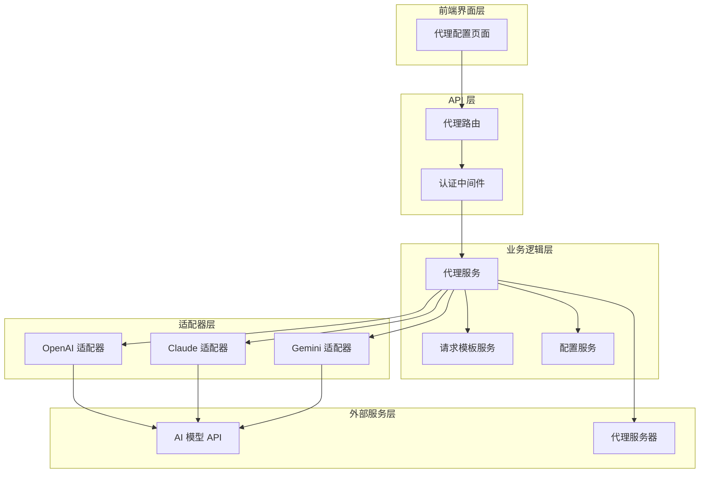
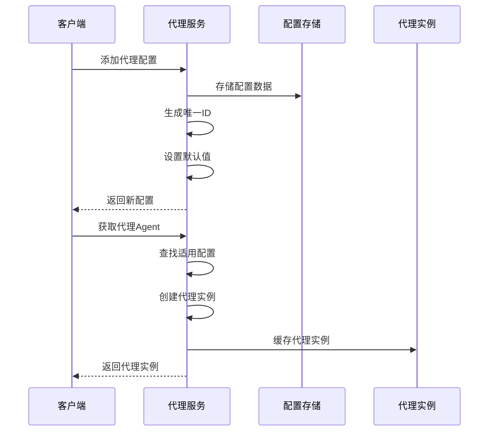
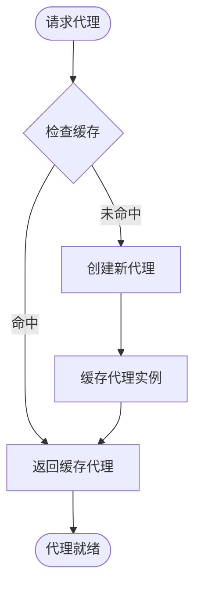
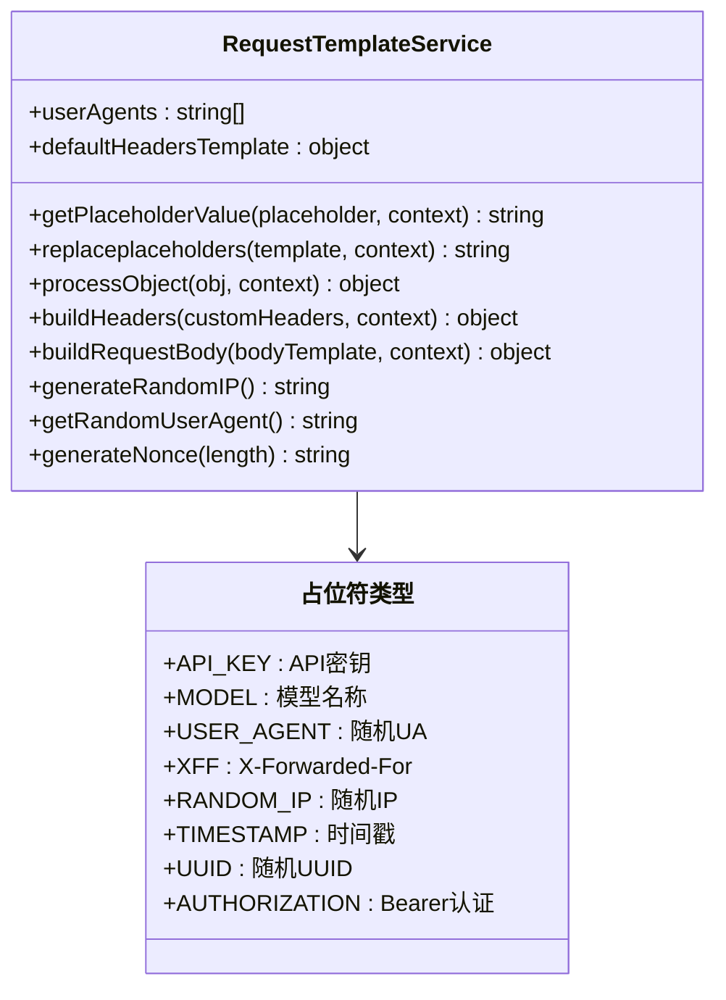
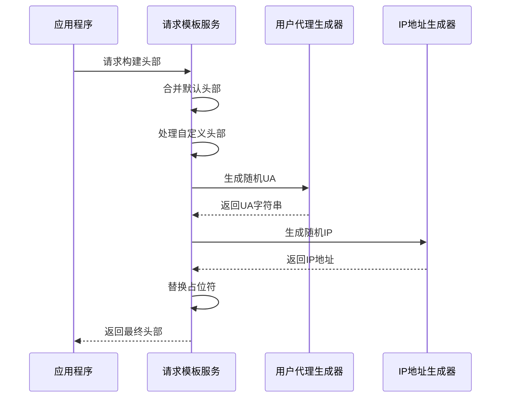
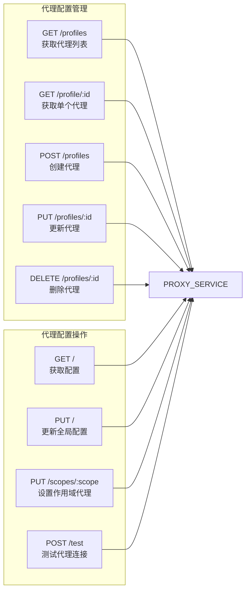
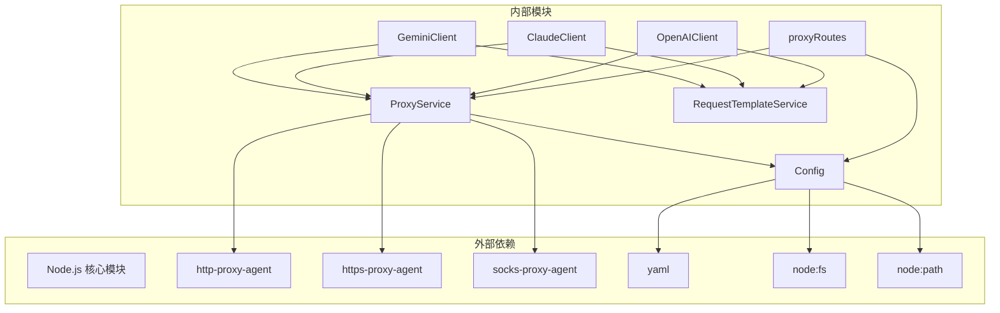

# 代理服务


## 目录
1. [简介](#简介)
2. [项目结构](#项目结构)
3. [核心组件](#核心组件)
4. [架构概览](#架构概览)
5. [详细组件分析](#详细组件分析)
6. [依赖关系分析](#依赖关系分析)
7. [性能考量](#性能考量)
8. [故障排除指南](#故障排除指南)
9. [结论](#结论)
10. [附录](#附录)

## 简介

ChatAI 插件的代理服务是一个强大的网络代理管理系统，专为 AI 模型适配器设计，提供了灵活的代理配置、请求模板管理和安全控制功能。该服务支持多种代理协议（HTTP、HTTPS、SOCKS4、SOCKS5），并集成了请求拦截、响应处理、头部修改、超时控制等高级特性。

代理服务的核心价值在于：
- **多环境代理支持**：为浏览器、API 请求和渠道 API 提供专门的代理配置
- **智能请求模板**：支持占位符替换和动态配置
- **安全防护机制**：包含请求验证、速率限制和访问控制
- **可视化管理界面**：提供直观的代理配置管理面板

## 项目结构

代理服务在整个项目架构中扮演着关键的基础设施角色，主要分布在以下目录：



**图表来源**
- [ProxyService.js](file://src/services/proxy/ProxyService.js#L1-L316)
- [RequestTemplateService.js](file://src/services/proxy/RequestTemplateService.js#L1-L303)
- [proxyRoutes.js](file://src/services/routes/proxyRoutes.js#L1-L128)

**章节来源**
- [ProxyService.js](file://src/services/proxy/ProxyService.js#L1-L316)
- [RequestTemplateService.js](file://src/services/proxy/RequestTemplateService.js#L1-L303)
- [proxyRoutes.js](file://src/services/routes/proxyRoutes.js#L1-L128)

## 核心组件

### ProxyService 代理服务

ProxyService 是代理服务的核心控制器，负责管理所有代理配置和连接。它提供了以下关键功能：

- **多环境代理配置**：支持 browser、api、channel 三种使用环境
- **代理类型支持**：HTTP、HTTPS、SOCKS4、SOCKS5 代理协议
- **智能代理缓存**：优化代理连接性能
- **代理测试功能**：验证代理连接的有效性

### RequestTemplateService 请求模板服务

RequestTemplateService 提供了强大的请求模板管理能力，支持：

- **占位符系统**：内置丰富的占位符变量
- **动态头部构建**：自动处理请求头的动态生成
- **请求体模板**：支持复杂的请求体结构定义
- **模板验证**：确保模板格式的正确性

### 代理路由系统

代理路由系统提供了完整的 RESTful API 接口，支持：

- **代理配置管理**：增删改查代理配置
- **作用域代理设置**：为不同环境分配代理
- **代理连接测试**：在线测试代理有效性
- **实时配置更新**：动态修改代理设置

**章节来源**
- [ProxyService.js](file://src/services/proxy/ProxyService.js#L13-L316)
- [RequestTemplateService.js](file://src/services/proxy/RequestTemplateService.js#L23-L303)
- [proxyRoutes.js](file://src/services/routes/proxyRoutes.js#L1-L128)

## 架构概览

代理服务采用分层架构设计，确保了良好的可维护性和扩展性：



**图表来源**
- [proxyRoutes.js](file://src/services/routes/proxyRoutes.js#L1-L128)
- [OpenAIClient.js](file://src/core/adapters/openai/OpenAIClient.js#L13-L16)
- [ClaudeClient.js](file://src/core/adapters/claude/ClaudeClient.js#L1-L27)
- [GeminiClient.js](file://src/core/adapters/gemini/GeminiClient.js#L1-L30)

## 详细组件分析

### ProxyService 代理服务详解

#### 代理配置管理

ProxyService 提供了完整的代理配置生命周期管理：



**图表来源**
- [ProxyService.js](file://src/services/proxy/ProxyService.js#L187-L245)
- [ProxyService.js](file://src/services/proxy/ProxyService.js#L130-L160)

#### 代理类型支持

服务支持四种代理协议，每种都有特定的应用场景：

| 代理类型 | 协议 | 适用场景 | 特点 |
|---------|------|----------|------|
| HTTP | HTTP/1.1 | 通用 Web 请求 | 配置简单，兼容性好 |
| HTTPS | HTTP/1.1 over TLS | 安全通信 | 支持加密传输 |
| SOCKS4 | SOCKS4 | 高级网络绕过 | 支持 TCP 转发 |
| SOCKS5 | SOCKS5 | 最灵活的代理 | 支持 UDP 和认证 |

#### 代理缓存机制

为了提升性能，ProxyService 实现了智能代理缓存：



**图表来源**
- [ProxyService.js](file://src/services/proxy/ProxyService.js#L130-L160)

**章节来源**
- [ProxyService.js](file://src/services/proxy/ProxyService.js#L13-L316)

### RequestTemplateService 请求模板服务详解

#### 占位符系统

RequestTemplateService 提供了丰富的占位符变量，支持动态内容生成：



**图表来源**
- [RequestTemplateService.js](file://src/services/proxy/RequestTemplateService.js#L23-L303)

#### 动态头部构建

服务能够智能处理请求头的动态生成和修改：



**图表来源**
- [RequestTemplateService.js](file://src/services/proxy/RequestTemplateService.js#L199-L218)

**章节来源**
- [RequestTemplateService.js](file://src/services/proxy/RequestTemplateService.js#L1-L303)

### 代理路由系统详解

#### RESTful API 设计

代理路由系统提供了完整的 CRUD 操作接口：



**图表来源**
- [proxyRoutes.js](file://src/services/routes/proxyRoutes.js#L1-L128)

#### 作用域代理管理

服务支持为不同使用环境分配专用代理：

| 作用域 | 描述 | 用途 |
|--------|------|------|
| browser | 浏览器环境 | 网页访问工具 |
| api | 通用API请求 | HTTP客户端请求 |
| channel | 渠道API请求 | LLM API调用 |

**章节来源**
- [proxyRoutes.js](file://src/services/routes/proxyRoutes.js#L1-L128)

## 依赖关系分析

代理服务的依赖关系体现了清晰的分层架构：



**图表来源**
- [ProxyService.js](file://src/services/proxy/ProxyService.js#L1-L5)
- [config.js](file://config/config.js#L1-L631)

### 关键依赖关系

1. **代理库依赖**：使用专门的代理库处理不同协议
2. **配置持久化**：通过 YAML 文件存储配置数据
3. **适配器集成**：与 AI 模型适配器深度集成
4. **前端界面**：提供可视化的配置管理界面

**章节来源**
- [ProxyService.js](file://src/services/proxy/ProxyService.js#L1-L5)
- [config.js](file://config/config.js#L1-L631)

## 性能考量

### 代理缓存优化

ProxyService 实现了智能缓存机制来提升性能：

- **代理实例缓存**：避免重复创建相同的代理实例
- **缓存键设计**：基于代理 URL 和目标协议的组合键
- **内存管理**：提供缓存清理接口防止内存泄漏

### 模板处理性能

RequestTemplateService 采用了高效的模板处理策略：

- **惰性计算**：只在需要时进行占位符替换
- **对象遍历优化**：递归处理复杂嵌套对象
- **正则表达式缓存**：复用编译后的正则表达式

### 并发处理

服务支持高并发场景：

- **异步操作**：所有网络操作都是异步的
- **代理池管理**：合理管理代理连接池
- **超时控制**：为代理连接设置合理的超时时间

## 故障排除指南

### 常见问题诊断

#### 代理连接失败

**症状**：代理测试失败或 API 调用超时

**排查步骤**：
1. 验证代理服务器可达性
2. 检查认证凭据是否正确
3. 确认代理协议类型匹配
4. 测试代理服务器的响应时间

#### 请求被拒绝

**症状**：代理连接建立但请求被拒绝

**排查步骤**：
1. 检查代理服务器的访问控制列表
2. 验证目标网站的访问权限
3. 确认请求头是否符合目标服务器要求
4. 检查防火墙和安全策略

#### 模板解析错误

**症状**：请求模板无法正确解析

**排查步骤**：
1. 验证 JSON 模板格式的正确性
2. 检查占位符的拼写和大小写
3. 确认上下文数据的完整性
4. 测试模板预览功能

### 调试技巧

1. **启用调试模式**：在配置中启用详细的日志记录
2. **使用测试功能**：通过代理测试功能验证配置
3. **监控代理性能**：观察代理连接的响应时间和成功率
4. **检查配置持久化**：确保配置更改已正确保存到文件

**章节来源**
- [ProxyService.js](file://src/services/proxy/ProxyService.js#L280-L310)
- [RequestTemplateService.js](file://src/services/proxy/RequestTemplateService.js#L247-L258)

## 结论

ChatAI 插件的代理服务是一个设计精良、功能完备的网络代理管理系统。它通过以下特点展现了优秀的工程实践：

- **模块化设计**：清晰的职责分离和接口定义
- **可扩展性**：支持新的代理协议和模板类型
- **安全性**：内置的安全检查和防护机制
- **易用性**：提供直观的配置界面和完善的 API
- **性能优化**：智能缓存和高效的模板处理

该代理服务为 AI 模型适配器提供了强大的网络基础设施支持，确保了在各种网络环境下的稳定运行。

## 附录

### 配置示例

#### 基本代理配置

```yaml
proxy:
  enabled: true
  profiles:
    - id: proxy-1
      name: "本地代理"
      type: "http"
      host: "127.0.0.1"
      port: 7890
      username: ""
      password: ""
      enabled: true
  scopes:
    browser:
      enabled: false
      profileId: null
    api:
      enabled: true
      profileId: proxy-1
    channel:
      enabled: true
      profileId: proxy-1
```

#### 请求模板配置

```json
{
  "headersTemplate": {
    "Authorization": "{{AUTHORIZATION}}",
    "User-Agent": "{{USER_AGENT}}",
    "X-Forwarded-For": "{{XFF}}"
  },
  "requestBodyTemplate": {
    "model": "{{MODEL}}",
    "messages": [
      {
        "role": "system",
        "content": "你是一个AI助手"
      },
      {
        "role": "user",
        "content": "{{INPUT}}"
      }
    ]
  }
}
```

### API 使用示例

#### 获取代理配置

```javascript
// GET /api/proxy
const response = await fetch('/api/proxy');
const config = await response.json();
```

#### 设置作用域代理

```javascript
// PUT /api/proxy/scopes/channel
await fetch('/api/proxy/scopes/channel', {
  method: 'PUT',
  headers: { 'Content-Type': 'application/json' },
  body: JSON.stringify({
    profileId: 'proxy-1',
    enabled: true
  })
});
```

#### 测试代理连接

```javascript
// POST /api/proxy/test
await fetch('/api/proxy/test', {
  method: 'POST',
  headers: { 'Content-Type': 'application/json' },
  body: JSON.stringify({
    profileId: 'proxy-1',
    testUrl: 'https://www.google.com'
  })
});
```

### 安全最佳实践

1. **代理凭据保护**：使用加密存储代理认证信息
2. **访问控制**：限制代理配置的访问权限
3. **超时设置**：为代理连接设置合理的超时时间
4. **日志审计**：记录代理使用情况便于审计
5. **定期测试**：定期验证代理连接的有效性
