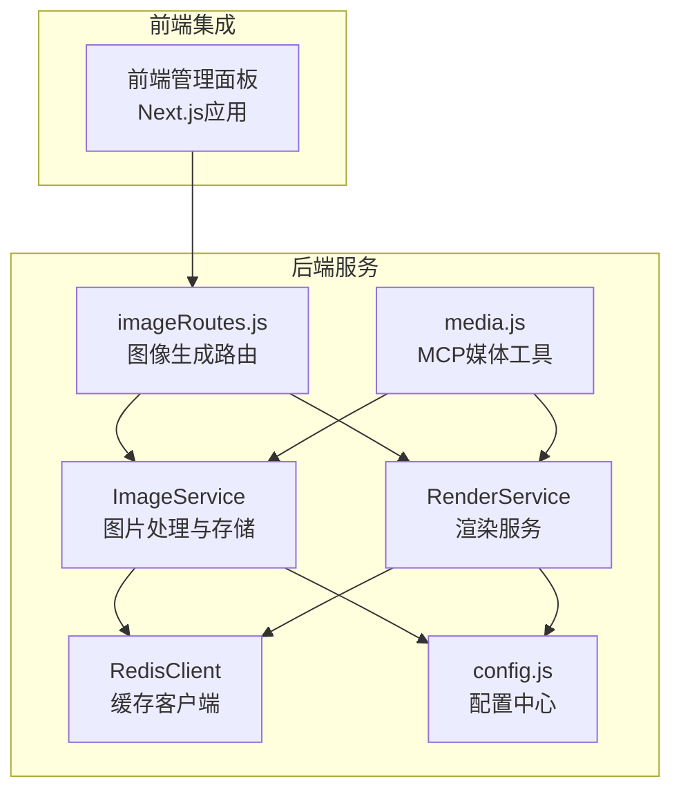
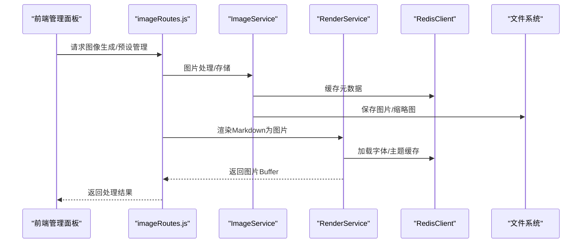
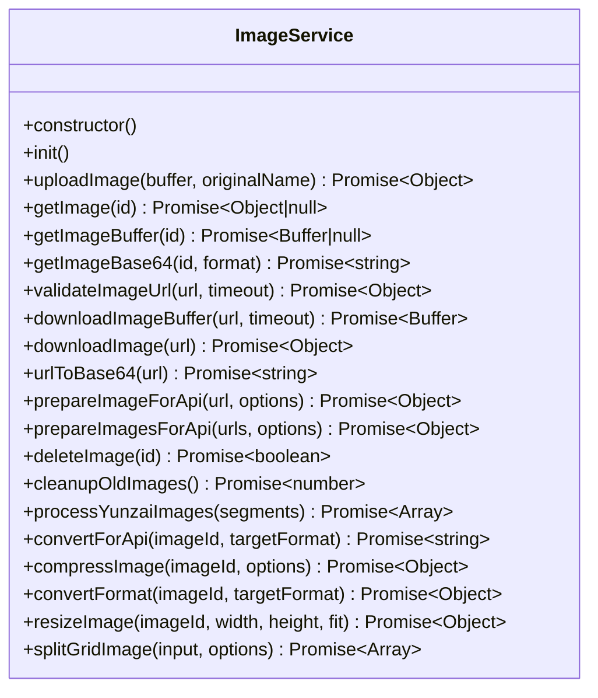
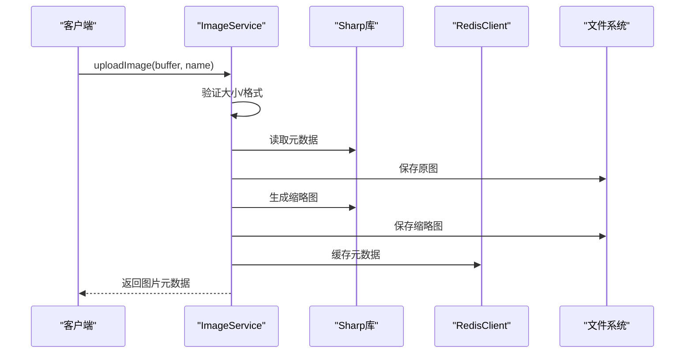
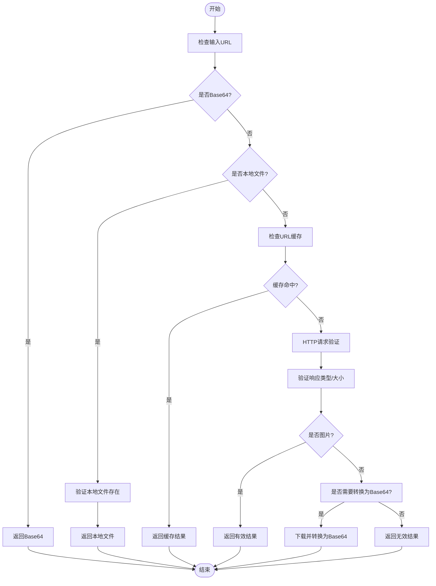
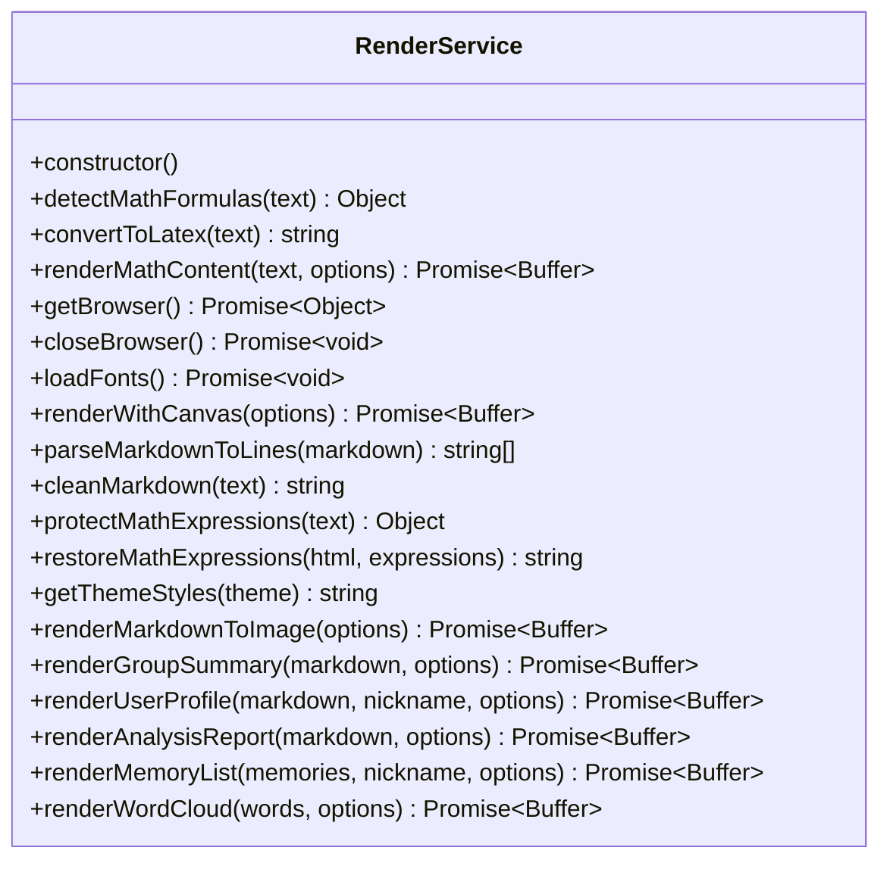
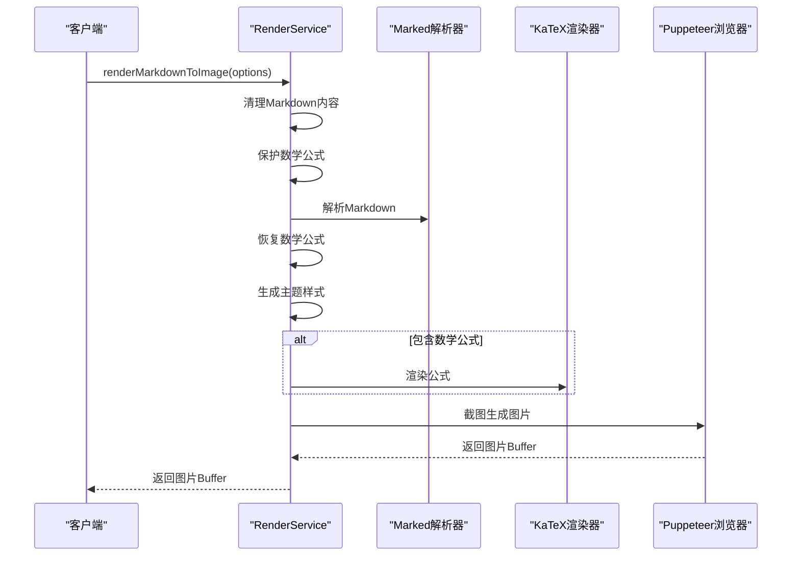
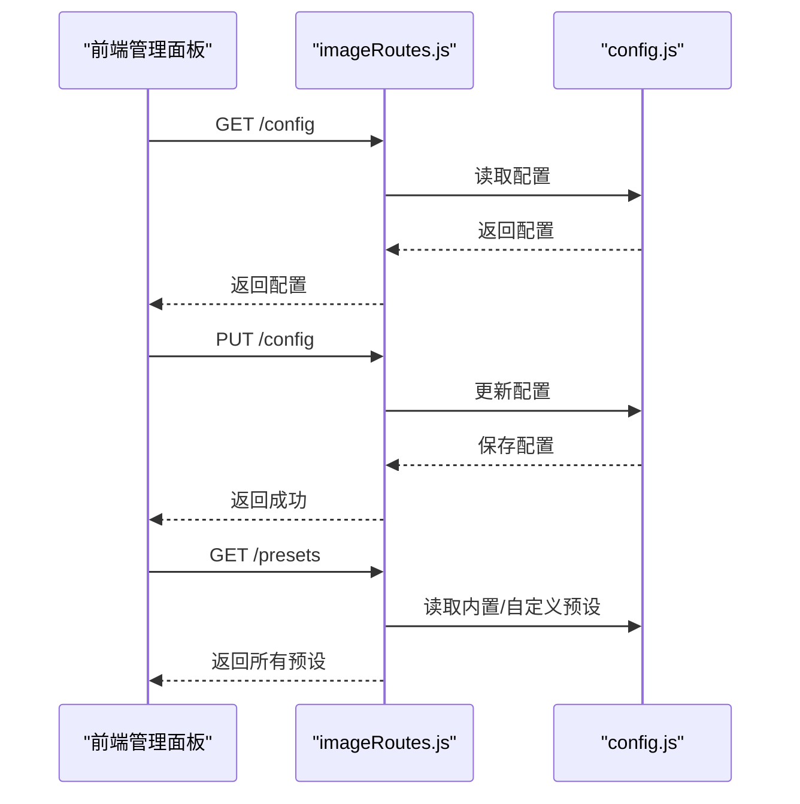
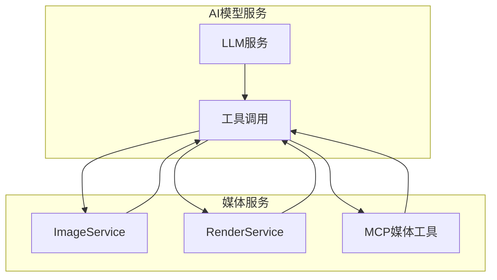
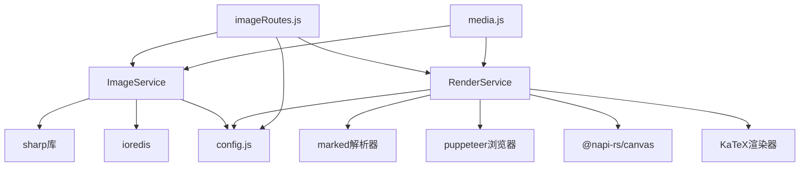

# 媒体服务

<cite>
**本文档引用的文件**
- [ImageService.js](file://src/services/media/ImageService.js)
- [RenderService.js](file://src/services/media/RenderService.js)
- [RedisClient.js](file://src/core/cache/RedisClient.js)
- [config.js](file://config/config.js)
- [imageRoutes.js](file://src/services/routes/imageRoutes.js)
- [media.js](file://src/mcp/tools/media.js)
</cite>

## 目录
1. [简介](#简介)
2. [项目结构](#项目结构)
3. [核心组件](#核心组件)
4. [架构概览](#架构概览)
5. [详细组件分析](#详细组件分析)
6. [依赖分析](#依赖分析)
7. [性能考虑](#性能考虑)
8. [故障排除指南](#故障排除指南)
9. [结论](#结论)
10. [附录](#附录)

## 简介
本文档详细介绍 ChatAI 插件的媒体服务，重点涵盖 ImageService 的图片生成与处理能力，以及 RenderService 的渲染服务实现。内容包括图片尺寸控制、格式转换、质量优化、模板渲染、样式处理、输出格式控制等特性。同时说明媒体服务与前端管理面板的集成方式，以及与 AI 模型服务的协作机制，并提供具体的使用示例、错误处理策略，以及媒体文件的存储、缓存和清理机制。

## 项目结构
媒体服务位于插件的后端服务层，采用模块化设计，主要文件组织如下：
- 媒体服务核心：ImageService（图片处理）、RenderService（渲染服务）
- 缓存服务：RedisClient（基于 ioredis 的 Redis 客户端）
- 配置管理：config.js（统一配置中心）
- 路由接口：imageRoutes.js（图像生成相关 API）
- MCP 工具：media.js（媒体处理工具集）



**图表来源**
- [ImageService.js](file://src/services/media/ImageService.js#L1-L849)
- [RenderService.js](file://src/services/media/RenderService.js#L1-L2439)
- [RedisClient.js](file://src/core/cache/RedisClient.js#L1-L130)
- [config.js](file://config/config.js#L1-L631)
- [imageRoutes.js](file://src/services/routes/imageRoutes.js#L1-L487)
- [media.js](file://src/mcp/tools/media.js#L1-L892)

**章节来源**
- [ImageService.js](file://src/services/media/ImageService.js#L1-L849)
- [RenderService.js](file://src/services/media/RenderService.js#L1-L2439)
- [RedisClient.js](file://src/core/cache/RedisClient.js#L1-L130)
- [config.js](file://config/config.js#L1-L631)
- [imageRoutes.js](file://src/services/routes/imageRoutes.js#L1-L487)
- [media.js](file://src/mcp/tools/media.js#L1-L892)

## 核心组件
本节概述媒体服务的关键组件及其职责：

- ImageService：负责图片上传、验证、处理、存储、缓存、删除、批量处理、格式转换、尺寸调整、压缩、网格切割等。
- RenderService：负责将 Markdown 文本渲染为图片，支持数学公式渲染、主题样式、模板渲染、Canvas 快速渲染、Puppeteer 渲染等。
- RedisClient：提供 Redis 缓存能力，用于图片元数据缓存、URL 验证缓存等。
- 配置系统：集中管理媒体服务相关的配置，包括存储路径、大小限制、格式支持、渲染主题等。
- 路由接口：提供图像生成、预设管理、配置更新等 API。
- MCP 工具：提供解析图片、生成二维码、发送图片等工具方法。

**章节来源**
- [ImageService.js](file://src/services/media/ImageService.js#L17-L86)
- [RenderService.js](file://src/services/media/RenderService.js#L39-L83)
- [RedisClient.js](file://src/core/cache/RedisClient.js#L4-L61)
- [config.js](file://config/config.js#L271-L282)
- [imageRoutes.js](file://src/services/routes/imageRoutes.js#L57-L113)
- [media.js](file://src/mcp/tools/media.js#L8-L75)

## 架构概览
媒体服务采用分层架构，前端通过路由接口与后端交互，后端通过服务层处理业务逻辑，缓存层提供高性能数据访问，配置层统一管理运行参数。



**图表来源**
- [imageRoutes.js](file://src/services/routes/imageRoutes.js#L319-L330)
- [ImageService.js](file://src/services/media/ImageService.js#L41-L86)
- [RenderService.js](file://src/services/media/RenderService.js#L873-L1020)
- [RedisClient.js](file://src/core/cache/RedisClient.js#L43-L65)

## 详细组件分析

### ImageService 组件分析
ImageService 是媒体服务的核心，负责图片的全生命周期管理。

#### 主要功能
- 图片上传与验证：支持 Buffer、URL、本地文件等多种输入源，进行大小限制、格式验证、元数据提取。
- 图片处理：缩略图生成、格式转换、尺寸调整、质量压缩、网格切割。
- 存储与缓存：本地文件存储 + Redis 缓存，支持图片删除、清理旧文件。
- URL 处理：支持 HTTP/HTTPS、本地文件、Base64、QQ 特殊域名等，自动转换为可用格式。
- 批量处理：支持批量准备图片用于 API 调用。

#### 关键特性
- **尺寸控制**：支持指定最大宽高，自动按比例缩放，防止放大。
- **格式转换**：支持 JPEG、PNG、WebP、GIF 等格式转换，可指定质量参数。
- **质量优化**：提供压缩接口，计算压缩前后字节数和节省百分比。
- **网格切割**：支持将图片按行列切割为多个单元格，用于 OCR 或分析场景。
- **URL 验证**：支持 HTTP HEAD/GET 验证，特殊域名自动添加 Referer，缓存验证结果。



**图表来源**
- [ImageService.js](file://src/services/media/ImageService.js#L17-L849)

**章节来源**
- [ImageService.js](file://src/services/media/ImageService.js#L17-L849)

#### 图片处理流程（序列图）


**图表来源**
- [ImageService.js](file://src/services/media/ImageService.js#L41-L86)
- [RedisClient.js](file://src/core/cache/RedisClient.js#L43-L65)

#### URL 验证与转换流程（流程图）


**图表来源**
- [ImageService.js](file://src/services/media/ImageService.js#L164-L250)
- [ImageService.js](file://src/services/media/ImageService.js#L346-L425)

### RenderService 组件分析
RenderService 负责将 Markdown 文本渲染为高质量图片，支持数学公式渲染、主题样式、模板渲染等。

#### 主要功能
- **数学公式渲染**：自动检测数学公式，使用 KaTeX 渲染，支持多种 LaTeX 语法。
- **主题样式**：支持浅色/深色主题，动态生成 CSS 样式。
- **模板渲染**：提供群聊总结、用户画像、分析报告、记忆列表、词云等模板。
- **渲染引擎**：优先使用 Canvas 快速渲染，回退到 Puppeteer 渲染。
- **字体管理**：支持自定义中文字体，自动加载系统字体。

#### 关键特性
- **数学公式检测**：使用正则表达式检测 LaTeX 块级、行内、环境等公式，避免误判。
- **主题样式**：动态生成 CSS，支持容器、标题、列表、代码块、表格等样式。
- **模板系统**：提供多种预设模板，支持自定义标题、副标题、图标、时间戳等。
- **性能优化**：Canvas 渲染比 Puppeteer 快 10 倍以上，适合大量文本渲染。



**图表来源**
- [RenderService.js](file://src/services/media/RenderService.js#L39-L2399)

**章节来源**
- [RenderService.js](file://src/services/media/RenderService.js#L39-L2399)

#### 渲染流程（序列图）


**图表来源**
- [RenderService.js](file://src/services/media/RenderService.js#L873-L1020)

### 前端管理面板集成
媒体服务与前端管理面板通过 Express 路由接口进行集成，提供以下功能：
- 图像生成配置管理：获取/更新图像生成配置
- 预设管理：内置、自定义、远程预设的增删改查
- 预设来源管理：添加/更新/删除预设来源
- 预设热重载与远程更新



**图表来源**
- [imageRoutes.js](file://src/services/routes/imageRoutes.js#L59-L113)
- [config.js](file://config/config.js#L591-L626)

**章节来源**
- [imageRoutes.js](file://src/services/routes/imageRoutes.js#L57-L487)
- [config.js](file://config/config.js#L477-L490)

### 与 AI 模型服务的协作机制
媒体服务与 AI 模型服务通过以下方式协作：
- 图片预处理：ImageService 将图片转换为 API 友好的格式（Base64），支持强制转换以绕过网络限制。
- 渲染服务：RenderService 将 AI 生成的 Markdown 内容渲染为图片，便于展示。
- MCP 工具：提供解析图片、生成二维码、发送图片等工具，供 AI 工具调用。



**图表来源**
- [media.js](file://src/mcp/tools/media.js#L19-L75)
- [ImageService.js](file://src/services/media/ImageService.js#L346-L425)
- [RenderService.js](file://src/services/media/RenderService.js#L873-L1020)

**章节来源**
- [media.js](file://src/mcp/tools/media.js#L1-L892)
- [ImageService.js](file://src/services/media/ImageService.js#L346-L425)
- [RenderService.js](file://src/services/media/RenderService.js#L873-L1020)

## 依赖分析
媒体服务的依赖关系清晰，耦合度低，便于维护和扩展。



**图表来源**
- [ImageService.js](file://src/services/media/ImageService.js#L1-L10)
- [RenderService.js](file://src/services/media/RenderService.js#L1-L33)
- [imageRoutes.js](file://src/services/routes/imageRoutes.js#L4-L18)
- [media.js](file://src/mcp/tools/media.js#L6-L7)

**章节来源**
- [ImageService.js](file://src/services/media/ImageService.js#L1-L10)
- [RenderService.js](file://src/services/media/RenderService.js#L1-L33)
- [imageRoutes.js](file://src/services/routes/imageRoutes.js#L4-L18)
- [media.js](file://src/mcp/tools/media.js#L6-L7)

## 性能考虑
- **缓存策略**：使用 Redis 缓存图片元数据和 URL 验证结果，减少重复 IO 和网络请求。
- **渲染优化**：优先使用 Canvas 快速渲染，适合大量文本渲染场景；Puppeteer 适合复杂 HTML/CSS 场景。
- **图片处理**：使用 Sharp 进行高效的图片处理，支持多格式转换和质量控制。
- **内存管理**：及时释放 Puppeteer 浏览器实例，避免内存泄漏。
- **并发处理**：批量处理图片时使用 Promise.all 并行执行，提高吞吐量。

## 故障排除指南
- **图片上传失败**：检查文件大小是否超过限制、格式是否受支持、磁盘空间是否充足。
- **URL 无法访问**：检查网络连接、目标服务器是否支持 HEAD/GET 请求、是否需要特殊 Referer。
- **渲染失败**：检查 Puppeteer 是否正确安装、字体文件是否存在、HTML/CSS 是否合法。
- **Redis 连接失败**：检查 Redis 服务状态、配置参数是否正确、网络是否可达。
- **内存不足**：监控内存使用情况，及时清理缓存和关闭不必要的浏览器实例。

**章节来源**
- [ImageService.js](file://src/services/media/ImageService.js#L164-L250)
- [RenderService.js](file://src/services/media/RenderService.js#L402-L425)
- [RedisClient.js](file://src/core/cache/RedisClient.js#L10-L41)

## 结论
媒体服务提供了完整的图片处理和渲染能力，具备良好的扩展性和稳定性。通过合理的缓存策略、渲染优化和错误处理机制，能够满足各种复杂的媒体处理需求。建议在生产环境中合理配置 Redis、字体文件和渲染参数，以获得最佳性能和用户体验。

## 附录

### 使用示例

#### 图片生成流程
```javascript
// 1. 上传图片
const imageData = await imageService.uploadImage(buffer, 'example.png');

// 2. 转换为 API 友好格式
const base64Url = await imageService.getImageBase64(imageData.id, 'jpeg');

// 3. 准备图片用于 API 调用
const prepared = await imageService.prepareImageForApi(url, { forceBase64: true });
```

#### 渲染配置选项
```javascript
// 渲染 Markdown 为图片
const imageBuffer = await renderService.renderMarkdownToImage({
  markdown: '# 标题\n\n内容',
  title: '标题',
  subtitle: '副标题',
  icon: '📊',
  theme: 'light',
  width: 800,
  showTimestamp: true
});
```

#### 错误处理策略
```javascript
try {
  const result = await imageService.prepareImageForApi(url);
  if (!result.url) {
    throw new Error(result.error || '无法获取图片');
  }
} catch (error) {
  logger.error('图片处理失败:', error.message);
  // 回退到本地文件或其他处理方式
}
```

### 配置选项
- **图片存储**：storagePath、maxSize、allowedFormats
- **渲染主题**：render.mathFormula、render.theme、render.width
- **图像生成**：features.imageGen.enabled、model、timeout、maxImages

**章节来源**
- [config.js](file://config/config.js#L278-L282)
- [config.js](file://config/config.js#L393-L398)
- [config.js](file://config/config.js#L477-L490)