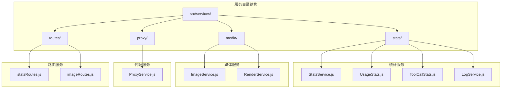
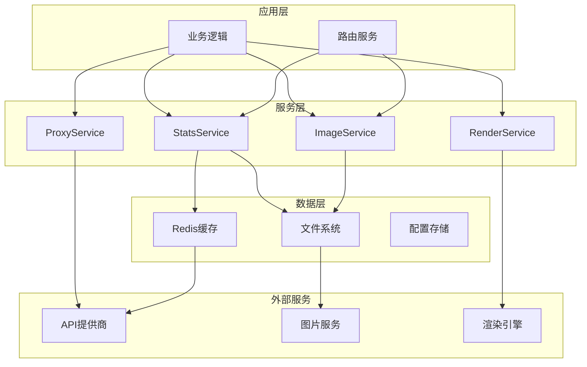
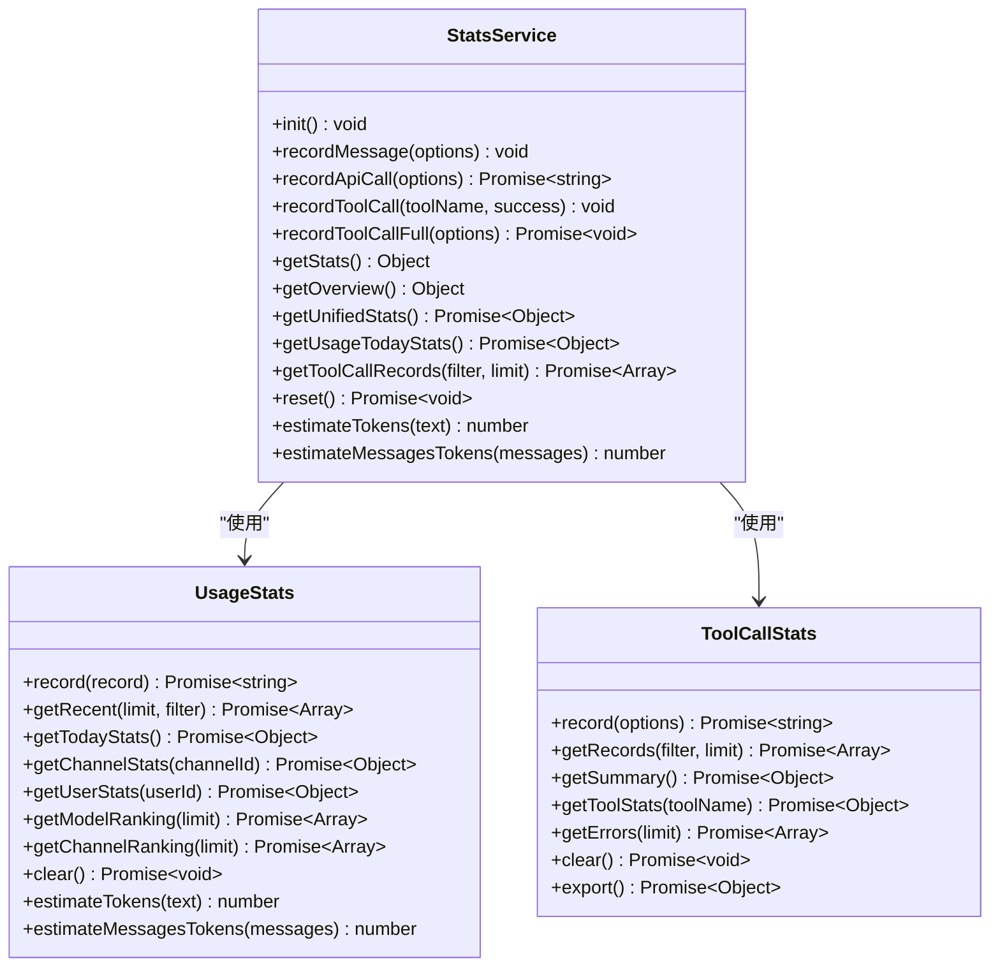
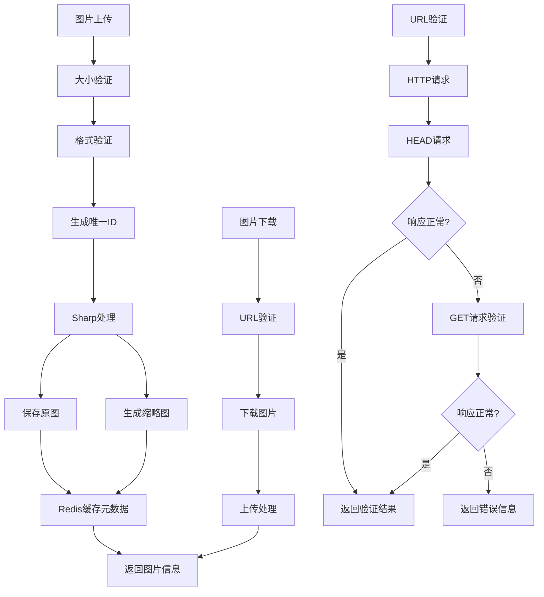
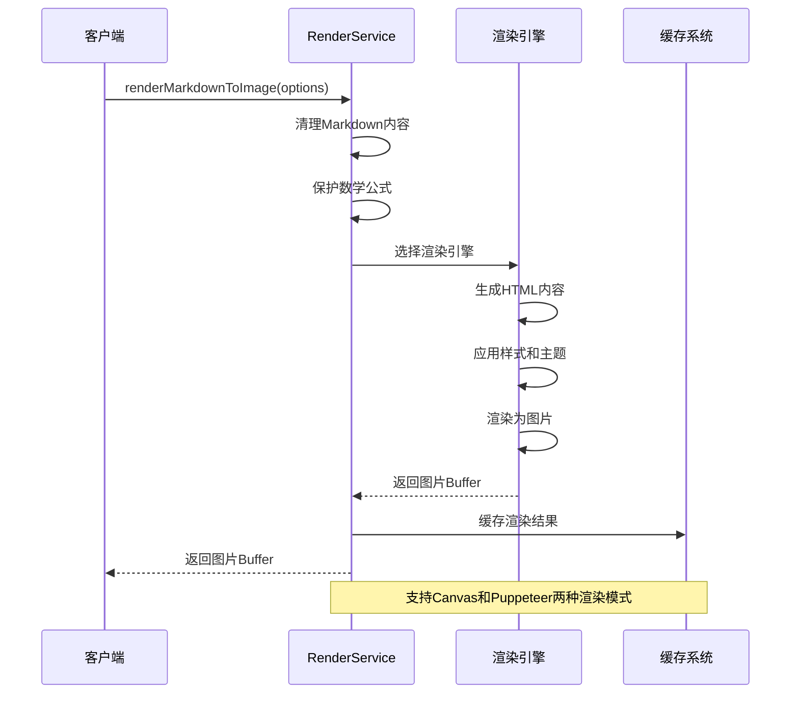
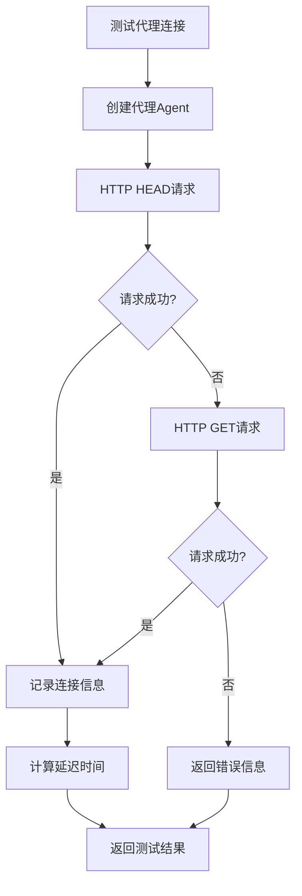
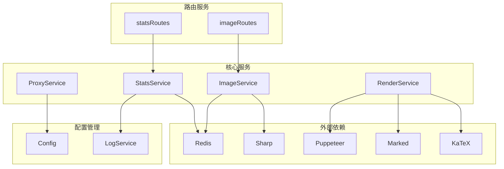

# 工具服务组件

<cite>
**本文档引用的文件**
- [StatsService.js](file://src/services/stats/StatsService.js)
- [UsageStats.js](file://src/services/stats/UsageStats.js)
- [ToolCallStats.js](file://src/services/stats/ToolCallStats.js)
- [LogService.js](file://src/services/stats/LogService.js)
- [ImageService.js](file://src/services/media/ImageService.js)
- [RenderService.js](file://src/services/media/RenderService.js)
- [ProxyService.js](file://src/services/proxy/ProxyService.js)
- [config.js](file://config/config.js)
- [statsRoutes.js](file://src/services/routes/statsRoutes.js)
- [imageRoutes.js](file://src/services/routes/imageRoutes.js)
</cite>

## 目录
1. [简介](#简介)
2. [项目结构](#项目结构)
3. [核心组件](#核心组件)
4. [架构概览](#架构概览)
5. [详细组件分析](#详细组件分析)
6. [依赖关系分析](#依赖关系分析)
7. [性能考虑](#性能考虑)
8. [故障排除指南](#故障排除指南)
9. [结论](#结论)

## 简介

ChatAI 插件的工具服务组件是一套完整的基础设施服务集合，为整个聊天AI系统提供统计分析、媒体处理、代理服务等功能支持。本文档深入介绍了统计服务(StatsService)、使用统计(UsageStats)、图片服务(ImageService)、渲染服务(RenderService)、代理服务(ProxyService)等核心工具类服务。

这些服务组件采用模块化设计，通过清晰的接口定义和标准化的数据结构，为上层应用提供了可靠的服务支撑。每个服务都有其特定的功能定位和使用场景，共同构成了ChatAI插件的强大功能基础。

## 项目结构

工具服务组件主要分布在以下目录结构中：

**图表来源**
- [StatsService.js](file://src/services/stats/StatsService.js#L1-L682)
- [ImageService.js](file://src/services/media/ImageService.js#L1-L849)
- [ProxyService.js](file://src/services/proxy/ProxyService.js#L1-L316)

## 核心组件

### 统计服务家族

统计服务家族是ChatAI插件的核心数据收集和分析组件，主要包括以下四个核心服务：

#### StatsService - 统一统计管理器
StatsService作为统计系统的统一管理器，负责协调各个统计子系统的数据收集和整合。它提供了完整的统计数据生命周期管理，包括初始化、保存、更新和查询功能。

#### UsageStats - API使用统计
UsageStats专注于记录和分析API调用的详细信息，包括请求参数、响应结果、错误信息、耗时统计等。它使用Redis进行高性能的数据存储和查询。

#### ToolCallStats - 工具调用统计
ToolCallStats专门记录工具调用的完整生命周期，包括请求详情、响应内容、错误堆栈、执行耗时等信息。它提供了详细的工具使用分析能力。

#### LogService - 错误日志管理
LogService负责系统日志的统一管理和持久化存储，支持多种日志类型和格式，提供日志清理和查询功能。

**章节来源**
- [StatsService.js](file://src/services/stats/StatsService.js#L19-L682)
- [UsageStats.js](file://src/services/stats/UsageStats.js#L44-L592)
- [ToolCallStats.js](file://src/services/stats/ToolCallStats.js#L32-L379)
- [LogService.js](file://src/services/stats/LogService.js#L12-L553)

### 媒体服务家族

媒体服务家族提供了丰富的图片处理和渲染功能：

#### ImageService - 图片处理服务
ImageService提供了完整的图片处理能力，包括图片上传、格式转换、压缩、裁剪、网格分割等功能。它支持多种图片格式和处理算法。

#### RenderService - Markdown渲染服务
RenderService专注于将Markdown内容渲染为精美的图片，支持数学公式渲染、主题切换、自定义样式等功能。它结合了Puppeteer和Canvas两种渲染技术。

**章节来源**
- [ImageService.js](file://src/services/media/ImageService.js#L17-L849)
- [RenderService.js](file://src/services/media/RenderService.js#L39-L2439)

### 代理服务

ProxyService提供了灵活的代理配置和管理功能，支持多种代理协议和作用域配置。

**章节来源**
- [ProxyService.js](file://src/services/proxy/ProxyService.js#L13-L316)

## 架构概览

工具服务组件采用了分层架构设计，通过清晰的职责分离和接口抽象，实现了高内聚、低耦合的服务体系。

**图表来源**
- [StatsService.js](file://src/services/stats/StatsService.js#L1-L682)
- [ImageService.js](file://src/services/media/ImageService.js#L1-L849)
- [RenderService.js](file://src/services/media/RenderService.js#L1-L2439)
- [ProxyService.js](file://src/services/proxy/ProxyService.js#L1-L316)

## 详细组件分析

### StatsService 组件分析

StatsService是统计系统的核心协调器，负责管理所有统计数据的收集、存储和查询。

#### 核心功能特性

**实时RPM跟踪**
- 滑动窗口机制：维护1分钟和5分钟的请求时间戳数组
- 动态计算：实时计算每分钟请求数和成功率
- 内存优化：限制时间戳数组的最大长度

**多维度统计**
- 消息统计：按类型、群组、用户、小时分布统计
- 模型统计：按模型、渠道、用户统计调用情况
- Token统计：输入输出Token的详细追踪
- 工具统计：工具调用次数和成功率分析

**数据持久化**
- JSON文件存储：本地文件持久化统计数据
- Redis集成：详细统计的分布式存储
- 自动保存：定期保存统计数据防止丢失

#### API接口设计

**图表来源**
- [StatsService.js](file://src/services/stats/StatsService.js#L19-L682)
- [UsageStats.js](file://src/services/stats/UsageStats.js#L44-L592)
- [ToolCallStats.js](file://src/services/stats/ToolCallStats.js#L32-L379)

#### 使用场景

StatsService适用于以下场景：
- 实时监控系统性能指标
- 分析用户行为模式
- 监控API使用情况
- 评估工具调用效果
- 生成运营报表和分析

**章节来源**
- [StatsService.js](file://src/services/stats/StatsService.js#L19-L682)
- [UsageStats.js](file://src/services/stats/UsageStats.js#L44-L592)
- [ToolCallStats.js](file://src/services/stats/ToolCallStats.js#L32-L379)

### ImageService 组件分析

ImageService提供了完整的图片处理和管理功能，是媒体处理的核心服务。

#### 核心功能特性

**图片上传和验证**
- 大小限制：默认10MB限制
- 格式验证：支持jpg、jpeg、png、gif、webp格式
- 唯一标识：生成随机ID确保文件唯一性

**智能处理和优化**
- Sharp集成：高质量的图片处理库
- 缩略图生成：自动生成200x200像素缩略图
- 格式转换：支持多种格式的相互转换
- 压缩优化：智能压缩减少存储空间

**缓存和存储**
- Redis缓存：图片元数据的高速缓存
- 文件系统存储：图片文件的实际存储
- TTL管理：自动清理过期缓存数据

#### 图片处理流程

**图表来源**
- [ImageService.js](file://src/services/media/ImageService.js#L41-L317)

#### API接口设计

ImageService提供了丰富的API接口：

**基础操作**
- `uploadImage(buffer, originalName)`：上传图片
- `getImage(id)`：获取图片信息
- `getImageBuffer(id)`：获取图片缓冲区
- `getImageBase64(id, format)`：获取Base64编码

**高级功能**
- `prepareImageForApi(url, options)`：准备图片用于API调用
- `compressImage(imageId, options)`：压缩图片
- `convertFormat(imageId, targetFormat)`：转换图片格式
- `splitGridImage(input, options)`：网格分割图片

**章节来源**
- [ImageService.js](file://src/services/media/ImageService.js#L17-L849)

### RenderService 组件分析

RenderService专注于将Markdown内容渲染为精美的图片，是内容展示的核心服务。

#### 核心功能特性

**数学公式渲染**
- LaTeX支持：完整的LaTeX语法支持
- KaTeX集成：高性能的数学公式渲染引擎
- 自动检测：智能识别和保护数学表达式

**主题和样式**
- 主题系统：支持浅色和深色主题
- 自定义样式：可配置的颜色和字体
- 响应式设计：适配不同屏幕尺寸

**渲染引擎选择**
- Canvas渲染：快速渲染，适合简单内容
- Puppeteer渲染：功能完整，适合复杂内容
- 自动降级：根据可用性选择最佳渲染方式

#### 渲染流程

**图表来源**
- [RenderService.js](file://src/services/media/RenderService.js#L873-L1020)

#### 数学公式检测算法

RenderService实现了复杂的数学公式检测算法：

**检测模式**
- 块级公式：`$$...$$` 和 `\[...\]` 格式
- 行内公式：`$...$` 和 `\(...\)` 格式  
- LaTeX环境：`\begin{...}...\end{...}` 结构
- 数学命令：`\frac`, `\sqrt`, `\sum` 等命令

**智能保护机制**
- 公式保护：避免被Markdown解析器破坏
- 内容恢复：渲染完成后恢复原始公式
- 性能优化：仅对包含数学内容的页面启用KaTeX

**章节来源**
- [RenderService.js](file://src/services/media/RenderService.js#L39-L2439)

### ProxyService 组件分析

ProxyService提供了灵活的代理配置和管理功能，支持多种代理协议和作用域配置。

#### 代理配置管理

**配置结构**
- 全局启用状态：控制代理功能的整体开关
- 代理配置：支持HTTP、HTTPS、SOCKS4、SOCKS5协议
- 作用域配置：为不同场景配置专用代理
- 缓存机制：代理Agent的高效缓存

**作用域管理**
- 浏览器代理：用于Puppeteer等浏览器场景
- API代理：用于通用HTTP请求
- 渠道代理：用于特定API提供商

#### 代理连接测试

**图表来源**
- [ProxyService.js](file://src/services/proxy/ProxyService.js#L280-L310)

#### API接口设计

ProxyService提供了完整的代理管理API：

**配置管理**
- `getConfig()`：获取代理配置
- `getProfiles()`：获取所有代理配置
- `addProfile(profile)`：添加代理配置
- `updateProfile(id, updates)`：更新代理配置
- `deleteProfile(id)`：删除代理配置

**代理获取**
- `getBrowserProxyArgs()`：获取浏览器代理参数
- `getApiProxyAgent(targetUrl)`：获取API代理Agent
- `getChannelProxyAgent(targetUrl)`：获取渠道代理Agent

**章节来源**
- [ProxyService.js](file://src/services/proxy/ProxyService.js#L13-L316)

## 依赖关系分析

工具服务组件之间的依赖关系体现了清晰的分层架构设计。

**图表来源**
- [StatsService.js](file://src/services/stats/StatsService.js#L5-L14)
- [ImageService.js](file://src/services/media/ImageService.js#L1-L7)
- [RenderService.js](file://src/services/media/RenderService.js#L1-L6)
- [ProxyService.js](file://src/services/proxy/ProxyService.js#L1-L4)

### 服务间交互

服务间的交互遵循松耦合原则，通过标准化的接口进行通信：

**StatsService协调机制**
- StatsService作为中央协调器，管理其他服务的生命周期
- 统一的数据格式和接口标准
- 异常处理和错误传播机制

**数据流向**
- StatsService → UsageStats：API调用统计
- StatsService → ToolCallStats：工具调用统计  
- ImageService → Redis：图片元数据缓存
- RenderService → 文件系统：渲染结果存储

**章节来源**
- [StatsService.js](file://src/services/stats/StatsService.js#L1-L682)
- [config.js](file://config/config.js#L295-L303)

## 性能考虑

工具服务组件在设计时充分考虑了性能优化，采用了多种技术和策略来提升系统性能。

### 缓存策略

**多层缓存架构**
- 内存缓存：高频访问数据的快速缓存
- Redis缓存：分布式数据共享和持久化
- 文件系统缓存：静态资源的本地缓存

**缓存失效机制**
- TTL控制：自动过期和清理机制
- LRU淘汰：智能的缓存空间管理
- 手动清理：支持强制清理和重建

### 异步处理

**非阻塞操作**
- 异步Redis操作：避免阻塞主线程
- 并行处理：多个任务的并发执行
- 流式处理：大数据量的分块处理

**性能监控**
- 执行时间统计：关键操作的性能追踪
- 内存使用监控：资源消耗的实时监控
- 错误率统计：系统稳定性的量化指标

### 资源管理

**连接池管理**
- 数据库连接池：高效的数据库访问
- HTTP客户端池：优化的网络请求
- 文件句柄管理：合理的文件操作

**内存优化**
- 对象池：重复对象的复用
- 延迟加载：按需加载的策略
- 垃圾回收：及时的内存释放

## 故障排除指南

### 常见问题诊断

**统计服务问题**
- Redis连接失败：检查Redis服务器状态和配置
- 数据丢失：验证文件权限和磁盘空间
- 性能下降：检查缓存命中率和内存使用

**图片服务问题**
- 图片上传失败：检查文件大小和格式限制
- Sharp错误：验证ImageMagick安装和权限
- 缓存异常：清理Redis缓存和文件系统缓存

**渲染服务问题**
- Puppeteer启动失败：检查Chrome/Chromium安装
- Canvas模块加载失败：验证@napi-rs/canvas安装
- 数学公式渲染错误：检查KaTeX CDN可用性

### 调试技巧

**日志分析**
- 启用详细日志：`debug: true`配置
- 关键路径追踪：重要操作的详细日志
- 错误堆栈分析：完整的错误信息追踪

**性能分析**
- 性能指标监控：RPM、响应时间、错误率
- 资源使用监控：CPU、内存、磁盘IO
- 依赖关系分析：第三方服务的性能影响

**章节来源**
- [LogService.js](file://src/services/stats/LogService.js#L12-L553)
- [config.js](file://config/config.js#L64-L74)

## 结论

ChatAI插件的工具服务组件通过精心设计的架构和完善的实现，为整个系统提供了强大的基础设施支持。各个服务组件各司其职，协同工作，形成了一个功能完整、性能优异、易于维护的服务体系。

**主要优势**
- **模块化设计**：清晰的职责分离和接口抽象
- **高性能实现**：多层缓存和异步处理机制
- **灵活配置**：支持多种部署环境和使用场景
- **完善监控**：全面的性能指标和日志记录

**未来发展方向**
- **微服务化**：进一步拆分服务组件，支持独立部署
- **容器化**：提供Docker支持，简化部署流程
- **云原生**：支持Kubernetes部署和弹性伸缩
- **可观测性**：增强监控和告警能力

这套工具服务组件为ChatAI插件的成功运行奠定了坚实的基础，也为后续的功能扩展和性能优化提供了良好的平台支撑。