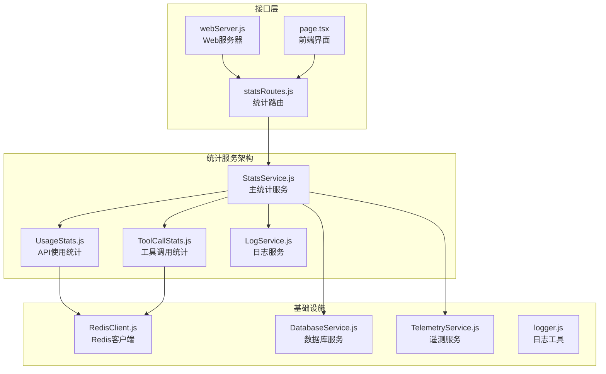
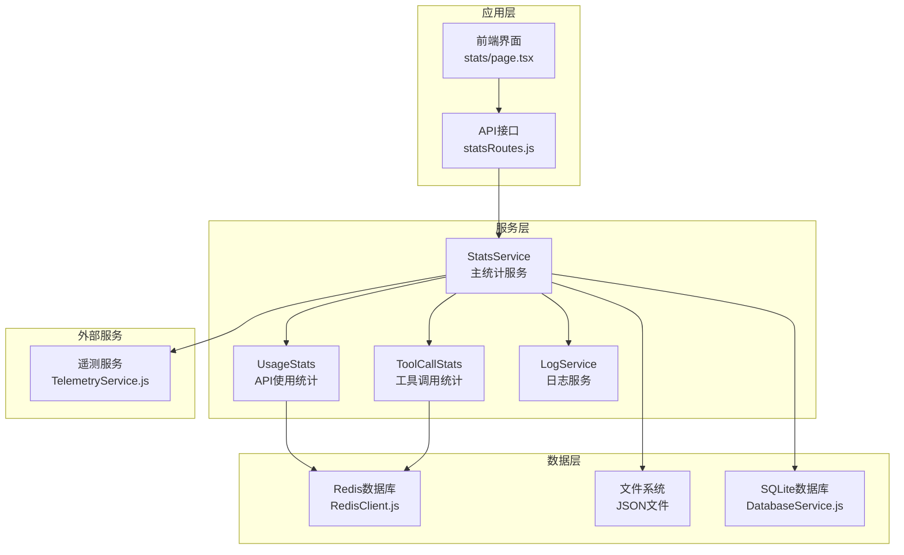
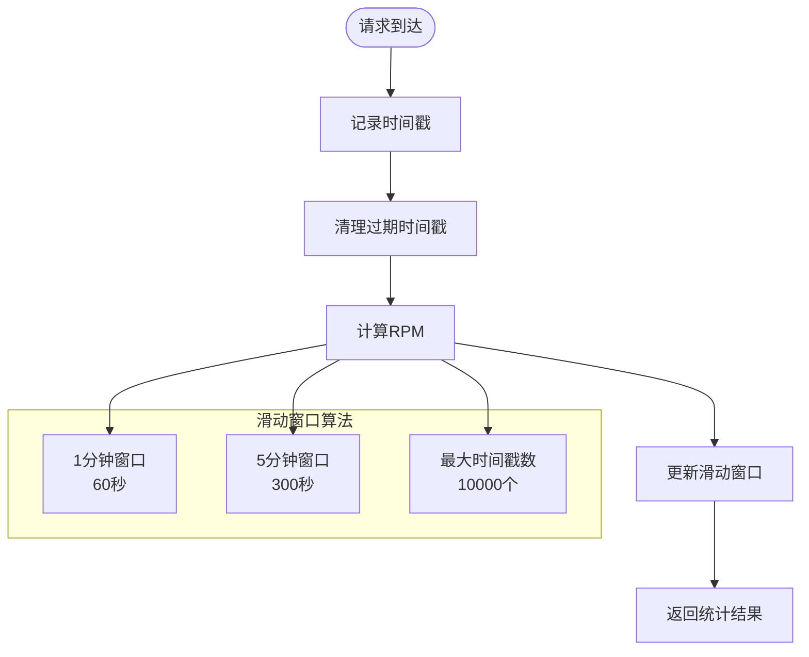
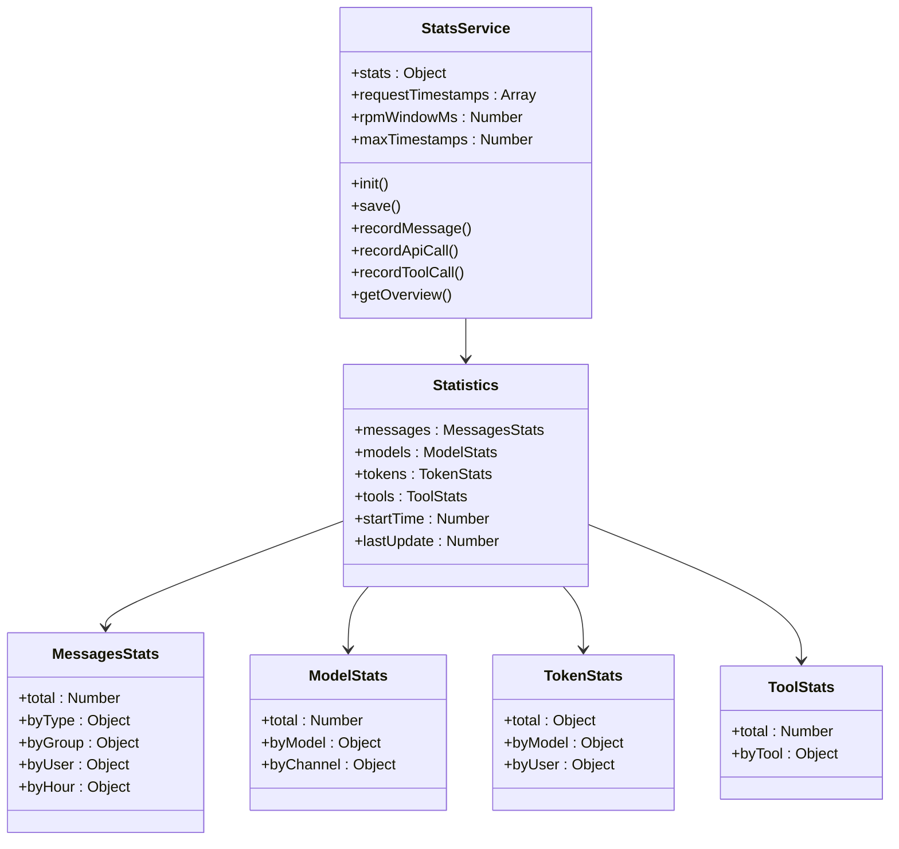
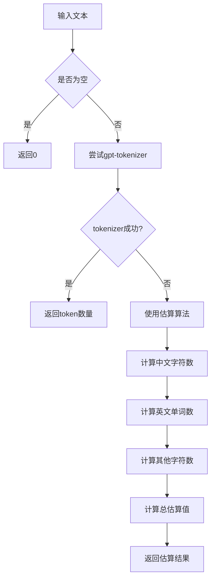
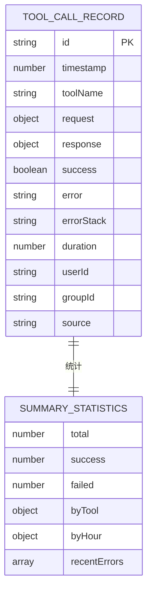
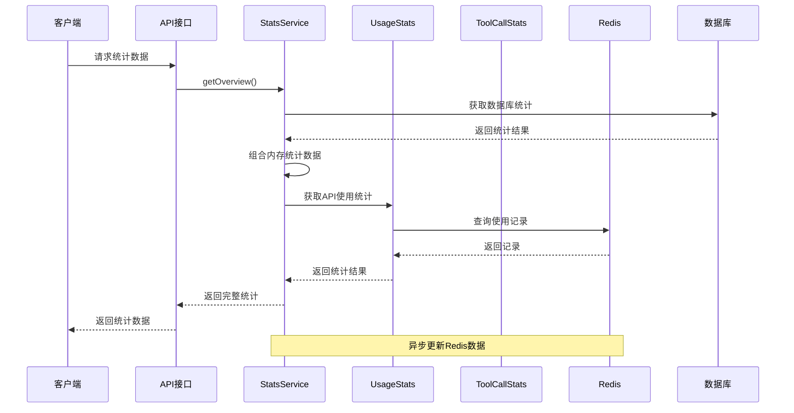
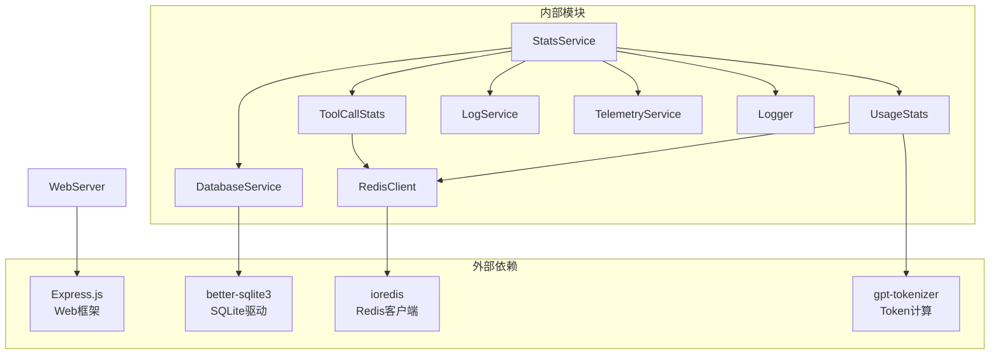
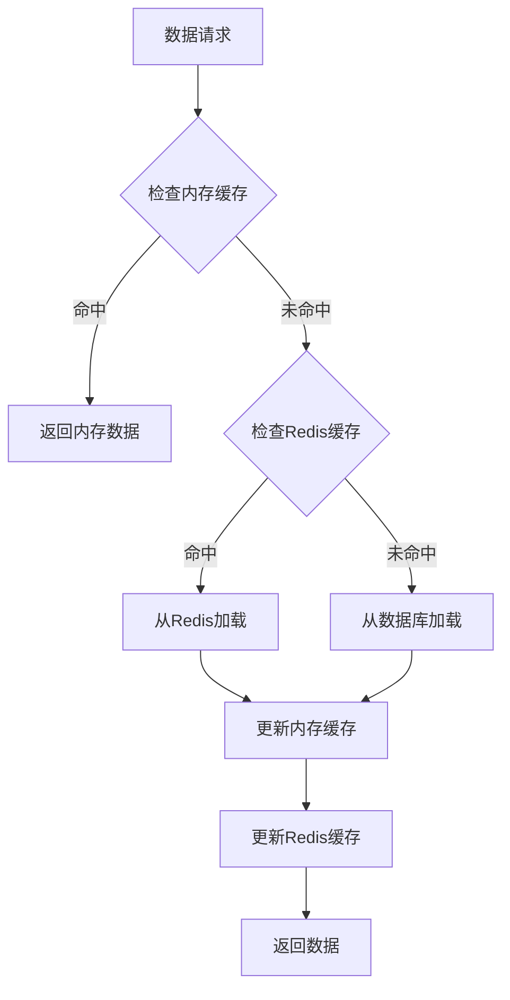

# 统计服务


## 目录
1. [简介](#简介)
2. [项目结构](#项目结构)
3. [核心组件](#核心组件)
4. [架构概览](#架构概览)
5. [详细组件分析](#详细组件分析)
6. [依赖关系分析](#依赖关系分析)
7. [性能考虑](#性能考虑)
8. [故障排除指南](#故障排除指南)
9. [结论](#结论)
10. [附录](#附录)

## 简介

ChatAI 插件的统计服务是一个综合性的数据收集和分析系统，负责追踪和分析插件运行过程中的各种指标。该服务提供了多层次的数据统计能力，包括消息统计、模型调用统计、Token 统计、工具调用统计等核心功能。

统计服务采用分布式架构设计，结合内存缓存、文件持久化和 Redis 数据库，实现了高性能的数据收集和存储。服务还集成了遥测功能，能够将使用数据上报到远程服务器进行分析。

## 项目结构

统计服务位于插件的 `src/services/stats/` 目录下，包含以下核心文件：



**图表来源**
- [StatsService.js](file://src/services/stats/StatsService.js#L1-L682)
- [UsageStats.js](file://src/services/stats/UsageStats.js#L1-L592)
- [ToolCallStats.js](file://src/services/stats/ToolCallStats.js#L1-L379)
- [RedisClient.js](file://src/core/cache/RedisClient.js#L1-L130)

**章节来源**
- [StatsService.js](file://src/services/stats/StatsService.js#L1-L682)
- [config.js](file://config/config.js#L271-L277)

## 核心组件

### StatsService 主统计服务

StatsService 是整个统计系统的核心，负责协调各个统计模块的工作。它提供了统一的接口来记录和查询各种统计数据。

主要功能特性：
- **实时RPM计算**：基于滑动窗口算法计算每分钟和每5分钟的请求速率
- **多维度统计**：支持消息、模型、Token、工具调用的全方位统计
- **数据持久化**：结合文件系统和Redis实现数据持久化
- **遥测集成**：与遥测服务协作，实现数据上报

### UsageStats API使用统计

UsageStats 专门负责记录和分析API调用的详细信息，包括请求参数、响应结果、错误信息等。

关键特性：
- **详细的使用记录**：记录每次API调用的完整信息
- **Token估算**：提供智能的Token估算功能
- **Redis优化**：使用Redis实现高性能的数据存储
- **统计聚合**：支持按日期、模型、渠道等维度的统计

### ToolCallStats 工具调用统计

ToolCallStats 专注于工具调用的详细记录和分析，包括工具名称、参数、结果、错误等信息。

核心功能：
- **完整记录**：记录工具调用的完整生命周期
- **错误追踪**：详细记录失败的工具调用
- **性能监控**：统计工具调用的执行时间和成功率
- **内存优化**：使用内存缓存和Redis结合的方式

### LogService 日志服务

LogService 提供结构化的日志记录功能，支持多种日志类型和级别的管理。

主要特性：
- **多类型日志**：支持错误、警告、API、工具、渠道等多种日志类型
- **文件轮转**：自动管理日志文件的创建和清理
- **缓冲机制**：使用缓冲区减少磁盘I/O操作
- **安全过滤**：自动过滤敏感信息，保护用户隐私

**章节来源**
- [StatsService.js](file://src/services/stats/StatsService.js#L19-L37)
- [UsageStats.js](file://src/services/stats/UsageStats.js#L44-L50)
- [ToolCallStats.js](file://src/services/stats/ToolCallStats.js#L32-L47)
- [LogService.js](file://src/services/stats/LogService.js#L12-L22)

## 架构概览

统计服务采用分层架构设计，实现了高内聚、低耦合的系统结构：



**图表来源**
- [webServer.js](file://src/services/webServer.js#L524-L537)
- [statsRoutes.js](file://src/services/routes/statsRoutes.js#L1-L98)
- [StatsService.js](file://src/services/stats/StatsService.js#L5-L14)

## 详细组件分析

### StatsService 核心功能详解

StatsService 提供了丰富的统计功能，以下是其核心方法的详细分析：

#### 实时RPM计算机制



**图表来源**
- [StatsService.js](file://src/services/stats/StatsService.js#L32-L72)

#### 数据持久化策略

StatsService 采用了多层次的数据持久化策略：

1. **内存缓存**：所有统计数据首先存储在内存中，确保快速访问
2. **文件持久化**：定期将统计数据保存到JSON文件中
3. **Redis备份**：重要的统计数据同时备份到Redis数据库中

#### 统计数据结构



**图表来源**
- [StatsService.js](file://src/services/stats/StatsService.js#L22-L29)

**章节来源**
- [StatsService.js](file://src/services/stats/StatsService.js#L77-L104)
- [StatsService.js](file://src/services/stats/StatsService.js#L106-L136)

### UsageStats API使用统计

UsageStats 提供了详细的API使用统计功能，包括Token估算、请求记录、统计聚合等。

#### Token估算算法



**图表来源**
- [UsageStats.js](file://src/services/stats/UsageStats.js#L62-L74)

#### Redis数据结构设计

UsageStats 使用Redis的多种数据结构来优化性能：

| 数据类型 | 键模式 | 用途 | 过期时间 |
|---------|--------|------|----------|
| List | `chaite:usage_list` | 存储使用记录列表 | 永不过期 |
| Hash | `chaite:usage_stats:YYYY-MM-DD` | 按日期统计 | 30天 |
| Hash | `chaite:usage_stats:hourly:YYYY-MM-DD:HH` | 按小时统计 | 7天 |
| Hash | `chaite:usage_stats:channel:{channelId}` | 按渠道统计 | 90天 |

**章节来源**
- [UsageStats.js](file://src/services/stats/UsageStats.js#L199-L263)
- [UsageStats.js](file://src/services/stats/UsageStats.js#L268-L295)

### ToolCallStats 工具调用统计

ToolCallStats 专注于工具调用的详细记录和分析，提供了完整的工具调用生命周期管理。

#### 记录结构设计



**图表来源**
- [ToolCallStats.js](file://src/services/stats/ToolCallStats.js#L16-L30)

#### 数据清理策略

ToolCallStats 实现了智能的数据清理机制：

1. **固定容量限制**：最多保存1000条记录
2. **内存与Redis结合**：使用内存缓存提高访问速度
3. **自动清理**：超出容量时自动删除最旧的记录
4. **错误追踪**：维护最近50个错误记录

**章节来源**
- [ToolCallStats.js](file://src/services/stats/ToolCallStats.js#L86-L143)
- [ToolCallStats.js](file://src/services/stats/ToolCallStats.js#L201-L232)

### 集成与协作

统计服务与其他组件的集成方式如下：



**图表来源**
- [statsRoutes.js](file://src/services/routes/statsRoutes.js#L18-L26)
- [StatsService.js](file://src/services/stats/StatsService.js#L431-L489)

**章节来源**
- [StatsService.js](file://src/services/stats/StatsService.js#L431-L489)
- [statsRoutes.js](file://src/services/routes/statsRoutes.js#L1-L98)

## 依赖关系分析

统计服务的依赖关系体现了清晰的分层架构：



**图表来源**
- [StatsService.js](file://src/services/stats/StatsService.js#L5-L14)
- [UsageStats.js](file://src/services/stats/UsageStats.js#L1-L9)
- [RedisClient.js](file://src/core/cache/RedisClient.js#L1-L2)

**章节来源**
- [StatsService.js](file://src/services/stats/StatsService.js#L5-L14)
- [UsageStats.js](file://src/services/stats/UsageStats.js#L1-L9)

## 性能考虑

统计服务在设计时充分考虑了性能优化：

### 内存优化策略

1. **增量更新**：所有统计都是增量更新，避免全量重算
2. **内存缓存**：使用内存缓存热点数据，减少磁盘I/O
3. **批量操作**：定期批量保存数据，减少频繁写入

### Redis优化技术

1. **数据结构选择**：根据使用场景选择最适合的数据结构
2. **过期策略**：合理设置过期时间，自动清理过期数据
3. **连接池管理**：复用Redis连接，减少连接开销

### 缓存策略



**图表来源**
- [UsageStats.js](file://src/services/stats/UsageStats.js#L52-L56)

## 故障排除指南

### 常见问题及解决方案

#### Redis连接问题

**问题症状**：
- 统计数据无法保存到Redis
- 使用记录查询失败
- 服务启动时出现Redis连接错误

**解决步骤**：
1. 检查Redis服务器状态
2. 验证配置文件中的Redis连接信息
3. 确认防火墙设置允许连接
4. 检查Redis密码认证

#### 数据丢失问题

**问题症状**：
- 重启后统计数据丢失
- 部分统计数据不准确
- 历史数据查询为空

**解决步骤**：
1. 检查文件系统权限
2. 验证数据目录存在性
3. 确认文件写入权限
4. 检查磁盘空间

#### 性能问题

**问题症状**：
- 统计查询响应缓慢
- API调用延迟增加
- 系统资源使用过高

**解决步骤**：
1. 检查Redis性能指标
2. 分析内存使用情况
3. 优化查询频率
4. 调整缓存策略

**章节来源**
- [LogService.js](file://src/services/stats/LogService.js#L264-L284)
- [StatsService.js](file://src/services/stats/StatsService.js#L77-L88)

## 结论

ChatAI 插件的统计服务是一个设计精良、功能全面的数据收集和分析系统。通过采用分层架构、多层持久化策略和智能缓存机制，该服务实现了高性能、高可靠性的统计数据管理。

主要优势包括：
- **全面的统计覆盖**：涵盖消息、模型、Token、工具调用等各个方面
- **高性能设计**：结合内存缓存、Redis和文件系统实现最优性能
- **灵活的扩展性**：模块化设计便于功能扩展和维护
- **完善的监控**：集成遥测和日志功能，便于问题诊断和性能分析

未来可以考虑的改进方向：
- 增加更多统计维度和指标
- 优化大数据量下的查询性能
- 增强数据可视化功能
- 提供更丰富的API接口

## 附录

### API使用示例

#### recordApiCall 方法

```javascript
// 基本使用
await statsService.recordApiCall({
  channelId: 'channel_123',
  channelName: 'OpenAI',
  model: 'gpt-4-turbo',
  inputTokens: 150,
  outputTokens: 200,
  duration: 1500,
  success: true,
  userId: 'user_001',
  groupId: 'group_001'
});

// 完整使用
await statsService.recordApiCall({
  channelId: 'channel_123',
  channelName: 'OpenAI',
  model: 'gpt-4-turbo',
  keyIndex: 0,
  keyName: 'API Key A',
  strategy: 'round-robin',
  inputTokens: 150,
  outputTokens: 200,
  duration: 1500,
  success: true,
  error: null,
  source: 'chat',
  userId: 'user_001',
  groupId: 'group_001',
  stream: false,
  request: {
    messages: [...],
    temperature: 0.7,
    maxTokens: 1000
  },
  response: null,
  retryCount: 0,
  channelSwitched: false,
  previousChannelId: null,
  switchChain: ['channel_123'],
  messages: [...],
  responseText: 'Hello World',
  apiUsage: {
    prompt_tokens: 150,
    completion_tokens: 200,
    total_tokens: 350
  }
});
```

#### recordToolCall 方法

```javascript
// 简单工具调用记录
await statsService.recordToolCall('get_time', true);

// 完整工具调用记录
await statsService.recordToolCallFull({
  toolName: 'send_message',
  request: {
    groupId: 'group_001',
    message: 'Hello everyone!'
  },
  response: {
    messageId: 'msg_001',
    success: true
  },
  success: true,
  error: null,
  duration: 1200,
  userId: 'user_001',
  groupId: 'group_001',
  source: 'mcp'
});
```

#### getOverview 方法

```javascript
// 获取完整统计概览
const overview = await statsService.getOverview();
console.log(overview.messages); // 消息统计
console.log(overview.models);   // 模型统计
console.log(overview.tokens);   // Token统计
console.log(overview.tools);    // 工具统计
console.log(overview.uptime);   // 运行时间
```

### 配置选项

统计服务的主要配置选项：

| 配置项 | 类型 | 默认值 | 描述 |
|--------|------|--------|------|
| redis.enabled | boolean | true | 是否启用Redis |
| redis.host | string | '127.0.0.1' | Redis主机地址 |
| redis.port | number | 6379 | Redis端口号 |
| redis.password | string | '' | Redis密码 |
| redis.db | number | 0 | Redis数据库编号 |

**章节来源**
- [config.js](file://config/config.js#L271-L277)
- [StatsService.js](file://src/services/stats/StatsService.js#L230-L360)
- [StatsService.js](file://src/services/stats/StatsService.js#L365-L418)
