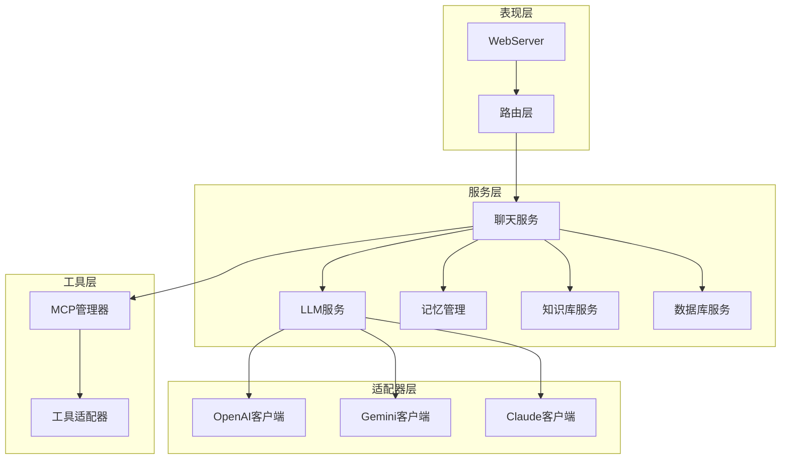
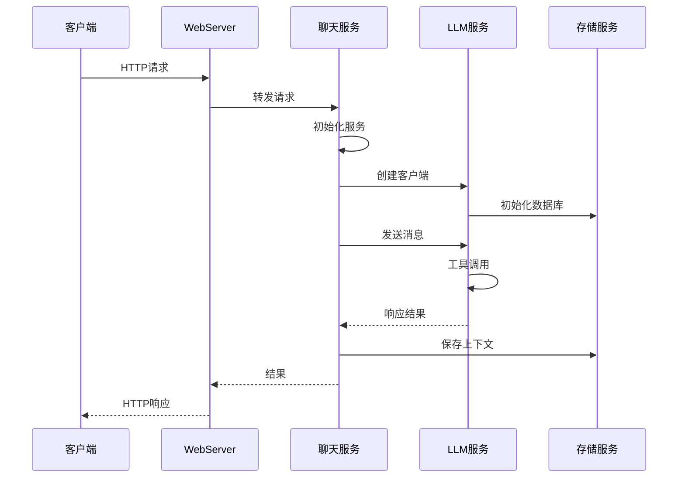
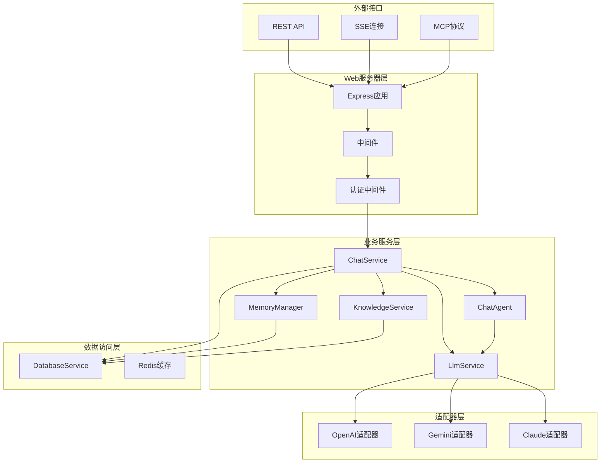
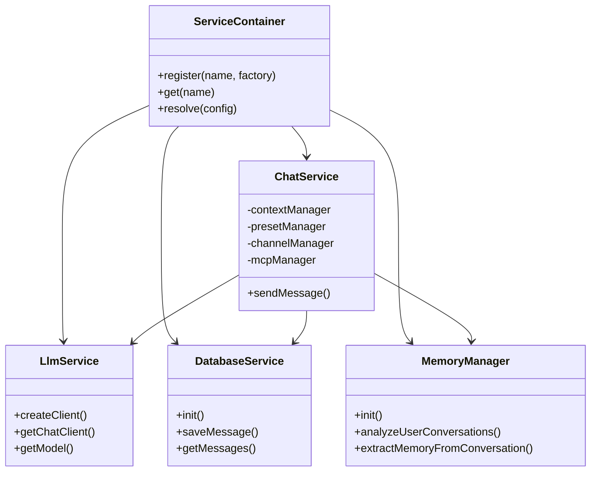
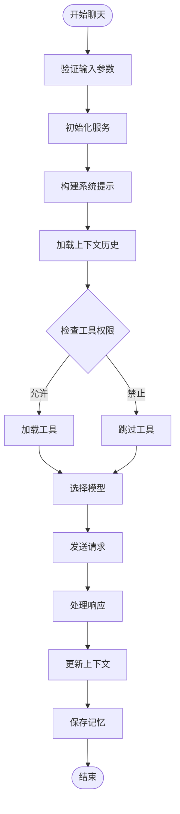
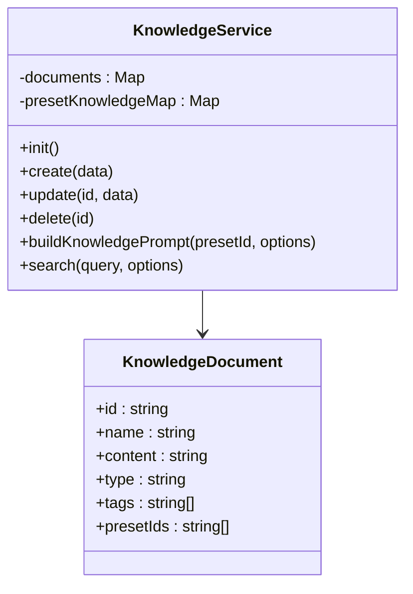
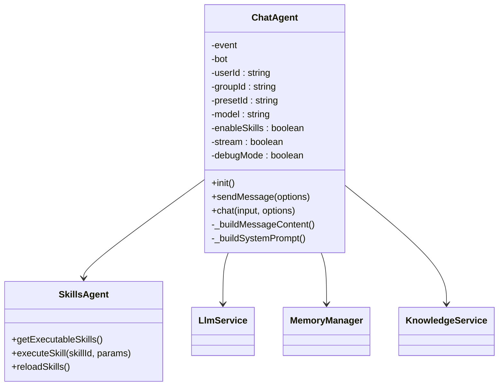
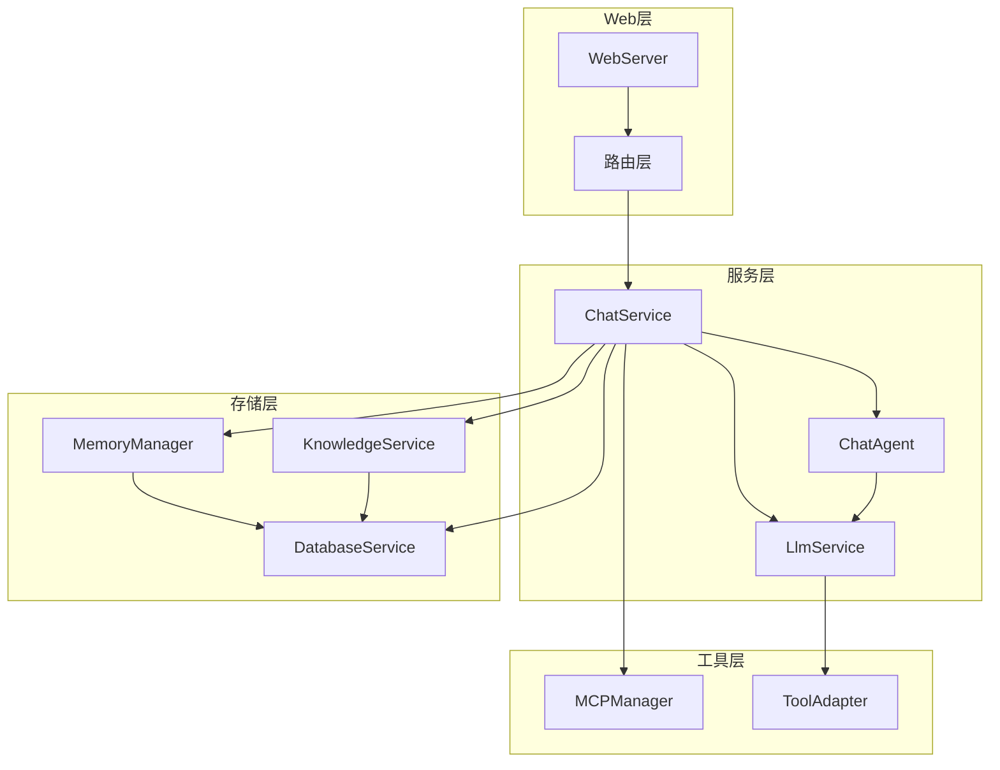

# 服务层架构

## 目录
1. [简介](#简介)
2. [项目结构](#项目结构)
3. [核心组件](#核心组件)
4. [架构概览](#架构概览)
5. [详细组件分析](#详细组件分析)
6. [依赖关系分析](#依赖关系分析)
7. [性能考虑](#性能考虑)
8. [故障排除指南](#故障排除指南)
9. [结论](#结论)

## 简介

ChatAI 插件的服务层架构采用模块化设计，通过清晰的职责分离和接口抽象实现了高度可扩展的聊天服务系统。该架构支持多模型适配器、工具调用、上下文管理和存储服务，为构建企业级AI聊天应用提供了完整的基础设施。

## 项目结构

服务层采用分层架构设计，主要分为以下几个层次：

**图表来源**
- [webServer.js](file://src/services/webServer.js#L279-L757)
- [ChatService.js](file://src/services/llm/ChatService.js#L46-L110)
- [LlmService.js](file://src/services/llm/LlmService.js#L11-L135)

**章节来源**
- [services/index.js](file://src/services/index.js#L1-L68)
- [webServer.js](file://src/services/webServer.js#L1-L807)

## 核心组件

### 服务层设计模式

服务层采用了以下核心设计模式：

1. **工厂模式**: LlmService 使用工厂方法创建不同类型的LLM客户端
2. **策略模式**: 支持多种模型适配器的动态切换
3. **观察者模式**: 通过事件驱动的方式处理聊天上下文
4. **装饰器模式**: 通过中间件增强服务功能

### 服务生命周期管理

服务层实现了完善的生命周期管理机制：

**图表来源**
- [ChatService.js](file://src/services/llm/ChatService.js#L68-L110)
- [LlmService.js](file://src/services/llm/LlmService.js#L21-L135)
- [DatabaseService.js](file://src/services/storage/DatabaseService.js#L19-L45)

**章节来源**
- [ChatService.js](file://src/services/llm/ChatService.js#L115-L552)
- [LlmService.js](file://src/services/llm/LlmService.js#L11-L299)

## 架构概览

### 服务层架构图

**图表来源**
- [webServer.js](file://src/services/webServer.js#L124-L144)
- [ChatService.js](file://src/services/llm/ChatService.js#L1-L100)
- [ChatAgent.js](file://src/services/agent/ChatAgent.js#L1-L100)

### 依赖注入机制

服务层采用基于配置的依赖注入机制：

**图表来源**
- [services/index.js](file://src/services/index.js#L1-L68)
- [ChatService.js](file://src/services/llm/ChatService.js#L1-L50)
- [LlmService.js](file://src/services/llm/LlmService.js#L1-L30)

**章节来源**
- [services/index.js](file://src/services/index.js#L1-L68)
- [webServer.js](file://src/services/webServer.js#L279-L757)

## 详细组件分析

### 聊天服务 (ChatService)

ChatService 是服务层的核心组件，负责处理所有聊天相关的业务逻辑：

#### 核心功能特性

1. **多模型支持**: 支持OpenAI、Gemini、Claude等多种LLM适配器
2. **上下文管理**: 智能的历史消息管理和上下文构建
3. **工具调用**: 集成MCP工具生态系统
4. **记忆管理**: 自动提取和管理用户记忆
5. **群组支持**: 完整的群聊上下文共享机制

#### 聊天流程处理

**图表来源**
- [ChatService.js](file://src/services/llm/ChatService.js#L115-L552)
- [ChatAgent.js](file://src/services/agent/ChatAgent.js#L138-L446)

**章节来源**
- [ChatService.js](file://src/services/llm/ChatService.js#L46-L1689)
- [ChatAgent.js](file://src/services/agent/ChatAgent.js#L42-L925)

### 存储服务 (Storage Services)

存储服务层提供了完整的数据持久化解决方案：

#### 数据库服务 (DatabaseService)

DatabaseService 使用SQLite作为主要存储引擎，提供以下核心功能：

1. **消息存储**: 完整的消息历史记录和检索
2. **记忆管理**: 用户记忆的持久化存储
3. **配置管理**: KV存储用于灵活的配置管理
4. **用户管理**: 用户设置和权限管理

#### 知识库服务 (KnowledgeService)

KnowledgeService 提供结构化的知识管理能力：

**图表来源**
- [KnowledgeService.js](file://src/services/storage/KnowledgeService.js#L31-L543)

**章节来源**
- [DatabaseService.js](file://src/services/storage/DatabaseService.js#L19-L809)
- [KnowledgeService.js](file://src/services/storage/KnowledgeService.js#L31-L931)

### 代理服务 (Agent Services)

代理服务层提供了更高层次的抽象，简化了复杂的AI交互：

#### 聊天代理 (ChatAgent)

ChatAgent 提供了面向对象的聊天接口：

**图表来源**
- [ChatAgent.js](file://src/services/agent/ChatAgent.js#L42-L925)
- [index.js](file://src/services/agent/index.js#L5-L36)

**章节来源**
- [ChatAgent.js](file://src/services/agent/ChatAgent.js#L42-L925)
- [index.js](file://src/services/agent/index.js#L1-L66)

### LLM服务 (LlmService)

LlmService 作为LLM适配器的统一入口，提供了以下核心功能：

1. **客户端工厂**: 动态创建不同提供商的LLM客户端
2. **模型管理**: 支持多模型配置和切换
3. **工具集成**: 统一的工具调用接口
4. **推理支持**: 高级推理功能的配置和管理

**章节来源**
- [LlmService.js](file://src/services/llm/LlmService.js#L11-L300)

## 依赖关系分析

### 服务间依赖关系

**图表来源**
- [services/index.js](file://src/services/index.js#L1-L68)
- [webServer.js](file://src/services/webServer.js#L124-L144)

### 外部依赖关系

服务层对外部系统的依赖主要包括：

1. **配置系统**: 通过配置文件管理所有运行时参数
2. **日志系统**: 统一的日志记录和监控
3. **缓存系统**: Redis缓存提升性能
4. **数据库系统**: SQLite作为主要数据存储

**章节来源**
- [services/index.js](file://src/services/index.js#L1-L68)
- [webServer.js](file://src/services/webServer.js#L1-L807)

## 性能考虑

### 缓存策略

服务层实现了多层次的缓存机制：

1. **内存缓存**: 频繁访问的数据缓存在内存中
2. **数据库缓存**: 使用SQLite的WAL模式提升并发性能
3. **工具缓存**: MCP工具的预加载和复用
4. **响应缓存**: 常见查询结果的缓存

### 性能优化技术

1. **异步处理**: 所有I/O操作都采用异步模式
2. **连接池**: LLM客户端连接的复用和管理
3. **批量操作**: 大量数据处理时的批量优化
4. **延迟加载**: 按需初始化昂贵的资源

## 故障排除指南

### 常见问题及解决方案

#### 1. LLM客户端连接问题

**症状**: 请求超时或连接失败
**解决方案**:
- 检查API密钥配置
- 验证网络连接
- 查看渠道配置的可用性

#### 2. 工具调用失败

**症状**: 工具执行异常或返回错误
**解决方案**:
- 检查工具权限配置
- 验证MCP服务器连接
- 查看工具调用日志

#### 3. 记忆提取异常

**症状**: 记忆管理功能失效
**解决方案**:
- 检查数据库连接
- 验证模型配置
- 查看记忆提取日志

**章节来源**
- [ChatService.js](file://src/services/llm/ChatService.js#L69-L110)
- [ChatAgent.js](file://src/services/agent/ChatAgent.js#L98-L109)

## 结论

ChatAI 插件的服务层架构通过清晰的分层设计、完善的依赖注入机制和灵活的接口抽象，为构建企业级AI聊天应用提供了强大的基础设施。该架构具有以下优势：

1. **高度模块化**: 每个服务都有明确的职责边界
2. **可扩展性强**: 支持新的LLM提供商和工具的无缝集成
3. **性能优异**: 多层次的缓存和优化技术
4. **易于维护**: 清晰的代码结构和完善的错误处理

通过遵循本文档的设计原则和最佳实践，开发者可以轻松地扩展和定制服务层功能，满足各种复杂的业务需求。
