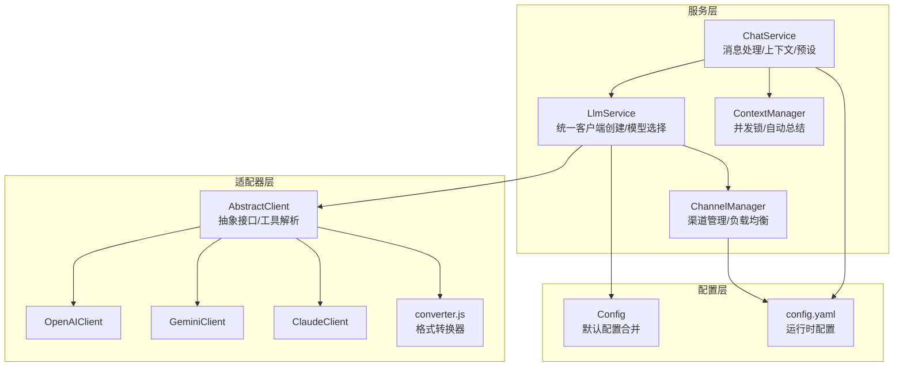
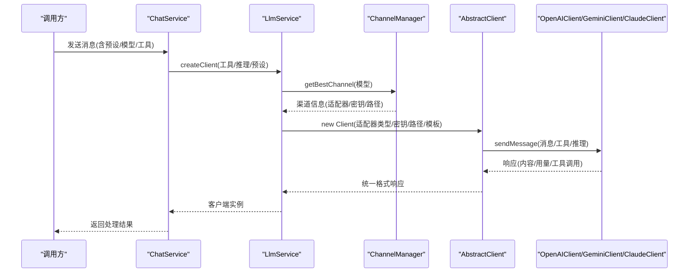
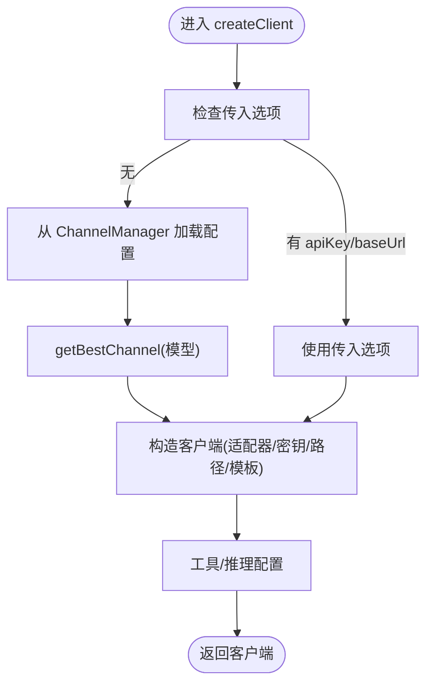
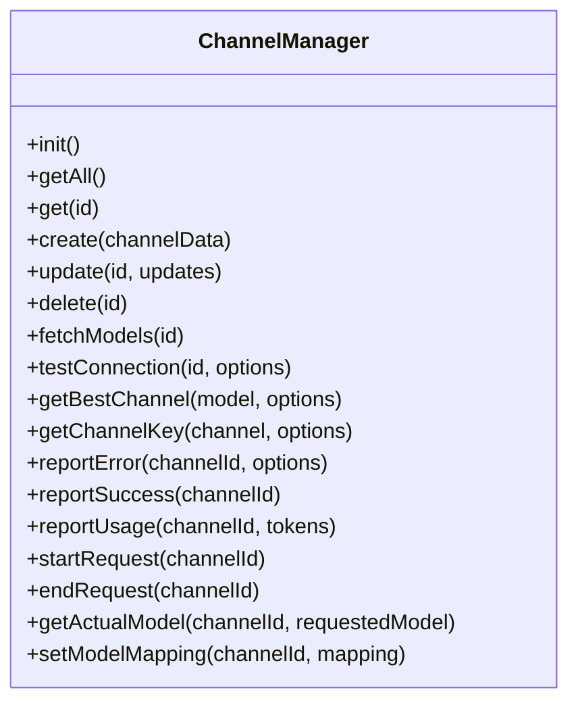
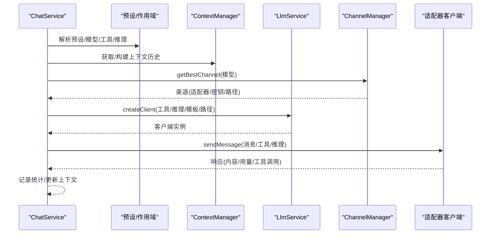
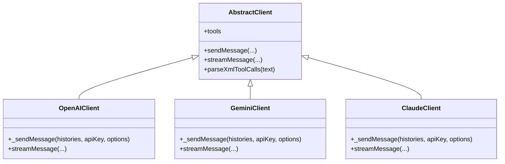
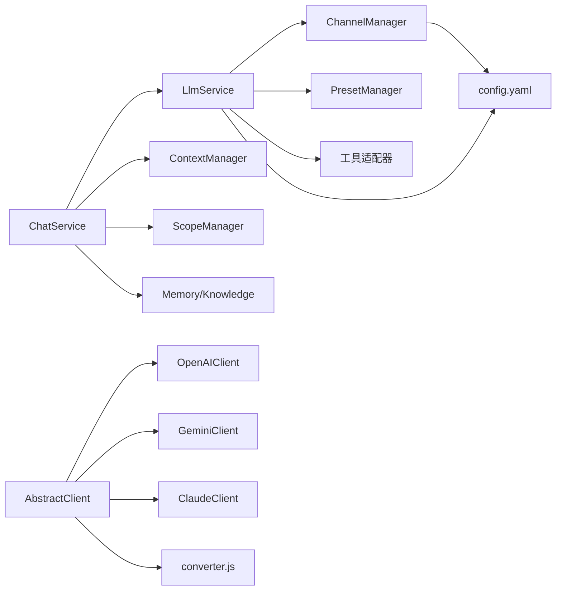

# LLM 服务

## 目录
1. [简介](#简介)
2. [项目结构](#项目结构)
3. [核心组件](#核心组件)
4. [架构总览](#架构总览)
5. [组件详解](#组件详解)
6. [依赖关系分析](#依赖关系分析)
7. [性能考量](#性能考量)
8. [故障排查指南](#故障排查指南)
9. [结论](#结论)
10. [附录](#附录)

## 简介
本文件面向 LLM 服务组件，系统阐述其架构设计、模型管理机制与扩展能力。重点包括：
- LlmService 如何统一管理多个 AI 模型适配器（OpenAI、Gemini、Claude），实现模型切换、工具调用与推理能力配置。
- ChannelManager 的通道管理、负载均衡、并发控制与资源分配策略。
- ChatService 的消息处理流程、上下文管理与工具调度。
- 适配器层抽象与类型转换器的设计，保证多厂商 API 的一致性。
- 配置体系与运行时参数传递，支撑灵活的部署与扩展。

## 项目结构
围绕 LLM 服务的核心目录与职责如下：
- 服务层
  - LLM 服务：统一客户端创建、模型选择、工具与推理配置
  - 通道管理：渠道生命周期、健康检查、负载均衡、配额与错误处理
  - 聊天服务：消息编排、上下文构建、预设与作用域配置
  - 上下文管理：并发锁、消息队列、自动总结与会话状态
- 适配器层
  - 抽象适配器：统一消息格式、工具调用解析与错误处理
  - OpenAI/Gemini/Claude 客户端：各厂商 API 的具体实现
  - 类型转换器：Chaite 通用格式与各厂商格式之间的双向转换
- 配置层
  - 配置管理器：默认配置与运行时 YAML 合并
  - 运行时配置：模型、渠道、负载均衡、上下文、工具等

图表来源
- [LlmService.js](file://src/services/llm/LlmService.js#L1-L300)
- [ChannelManager.js](file://src/services/llm/ChannelManager.js#L77-L1200)
- [ChatService.js](file://src/services/llm/ChatService.js#L46-L800)
- [ContextManager.js](file://src/services/llm/ContextManager.js#L8-L200)
- [AbstractClient.js](file://src/core/adapters/AbstractClient.js#L1-L800)
- [OpenAIClient.js](file://src/core/adapters/openai/OpenAIClient.js#L1-L200)
- [GeminiClient.js](file://src/core/adapters/gemini/GeminiClient.js#L1-L200)
- [ClaudeClient.js](file://src/core/adapters/claude/ClaudeClient.js#L1-L200)
- [converter.js](file://src/core/utils/converter.js#L1-L150)
- [config.js](file://config/config.js#L8-L60)
- [config.yaml](file://config/config.yaml#L16-L800)

章节来源
- [LlmService.js](file://src/services/llm/LlmService.js#L1-L300)
- [ChannelManager.js](file://src/services/llm/ChannelManager.js#L77-L1200)
- [ChatService.js](file://src/services/llm/ChatService.js#L46-L800)
- [ContextManager.js](file://src/services/llm/ContextManager.js#L8-L200)
- [AbstractClient.js](file://src/core/adapters/AbstractClient.js#L1-L800)
- [OpenAIClient.js](file://src/core/adapters/openai/OpenAIClient.js#L1-L200)
- [GeminiClient.js](file://src/core/adapters/gemini/GeminiClient.js#L1-L200)
- [ClaudeClient.js](file://src/core/adapters/claude/ClaudeClient.js#L1-L200)
- [converter.js](file://src/core/utils/converter.js#L1-L150)
- [config.js](file://config/config.js#L8-L60)
- [config.yaml](file://config/config.yaml#L16-L800)

## 核心组件
- LlmService
  - 统一创建客户端：根据模型、预设、工具与推理配置，选择适配器类型并构造客户端
  - 模型选择：优先使用传参或预设，回退至全局默认模型
  - 工具与推理：支持预选工具、预设工具、推理开关与努力等级
  - 嵌入向量客户端：按 embedding 模型渠道选择适配器
- ChannelManager
  - 渠道生命周期：加载、创建、更新、删除、持久化
  - 健康检查：OpenAI/Gemini/Claude 三类渠道的连通性测试
  - 负载均衡：优先级、轮询、随机、最少连接、权重等策略
  - 并发与配额：活动请求数跟踪、每日/每小时/每分钟配额控制
  - 错误与冷却：认证、配额、超时、网络等错误类型分级处理
  - 模型映射：请求模型到实际 API 模型的映射与通配符支持
- ChatService
  - 消息处理：构建系统提示、上下文、记忆与知识库上下文
  - 作用域与预设：群组/用户维度的预设与模型覆盖
  - 工具调度：根据配置与预设启用/禁用工具，支持前缀人格与全局提示词
  - 群聊共享上下文：群组共享对话历史，用户独立人设
- ContextManager
  - 并发控制：基于 Map 的异步锁，防止并发写入冲突
  - 自动总结：定时扫描长对话并进行摘要，减少上下文长度
  - 会话状态：窗口消息、摘要窗口、最后总结时间等

章节来源
- [LlmService.js](file://src/services/llm/LlmService.js#L11-L300)
- [ChannelManager.js](file://src/services/llm/ChannelManager.js#L77-L1200)
- [ChatService.js](file://src/services/llm/ChatService.js#L46-L800)
- [ContextManager.js](file://src/services/llm/ContextManager.js#L8-L200)

## 架构总览
LLM 服务采用“服务层 + 适配器层 + 配置层”的分层设计。服务层负责业务编排与策略决策，适配器层屏蔽厂商差异，配置层提供运行时参数与默认值。

图表来源
- [ChatService.js](file://src/services/llm/ChatService.js#L46-L800)
- [LlmService.js](file://src/services/llm/LlmService.js#L21-L135)
- [ChannelManager.js](file://src/services/llm/ChannelManager.js#L882-L962)
- [AbstractClient.js](file://src/core/adapters/AbstractClient.js#L1-L800)
- [OpenAIClient.js](file://src/core/adapters/openai/OpenAIClient.js#L145-L200)
- [GeminiClient.js](file://src/core/adapters/gemini/GeminiClient.js#L22-L164)
- [ClaudeClient.js](file://src/core/adapters/claude/ClaudeClient.js#L19-L133)

## 组件详解

### LlmService：统一客户端与模型管理
- 客户端创建
  - 优先使用传入的 apiKey/baseUrl/adapterType/chatPath/modelsPath
  - 否则从 ChannelManager 获取最佳渠道，并规范化 baseUrl
  - 根据适配器类型选择 OpenAI/Gemini/Claude 客户端
  - 支持自定义请求头与 JSON 模板注入
- 工具与推理
  - 预选工具：直接传入工具列表并转换为客户端格式
  - 预设工具：从预设管理器加载工具配置
  - 推理开关与努力等级：支持 enableReasoning 与 reasoningEffort
- 嵌入向量客户端
  - 优先选择包含 embedding 模型的渠道，否则回退到默认模型渠道
- 简易聊天客户端
  - 无工具模式，用于内部任务与简单对话

图表来源
- [LlmService.js](file://src/services/llm/LlmService.js#L21-L135)

章节来源
- [LlmService.js](file://src/services/llm/LlmService.js#L11-L300)

### ChannelManager：通道管理与负载均衡
- 渠道生命周期
  - loadChannels：从配置加载并规范化 baseUrl、自定义路径、认证与高级配置
  - create/update/delete：动态增删改渠道，持久化到配置
- 健康检查
  - OpenAI：发送测试消息，若 401 则尝试获取模型列表
  - Gemini/Claude：构造对应客户端进行测试
- 负载均衡策略
  - priority、round-robin、random、least-connection、权重
  - 过滤错误状态、配额限制、冷却时间
- 并发与配额
  - activeRequests：跟踪活动请求数
  - reportUsage：记录当日使用次数与 token 数
  - reportError/reportSuccess：错误类型分级与状态切换
- API Key 管理
  - 支持多密钥轮询：轮询、随机、权重、最少使用、故障转移
  - 错误计数与禁用阈值
- 模型映射
  - getActualModel：支持精确映射与通配符映射
  - set/add/removeModelMapping：动态维护映射表

图表来源
- [ChannelManager.js](file://src/services/llm/ChannelManager.js#L77-L1200)

章节来源
- [ChannelManager.js](file://src/services/llm/ChannelManager.js#L77-L1200)

### ChatService：消息处理与上下文编排
- 输入参数与预处理
  - userId、message、images、model、stream、preset/presetId、adapterType、event、mode、debugMode、prefixPersona、disableTools、skipHistory/skipPersona
  - 群组/用户维度的作用域配置与预设覆盖
- 群聊与私聊上下文
  - 群聊共享上下文 group:{groupId}，私聊用户独立上下文
  - 支持独立人设与全局提示词叠加/前置/覆盖模式
- 记忆与知识库
  - 用户记忆与群聊记忆拼接到 systemPrompt
  - 知识库上下文按预设与长度限制拼接
- 工具与推理
  - 根据预设与作用域配置启用/禁用工具
  - 支持前缀人格覆盖/合并模式
- 客户端创建与调用
  - 优先群独立渠道，否则使用全局渠道
  - 传递自定义路径、请求头、JSON 模板、推理配置
  - 调用 LlmService.createClient 并执行 sendMessage

图表来源
- [ChatService.js](file://src/services/llm/ChatService.js#L46-L800)
- [LlmService.js](file://src/services/llm/LlmService.js#L21-L135)
- [ChannelManager.js](file://src/services/llm/ChannelManager.js#L882-L962)

章节来源
- [ChatService.js](file://src/services/llm/ChatService.js#L46-L800)

### 适配器层：抽象与厂商实现
- AbstractClient
  - 工具调用解析：支持多种格式（XML、JSON、函数调用等），并进行参数规范化
  - 消息验证与清理：修复不完整的 tool_calls 与孤立 tool 消息
  - 异步存储与上下文：通过工具上下文与历史管理器交互
- OpenAIClient
  - 请求头与 JSON 模板：支持自定义 UA/XFF/Auth/UA 等头复写
  - 模型验证与消息清理：确保 OpenAI 格式消息合法
  - 工具枚举规范化：Gemini 要求 enum 为字符串
- GeminiClient
  - 系统指令与安全设置：分离 system 消息为 systemInstruction
  - 工具声明转换：FunctionDeclaration 列表
  - 文本中工具调用解析：parseXmlToolCalls
- ClaudeClient
  - 系统提示与消息格式转换
  - 工具声明转换与流式响应支持
  - 文本中工具调用解析

图表来源
- [AbstractClient.js](file://src/core/adapters/AbstractClient.js#L1-L800)
- [OpenAIClient.js](file://src/core/adapters/openai/OpenAIClient.js#L145-L200)
- [GeminiClient.js](file://src/core/adapters/gemini/GeminiClient.js#L22-L164)
- [ClaudeClient.js](file://src/core/adapters/claude/ClaudeClient.js#L19-L133)

章节来源
- [AbstractClient.js](file://src/core/adapters/AbstractClient.js#L1-L800)
- [OpenAIClient.js](file://src/core/adapters/openai/OpenAIClient.js#L1-L200)
- [GeminiClient.js](file://src/core/adapters/gemini/GeminiClient.js#L1-L200)
- [ClaudeClient.js](file://src/core/adapters/claude/ClaudeClient.js#L1-L200)

### 类型转换器与适配器导出
- converter.js
  - 注册与获取：registerIntoChaiteConverter / getIntoChaiteConverter
  - 注册与获取：registerFromChaiteConverter / getFromChaiteConverter
  - 注册与获取：registerFromChaiteToolConverter / getFromChaiteToolConverter
- 适配器导出
  - index.js 导出 AbstractClient 与各厂商客户端，以及转换器注册

章节来源
- [converter.js](file://src/core/utils/converter.js#L1-L150)
- [index.js（适配器导出）](file://src/core/adapters/index.js#L1-L24)

### 配置体系与运行时参数
- config.js
  - 默认配置与 YAML 合并策略
  - 配置文件路径与初始化流程
- config.yaml
  - llm.defaultModel/defaultChatPresetId/embeddingModel/dimensions
  - models 分类（chat/tool/dispatch/image/roleplay/search）
  - fallback 配置（启用/模型列表/重试次数/延迟/通知）
  - channels 渠道列表（适配器类型、baseUrl、apiKey、models、优先级、策略、自定义路径、认证、超时、重试、配额、权重、状态、错误计数等）
  - loadBalancing.strategy（负载均衡策略）
  - context/memory/knowledge 等上下文与记忆配置

章节来源
- [config.js](file://config/config.js#L8-L60)
- [config.yaml](file://config/config.yaml#L16-L800)

## 依赖关系分析
- 服务层耦合
  - LlmService 依赖 ChannelManager、PresetManager、MCP 管理器与工具适配器
  - ChatService 依赖 LlmService、ContextManager、ScopeManager、Memory/Knowledge 服务
- 适配器层解耦
  - AbstractClient 提供统一接口，OpenAI/Gemini/Claude 实现差异化细节
  - converter.js 提供三方格式转换，降低厂商耦合
- 配置驱动
  - ChannelManager 与 LlmService 通过 config.yaml 与 config.js 获取运行时参数
  - 负载均衡策略、模型映射、工具开关等均来自配置

图表来源
- [LlmService.js](file://src/services/llm/LlmService.js#L1-L300)
- [ChannelManager.js](file://src/services/llm/ChannelManager.js#L77-L1200)
- [ChatService.js](file://src/services/llm/ChatService.js#L46-L800)
- [AbstractClient.js](file://src/core/adapters/AbstractClient.js#L1-L800)
- [OpenAIClient.js](file://src/core/adapters/openai/OpenAIClient.js#L1-L200)
- [GeminiClient.js](file://src/core/adapters/gemini/GeminiClient.js#L1-L200)
- [ClaudeClient.js](file://src/core/adapters/claude/ClaudeClient.js#L1-L200)
- [converter.js](file://src/core/utils/converter.js#L1-L150)
- [config.yaml](file://config/config.yaml#L16-L800)

章节来源
- [LlmService.js](file://src/services/llm/LlmService.js#L1-L300)
- [ChannelManager.js](file://src/services/llm/ChannelManager.js#L77-L1200)
- [ChatService.js](file://src/services/llm/ChatService.js#L46-L800)
- [AbstractClient.js](file://src/core/adapters/AbstractClient.js#L1-L800)
- [OpenAIClient.js](file://src/core/adapters/openai/OpenAIClient.js#L1-L200)
- [GeminiClient.js](file://src/core/adapters/gemini/GeminiClient.js#L1-L200)
- [ClaudeClient.js](file://src/core/adapters/claude/ClaudeClient.js#L1-L200)
- [converter.js](file://src/core/utils/converter.js#L1-L150)
- [config.yaml](file://config/config.yaml#L16-L800)

## 性能考量
- 负载均衡与并发
  - least-connection 策略可降低热点渠道压力
  - activeRequests 计数与 start/endRequest 跟踪，避免过度并发
- 渠道冷却与配额
  - 错误冷却时间随错误次数递增，降低失败重试风暴
  - 日/小时/分钟配额控制，防止超额使用
- 工具与推理
  - 工具调用解析与参数规范化，减少无效调用
  - 推理开关与努力等级可按需开启，平衡性能与质量
- 上下文管理
  - ContextManager 的自动总结与会话状态，控制上下文长度，提升响应速度

## 故障排查指南
- 渠道不可用
  - 检查 ChannelManager 的状态与错误计数，确认冷却时间是否结束
  - 使用 testConnection 进行连通性测试，区分认证、配额、网络等问题
- 工具调用失败
  - 检查 ChatService 中工具启用状态与预设配置
  - 查看 AbstractClient 的工具解析日志，确认参数格式
- 模型映射问题
  - 使用 getActualModel 检查映射是否生效，必要时通过 setModelMapping 动态更新
- 并发冲突
  - 检查 ContextManager 的锁状态与请求计数，避免长时间持有锁

章节来源
- [ChannelManager.js](file://src/services/llm/ChannelManager.js#L882-L962)
- [ChannelManager.js](file://src/services/llm/ChannelManager.js#L1128-L1200)
- [AbstractClient.js](file://src/core/adapters/AbstractClient.js#L1-L800)
- [ContextManager.js](file://src/services/llm/ContextManager.js#L38-L110)

## 结论
本 LLM 服务通过清晰的服务层、适配器层与配置层划分，实现了多厂商模型的统一接入与灵活管理。ChannelManager 提供完善的渠道治理与负载均衡，LlmService 负责客户端创建与工具/推理配置，ChatService 则承担消息编排与上下文管理。配合类型转换器与配置体系，系统具备良好的扩展性与可维护性。

## 附录

### 初始化配置示例（路径参考）
- LlmService 初始化客户端
  - [LlmService.createClient](file://src/services/llm/LlmService.js#L21-L135)
- ChannelManager 初始化与渠道管理
  - [ChannelManager.init/loadChannels/create/update/delete](file://src/services/llm/ChannelManager.js#L87-L340)
- ChatService 消息处理流程
  - [ChatService.sendMessage/_sendMessageImpl](file://src/services/llm/ChatService.js#L68-L110)
- 适配器客户端调用
  - [OpenAIClient._sendMessage](file://src/core/adapters/openai/OpenAIClient.js#L162-L200)
  - [GeminiClient._sendMessage](file://src/core/adapters/gemini/GeminiClient.js#L39-L164)
  - [ClaudeClient._sendMessage](file://src/core/adapters/claude/ClaudeClient.js#L29-L133)
- 配置加载与合并
  - [Config.startSync/getDefaultConfig/mergeConfig](file://config/config.js#L18-L57)
  - [config.yaml 示例（llm/channels/loadBalancing）](file://config/config.yaml#L16-L800)

章节来源
- [LlmService.js](file://src/services/llm/LlmService.js#L21-L135)
- [ChannelManager.js](file://src/services/llm/ChannelManager.js#L87-L340)
- [ChatService.js](file://src/services/llm/ChatService.js#L68-L110)
- [OpenAIClient.js](file://src/core/adapters/openai/OpenAIClient.js#L162-L200)
- [GeminiClient.js](file://src/core/adapters/gemini/GeminiClient.js#L39-L164)
- [ClaudeClient.js](file://src/core/adapters/claude/ClaudeClient.js#L29-L133)
- [config.js](file://config/config.js#L18-L57)
- [config.yaml](file://config/config.yaml#L16-L800)
