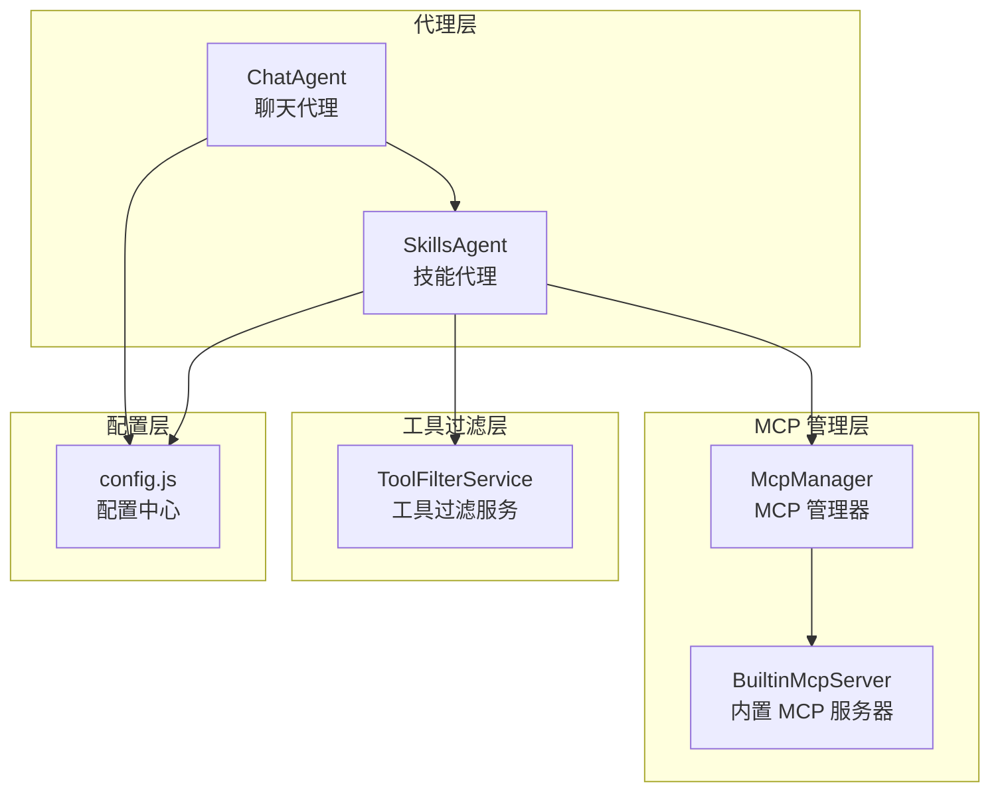
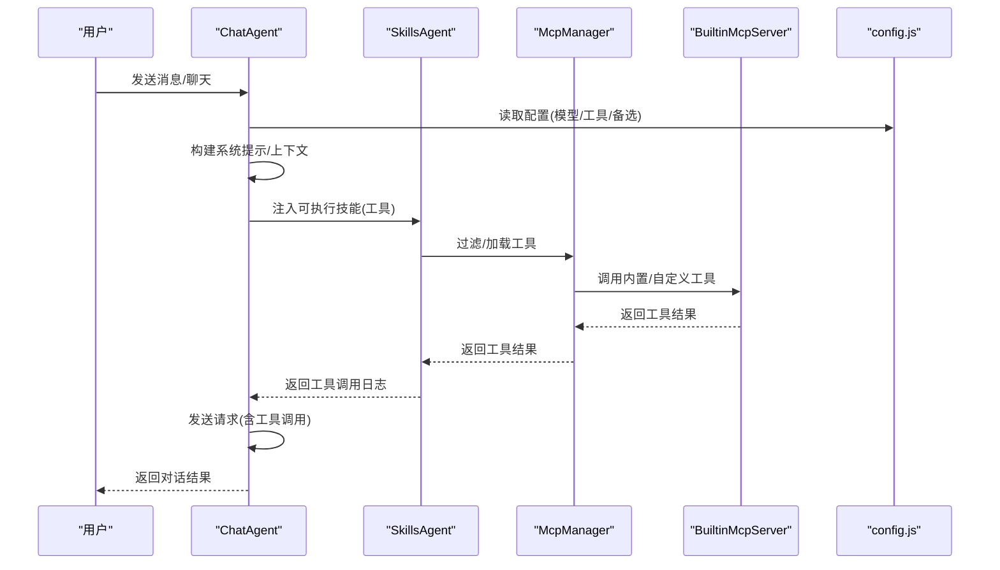
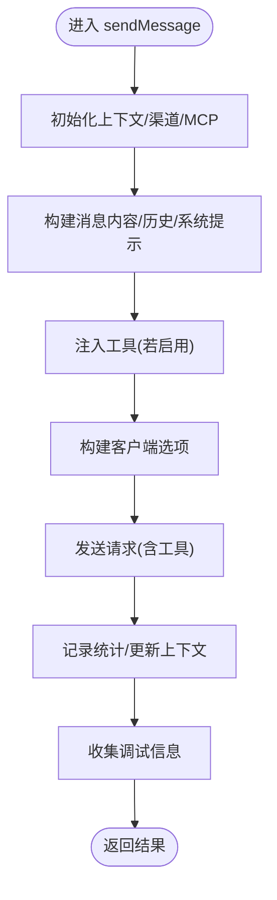
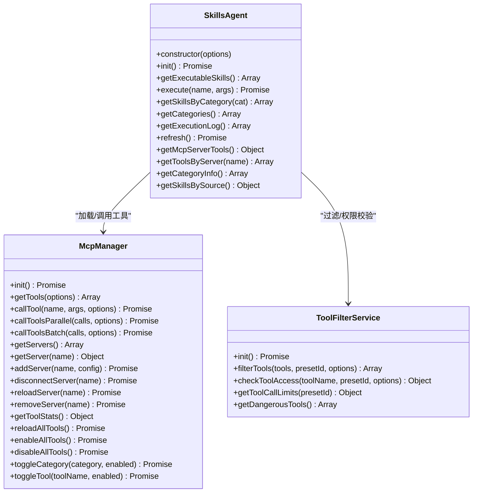
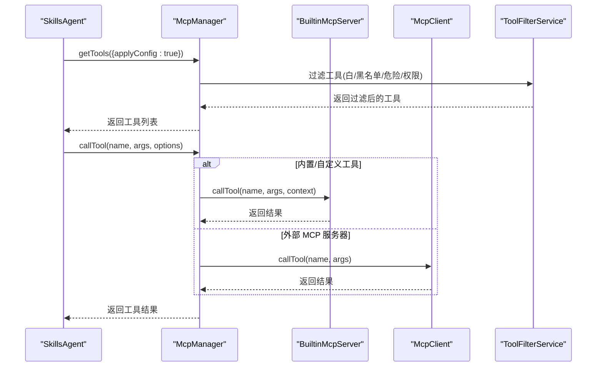
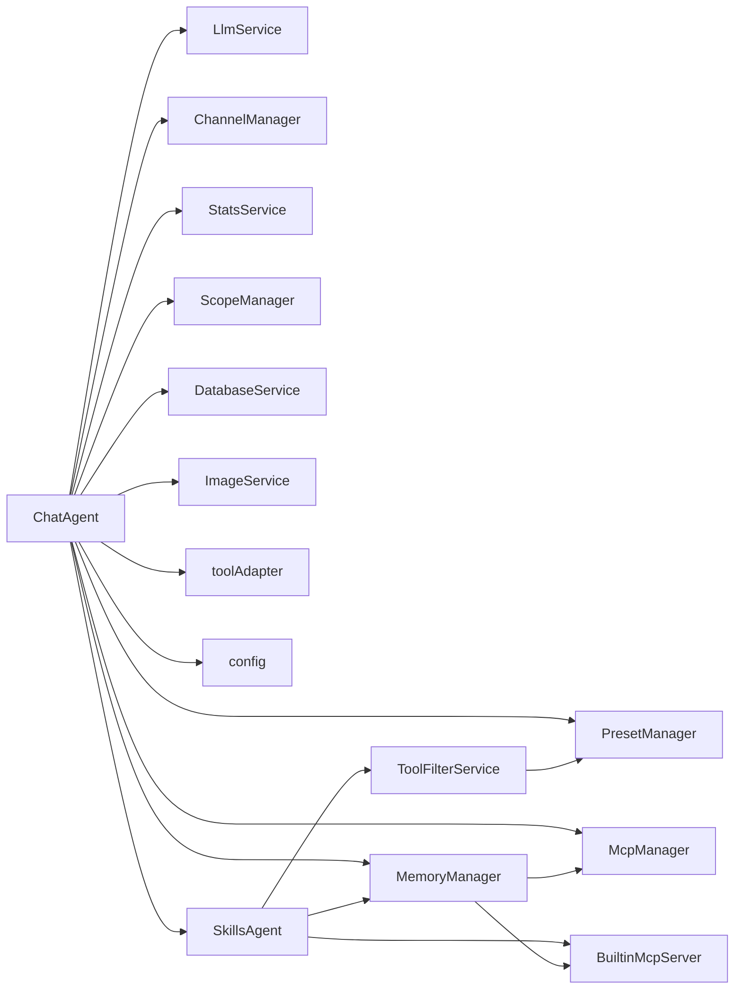

# 代理系统

<cite>
**本文引用的文件**
- [ChatAgent.js](file://src/services/agent/ChatAgent.js)
- [SkillsAgent.js](file://src/services/agent/SkillsAgent.js)
- [index.js](file://src/services/agent/index.js)
- [McpManager.js](file://src/mcp/McpManager.js)
- [BuiltinMcpServer.js](file://src/mcp/BuiltinMcpServer.js)
- [ToolFilterService.js](file://src/services/tools/ToolFilterService.js)
- [config.js](file://config/config.js)
- [AGENTS.md](file://AGENTS.md)
</cite>

## 目录
1. [简介](#简介)
2. [项目结构](#项目结构)
3. [核心组件](#核心组件)
4. [架构总览](#架构总览)
5. [组件详细分析](#组件详细分析)
6. [依赖关系分析](#依赖关系分析)
7. [性能考量](#性能考量)
8. [故障排查指南](#故障排查指南)
9. [结论](#结论)

## 简介
本文件面向代理系统组件，重点阐述 ChatAgent 与 SkillsAgent 的架构设计与职责分工，解释代理系统的双层架构：ChatAgent 负责聊天对话管理，SkillsAgent 负责工具调用与技能执行。文档涵盖代理系统的生命周期管理、状态维护、错误处理机制，并提供具体代码示例路径以展示代理的创建、配置与使用方法。同时，详细说明代理系统与 MCP 工具系统的集成方式与工具执行流程。

## 项目结构
代理系统位于服务层的 agent 子模块，围绕聊天与工具两大能力展开：
- ChatAgent：负责对话上下文构建、消息发送、模型选择、备选模型回退、统计记录、历史清理等。
- SkillsAgent：负责工具/技能的统一管理、过滤、执行、MCP 服务器管理、工具分类与统计等。
- MCP 管理：McpManager 统一管理内置、自定义与外部 MCP 工具，提供工具发现、调用、缓存、日志与统计。
- 工具过滤：ToolFilterService 基于预设与权限对工具进行白/黑名单、危险工具拦截与管理员权限校验。
- 配置中心：config.js 提供全局配置读取与合并，影响模型、工具、MCP、主动聊天等行为。

图表来源
- [ChatAgent.js](file://src/services/agent/ChatAgent.js#L42-L90)
- [SkillsAgent.js](file://src/services/agent/SkillsAgent.js#L21-L58)
- [McpManager.js](file://src/mcp/McpManager.js#L27-L139)
- [BuiltinMcpServer.js](file://src/mcp/BuiltinMcpServer.js#L218-L253)
- [ToolFilterService.js](file://src/services/tools/ToolFilterService.js#L28-L54)
- [config.js](file://config/config.js#L8-L38)

章节来源
- [AGENTS.md](file://AGENTS.md#L543-L584)

## 核心组件
- ChatAgent：负责对话生命周期、上下文构建、模型选择与回退、工具注入、统计记录与错误清理。
- SkillsAgent：负责工具聚合、过滤、执行、MCP 服务器管理、工具分类与统计、上下文设置。
- McpManager：统一管理工具与服务器，提供工具发现、调用、缓存、日志与统计。
- ToolFilterService：基于预设与权限进行工具白/黑名单、危险工具拦截与管理员权限校验。
- 配置中心：提供全局配置读取与合并，影响模型、工具、MCP、主动聊天等行为。

章节来源
- [ChatAgent.js](file://src/services/agent/ChatAgent.js#L42-L90)
- [SkillsAgent.js](file://src/services/agent/SkillsAgent.js#L21-L58)
- [McpManager.js](file://src/mcp/McpManager.js#L27-L139)
- [ToolFilterService.js](file://src/services/tools/ToolFilterService.js#L28-L54)
- [config.js](file://config/config.js#L8-L38)

## 架构总览
代理系统采用双层架构：
- ChatAgent 层：面向聊天对话，负责上下文管理、系统提示构建、模型选择、工具注入、备选模型回退、统计与清理。
- SkillsAgent 层：面向工具/技能，负责工具聚合、过滤、执行、MCP 服务器管理、工具分类与统计。
- MCP 管理层：统一管理内置、自定义与外部 MCP 工具，提供工具发现、调用、缓存、日志与统计。
- 工具过滤层：基于预设与权限进行工具白/黑名单、危险工具拦截与管理员权限校验。
- 配置中心：提供全局配置读取与合并，影响模型、工具、MCP、主动聊天等行为。

图表来源
- [ChatAgent.js](file://src/services/agent/ChatAgent.js#L138-L446)
- [SkillsAgent.js](file://src/services/agent/SkillsAgent.js#L60-L111)
- [McpManager.js](file://src/mcp/McpManager.js#L724-L867)
- [BuiltinMcpServer.js](file://src/mcp/BuiltinMcpServer.js#L623-L676)
- [config.js](file://config/config.js#L82-L114)

## 组件详细分析

### ChatAgent：聊天对话管理
职责与能力
- 生命周期管理：init() 初始化上下文、预设、渠道、MCP 管理器，确定会话 ID，按需初始化 SkillsAgent。
- 聊天入口：chat() 与 sendMessage() 提供简化与完整消息发送接口。
- 上下文构建：构建系统提示、记忆上下文、知识库上下文、群聊环境信息，过滤历史消息。
- 模型与工具：确定模型、构建客户端选项、注入工具、备选模型回退。
- 统计与清理：记录 API 调用统计、自动清理错误时的历史与上下文。
- 错误处理：捕获异常并按配置自动清理，抛出原始错误。

关键流程与算法
- 消息发送核心流程：构建消息内容、获取历史、构建系统提示、注入工具、创建客户端、发送请求、记录统计、更新上下文、收集调试信息。
- 备选模型回退：按配置尝试多个模型，逐次重试，记录成功与失败。
- 自动清理：当开启自动清理时，在错误发生后清理会话历史与上下文，并可通知用户。

图表来源
- [ChatAgent.js](file://src/services/agent/ChatAgent.js#L138-L446)
- [ChatAgent.js](file://src/services/agent/ChatAgent.js#L710-L783)
- [ChatAgent.js](file://src/services/agent/ChatAgent.js#L800-L840)

章节来源
- [ChatAgent.js](file://src/services/agent/ChatAgent.js#L42-L90)
- [ChatAgent.js](file://src/services/agent/ChatAgent.js#L98-L133)
- [ChatAgent.js](file://src/services/agent/ChatAgent.js#L138-L446)
- [ChatAgent.js](file://src/services/agent/ChatAgent.js#L710-L783)
- [ChatAgent.js](file://src/services/agent/ChatAgent.js#L800-L840)
- [ChatAgent.js](file://src/services/agent/ChatAgent.js#L845-L864)

### SkillsAgent：工具调用与技能执行
职责与能力
- 工具聚合：从 McpManager 加载工具，按配置过滤内置/自定义/外部 MCP 工具。
- 工具过滤：基于预设与权限进行白/黑名单、危险工具拦截与管理员权限校验。
- 工具执行：execute() 执行工具，自动填充参数，记录执行日志，支持缓存。
- MCP 服务器管理：连接/断开/重载/移除外部 MCP 服务器，获取工具分类与统计。
- 工具分类与统计：按类别分组工具，统计启用/禁用数量，支持一键启用/禁用。
- 上下文设置：设置工具执行上下文（事件、Bot、适配器信息）。

图表来源
- [SkillsAgent.js](file://src/services/agent/SkillsAgent.js#L21-L58)
- [SkillsAgent.js](file://src/services/agent/SkillsAgent.js#L60-L138)
- [SkillsAgent.js](file://src/services/agent/SkillsAgent.js#L326-L379)
- [McpManager.js](file://src/mcp/McpManager.js#L561-L600)
- [McpManager.js](file://src/mcp/McpManager.js#L724-L867)
- [ToolFilterService.js](file://src/services/tools/ToolFilterService.js#L89-L173)

章节来源
- [SkillsAgent.js](file://src/services/agent/SkillsAgent.js#L21-L58)
- [SkillsAgent.js](file://src/services/agent/SkillsAgent.js#L60-L138)
- [SkillsAgent.js](file://src/services/agent/SkillsAgent.js#L326-L379)
- [SkillsAgent.js](file://src/services/agent/SkillsAgent.js#L513-L571)
- [McpManager.js](file://src/mcp/McpManager.js#L561-L600)
- [McpManager.js](file://src/mcp/McpManager.js#L724-L867)
- [ToolFilterService.js](file://src/services/tools/ToolFilterService.js#L89-L173)

### MCP 工具系统集成与工具执行流程
- 工具发现与加载：McpManager 从内置、自定义与外部 MCP 服务器加载工具，支持热重载与文件监听。
- 工具过滤：ToolFilterService 基于预设与权限进行白/黑名单、危险工具拦截与管理员权限校验。
- 工具执行：SkillsAgent 调用 McpManager.callTool()，内置工具通过 BuiltinMcpServer 执行，外部 MCP 服务器通过 McpClient 调用。
- 并行与批处理：McpManager 支持并行执行多个工具调用与批处理执行，按依赖关系调度。
- 缓存与日志：McpManager 提供工具结果缓存与调用日志，支持统计记录与清理。

图表来源
- [SkillsAgent.js](file://src/services/agent/SkillsAgent.js#L60-L111)
- [McpManager.js](file://src/mcp/McpManager.js#L561-L600)
- [McpManager.js](file://src/mcp/McpManager.js#L724-L867)
- [BuiltinMcpServer.js](file://src/mcp/BuiltinMcpServer.js#L623-L676)
- [ToolFilterService.js](file://src/services/tools/ToolFilterService.js#L89-L173)

章节来源
- [McpManager.js](file://src/mcp/McpManager.js#L561-L600)
- [McpManager.js](file://src/mcp/McpManager.js#L724-L867)
- [ToolFilterService.js](file://src/services/tools/ToolFilterService.js#L89-L173)

### 生命周期管理、状态维护与错误处理
- 生命周期：ChatAgent 与 SkillsAgent 均提供 init() 初始化，确保上下文、预设、渠道、MCP 管理器、工具过滤服务等就绪。
- 状态维护：ChatAgent 维护 conversationId、initialized、skillsAgent 等状态；SkillsAgent 维护 skills、categories、mcpServerTools、executionLog 等状态。
- 错误处理：ChatAgent 在 sendMessage() 捕获异常并按配置自动清理历史与上下文；McpManager 在 callTool() 记录工具调用日志与统计，支持缓存与错误返回。

章节来源
- [ChatAgent.js](file://src/services/agent/ChatAgent.js#L62-L90)
- [ChatAgent.js](file://src/services/agent/ChatAgent.js#L98-L109)
- [ChatAgent.js](file://src/services/agent/ChatAgent.js#L845-L864)
- [SkillsAgent.js](file://src/services/agent/SkillsAgent.js#L44-L58)
- [SkillsAgent.js](file://src/services/agent/SkillsAgent.js#L472-L480)
- [McpManager.js](file://src/mcp/McpManager.js#L778-L867)

### 代理系统的创建、配置与使用示例（代码路径）
- 创建 ChatAgent 实例并聊天
  - 示例路径：[创建与聊天示例](file://src/services/agent/ChatAgent.js#L29-L41)
- 快速对话
  - 示例路径：[快速对话示例](file://src/services/agent/ChatAgent.js#L919-L922)
- 创建 SkillsAgent 实例并执行工具
  - 示例路径：[创建与执行工具示例](file://src/services/agent/SkillsAgent.js#L145-L149)
- 获取工具列表与服务器管理
  - 示例路径：[工具与服务器管理示例](file://src/services/agent/SkillsAgent.js#L513-L571)
- 全局 Skills 模块导出
  - 示例路径：[全局 Skills 导出](file://src/services/agent/index.js#L5-L36)

章节来源
- [ChatAgent.js](file://src/services/agent/ChatAgent.js#L29-L41)
- [ChatAgent.js](file://src/services/agent/ChatAgent.js#L919-L922)
- [SkillsAgent.js](file://src/services/agent/SkillsAgent.js#L145-L149)
- [SkillsAgent.js](file://src/services/agent/SkillsAgent.js#L513-L571)
- [index.js](file://src/services/agent/index.js#L5-L36)

## 依赖关系分析
- ChatAgent 依赖：LlmService、ChannelManager、ContextManager、PresetManager、MemoryManager、StatsService、ScopeManager、DatabaseService、McpManager、ImageService、toolAdapter、history、config、SkillsAgent。
- SkillsAgent 依赖：McpManager、ToolFilterService、BuiltinMcpServer。
- McpManager 依赖：McpClient、BuiltinMcpServer、config。
- ToolFilterService 依赖：config、PresetManager。

图表来源
- [ChatAgent.js](file://src/services/agent/ChatAgent.js#L1-L16)
- [SkillsAgent.js](file://src/services/agent/SkillsAgent.js#L1-L6)
- [McpManager.js](file://src/mcp/McpManager.js#L1-L8)
- [ToolFilterService.js](file://src/services/tools/ToolFilterService.js#L12-L13)

章节来源
- [ChatAgent.js](file://src/services/agent/ChatAgent.js#L1-L16)
- [SkillsAgent.js](file://src/services/agent/SkillsAgent.js#L1-L6)
- [McpManager.js](file://src/mcp/McpManager.js#L1-L8)
- [ToolFilterService.js](file://src/services/tools/ToolFilterService.js#L12-L13)

## 性能考量
- 工具缓存：McpManager 提供工具结果缓存，减少重复调用开销。
- 并行执行：McpManager 支持并行执行多个工具调用，提升吞吐。
- 备选模型回退：ChatAgent 在主模型失败时自动尝试备选模型，提高成功率。
- 日志与统计：记录工具调用与 API 调用统计，便于性能分析与优化。
- 配置驱动：通过 config.js 控制模型、工具、MCP 等行为，便于按场景调优。

## 故障排查指南
- 自动清理：当开启自动清理时，错误发生后会清理会话历史与上下文，并可通知用户。
- 工具调用失败：McpManager 记录工具调用日志与统计，支持查看失败原因与错误信息。
- 权限与拦截：ToolFilterService 对危险工具与管理员权限进行拦截，检查工具访问许可与参数校验。
- 配置问题：检查 config.js 中的模型、工具、MCP 等配置是否正确。

章节来源
- [ChatAgent.js](file://src/services/agent/ChatAgent.js#L845-L864)
- [McpManager.js](file://src/mcp/McpManager.js#L778-L867)
- [ToolFilterService.js](file://src/services/tools/ToolFilterService.js#L182-L214)
- [config.js](file://config/config.js#L82-L114)

## 结论
代理系统通过 ChatAgent 与 SkillsAgent 的双层架构实现了“对话管理”与“工具执行”的清晰分离：ChatAgent 负责对话生命周期与上下文管理，SkillsAgent 负责工具聚合、过滤与执行。MCP 管理层与工具过滤层进一步增强了系统的可扩展性与安全性。通过配置中心与统计日志，系统具备良好的可观测性与可调优性。建议在生产环境中合理配置工具白/黑名单、危险工具拦截与管理员权限，并结合缓存与并行执行策略以提升性能与稳定性。