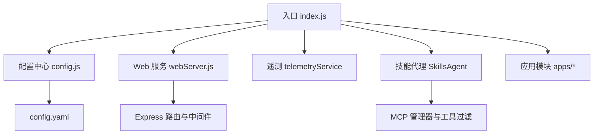
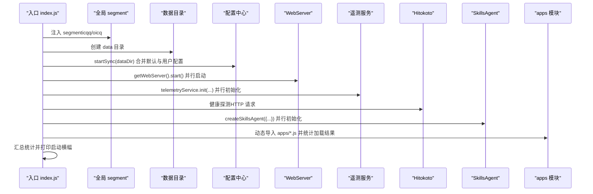
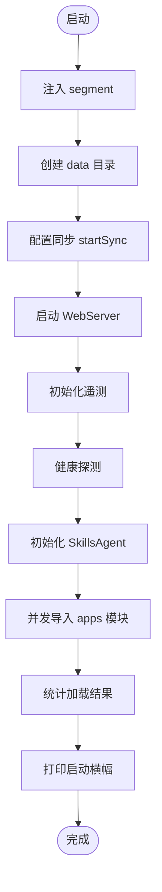
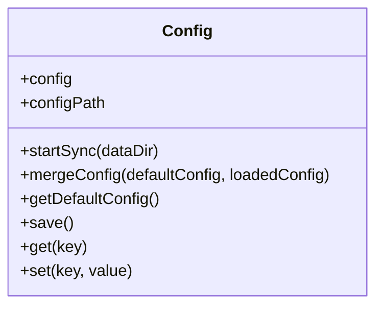
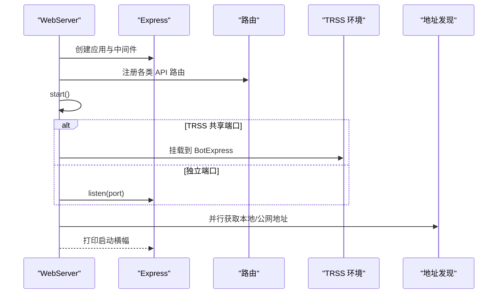
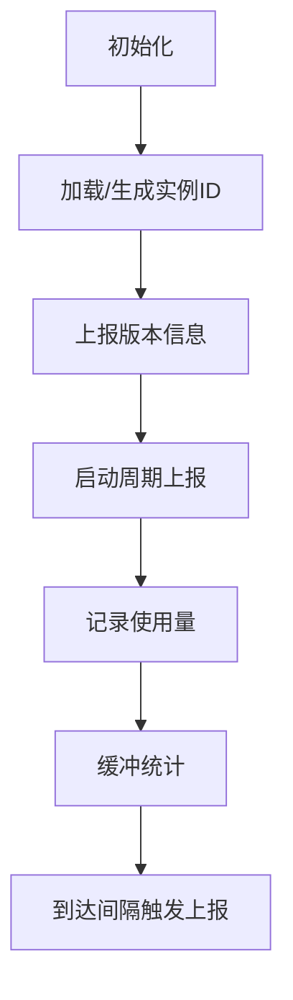
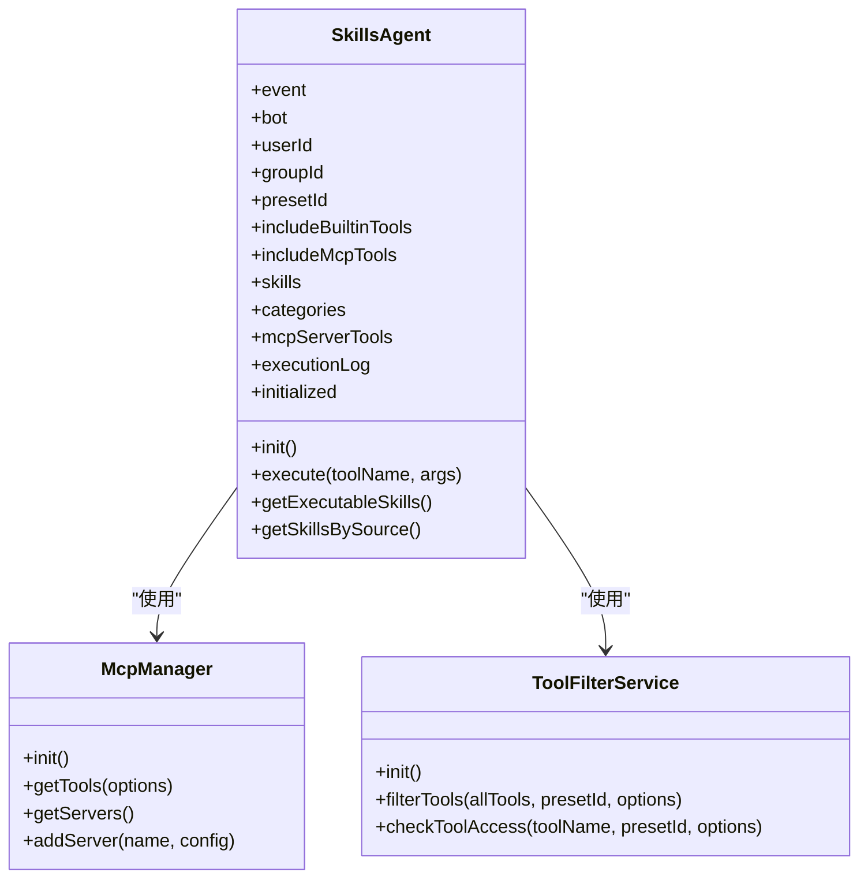
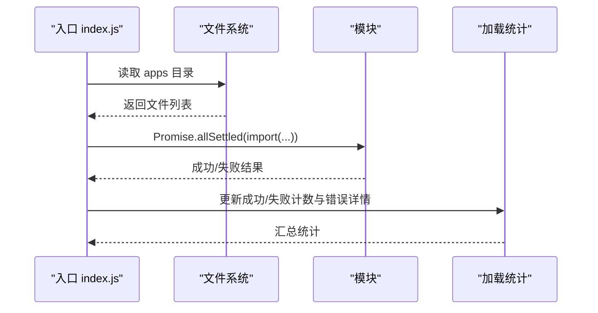
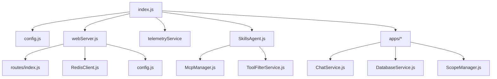

# 服务初始化

## 目录
1. [简介](#简介)
2. [项目结构](#项目结构)
3. [核心组件](#核心组件)
4. [架构总览](#架构总览)
5. [详细组件分析](#详细组件分析)
6. [依赖分析](#依赖分析)
7. [性能考虑](#性能考虑)
8. [故障排除指南](#故障排除指南)
9. [结论](#结论)
10. [附录](#附录)

## 简介
本文件聚焦于服务初始化组件，系统性阐述插件的启动流程、初始化机制与模块加载顺序。文档覆盖以下要点：
- 启动阶段的任务并行化与顺序约束
- 配置系统（默认值、合并策略、持久化）与校验
- Web 管理面板的启动与端口分配策略
- 遥测服务的初始化与错误降级
- 技能代理（SkillsAgent）的加载与工具聚合
- 应用模块（apps）的动态导入与加载统计
- 服务注册、配置验证与错误恢复策略
- 最佳实践与故障排除建议

## 项目结构
插件采用“入口文件驱动 + 配置中心 + 服务模块 + 应用模块”的分层结构：
- 入口文件负责初始化任务并行化、模块加载与统计输出
- 配置中心负责 YAML 配置的读取、合并与持久化
- 服务模块提供 WebServer、遥测、代理、存储等能力
- 应用模块（apps）封装业务规则与消息处理逻辑

图表来源
- [index.js](file://index.js#L17-L181)
- [config.js](file://config/config.js#L18-L38)
- [webServer.js](file://src/services/webServer.js#L279-L602)
- [SkillsAgent.js](file://src/services/agent/SkillsAgent.js#L21-L58)

章节来源
- [index.js](file://index.js#L17-L181)
- [config.js](file://config/config.js#L18-L38)
- [webServer.js](file://src/services/webServer.js#L279-L602)
- [SkillsAgent.js](file://src/services/agent/SkillsAgent.js#L21-L58)

## 核心组件
- 入口初始化任务（并行）：全局 segment 注入、数据目录准备、Web 服务启动、遥测初始化、Hitokoto 健康探测、技能代理初始化
- 配置系统：默认配置与用户配置合并、持久化保存、键值访问与设置
- Web 服务：Express 应用、中间件、认证与授权、TRSS 环境共享端口、健康检查与登录链接
- 遥测服务：实例 ID 生成与持久化、版本上报、使用量统计缓冲与周期上报
- 技能代理：MCP 管理器与工具过滤器初始化、工具聚合与分类、MCP 服务器连接管理
- 应用模块：apps 目录下模块的动态导入与加载统计

章节来源
- [index.js](file://index.js#L17-L181)
- [config.js](file://config/config.js#L43-L627)
- [webServer.js](file://src/services/webServer.js#L279-L757)
- [SkillsAgent.js](file://src/services/agent/SkillsAgent.js#L21-L58)
- [chat.js](file://apps/chat.js#L89-L200)
- [Management.js](file://apps/Management.js#L18-L135)

## 架构总览
服务初始化的总体流程如下：

图表来源
- [index.js](file://index.js#L17-L181)
- [config.js](file://config/config.js#L18-L38)
- [webServer.js](file://src/services/webServer.js#L582-L602)
- [SkillsAgent.js](file://src/services/agent/SkillsAgent.js#L44-L58)

章节来源
- [index.js](file://index.js#L17-L181)

## 详细组件分析

### 入口初始化与并行任务
- 全局 segment 注入：优先加载 icqq，失败回退 oicq
- 数据目录准备：若不存在则创建
- 配置同步：读取或创建默认配置并持久化
- Web 服务启动：获取单例 WebServer 并启动，支持 TRSS 共享端口与独立端口
- 遥测初始化：上报版本信息，获取全局启动次数与公告
- 健康探测：访问外部接口获取一言数据
- 技能代理初始化：创建 SkillsAgent 实例，聚合内置/自定义/MCP 工具，统计来源分布
- 应用模块加载：并发导入 apps 目录下的模块，统计成功/失败数量与错误信息
- 启动横幅：汇总模块数量、技能统计、Web 端口、耗时、公告与失败计数

图表来源
- [index.js](file://index.js#L17-L181)

章节来源
- [index.js](file://index.js#L17-L181)

### 配置系统（Config）
- 默认配置：提供完整的字段与默认值，涵盖基础、管理员、LLM、工具、MCP、Redis、图片、Web、更新、代理、上下文、记忆、预设、人格、负载均衡、思考、渲染、高级功能等
- 合并与持久化：首次运行时合并默认配置与用户配置，保存到 YAML；后续读取时进行深合并
- 键值访问：支持点语法访问与设置，自动保存
- 与 WebServer 的交互：Web 服务启动时读取端口、共享端口与挂载路径等配置

图表来源
- [config.js](file://config/config.js#L8-L627)

章节来源
- [config.js](file://config/config.js#L8-L627)
- [config.yaml](file://config/config.yaml#L1-L800)
- [webServer.js](file://src/services/webServer.js#L282-L585)

### Web 服务（WebServer）
- Express 应用与中间件：JSON/URL 编码、Cookie 解析、CORS、静态资源
- 认证与授权：JWT 签名密钥生成与持久化、Token 生成与校验、指纹绑定、请求签名验证
- 路由注册：系统、渠道、配置、作用域、工具、代理、MCP、知识库、图像、日志、内存、群管、技能、对话与上下文等 API
- 启动策略：TRSS 环境共享端口（挂载到 BotExpress）与独立端口（自动端口探测与释放）
- 地址发现：本地/公网 IPv4/IPv6 地址并行获取，打印启动横幅
- 周期任务：启动后异步初始化调度服务

图表来源
- [webServer.js](file://src/services/webServer.js#L279-L705)

章节来源
- [webServer.js](file://src/services/webServer.js#L279-L705)

### 遥测服务（TelemetryService）
- 实例 ID：首次运行生成 UUID 并持久化，后续复用
- 版本上报：携带插件名、版本、分支、提交、Node 版本、平台、架构等信息
- 使用量统计：缓冲模型使用、调用次数、Token、成功率、耗时，周期性上报
- 错误降级：网络异常或服务端错误时返回 warn 状态，不影响主流程

图表来源
- [TelemetryService.js](file://src/services/telemetry/TelemetryService.js#L42-L192)

章节来源
- [TelemetryService.js](file://src/services/telemetry/TelemetryService.js#L42-L192)

### 技能代理（SkillsAgent）
- 初始化流程：初始化 MCP 管理器与工具过滤器，设置内置工具上下文，加载工具并按类别聚合，统计 MCP 服务器数量
- 工具聚合：根据用户权限、群/用户 ID、预设 ID 过滤工具来源（内置、自定义、外部 MCP）
- MCP 管理：连接/断开/刷新 MCP 服务器，查询服务器状态与工具列表
- 工具执行：提供静态方法以创建代理实例并执行工具

图表来源
- [SkillsAgent.js](file://src/services/agent/SkillsAgent.js#L21-L58)
- [agent/index.js](file://src/services/agent/index.js#L5-L36)

章节来源
- [SkillsAgent.js](file://src/services/agent/SkillsAgent.js#L21-L58)
- [agent/index.js](file://src/services/agent/index.js#L5-L36)

### 应用模块（apps）
- 动态导入：并发导入 apps 目录下所有 .js 文件（除 update.js），统计成功/失败数量与错误信息
- 加载统计：记录模块数量、失败模块与错误详情，最终汇总到启动横幅
- 依赖初始化：部分应用模块在首次使用时惰性初始化内部依赖（例如 ScopeManager、QQBotSender）

图表来源
- [index.js](file://index.js#L117-L136)
- [chat.js](file://apps/chat.js#L35-L60)

章节来源
- [index.js](file://index.js#L117-L136)
- [chat.js](file://apps/chat.js#L35-L60)

## 依赖分析
- 入口对配置、Web、遥测、技能代理与应用模块存在直接依赖
- Web 服务对 Express、Cookie、JWT、Redis、配置与路由模块有依赖
- 技能代理对 MCP 管理器与工具过滤器有依赖
- 应用模块对配置、聊天服务、存储、媒体渲染、统计与范围管理等有依赖

图表来源
- [index.js](file://index.js#L1-L258)
- [webServer.js](file://src/services/webServer.js#L124-L144)
- [SkillsAgent.js](file://src/services/agent/SkillsAgent.js#L1-L6)
- [chat.js](file://apps/chat.js#L1-L24)

章节来源
- [index.js](file://index.js#L1-L258)
- [webServer.js](file://src/services/webServer.js#L124-L144)
- [SkillsAgent.js](file://src/services/agent/SkillsAgent.js#L1-L6)
- [chat.js](file://apps/chat.js#L1-L24)

## 性能考虑
- 并行初始化：入口阶段将多个初始化任务并行执行，显著缩短启动时间
- 端口探测与释放：独立端口模式下具备端口占用检测与自动释放机制，避免阻塞
- 地址发现：本地与公网地址并行获取，总超时控制在合理范围内
- 日志与统计：启动横幅集中展示关键指标，便于快速定位问题
- 遥测统计缓冲：使用内存缓冲减少频繁 IO，周期性上报降低网络压力

## 故障排除指南
- Web 服务端口占用
  - 现象：启动时报端口被占用
  - 处理：入口会尝试释放旧服务并自动递增端口；也可在配置中调整 web.port
  - 参考：[webServer.js](file://src/services/webServer.js#L637-L673)
- 遥测服务失败
  - 现象：遥测初始化返回 warn 状态
  - 处理：不影响主流程，检查网络连通性与服务端状态
  - 参考：[index.js](file://index.js#L48-L66)
- 技能代理初始化失败
  - 现象：技能模块加载失败，启动横幅显示失败计数
  - 处理：检查 MCP 服务器配置、工具过滤器与权限设置
  - 参考：[SkillsAgent.js](file://src/services/agent/SkillsAgent.js#L44-L58)
- 应用模块加载失败
  - 现象：apps 模块导入失败，启动横幅显示失败模块与错误
  - 处理：检查模块导出与依赖，确认文件命名与路径正确
  - 参考：[index.js](file://index.js#L117-L136)
- 配置文件损坏
  - 现象：配置读取异常或字段缺失
  - 处理：删除 config.yaml 后重启，系统将生成默认配置
  - 参考：[config.js](file://config/config.js#L28-L37)

章节来源
- [webServer.js](file://src/services/webServer.js#L637-L673)
- [index.js](file://index.js#L48-L66)
- [SkillsAgent.js](file://src/services/agent/SkillsAgent.js#L44-L58)
- [index.js](file://index.js#L117-L136)
- [config.js](file://config/config.js#L28-L37)

## 结论
本插件通过入口并行初始化、配置中心与服务模块解耦、应用模块动态加载等设计，实现了高效、可观测、可扩展的服务启动流程。配置系统提供完善的默认值与持久化策略，Web 服务支持 TRSS 共享端口与独立端口，遥测服务具备错误降级能力，技能代理统一管理工具来源，应用模块通过并发导入提升加载效率。结合启动横幅与日志系统，能够快速定位问题并进行故障恢复。

## 附录
- 版本信息：通过 Git 与 package.json 获取插件版本与分支信息，用于遥测上报与日志标识
- 依赖清单：项目使用大量第三方库，包括 LLM SDK、HTTP 客户端、缓存与数据库、Canvas 渲染、MCP 相关工具等
- 启动命令：在 Yunzai 根目录执行安装与启动命令，首次需执行原生模块构建

章节来源
- [version.js](file://src/utils/version.js#L106-L131)
- [package.json](file://package.json#L16-L46)
- [README.md](file://README.md#L44-L118)
