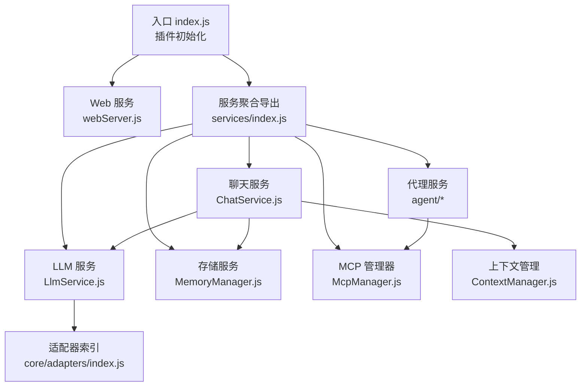
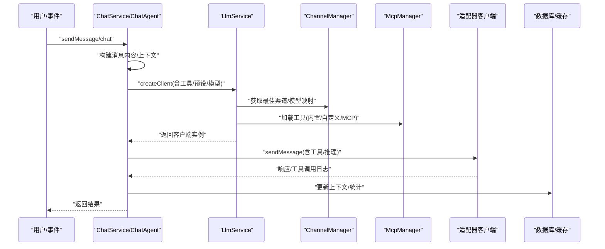
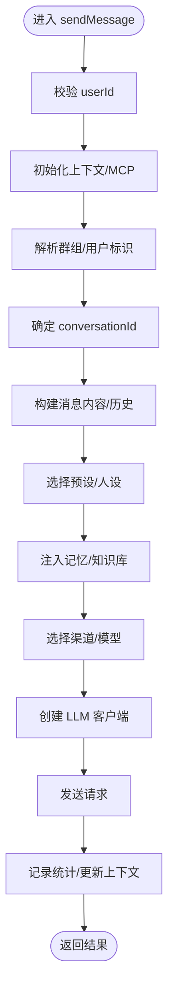
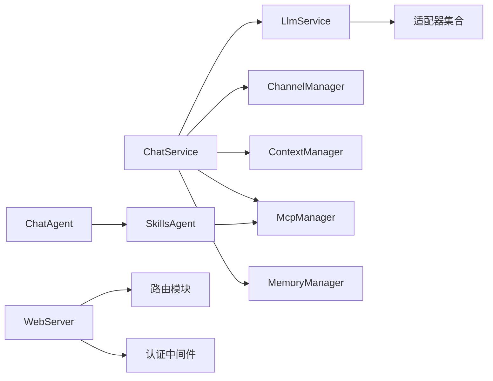

# 核心服务组件

## 目录
1. [简介](#简介)
2. [项目结构](#项目结构)
3. [核心组件](#核心组件)
4. [架构总览](#架构总览)
5. [详细组件分析](#详细组件分析)
6. [依赖关系分析](#依赖关系分析)
7. [性能考虑](#性能考虑)
8. [故障排除指南](#故障排除指南)
9. [结论](#结论)
10. [附录](#附录)

## 简介
本文件面向 ChatAI 插件的核心服务组件，围绕聊天服务(ChatService)、LLM 服务(LlmService)、代理服务(agents)三大核心模块进行深入解析。内容涵盖职责边界、接口定义、内部协作机制、初始化流程、生命周期管理、错误处理策略，并提供服务间调用关系与数据传递的可视化说明，帮助开发者快速理解与扩展。

## 项目结构
插件采用“服务层 + 核心适配器 + MCP 管理”的分层架构：
- 顶层入口负责插件初始化、并发任务与 Web 管理面板启动
- 服务层包含聊天、LLM、代理、存储、统计、MCP 等子模块
- 核心适配器抽象 OpenAI/Gemini/Claude 等模型厂商差异
- MCP 管理器统一管理内置/自定义/外部 MCP 工具

图表来源
- [index.js](file://index.js#L1-L258)
- [src/services/index.js](file://src/services/index.js#L1-L68)
- [src/services/webServer.js](file://src/services/webServer.js#L1-L807)
- [src/services/llm/ChatService.js](file://src/services/llm/ChatService.js#L1-L1689)
- [src/services/llm/LlmService.js](file://src/services/llm/LlmService.js#L1-L300)
- [src/services/llm/ContextManager.js](file://src/services/llm/ContextManager.js#L1-L1433)
- [src/services/agent/index.js](file://src/services/agent/index.js#L1-L66)
- [src/services/agent/ChatAgent.js](file://src/services/agent/ChatAgent.js#L1-L925)
- [src/services/agent/SkillsAgent.js](file://src/services/agent/SkillsAgent.js#L1-L601)
- [src/services/storage/MemoryManager.js](file://src/services/storage/MemoryManager.js#L1-L1538)
- [src/mcp/McpManager.js](file://src/mcp/McpManager.js#L1-L1268)
- [src/core/adapters/index.js](file://src/core/adapters/index.js#L1-L24)

章节来源
- [README.md](file://README.md#L356-L396)
- [index.js](file://index.js#L1-L258)

## 核心组件
- 聊天服务(ChatService)：统一处理消息输入、上下文构建、预设与人设注入、工具调用、渠道选择与回退、记忆与知识库上下文融合、统计记录与错误清理等
- LLM 服务(LlmService)：封装客户端创建、工具装载、模型选择、推理能力开关、嵌入客户端获取、简单聊天客户端等
- 代理服务(Agents)：包含 ChatAgent 与 SkillsAgent，前者负责对话流程与上下文管理，后者负责技能/工具的加载、过滤、执行与 MCP 服务器管理

章节来源
- [src/services/llm/ChatService.js](file://src/services/llm/ChatService.js#L32-L110)
- [src/services/llm/LlmService.js](file://src/services/llm/LlmService.js#L8-L135)
- [src/services/agent/ChatAgent.js](file://src/services/agent/ChatAgent.js#L29-L90)
- [src/services/agent/SkillsAgent.js](file://src/services/agent/SkillsAgent.js#L7-L58)

## 架构总览
整体交互流程：入口初始化 → Web 服务启动 → 代理/聊天服务初始化 → 用户消息进入 ChatService/ChatAgent → LlmService 创建适配器客户端 → 通道选择与工具装载 → 发起 LLM 请求 → 记录统计与上下文更新 → 返回结果。

图表来源
- [src/services/llm/ChatService.js](file://src/services/llm/ChatService.js#L115-L446)
- [src/services/llm/LlmService.js](file://src/services/llm/LlmService.js#L21-L135)
- [src/services/llm/ChannelManager.js](file://src/services/llm/ChannelManager.js#L87-L137)
- [src/mcp/McpManager.js](file://src/mcp/McpManager.js#L106-L139)

## 详细组件分析

### 聊天服务 ChatService
职责边界
- 输入标准化：支持文本与图片混合内容，图片来源可为 URL、Base64、ID 等
- 上下文管理：按群组共享上下文，按用户独立上下文；支持自动总结与历史清洗
- 预设与人设：支持全局/群组/用户独立人设，支持前缀人格覆盖/合并
- 工具调用：根据预设与作用域配置决定是否启用工具，支持 MCP 工具
- 渠道与模型：优先群独立渠道，其次全局渠道；支持模型映射与回退策略
- 记忆与知识库：可选注入用户/群记忆与知识库上下文
- 统计与错误处理：记录请求耗时、Token 使用、工具调用日志；错误时可自动清理历史

接口定义（简化）
- sendMessage(options): Promise<{response, usage, debugInfo?}>
- 内部实现 _sendMessageImpl(options): Promise<...>

关键流程（简化）
- 校验 userId，初始化上下文与 MCP
- 解析群组/用户标识，确定 conversationId
- 构建消息内容与历史上下文
- 选择预设与人设，注入记忆/知识库
- 选择渠道与模型，创建客户端
- 发送请求，记录统计，更新上下文

图表来源
- [src/services/llm/ChatService.js](file://src/services/llm/ChatService.js#L68-L446)

章节来源
- [src/services/llm/ChatService.js](file://src/services/llm/ChatService.js#L32-L110)
- [src/services/llm/ChatService.js](file://src/services/llm/ChatService.js#L115-L446)

### LLM 服务 LlmService
职责边界
- 客户端工厂：根据 adapterType 选择 OpenAI/Gemini/Claude 客户端
- 工具装载：支持预设工具配置、预选工具、事件上下文设置
- 模型选择：默认模型获取、模型映射、推理能力开关
- 嵌入客户端：按 embedding 模型选择可用渠道
- 简单聊天客户端：无工具模式，用于内部任务

接口定义（简化）
- createClient(options): Promise<Client>
- getEmbeddingClient(): Promise<Client>
- getChatClient(options): Promise<Client>
- getModel(): string
- getFullSystemPrompt(presetId): Promise<string>

章节来源
- [src/services/llm/LlmService.js](file://src/services/llm/LlmService.js#L11-L135)
- [src/services/llm/LlmService.js](file://src/services/llm/LlmService.js#L140-L226)
- [src/services/llm/LlmService.js](file://src/services/llm/LlmService.js#L233-L298)

### 代理服务 Agents
#### ChatAgent
职责边界
- 对外提供 chat()/sendMessage() 简化接口
- 内部完成上下文构建、预设/人设、工具装载、渠道选择、请求回退、统计记录、自动记忆提取
- 与 SkillsAgent 协作，按需启用工具

接口定义（简化）
- init(): Promise<this>
- chat(input, options?): Promise<...>
- sendMessage(options): Promise<...>

章节来源
- [src/services/agent/ChatAgent.js](file://src/services/agent/ChatAgent.js#L42-L90)
- [src/services/agent/ChatAgent.js](file://src/services/agent/ChatAgent.js#L98-L446)

#### SkillsAgent
职责边界
- 统一技能/工具管理：内置、自定义 JS、外部 MCP
- 工具过滤：基于预设、权限、群组/用户作用域
- MCP 服务器管理：连接/断开/刷新/统计
- 工具执行：execute(toolName, args)

接口定义（简化）
- init(): Promise<this>
- getExecutableSkills(): string[]
- execute(toolName, args): Promise<any>
- getMcpServers(): Object[]
- connectMcpServer(name, config): Promise<void>

章节来源
- [src/services/agent/SkillsAgent.js](file://src/services/agent/SkillsAgent.js#L21-L58)
- [src/services/agent/SkillsAgent.js](file://src/services/agent/SkillsAgent.js#L139-L200)

### 上下文管理 ContextManager
职责边界
- 会话锁与并发控制：acquireLock/releaseLock
- 自动总结：按配置周期扫描长对话并总结
- 群聊上下文缓存与会话状态管理

章节来源
- [src/services/llm/ContextManager.js](file://src/services/llm/ContextManager.js#L8-L130)
- [src/services/llm/ContextManager.js](file://src/services/llm/ContextManager.js#L132-L184)

### 存储服务 MemoryManager
职责边界
- 周期轮询分析对话历史并提取记忆
- 群聊上下文采集与分析（用户特征、话题、关系）
- 自动总结与持久化

章节来源
- [src/services/storage/MemoryManager.js](file://src/services/storage/MemoryManager.js#L12-L56)
- [src/services/storage/MemoryManager.js](file://src/services/storage/MemoryManager.js#L86-L107)
- [src/services/storage/MemoryManager.js](file://src/services/storage/MemoryManager.js#L163-L200)

### MCP 管理器 McpManager
职责边界
- 管理内置/自定义/外部 MCP 服务器
- 工具注册、过滤、缓存与日志
- 配置文件加载/保存与完全重初始化

章节来源
- [src/mcp/McpManager.js](file://src/mcp/McpManager.js#L27-L139)
- [src/mcp/McpManager.js](file://src/mcp/McpManager.js#L146-L192)

## 依赖关系分析
- ChatService 依赖 LlmService、ChannelManager、ContextManager、McpManager、PresetManager、MemoryManager、DatabaseService、StatsService
- LlmService 依赖 ChannelManager、McpManager、PresetManager、适配器集合
- ChatAgent 依赖 ChatService 与 SkillsAgent
- SkillsAgent 依赖 McpManager、ToolFilterService、BuiltinMcpServer
- WebServer 依赖路由模块、认证中间件、SchedulerService

图表来源
- [src/services/llm/ChatService.js](file://src/services/llm/ChatService.js#L1-L20)
- [src/services/llm/LlmService.js](file://src/services/llm/LlmService.js#L1-L7)
- [src/services/agent/ChatAgent.js](file://src/services/agent/ChatAgent.js#L1-L16)
- [src/services/agent/SkillsAgent.js](file://src/services/agent/SkillsAgent.js#L1-L6)
- [src/services/webServer.js](file://src/services/webServer.js#L124-L144)

章节来源
- [src/services/index.js](file://src/services/index.js#L1-L68)

## 性能考虑
- 并发控制：ContextManager 使用会话级锁避免并发写入冲突
- 自动总结：按配置周期性总结长对话，降低上下文长度
- 渠道与模型：ChannelManager 支持多 API Key 轮询与故障转移，提升稳定性
- 工具调用：SkillsAgent 按预设与权限过滤工具，减少不必要的工具加载
- 缓存与持久化：RedisClient 与数据库结合，平衡性能与可靠性

## 故障排除指南
- 渠道不可用：检查 ChannelManager 配置与健康检查状态
- 模型回退：启用 fallback 配置，观察备选模型切换日志
- 工具权限：通过 ToolFilterService 检查工具可用性与危险工具列表
- 记忆提取失败：MemoryManager 的轮询与分析异常会记录警告，检查配置与模型可用性
- Web 服务端口占用：WebServer 支持端口自动递增与共享端口模式

章节来源
- [src/services/llm/ContextManager.js](file://src/services/llm/ContextManager.js#L38-L101)
- [src/services/llm/ChannelManager.js](file://src/services/llm/ChannelManager.js#L87-L137)
- [src/services/storage/MemoryManager.js](file://src/services/storage/MemoryManager.js#L36-L56)
- [src/services/webServer.js](file://src/services/webServer.js#L637-L673)

## 结论
ChatAI 插件通过清晰的分层与职责划分，实现了从聊天到 LLM、从工具到记忆的完整闭环。ChatService 与 ChatAgent 提供统一的对外接口，LlmService 抽象底层适配器差异，McpManager 与 SkillsAgent 实现灵活的工具生态。配合上下文管理与存储服务，形成可扩展、可观测、可维护的核心服务体系。

## 附录
- 配置参考：channels/context/memory/knowledge/mcp 等配置项
- 适配器扩展：在 core/adapters 新增厂商适配器并注册
- MCP 扩展：通过 McpManager 管理外部 MCP 服务器，或在 data/tools 目录添加自定义 JS 工具

章节来源
- [config/config.js](file://config/config.js#L82-L131)
- [src/core/adapters/index.js](file://src/core/adapters/index.js#L1-L24)
- [README.md](file://README.md#L208-L296)
