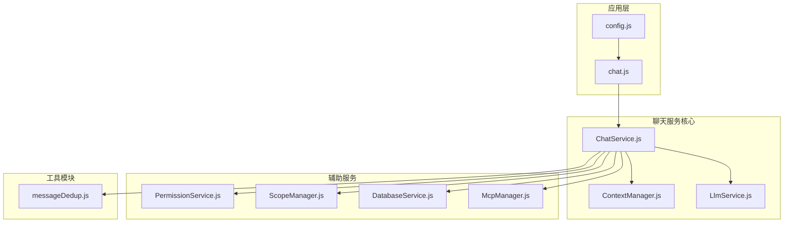
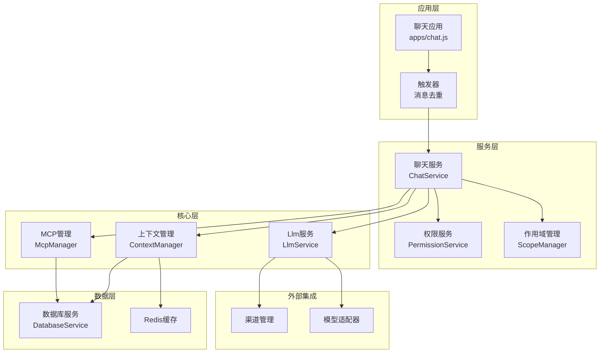
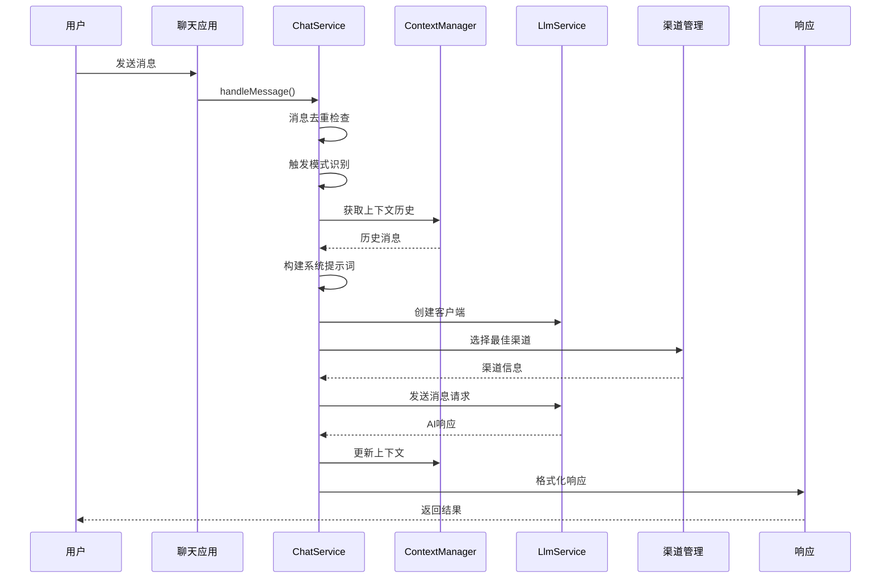
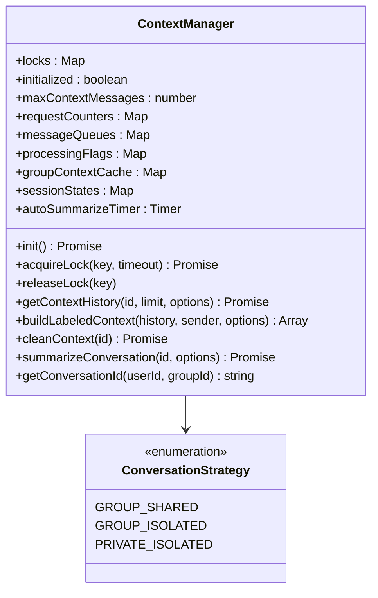
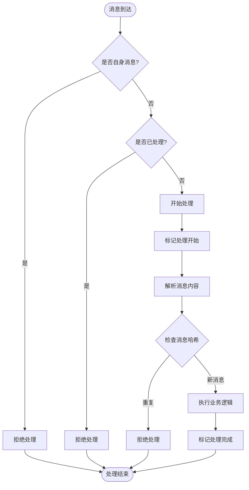
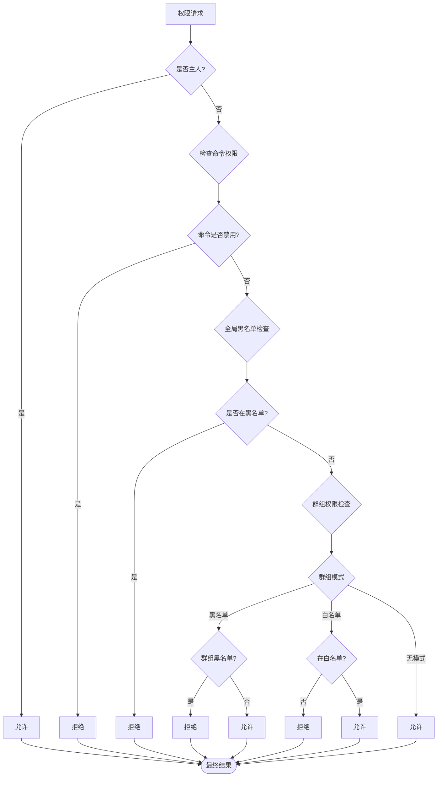
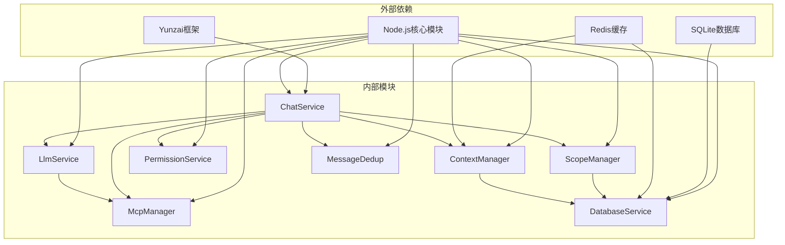
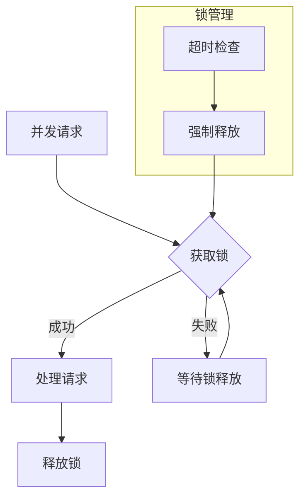

# 聊天服务


## 目录
1. [简介](#简介)
2. [项目结构](#项目结构)
3. [核心组件](#核心组件)
4. [架构概览](#架构概览)
5. [详细组件分析](#详细组件分析)
6. [依赖关系分析](#依赖关系分析)
7. [性能考虑](#性能考虑)
8. [故障排除指南](#故障排除指南)
9. [结论](#结论)

## 简介

聊天服务组件是基于 Yunzai 框架构建的智能对话系统，提供多模态的 AI 对话功能。该系统支持多种触发模式、上下文管理、工具调用集成以及完善的权限控制系统。

本组件采用模块化设计，通过 ChatService 作为统一入口，协调各个子系统完成消息的接收、处理和响应。系统具备强大的扩展性，支持群聊和私聊的不同上下文隔离策略，以及灵活的触发模式配置。

## 项目结构

聊天服务组件位于 `src/services/llm/` 目录下，主要包含以下核心文件：



**图表来源**
- [ChatService.js](file://src/services/llm/ChatService.js#L1-L1689)
- [ContextManager.js](file://src/services/llm/ContextManager.js#L1-L1433)
- [LlmService.js](file://src/services/llm/LlmService.js#L1-L300)

**章节来源**
- [ChatService.js](file://src/services/llm/ChatService.js#L1-L1689)
- [ContextManager.js](file://src/services/llm/ContextManager.js#L1-L1433)
- [LlmService.js](file://src/services/llm/LlmService.js#L1-L300)

## 核心组件

### ChatService - 统一聊天消息处理服务

ChatService 是整个聊天系统的核心控制器，负责协调所有组件完成完整的对话处理流程。

**主要功能特性：**
- 多模态消息处理（文本、图片、视频）
- 上下文管理与历史记录
- 工具调用集成
- 触发模式识别
- 权限控制与安全检查
- 错误处理与自动清理

**关键接口：**
```javascript
async sendMessage(options) {
    // 主要消息处理入口
}

async _sendMessageImpl(options) {
    // 内部实现逻辑
}
```

### ContextManager - 上下文管理器

负责管理对话上下文、历史记录和会话状态。

**核心能力：**
- 会话ID生成与管理
- 历史消息存储与检索
- 上下文隔离策略
- 自动总结与清理
- 并发控制与锁机制

### LlmService - 大语言模型服务

提供统一的 LLM 客户端创建和管理功能。

**主要职责：**
- 模型客户端工厂
- 渠道管理
- 配置解析
- 工具集成

**章节来源**
- [ChatService.js](file://src/services/llm/ChatService.js#L46-L110)
- [ContextManager.js](file://src/services/llm/ContextManager.js#L8-L30)
- [LlmService.js](file://src/services/llm/LlmService.js#L11-L300)

## 架构概览

聊天服务采用分层架构设计，通过清晰的职责分离实现高度模块化的系统结构。



**图表来源**
- [chat.js](file://apps/chat.js#L89-L203)
- [ChatService.js](file://src/services/llm/ChatService.js#L115-L1689)
- [ContextManager.js](file://src/services/llm/ContextManager.js#L24-L1433)

## 详细组件分析

### ChatService 消息处理流程

聊天服务的消息处理遵循严格的流程控制，确保消息的正确处理和响应。



**图表来源**
- [chat.js](file://apps/chat.js#L109-L203)
- [ChatService.js](file://src/services/llm/ChatService.js#L115-L800)

### 上下文管理器工作原理

ContextManager 实现了复杂的上下文管理机制，支持多种隔离策略和自动清理功能。



**图表来源**
- [ContextManager.js](file://src/services/llm/ContextManager.js#L8-L800)

### 消息去重机制

系统实现了多层次的消息去重保护，防止重复处理和循环响应。



**图表来源**
- [messageDedup.js](file://src/utils/messageDedup.js#L128-L212)

### 触发模式配置系统

系统支持多种触发模式，满足不同场景的需求。

| 触发模式 | 描述 | 配置项 | 使用场景 |
|---------|------|--------|----------|
| @机器人触发 | 必须@机器人 | `group.at: true` | 群聊精确触发 |
| 前缀触发 | 消息以特定前缀开头 | `prefixes: ['#chat']` | 私聊和群聊通用 |
| 关键词触发 | 包含特定关键词 | `keywords: []` | 主动参与讨论 |
| 随机触发 | 按概率随机触发 | `random: true` | 增加互动性 |

**章节来源**
- [chat.js](file://apps/chat.js#L298-L381)
- [config.js](file://config/config.js#L564-L584)

### 权限控制系统

权限系统采用多层检查机制，确保系统的安全性和可控性。



**图表来源**
- [PermissionService.js](file://src/services/permission/PermissionService.js#L337-L421)

**章节来源**
- [PermissionService.js](file://src/services/permission/PermissionService.js#L22-L484)

## 依赖关系分析

聊天服务组件之间的依赖关系体现了清晰的分层架构。



**图表来源**
- [ChatService.js](file://src/services/llm/ChatService.js#L1-L20)
- [ContextManager.js](file://src/services/llm/ContextManager.js#L1-L10)

**章节来源**
- [ChatService.js](file://src/services/llm/ChatService.js#L1-L30)
- [ContextManager.js](file://src/services/llm/ContextManager.js#L1-L20)

## 性能考虑

### 上下文管理优化

系统通过智能的上下文管理策略优化性能：

- **自动总结机制**：定期总结长时间未活跃的对话，减少历史消息存储
- **缓存策略**：使用 Redis 缓存热点数据，减少数据库查询
- **批量处理**：支持批量消息处理，提高吞吐量

### 并发控制



**图表来源**
- [ContextManager.js](file://src/services/llm/ContextManager.js#L38-L109)

### 内存管理

系统采用渐进式的内存管理策略：

- **消息队列限制**：最多保留100条排队消息
- **缓存过期机制**：群聊上下文缓存5分钟过期
- **自动清理**：定期清理过期的会话状态

## 故障排除指南

### 常见问题及解决方案

**问题1：消息重复处理**
- 检查消息去重配置
- 验证 `messageDedup.js` 的运行状态
- 查看日志中的去重标记

**问题2：上下文丢失**
- 检查 Redis 连接状态
- 验证 `contextManager` 的初始化
- 确认数据库连接正常

**问题3：工具调用失败**
- 检查 MCP 服务器配置
- 验证工具权限设置
- 查看工具调用日志

**问题4：权限拒绝**
- 检查用户权限配置
- 验证群组黑白名单设置
- 确认命令权限配置

### 调试模式

系统提供完整的调试支持：

```javascript
// 启用调试模式
const result = await chatService.sendMessage({
    userId: '123456',
    message: '测试消息',
    debugMode: true  // 启用调试
});
```

调试模式会输出详细的处理流程、配置信息和性能统计数据。

**章节来源**
- [ChatService.js](file://src/services/llm/ChatService.js#L68-L110)
- [chat.js](file://apps/chat.js#L464-L641)

## 结论

聊天服务组件通过精心设计的架构和完善的模块化实现，为 Yunzai 框架提供了强大而灵活的对话能力。系统的主要优势包括：

1. **模块化设计**：清晰的职责分离和接口定义
2. **可扩展性**：支持多种触发模式和工具集成
3. **安全性**：完善的权限控制和安全检查机制
4. **性能优化**：智能的缓存策略和并发控制
5. **易用性**：丰富的配置选项和调试支持

该组件为构建企业级智能对话系统奠定了坚实的基础，可以根据具体需求进行进一步的定制和扩展。
