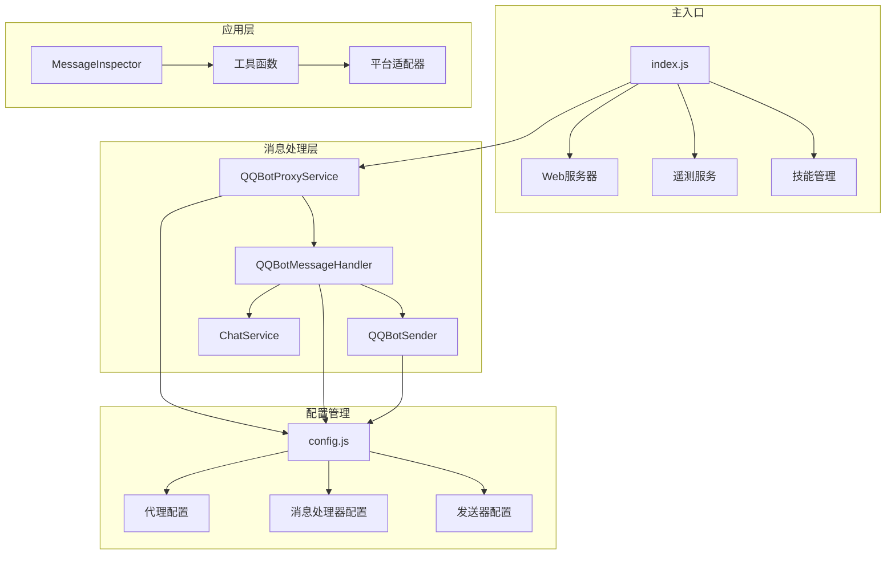
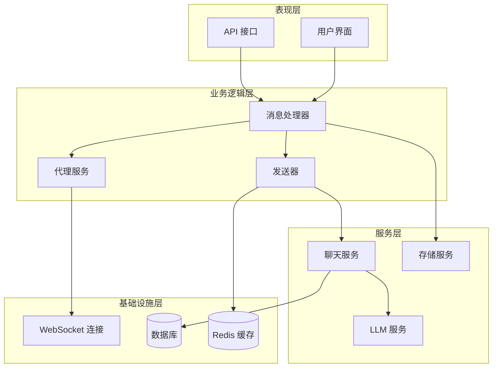
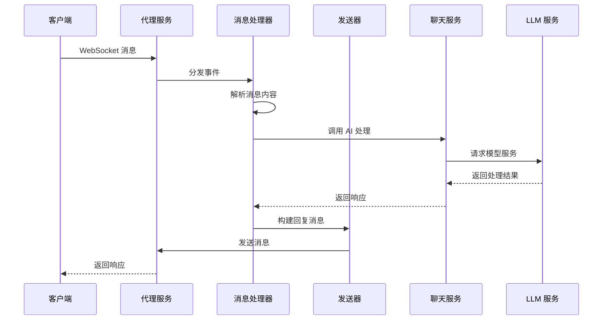
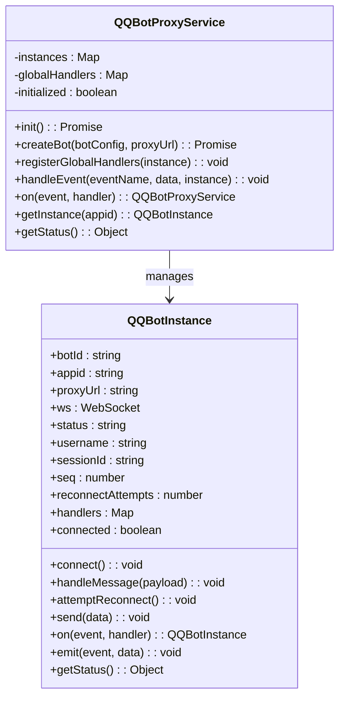
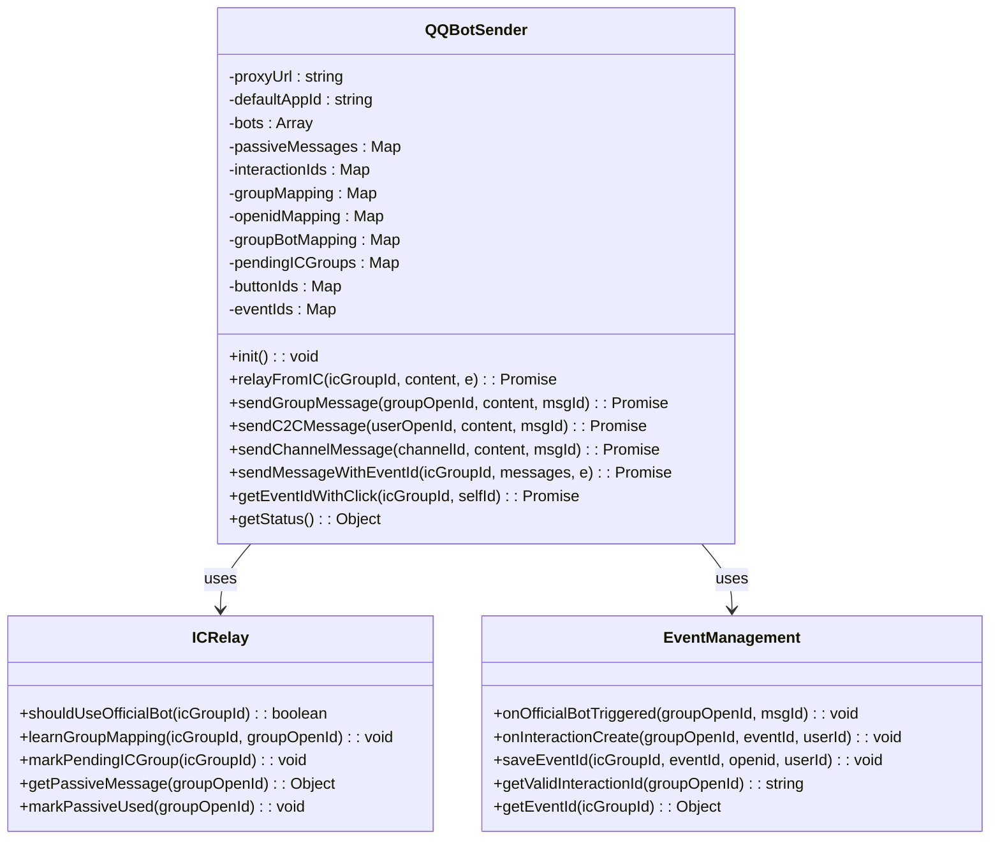
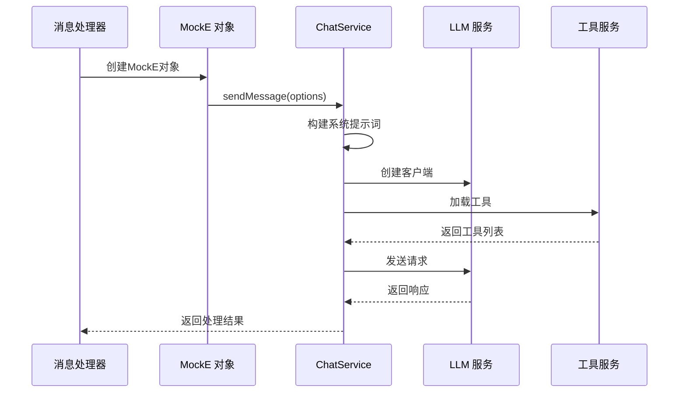
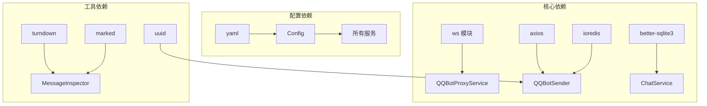
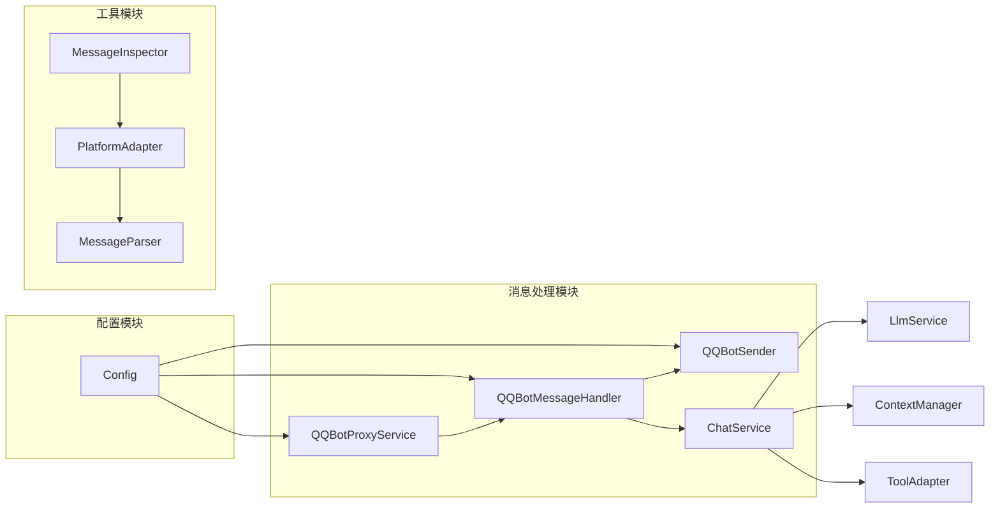

# 消息处理服务


## 目录
1. [简介](#简介)
2. [项目结构](#项目结构)
3. [核心组件](#核心组件)
4. [架构概览](#架构概览)
5. [详细组件分析](#详细组件分析)
6. [依赖关系分析](#依赖关系分析)
7. [性能考虑](#性能考虑)
8. [故障排除指南](#故障排除指南)
9. [结论](#结论)

## 简介

ChatAI 插件的消息处理服务是一个基于 Yunzai 框架的 QQ 机器人消息处理系统。该系统实现了完整的消息接收、解析、处理和响应流程，支持多种消息类型和群组管理功能。

系统的核心设计目标包括：
- 支持 QQ 官方 Bot 代理服务
- 实现消息类型识别和处理
- 提供群组管理和用户权限验证
- 支持 IC 代发模式和消息队列
- 实现并发处理和错误恢复机制

## 项目结构

该项目采用模块化的架构设计，主要分为以下几个核心模块：



**图表来源**
- [index.js](file://index.js#L1-L258)
- [config.js](file://config/config.js#L506-L554)

**章节来源**
- [index.js](file://index.js#L1-L258)
- [config.js](file://config/config.js#L1-L631)

## 核心组件

### QQBotProxyService 代理服务

QQBotProxyService 是整个消息处理系统的核心代理服务，负责管理多个 QQ Bot 实例的生命周期和通信。

**主要功能特性：**
- 多 Bot 实例管理
- WebSocket 连接池管理
- 自动重连机制
- 事件路由和分发
- Bot 状态监控

**关键实现要点：**
- 使用工厂模式创建和管理 Bot 实例
- 实现事件驱动的消息处理架构
- 提供统一的连接状态管理
- 支持动态配置更新

### QQBotMessageHandler 消息处理器

消息处理器负责解析和处理来自不同来源的消息，实现统一的消息处理逻辑。

**支持的消息类型：**
- 频道消息 (AT_MESSAGE_CREATE, MESSAGE_CREATE)
- 私信消息 (DIRECT_MESSAGE_CREATE)
- C2C 消息 (C2C_MESSAGE_CREATE)
- 群组消息 (GROUP_AT_MESSAGE_CREATE)
- 互动事件 (INTERACTION_CREATE)

**处理流程：**
1. 消息类型识别
2. 内容清洗和过滤
3. AI 模型调用
4. 响应消息构建
5. 消息发送

### QQBotSender 发送器

发送器专门负责消息的发送和回复，支持多种消息类型和发送模式。

**核心功能：**
- 多种消息类型发送
- IC 代发模式支持
- 消息队列管理
- 错误处理和重试机制
- 群组映射管理

**发送模式：**
- 直接发送模式
- 事件 ID 模式
- Markdown 模板模式
- 媒体文件发送模式

**章节来源**
- [QQBotProxyService.js](file://src/services/qqbot/QQBotProxyService.js#L181-L382)
- [QQBotMessageHandler.js](file://src/services/qqbot/QQBotMessageHandler.js#L22-L486)
- [QQBotSender.js](file://src/services/qqbot/QQBotSender.js#L13-L1489)

## 架构概览

系统采用分层架构设计，实现了清晰的关注点分离：



**图表来源**
- [QQBotProxyService.js](file://src/services/qqbot/QQBotProxyService.js#L181-L382)
- [QQBotMessageHandler.js](file://src/services/qqbot/QQBotMessageHandler.js#L22-L486)
- [QQBotSender.js](file://src/services/qqbot/QQBotSender.js#L13-L1489)

### 消息处理流程



**图表来源**
- [QQBotMessageHandler.js](file://src/services/qqbot/QQBotMessageHandler.js#L28-L54)
- [ChatService.js](file://src/services/llm/ChatService.js#L68-L110)

## 详细组件分析

### QQBotProxyService 详细分析

#### 类结构设计



**图表来源**
- [QQBotProxyService.js](file://src/services/qqbot/QQBotProxyService.js#L12-L179)
- [QQBotProxyService.js](file://src/services/qqbot/QQBotProxyService.js#L181-L382)

#### 连接管理机制

代理服务实现了完善的连接管理机制：

1. **自动重连策略**：支持可配置的最大重连次数和间隔时间
2. **状态监控**：实时跟踪每个 Bot 实例的连接状态
3. **事件路由**：将不同类型的事件分发到相应的处理器
4. **资源清理**：提供优雅的关闭和清理机制

**章节来源**
- [QQBotProxyService.js](file://src/services/qqbot/QQBotProxyService.js#L27-L117)
- [QQBotProxyService.js](file://src/services/qqbot/QQBotProxyService.js#L198-L267)

### QQBotMessageHandler 详细分析

#### 消息处理流程

```mermaid
flowchart TD
Start([消息到达]) --> TypeCheck{消息类型检查}
TypeCheck --> |AT_MESSAGE_CREATE| HandleGuild[处理频道@消息]
TypeCheck --> |MESSAGE_CREATE| HandleGuild2[处理频道普通消息]
TypeCheck --> |DIRECT_MESSAGE_CREATE| HandleDirect[处理私信消息]
TypeCheck --> |C2C_MESSAGE_CREATE| HandleC2C[处理C2C消息]
TypeCheck --> |GROUP_AT_MESSAGE_CREATE| HandleGroup[处理群组@消息]
TypeCheck --> |INTERACTION_CREATE| HandleInteraction[处理互动事件]
HandleGuild --> CleanContent[清洗消息内容]
HandleGuild2 --> CleanContent
HandleDirect --> CleanContent
HandleC2C --> CleanContent
HandleGroup --> CleanContent
CleanContent --> FilterBot{过滤Bot消息}
FilterBot --> |是| End([结束])
FilterBot --> |否| CheckAI{AI处理开关}
CheckAI --> |开启| ProcessAI[AI处理]
CheckAI --> |关闭| SendReply[直接回复]
ProcessAI --> BuildMockE[构建MockE对象]
BuildMockE --> CallChatService[调用ChatService]
CallChatService --> GetResponse[获取响应]
GetResponse --> SendReply
SendReply --> BuildAPI[构建API请求]
BuildAPI --> SendAPI[发送API请求]
SendAPI --> End
HandleInteraction --> StoreEvent[存储事件ID]
StoreEvent --> AckInteraction[确认互动]
AckInteraction --> End
```

**图表来源**
- [QQBotMessageHandler.js](file://src/services/qqbot/QQBotMessageHandler.js#L28-L54)
- [QQBotMessageHandler.js](file://src/services/qqbot/QQBotMessageHandler.js#L341-L373)

#### 消息类型处理

消息处理器针对不同消息类型实现了专门的处理逻辑：

**频道消息处理：**
- 支持 @ 机器人和普通消息
- 提取用户信息和上下文
- 清洗 @ 标记和多余内容

**群组消息处理：**
- 支持 IC 代发模式
- 管理被动消息 ID
- 处理按钮点击事件

**私信和 C2C 消息：**
- 简化的消息处理流程
- 直接的 AI 调用
- 适配不同平台的消息格式

**章节来源**
- [QQBotMessageHandler.js](file://src/services/qqbot/QQBotMessageHandler.js#L56-L184)
- [QQBotMessageHandler.js](file://src/services/qqbot/QQBotMessageHandler.js#L186-L208)

### QQBotSender 详细分析

#### 发送器架构设计



**图表来源**
- [QQBotSender.js](file://src/services/qqbot/QQBotSender.js#L13-L39)
- [QQBotSender.js](file://src/services/qqbot/QQBotSender.js#L365-L408)

#### IC 代发机制

IC 代发是系统的核心功能之一，实现了 IC Bot 和官方 Bot 之间的消息桥接：

**工作原理：**
1. **群组映射学习**：自动学习 IC 群号与官方群组的对应关系
2. **被动消息 ID 管理**：维护消息回复所需的 msg_id 和 msg_seq
3. **事件 ID 管理**：处理按钮点击等交互事件的 event_id
4. **多 Bot 支持**：支持多个官方 Bot 实例的负载均衡

**发送策略：**
- 优先使用事件 ID 模式
- 回退到被动消息 ID 模式
- 支持 Markdown 模板发送
- 自动处理 Token 过期和重试

**章节来源**
- [QQBotSender.js](file://src/services/qqbot/QQBotSender.js#L409-L544)
- [QQBotSender.js](file://src/services/qqbot/QQBotSender.js#L1080-L1161)

### ChatService 集成分析

消息处理服务与 ChatService 的集成实现了完整的 AI 对话能力：



**图表来源**
- [QQBotMessageHandler.js](file://src/services/qqbot/QQBotMessageHandler.js#L354-L373)
- [ChatService.js](file://src/services/llm/ChatService.js#L68-L110)

**章节来源**
- [ChatService.js](file://src/services/llm/ChatService.js#L46-L800)

## 依赖关系分析

### 外部依赖

系统依赖的主要外部组件包括：



**图表来源**
- [package.json](file://package.json#L16-L45)
- [QQBotProxyService.js](file://src/services/qqbot/QQBotProxyService.js#L1-L10)
- [QQBotSender.js](file://src/services/qqbot/QQBotSender.js#L1-L11)

### 内部模块依赖



**图表来源**
- [index.js](file://index.js#L1-L258)
- [config.js](file://config/config.js#L506-L554)

**章节来源**
- [package.json](file://package.json#L1-L53)
- [index.js](file://index.js#L1-L258)

## 性能考虑

### 并发处理机制

系统采用了多层次的并发处理机制来确保高性能：

1. **事件驱动架构**：基于事件循环的消息处理
2. **异步处理**：所有网络请求都采用异步模式
3. **连接池管理**：WebSocket 连接的高效复用
4. **内存缓存**：关键数据的本地缓存机制

### 性能优化策略

**消息队列管理：**
- 实现消息的有序处理
- 支持批量处理模式
- 提供背压保护机制

**缓存策略：**
- Bot 实例信息缓存
- Token 信息缓存
- 群组映射缓存
- 按钮 ID 缓存

**资源管理：**
- 连接池大小限制
- 内存使用监控
- 资源自动清理

### 错误处理和恢复

系统实现了完善的错误处理和自动恢复机制：

1. **自动重连**：网络断开后的自动重连
2. **降级处理**：部分功能失效时的降级策略
3. **错误日志**：详细的错误追踪和日志记录
4. **健康检查**：定期的系统健康状态检查

## 故障排除指南

### 常见问题诊断

**连接问题：**
- 检查代理服务器地址配置
- 验证 Bot 凭据的有效性
- 确认网络连接状态
- 查看 WebSocket 错误日志

**消息处理问题：**
- 验证消息类型识别
- 检查 AI 模型配置
- 确认权限设置
- 查看处理日志

**发送问题：**
- 检查 Token 获取
- 验证群组映射
- 确认 API 权限
- 查看发送日志

### 调试工具

系统提供了多种调试工具来帮助问题诊断：

**消息检查器：**
- 支持消息原始数据提取
- 提供消息解析详情
- 支持多种平台适配器检测

**状态监控：**
- 实时显示系统状态
- 监控连接池使用情况
- 跟踪消息处理统计

**章节来源**
- [MessageInspector.js](file://apps/MessageInspector.js#L87-L132)
- [QQBotProxyService.js](file://src/services/qqbot/QQBotProxyService.js#L334-L345)

## 结论

ChatAI 插件的消息处理服务是一个设计精良、功能完整的消息处理系统。其核心优势包括：

**架构优势：**
- 清晰的分层设计和职责分离
- 灵活的事件驱动架构
- 完善的错误处理和恢复机制

**功能特性：**
- 支持多种消息类型和平台
- 实现 IC 代发等高级功能
- 提供丰富的配置选项
- 具备良好的扩展性

**性能表现：**
- 高效的并发处理能力
- 优化的资源管理和缓存策略
- 完善的监控和诊断工具

该系统为 QQ 机器人应用提供了一个强大而灵活的消息处理基础，能够满足各种复杂的消息处理需求，并为未来的功能扩展奠定了坚实的基础。
