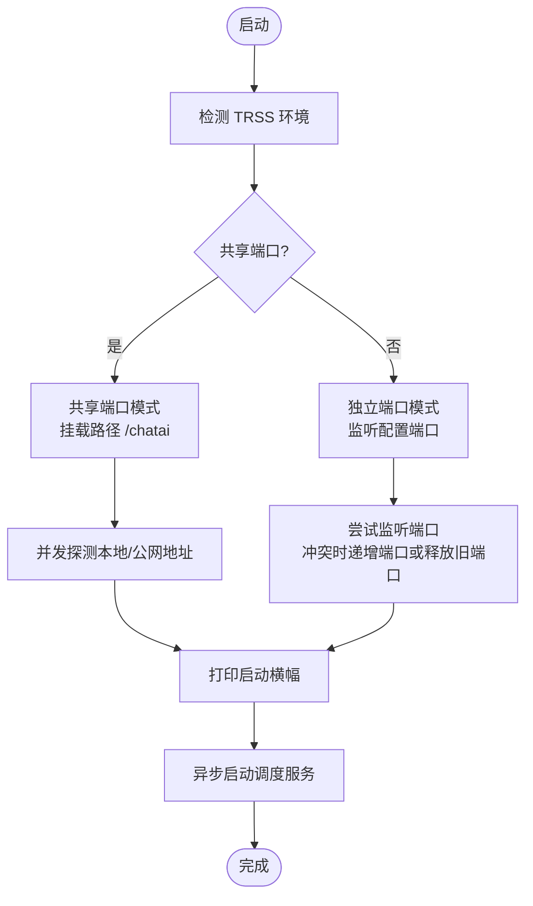

# Web 服务器

<cite>
**本文引用的文件**
- [index.js](file://index.js)
- [webServer.js](file://src/services/webServer.js)
- [config.js](file://config/config.js)
- [index.js（路由索引）](file://src/services/routes/index.js)
- [auth.js（中间件）](file://src/services/middleware/auth.js)
- [ApiResponse.js（统一响应）](file://src/services/middleware/ApiResponse.js)
- [skillsRoutes.js](file://src/services/routes/skillsRoutes.js)
- [systemRoutes.js](file://src/services/routes/systemRoutes.js)
- [api.ts（前端 API 客户端）](file://frontend/lib/api.ts)
- [useSSE.ts（前端 SSE 钩子）](file://frontend/lib/hooks/useSSE.ts)
- [SkillsAgent.js](file://src/services/agent/SkillsAgent.js)
</cite>

## 目录
1. [简介](#简介)
2. [项目结构](#项目结构)
3. [核心组件](#核心组件)
4. [架构总览](#架构总览)
5. [详细组件分析](#详细组件分析)
6. [依赖分析](#依赖分析)
7. [性能考虑](#性能考虑)
8. [故障排除指南](#故障排除指南)
9. [结论](#结论)
10. [附录](#附录)

## 简介
本文件面向 ChatAI 插件的 Web 服务器，系统性阐述基于 Express 的管理面板服务的启动流程、配置选项、中间件与路由体系、安全与 CORS、静态资源与健康检查、部署与性能优化、扩展与自定义中间件、以及与前端管理面板的连接与实时通信机制。目标读者既包括一线运维与平台工程师，也包括希望扩展与二次开发的开发者。

## 项目结构
Web 服务器位于插件根目录下的服务层，采用“控制器-中间件-路由-服务”的分层设计，并通过统一的配置中心进行集中管理。前端管理面板由 Next.js 构建，静态资源托管于后端 Express 的静态目录，前后端通过 Axios 客户端与 SSE 实现实时通信。

图表来源
- [index.js](file://index.js#L1-L258)
- [webServer.js](file://src/services/webServer.js#L1-L807)
- [index.js（路由索引）](file://src/services/routes/index.js#L1-L52)
- [auth.js（中间件）](file://src/services/middleware/auth.js#L1-L533)
- [ApiResponse.js（统一响应）](file://src/services/middleware/ApiResponse.js#L1-L357)
- [systemRoutes.js](file://src/services/routes/systemRoutes.js#L1-L590)
- [skillsRoutes.js](file://src/services/routes/skillsRoutes.js#L1-L391)
- [api.ts（前端 API 客户端）](file://frontend/lib/api.ts#L1-L473)
- [useSSE.ts（前端 SSE 钩子）](file://frontend/lib/hooks/useSSE.ts#L1-L200)

章节来源
- [index.js](file://index.js#L1-L258)
- [webServer.js](file://src/services/webServer.js#L1-L807)

## 核心组件
- WebServer 类：封装 Express 应用、中间件、路由、认证、CORS、静态资源、健康检查、TRSS 环境共享端口、登录链接生成、启动与重载等。
- 中间件体系：统一响应、认证与鉴权、限流、安全头、请求日志、CORS。
- 路由模块：系统健康、版本、指标；技能与工具管理；渠道、配置、代理、MCP、知识库、图像、日志、内存、群管、预设、上下文、会话等。
- 前端客户端：Axios 封装、SSE 钩子、自动重连与事件订阅。

章节来源
- [webServer.js](file://src/services/webServer.js#L279-L757)
- [auth.js（中间件）](file://src/services/middleware/auth.js#L1-L533)
- [ApiResponse.js（统一响应）](file://src/services/middleware/ApiResponse.js#L1-L357)
- [index.js（路由索引）](file://src/services/routes/index.js#L1-L52)
- [api.ts（前端 API 客户端）](file://frontend/lib/api.ts#L1-L473)
- [useSSE.ts（前端 SSE 钩子）](file://frontend/lib/hooks/useSSE.ts#L1-L200)

## 架构总览
Web 服务器在启动时根据配置决定端口与挂载路径，支持 TRSS 环境共享端口模式；注册统一中间件与路由，暴露健康检查、系统信息、技能管理、业务 API，并提供静态资源服务与登录链接生成。前端通过 Axios 与后端交互，使用 SSE 实时接收技能状态变更事件。

图表来源
- [webServer.js](file://src/services/webServer.js#L313-L537)
- [skillsRoutes.js](file://src/services/routes/skillsRoutes.js#L46-L105)
- [api.ts（前端 API 客户端）](file://frontend/lib/api.ts#L1-L473)
- [useSSE.ts（前端 SSE 钩子）](file://frontend/lib/hooks/useSSE.ts#L1-L200)

## 详细组件分析

### WebServer 启动与运行机制
- 初始化：读取配置、准备数据目录、获取 WebServer 实例并启动。
- 端口与共享端口：支持独立端口与 TRSS 共享端口模式；在共享端口模式下挂载至指定路径并注入静默路径与免鉴权路径。
- 地址探测：并发获取本地与公网地址，支持 IPv4/IPv6。
- 启动日志：打印模式、本地/公网地址、启动耗时。
- 重载：支持非共享端口模式下的热重载，关闭旧服务、重建中间件与路由、重新监听端口。

图表来源
- [webServer.js](file://src/services/webServer.js#L582-L705)
- [webServer.js](file://src/services/webServer.js#L607-L673)

章节来源
- [index.js](file://index.js#L37-L66)
- [webServer.js](file://src/services/webServer.js#L582-L705)

### 中间件注册与安全配置
- 统一响应：提供 ok/fail/error 等便捷响应与错误码映射。
- 认证与鉴权：支持 Bearer JWT、Cookie auth_token、查询参数 token、API Key、临时 Token；支持权限等级与可选认证。
- 限流：基于 IP 或用户维度的滑动窗口限流，输出限流头。
- 安全头：X-Frame-Options、X-Content-Type-Options、X-XSS-Protection、Referrer-Policy。
- 请求日志：可选记录请求体与响应，脱敏敏感字段。
- CORS：动态 Origin、Methods、Headers、Credentials，支持预检缓存。

图表来源
- [ApiResponse.js（统一响应）](file://src/services/middleware/ApiResponse.js#L58-L241)
- [auth.js（中间件）](file://src/services/middleware/auth.js#L179-L515)

章节来源
- [webServer.js](file://src/services/webServer.js#L288-L311)
- [ApiResponse.js（统一响应）](file://src/services/middleware/ApiResponse.js#L147-L241)
- [auth.js（中间件）](file://src/services/middleware/auth.js#L179-L515)

### 路由挂载与业务 API
- 登录与认证：/login/token、/api/auth/login、/api/auth/verify-token、/api/auth/status、/api/auth/token/generate、/api/auth/token/permanent、/api/auth/token/status。
- 系统与健康：/api/health、/api/version、/api/metrics、/api/system/*。
- 技能与工具：/api/skills/*（SSE、状态、工具列表、执行、类别与工具开关、MCP 服务器管理、统计）。
- 业务模块：/api/channels、/api/config、/api/scope、/api/tools、/api/proxy、/api/mcp、/api/knowledge、/api/imagegen、/api/logs、/api/memory、/api/group-admin、/api/preset(s)、/api/context、/api/conversations。

图表来源
- [webServer.js](file://src/services/webServer.js#L339-L537)
- [index.js（路由索引）](file://src/services/routes/index.js#L25-L51)
- [skillsRoutes.js](file://src/services/routes/skillsRoutes.js#L46-L391)

章节来源
- [webServer.js](file://src/services/webServer.js#L339-L537)
- [index.js（路由索引）](file://src/services/routes/index.js#L25-L51)

### 安全配置与认证流程
- JWT 密钥：运行时生成，重启失效；支持永久登录 Token 与一次性临时 Token。
- 登录链路：前端通过 /api/auth/token/generate 获取临时 Token，后端 /login/token 验证后签发 JWT 并写入 Cookie；后续请求携带 Authorization 或 Cookie。
- 客户端指纹绑定：可选绑定客户端指纹，增强会话绑定。
- 请求签名：提供请求签名验证器（时间戳、Body Hash、Nonce），用于外部集成场景。

图表来源
- [webServer.js](file://src/services/webServer.js#L341-L492)
- [auth.js（中间件）](file://src/services/middleware/auth.js#L23-L108)

章节来源
- [webServer.js](file://src/services/webServer.js#L156-L278)
- [webServer.js](file://src/services/webServer.js#L341-L492)

### CORS 设置与静态资源服务
- CORS：动态 Origin、允许 Methods、Headers、Credentials；预检缓存。
- 静态资源：托管 resources/web 目录，支持 Next.js 构建产物直出。

章节来源
- [webServer.js](file://src/services/webServer.js#L293-L311)

### 健康检查与系统信息
- /api/health：返回服务健康、进程运行时长、内存使用。
- /api/version：返回版本类型、分支、提交信息。
- /api/metrics：返回进程 CPU/内存/系统信息。

章节来源
- [systemRoutes.js](file://src/services/routes/systemRoutes.js#L9-L22)
- [systemRoutes.js](file://src/services/routes/systemRoutes.js#L24-L182)

### 与前端管理面板的连接与实时通信
- 前端 Axios：设置 baseURL、默认超时、请求头、自动注入 Authorization。
- 登录与状态：前端调用 /api/auth/login 与 /api/auth/status。
- SSE：前端 useSSE 钩子连接 /api/skills/sse，自动重连、事件订阅（connected、heartbeat、tool-executed、server-* 等）。
- 技能状态：后端 SkillsAgent 提供工具/服务器状态，前端实时展示。

图表来源
- [useSSE.ts（前端 SSE 钩子）](file://frontend/lib/hooks/useSSE.ts#L49-L140)
- [skillsRoutes.js](file://src/services/routes/skillsRoutes.js#L46-L74)
- [SkillsAgent.js](file://src/services/agent/SkillsAgent.js#L1-L200)

章节来源
- [api.ts（前端 API 客户端）](file://frontend/lib/api.ts#L1-L473)
- [useSSE.ts（前端 SSE 钩子）](file://frontend/lib/hooks/useSSE.ts#L1-L200)
- [skillsRoutes.js](file://src/services/routes/skillsRoutes.js#L1-L391)
- [SkillsAgent.js](file://src/services/agent/SkillsAgent.js#L1-L200)

## 依赖分析
- Express 生态：express、cookie-parser、jsonwebtoken、better-sqlite3、ioredis、axios、ws、eventsource 等。
- 配置中心：YAML 配置文件，集中管理 web、llm、tools、redis、images、context、memory、features 等。
- 前后端交互：前端 Next.js + Axios，后端 Express + SSE。

图表来源
- [package.json](file://package.json#L16-L45)
- [config.js](file://config/config.js#L283-L287)

章节来源
- [package.json](file://package.json#L16-L45)
- [config.js](file://config/config.js#L18-L630)

## 性能考虑
- 静态资源：将 Next.js 构建产物置于静态目录，减少后端压力。
- SSE：事件推送采用 EventSource，注意客户端断线重连与内存累积，前端已限制事件队列长度。
- 限流：使用基于 Map 的滑动窗口限流，建议结合 Redis 实现分布式限流。
- 日志：请求日志可选记录请求体与响应，生产环境建议关闭或降级。
- 端口冲突：启动时自动递增端口或尝试释放旧端口，避免阻塞。
- TRSS 共享端口：在 TRSS 环境下共享端口可减少资源占用，但需注意挂载路径与静默路径配置。

## 故障排除指南
- 端口占用：启动日志会打印实际监听地址；若端口被占用，系统会尝试递增端口或释放旧端口。
- 登录失败：检查 /api/auth/token/generate 与 /login/token 流程，确认临时 Token 是否过期、JWT 是否正确写入 Cookie。
- CORS 问题：确认前端 baseURL 与后端 CORS 配置一致，Origin 是否在允许列表。
- SSE 连接失败：检查 /api/skills/sse 是否可访问，前端 useSSE 是否正确传入 token。
- 健康检查：通过 /api/health 与 /api/metrics 快速定位服务状态与资源占用。
- 配置错误：检查 config/config.yaml 是否存在语法错误或缺失字段。

章节来源
- [webServer.js](file://src/services/webServer.js#L637-L673)
- [webServer.js](file://src/services/webServer.js#L341-L492)
- [systemRoutes.js](file://src/services/routes/systemRoutes.js#L9-L22)

## 结论
ChatAI 插件的 Web 服务器以 Express 为核心，围绕统一响应、认证鉴权、CORS、静态资源与健康检查构建了完整的管理面板服务。通过 TRSS 共享端口与 SSE 实时推送，实现了低耦合、高性能、可观测的前后端协作。建议在生产环境中启用限流、安全头与严格的 CORS 策略，并结合监控与日志体系持续优化。

## 附录

### 配置项参考（web）
- port：监听端口，默认 3000。
- sharePort：TRSS 环境下是否共享端口。
- mountPath：共享端口时的挂载路径，默认 /chatai。
- jwtSecret：JWT 密钥（运行时生成，重启失效）。
- permanentAuthToken：永久登录 Token（可生成/撤销）。
- loginLinks/publicUrl：自定义登录链接与公网地址。

章节来源
- [config.js](file://config/config.js#L283-L287)