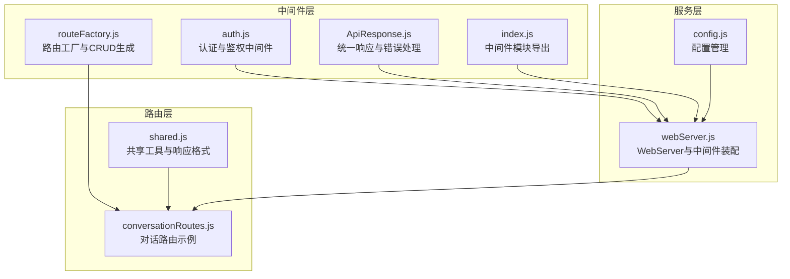
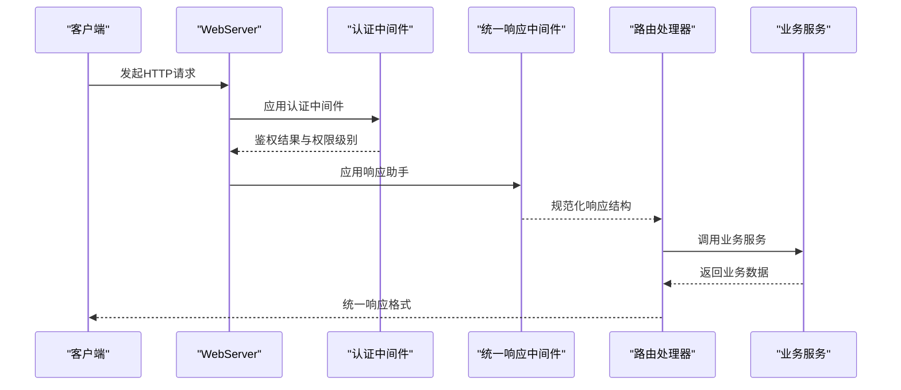
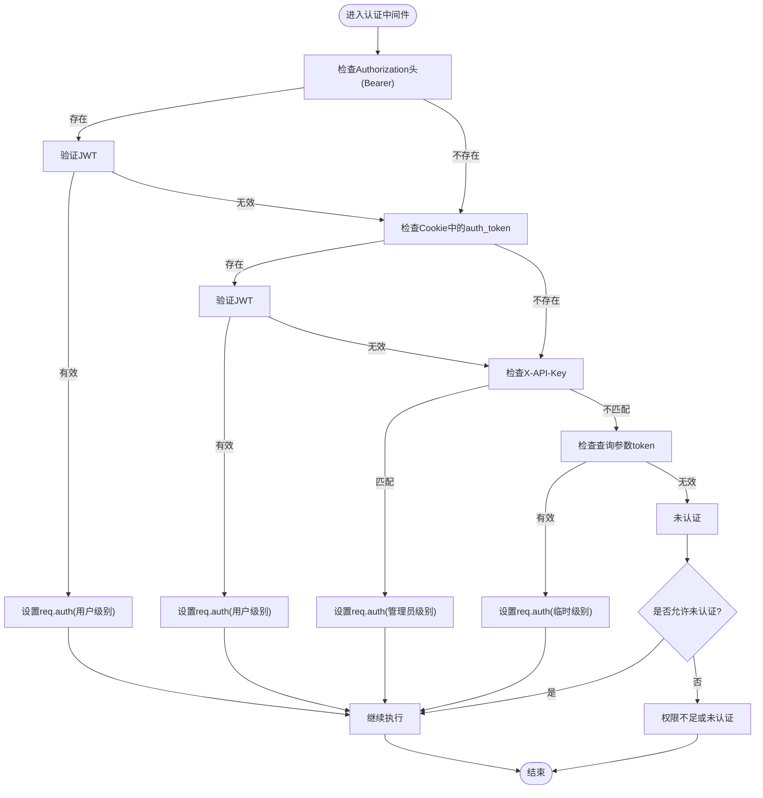
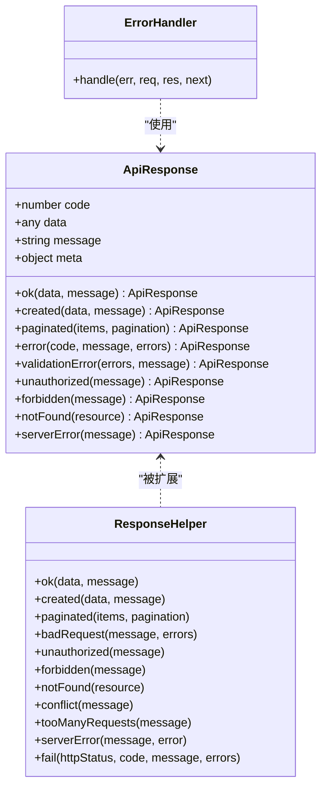
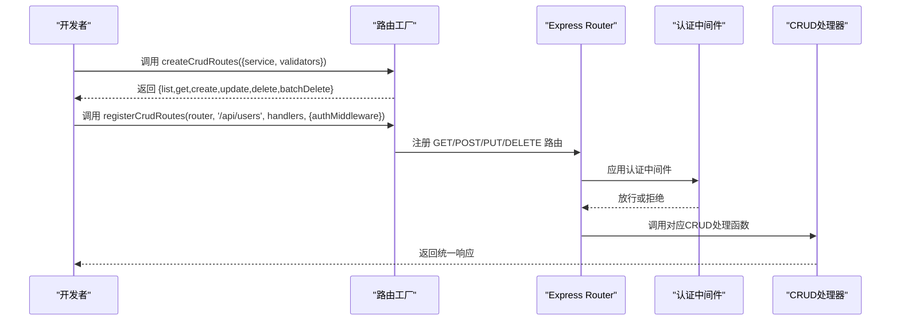
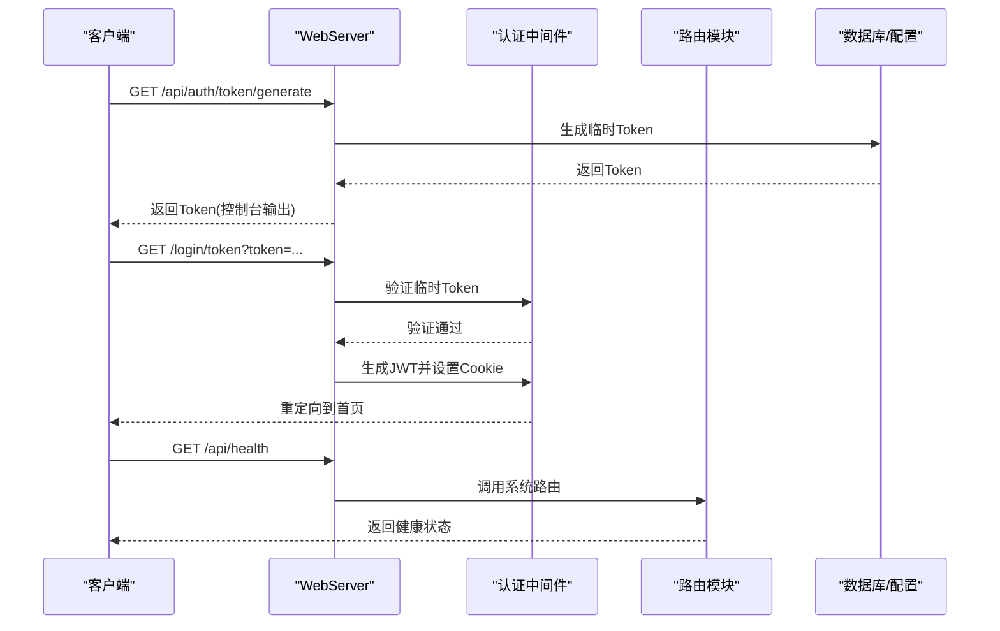
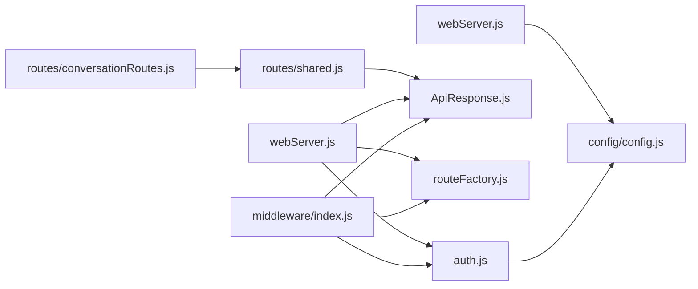

# 中间件系统

## 目录
1. [简介](#简介)
2. [项目结构](#项目结构)
3. [核心组件](#核心组件)
4. [架构总览](#架构总览)
5. [详细组件分析](#详细组件分析)
6. [依赖关系分析](#依赖关系分析)
7. [性能考虑](#性能考虑)
8. [故障排除指南](#故障排除指南)
9. [结论](#结论)

## 简介
本文件系统性阐述 ChatAI 插件的中间件体系，涵盖认证授权、统一响应格式、路由工厂模式与执行顺序，并提供开发指南、自定义中间件实现与性能优化建议。重点包括：
- 认证中间件（JWT 验证、权限检查、会话管理）
- 统一响应中间件（ApiResponse、响应助手、错误处理）
- 路由工厂（CRUD 路由生成、配置路由、注册机制）
- 中间件链路与异常处理、调试技巧

## 项目结构
中间件相关代码集中在 src/services/middleware 目录，配合路由模块与 WebServer 启动逻辑共同构成完整的中间件生态。

图表来源
- [auth.js](file://src/services/middleware/auth.js#L1-L533)
- [ApiResponse.js](file://src/services/middleware/ApiResponse.js#L1-L357)
- [routeFactory.js](file://src/services/middleware/routeFactory.js#L1-L259)
- [index.js](file://src/services/middleware/index.js#L1-L31)
- [webServer.js](file://src/services/webServer.js#L1-L807)
- [conversationRoutes.js](file://src/services/routes/conversationRoutes.js#L1-L118)
- [shared.js](file://src/services/routes/shared.js#L1-L150)
- [config.js](file://config/config.js#L1-L631)

章节来源
- [index.js](file://src/services/middleware/index.js#L1-L31)
- [webServer.js](file://src/services/webServer.js#L288-L537)

## 核心组件
- 认证中间件（auth.js）
  - 支持多种认证来源：Bearer JWT、Cookie、API Key、临时/永久Token
  - 权限等级与可选认证
  - 限流、安全头、请求日志、CORS
- 统一响应中间件（ApiResponse.js）
  - 规范化 HTTP 状态码与业务错误码
  - 响应助手扩展 res 对象
  - 全局错误处理与请求验证中间件
- 路由工厂（routeFactory.js）
  - 异步处理包装器
  - CRUD 路由生成与注册
  - 配置路由生成与校验

章节来源
- [auth.js](file://src/services/middleware/auth.js#L179-L254)
- [ApiResponse.js](file://src/services/middleware/ApiResponse.js#L58-L142)
- [routeFactory.js](file://src/services/middleware/routeFactory.js#L7-L11)

## 架构总览
中间件在 WebServer 初始化阶段装配，认证中间件负责鉴权与权限校验，统一响应中间件规范输出格式，路由工厂简化 CRUD 路由开发。

图表来源
- [webServer.js](file://src/services/webServer.js#L288-L537)
- [auth.js](file://src/services/middleware/auth.js#L179-L254)
- [ApiResponse.js](file://src/services/middleware/ApiResponse.js#L147-L207)

## 详细组件分析

### 认证中间件（auth.js）
- 认证来源优先级
  - Bearer JWT（Authorization 头）
  - Cookie 中的 auth_token
  - X-API-Key 请求头
  - 查询参数 token（临时/永久）
- 权限等级
  - READONLY、USER、ADMIN、SUPER
  - 可配置 requiredLevel 与 optional 认证
- 会话与令牌
  - 临时Token：基于 Map 存储，超时自动清理
  - 永久Token：持久化到配置，支持撤销
  - JWT：运行时生成随机密钥，重启失效；提供重置能力
- 限流与安全
  - IP 级限流与用户级限流
  - 安全头设置与 CORS 支持
  - 请求日志（可脱敏敏感字段）

图表来源
- [auth.js](file://src/services/middleware/auth.js#L182-L253)

章节来源
- [auth.js](file://src/services/middleware/auth.js#L13-L18)
- [auth.js](file://src/services/middleware/auth.js#L23-L108)
- [auth.js](file://src/services/middleware/auth.js#L116-L171)
- [auth.js](file://src/services/middleware/auth.js#L179-L254)
- [auth.js](file://src/services/middleware/auth.js#L323-L366)
- [auth.js](file://src/services/middleware/auth.js#L406-L417)
- [auth.js](file://src/services/middleware/auth.js#L425-L474)
- [auth.js](file://src/services/middleware/auth.js#L483-L515)

### 统一响应中间件（ApiResponse.js）
- 响应结构
  - code：业务错误码
  - data：返回数据
  - message：提示信息
  - meta：分页等元信息
- 响应助手
  - res.ok/res.created/res.paginated
  - res.badRequest/res.unauthorized/res.forbidden
  - res.notFound/res.conflict/res.tooManyRequests
  - res.serverError/res.fail
- 错误处理
  - 全局错误处理器捕获特定错误类型
  - 开发环境可返回详细错误信息
- 请求验证
  - validate(schema) 中间件，支持 body/params/query 的字段规则校验

图表来源
- [ApiResponse.js](file://src/services/middleware/ApiResponse.js#L58-L142)
- [ApiResponse.js](file://src/services/middleware/ApiResponse.js#L147-L207)
- [ApiResponse.js](file://src/services/middleware/ApiResponse.js#L212-L241)

章节来源
- [ApiResponse.js](file://src/services/middleware/ApiResponse.js#L5-L56)
- [ApiResponse.js](file://src/services/middleware/ApiResponse.js#L58-L142)
- [ApiResponse.js](file://src/services/middleware/ApiResponse.js#L147-L207)
- [ApiResponse.js](file://src/services/middleware/ApiResponse.js#L212-L241)
- [ApiResponse.js](file://src/services/middleware/ApiResponse.js#L246-L280)
- [ApiResponse.js](file://src/services/middleware/ApiResponse.js#L285-L348)

### 路由工厂（routeFactory.js）
- 异步处理包装器
  - asyncHandler(fn) 将异步函数包裹为 Express 中间件，自动捕获异常并交由 next
- CRUD 路由生成
  - createCrudRoutes(options)：支持 list/get/create/update/delete/batchDelete
  - 自动识别 service 的 getAll/list/get/create/update/delete 方法
  - 支持分页返回与统一响应
- 配置路由生成
  - createConfigRoutes(options)：get/set，支持自定义验证器
- 路由注册
  - registerCrudRoutes(router, basePath, routes, options)：批量注册标准CRUD与自定义路由

图表来源
- [routeFactory.js](file://src/services/middleware/routeFactory.js#L21-L181)
- [routeFactory.js](file://src/services/middleware/routeFactory.js#L191-L215)
- [routeFactory.js](file://src/services/middleware/routeFactory.js#L225-L251)

章节来源
- [routeFactory.js](file://src/services/middleware/routeFactory.js#L7-L11)
- [routeFactory.js](file://src/services/middleware/routeFactory.js#L21-L181)
- [routeFactory.js](file://src/services/middleware/routeFactory.js#L191-L215)
- [routeFactory.js](file://src/services/middleware/routeFactory.js#L225-L251)

### 中间件装配与使用（webServer.js）
- 中间件装配
  - CORS、静态文件、Cookie 解析、JSON 解析
  - 认证中间件（JWT 验证、指纹绑定、签名验证）
- 路由注册
  - 使用 registerCrudRoutes 或直接挂载路由模块
  - 支持公开接口与受保护接口
- 登录流程
  - 生成临时/永久Token
  - 通过 /login/token 或 /api/auth/login 完成登录并设置 Cookie

图表来源
- [webServer.js](file://src/services/webServer.js#L452-L481)
- [webServer.js](file://src/services/webServer.js#L341-L375)
- [webServer.js](file://src/services/webServer.js#L509-L537)

章节来源
- [webServer.js](file://src/services/webServer.js#L288-L311)
- [webServer.js](file://src/services/webServer.js#L313-L337)
- [webServer.js](file://src/services/webServer.js#L452-L481)
- [webServer.js](file://src/services/webServer.js#L341-L375)

## 依赖关系分析
- 中间件导出
  - index.js 将认证、响应、路由工厂等模块集中导出，便于统一引入
- 路由与中间件
  - 路由模块通过 shared.js 使用统一响应格式
  - WebServer 在 setupRoutes 中应用认证中间件并注册路由
- 配置与密钥
  - config.js 提供持久化配置，auth.js 与 webServer.js 读取/写入相关配置项

图表来源
- [index.js](file://src/services/middleware/index.js#L1-L31)
- [webServer.js](file://src/services/webServer.js#L124-L144)
- [conversationRoutes.js](file://src/services/routes/conversationRoutes.js#L5-L6)
- [shared.js](file://src/services/routes/shared.js#L1-L150)
- [config.js](file://config/config.js#L590-L626)

章节来源
- [index.js](file://src/services/middleware/index.js#L1-L31)
- [webServer.js](file://src/services/webServer.js#L124-L144)
- [conversationRoutes.js](file://src/services/routes/conversationRoutes.js#L5-L6)
- [shared.js](file://src/services/routes/shared.js#L1-L150)
- [config.js](file://config/config.js#L590-L626)

## 性能考虑
- 异步处理
  - 使用 asyncHandler 包裹异步路由，避免未捕获异常导致进程崩溃
- 限流策略
  - rateLimit 支持按 IP 或按用户限流，合理设置窗口与阈值
- 日志与脱敏
  - requestLogger 支持脱敏敏感字段，避免日志泄露
- 响应格式
  - 统一响应减少前后端差异，提升缓存与代理效率
- 中间件顺序
  - 鉴权应在路由之前，CORS 在静态资源之后，避免重复设置

## 故障排除指南
- 认证失败
  - 检查 Authorization 头、Cookie、API Key 是否正确
  - 确认 JWT 密钥未重置，临时/永久Token是否过期
- 权限不足
  - 确认 requiredLevel 与用户权限级别
  - 检查 optional 配置是否符合预期
- 响应格式异常
  - 确保使用 responseHelper 或 ApiResponse 统一输出
  - 检查全局错误处理器是否拦截了预期错误
- 路由未生效
  - 确认 registerCrudRoutes 已正确注册
  - 检查认证中间件是否正确传入
- 日志定位
  - 使用 requestLogger 记录请求与响应，结合 requestId 定位问题

章节来源
- [auth.js](file://src/services/middleware/auth.js#L179-L254)
- [ApiResponse.js](file://src/services/middleware/ApiResponse.js#L212-L241)
- [routeFactory.js](file://src/services/middleware/routeFactory.js#L225-L251)
- [webServer.js](file://src/services/webServer.js#L452-L481)

## 结论
ChatAI 插件的中间件系统以“认证-响应-路由”三层为核心，通过统一的响应格式与灵活的路由工厂，显著提升了开发效率与一致性。建议在实际项目中：
- 明确中间件执行顺序与职责边界
- 合理配置限流与安全头
- 使用统一响应与请求验证中间件
- 通过路由工厂快速生成 CRUD 路由并统一错误处理
- 借助 requestLogger 与全局错误处理器进行调试与监控
