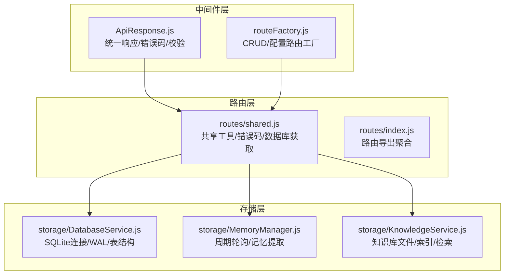
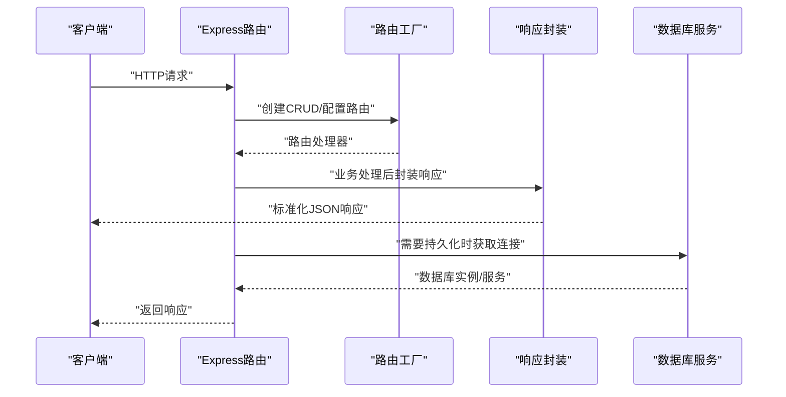
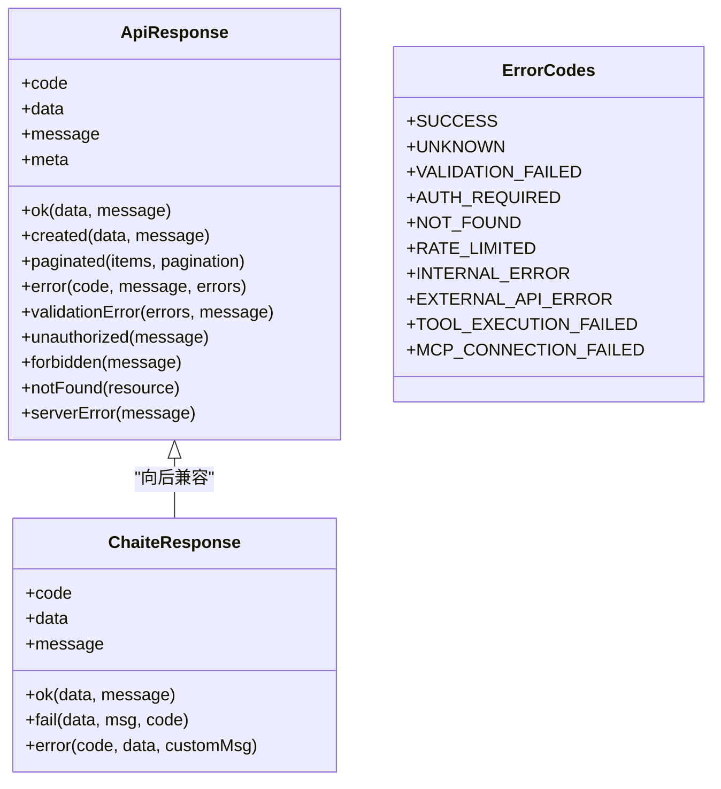
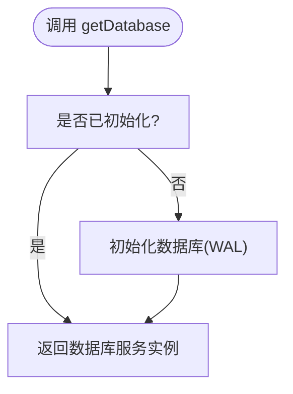
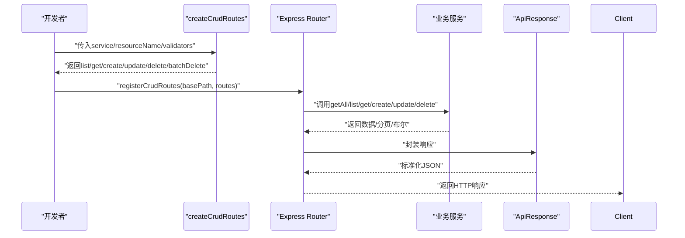
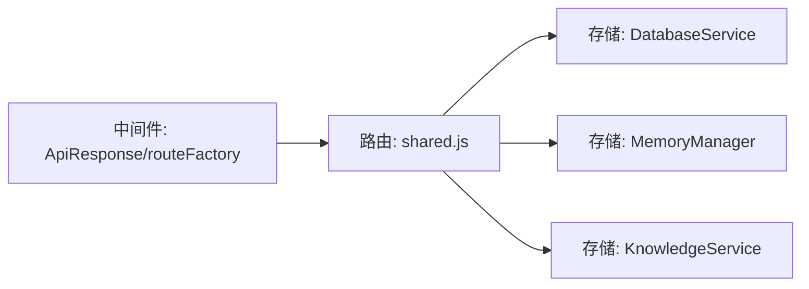

# 共享组件

## 目录
1. [简介](#简介)
2. [项目结构](#项目结构)
3. [核心组件](#核心组件)
4. [架构总览](#架构总览)
5. [详细组件分析](#详细组件分析)
6. [依赖分析](#依赖分析)
7. [性能考量](#性能考量)
8. [故障排查指南](#故障排查指南)
9. [结论](#结论)
10. [附录](#附录)

## 简介
本章节概述 ChatAI 插件共享组件的设计目标与价值定位。共享组件旨在统一响应格式、规范错误码、提供数据库连接管理与路由复用能力，从而提升各业务模块的一致性、可维护性与可扩展性。文档将重点阐述：
- 响应封装与错误码体系：ApiResponse 基类与 ChaiteResponse 的设计与继承关系
- 错误码定义：HttpStatus、ErrorCode、ErrorCodes 的分类与语义
- 数据库连接管理：getDatabase 的实现原理与 WAL 模式配置
- 路由复用：基于路由工厂的 CRUD 与配置路由模板
- 使用方式与最佳实践：如何在各路由模块中复用共享组件
- 自定义扩展：响应格式、错误处理与数据库操作指南
- 测试方法、性能优化与维护建议

## 项目结构
共享组件主要分布在以下位置：
- 中间件层：统一响应与错误处理、路由工厂
- 路由层：共享工具与数据库获取入口
- 存储层：数据库服务、记忆管理、知识库服务

图表来源
- [ApiResponse.js](file://src/services/middleware/ApiResponse.js#L1-L357)
- [routeFactory.js](file://src/services/middleware/routeFactory.js#L1-L259)
- [shared.js](file://src/services/routes/shared.js#L1-L150)
- [DatabaseService.js](file://src/services/storage/DatabaseService.js#L1-L809)
- [MemoryManager.js](file://src/services/storage/MemoryManager.js#L1-L800)
- [KnowledgeService.js](file://src/services/storage/KnowledgeService.js#L1-L931)

章节来源
- [index.js](file://index.js#L1-L258)
- [README.md](file://README.md#L1-L983)

## 核心组件
本节聚焦共享组件的关键职责与接口：
- 统一响应与错误码：提供 ApiResponse、ChaiteResponse、HttpStatus、ErrorCode、ErrorCodes
- 路由工厂：提供 asyncHandler、createCrudRoutes、createConfigRoutes、registerCrudRoutes
- 数据库服务：提供 getDatabase、getRawDatabase、表结构与常用 CRUD 方法
- 路由共享：集中导出路由工具与数据库获取入口

章节来源
- [ApiResponse.js](file://src/services/middleware/ApiResponse.js#L1-L357)
- [routeFactory.js](file://src/services/middleware/routeFactory.js#L1-L259)
- [shared.js](file://src/services/routes/shared.js#L1-L150)
- [DatabaseService.js](file://src/services/storage/DatabaseService.js#L1-L809)
- [index.js](file://src/services/middleware/index.js#L1-L31)
- [index.js](file://src/services/routes/index.js#L1-L52)

## 架构总览
共享组件在系统中的交互关系如下：

图表来源
- [routeFactory.js](file://src/services/middleware/routeFactory.js#L21-L181)
- [ApiResponse.js](file://src/services/middleware/ApiResponse.js#L58-L142)
- [shared.js](file://src/services/routes/shared.js#L131-L147)

## 详细组件分析

### 响应封装与错误码体系
- ApiResponse 类：提供 ok、created、paginated、error、validationError、unauthorized、forbidden、notFound、serverError 等静态方法，统一返回结构与消息。
- ChaiteResponse：向后兼容的简易响应封装，提供 ok、fail、error 三种静态方法。
- 错误码与消息：
  - HttpStatus：HTTP 状态码常量
  - ErrorCode：通用错误码（与 ApiResponse.error 搭配）
  - ErrorCodes：路由共享模块的错误码集合（与 shared.js 中的 ChaiteResponse 搭配）
  - ErrorMessages：错误码到中文消息的映射

图表来源
- [ApiResponse.js](file://src/services/middleware/ApiResponse.js#L58-L142)
- [ApiResponse.js](file://src/services/middleware/ApiResponse.js#L350-L354)
- [shared.js](file://src/services/routes/shared.js#L93-L125)
- [shared.js](file://src/services/routes/shared.js#L8-L69)

章节来源
- [ApiResponse.js](file://src/services/middleware/ApiResponse.js#L1-L357)
- [shared.js](file://src/services/routes/shared.js#L1-L150)

### 数据库连接管理与 WAL 配置
- getDatabase：懒加载数据库服务，若未初始化则自动 init；返回单例数据库服务实例，供路由与业务模块使用。
- getRawDatabase：返回底层 better-sqlite3 实例，适用于需要直接执行 SQL 的场景。
- DatabaseService：
  - 初始化：确保 data 目录存在，创建数据库文件并启用 WAL 模式以提升并发读写性能
  - 表结构：messages、memories、kv_store 三张核心表及索引
  - 常用方法：保存/查询/删除/清理会话与记忆，KV 存取，用户设置读写等
  - 去重与安全：消息保存时进行去重与内容转义，防止注入与重复

图表来源
- [shared.js](file://src/services/routes/shared.js#L131-L136)
- [DatabaseService.js](file://src/services/storage/DatabaseService.js#L26-L45)

章节来源
- [shared.js](file://src/services/routes/shared.js#L127-L147)
- [DatabaseService.js](file://src/services/storage/DatabaseService.js#L1-L809)

### 路由工厂与复用机制
- asyncHandler：将异步处理函数包装为 Express 中间件，自动捕获异常并交由全局错误处理。
- createCrudRoutes：根据服务接口抽象 CRUD 操作，自动处理分页、校验与 NotFound 场景。
- createConfigRoutes：提供配置读取/保存的标准路由模板，支持自定义校验。
- registerCrudRoutes：注册标准 CRUD 路由，并支持挂载自定义路由。

图表来源
- [routeFactory.js](file://src/services/middleware/routeFactory.js#L21-L181)
- [routeFactory.js](file://src/services/middleware/routeFactory.js#L191-L215)
- [routeFactory.js](file://src/services/middleware/routeFactory.js#L225-L251)

章节来源
- [routeFactory.js](file://src/services/middleware/routeFactory.js#L1-L259)
- [index.js](file://src/services/middleware/index.js#L28-L28)

### 记忆管理与知识库服务
- MemoryManager：周期性轮询用户会话，提取与总结记忆；支持群聊上下文采集与分析；提供覆盖式替换记忆的能力。
- KnowledgeService：管理知识库文档，支持文件导入、索引构建、按预设关联检索与提示词构建。

章节来源
- [MemoryManager.js](file://src/services/storage/MemoryManager.js#L1-L800)
- [KnowledgeService.js](file://src/services/storage/KnowledgeService.js#L1-L931)

## 依赖分析
共享组件之间的耦合与协作：
- 中间件层为路由层提供统一响应与路由模板
- 路由层通过 shared.js 暴露 getDatabase，业务模块通过它获取数据库服务
- 存储层由 DatabaseService 提供底层连接，MemoryManager/KnowledgeService 基于其进行业务操作

图表来源
- [index.js](file://src/services/middleware/index.js#L1-L31)
- [index.js](file://src/services/routes/index.js#L1-L52)
- [shared.js](file://src/services/routes/shared.js#L1-L150)
- [DatabaseService.js](file://src/services/storage/DatabaseService.js#L1-L809)
- [MemoryManager.js](file://src/services/storage/MemoryManager.js#L1-L800)
- [KnowledgeService.js](file://src/services/storage/KnowledgeService.js#L1-L931)

章节来源
- [index.js](file://src/services/middleware/index.js#L1-L31)
- [index.js](file://src/services/routes/index.js#L1-L52)

## 性能考量
- 数据库并发：WAL 模式提升读写并发，适合高并发场景
- 查询优化：messages、memories 表建立索引，减少高频查询成本
- 内存控制：MemoryManager 的轮询间隔与消息缓冲限制，避免内存膨胀
- 路由处理：asyncHandler 统一封装异步错误，避免未捕获异常导致进程抖动
- 日志与可观测：中间件提供 requestLogger，配合 statsService 记录 API 调用统计

章节来源
- [DatabaseService.js](file://src/services/storage/DatabaseService.js#L39-L42)
- [MemoryManager.js](file://src/services/storage/MemoryManager.js#L36-L56)
- [index.js](file://src/services/middleware/index.js#L30-L30)

## 故障排查指南
- 数据库初始化失败
  - 现象：启动时报数据库初始化错误
  - 排查：确认 data 目录可写、better-sqlite3 原生模块已正确构建
  - 参考：README 中的安装与构建问题章节
- API 响应格式不一致
  - 现象：前端收到非统一格式响应
  - 排查：确认路由中使用 ApiResponse 或 ChaiteResponse 进行封装
- 路由未生效或鉴权失败
  - 现象：401/403 或路由未注册
  - 排查：检查 registerCrudRoutes 的认证中间件是否正确挂载
- 记忆提取异常
  - 现象：MemoryManager 轮询失败或记忆为空
  - 排查：检查配置开关、轮询间隔、LLM 客户端可用性与统计记录

章节来源
- [README.md](file://README.md#L553-L746)
- [ApiResponse.js](file://src/services/middleware/ApiResponse.js#L212-L241)
- [routeFactory.js](file://src/services/middleware/routeFactory.js#L225-L251)
- [MemoryManager.js](file://src/services/storage/MemoryManager.js#L489-L529)

## 结论
共享组件通过统一响应、标准化错误码、路由工厂与数据库连接管理，显著提升了 ChatAI 插件的工程一致性与可维护性。建议在新增路由模块时优先复用路由工厂与响应封装，使用 getDatabase 获取数据库实例，并遵循错误码分类与消息映射约定，以获得更好的可测试性与可观测性。

## 附录

### 在路由模块中的使用方式与最佳实践
- 使用路由工厂
  - 通过 createCrudRoutes 生成标准 CRUD 路由，再用 registerCrudRoutes 注册
  - 对配置类接口使用 createConfigRoutes
- 使用响应封装
  - 成功响应：使用 ApiResponse.ok 或 ChaiteResponse.ok
  - 分页响应：使用 ApiResponse.paginated
  - 错误响应：使用 ApiResponse.error 或 ChaiteResponse.error
- 使用数据库
  - 通过 getDatabase 获取数据库服务实例，进行读写
  - 需要原生 SQL 时使用 getRawDatabase
- 错误处理
  - 使用 asyncHandler 包裹异步处理逻辑
  - 全局错误中间件统一处理 ValidationError、UnauthorizedError、NotFoundError 等

章节来源
- [routeFactory.js](file://src/services/middleware/routeFactory.js#L21-L181)
- [routeFactory.js](file://src/services/middleware/routeFactory.js#L225-L251)
- [ApiResponse.js](file://src/services/middleware/ApiResponse.js#L58-L142)
- [shared.js](file://src/services/routes/shared.js#L131-L147)

### 自定义响应格式与错误处理扩展
- 自定义响应格式
  - 在业务模块中直接构造 ApiResponse 或 ChaiteResponse 实例
  - 若需携带分页信息，使用 ApiResponse.paginated
- 扩展错误码
  - 在路由共享模块中扩展 ErrorCodes 并补充消息映射
  - 在中间件模块中扩展 ErrorCode 与 ErrorMessages，保持前后端一致

章节来源
- [shared.js](file://src/services/routes/shared.js#L8-L69)
- [shared.js](file://src/services/routes/shared.js#L72-L90)
- [ApiResponse.js](file://src/services/middleware/ApiResponse.js#L19-L56)

### 数据库操作指南
- 初始化与连接
  - 使用 getDatabase 获取数据库服务；首次使用自动初始化
  - 使用 getRawDatabase 获取底层 better-sqlite3 实例
- 常用操作
  - 会话：保存/查询/修剪/清理
  - 记忆：保存/查询/搜索/清理
  - KV：设置/获取/删除/前缀查询
- 注意事项
  - 避免在高频路径中执行大事务
  - 使用索引字段进行查询，避免全表扫描
  - 对用户输入进行转义与长度限制，防止注入与模式复杂度过高

章节来源
- [shared.js](file://src/services/routes/shared.js#L131-L147)
- [DatabaseService.js](file://src/services/storage/DatabaseService.js#L83-L190)
- [DatabaseService.js](file://src/services/storage/DatabaseService.js#L263-L327)
- [DatabaseService.js](file://src/services/storage/DatabaseService.js#L125-L164)

### 组件测试方法
- 响应封装测试
  - 验证 ApiResponse.ok/created/paginated/error 输出结构与字段
  - 验证 ChaiteResponse.ok/fail/error 的返回值
- 路由工厂测试
  - 使用 createCrudRoutes 生成路由，模拟 GET/POST/PUT/DELETE 请求，验证分页与 NotFound 场景
  - 使用 createConfigRoutes 生成配置路由，验证校验与保存流程
- 数据库测试
  - 初始化数据库，插入/查询/删除数据，验证索引与去重逻辑
  - 测试 getDatabase 与 getRawDatabase 的幂等性与一致性

章节来源
- [ApiResponse.js](file://src/services/middleware/ApiResponse.js#L71-L141)
- [shared.js](file://src/services/routes/shared.js#L93-L125)
- [routeFactory.js](file://src/services/middleware/routeFactory.js#L21-L181)
- [DatabaseService.js](file://src/services/storage/DatabaseService.js#L26-L45)
