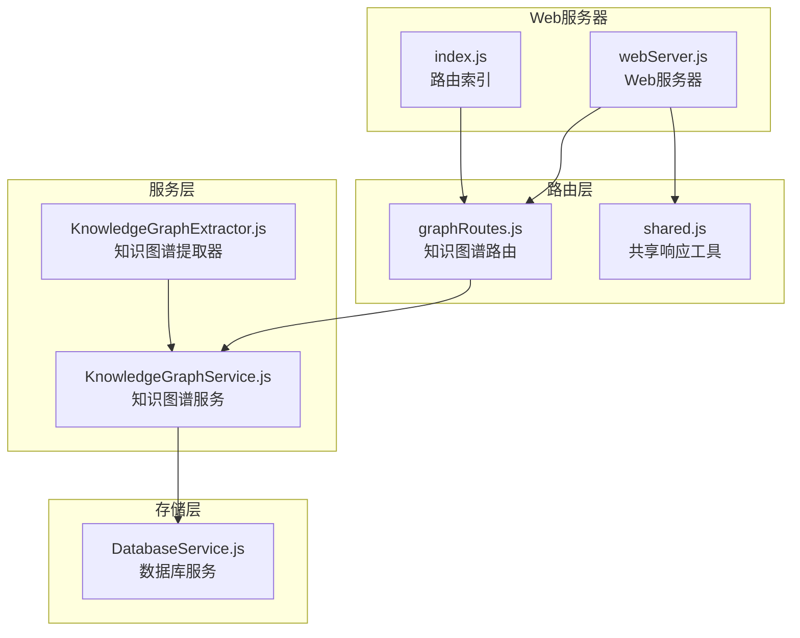
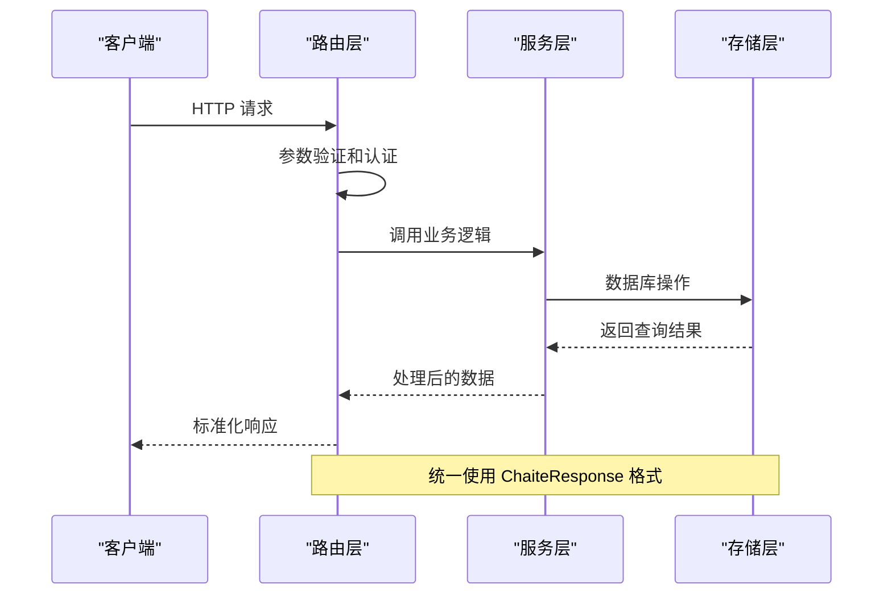
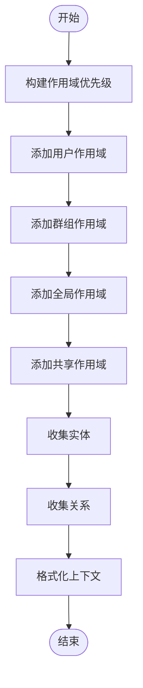
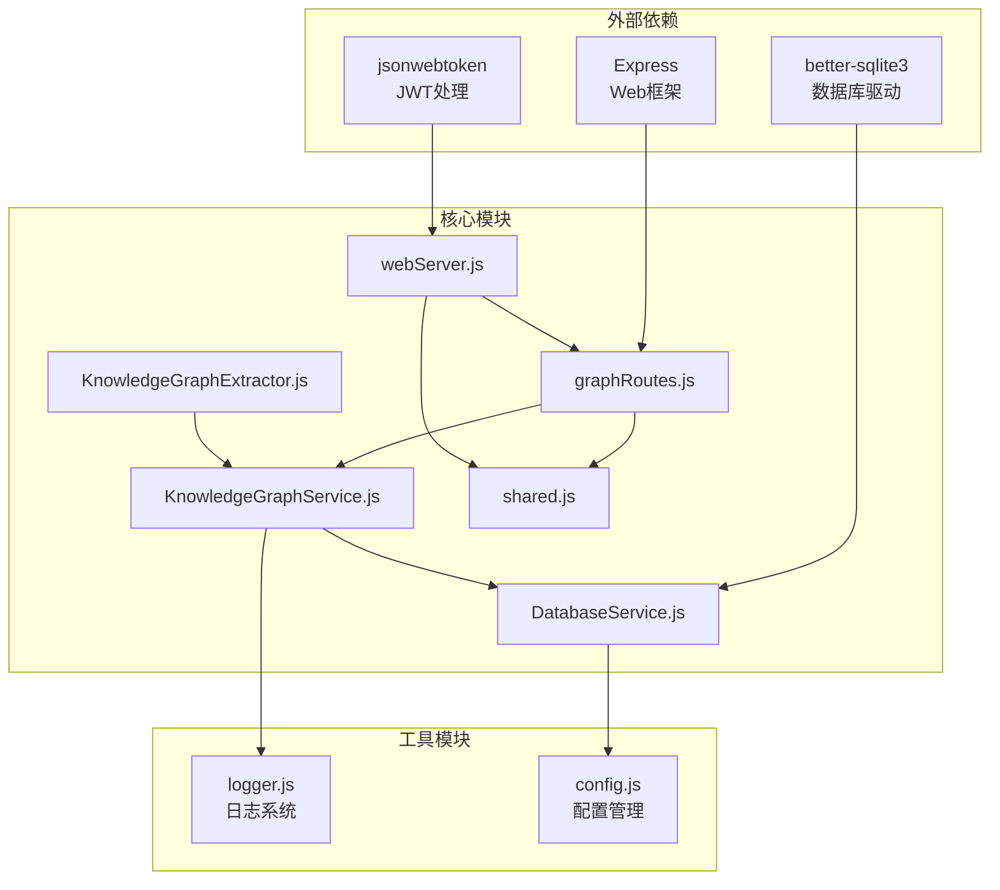

# 知识图谱路由

<cite>
**本文档引用的文件**
- [graphRoutes.js](file://src/services/routes/graphRoutes.js)
- [KnowledgeGraphService.js](file://src/services/storage/KnowledgeGraphService.js)
- [KnowledgeGraphExtractor.js](file://src/services/storage/KnowledgeGraphExtractor.js)
- [DatabaseService.js](file://src/services/storage/DatabaseService.js)
- [shared.js](file://src/services/routes/shared.js)
- [webServer.js](file://src/services/webServer.js)
- [index.js](file://src/services/routes/index.js)
- [API 接口参考.md](file://docs/content/API 接口参考/API 接口参考.md)
</cite>

## 目录
1. [简介](#简介)
2. [项目结构](#项目结构)
3. [核心组件](#核心组件)
4. [架构总览](#架构总览)
5. [详细组件分析](#详细组件分析)
6. [依赖关系分析](#依赖关系分析)
7. [性能考虑](#性能考虑)
8. [故障排除指南](#故障排除指南)
9. [结论](#结论)

## 简介

知识图谱路由是 ChatAI 插件中的核心功能模块，负责提供完整的知识图谱管理能力。该模块基于 Express 框架构建，提供了 RESTful API 接口，支持实体和关系的 CRUD 操作、子图查询、路径查询、知识上下文获取等功能。

知识图谱路由系统采用分层架构设计，包括路由层、服务层、存储层三个主要层次，每个层次都有明确的职责分工和清晰的接口定义。系统支持多作用域管理、版本历史追踪、批量导入导出等高级功能。

## 项目结构

知识图谱路由模块位于插件的 `src/services/routes/` 目录下，主要包含以下文件：

**图表来源**
- [graphRoutes.js](file://src/services/routes/graphRoutes.js#L1-L308)
- [KnowledgeGraphService.js](file://src/services/storage/KnowledgeGraphService.js#L1-L924)
- [DatabaseService.js](file://src/services/storage/DatabaseService.js#L1-L922)

**章节来源**
- [graphRoutes.js](file://src/services/routes/graphRoutes.js#L1-L308)
- [webServer.js](file://src/services/webServer.js#L124-L144)
- [index.js](file://src/services/routes/index.js#L1-L54)

## 核心组件

### 路由模块 (graphRoutes.js)

路由模块提供了完整的知识图谱 API 接口，包括：

- **实体管理接口**：实体的创建、查询、更新、删除、历史查询
- **关系管理接口**：关系的创建、查询、删除
- **图查询接口**：子图查询、路径查询
- **上下文接口**：用户知识上下文获取
- **导入导出接口**：图谱数据的导入和导出
- **统计接口**：图谱统计数据查询

每个路由都经过统一的认证中间件保护，使用标准化的响应格式。

### 知识图谱服务 (KnowledgeGraphService.js)

服务层提供了知识图谱的核心业务逻辑：

- **实体操作**：支持实体的创建、查询、更新、删除，包含版本历史管理
- **关系操作**：支持关系的创建、查询、更新、删除
- **图查询算法**：实现子图遍历和最短路径查询
- **作用域管理**：支持多作用域的数据隔离和共享
- **上下文构建**：根据用户和群组信息构建个性化知识上下文

### 数据库服务 (DatabaseService.js)

存储层负责数据持久化：

- **SQLite 数据库**：使用 better-sqlite3 提供高性能的本地存储
- **表结构设计**：包含实体表、关系表、历史表、作用域共享表等
- **索引优化**：为常用查询字段建立索引提升查询性能
- **事务支持**：确保数据操作的原子性和一致性

**章节来源**
- [KnowledgeGraphService.js](file://src/services/storage/KnowledgeGraphService.js#L1-L924)
- [DatabaseService.js](file://src/services/storage/DatabaseService.js#L61-L191)

## 架构总览

知识图谱路由系统采用经典的三层架构模式：

**图表来源**
- [graphRoutes.js](file://src/services/routes/graphRoutes.js#L10-L27)
- [shared.js](file://src/services/routes/shared.js#L93-L125)

系统架构特点：

1. **分层清晰**：路由层、服务层、存储层职责分明
2. **统一响应**：所有接口使用标准化的响应格式
3. **错误处理**：统一的错误码和错误消息处理
4. **数据持久化**：基于 SQLite 的可靠数据存储
5. **性能优化**：合理的索引设计和查询优化

**章节来源**
- [webServer.js](file://src/services/webServer.js#L340-L537)
- [shared.js](file://src/services/routes/shared.js#L1-L150)

## 详细组件分析

### 实体管理组件

实体管理是知识图谱的核心数据结构，支持五种实体类型：

| 实体类型 | 描述 | 示例 |
|---------|------|------|
| person | 人物 | 用户、朋友、家人、同事 |
| thing | 物品 | 手机、书籍、游戏、食物 |
| place | 地点 | 城市、公司、学校、餐厅 |
| concept | 抽象概念 | 爱好、技能、目标、情感 |
| event | 事件 | 生日、会议、计划、纪念日 |

实体操作包括：
- **创建实体**：支持批量导入和单个创建
- **查询实体**：支持按 ID、名称、类型、作用域查询
- **更新实体**：支持增量更新和属性合并
- **删除实体**：软删除并保留历史记录
- **历史追踪**：记录每次变更的详细信息

### 关系管理组件

关系表示实体之间的语义关联，系统支持常见的关系类型：

- **社交关系**：knows（认识）、friend_of（朋友）、family_of（家人）
- **地理位置**：lives_in（居住在）、works_at（工作于）
- **偏好关系**：likes（喜欢）、dislikes（不喜欢）
- **所有权关系**：owns（拥有）
- **参与关系**：attends（参加）、born_on（出生于）
- **创作关系**：created（创作）
- **组织关系**：member_of（成员）

关系操作包括：
- **创建关系**：自动去重和验证
- **查询关系**：支持方向性查询（入边、出边、双向）
- **更新关系**：支持属性更新
- **删除关系**：级联删除相关历史记录

### 图查询组件

系统提供两种主要的图查询能力：

#### 子图查询 (Subgraph Query)
实现 N 跳邻居遍历，支持：
- **深度控制**：通过 depth 参数控制遍历深度
- **作用域过滤**：支持多作用域的联合查询
- **去重处理**：自动去除重复的实体和关系
- **性能优化**：使用 BFS 算法确保查询效率

#### 路径查询 (Path Query)
实现最短路径查找，支持：
- **最大深度限制**：防止无限搜索
- **关系类型过滤**：只考虑指定类型的关系
- **路径构建**：返回完整的实体序列和关系序列

### 知识上下文组件

系统能够根据用户和群组信息构建个性化的知识上下文：

**图表来源**
- [KnowledgeGraphService.js](file://src/services/storage/KnowledgeGraphService.js#L646-L708)

**章节来源**
- [KnowledgeGraphService.js](file://src/services/storage/KnowledgeGraphService.js#L464-L571)

## 依赖关系分析

知识图谱路由系统的依赖关系呈现清晰的层次结构：

**图表来源**
- [graphRoutes.js](file://src/services/routes/graphRoutes.js#L4-L5)
- [KnowledgeGraphService.js](file://src/services/storage/KnowledgeGraphService.js#L12-L14)
- [webServer.js](file://src/services/webServer.js#L1-L12)

### 关键依赖说明

1. **Express**：提供 Web 服务器和路由处理能力
2. **better-sqlite3**：提供高性能的本地数据库存储
3. **jsonwebtoken**：处理 JWT 认证和会话管理
4. **日志系统**：提供统一的日志记录和调试能力
5. **配置管理**：支持运行时配置的动态更新

**章节来源**
- [index.js](file://src/services/routes/index.js#L1-L54)
- [webServer.js](file://src/services/webServer.js#L1-L13)

## 性能考虑

知识图谱路由系统在设计时充分考虑了性能优化：

### 数据库优化
- **索引策略**：为常用查询字段建立复合索引
- **查询优化**：使用 LIMIT 和 OFFSET 实现分页查询
- **连接池**：复用数据库连接减少开销
- **事务处理**：批量操作使用事务确保性能和一致性

### 缓存策略
- **服务初始化缓存**：避免重复的初始化开销
- **查询结果缓存**：对热点数据进行缓存
- **连接状态缓存**：缓存数据库连接状态

### 算法优化
- **BFS 遍历**：子图查询使用广度优先搜索确保最短路径
- **去重算法**：使用 Set 和 Map 实现高效的去重操作
- **批量操作**：支持批量导入导出提升大容量数据处理效率

### 网络优化
- **请求限流**：防止恶意请求和滥用
- **响应压缩**：对大响应进行压缩传输
- **连接复用**：支持 HTTP Keep-Alive

## 故障排除指南

### 常见问题及解决方案

#### 数据库连接问题
**症状**：API 调用时报数据库连接错误
**原因**：数据库文件损坏或权限不足
**解决**：
1. 检查数据库文件是否存在和可访问
2. 验证文件权限设置
3. 重启服务重新初始化数据库

#### 查询性能问题
**症状**：图查询响应缓慢
**原因**：缺少必要的索引或查询条件不当
**解决**：
1. 检查查询条件是否包含适当的过滤参数
2. 确保使用了合适的深度限制
3. 考虑对频繁查询的字段建立索引

#### 内存使用过高
**症状**：系统内存占用持续增长
**原因**：大量数据查询或缓存未及时清理
**解决**：
1. 检查查询结果的大小限制
2. 确保及时释放不再使用的数据结构
3. 调整缓存策略和大小限制

#### 认证失败
**症状**：API 调用返回 401 未授权错误
**原因**：Token 过期或无效
**解决**：
1. 重新生成临时 Token
2. 检查 JWT 密钥配置
3. 验证 Token 的过期时间

**章节来源**
- [API 接口参考.md](file://docs/content/API 接口参考/API 接口参考.md#L411-L422)

## 结论

知识图谱路由系统是一个设计精良、功能完整的知识管理解决方案。系统采用分层架构设计，具有以下优势：

1. **功能完整性**：涵盖了知识图谱管理的各个方面，从基础的 CRUD 操作到复杂的图查询算法
2. **架构清晰**：分层设计使得代码结构清晰，易于维护和扩展
3. **性能优化**：通过合理的数据库设计和算法优化确保了良好的性能表现
4. **安全性保障**：统一的认证机制和错误处理确保了系统的安全性
5. **易用性强**：标准化的 API 接口和响应格式便于集成和使用

该系统为 ChatAI 插件提供了强大的知识管理能力，支持从简单的实体关系管理到复杂的图分析应用，是构建智能化聊天机器人的重要基础设施。