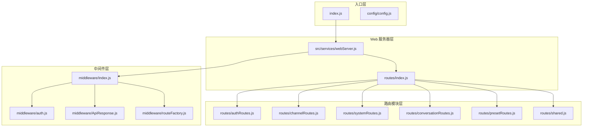
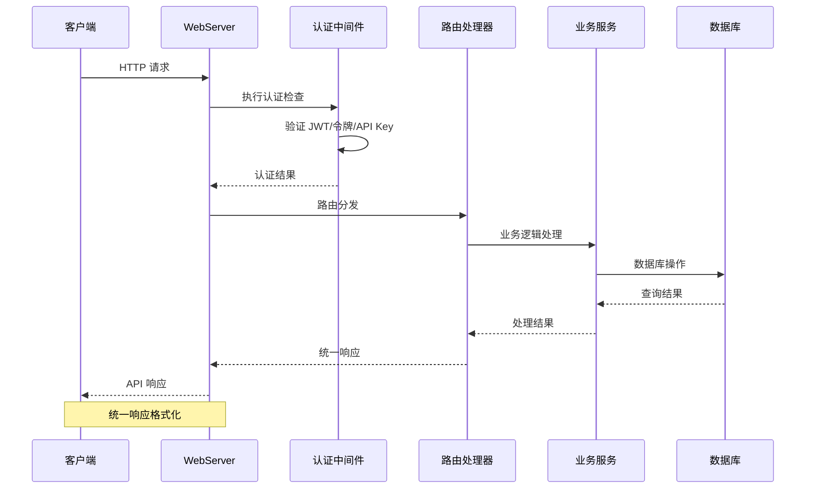
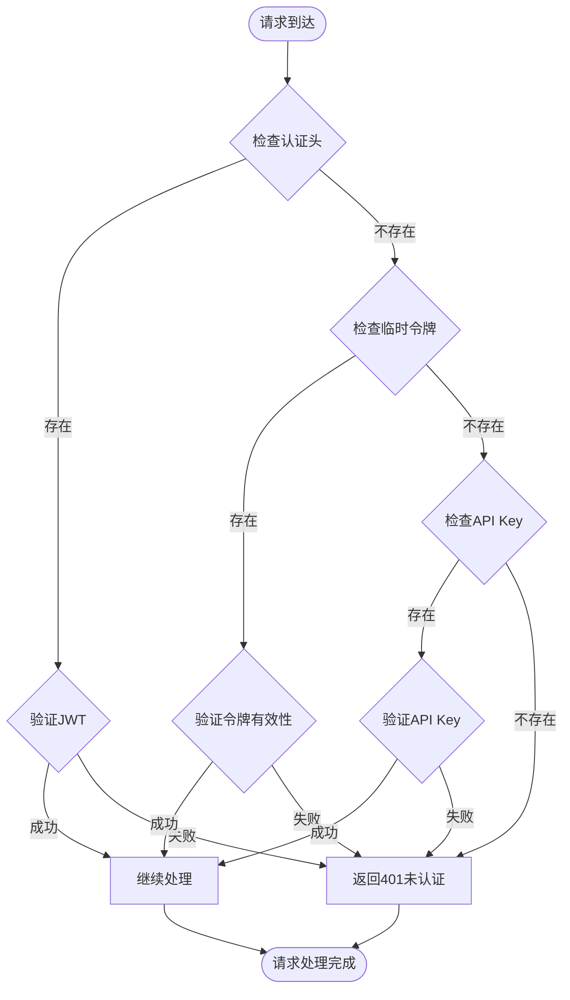
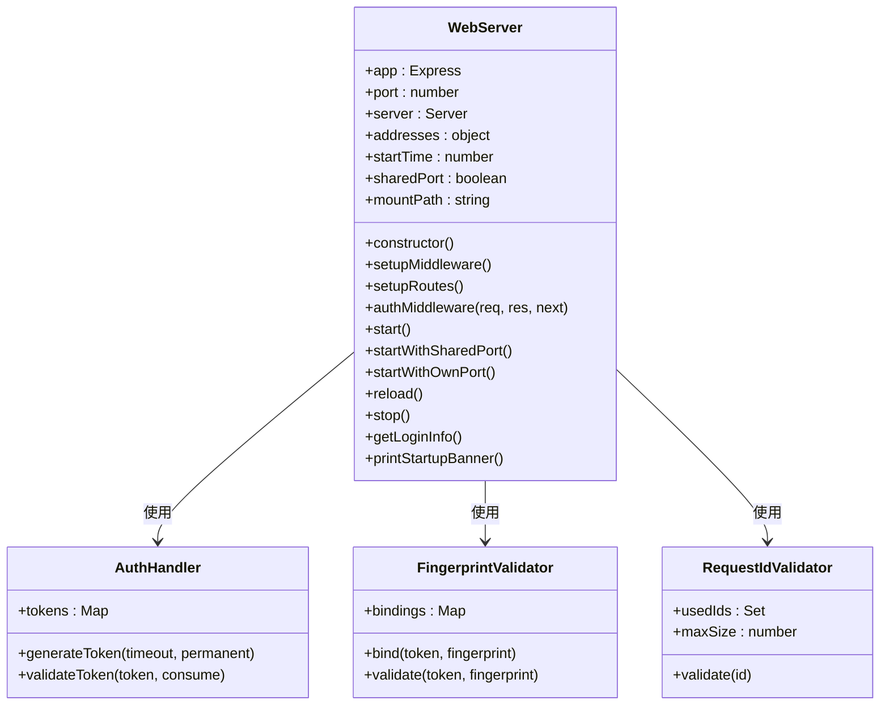
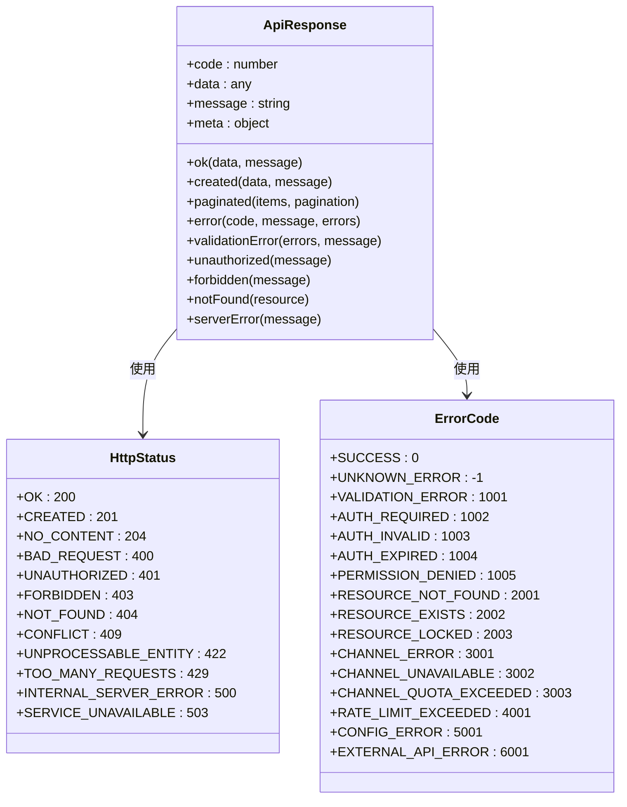
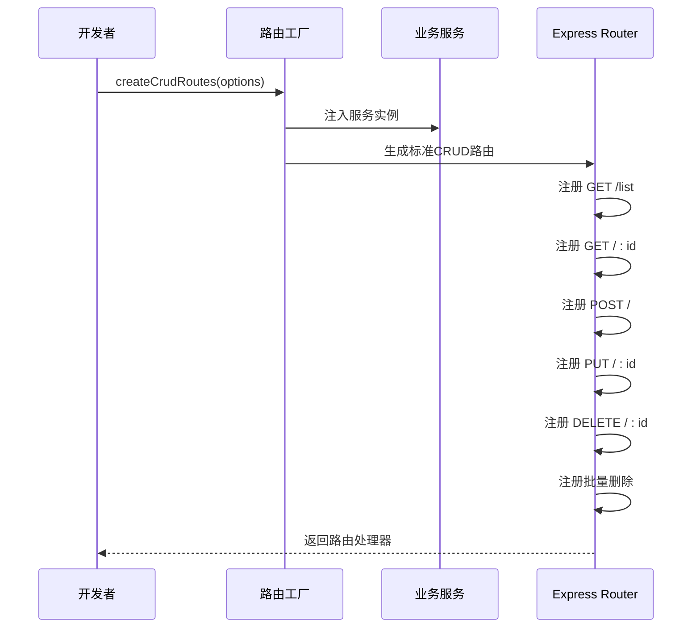
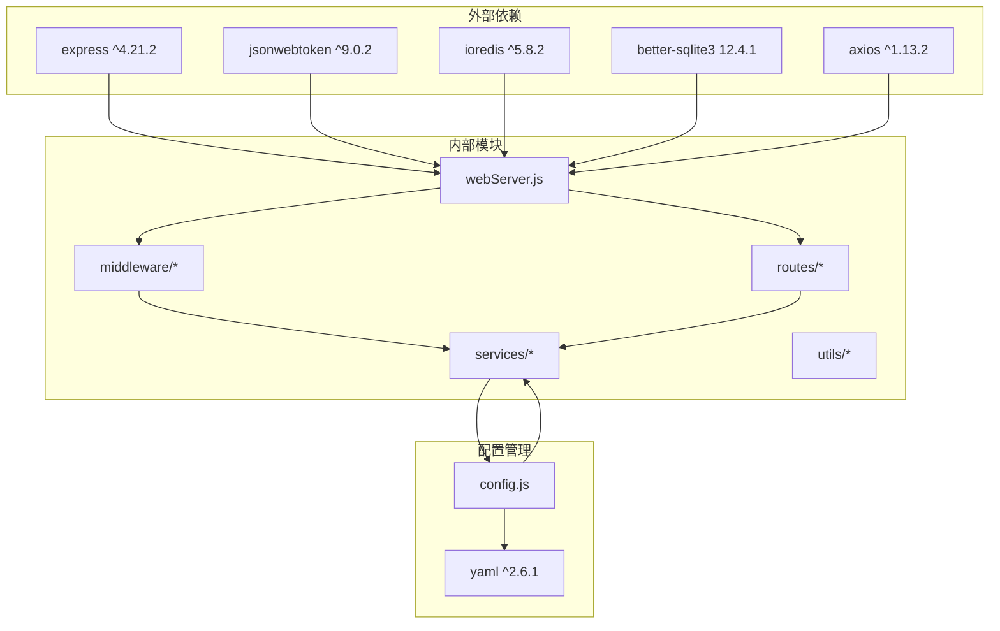

# 路由服务系统


## 目录
1. [简介](#简介)
2. [项目结构](#项目结构)
3. [核心组件](#核心组件)
4. [架构概览](#架构概览)
5. [详细组件分析](#详细组件分析)
6. [依赖关系分析](#依赖关系分析)
7. [性能考虑](#性能考虑)
8. [故障排除指南](#故障排除指南)
9. [结论](#结论)

## 简介

ChatAI 插件的路由服务系统是一个基于 Express.js 构建的现代化 Web 服务框架，专为 AI 聊天应用设计。该系统提供了完整的 RESTful API 路由管理、中间件处理、认证授权、CORS 支持和统一的响应格式化功能。

系统采用模块化设计，将路由、中间件和业务逻辑分离，支持热重载、多环境部署和丰富的配置选项。核心功能包括：

- **RESTful API 路由管理**：统一的路由定义和处理机制
- **多层次认证系统**：JWT、临时令牌、永久令牌和 API Key 支持
- **中间件管道**：请求验证、限流、安全头和日志记录
- **统一响应格式**：标准化的 API 响应结构
- **动态路由生成**：基于 CRUD 模式的自动化路由创建
- **实时监控**：系统健康检查和性能指标收集

## 项目结构



**图表来源**
- [index.js](file://index.js#L1-L258)
- [webServer.js](file://src/services/webServer.js#L1-L807)
- [routes/index.js](file://src/services/routes/index.js#L1-L52)

**章节来源**
- [index.js](file://index.js#L1-L258)
- [config/config.js](file://config/config.js#L1-L631)

## 核心组件

### WebServer 类

WebServer 是整个路由服务系统的核心控制器，负责：

- **Express 应用初始化**：配置基础中间件和静态文件服务
- **路由注册**：动态注册所有 API 路由
- **认证管理**：JWT 令牌生成、验证和管理
- **服务器生命周期**：启动、停止和热重载支持
- **环境适配**：支持独立端口和 TRSS 共享端口模式

### 中间件系统

中间件系统提供了一套完整的请求处理管道：

- **认证中间件**：支持多种认证方式的统一处理
- **请求验证**：基于 JSON Schema 的参数验证
- **限流中间件**：IP 和用户级别的请求频率控制
- **安全中间件**：CORS、安全头和请求日志
- **响应格式化**：统一的 API 响应结构

### 路由模块

系统采用模块化路由设计，每个功能域都有独立的路由模块：

- **认证路由**：登录、登出、令牌管理
- **渠道路由**：AI 渠道配置和测试
- **系统路由**：健康检查、性能监控、系统信息
- **对话路由**：对话历史管理和上下文处理
- **预设路由**：AI 预设管理和配置

**章节来源**
- [webServer.js](file://src/services/webServer.js#L279-L757)
- [middleware/index.js](file://src/services/middleware/index.js#L1-L31)
- [routes/index.js](file://src/services/routes/index.js#L1-L52)

## 架构概览



**图表来源**
- [webServer.js](file://src/services/webServer.js#L313-L337)
- [middleware/ApiResponse.js](file://src/services/middleware/ApiResponse.js#L58-L142)

### 认证流程



**图表来源**
- [middleware/auth.js](file://src/services/middleware/auth.js#L179-L254)
- [webServer.js](file://src/services/webServer.js#L313-L337)

## 详细组件分析

### WebServer 类详细分析

WebServer 类实现了完整的 Web 服务器功能，包括：

#### 初始化流程



**图表来源**
- [webServer.js](file://src/services/webServer.js#L279-L757)
- [webServer.js](file://src/services/webServer.js#L230-L278)

#### 认证中间件实现

认证中间件支持多种认证方式，按照优先级进行验证：

1. **JWT 令牌验证**：使用 HS256 算法验证
2. **Cookie 令牌验证**：从 Cookie 中提取认证令牌
3. **API Key 验证**：配置的 API Key 认证
4. **临时令牌验证**：短期有效的临时访问令牌

**章节来源**
- [webServer.js](file://src/services/webServer.js#L313-L337)
- [webServer.js](file://src/services/webServer.js#L230-L278)

### 中间件系统详细分析

#### ApiResponse 统一响应格式

ApiResponse 提供了统一的 API 响应格式，确保所有接口返回一致的数据结构：



**图表来源**
- [middleware/ApiResponse.js](file://src/services/middleware/ApiResponse.js#L58-L142)
- [middleware/ApiResponse.js](file://src/services/middleware/ApiResponse.js#L5-L36)

#### 认证中间件工厂

认证中间件工厂提供了灵活的认证配置选项：

- **requiredLevel**：所需的最低权限级别
- **optional**：是否允许未认证访问
- **byUser**：是否按用户限流

**章节来源**
- [middleware/ApiResponse.js](file://src/services/middleware/ApiResponse.js#L1-L357)
- [middleware/auth.js](file://src/services/middleware/auth.js#L179-L254)

### 路由模块详细分析

#### 系统路由模块

系统路由模块提供了核心的系统管理功能：

```mermaid
graph LR
subgraph "系统管理路由"
Health[/api/health] --> HealthCheck[健康检查]
Version[/api/version] --> VersionInfo[版本信息]
Metrics[/api/metrics] --> Performance[性能指标]
SystemInfo[/api/system/info] --> SystemStats[系统统计]
Stats[/api/stats] --> BasicStats[基础统计]
StatsFull[/api/stats/full] --> FullStats[完整统计]
StatsUsage[/api/stats/usage] --> UsageStats[使用统计]
StatsToolCalls[/api/stats/tool-calls] --> ToolStats[工具统计]
end
subgraph "监控路由"
Monitor[/api/system/monitor] --> RealTime[实时监控]
ServerMode[/api/system/server-mode] --> ModeConfig[服务器模式]
Restart[/api/system/restart] --> ServiceRestart[服务重启]
end
```

**图表来源**
- [routes/systemRoutes.js](file://src/services/routes/systemRoutes.js#L9-L590)

#### 渠道路由模块

渠道路由模块管理 AI 渠道的配置和测试：

- **渠道列表**：获取所有配置的 AI 渠道
- **渠道测试**：测试单个或批量渠道的连通性
- **模型获取**：从不同渠道获取可用模型列表
- **健康检查**：监控渠道状态和性能

**章节来源**
- [routes/systemRoutes.js](file://src/services/routes/systemRoutes.js#L1-L590)
- [routes/channelRoutes.js](file://src/services/routes/channelRoutes.js#L1-L535)

### 路由工厂模式

路由工厂模式提供了标准化的 CRUD 路由生成能力：



**图表来源**
- [middleware/routeFactory.js](file://src/services/middleware/routeFactory.js#L21-L181)

**章节来源**
- [middleware/routeFactory.js](file://src/services/middleware/routeFactory.js#L1-L259)

## 依赖关系分析



**图表来源**
- [package.json](file://package.json#L16-L46)
- [webServer.js](file://src/services/webServer.js#L1-L13)
- [config/config.js](file://config/config.js#L1-L631)

### 核心依赖关系

系统的关键依赖关系包括：

- **Express.js**：Web 服务器框架
- **JWT**：令牌认证机制
- **better-sqlite3**：本地数据库存储
- **ioredis**：Redis 缓存支持
- **yaml**：配置文件解析

**章节来源**
- [package.json](file://package.json#L1-L53)
- [webServer.js](file://src/services/webServer.js#L1-L13)

## 性能考虑

### 缓存策略

系统实现了多层次的缓存机制：

1. **Redis 缓存**：用于会话状态和临时数据
2. **内存缓存**：用于频繁访问的配置和统计数据
3. **浏览器缓存**：静态资源的缓存策略

### 连接池管理

- **数据库连接池**：better-sqlite3 的连接复用
- **HTTP 客户端连接池**：Axios 的连接复用
- **Redis 连接池**：ioredis 的连接管理

### 异步处理

系统广泛使用异步编程模式：

- **Promise 链式调用**：避免回调地狱
- **async/await**：简化异步代码
- **并发控制**：使用 Promise.all 进行并行处理

## 故障排除指南

### 常见问题诊断

#### 认证失败

当遇到认证失败问题时，检查以下方面：

1. **JWT 密钥配置**：确认 `web.jwtSecret` 配置正确
2. **令牌过期**：检查令牌的有效期设置
3. **客户端指纹**：验证客户端指纹绑定设置

#### 路由访问错误

路由访问错误的常见原因：

1. **中间件链问题**：检查认证中间件的执行顺序
2. **路由注册顺序**：确保路由按正确的优先级注册
3. **CORS 配置**：验证跨域请求的配置

#### 性能问题

性能问题的排查步骤：

1. **内存泄漏检测**：监控内存使用情况
2. **数据库查询优化**：分析慢查询日志
3. **缓存命中率**：检查 Redis 缓存效果

**章节来源**
- [webServer.js](file://src/services/webServer.js#L675-L705)
- [middleware/auth.js](file://src/services/middleware/auth.js#L179-L254)

### 日志记录

系统提供了完整的日志记录机制：

- **调试日志**：详细的请求处理过程
- **错误日志**：异常和错误信息
- **访问日志**：请求统计和性能指标
- **业务日志**：关键业务操作记录

## 结论

ChatAI 插件的路由服务系统展现了现代 Web 服务的最佳实践：

### 设计优势

1. **模块化架构**：清晰的职责分离和模块边界
2. **统一接口**：标准化的 API 设计和响应格式
3. **灵活扩展**：支持自定义中间件和路由扩展
4. **安全可靠**：多层次的安全防护和认证机制
5. **高性能**：优化的性能和资源管理

### 技术特色

- **异步优先**：全面使用现代 JavaScript 异步特性
- **类型安全**：严格的参数验证和错误处理
- **可观测性**：完善的监控和日志系统
- **可维护性**：清晰的代码结构和文档

### 发展建议

1. **微服务化**：考虑将大型路由模块拆分为独立服务
2. **容器化**：支持 Docker 部署和 Kubernetes 编排
3. **API 文档**：生成自动化的 API 文档
4. **测试覆盖**：增加单元测试和集成测试
5. **监控增强**：添加更详细的性能监控指标

该系统为 AI 聊天应用提供了坚实的技术基础，其模块化设计和标准化接口使其易于扩展和维护，适合在生产环境中长期稳定运行。
