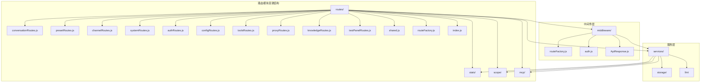
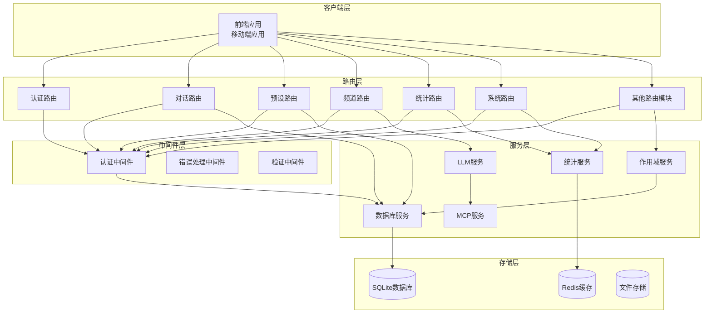
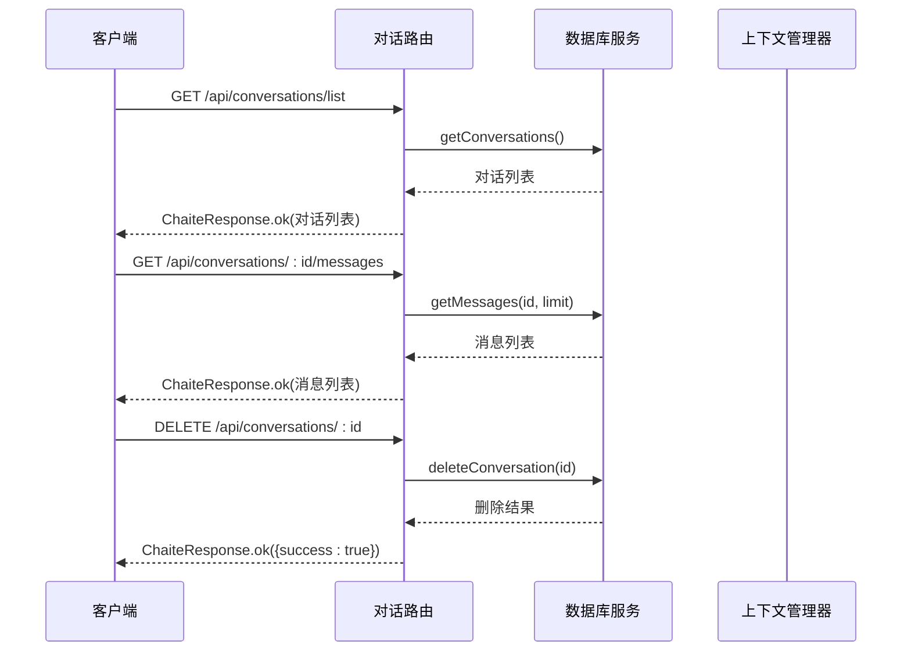
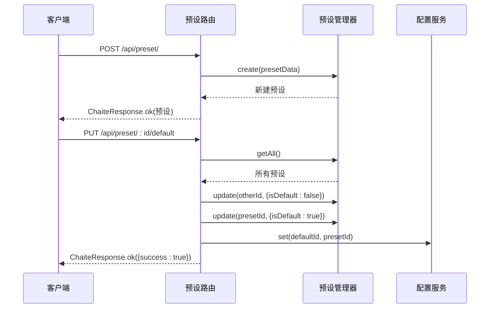
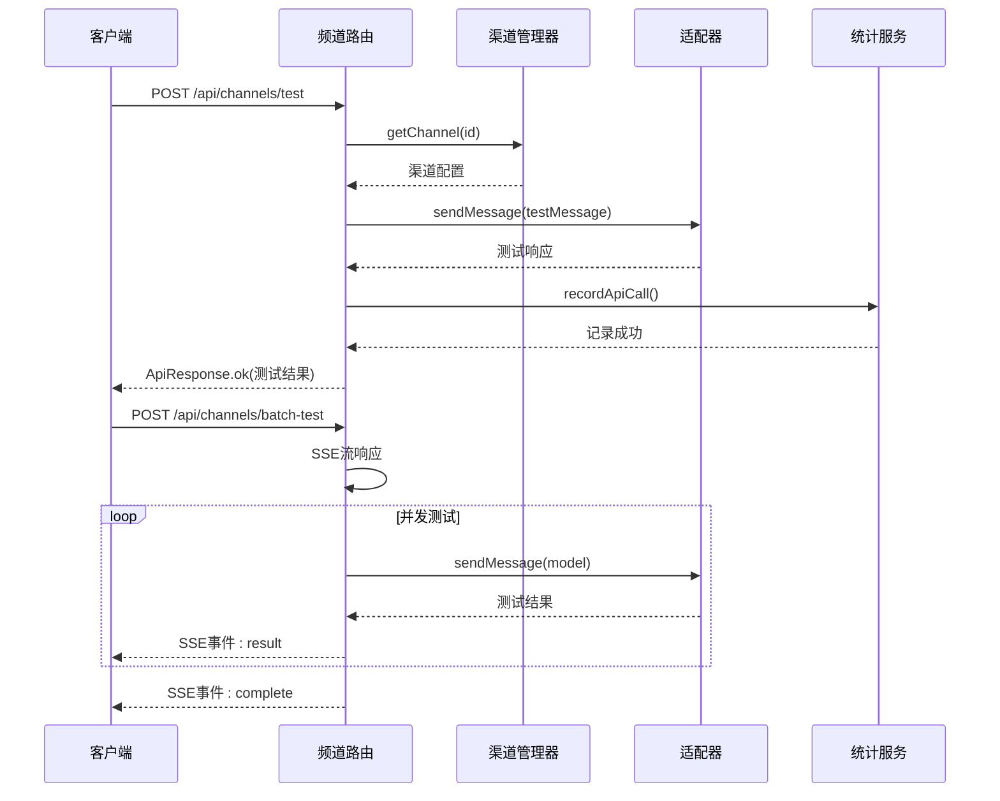
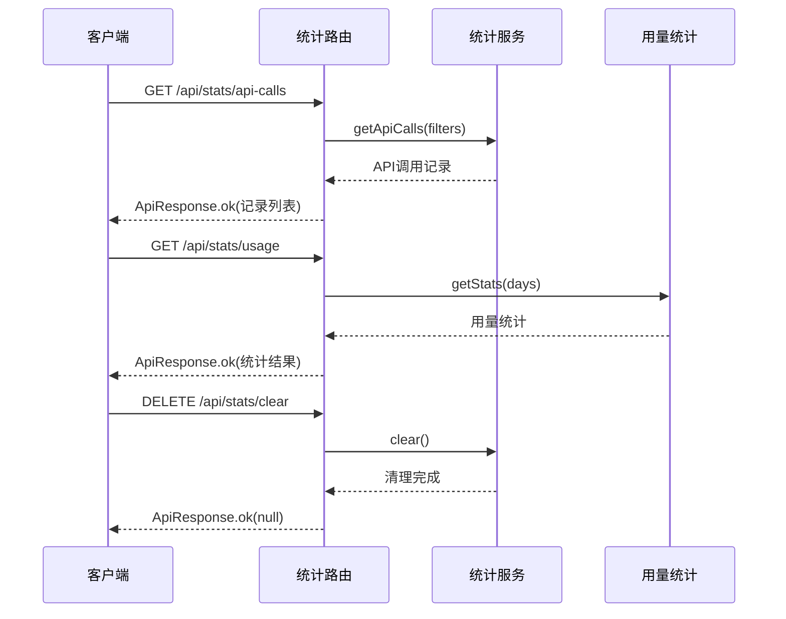
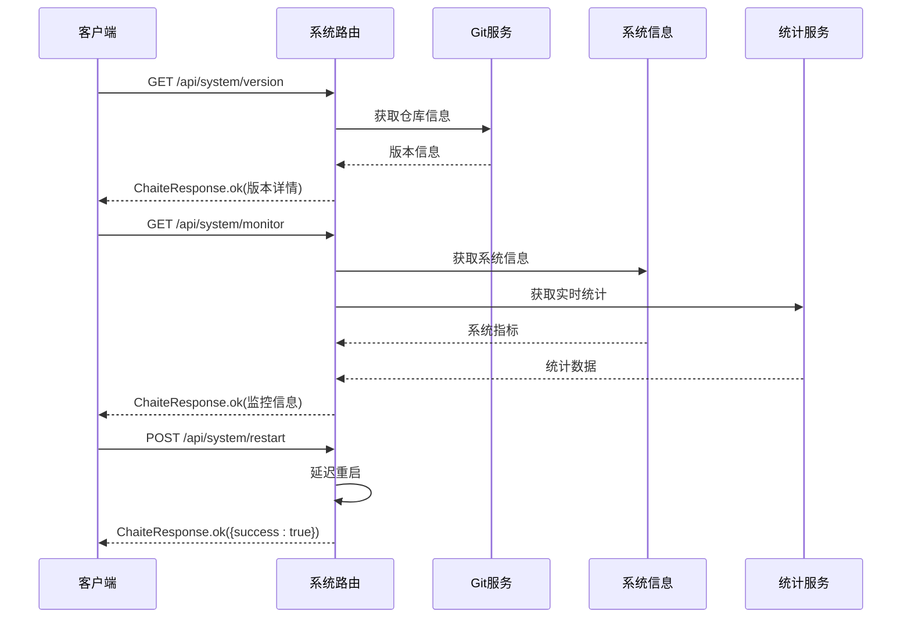
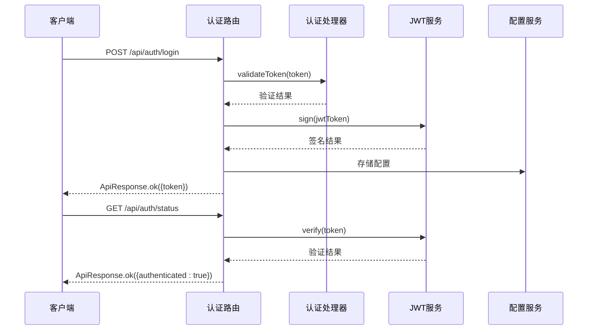

# 路由模块定义

<cite>
**本文档引用的文件**
- [conversationRoutes.js](file://src/services/routes/conversationRoutes.js)
- [presetRoutes.js](file://src/services/routes/presetRoutes.js)
- [channelRoutes.js](file://src/services/routes/channelRoutes.js)
- [statsRoutes.js](file://src/services/routes/statsRoutes.js)
- [systemRoutes.js](file://src/services/routes/systemRoutes.js)
- [routeFactory.js](file://src/services/middleware/routeFactory.js)
- [shared.js](file://src/services/routes/shared.js)
- [index.js](file://src/services/routes/index.js)
- [webServer.js](file://src/services/webServer.js)
- [authRoutes.js](file://src/services/routes/authRoutes.js)
- [configRoutes.js](file://src/services/routes/configRoutes.js)
- [scopeRoutes.js](file://src/services/routes/scopeRoutes.js)
- [toolsRoutes.js](file://src/services/routes/toolsRoutes.js)
- [proxyRoutes.js](file://src/services/routes/proxyRoutes.js)
- [mcpRoutes.js](file://src/services/routes/mcpRoutes.js)
- [knowledgeRoutes.js](file://src/services/routes/knowledgeRoutes.js)
- [testPanelRoutes.js](file://src/services/routes/testPanelRoutes.js)
</cite>

## 目录
1. [简介](#简介)
2. [项目结构](#项目结构)
3. [核心组件](#核心组件)
4. [架构概览](#架构概览)
5. [详细组件分析](#详细组件分析)
6. [依赖分析](#依赖分析)
7. [性能考虑](#性能考虑)
8. [故障排除指南](#故障排除指南)
9. [结论](#结论)

## 简介

ChatAI 插件的路由模块是整个系统的核心接口层，负责处理所有客户端请求并与后端服务进行交互。该路由系统采用模块化设计，将不同功能域的路由分离到独立的模块中，实现了高内聚、低耦合的架构。

路由模块的主要职责包括：
- 提供统一的 API 接口访问点
- 处理请求验证和错误响应
- 管理认证和授权机制
- 协调各业务模块的数据流转
- 提供系统监控和统计功能

## 项目结构

路由模块位于 `src/services/routes/` 目录下，采用按功能域划分的组织方式：

**图表来源**
- [index.js](file://src/services/routes/index.js#L1-L52)
- [webServer.js](file://src/services/webServer.js#L124-L144)

**章节来源**
- [index.js](file://src/services/routes/index.js#L1-L52)
- [webServer.js](file://src/services/webServer.js#L124-L144)

## 核心组件

路由系统由多个核心组件构成，每个组件都有明确的职责分工：

### 认证中间件组件
- **authMiddleware**: 提供统一的 JWT 认证机制
- **createAuthMiddleware**: 工厂函数创建认证中间件
- **FrontendAuthHandler**: 处理前端登录令牌管理

### 响应处理组件
- **ChaiteResponse**: 统一的响应格式封装
- **ApiResponse**: 标准化的 API 响应结构
- **ErrorCodes**: 错误码定义和映射

### 路由工厂组件
- **asyncHandler**: 异步处理函数包装器
- **createCrudRoutes**: 标准 CRUD 路由生成器
- **registerCrudRoutes**: 路由注册工具

**章节来源**
- [shared.js](file://src/services/routes/shared.js#L1-L150)
- [routeFactory.js](file://src/services/middleware/routeFactory.js#L1-L259)
- [authRoutes.js](file://src/services/routes/authRoutes.js#L1-L309)

## 架构概览

路由系统采用分层架构设计，实现了清晰的职责分离：

**图表来源**
- [webServer.js](file://src/services/webServer.js#L339-L537)
- [shared.js](file://src/services/routes/shared.js#L127-L147)

**章节来源**
- [webServer.js](file://src/services/webServer.js#L339-L537)

## 详细组件分析

### 对话路由模块 (conversationRoutes)

对话路由模块负责管理用户的对话历史和上下文信息，提供完整的对话生命周期管理。

#### 核心功能
- **对话列表管理**: 获取所有对话历史
- **消息查询**: 按对话 ID 查询消息记录
- **对话清理**: 清空所有对话数据
- **上下文管理**: 管理活动上下文状态

#### API 接口定义

**图表来源**
- [conversationRoutes.js](file://src/services/routes/conversationRoutes.js#L17-L73)

#### 关键特性
- **异步数据库操作**: 使用延迟初始化确保数据库连接
- **上下文清理**: 支持清理特定用户或所有用户的上下文
- **消息限制**: 支持分页查询消息，默认限制 100 条

**章节来源**
- [conversationRoutes.js](file://src/services/routes/conversationRoutes.js#L1-L118)

### 预设路由模块 (presetRoutes)

预设路由模块管理 AI 模型的预设配置，支持完整的 CRUD 操作和默认预设管理。

#### 核心功能
- **预设 CRUD**: 创建、读取、更新、删除预设
- **默认预设**: 管理默认预设和切换逻辑
- **内置预设**: 支持从内置预设创建自定义预设
- **预设构建**: 动态构建系统提示词

#### API 接口定义

**图表来源**
- [presetRoutes.js](file://src/services/routes/presetRoutes.js#L117-L142)

#### 关键特性
- **默认预设一致性**: 自动维护只有一个默认预设的状态
- **内置预设集成**: 支持从内置预设创建自定义预设
- **配置持久化**: 默认预设变更会同步更新配置文件

**章节来源**
- [presetRoutes.js](file://src/services/routes/presetRoutes.js#L1-L251)

### 频道路由模块 (channelRoutes)

频道路由模块管理各种 AI 服务提供商的接入配置，提供完整的渠道生命周期管理。

#### 核心功能
- **渠道 CRUD**: 创建、读取、更新、删除渠道
- **渠道测试**: 支持单个和批量渠道测试
- **模型管理**: 获取和管理可用模型列表
- **健康检查**: 监控渠道状态和性能

#### API 接口定义

**图表来源**
- [channelRoutes.js](file://src/services/routes/channelRoutes.js#L97-L288)

#### 关键特性
- **多适配器支持**: 支持 OpenAI、Claude、Gemini 等多种适配器
- **并发测试**: 支持批量模型测试和实时进度反馈
- **智能重定向**: 支持模型映射和重定向功能
- **SSE 实时通信**: 使用 Server-Sent Events 提供实时测试进度

**章节来源**
- [channelRoutes.js](file://src/services/routes/channelRoutes.js#L1-L535)

### 统计路由模块 (statsRoutes)

统计路由模块提供系统运行时的各种统计数据查询接口。

#### 核心功能
- **概览统计**: 系统整体运行统计
- **API 调用记录**: 详细的 API 调用历史
- **渠道统计**: 各渠道使用情况统计
- **模型统计**: 模型使用频率统计
- **用量统计**: 令牌使用量统计

#### API 接口定义

**图表来源**
- [statsRoutes.js](file://src/services/routes/statsRoutes.js#L18-L98)

#### 关键特性
- **灵活查询**: 支持时间范围、渠道、成功状态等多维度筛选
- **分页支持**: API 调用记录支持分页查询
- **实时统计**: 提供实时的 RPM（每分钟请求）统计
- **多粒度统计**: 支持天级、周级、月级等多种统计粒度

**章节来源**
- [statsRoutes.js](file://src/services/routes/statsRoutes.js#L1-L98)

### 系统路由模块 (systemRoutes)

系统路由模块提供系统健康检查、版本管理和配置信息查询功能。

#### 核心功能
- **健康检查**: 系统运行状态监控
- **版本信息**: Git 仓库版本和分支信息
- **性能指标**: CPU、内存、系统负载等指标
- **系统信息**: 基础系统配置和统计信息
- **统计管理**: 系统统计的重置和清理

#### API 接口定义

**图表来源**
- [systemRoutes.js](file://src/services/routes/systemRoutes.js#L24-L590)

#### 关键特性
- **Git 集成**: 自动检测插件版本类型（内测版/公开版）
- **实时监控**: 提供内存使用、RPM、成功率等实时指标
- **灵活重启**: 支持完整重启和仅重载 WebServer
- **端口管理**: 支持端口释放和热重载功能

**章节来源**
- [systemRoutes.js](file://src/services/routes/systemRoutes.js#L1-L590)

### 认证路由模块 (authRoutes)

认证路由模块提供完整的用户认证和授权机制。

#### 核心功能
- **JWT 认证**: 基于 JSON Web Token 的认证机制
- **临时令牌**: 支持短期有效的临时登录令牌
- **永久令牌**: 支持长期有效的永久登录令牌
- **客户端指纹**: 支持基于客户端指纹的安全验证

#### API 接口定义

**图表来源**
- [authRoutes.js](file://src/services/routes/authRoutes.js#L211-L296)

#### 关键特性
- **多令牌支持**: 同时支持临时令牌和永久令牌
- **指纹绑定**: 支持客户端指纹绑定增强安全性
- **配置持久化**: JWT 密钥和认证配置持久化存储
- **安全验证**: 多层安全验证机制

**章节来源**
- [authRoutes.js](file://src/services/routes/authRoutes.js#L1-L309)

## 依赖分析

路由模块之间的依赖关系体现了清晰的分层架构：

```mermaid
graph TB
subgraph "路由层依赖关系"
AuthRoutes[authRoutes.js] --> Shared[shared.js]
AuthRoutes --> Config[config.js]
ConversationRoutes[conversationRoutes.js] --> Shared[shared.js]
ConversationRoutes --> Database[DatabaseService.js]
ConversationRoutes --> ContextManager[ContextManager.js]
PresetRoutes[presetRoutes.js] --> Shared[shared.js]
PresetRoutes --> PresetManager[PresetManager.js]
PresetRoutes --> Config[config.js]
ChannelRoutes[channelRoutes.js] --> Shared[shared.js]
ChannelRoutes --> ChannelManager[ChannelManager.js]
ChannelRoutes --> StatsService[StatsService.js]
StatsRoutes[statsRoutes.js] --> Shared[shared.js]
StatsRoutes --> StatsService[StatsService.js]
StatsRoutes --> UsageStats[UsageStats.js]
SystemRoutes[systemRoutes.js] --> Shared[shared.js]
SystemRoutes --> StatsService[StatsService.js]
SystemRoutes --> UsageStats[UsageStats.js]
OtherRoutes[otherRoutes.js] --> Shared[shared.js]
OtherRoutes --> Services[services/]
end
subgraph "共享组件"
Shared[shared.js] --> Database[DatabaseService.js]
Shared --> Logger[logger.js]
Shared --> ErrorCodes[错误码定义]
end
subgraph "外部依赖"
Express[express.js]
JWT[jsonwebtoken]
BetterSQLite[better-sqlite3]
Redis[redis]
end
AuthRoutes --> Express
ConversationRoutes --> Express
PresetRoutes --> Express
ChannelRoutes --> Express
StatsRoutes --> Express
SystemRoutes --> Express
OtherRoutes --> Express
Shared --> BetterSQLite
Shared --> Redis
AuthRoutes --> JWT
```

**图表来源**
- [index.js](file://src/services/routes/index.js#L1-L52)
- [shared.js](file://src/services/routes/shared.js#L5-L147)

**章节来源**
- [index.js](file://src/services/routes/index.js#L1-L52)
- [shared.js](file://src/services/routes/shared.js#L1-L150)

## 性能考虑

路由模块在设计时充分考虑了性能优化：

### 缓存策略
- **数据库连接池**: 使用延迟初始化避免不必要的数据库连接
- **配置缓存**: 配置服务提供内存缓存机制
- **统计缓存**: 使用 Redis 缓存高频访问的统计数据

### 并发处理
- **异步操作**: 所有路由处理都是异步的，避免阻塞
- **并发限制**: 渠道测试支持并发控制，防止资源耗尽
- **流式响应**: 使用 SSE 提供实时数据传输

### 内存管理
- **垃圾回收**: 及时清理临时对象和缓存
- **连接复用**: 复用数据库和外部服务连接
- **资源监控**: 定期检查内存使用情况

## 故障排除指南

### 常见问题及解决方案

#### 认证失败
**问题**: 401 未授权错误
**原因**: Token 过期或无效
**解决**: 
1. 检查 Token 是否过期
2. 验证 JWT 密钥配置
3. 确认客户端指纹匹配

#### 数据库连接错误
**问题**: 数据库操作失败
**原因**: 数据库连接异常或配置错误
**解决**:
1. 检查数据库文件权限
2. 验证数据库连接配置
3. 重启数据库服务

#### 渠道测试失败
**问题**: 渠道测试返回错误
**原因**: API 密钥无效或网络问题
**解决**:
1. 验证 API 密钥配置
2. 检查网络连接
3. 查看详细的错误日志

#### 性能问题
**问题**: 接口响应缓慢
**原因**: 数据库查询复杂或外部服务响应慢
**解决**:
1. 优化数据库查询
2. 启用缓存机制
3. 检查外部服务状态

**章节来源**
- [authRoutes.js](file://src/services/routes/authRoutes.js#L128-L155)
- [shared.js](file://src/services/routes/shared.js#L71-L90)

## 结论

ChatAI 插件的路由模块展现了优秀的软件工程实践，通过模块化设计实现了高度的可维护性和扩展性。各个路由模块职责明确，相互之间依赖关系清晰，形成了一个完整的 API 生态系统。

主要优势包括：
- **模块化设计**: 按功能域划分路由，便于维护和扩展
- **统一响应格式**: 标准化的响应结构提高了 API 的一致性
- **完善的错误处理**: 全面的错误码定义和错误处理机制
- **安全认证**: 多层次的安全认证和授权机制
- **性能优化**: 考虑了并发处理和资源管理的性能优化

未来可以考虑的改进方向：
- 增加 API 文档自动生成
- 实现更细粒度的权限控制
- 添加更多的监控和告警机制
- 优化大规模数据的查询性能