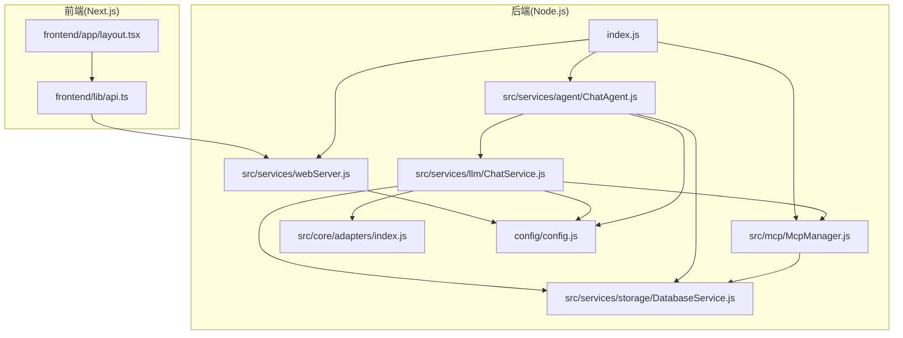
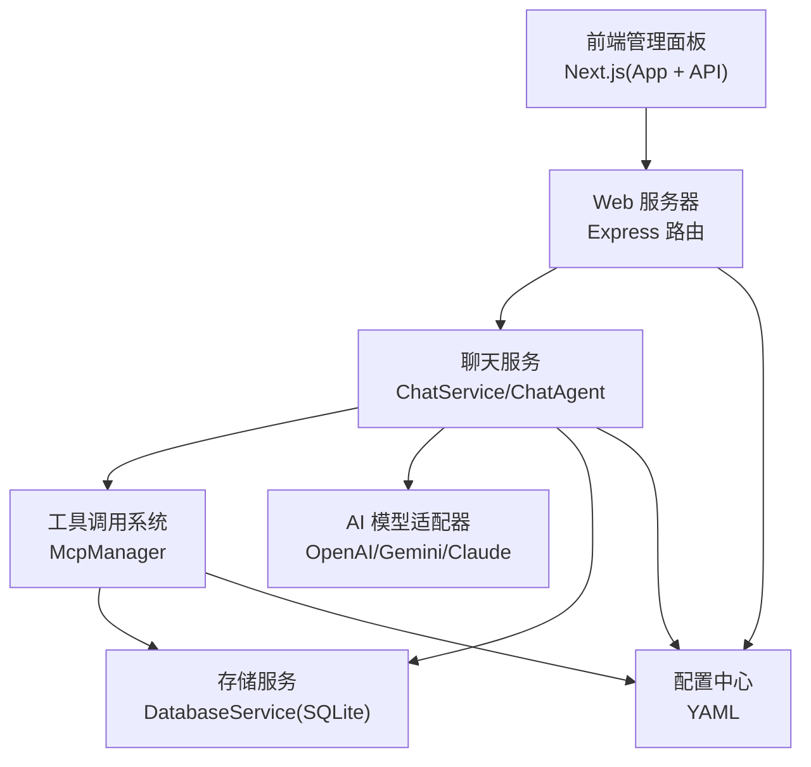
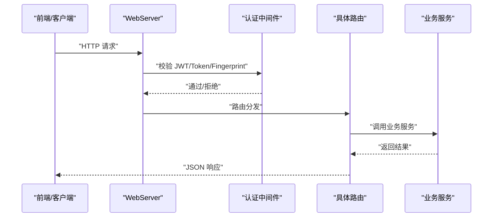
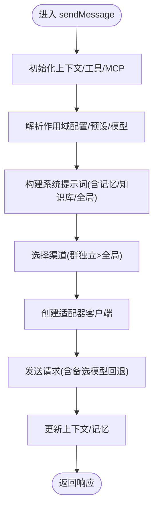
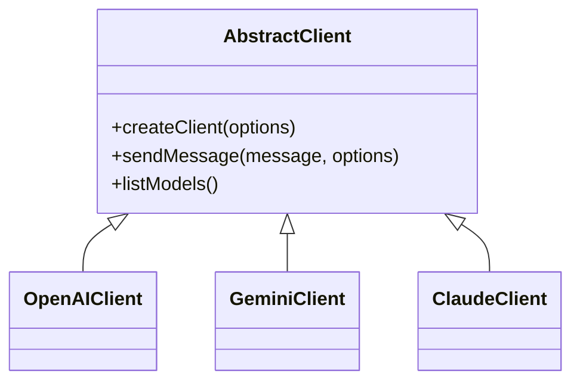
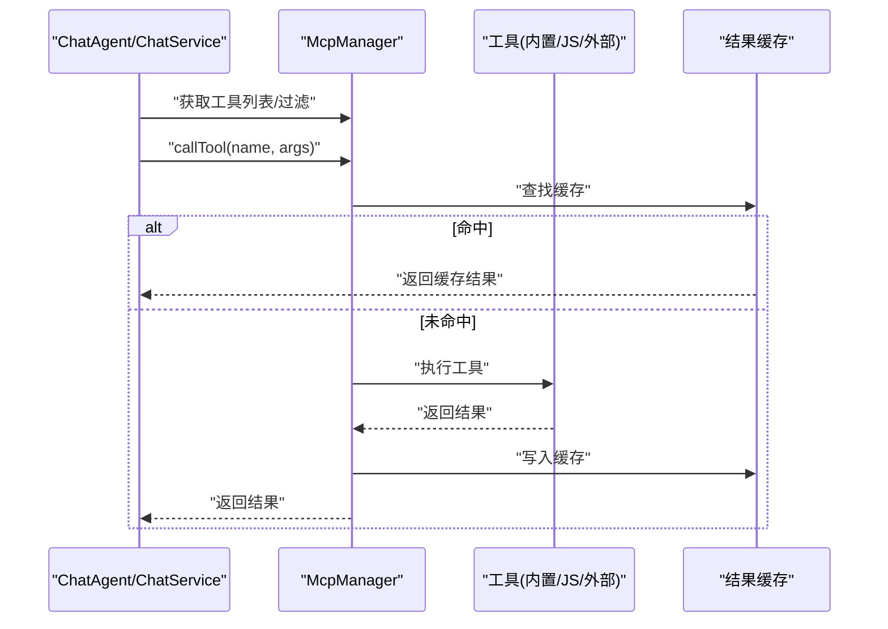
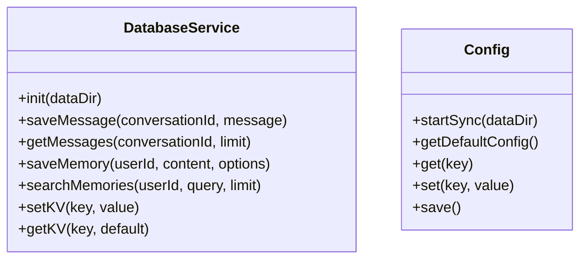
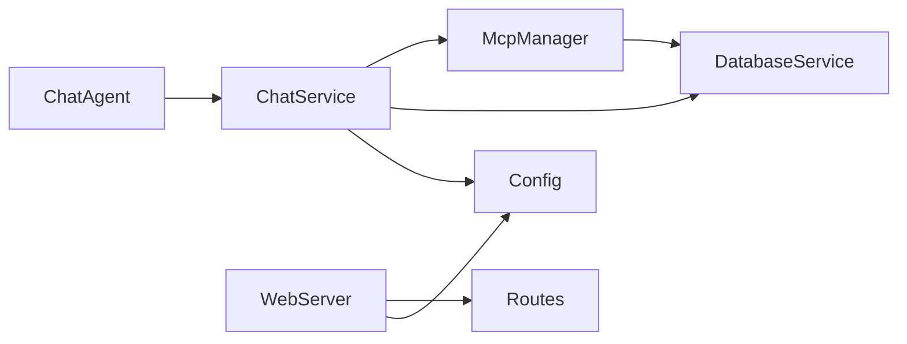

# 核心架构

## 目录
1. [引言](#引言)
2. [项目结构](#项目结构)
3. [核心组件](#核心组件)
4. [架构总览](#架构总览)
5. [详细组件分析](#详细组件分析)
6. [依赖关系分析](#依赖关系分析)
7. [性能考量](#性能考量)
8. [故障排查指南](#故障排查指南)
9. [结论](#结论)
10. [附录](#附录)

## 引言
本架构文档面向 ChatAI 插件，系统性阐述其整体设计与实现方式，重点覆盖以下方面：
- 分层架构模式与模块化设计原则
- 核心模块职责划分：Web 服务器、聊天服务、AI 模型适配器、工具调用系统等
- 组件间交互关系与数据流
- 设计决策与技术选型原因
- 可扩展性设计与新增 AI 模型/工具的接入方式
- 为开发者提供的系统内部机制理解指南

## 项目结构
项目采用前后端分离与模块化组织相结合的结构：
- 后端核心位于 src 目录，按领域拆分为服务层、适配器层、工具与 MCP 管理、存储与配置等子模块
- 前端基于 Next.js 14 应用，位于 frontend 目录，提供管理面板界面与 API 客户端封装
- 配置集中于 config 目录，使用 YAML 管理运行时参数
- 插件入口 index.js 负责初始化、并发启动与全局暴露能力

**图表来源**
- [index.js](file://index.js#L1-L258)
- [webServer.js](file://src/services/webServer.js#L1-L807)
- [ChatService.js](file://src/services/llm/ChatService.js#L1-L800)
- [ChatAgent.js](file://src/services/agent/ChatAgent.js#L1-L800)
- [McpManager.js](file://src/mcp/McpManager.js#L1-L800)
- [DatabaseService.js](file://src/services/storage/DatabaseService.js#L1-L809)
- [config.js](file://config/config.js#L1-L631)
- [layout.tsx](file://frontend/app/layout.tsx#L1-L27)
- [api.ts](file://frontend/lib/api.ts#L1-L473)

**章节来源**
- [index.js](file://index.js#L1-L258)
- [package.json](file://package.json#L1-L53)

## 核心组件
- 插件入口与初始化
  - 并发初始化 Segment、Web 服务器、遥测、技能代理、应用模块等，统一输出加载统计与公告
  - 暴露 skills 与 apps 能力，支持动态技能执行与工具管理
- Web 服务器
  - 基于 Express，提供认证、CORS、静态资源托管、路由注册与健康检查
  - 支持 TRSS 环境共享端口与挂载路径，具备登录链接生成与重载能力
- 聊天服务
  - ChatService：统一消息处理流程，负责上下文构建、预设与系统提示词、工具调用、渠道选择、错误清理等
  - ChatAgent：面向业务的代理封装，提供便捷的聊天与消息发送接口，支持备选模型回退
- AI 模型适配器
  - 适配器抽象与多厂商适配（OpenAI、Gemini、Claude），统一转换器与类型定义
- 工具调用系统
  - McpManager：统一管理内置工具、自定义 JS 工具、外部 MCP 服务器，提供工具发现、调用、缓存与日志
- 存储与配置
  - DatabaseService：SQLite 存储消息、记忆、键值等，提供去重、索引与统计
  - Config：YAML 配置中心，支持深合并、默认值与运行时更新

**章节来源**
- [index.js](file://index.js#L17-L181)
- [webServer.js](file://src/services/webServer.js#L279-L757)
- [ChatService.js](file://src/services/llm/ChatService.js#L46-L110)
- [ChatAgent.js](file://src/services/agent/ChatAgent.js#L42-L90)
- [McpManager.js](file://src/mcp/McpManager.js#L27-L139)
- [DatabaseService.js](file://src/services/storage/DatabaseService.js#L19-L45)
- [config.js](file://config/config.js#L8-L631)

## 架构总览
系统采用“前端管理面板 + 后端服务层”的双层架构：
- 前端 Next.js 应用通过 axios 封装的 API 客户端与后端交互，提供配置、工具、MCP、会话、统计等管理能力
- 后端以 Express 作为 Web 层，向上提供 REST API；业务层由 ChatService/ChatAgent 组织，底层通过适配器对接多厂商模型，工具链由 McpManager 统一调度，数据持久化由 DatabaseService 提供

**图表来源**
- [layout.tsx](file://frontend/app/layout.tsx#L1-L27)
- [api.ts](file://frontend/lib/api.ts#L1-L473)
- [webServer.js](file://src/services/webServer.js#L124-L144)
- [ChatService.js](file://src/services/llm/ChatService.js#L1-L800)
- [ChatAgent.js](file://src/services/agent/ChatAgent.js#L1-L800)
- [McpManager.js](file://src/mcp/McpManager.js#L1-L800)
- [DatabaseService.js](file://src/services/storage/DatabaseService.js#L1-L809)
- [config.js](file://config/config.js#L1-L631)

## 详细组件分析

### Web 服务器组件分析
- 职责
  - 提供认证与授权（JWT、Token、指纹绑定）、CORS、静态资源托管
  - 注册各类 API 路由（系统、配置、工具、MCP、知识库、图像、日志、内存、群管、技能等）
  - 支持 TRSS 环境共享端口与挂载路径，生成登录链接，健康检查与重载
- 关键特性
  - 请求签名验证、时间戳校验、防重放
  - 登录态管理：一次性临时 Token、永久 Token、指纹绑定
  - 地址探测：本地/公网 IPv4/IPv6 地址自动识别
- 可扩展点
  - 新增路由：在 routes/index.js 中注册，WebServer 统一挂载
  - 认证扩展：可替换鉴权策略或引入第三方认证

**图表来源**
- [webServer.js](file://src/services/webServer.js#L313-L337)
- [webServer.js](file://src/services/webServer.js#L509-L537)

**章节来源**
- [webServer.js](file://src/services/webServer.js#L156-L278)
- [webServer.js](file://src/services/webServer.js#L279-L757)

### 聊天服务组件分析
- 职责
  - 统一处理用户消息，构建系统提示词与上下文，选择渠道与模型，执行工具调用，记录统计与错误清理
  - 支持群聊共享上下文、私聊隔离、记忆与知识库增强、前缀人格与全局提示词模式
- 关键流程
  - 作用域配置解析（群/用户/全局），预设与模型选择，工具加载与过滤
  - 渠道选择（群独立 > 全局），客户端创建与请求参数组装
  - 请求发送与回退（备选模型轮询），上下文更新与记忆提取
- 可扩展点
  - 新增模型：在适配器层扩展，注册转换器与类型
  - 新增工具：通过 McpManager 管理，支持内置、自定义 JS 与外部 MCP

**图表来源**
- [ChatService.js](file://src/services/llm/ChatService.js#L115-L521)
- [ChatService.js](file://src/services/llm/ChatService.js#L522-L800)

**章节来源**
- [ChatService.js](file://src/services/llm/ChatService.js#L46-L110)
- [ChatService.js](file://src/services/llm/ChatService.js#L115-L800)

### AI 模型适配器组件分析
- 职责
  - 抽象统一的客户端接口，屏蔽不同厂商 API 的差异
  - 提供转换器与类型定义，支持工具调用与媒体预处理
- 设计要点
  - 适配器工厂与注册机制，便于扩展新厂商
  - 转换器双向映射（输入/输出），保证与上游/下游格式兼容
- 可扩展点
  - 新增适配器：实现 AbstractClient 接口，注册转换器
  - 新增模型族：在适配器内扩展支持的模型列表与参数映射

**图表来源**
- [index.js](file://src/core/adapters/index.js#L1-L24)

**章节来源**
- [index.js](file://src/core/adapters/index.js#L1-L24)

### 工具调用系统组件分析
- 职责
  - 管理内置工具、自定义 JS 工具与外部 MCP 服务器，提供工具发现、调用、缓存与日志
  - 支持危险工具拦截、白名单/黑名单过滤、文件监听与热重载
- 关键流程
  - 初始化内置与自定义工具服务器，加载外部 MCP 服务器配置
  - 工具调用时进行安全检查与缓存命中，支持结果缓存与 TTL
  - 提供工具统计、日志与服务器管理（增删改连）

**图表来源**
- [McpManager.js](file://src/mcp/McpManager.js#L106-L139)
- [McpManager.js](file://src/mcp/McpManager.js#L717-L800)

**章节来源**
- [McpManager.js](file://src/mcp/McpManager.js#L27-L139)
- [McpManager.js](file://src/mcp/McpManager.js#L717-L800)

### 存储与配置组件分析
- DatabaseService
  - SQLite 数据库存储消息、记忆、键值等，WAL 模式提升并发
  - 提供去重、索引、搜索、统计与清理能力
- Config
  - YAML 配置中心，支持深合并与默认值，提供 get/set/save
  - 覆盖聊天、工具、MCP、渠道、上下文、记忆、代理、触发等大量配置项

**图表来源**
- [DatabaseService.js](file://src/services/storage/DatabaseService.js#L19-L809)
- [config.js](file://config/config.js#L8-L631)

**章节来源**
- [DatabaseService.js](file://src/services/storage/DatabaseService.js#L19-L809)
- [config.js](file://config/config.js#L8-L631)

## 依赖关系分析
- 模块耦合
  - ChatService/ChatAgent 依赖 McpManager、LlmService、ContextManager、PresetManager、MemoryManager、KnowledgeService、ScopeManager、DatabaseService
  - WebServer 依赖路由集合、Auth 中间件、SchedulerService
  - McpManager 依赖 BuiltinMcpServer、McpClient、配置与数据目录
- 外部依赖
  - Express、JWT、Redis、better-sqlite3、axios、yaml 等
- 循环依赖
  - 通过延迟导入与模块化拆分避免循环依赖（例如 ChatService 动态导入历史与记忆模块）

**图表来源**
- [ChatService.js](file://src/services/llm/ChatService.js#L1-L30)
- [ChatAgent.js](file://src/services/agent/ChatAgent.js#L1-L27)
- [McpManager.js](file://src/mcp/McpManager.js#L1-L12)
- [webServer.js](file://src/services/webServer.js#L124-L144)
- [config.js](file://config/config.js#L1-L631)

**章节来源**
- [package.json](file://package.json#L16-L46)

## 性能考量
- 并发初始化与启动
  - 插件入口并发启动 Web 服务器、遥测、技能代理等，缩短启动时间
- 存储优化
  - SQLite 使用 WAL 模式，消息表建立索引，减少查询延迟
  - 消息去重与内容哈希，避免重复写入
- 工具调用缓存
  - McpManager 提供工具结果缓存与 TTL，降低重复调用成本
- 流式与回退
  - ChatAgent 支持备选模型轮询与流式响应，提升稳定性与体验

## 故障排查指南
- 认证失败
  - 检查 JWT 签发与校验、Token 是否过期、指纹绑定是否一致
- 渠道不可用
  - 查看渠道配置、Key 有效性、代理设置与网络连通性
- 工具调用异常
  - 检查危险工具拦截、白名单/黑名单、缓存与日志
- 数据异常
  - 检查 SQLite 文件权限、WAL 日志、消息去重策略与索引

**章节来源**
- [webServer.js](file://src/services/webServer.js#L313-L337)
- [McpManager.js](file://src/mcp/McpManager.js#L752-L767)
- [DatabaseService.js](file://src/services/storage/DatabaseService.js#L263-L327)

## 结论
本架构以模块化与分层为核心，结合适配器与工具系统，实现了对多厂商模型与工具生态的统一接入。前端管理面板与后端服务解耦清晰，具备良好的可扩展性与可维护性。通过配置中心、存储与认证体系，系统在易用性与稳定性之间取得平衡。

## 附录
- 新增 AI 模型接入步骤
  - 在适配器层新增厂商客户端与转换器
  - 在适配器导出中注册新适配器
  - 在配置中新增渠道与模型映射
- 新增工具接入步骤
  - 在 data/tools 下编写自定义 JS 工具或连接外部 MCP 服务器
  - 通过管理面板启用/禁用与分类管理
  - 如需危险工具，配置允许策略并谨慎启用
