# 动态加载机制

<cite>
**本文档引用的文件**
- [index.js](file://index.js)
- [apps/chat.js](file://apps/chat.js)
- [apps/Commands.js](file://apps/Commands.js)
- [apps/Management.js](file://apps/Management.js)
- [apps/bym.js](file://apps/bym.js)
- [apps/Update.js](file://apps/Update.js)
- [src/services/agent/index.js](file://src/services/agent/index.js)
- [src/services/agent/SkillsAgent.js](file://src/services/agent/SkillsAgent.js)
- [src/services/webServer.js](file://src/services/webServer.js)
- [src/mcp/McpManager.js](file://src/mcp/McpManager.js)
- [config/config.js](file://config/config.js)
- [package.json](file://package.json)
</cite>

## 目录
1. [简介](#简介)
2. [项目结构](#项目结构)
3. [核心组件](#核心组件)
4. [架构概览](#架构概览)
5. [详细组件分析](#详细组件分析)
6. [依赖分析](#依赖分析)
7. [性能考虑](#性能考虑)
8. [故障排除指南](#故障排除指南)
9. [结论](#结论)

## 简介

ChatAI 插件采用先进的动态加载机制，在运行时自动扫描和导入 apps 目录中的 JavaScript 模块。该机制实现了模块化的插件架构，支持热插拔、并发加载和智能错误处理。本文档深入解析了动态加载的完整流程，包括文件系统扫描逻辑、模块导入策略、错误处理机制以及性能优化方案。

## 项目结构

ChatAI 插件采用模块化架构设计，主要目录结构如下：

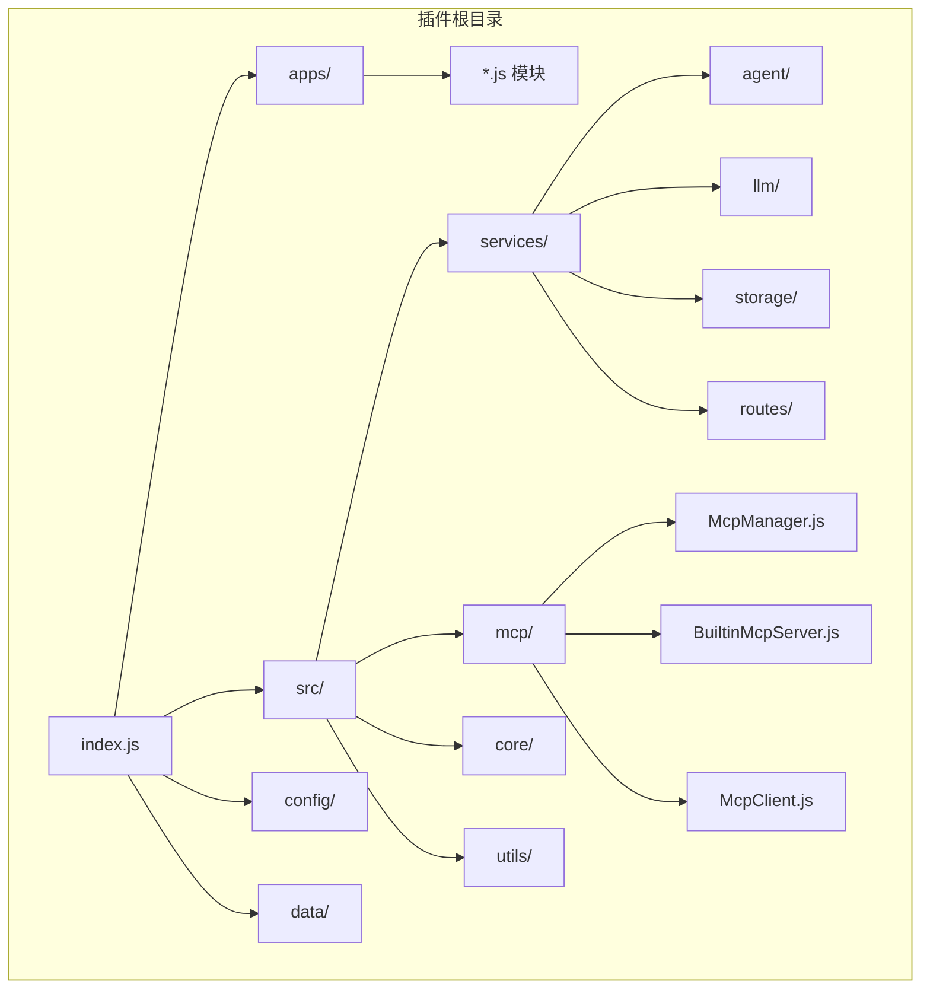

**图表来源**
- [index.js](file://index.js#L1-L258)
- [package.json](file://package.json#L1-L53)

**章节来源**
- [index.js](file://index.js#L1-L258)
- [package.json](file://package.json#L1-L53)

## 核心组件

### 应用程序加载器

应用程序加载器是动态加载机制的核心组件，负责扫描和导入 apps 目录中的模块：

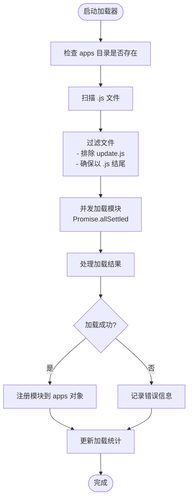

**图表来源**
- [index.js](file://index.js#L114-L136)

### 模块注册系统

加载器将成功导入的模块注册到全局 apps 对象中：

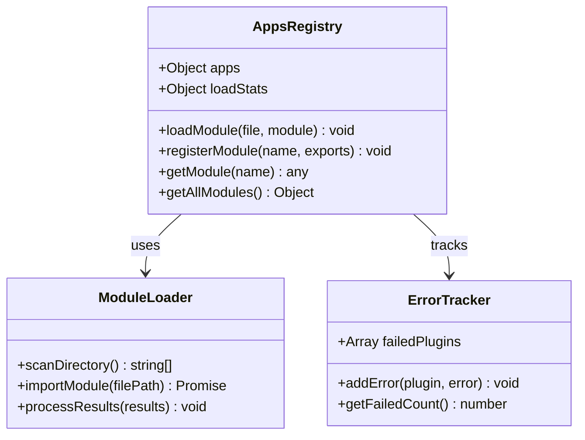

**图表来源**
- [index.js](file://index.js#L114-L136)

**章节来源**
- [index.js](file://index.js#L114-L136)

## 架构概览

动态加载机制的整体架构采用异步并发模式，确保高效的模块加载：

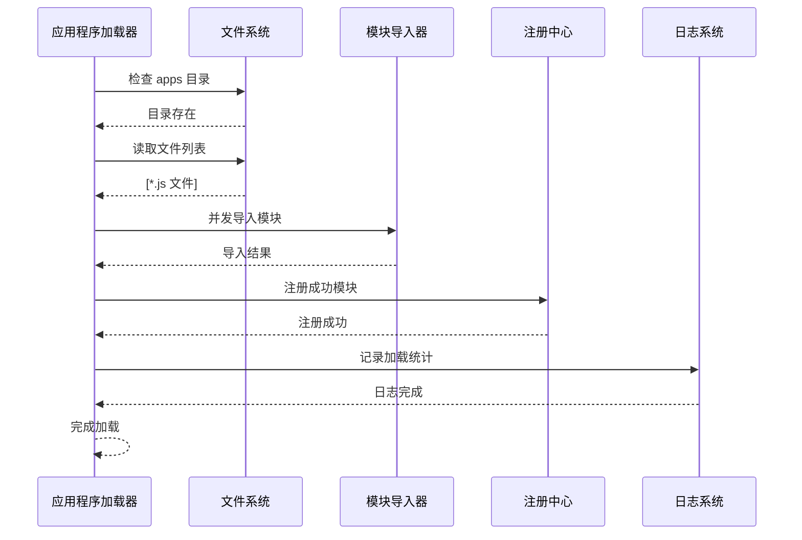

**图表来源**
- [index.js](file://index.js#L117-L122)

**章节来源**
- [index.js](file://index.js#L117-L122)

## 详细组件分析

### 文件系统扫描逻辑

应用程序加载器实现了智能的文件系统扫描机制：

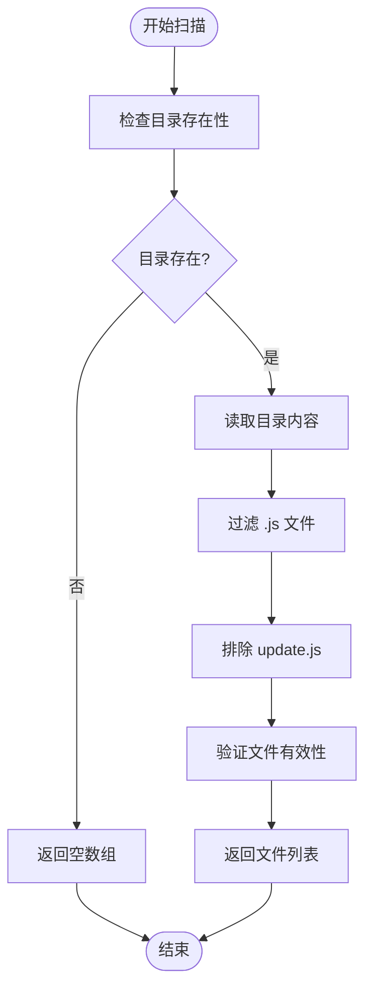

**图表来源**
- [index.js](file://index.js#L117-L121)

#### 文件过滤策略

加载器采用多层过滤策略确保模块质量：

1. **扩展名过滤**: 确保只加载 `.js` 文件
2. **排除策略**: 自动排除 `update.js` 文件
3. **有效性验证**: 检查文件是否可导入

**章节来源**
- [index.js](file://index.js#L117-L121)

### 模块导入策略

采用并发导入策略提升加载效率：

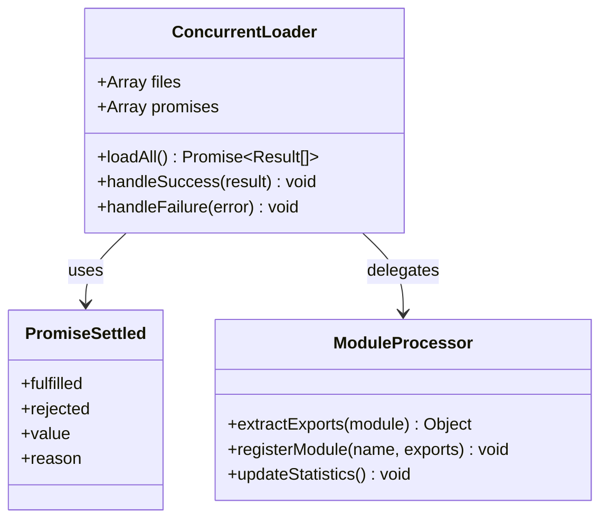

**图表来源**
- [index.js](file://index.js#L117-L121)

#### 并发控制机制

使用 `Promise.allSettled` 实现优雅的并发控制：

- **并行加载**: 所有模块同时导入
- **错误隔离**: 单个模块失败不影响其他模块
- **结果聚合**: 统一处理成功和失败的结果

**章节来源**
- [index.js](file://index.js#L117-L121)

### 错误处理机制

实现了多层次的错误处理策略：

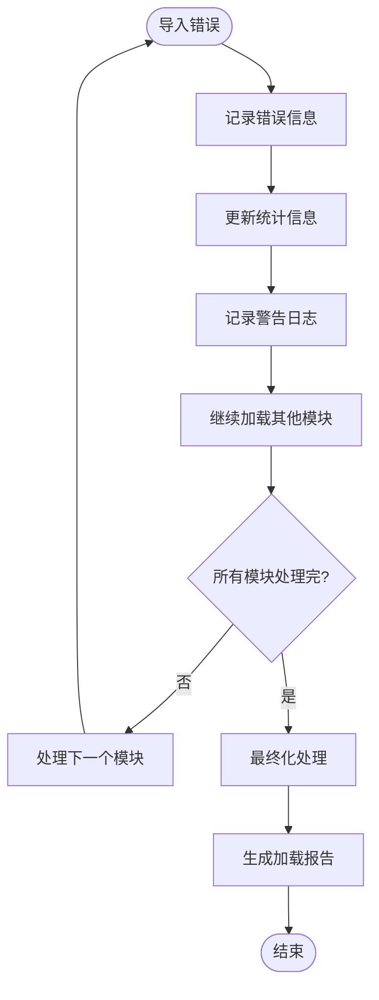

**图表来源**
- [index.js](file://index.js#L131-L135)

#### 错误恢复策略

1. **模块级错误**: 单个模块失败不影响整体加载
2. **统计追踪**: 记录失败模块的详细信息
3. **日志记录**: 提供完整的错误上下文

**章节来源**
- [index.js](file://index.js#L131-L135)

### 模块生命周期管理

每个加载的模块都遵循标准的生命周期：

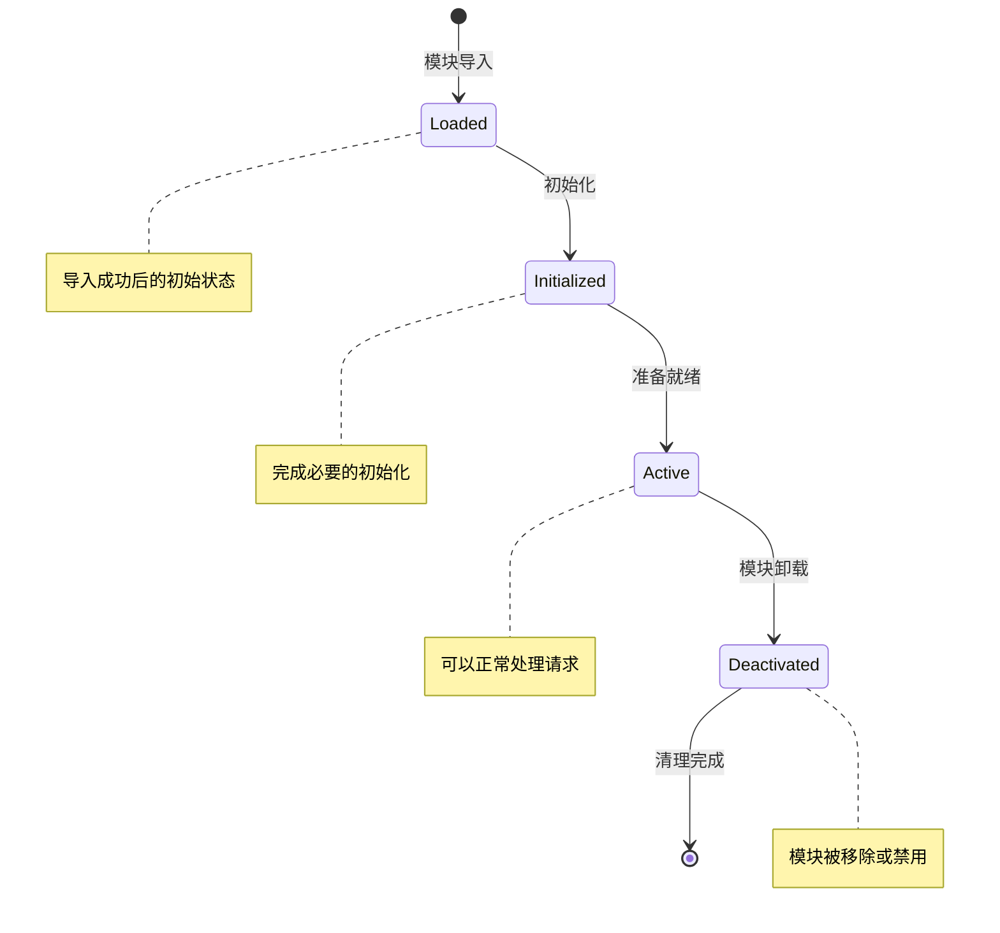

**图表来源**
- [index.js](file://index.js#L114-L136)

**章节来源**
- [index.js](file://index.js#L114-L136)

### 模块依赖解析

动态加载机制支持模块间的依赖关系：

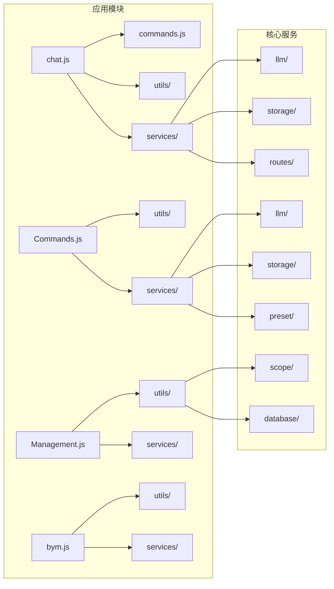

**图表来源**
- [apps/chat.js](file://apps/chat.js#L1-L25)
- [apps/Commands.js](file://apps/Commands.js#L1-L17)
- [apps/Management.js](file://apps/Management.js#L1-L11)

**章节来源**
- [apps/chat.js](file://apps/chat.js#L1-L25)
- [apps/Commands.js](file://apps/Commands.js#L1-L17)
- [apps/Management.js](file://apps/Management.js#L1-L11)

## 依赖分析

### 外部依赖关系

```mermaid
graph TB
subgraph "核心依赖"
A[node:fs] --> B[文件系统操作]
C[node:path] --> D[路径处理]
E[node:url] --> F[URL转换]
G[express] --> H[Web服务器]
I[yaml] --> J[配置解析]
end
subgraph "业务依赖"
K[icqq/oicq] --> L[消息处理]
M[axios] --> N[HTTP请求]
O[jsonwebtoken] --> P[JWT认证]
Q[better-sqlite3] --> R[数据库]
S[ioredis] --> T[缓存]
end
subgraph "AI服务"
U[openai] --> V[GPT模型]
W[@anthropic-ai/sdk] --> X[Claude模型]
Y[@google/generative-ai] --> Z[Gemini模型]
end
```

**图表来源**
- [package.json](file://package.json#L16-L45)

### 内部模块依赖

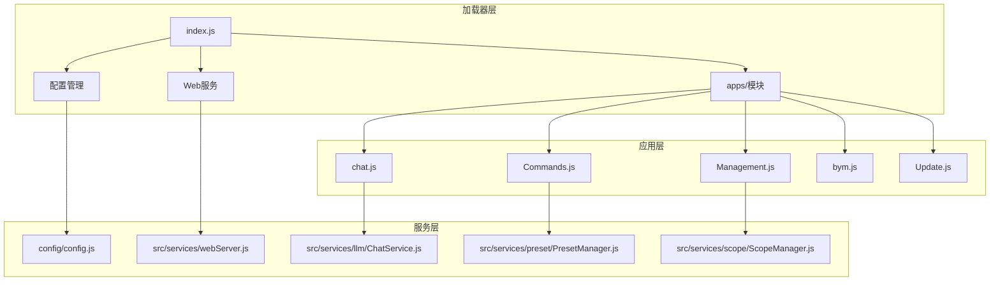

**图表来源**
- [index.js](file://index.js#L1-L258)
- [config/config.js](file://config/config.js#L1-L631)

**章节来源**
- [package.json](file://package.json#L16-L45)
- [index.js](file://index.js#L1-L258)

## 性能考虑

### 并发加载优化

动态加载机制采用了多项性能优化策略：

1. **并行导入**: 使用 `Promise.allSettled` 实现并发模块导入
2. **智能缓存**: 模块导入结果的内存缓存
3. **渐进式初始化**: 支持模块的延迟初始化

### 内存管理

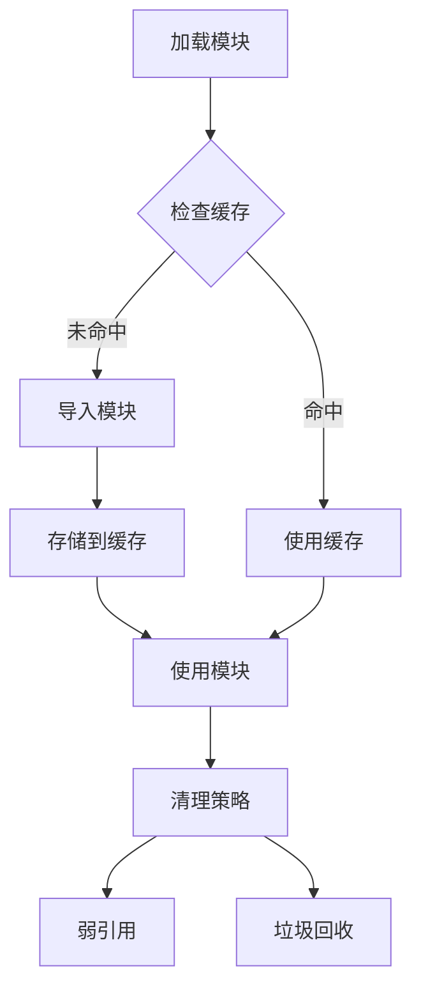

### 加载统计与监控

系统提供了详细的加载统计信息：

| 统计项 | 描述 | 默认值 |
|--------|------|--------|
| 模块数量 | 成功加载的模块总数 | 0 |
| 失败数量 | 加载失败的模块数量 | 0 |
| 加载时间 | 总加载耗时（毫秒） | 0 |
| 并发度 | 同时加载的模块数量 | 并发 |

**章节来源**
- [index.js](file://index.js#L149-L174)

## 故障排除指南

### 常见问题诊断

#### 模块导入失败

**症状**: 某些模块加载失败但不影响整体运行

**诊断步骤**:
1. 检查模块语法错误
2. 验证依赖模块是否可用
3. 确认模块导出格式正确

**解决方案**:
```javascript
// 示例：正确的模块导出格式
export class MyPlugin extends plugin {
    constructor() {
        super({
            name: 'MyPlugin',
            dsc: '描述信息',
            event: 'message',
            priority: 100,
            rule: []
        });
    }
}
```

#### 并发加载超时

**症状**: 某些模块导入超时

**解决策略**:
1. 检查网络连接（外部依赖）
2. 优化模块大小
3. 调整并发加载策略

#### 内存泄漏

**症状**: 随着时间推移内存使用持续增长

**预防措施**:
1. 确保模块正确清理资源
2. 使用弱引用避免循环引用
3. 定期监控内存使用情况

**章节来源**
- [index.js](file://index.js#L131-L135)

### 调试技巧

1. **启用详细日志**: 检查模块加载过程中的详细信息
2. **性能分析**: 使用 Node.js 性能分析工具
3. **内存监控**: 监控模块导入对内存的影响

## 结论

ChatAI 插件的动态加载机制展现了现代 JavaScript 模块系统的最佳实践。通过智能的文件扫描、并发导入策略和完善的错误处理，该机制实现了高效、可靠的模块管理。

### 主要优势

1. **高性能**: 并发加载显著提升启动速度
2. **可靠性**: 模块级错误隔离确保系统稳定性
3. **可扩展性**: 模块化架构支持灵活的功能扩展
4. **可观测性**: 详细的统计信息便于监控和调试

### 技术亮点

- **异步并发**: 使用现代 Promise API 实现高效的并发控制
- **智能缓存**: 内存缓存减少重复导入开销
- **优雅降级**: 单点故障不影响整体系统功能
- **生命周期管理**: 完善的模块生命周期控制

该动态加载机制为 ChatAI 插件提供了坚实的基础，支持未来的功能扩展和技术演进。