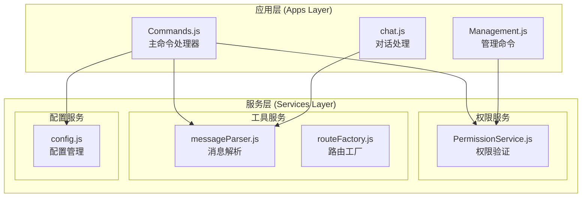
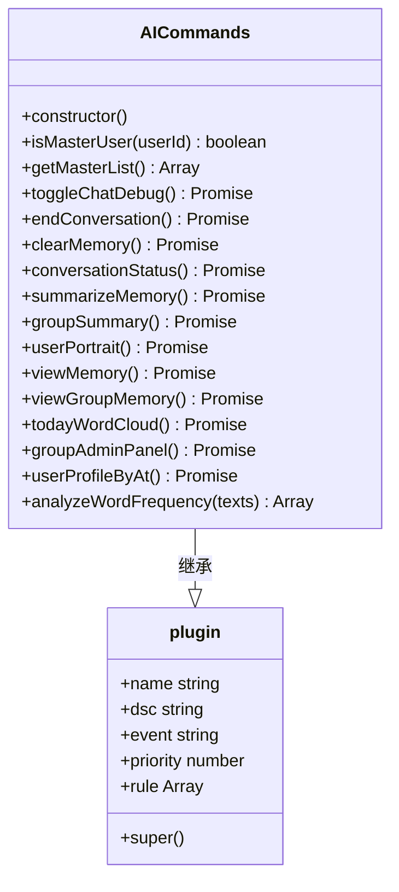
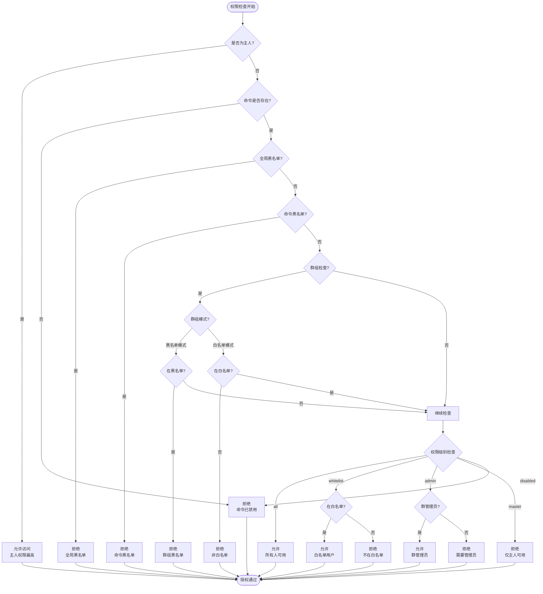
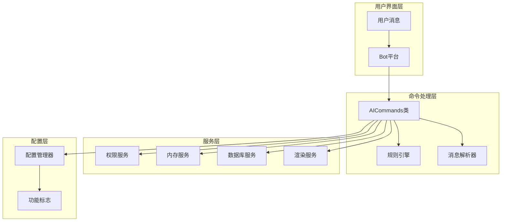
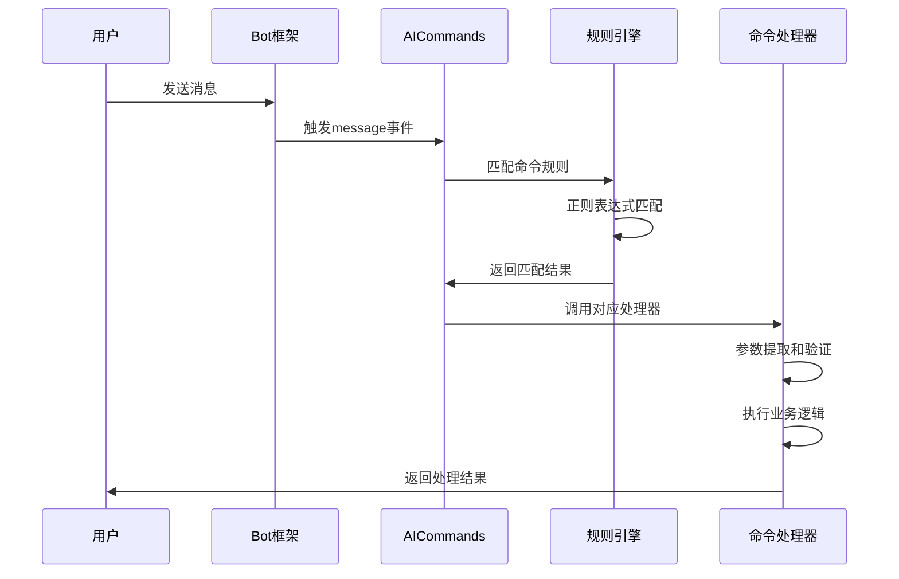
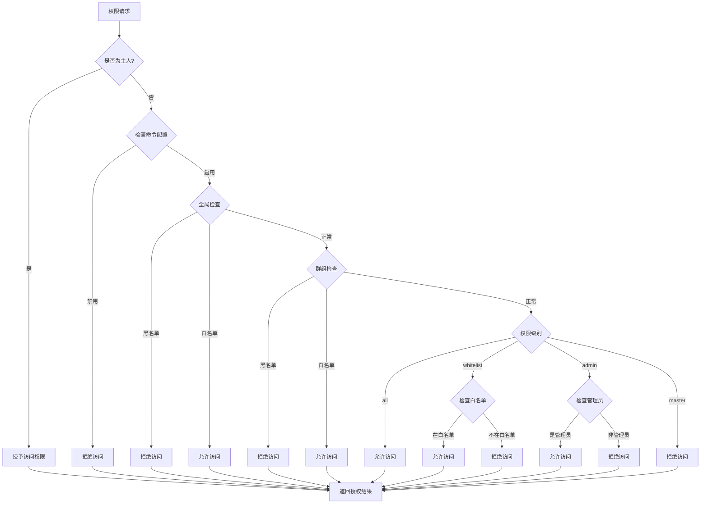
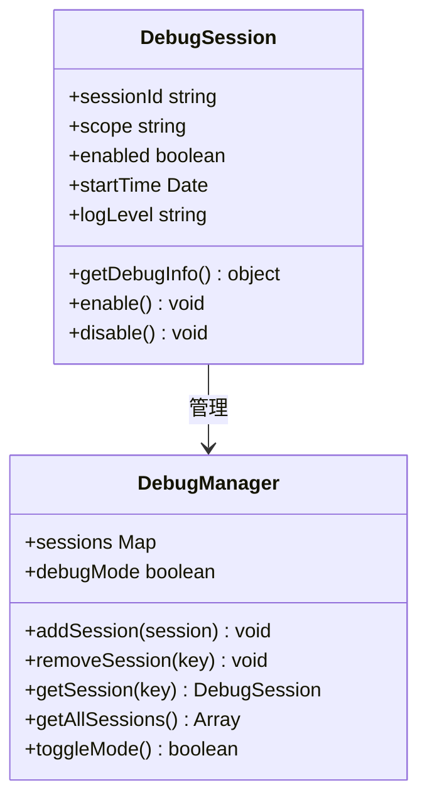
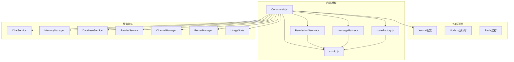

# 命令处理模块

<cite>
**本文档引用的文件**
- [apps/Commands.js](file://apps/Commands.js)
- [src/services/permission/PermissionService.js](file://src/services/permission/PermissionService.js)
- [src/utils/messageParser.js](file://src/utils/messageParser.js)
- [config/config.js](file://config/config.js)
- [src/services/middleware/routeFactory.js](file://src/services/middleware/routeFactory.js)
- [docs/DEVELOPMENT.md](file://docs/DEVELOPMENT.md)
</cite>

## 目录
1. [简介](#简介)
2. [项目结构](#项目结构)
3. [核心组件](#核心组件)
4. [架构概览](#架构概览)
5. [详细组件分析](#详细组件分析)
6. [依赖关系分析](#依赖关系分析)
7. [性能考虑](#性能考虑)
8. [故障排除指南](#故障排除指南)
9. [结论](#结论)
10. [附录](#附录)

## 简介

命令处理模块是 ChatAI Plugin 的核心功能组件，负责处理用户通过消息触发的各种命令。该模块实现了完整的命令系统，包括调试命令、AI相关命令和管理命令的处理逻辑。系统采用高优先级插件架构，确保命令不被其他插件抢占，提供稳定可靠的命令执行环境。

该模块的主要特性包括：
- **命令解析算法**：支持正则表达式匹配和参数提取
- **权限验证系统**：多层次权限控制，支持全局和群组级别的权限管理
- **命令路由分发**：基于规则的命令路由机制
- **响应处理**：支持文本和图片等多种响应格式
- **调试模式**：运行时调试功能，支持作用域隔离

## 项目结构

命令处理模块位于插件的 apps 层，采用模块化设计：

**图表来源**
- [apps/Commands.js](file://apps/Commands.js#L1-L50)
- [src/services/permission/PermissionService.js](file://src/services/permission/PermissionService.js#L1-L50)
- [src/utils/messageParser.js](file://src/utils/messageParser.js#L1-L50)
- [config/config.js](file://config/config.js#L1-L50)

**章节来源**
- [apps/Commands.js](file://apps/Commands.js#L1-L120)
- [docs/DEVELOPMENT.md](file://docs/DEVELOPMENT.md#L19-L54)

## 核心组件

### AICommands 类

AICommands 是命令处理模块的核心类，继承自 Yunzai 框架的 plugin 基类。该类实现了完整的命令处理生命周期：

**图表来源**
- [apps/Commands.js](file://apps/Commands.js#L119-L181)

### 权限管理系统

权限系统采用多层次设计，支持全局和群组级别的权限控制：

**图表来源**
- [src/services/permission/PermissionService.js](file://src/services/permission/PermissionService.js#L337-L421)

**章节来源**
- [src/services/permission/PermissionService.js](file://src/services/permission/PermissionService.js#L22-L484)

## 架构概览

命令处理模块采用分层架构设计，确保职责分离和代码可维护性：

**图表来源**
- [apps/Commands.js](file://apps/Commands.js#L1-L120)
- [src/services/permission/PermissionService.js](file://src/services/permission/PermissionService.js#L1-L50)
- [config/config.js](file://config/config.js#L62-L120)

### 命令注册机制

系统采用声明式命令注册方式，通过规则数组定义命令模式：

| 命令类型 | 规则模式 | 功能描述 |
|---------|----------|----------|
| 调试命令 | `^#chatdebug\s*(true|false|on|off|开启|关闭)?$` | 切换调试模式 |
| 对话管理 | `^#(结束对话|结束会话|新对话|新会话)$` | 结束当前对话 |
| 记忆管理 | `^#(清除记忆|清理记忆|删除记忆)$` | 清除用户记忆 |
| 状态查询 | `^#(对话状态|会话状态)$` | 查看对话状态 |
| 群组功能 | `^#(群聊总结|总结群聊|群消息总结|画像总结)$` | 群聊内容总结 |
| 用户画像 | `^#(个人画像|用户画像|分析我)$` | 个人行为分析 |
| 管理面板 | `^#(群管理面板|群管理入口|群设置面板)$` | 群管理入口 |

**章节来源**
- [apps/Commands.js](file://apps/Commands.js#L126-L179)

## 详细组件分析

### 命令解析算法

命令解析采用正则表达式匹配和参数提取相结合的方式：

**图表来源**
- [apps/Commands.js](file://apps/Commands.js#L126-L179)

#### 参数提取机制

系统支持多种参数提取方式：

1. **正则表达式捕获组**：用于提取命令参数
2. **消息解析**：解析复杂消息结构
3. **配置参数**：从配置文件读取参数
4. **环境变量**：动态获取运行时参数

**章节来源**
- [apps/Commands.js](file://apps/Commands.js#L285-L309)

### 权限验证流程

权限验证采用多层检查机制：

**图表来源**
- [src/services/permission/PermissionService.js](file://src/services/permission/PermissionService.js#L337-L421)

**章节来源**
- [src/services/permission/PermissionService.js](file://src/services/permission/PermissionService.js#L337-L480)

### 响应处理机制

系统支持多种响应格式和处理策略：

| 响应类型 | 处理方式 | 使用场景 |
|---------|----------|----------|
| 文本响应 | 直接回复文本消息 | 简单查询和状态显示 |
| 图片响应 | 渲染为图片后发送 | 复杂数据可视化 |
| Markdown | 渲染为富文本 | 结构化信息展示 |
| JSON响应 | 格式化输出 | 调试和开发用途 |

**章节来源**
- [apps/Commands.js](file://apps/Commands.js#L521-L547)

### 调试模式系统

调试模式提供运行时调试能力，支持作用域隔离：

**图表来源**
- [apps/Commands.js](file://apps/Commands.js#L24-L116)

**章节来源**
- [apps/Commands.js](file://apps/Commands.js#L24-L116)

## 依赖关系分析

命令处理模块的依赖关系体现了清晰的分层架构：

**图表来源**
- [apps/Commands.js](file://apps/Commands.js#L5-L16)
- [src/services/permission/PermissionService.js](file://src/services/permission/PermissionService.js#L1-L10)
- [src/utils/messageParser.js](file://src/utils/messageParser.js#L1-L28)

### 核心依赖注入

系统采用依赖注入模式管理服务依赖：

| 服务名称 | 依赖接口 | 实现类 | 作用 |
|---------|----------|--------|------|
| chatService | ChatService | ChatService.js | 对话处理 |
| memoryManager | MemoryManager | MemoryManager.js | 记忆管理 |
| databaseService | DatabaseService | DatabaseService.js | 数据存储 |
| renderService | RenderService | RenderService.js | 图片渲染 |
| channelManager | ChannelManager | ChannelManager.js | 渠道管理 |
| presetManager | PresetManager | PresetManager.js | 预设管理 |
| usageStats | UsageStats | UsageStats.js | 使用统计 |

**章节来源**
- [apps/Commands.js](file://apps/Commands.js#L5-L16)

## 性能考虑

命令处理模块在设计时充分考虑了性能优化：

### 缓存策略

1. **内存缓存**：调试会话状态存储在内存中
2. **配置缓存**：配置信息缓存在内存中
3. **服务初始化**：服务懒加载，首次使用时初始化

### 异步处理

- **非阻塞操作**：所有IO操作都是异步的
- **并发控制**：合理控制并发请求数量
- **超时处理**：为外部API调用设置超时

### 资源管理

- **连接池**：数据库连接使用连接池
- **内存管理**：及时释放不需要的对象引用
- **垃圾回收**：避免内存泄漏

## 故障排除指南

### 常见问题诊断

| 问题类型 | 症状 | 可能原因 | 解决方案 |
|---------|------|----------|----------|
| 命令不响应 | 用户发送命令无反应 | 规则匹配失败 | 检查正则表达式 |
| 权限拒绝 | "您没有权限执行此命令" | 权限配置错误 | 检查权限设置 |
| 调试模式无效 | #chatdebug命令不起作用 | 作用域设置错误 | 检查调试会话范围 |
| 响应格式错误 | 图片渲染失败 | 渲染服务异常 | 检查渲染配置 |

### 调试技巧

1. **启用详细日志**：在配置中启用调试模式
2. **检查权限链**：验证权限检查流程
3. **监控资源使用**：观察内存和CPU使用情况
4. **验证依赖服务**：确保所有依赖服务正常运行

**章节来源**
- [apps/Commands.js](file://apps/Commands.js#L285-L309)
- [src/services/permission/PermissionService.js](file://src/services/permission/PermissionService.js#L427-L449)

## 结论

命令处理模块展现了优秀的软件工程实践，具有以下特点：

1. **架构清晰**：采用分层架构，职责分离明确
2. **扩展性强**：支持新命令的便捷添加
3. **安全性高**：多层次权限控制系统
4. **性能优秀**：合理的缓存和异步处理策略
5. **可维护性好**：代码结构清晰，文档完善

该模块为 ChatAI Plugin 提供了稳定可靠的命令处理基础，支持丰富的AI功能和管理操作，是整个插件系统的核心组件。

## 附录

### 命令开发最佳实践

#### 添加新命令的步骤

1. **定义命令规则**：在规则数组中添加新的正则表达式
2. **实现命令处理器**：编写对应的处理函数
3. **配置权限**：在权限配置中设置访问控制
4. **测试命令**：验证命令功能和边界条件
5. **文档更新**：更新相关文档和帮助信息

#### 参数验证建议

- **必填参数**：使用严格验证确保参数完整性
- **类型检查**：验证参数类型和格式
- **范围限制**：限制参数的有效范围
- **默认值处理**：为可选参数提供合理默认值

#### 错误处理策略

- **用户友好**：向用户提供清晰的错误信息
- **日志记录**：详细记录错误信息便于调试
- **降级处理**：在异常情况下提供备用方案
- **恢复机制**：实现自动恢复和重试机制

**章节来源**
- [docs/DEVELOPMENT.md](file://docs/DEVELOPMENT.md#L564-L636)
- [config/config.js](file://config/config.js#L62-L120)