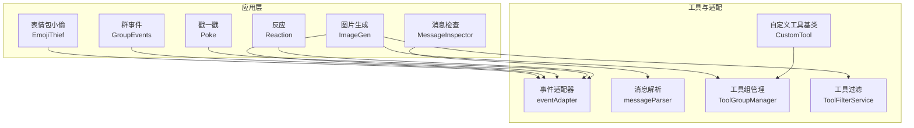
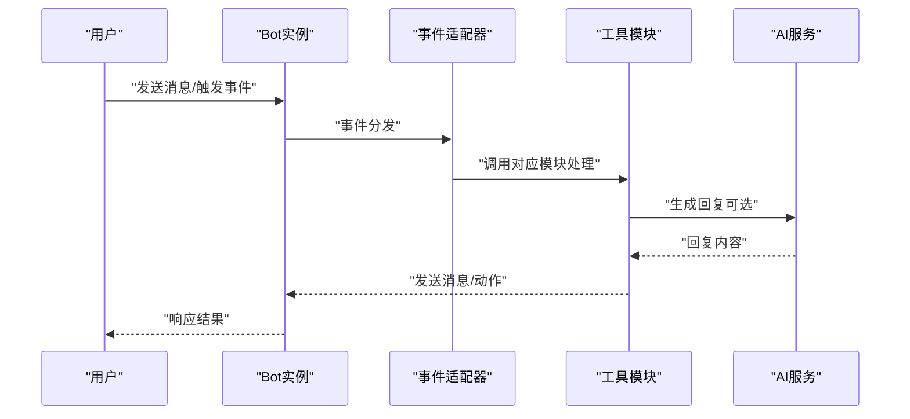
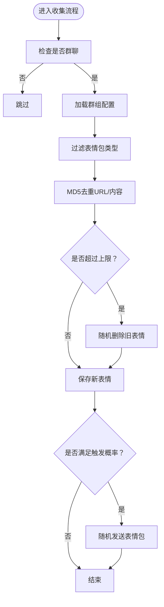
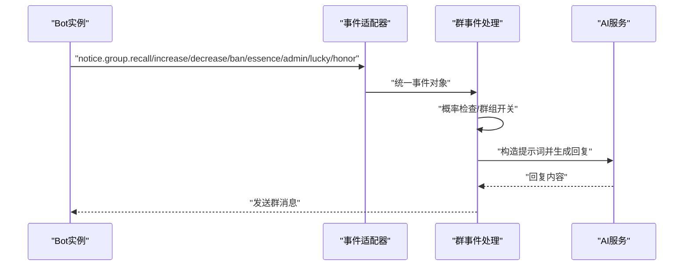
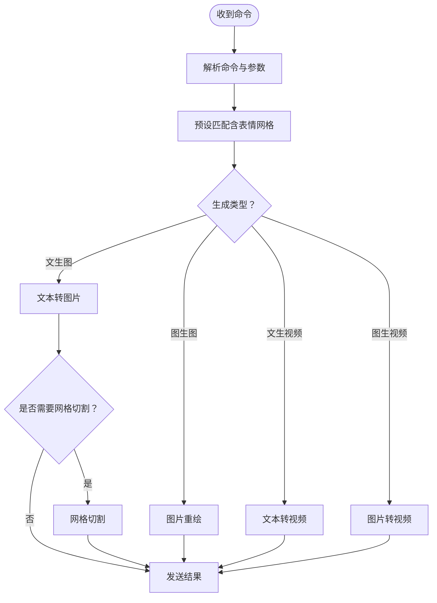
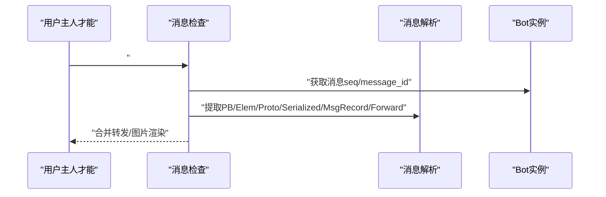
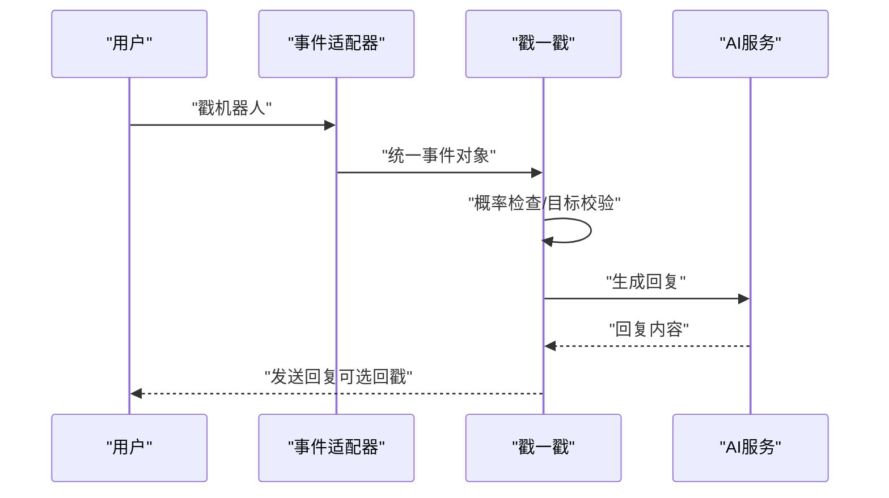
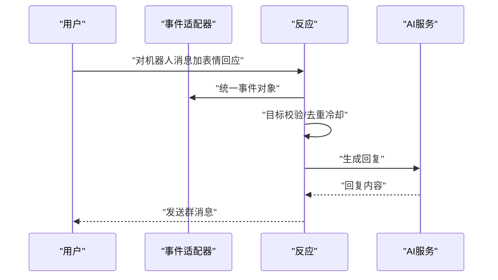
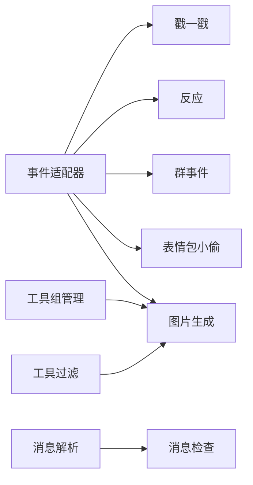

# 工具模块

<cite>
**本文档引用的文件**
- [EmojiThief.js](file://apps/EmojiThief.js)
- [GroupEvents.js](file://apps/GroupEvents.js)
- [ImageGen.js](file://apps/ImageGen.js)
- [MessageInspector.js](file://apps/MessageInspector.js)
- [Poke.js](file://apps/Poke.js)
- [Reaction.js](file://apps/Reaction.js)
- [eventAdapter.js](file://src/utils/eventAdapter.js)
- [messageParser.js](file://src/utils/messageParser.js)
- [CustomTool.js](file://data/tools/CustomTool.js)
- [example_tool.js](file://data/tools/example_tool.js)
- [TOOLS.md](file://docs/TOOLS.md)
- [ToolGroupManager.js](file://src/services/tools/ToolGroupManager.js)
- [ToolFilterService.js](file://src/services/tools/ToolFilterService.js)
</cite>

## 目录
1. [简介](#简介)
2. [项目结构](#项目结构)
3. [核心组件](#核心组件)
4. [架构总览](#架构总览)
5. [详细组件分析](#详细组件分析)
6. [依赖分析](#依赖分析)
7. [性能考虑](#性能考虑)
8. [故障排查指南](#故障排查指南)
9. [结论](#结论)
10. [附录](#附录)

## 简介
本文件面向“工具模块集合”的使用者与开发者，系统性梳理表情包小偷、群事件、图片生成、消息检查、戳一戳、反应（表情回应）等模块的功能定位、触发条件、处理流程与集成方式。文档同时阐述设计模式、扩展机制与性能优化策略，并提供使用示例与自定义开发指南。

## 项目结构
工具模块位于 apps 目录，围绕事件驱动与适配器模式构建，配合统一的事件适配器与消息解析工具，实现跨平台（icqq、NapCat、OneBot 等）兼容。核心模块职责如下：
- 表情包小偷：自动收集与随机发送表情包，支持群组独立配置与概率控制
- 群事件：统一处理入群、退群、禁言、精华、管理员变更、运气王/荣誉等事件
- 图片生成：文生图/图生图/文生视频/图生视频，内置预设与远程预设管理
- 消息检查：提取消息原始数据（PB/Elem/Proto/Serialized/MsgRecord），支持转发展示
- 戳一戳：对戳机器人的事件进行AI回复，支持回戳
- 反应：对消息的表情回应进行AI回复，兼容多适配器

图表来源
- [EmojiThief.js](file://apps/EmojiThief.js#L25-L461)
- [GroupEvents.js](file://apps/GroupEvents.js#L1-L800)
- [ImageGen.js](file://apps/ImageGen.js#L298-L800)
- [MessageInspector.js](file://apps/MessageInspector.js#L87-L800)
- [Poke.js](file://apps/Poke.js#L38-L129)
- [Reaction.js](file://apps/Reaction.js#L480-L495)
- [eventAdapter.js](file://src/utils/eventAdapter.js#L1-L800)
- [messageParser.js](file://src/utils/messageParser.js#L1-L800)
- [ToolGroupManager.js](file://src/services/tools/ToolGroupManager.js#L22-L579)
- [ToolFilterService.js](file://src/services/tools/ToolFilterService.js#L28-L314)
- [CustomTool.js](file://data/tools/CustomTool.js#L5-L36)

章节来源
- [EmojiThief.js](file://apps/EmojiThief.js#L1-L496)
- [GroupEvents.js](file://apps/GroupEvents.js#L1-L800)
- [ImageGen.js](file://apps/ImageGen.js#L1-L800)
- [MessageInspector.js](file://apps/MessageInspector.js#L1-L800)
- [Poke.js](file://apps/Poke.js#L1-L129)
- [Reaction.js](file://apps/Reaction.js#L1-L495)
- [eventAdapter.js](file://src/utils/eventAdapter.js#L1-L800)
- [messageParser.js](file://src/utils/messageParser.js#L1-L800)
- [ToolGroupManager.js](file://src/services/tools/ToolGroupManager.js#L1-L579)
- [ToolFilterService.js](file://src/services/tools/ToolFilterService.js#L1-L314)
- [CustomTool.js](file://data/tools/CustomTool.js#L1-L36)

## 核心组件
- 表情包小偷（EmojiThief）
  - 功能：自动收集表情包并按配置随机发送；支持群组独立配置（开关、独立文件夹、最大数量、触发方式与概率）
  - 触发条件：消息事件（群聊）、满足概率与配置；也可手动触发
  - 关键流程：收集 → 去重（URL/内容MD5）→ 限量淘汰 → 随机发送
- 群事件（GroupEvents）
  - 功能：统一处理入群/退群/禁言/精华/管理员变更/运气王/荣誉等事件，支持AI回复与概率控制
  - 触发条件：对应 notice 事件；支持群组独立开关与概率
  - 关键流程：事件解析 → 概率检查 → AI生成 → 发送
- 图片生成（ImageGen）
  - 功能：文生图/图生图/文生视频/图生视频；内置/自定义/远程预设；支持群组独立模型与全局开关
  - 触发条件：消息命令；支持预设模板与动态匹配
  - 关键流程：命令解析 → 预设匹配 → 图片/视频生成 → 结果发送
- 消息检查（MessageInspector）
  - 功能：提取消息原始数据（PB/Elem/Proto/Serialized/MsgRecord/Forward），支持转发展示
  - 触发条件：消息事件（高优先级）；仅主人才能使用
  - 关键流程：消息获取 → 数据提取 → 合并转发/图片渲染
- 戳一戳（Poke）
  - 功能：对戳机器人的事件进行AI回复，支持回戳
  - 触发条件：notice.*.poke；支持概率与开关
  - 关键流程：事件解析 → 概率检查 → AI回复 → 可选回戳
- 反应（Reaction）
  - 功能：对消息的表情回应进行AI回复，兼容多适配器
  - 触发条件：notice.group.reaction 或兼容事件；支持概率与冷却
  - 关键流程：事件解析 → 目标校验 → 去重冷却 → AI回复

章节来源
- [EmojiThief.js](file://apps/EmojiThief.js#L25-L496)
- [GroupEvents.js](file://apps/GroupEvents.js#L482-L660)
- [ImageGen.js](file://apps/ImageGen.js#L298-L800)
- [MessageInspector.js](file://apps/MessageInspector.js#L87-L800)
- [Poke.js](file://apps/Poke.js#L38-L129)
- [Reaction.js](file://apps/Reaction.js#L333-L430)

## 架构总览
各模块均以插件形式注册事件监听，通过统一的事件适配器与消息解析工具实现跨平台兼容。图片生成模块还接入工具组管理与工具过滤服务，实现预设与权限控制。

图表来源
- [eventAdapter.js](file://src/utils/eventAdapter.js#L1-L800)
- [Poke.js](file://apps/Poke.js#L49-L110)
- [Reaction.js](file://apps/Reaction.js#L333-L429)
- [GroupEvents.js](file://apps/GroupEvents.js#L482-L660)
- [ImageGen.js](file://apps/ImageGen.js#L609-L782)
- [MessageInspector.js](file://apps/MessageInspector.js#L138-L277)

## 详细组件分析

### 表情包小偷（EmojiThief）
- 设计模式
  - 单例服务：集中管理表情包收集、存储与发送
  - 配置驱动：通过群组设置实现灵活控制
- 触发条件
  - 消息事件（群聊）：自动收集
  - 随机触发：满足概率与模式配置
- 处理逻辑
  - 收集阶段：过滤表情包类型、去重（URL/内容MD5）、限量淘汰
  - 发送阶段：按模式与概率随机选择表情包并发送
- 集成方式
  - 插件注册 message.group 事件，调用服务方法
- 性能优化
  - MD5 去重（URL/内容）减少重复下载
  - 限量淘汰避免磁盘膨胀
  - 异步写入与懒加载目录

图表来源
- [EmojiThief.js](file://apps/EmojiThief.js#L108-L245)
- [EmojiThief.js](file://apps/EmojiThief.js#L346-L409)

章节来源
- [EmojiThief.js](file://apps/EmojiThief.js#L25-L496)

### 群事件（GroupEvents）
- 设计模式
  - 统一事件适配：通过事件适配器解析不同平台事件
  - 模板化提示词：支持占位符与自定义模板
- 触发条件
  - notice.group.* 事件；支持全局与群组独立开关、概率控制
- 处理逻辑
  - 事件解析 → 概率检查 → 提示词模板替换 → AI生成 → 发送
- 集成方式
  - 注册多平台事件监听，统一处理
- 性能优化
  - 事件去重（时间窗）防止重复处理
  - 消息缓存（TTL/容量）提升撤回消息获取效率

图表来源
- [GroupEvents.js](file://apps/GroupEvents.js#L482-L660)
- [eventAdapter.js](file://src/utils/eventAdapter.js#L278-L501)

章节来源
- [GroupEvents.js](file://apps/GroupEvents.js#L1-L800)
- [eventAdapter.js](file://src/utils/eventAdapter.js#L1-L800)

### 图片生成（ImageGen）
- 设计模式
  - 预设管理：内置/自定义/远程预设合并与正则匹配
  - 群组独立配置：支持群组独立开关与模型
- 触发条件
  - 命令消息：#文生图/#图生图/#文生视频/#图生视频
  - 预设模板：消息匹配预设关键词
- 处理逻辑
  - 命令解析 → 预设匹配 → 图片/视频生成 → 结果发送（支持自动撤回）
- 集成方式
  - 插件注册 message 事件，路由到对应处理函数
- 性能优化
  - 预设缓存（本地文件）与远程更新
  - 并发与超时控制（可配置）

图表来源
- [ImageGen.js](file://apps/ImageGen.js#L609-L782)
- [ImageGen.js](file://apps/ImageGen.js#L740-L782)

章节来源
- [ImageGen.js](file://apps/ImageGen.js#L1-L800)

### 消息检查（MessageInspector）
- 设计模式
  - 主人权限：仅主人才能使用
  - 多平台兼容：统一提取原始数据（PB/Elem/Proto/Serialized/MsgRecord/Forward）
- 触发条件
  - 消息事件（高优先级）；命令：#取/#取消息/#消息详情
- 处理逻辑
  - 消息获取 → 数据提取 → 合并转发/图片渲染
- 集成方式
  - 插件注册消息事件，高优先级确保命令可触发

图表来源
- [MessageInspector.js](file://apps/MessageInspector.js#L138-L277)
- [messageParser.js](file://src/utils/messageParser.js#L1-L800)

章节来源
- [MessageInspector.js](file://apps/MessageInspector.js#L1-L800)
- [messageParser.js](file://src/utils/messageParser.js#L1-L800)

### 戳一戳（Poke）
- 设计模式
  - 事件驱动：统一事件解析与AI回复
  - 可选回戳：支持群聊回戳
- 触发条件
  - notice.*.poke；仅戳机器人且非机器人自身
- 处理逻辑
  - 事件解析 → 概率检查 → AI回复 → 可选回戳

图表来源
- [Poke.js](file://apps/Poke.js#L49-L110)
- [eventAdapter.js](file://src/utils/eventAdapter.js#L278-L297)

章节来源
- [Poke.js](file://apps/Poke.js#L1-L129)
- [eventAdapter.js](file://src/utils/eventAdapter.js#L1-L800)

### 反应（Reaction）
- 设计模式
  - 多适配器兼容：icqq/NapCat/OneBot
  - 去重冷却：防止重复响应
- 触发条件
  - notice.group.reaction 或兼容事件；仅对机器人消息的回应
- 处理逻辑
  - 事件解析 → 目标校验 → 去重冷却 → AI回复

图表来源
- [Reaction.js](file://apps/Reaction.js#L333-L429)
- [eventAdapter.js](file://src/utils/eventAdapter.js#L304-L338)

章节来源
- [Reaction.js](file://apps/Reaction.js#L1-L495)
- [eventAdapter.js](file://src/utils/eventAdapter.js#L1-L800)

## 依赖分析
- 模块耦合
  - 各模块依赖统一事件适配器与消息解析工具，降低平台差异带来的耦合
  - 图片生成模块进一步依赖工具组管理与工具过滤服务，实现预设与权限控制
- 外部依赖
  - HTTP 请求（表情包下载、API 状态查询）
  - 文件系统（表情包存储）
  - Bot 适配器（不同平台的 API 差异）

图表来源
- [eventAdapter.js](file://src/utils/eventAdapter.js#L1-L800)
- [messageParser.js](file://src/utils/messageParser.js#L1-L800)
- [ToolGroupManager.js](file://src/services/tools/ToolGroupManager.js#L22-L579)
- [ToolFilterService.js](file://src/services/tools/ToolFilterService.js#L28-L314)

章节来源
- [eventAdapter.js](file://src/utils/eventAdapter.js#L1-L800)
- [messageParser.js](file://src/utils/messageParser.js#L1-L800)
- [ToolGroupManager.js](file://src/services/tools/ToolGroupManager.js#L1-L579)
- [ToolFilterService.js](file://src/services/tools/ToolFilterService.js#L1-L314)

## 性能考虑
- 去重与缓存
  - 表情包：MD5 去重（URL/内容），避免重复下载
  - 群事件：事件去重（时间窗）与消息缓存（TTL/容量）
- 限量与淘汰
  - 表情包：达到上限时随机删除旧文件
- 异步与并发
  - 图片生成：超时控制与并发限制（可配置）
- 跨平台适配
  - 通过事件适配器与消息解析工具屏蔽平台差异，减少分支逻辑带来的性能损耗

## 故障排查指南
- 表情包小偷
  - 症状：无法收集/发送
  - 排查：检查群组配置（开关、概率、最大数量、触发模式）、网络可达性、磁盘空间
- 群事件
  - 症状：事件未触发/回复异常
  - 排查：确认事件监听是否注册、概率检查是否通过、AI 服务是否可用
- 图片生成
  - 症状：命令无响应/生成失败
  - 排查：检查命令格式、预设匹配、API 状态、超时设置
- 消息检查
  - 症状：无法获取原始数据
  - 排查：确认权限（主人）、平台支持、消息 ID/seq 正确性
- 戳一戳/反应
  - 症状：未回复/回戳失败
  - 排查：确认事件监听、概率开关、适配器支持、目标校验

章节来源
- [EmojiThief.js](file://apps/EmojiThief.js#L108-L245)
- [GroupEvents.js](file://apps/GroupEvents.js#L482-L660)
- [ImageGen.js](file://apps/ImageGen.js#L471-L604)
- [MessageInspector.js](file://apps/MessageInspector.js#L138-L277)
- [Poke.js](file://apps/Poke.js#L49-L110)
- [Reaction.js](file://apps/Reaction.js#L333-L429)

## 结论
工具模块集合通过统一的事件适配与消息解析，实现了跨平台兼容与灵活扩展。表情包小偷、群事件、图片生成、消息检查、戳一戳与反应六大模块覆盖了常用场景，配合预设与权限控制，既保证易用性又兼顾安全性与性能。建议在生产环境中结合配置与监控，持续优化触发策略与资源使用。

## 附录

### 使用示例
- 表情包小偷
  - 在群聊中发送表情包，自动收集；满足概率后随机发送
- 群事件
  - 入群/退群/禁言/精华/管理员变更/运气王/荣誉等事件触发AI回复
- 图片生成
  - #文生图/图生图/文生视频/图生视频；或发送预设关键词触发
- 消息检查
  - #取/#取消息/#消息详情（仅主人才能）
- 戳一戳
  - 戳机器人触发AI回复（可选回戳）
- 反应
  - 对机器人消息添加表情回应触发AI回复

章节来源
- [EmojiThief.js](file://apps/EmojiThief.js#L483-L494)
- [GroupEvents.js](file://apps/GroupEvents.js#L482-L660)
- [ImageGen.js](file://apps/ImageGen.js#L298-L800)
- [MessageInspector.js](file://apps/MessageInspector.js#L87-L132)
- [Poke.js](file://apps/Poke.js#L38-L129)
- [Reaction.js](file://apps/Reaction.js#L480-L495)

### 自定义开发指南
- 自定义工具
  - 位置：data/tools/*.js
  - 结构：name/function/run
  - 上下文：getEvent/getBot/isIcqq/isNapCat/isNT
  - 返回：success/error 或 MCP 标准 content
- 工具扩展
  - 使用工具组管理与工具过滤服务实现预设级别控制
  - 参考示例工具与基类 CustomTool

章节来源
- [TOOLS.md](file://docs/TOOLS.md#L1-L800)
- [CustomTool.js](file://data/tools/CustomTool.js#L5-L36)
- [example_tool.js](file://data/tools/example_tool.js#L1-L43)
- [ToolGroupManager.js](file://src/services/tools/ToolGroupManager.js#L22-L579)
- [ToolFilterService.js](file://src/services/tools/ToolFilterService.js#L28-L314)