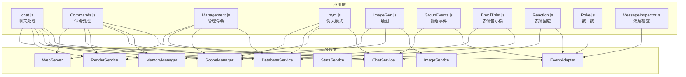
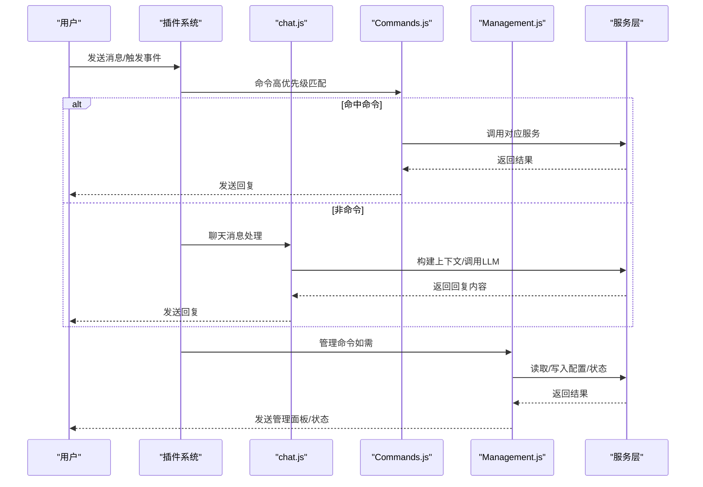
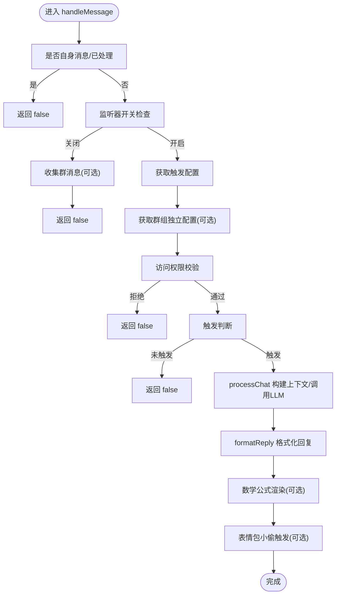
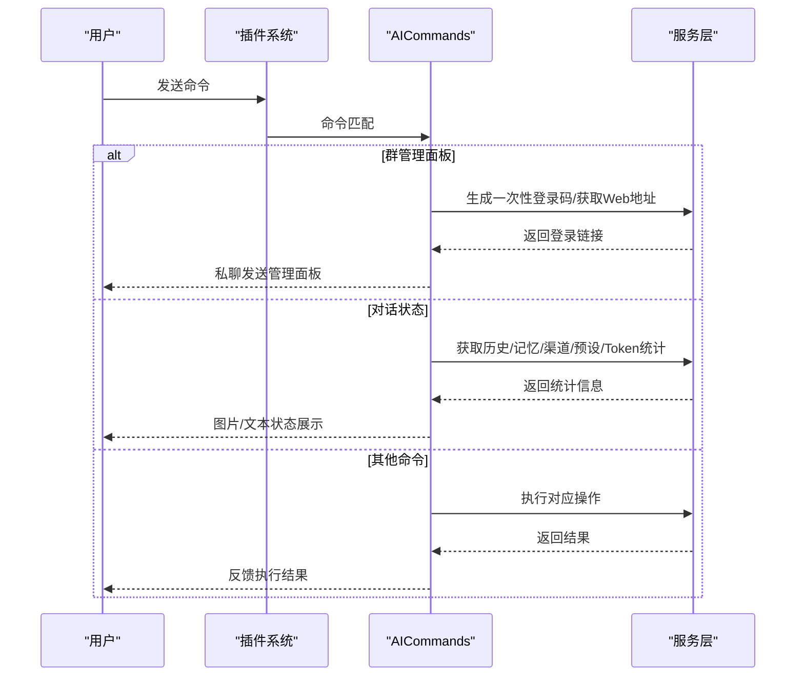
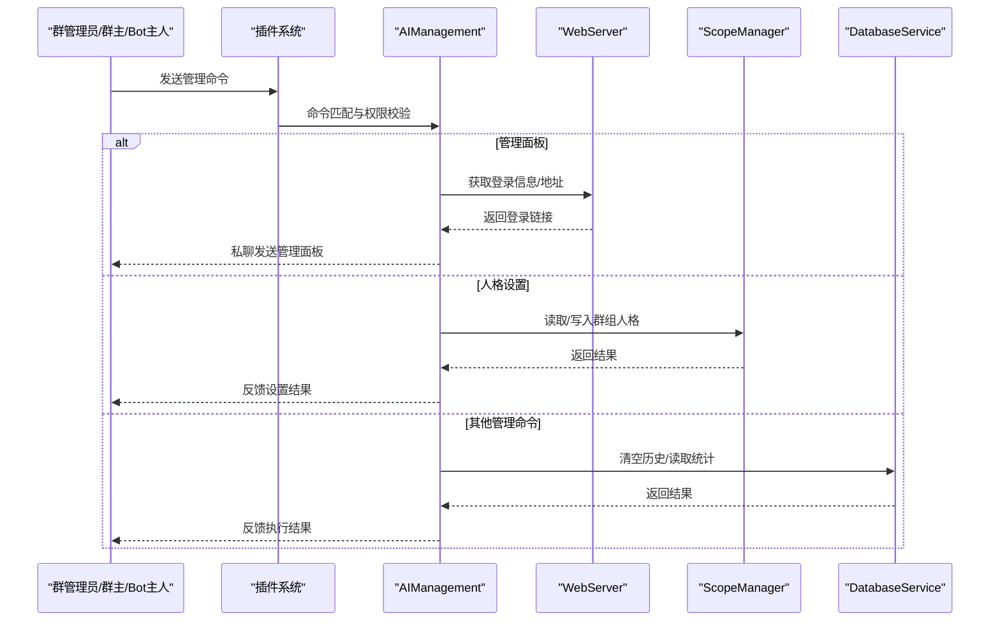
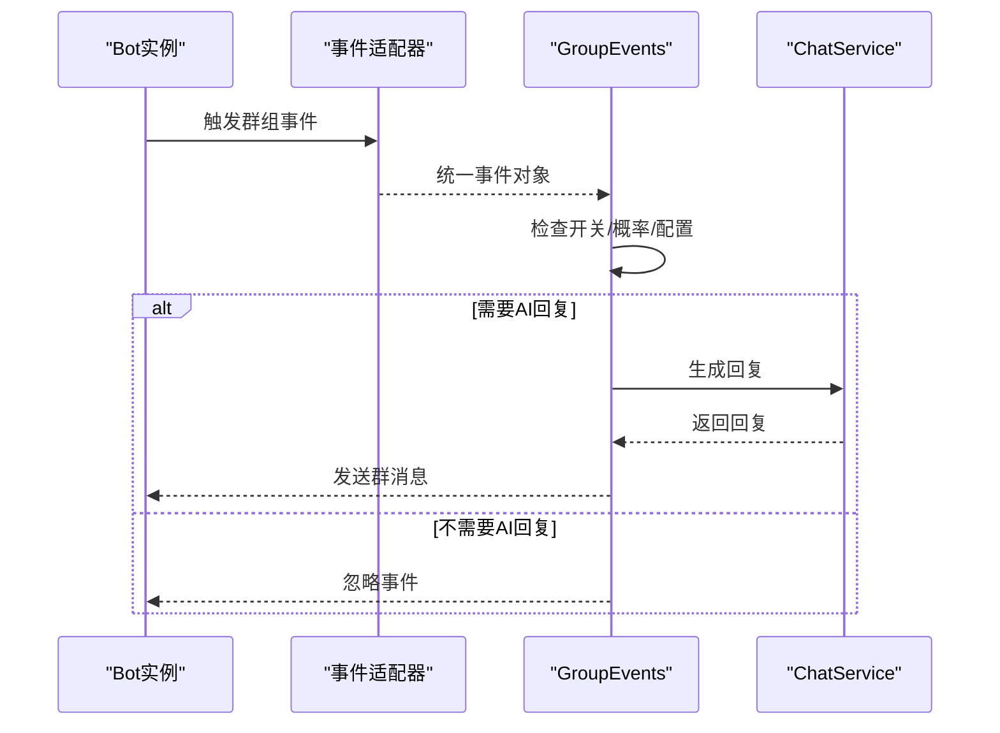
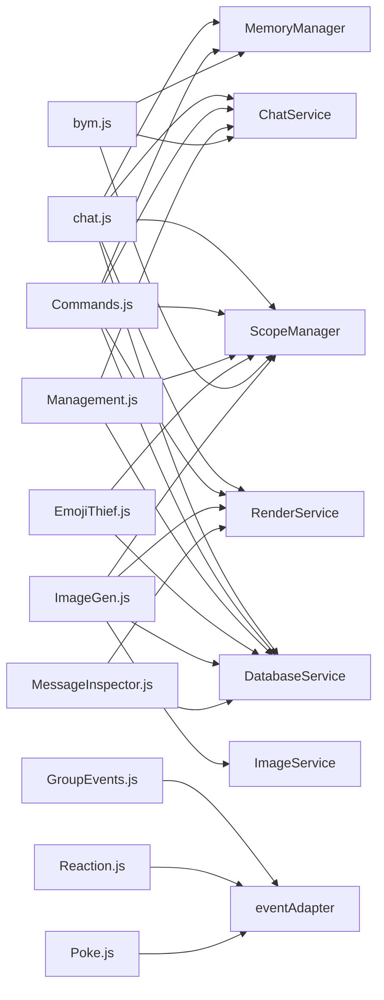

# 应用模块

<cite>
**本文档引用的文件**
- [apps/chat.js](file://apps/chat.js)
- [apps/Commands.js](file://apps/Commands.js)
- [apps/Management.js](file://apps/Management.js)
- [apps/GroupEvents.js](file://apps/GroupEvents.js)
- [apps/EmojiThief.js](file://apps/EmojiThief.js)
- [apps/Reaction.js](file://apps/Reaction.js)
- [apps/bym.js](file://apps/bym.js)
- [apps/Poke.js](file://apps/Poke.js)
- [apps/ImageGen.js](file://apps/ImageGen.js)
- [apps/MessageInspector.js](file://apps/MessageInspector.js)
</cite>

## 目录
1. [简介](#简介)
2. [项目结构](#项目结构)
3. [核心组件](#核心组件)
4. [架构总览](#架构总览)
5. [详细组件分析](#详细组件分析)
6. [依赖关系分析](#依赖关系分析)
7. [性能考虑](#性能考虑)
8. [故障排查指南](#故障排查指南)
9. [结论](#结论)
10. [附录](#附录)

## 简介
本文件面向 ChatAI 插件的应用模块，系统性梳理 apps 目录下的各应用模块设计原理与实现机制，重点覆盖聊天处理模块（chat.js）、命令处理模块（Commands.js）、管理模块（Management.js）等，并扩展至群组事件（GroupEvents.js）、表情包小偷（EmojiThief.js）、表情回应（Reaction.js）、伪人模式（bym.js）、戳一戳（Poke.js）、绘图（ImageGen.js）、消息检查（MessageInspector.js）等。文档从职责边界、API 接口、模块间交互、动态加载与初始化流程、错误处理策略等方面展开，并提供模块开发最佳实践建议。

## 项目结构
apps 目录采用“按功能域划分”的模块化组织方式，每个模块以 plugin 类导出，遵循统一的事件驱动与规则匹配机制。模块之间通过服务层（services）与工具层（utils）解耦，形成清晰的职责边界与可扩展性。

图表来源
- [apps/chat.js](file://apps/chat.js#L1-L120)
- [apps/Commands.js](file://apps/Commands.js#L1-L120)
- [apps/Management.js](file://apps/Management.js#L1-L120)
- [apps/GroupEvents.js](file://apps/GroupEvents.js#L1-L120)
- [apps/EmojiThief.js](file://apps/EmojiThief.js#L1-L120)
- [apps/Reaction.js](file://apps/Reaction.js#L1-L120)
- [apps/bym.js](file://apps/bym.js#L1-L120)
- [apps/Poke.js](file://apps/Poke.js#L1-L120)
- [apps/ImageGen.js](file://apps/ImageGen.js#L1-L120)
- [apps/MessageInspector.js](file://apps/MessageInspector.js#L1-L120)

章节来源
- [apps/chat.js](file://apps/chat.js#L1-L120)
- [apps/Commands.js](file://apps/Commands.js#L1-L120)
- [apps/Management.js](file://apps/Management.js#L1-L120)
- [apps/GroupEvents.js](file://apps/GroupEvents.js#L1-L120)
- [apps/EmojiThief.js](file://apps/EmojiThief.js#L1-L120)
- [apps/Reaction.js](file://apps/Reaction.js#L1-L120)
- [apps/bym.js](file://apps/bym.js#L1-L120)
- [apps/Poke.js](file://apps/Poke.js#L1-L120)
- [apps/ImageGen.js](file://apps/ImageGen.js#L1-L120)
- [apps/MessageInspector.js](file://apps/MessageInspector.js#L1-L120)

## 核心组件
- 聊天处理模块（chat.js）
  - 职责：统一消息入口、触发条件判断、权限校验、上下文构建、LLM 调用、回复格式化、数学公式渲染、表情包小偷联动。
  - 关键接口：handleMessage、checkTrigger、processChat、formatReply、cleanAtBot。
  - 依赖：ChatService、MemoryManager、StatsService、RenderService、ScopeManager、DatabaseService、McpManager、EmojiThief。
- 命令处理模块（Commands.js）
  - 职责：高优先级命令处理（结束对话、清除记忆、对话状态、群聊总结、用户画像、管理面板等）。
  - 关键接口：AICommands 类、toggleChatDebug、endConversation、clearMemory、conversationStatus、groupSummary、groupAdminPanel。
  - 依赖：ChatService、MemoryManager、DatabaseService、RenderService、ChannelManager、PresetManager、UsageStats、LlmService、ScopeManager、WebServer。
- 管理模块（Management.js）
  - 职责：群内管理命令（群功能开关、人格设置、状态查询、调试开关、模型设置、渠道与限制等）。
  - 关键接口：AIManagement 类、managementPanel、endConversation、setPersonality、viewPersonality、help、toggleDebug、setModel。
  - 依赖：WebServer、ScopeManager、DatabaseService、ChatService。
- 群组事件（GroupEvents.js）
  - 职责：统一群组事件监听与AI响应（欢迎、告别、禁言、精华、管理员变更、运气王、荣誉等）。
  - 关键接口：handleGroupEvent、registerEventListeners、cacheGroupMessage、getRecentGroupMessages。
  - 依赖：ScopeManager、DatabaseService、eventAdapter 工具集。
- 表情包小偷（EmojiThief.js）
  - 职责：收集表情包、去重、存储、按配置随机/跟随触发发送。
  - 关键接口：emojiThiefService、collectEmoji、tryTrigger、getRandomEmoji、getGroupConfig。
  - 依赖：ScopeManager、DatabaseService、消息解析工具。
- 表情回应（Reaction.js）
  - 职责：监听表情回应事件，AI生成自然化回复。
  - 关键接口：registerReactionListener、handleReactionEvent、handleNapCatReactionEvent。
  - 依赖：eventAdapter 工具集、ChatService。
- 伪人模式（bym.js）
  - 职责：模拟真人随机回复，支持群组独立配置、关键词触发、上下文注入、工具开关。
  - 关键接口：bym 类、byM 触发逻辑、配置继承与预设加载。
  - 依赖：LlmService、ChatService、MemoryManager、ScopeManager、PresetManager、KnowledgeService。
- 戳一戳（Poke.js）
  - 职责：戳一戳事件AI回复与可选回戳。
  - 关键接口：AI_Poke 类、handlePoke、pokeBack。
  - 依赖：eventAdapter 工具集、ChatService。
- 绘图（ImageGen.js）
  - 职责：文生图/图生图/文生视频/图生视频，预设模板管理，API状态查询，模型切换。
  - 关键接口：ImageGen 类、text2img、img2img、text2video、img2video、presetHandler、apiStatus、updatePresets。
  - 依赖：ImageService、RenderService、ScopeManager、DatabaseService。
- 消息检查（MessageInspector.js）
  - 职责：消息原始数据检查、PB/Elem/Forward解析、合并转发输出。
  - 关键接口：MessageInspector 类、inspectMessage、fetchMessage、buildFullMessageData。
  - 依赖：messageParser 工具集、RenderService、StatsService、DatabaseService。

章节来源
- [apps/chat.js](file://apps/chat.js#L89-L203)
- [apps/Commands.js](file://apps/Commands.js#L119-L181)
- [apps/Management.js](file://apps/Management.js#L18-L135)
- [apps/GroupEvents.js](file://apps/GroupEvents.js#L482-L659)
- [apps/EmojiThief.js](file://apps/EmojiThief.js#L25-L70)
- [apps/Reaction.js](file://apps/Reaction.js#L219-L262)
- [apps/bym.js](file://apps/bym.js#L19-L34)
- [apps/Poke.js](file://apps/Poke.js#L38-L47)
- [apps/ImageGen.js](file://apps/ImageGen.js#L298-L323)
- [apps/MessageInspector.js](file://apps/MessageInspector.js#L87-L132)

## 架构总览
应用模块围绕“事件驱动 + 规则匹配 + 服务编排”的架构展开。每个模块以 plugin 类导出，定义事件类型、优先级与规则；模块内部通过服务层完成业务编排，跨模块通过共享服务与工具集协作。

图表来源
- [apps/chat.js](file://apps/chat.js#L109-L203)
- [apps/Commands.js](file://apps/Commands.js#L119-L181)
- [apps/Management.js](file://apps/Management.js#L18-L135)

## 详细组件分析

### 聊天处理模块（chat.js）
- 职责边界
  - 统一消息入口与触发判断，支持私聊/群聊不同触发模式（@、前缀、关键词、随机）。
  - 权限控制（黑白名单、群组独立黑白名单）与访问控制。
  - 上下文构建（记忆、群组消息缓冲、引用消息、图片/音频处理）。
  - 回复格式化与数学公式渲染，表情包小偷联动。
- API 接口
  - handleMessage：统一入口，执行去重、监听器开关、触发配置、权限校验、群组独立配置、触发判断、上下文构建与LLM调用。
  - checkTrigger/checkPrefix/cleanAtBot：触发条件与前缀解析。
  - processChat：消息解析、统计记录、工具上下文设置、LLM调用、回复格式化、数学公式渲染、表情包小偷触发。
  - formatReply/processAtMentions/findMemberInGroup/findMemberByName：回复格式化与@解析。
- 模块交互
  - 依赖 ChatService（LLM）、MemoryManager（记忆/群组消息）、StatsService（统计）、RenderService（公式渲染）、ScopeManager/DatabaseService（群组配置）、McpManager（工具上下文）、EmojiThief（表情包小偷）。
- 错误处理
  - try/catch 包裹LLM调用与回复发送，格式化用户友好错误并自动撤回。
- 初始化与动态加载
  - 懒加载 QQBotSender 与 ScopeManager，首次使用时初始化数据库与作用域管理器。
- 性能与复杂度
  - 触发判断与前缀匹配为线性复杂度；消息解析与回复格式化为 O(n)；数学公式检测与渲染为额外开销，按需触发。

图表来源
- [apps/chat.js](file://apps/chat.js#L109-L203)
- [apps/chat.js](file://apps/chat.js#L464-L641)

章节来源
- [apps/chat.js](file://apps/chat.js#L89-L203)
- [apps/chat.js](file://apps/chat.js#L298-L381)
- [apps/chat.js](file://apps/chat.js#L464-L641)

### 命令处理模块（Commands.js）
- 职责边界
  - 高优先级处理系统命令（结束对话、清除记忆、对话状态、群聊总结、用户画像、管理面板等），避免被其他插件抢占。
- API 接口
  - AICommands 类：定义多条规则与优先级，覆盖常见管理与状态查询命令。
  - toggleChatDebug/endConversation/clearMemory/conversationStatus/groupSummary/groupAdminPanel：具体命令实现。
  - isGroupFeatureEnabled/getGroupFeatureModel/isDebugEnabled/setDebugMode：群组功能开关与调试模式管理。
- 模块交互
  - 依赖 ChatService（历史清理）、MemoryManager（记忆管理）、DatabaseService（初始化）、RenderService（状态图片渲染）、ChannelManager/PresetManager（渠道与预设）、UsageStats（Token统计）、LlmService（模型查询）、ScopeManager/WebServer（群管理面板）。
- 错误处理
  - try/catch 包裹命令执行，记录错误日志并反馈用户。

图表来源
- [apps/Commands.js](file://apps/Commands.js#L119-L181)
- [apps/Commands.js](file://apps/Commands.js#L285-L309)
- [apps/Commands.js](file://apps/Commands.js#L396-L552)
- [apps/Commands.js](file://apps/Commands.js#L565-L689)

章节来源
- [apps/Commands.js](file://apps/Commands.js#L119-L181)
- [apps/Commands.js](file://apps/Commands.js#L285-L309)
- [apps/Commands.js](file://apps/Commands.js#L396-L552)
- [apps/Commands.js](file://apps/Commands.js#L565-L689)

### 管理模块（Management.js）
- 职责边界
  - 群内管理命令：群功能开关、人格设置、状态查询、调试开关、模型设置、渠道与限制等；支持群管理员/群主与Bot主人权限。
- API 接口
  - AIManagement 类：定义大量规则与权限控制（permission: 'master'）。
  - managementPanel/permanentPanel/sendPanelInfo：管理面板链接生成与私聊发送。
  - endConversation/endAllConversations：对话结束与清空。
  - setPersonality/viewPersonality/clearPersonality：人格设置与查看。
  - help/status/toggleDebug/toggleBym/setModel：帮助、状态、调试、伪人、模型设置。
  - getGroupFeatureSettings/setGroupFeature：群组功能设置读取与写入。
- 模块交互
  - 依赖 WebServer（获取地址/登录信息）、ScopeManager（群组设置）、DatabaseService（历史清空）、ChatService（历史清理）。
- 错误处理
  - try/catch 包裹命令执行，失败时向用户反馈。

图表来源
- [apps/Management.js](file://apps/Management.js#L18-L135)
- [apps/Management.js](file://apps/Management.js#L275-L292)
- [apps/Management.js](file://apps/Management.js#L536-L559)
- [apps/Management.js](file://apps/Management.js#L564-L623)

章节来源
- [apps/Management.js](file://apps/Management.js#L18-L135)
- [apps/Management.js](file://apps/Management.js#L275-L292)
- [apps/Management.js](file://apps/Management.js#L536-L559)
- [apps/Management.js](file://apps/Management.js#L564-L623)

### 群组事件（GroupEvents.js）
- 职责边界
  - 统一监听群组事件（撤回、欢迎、告别、禁言、精华、管理员、运气王、荣誉），按配置与概率生成AI回复。
- API 接口
  - handleGroupEvent：统一事件处理入口，支持占位符替换与AI回复。
  - registerEventListeners：为所有Bot实例注册事件监听。
  - cacheGroupMessage/getRecentGroupMessages/getGroupMessageCount：群消息缓存与统计。
  - isGroupEventEnabled/getGroupConfig：群组事件开关与配置读取。
- 模块交互
  - 依赖 eventAdapter 工具集（统一事件解析与发送）、ChatService（AI回复生成）、ScopeManager/DatabaseService（群组配置）。
- 错误处理
  - try/catch 包裹事件处理，失败记录日志但不影响其他事件。

图表来源
- [apps/GroupEvents.js](file://apps/GroupEvents.js#L482-L659)
- [apps/GroupEvents.js](file://apps/GroupEvents.js#L664-L754)

章节来源
- [apps/GroupEvents.js](file://apps/GroupEvents.js#L482-L659)
- [apps/GroupEvents.js](file://apps/GroupEvents.js#L664-L754)

### 表情包小偷（EmojiThief.js）
- 职责边界
  - 收集表情包（含bface/mface），去重存储，按群组独立配置随机/跟随触发发送。
- API 接口
  - emojiThiefService：collectEmoji/tryTrigger/getRandomEmoji/getGroupConfig/clearGroupEmojis。
  - EmojiThief 类：消息事件监听与触发。
- 模块交互
  - 依赖 ScopeManager/DatabaseService（群组配置）、消息解析工具（bface URL）。
- 错误处理
  - try/catch 包裹下载与存储，失败记录日志但不影响主流程。

章节来源
- [apps/EmojiThief.js](file://apps/EmojiThief.js#L25-L70)
- [apps/EmojiThief.js](file://apps/EmojiThief.js#L346-L410)
- [apps/EmojiThief.js](file://apps/EmojiThief.js#L466-L495)

### 表情回应（Reaction.js）
- 职责边界
  - 监听表情回应事件，AI生成自然化回复；支持NapCat格式与统一事件解析。
- API 接口
  - registerReactionListener/handleReactionEvent/handleNapCatReactionEvent：事件监听与处理。
  - getAIResponse：AI回复生成。
- 模块交互
  - 依赖 eventAdapter 工具集、ChatService。
- 错误处理
  - try/catch 包裹事件处理，失败记录日志。

章节来源
- [apps/Reaction.js](file://apps/Reaction.js#L219-L262)
- [apps/Reaction.js](file://apps/Reaction.js#L333-L429)

### 伪人模式（bym.js）
- 职责边界
  - 模拟真人随机回复，支持群组独立配置、关键词触发、上下文注入、工具开关。
- API 接口
  - bym 类：bym 触发逻辑，配置继承与预设加载，上下文拼装，LLM调用与统计记录。
- 模块交互
  - 依赖 LlmService/ChatService、MemoryManager、ScopeManager、PresetManager、KnowledgeService。
- 错误处理
  - try/catch 包裹伪人回复生成与统计记录，失败记录日志。

章节来源
- [apps/bym.js](file://apps/bym.js#L19-L34)
- [apps/bym.js](file://apps/bym.js#L39-L560)

### 戳一戳（Poke.js）
- 职责边界
  - 戳一戳事件AI回复与可选回戳。
- API 接口
  - AI_Poke 类：handlePoke/pokeBack。
  - getAIResponse：AI回复生成。
- 模块交互
  - 依赖 eventAdapter 工具集、ChatService。

章节来源
- [apps/Poke.js](file://apps/Poke.js#L38-L47)
- [apps/Poke.js](file://apps/Poke.js#L49-L129)

### 绘图（ImageGen.js）
- 职责边界
  - 文生图/图生图/文生视频/图生视频，预设模板管理，API状态查询，模型切换。
- API 接口
  - ImageGen 类：text2img/img2img/text2video/img2video/presetHandler/apiStatus/updatePresets/setModel。
  - PresetManager：预设加载/合并/更新/统计。
- 模块交互
  - 依赖 ImageService/RenderService、ScopeManager/DatabaseService。
- 错误处理
  - try/catch 包裹生成与状态查询，失败记录日志并反馈用户。

章节来源
- [apps/ImageGen.js](file://apps/ImageGen.js#L298-L323)
- [apps/ImageGen.js](file://apps/ImageGen.js#L437-L466)
- [apps/ImageGen.js](file://apps/ImageGen.js#L609-L700)
- [apps/ImageGen.js](file://apps/ImageGen.js#L739-L782)

### 消息检查（MessageInspector.js）
- 职责边界
  - 消息原始数据检查、PB/Elem/Forward解析、合并转发输出。
- API 接口
  - MessageInspector 类：inspectMessage/fetchMessage/buildFullMessageData/sendForwardMsg。
  - isMaster/getMasterList：权限检查。
- 模块交互
  - 依赖 messageParser 工具集、RenderService、StatsService、DatabaseService。

章节来源
- [apps/MessageInspector.js](file://apps/MessageInspector.js#L87-L132)
- [apps/MessageInspector.js](file://apps/MessageInspector.js#L138-L277)
- [apps/MessageInspector.js](file://apps/MessageInspector.js#L282-L341)

## 依赖关系分析
- 模块耦合
  - chat.js 与 Commands.js/Management.js 存在“命令优先级”上的竞争关系，通过优先级数值（-100/-200/20/50/500/6000）与规则匹配实现调度。
  - GroupEvents.js 与 Reaction.js/Poke.js 与事件适配器（eventAdapter）强耦合，通过统一解析与发送接口屏蔽平台差异。
  - EmojiThief.js 与 chat.js/bym.js 存在联动（表情包小偷触发），通过 tryTrigger 与配置开关实现。
- 服务依赖
  - ScopeManager/DatabaseService：群组配置读取与写入。
  - ChatService/ChatService：LLM调用与上下文管理。
  - MemoryManager：记忆与群组消息缓冲。
  - RenderService：图片渲染（状态、公式、检查器）。
  - WebServer：管理面板地址与登录信息。
- 循环依赖
  - 未发现直接循环依赖；模块间通过服务层与工具层解耦。

图表来源
- [apps/chat.js](file://apps/chat.js#L1-L33)
- [apps/Commands.js](file://apps/Commands.js#L1-L17)
- [apps/Management.js](file://apps/Management.js#L5-L11)
- [apps/GroupEvents.js](file://apps/GroupEvents.js#L61-L75)
- [apps/Reaction.js](file://apps/Reaction.js#L6-L14)
- [apps/Poke.js](file://apps/Poke.js#L5-L7)
- [apps/EmojiThief.js](file://apps/EmojiThief.js#L6-L8)
- [apps/bym.js](file://apps/bym.js#L1-L12)
- [apps/ImageGen.js](file://apps/ImageGen.js#L1-L8)
- [apps/MessageInspector.js](file://apps/MessageInspector.js#L1-L5)

章节来源
- [apps/chat.js](file://apps/chat.js#L1-L33)
- [apps/Commands.js](file://apps/Commands.js#L1-L17)
- [apps/Management.js](file://apps/Management.js#L5-L11)
- [apps/GroupEvents.js](file://apps/GroupEvents.js#L61-L75)
- [apps/Reaction.js](file://apps/Reaction.js#L6-L14)
- [apps/Poke.js](file://apps/Poke.js#L5-L7)
- [apps/EmojiThief.js](file://apps/EmojiThief.js#L6-L8)
- [apps/bym.js](file://apps/bym.js#L1-L12)
- [apps/ImageGen.js](file://apps/ImageGen.js#L1-L8)
- [apps/MessageInspector.js](file://apps/MessageInspector.js#L1-L5)

## 性能考虑
- 触发判断与前缀匹配：线性扫描，建议合理配置前缀与关键词数量，避免过多冗余匹配。
- 群组消息缓存：messageCache 与 groupMessageIndex 控制 TTL 与容量，防止内存膨胀。
- 数学公式渲染：按需触发，避免对非公式内容进行渲染。
- 预设模板加载：PresetManager 支持远程缓存与热重载，减少网络请求与IO开销。
- 伪人模式：上下文截断（最近15条）与温度/最大tokens控制，平衡质量与成本。
- 事件监听：统一注册，避免重复注册与频繁初始化。

## 故障排查指南
- 命令无响应
  - 检查命令优先级与规则匹配，确认未被其他插件抢占。
  - 确认权限（群管理员/Bot主人）与黑白名单配置。
- 聊天无回复
  - 检查监听器开关与触发配置（@/前缀/关键词/随机）。
  - 确认权限校验与群组独立黑白名单。
  - 查看 debug 模式输出（#chatdebug）。
- 群组事件不触发
  - 检查 features.<event>.enabled 与概率配置。
  - 确认事件监听器已注册（registerEventListeners）。
- 表情包小偷异常
  - 检查群组配置（开关/独立文件夹/最大数量/偷取概率/触发方式）。
  - 确认表情包URL有效性与文件大小限制。
- 绘图失败
  - 检查 features.imageGen.enabled 与 API 状态（#画图状态）。
  - 确认预设来源与缓存更新（#更新预设）。
- 管理面板无法访问
  - 检查 WebServer 地址与登录码有效期。
  - 确认私聊/临时消息权限。

章节来源
- [apps/Commands.js](file://apps/Commands.js#L285-L309)
- [apps/chat.js](file://apps/chat.js#L109-L203)
- [apps/GroupEvents.js](file://apps/GroupEvents.js#L482-L659)
- [apps/EmojiThief.js](file://apps/EmojiThief.js#L346-L410)
- [apps/ImageGen.js](file://apps/ImageGen.js#L471-L604)
- [apps/Management.js](file://apps/Management.js#L275-L292)

## 结论
apps 目录下的模块通过统一的事件驱动与规则匹配机制，实现了高内聚、低耦合的功能域划分。聊天处理、命令处理、管理命令三大核心模块分别承担消息入口、系统命令与群组管理职责；扩展模块（群组事件、表情包小偷、表情回应、伪人模式、戳一戳、绘图、消息检查）在服务层与工具层的支持下，提供了丰富的交互体验与可观测性。通过合理的配置与错误处理策略，系统在易用性与稳定性之间取得了良好平衡。

## 附录
- 模块开发最佳实践
  - 命名规范：模块类名使用大驼峰，文件名与类名一致；导出类统一命名为 AI_<Module> 或 <Module>。
  - 代码结构：遵循“事件定义 → 规则匹配 → 权限校验 → 业务处理 → 结果反馈”的流程；将跨模块逻辑下沉至服务层。
  - 测试策略：为关键流程（触发判断、权限校验、LLM调用、回复格式化）编写单元测试；对事件监听与平台适配器进行集成测试。
  - 错误处理：统一 try/catch 包裹异步操作，记录日志并反馈用户友好信息；对可恢复错误进行重试或降级。
  - 配置管理：将可配置项集中于 config，支持群组独立配置与热更新；对敏感配置进行权限校验。
  - 性能优化：对高频操作（缓存、去重、上下文截断）进行优化；对网络请求设置超时与重试策略。