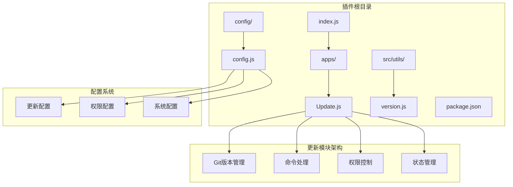
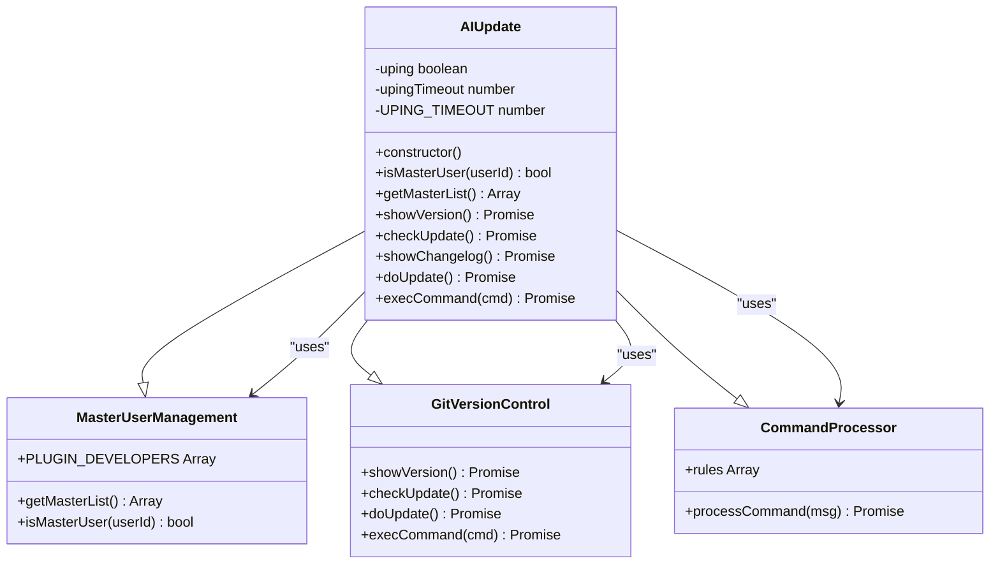
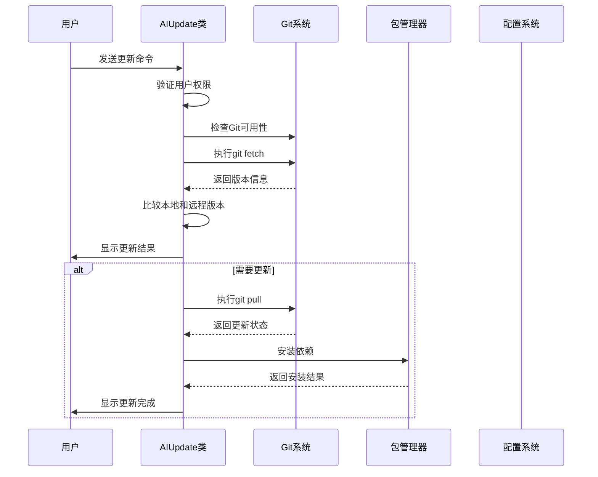
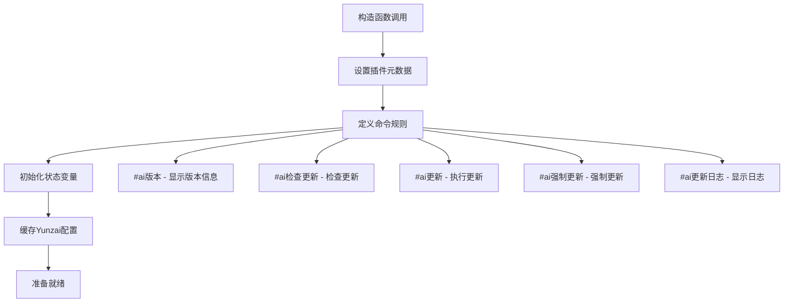
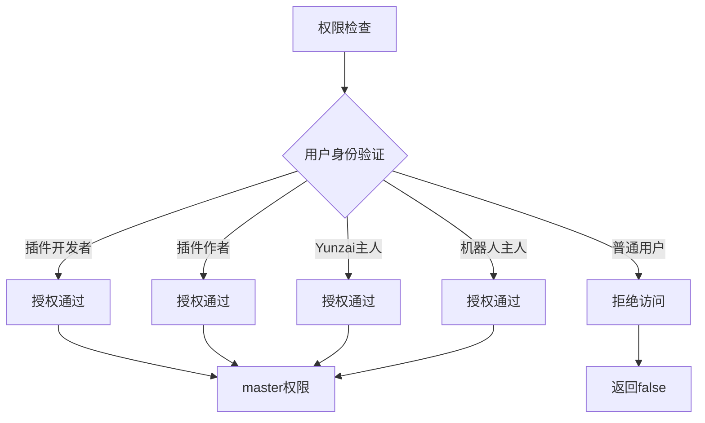
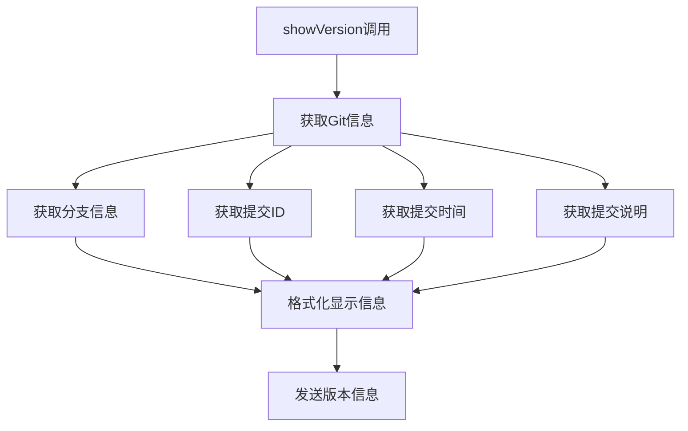
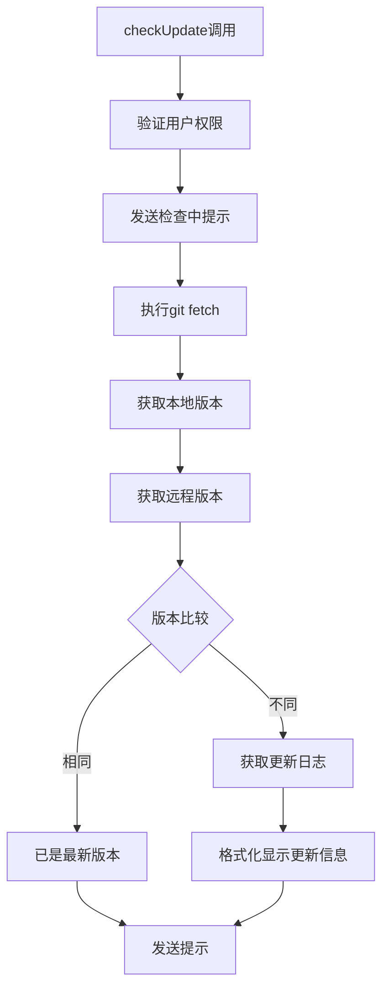
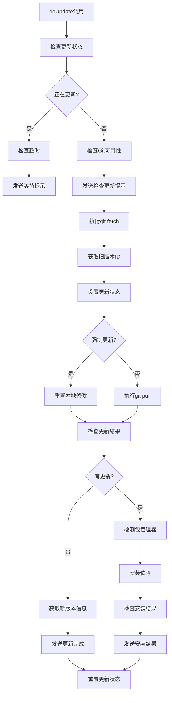
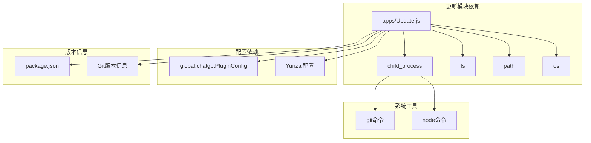

# 更新模块

<cite>
**本文档引用的文件**
- [apps/Update.js](file://apps/Update.js)
- [config/config.js](file://config/config.js)
- [index.js](file://index.js)
- [src/utils/version.js](file://src/utils/version.js)
- [README.md](file://README.md)
- [cliff.toml](file://cliff.toml)
- [package.json](file://package.json)
</cite>

## 目录
1. [简介](#简介)
2. [项目结构](#项目结构)
3. [核心组件](#核心组件)
4. [架构概览](#架构概览)
5. [详细组件分析](#详细组件分析)
6. [依赖关系分析](#依赖关系分析)
7. [性能考虑](#性能考虑)
8. [故障排除指南](#故障排除指南)
9. [结论](#结论)

## 简介

更新模块是 ChatAI Plugin 插件中的一个关键组件，负责处理插件的版本检查、更新和维护功能。该模块基于 Git 版本控制系统，提供了完整的自动化更新流程，包括版本比较、更新下载和安装等核心功能。

更新模块的主要目标是为用户提供便捷的插件更新体验，支持自动检查更新、强制更新以及详细的更新日志展示。该模块集成了多种安全机制，包括更新状态管理、超时控制和错误恢复功能。

## 项目结构

更新模块在项目中的位置和组织结构如下：

**图表来源**
- [apps/Update.js](file://apps/Update.js#L1-L362)
- [config/config.js](file://config/config.js#L288-L294)
- [index.js](file://index.js#L114-L136)

**章节来源**
- [apps/Update.js](file://apps/Update.js#L1-L55)
- [config/config.js](file://config/config.js#L288-L294)
- [index.js](file://index.js#L114-L136)

## 核心组件

更新模块的核心组件包括以下几个主要部分：

### 1. AIUpdate 类
这是更新模块的主要类，继承自 Yunzai 的 plugin 基类，提供了完整的更新功能实现。

### 2. Git 版本管理系统
基于 Git 命令的版本管理，包括版本检查、更新下载和状态跟踪。

### 3. 权限控制系统
实现了多层次的权限控制，包括插件开发者、作者和机器人主人的权限管理。

### 4. 命令处理器
处理各种更新相关的命令，如检查更新、强制更新、版本查看等。

**章节来源**
- [apps/Update.js](file://apps/Update.js#L26-L55)
- [apps/Update.js](file://apps/Update.js#L60-L103)
- [apps/Update.js](file://apps/Update.js#L166-L208)

## 架构概览

更新模块采用分层架构设计，具有清晰的职责分离和良好的扩展性：

**图表来源**
- [apps/Update.js](file://apps/Update.js#L26-L362)

### 更新流程架构

**图表来源**
- [apps/Update.js](file://apps/Update.js#L246-L347)

## 详细组件分析

### AIUpdate 类分析

AIUpdate 类是更新模块的核心实现，具有以下关键特性：

#### 构造函数和初始化

**图表来源**
- [apps/Update.js](file://apps/Update.js#L26-L55)

#### 权限管理系统

权限系统支持多层次的权限控制：

**图表来源**
- [apps/Update.js](file://apps/Update.js#L60-L103)

**章节来源**
- [apps/Update.js](file://apps/Update.js#L26-L103)

### 版本管理功能

版本管理功能提供了完整的 Git 版本信息获取和展示：

#### 版本信息获取流程

**图表来源**
- [apps/Update.js](file://apps/Update.js#L109-L160)

**章节来源**
- [apps/Update.js](file://apps/Update.js#L109-L160)

### 更新检查功能

更新检查功能实现了智能的版本比较和更新检测：

#### 更新检查流程

**图表来源**
- [apps/Update.js](file://apps/Update.js#L166-L208)

**章节来源**
- [apps/Update.js](file://apps/Update.js#L166-L208)

### 更新执行功能

更新执行功能是最复杂的部分，包含了完整的更新流程：

#### 完整更新流程

**图表来源**
- [apps/Update.js](file://apps/Update.js#L246-L347)

**章节来源**
- [apps/Update.js](file://apps/Update.js#L246-L347)

### 配置系统集成

更新模块与配置系统的集成提供了灵活的配置选项：

#### 更新配置选项
| 配置项 | 类型 | 默认值 | 描述 |
|--------|------|--------|------|
| update.autoCheck | boolean | true | 启用自动检查更新 |
| update.checkOnStart | boolean | true | 启动时检查更新 |
| update.autoUpdate | boolean | false | 自动更新（不推荐） |
| update.autoRestart | boolean | false | 更新后自动重启 |
| update.notifyMaster | boolean | true | 有更新时通知主人 |

**章节来源**
- [config/config.js](file://config/config.js#L288-L294)

## 依赖关系分析

更新模块的依赖关系相对简单，主要依赖于系统工具和配置：

**图表来源**
- [apps/Update.js](file://apps/Update.js#L5-L13)
- [apps/Update.js](file://apps/Update.js#L22-L24)

### 外部依赖

更新模块的主要外部依赖包括：

1. **Git**: 用于版本管理和更新操作
2. **包管理器**: 支持 npm 和 pnpm
3. **操作系统**: 支持 Windows、Linux 和 macOS

**章节来源**
- [apps/Update.js](file://apps/Update.js#L300-L315)
- [package.json](file://package.json#L16-L45)

## 性能考虑

更新模块在设计时充分考虑了性能和用户体验：

### 并发控制
- 使用 `uping` 标志防止重复更新
- 实现 2 分钟超时机制
- 检查更新状态的防抖处理

### 资源管理
- 异步命令执行避免阻塞主线程
- Git 操作的错误处理和恢复
- 内存使用优化

### 用户体验
- 实时进度反馈
- 详细的错误信息
- 清晰的状态指示

## 故障排除指南

### 常见问题及解决方案

#### Git 相关问题
| 问题 | 可能原因 | 解决方案 |
|------|----------|----------|
| 无法找到 Git | Git 未安装或不在 PATH 中 | 安装 Git 并添加到系统 PATH |
| Git 版本检查失败 | Git 命令执行异常 | 检查 Git 安装完整性 |
| 权限不足 | 用户权限不够 | 使用管理员权限运行 |

#### 更新相关问题
| 问题 | 可能原因 | 解决方案 |
|------|----------|----------|
| 更新失败 | 网络连接问题 | 检查网络连接，重试更新 |
| 依赖安装失败 | 包管理器问题 | 清理缓存，重新安装依赖 |
| 版本冲突 | 本地修改导致 | 使用强制更新或手动解决冲突 |

#### 权限相关问题
| 问题 | 可能原因 | 解决方案 |
|------|----------|----------|
| 无权限执行更新 | 用户不是主人 | 添加用户到主人列表 |
| 权限配置错误 | 配置文件损坏 | 检查配置文件格式 |
| 多层次权限冲突 | 权限层级混乱 | 检查插件开发者、作者和主人配置 |

**章节来源**
- [apps/Update.js](file://apps/Update.js#L260-L270)
- [apps/Update.js](file://apps/Update.js#L290-L294)

### 调试技巧

1. **启用详细日志**: 在配置中启用调试模式
2. **检查系统状态**: 验证 Git 和包管理器安装
3. **查看错误信息**: 仔细阅读更新过程中的错误提示
4. **手动验证**: 手动执行相关命令验证问题

## 结论

更新模块为 ChatAI Plugin 提供了完整、可靠的版本管理解决方案。该模块具有以下优势：

### 设计优势
- **模块化设计**: 清晰的职责分离和良好的扩展性
- **安全性**: 多层次权限控制和错误恢复机制
- **用户体验**: 实时反馈和详细的错误信息
- **可靠性**: 超时控制和并发管理

### 功能特性
- **自动化程度高**: 支持自动检查和更新
- **灵活性强**: 支持强制更新和手动控制
- **兼容性好**: 支持多种操作系统和包管理器
- **可配置性强**: 丰富的配置选项满足不同需求

### 改进建议
1. **增强错误处理**: 添加更多类型的错误恢复机制
2. **优化性能**: 考虑增量更新和并行下载
3. **改进用户体验**: 添加更新进度可视化和取消功能
4. **增强安全性**: 添加数字签名验证和完整性检查

更新模块作为插件生态系统的重要组成部分，为用户提供了便捷、可靠的更新体验，是插件持续演进和维护的重要保障。