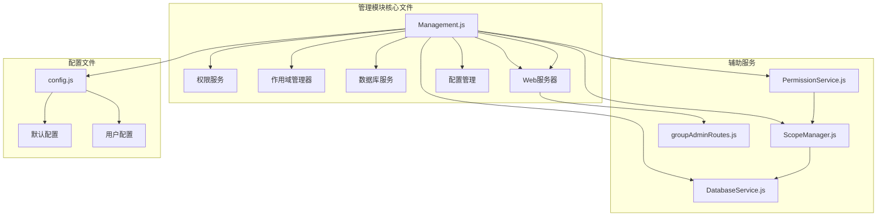
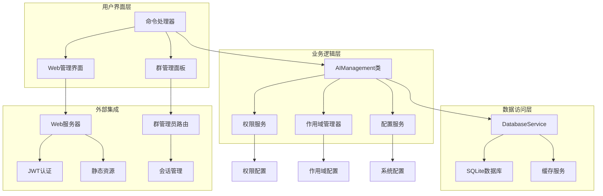
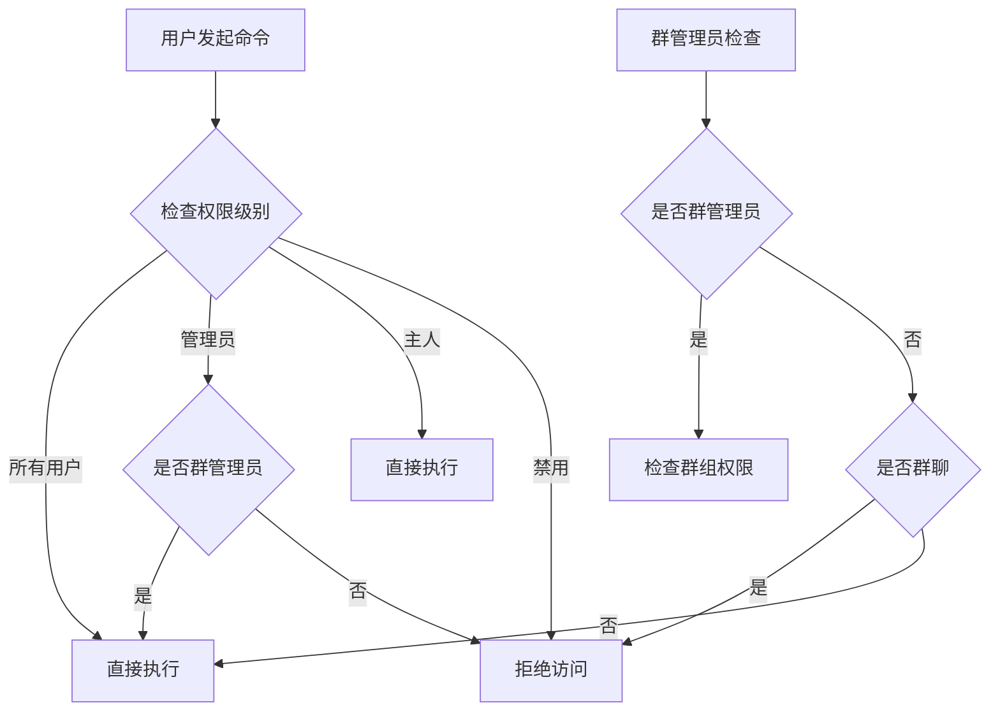
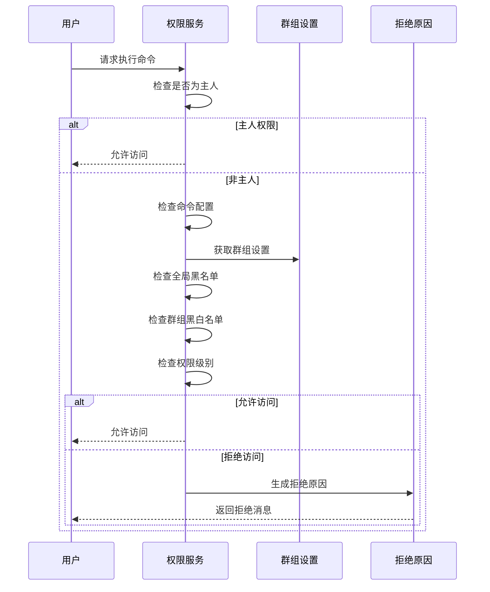
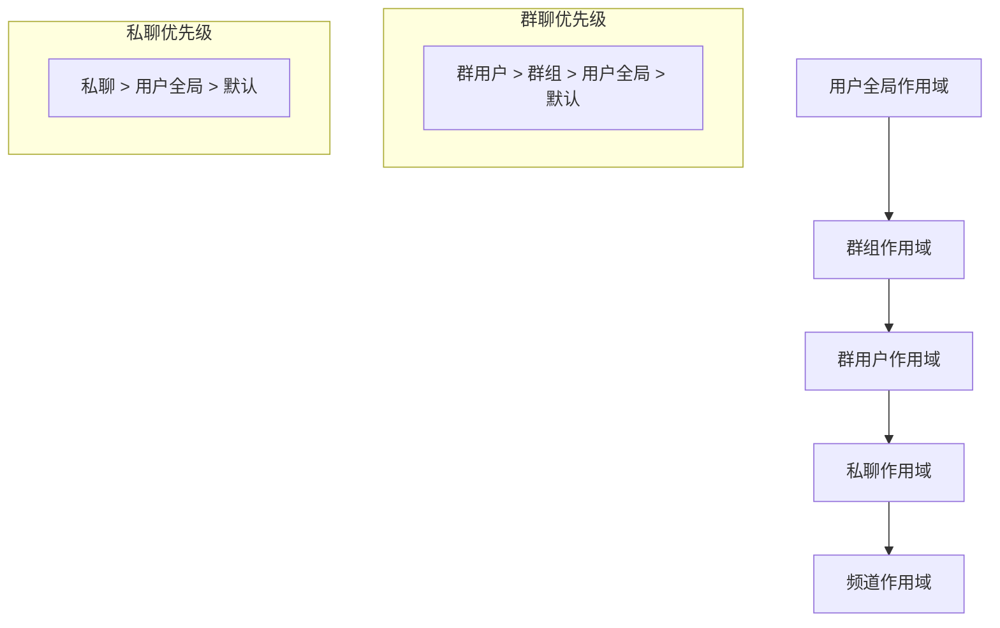
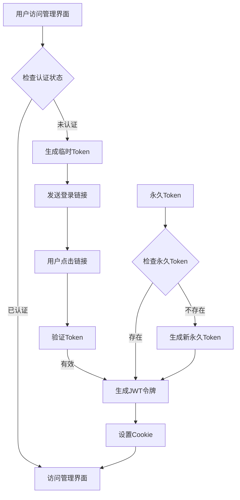
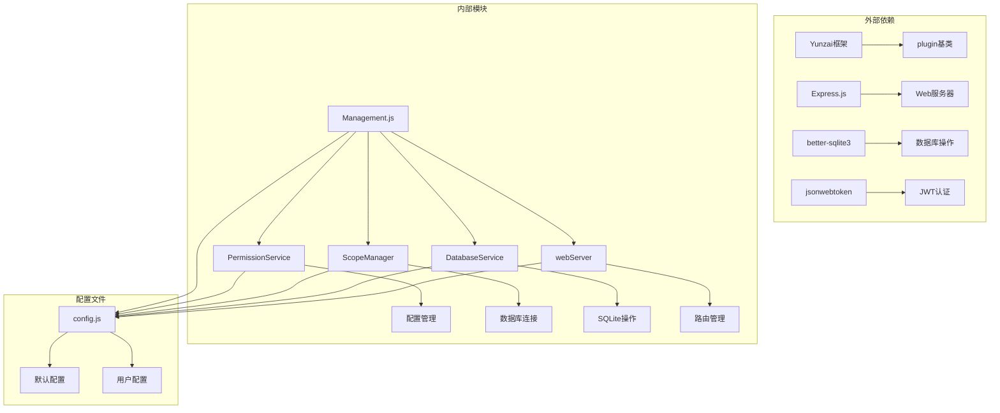

# 管理模块

<cite>
**本文档引用的文件**
- [Management.js](file://apps/Management.js)
- [PermissionService.js](file://src/services/permission/PermissionService.js)
- [ScopeManager.js](file://src/services/scope/ScopeManager.js)
- [DatabaseService.js](file://src/services/storage/DatabaseService.js)
- [webServer.js](file://src/services/webServer.js)
- [groupAdminRoutes.js](file://src/services/routes/groupAdminRoutes.js)
- [config.js](file://config/config.js)
- [Commands.js](file://apps/Commands.js)
</cite>

## 目录
1. [简介](#简介)
2. [项目结构](#项目结构)
3. [核心组件](#核心组件)
4. [架构概览](#架构概览)
5. [详细组件分析](#详细组件分析)
6. [依赖关系分析](#依赖关系分析)
7. [性能考虑](#性能考虑)
8. [故障排除指南](#故障排除指南)
9. [结论](#结论)

## 简介

管理模块是 ChatGPT 插件的核心管理组件，负责提供全面的系统管理功能。该模块实现了用户管理、群组管理、权限控制和系统配置管理等功能，为插件的日常运营和维护提供了强大的工具支持。

管理模块的主要特点包括：
- **多层级权限控制**：支持主人、管理员、普通用户等多级权限管理
- **群组独立配置**：为不同群组提供独立的配置和管理能力
- **Web 管理界面**：提供直观的图形化管理界面
- **操作审计**：完整的操作记录和审计功能
- **安全机制**：多层次的安全防护和权限验证

## 项目结构

管理模块位于插件的 apps 目录下，主要由以下核心文件组成：

**图表来源**
- [Management.js](file://apps/Management.js#L1-L1217)
- [PermissionService.js](file://src/services/permission/PermissionService.js#L1-L484)
- [ScopeManager.js](file://src/services/scope/ScopeManager.js#L1-L800)

**章节来源**
- [Management.js](file://apps/Management.js#L1-L1217)
- [config.js](file://config/config.js#L1-L631)

## 核心组件

管理模块包含以下核心组件：

### 1. AIManagement 类
这是管理模块的主要控制器，继承自 Yunzai 框架的 plugin 基类，负责处理所有管理相关的命令和操作。

### 2. 权限控制系统
基于 PermissionService 实现的多层级权限管理，支持：
- 主人权限（最高权限）
- 群管理员权限
- 普通用户权限
- 白名单和黑名单机制

### 3. 作用域管理器
ScopeManager 提供了五层作用域管理：
- 用户全局作用域
- 群组作用域  
- 群用户作用域
- 私聊作用域
- 频道作用域

### 4. 数据持久化
DatabaseService 提供了完整的数据存储和管理功能，包括：
- SQLite 数据库操作
- 记忆数据管理
- 会话历史存储
- 配置数据持久化

**章节来源**
- [Management.js](file://apps/Management.js#L18-L135)
- [PermissionService.js](file://src/services/permission/PermissionService.js#L22-L484)
- [ScopeManager.js](file://src/services/scope/ScopeManager.js#L17-L121)
- [DatabaseService.js](file://src/services/storage/DatabaseService.js#L19-L800)

## 架构概览

管理模块采用分层架构设计，确保了良好的可维护性和扩展性：

**图表来源**
- [Management.js](file://apps/Management.js#L18-L135)
- [webServer.js](file://src/services/webServer.js#L279-L757)
- [groupAdminRoutes.js](file://src/services/routes/groupAdminRoutes.js#L15-L189)

## 详细组件分析

### AIManagement 类分析

AIManagement 类是管理模块的核心，实现了完整的管理功能：

#### 权限检查机制

**图表来源**
- [PermissionService.js](file://src/services/permission/PermissionService.js#L337-L421)

#### 管理命令处理流程

管理模块支持以下主要命令类别：

##### 用户管理命令
- `#ai设置人格 <内容>` - 设置个人专属人格
- `#ai查看人格` - 查看当前生效的人格
- `#ai清除人格` - 清除个人人格设定

##### 群组管理命令
- `#ai群设置` - 查看本群功能状态
- `#ai群伪人开启/关闭` - 本群伪人模式开关
- `#ai群绘图开启/关闭` - 本群绘图功能开关

##### 系统管理命令
- `#ai管理面板` - 获取管理面板链接
- `#ai状态` - 查看插件运行状态
- `#ai调试开启/关闭` - 调试模式开关

**章节来源**
- [Management.js](file://apps/Management.js#L27-L133)
- [Management.js](file://apps/Management.js#L564-L698)

### 权限服务分析

PermissionService 提供了完整的权限管理功能：

#### 权限级别定义

| 权限级别 | 描述 | 可执行操作 |
|---------|------|-----------|
| all | 所有用户 | 基础对话功能 |
| whitelist | 白名单用户 | 特定受限功能 |
| admin | 群管理员 | 群组管理功能 |
| master | 主人 | 所有功能 |

#### 权限检查流程

**图表来源**
- [PermissionService.js](file://src/services/permission/PermissionService.js#L337-L421)

**章节来源**
- [PermissionService.js](file://src/services/permission/PermissionService.js#L22-L484)

### 作用域管理器分析

ScopeManager 实现了五层作用域管理：

#### 作用域层次结构

**图表来源**
- [ScopeManager.js](file://src/services/scope/ScopeManager.js#L7-L16)

#### 配置存储结构

作用域管理器使用 SQLite 数据库存储配置信息：

| 表名 | 用途 | 存储内容 |
|------|------|----------|
| user_scopes | 用户全局配置 | 用户ID、系统提示词、预设ID、设置 |
| group_scopes | 群组配置 | 群组ID、系统提示词、预设ID、知识库ID |
| group_user_scopes | 群用户配置 | 群组ID+用户ID、系统提示词、预设ID |
| private_scopes | 私聊配置 | 用户ID、系统提示词、预设ID |
| group_usage_limits | 群组使用限制 | 群组ID+日期、使用计数、用户使用情况 |

**章节来源**
- [ScopeManager.js](file://src/services/scope/ScopeManager.js#L26-L120)
- [ScopeManager.js](file://src/services/scope/ScopeManager.js#L211-L317)

### Web 管理界面分析

Web 管理界面提供了图形化的管理体验：

#### 登录认证机制

**图表来源**
- [webServer.js](file://src/services/webServer.js#L235-L274)
- [webServer.js](file://src/services/webServer.js#L341-L375)

#### 群管理员功能

群管理员路由提供了下放的管理权限：

| 功能 | 描述 | 权限要求 |
|------|------|----------|
| 群配置管理 | 修改群组设置 | 群管理员 |
| 黑白名单管理 | 管理群组黑白名单 | 群管理员 |
| 使用限制设置 | 设置群组使用限制 | 群管理员 |
| 群独立渠道 | 配置群组独立渠道 | 群管理员 |
| 表情小偷管理 | 管理表情收集功能 | 群管理员 |

**章节来源**
- [webServer.js](file://src/services/webServer.js#L279-L757)
- [groupAdminRoutes.js](file://src/services/routes/groupAdminRoutes.js#L196-L234)

## 依赖关系分析

管理模块的依赖关系如下：

**图表来源**
- [Management.js](file://apps/Management.js#L5-L11)
- [config.js](file://config/config.js#L8-L630)

**章节来源**
- [Management.js](file://apps/Management.js#L5-L11)
- [config.js](file://config/config.js#L8-L630)

## 性能考虑

管理模块在设计时充分考虑了性能优化：

### 数据库优化
- 使用 WAL 模式提升并发性能
- 合理的索引设计优化查询性能
- 连接池管理减少连接开销

### 缓存策略
- 内存缓存常用配置数据
- 会话状态缓存减少数据库查询
- 静态资源缓存提升页面加载速度

### 异步处理
- 异步数据库操作避免阻塞
- 并行网络请求优化响应时间
- 流式数据处理减少内存占用

## 故障排除指南

### 常见问题及解决方案

#### 权限相关问题
**问题**：用户无法执行管理命令
**解决方案**：
1. 检查用户权限级别配置
2. 验证群组管理员身份
3. 确认命令是否被禁用

#### 数据库连接问题
**问题**：配置无法保存或读取失败
**解决方案**：
1. 检查数据库文件权限
2. 验证磁盘空间充足
3. 重启数据库服务

#### Web 界面访问问题
**问题**：管理界面无法访问
**解决方案**：
1. 检查端口占用情况
2. 验证防火墙设置
3. 确认 SSL 证书配置

**章节来源**
- [PermissionService.js](file://src/services/permission/PermissionService.js#L427-L449)
- [DatabaseService.js](file://src/services/storage/DatabaseService.js#L26-L45)
- [webServer.js](file://src/services/webServer.js#L637-L673)

## 结论

管理模块为 ChatGPT 插件提供了全面、安全、易用的管理功能。通过多层级权限控制、灵活的作用域管理和完善的审计机制，确保了系统的安全性和可维护性。

### 主要优势
- **安全性**：多层次权限控制和操作审计
- **灵活性**：支持群组独立配置和个性化管理
- **易用性**：提供图形化管理界面和丰富的命令支持
- **可扩展性**：模块化设计便于功能扩展和定制

### 未来改进方向
- 增强实时监控和告警功能
- 优化大规模部署的性能表现
- 扩展更多管理功能和自动化工具
- 改进用户体验和界面设计

管理模块的设计充分体现了现代软件工程的最佳实践，为插件的长期发展奠定了坚实的基础。