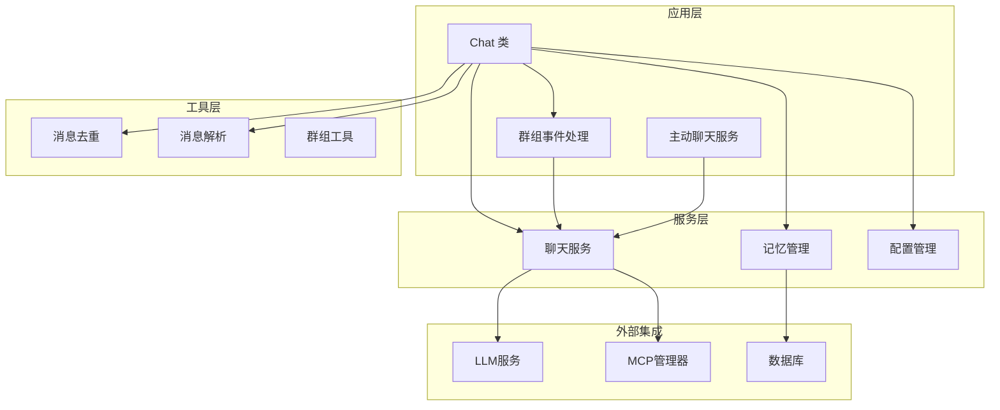
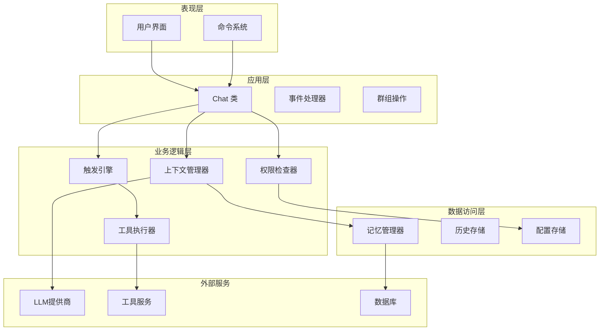
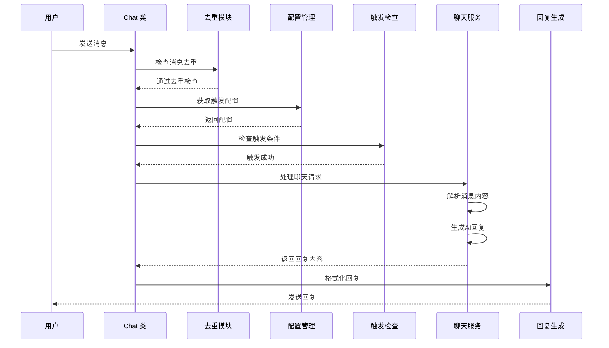
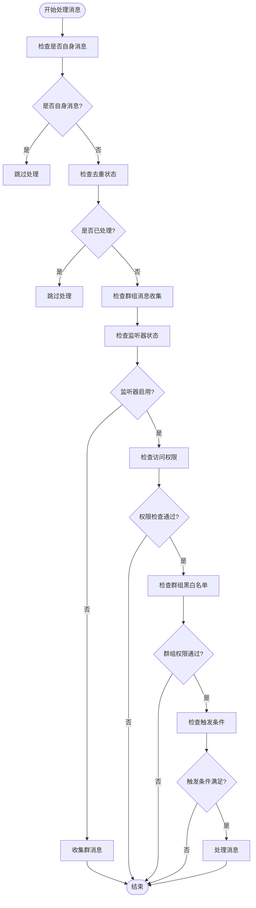
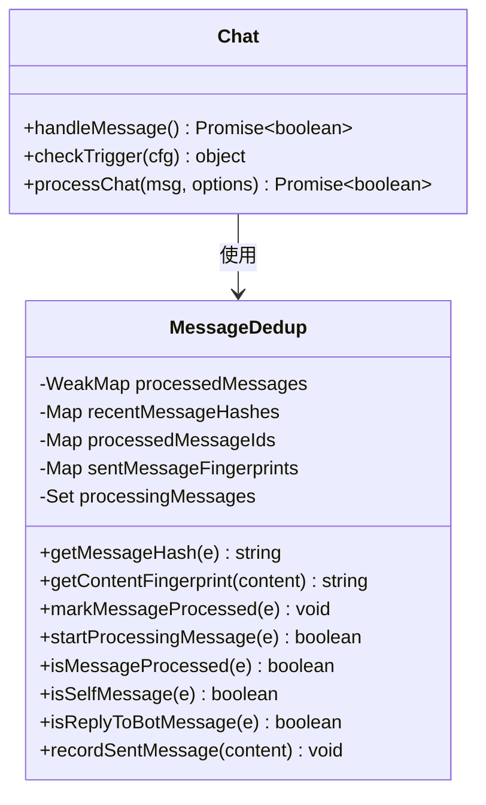
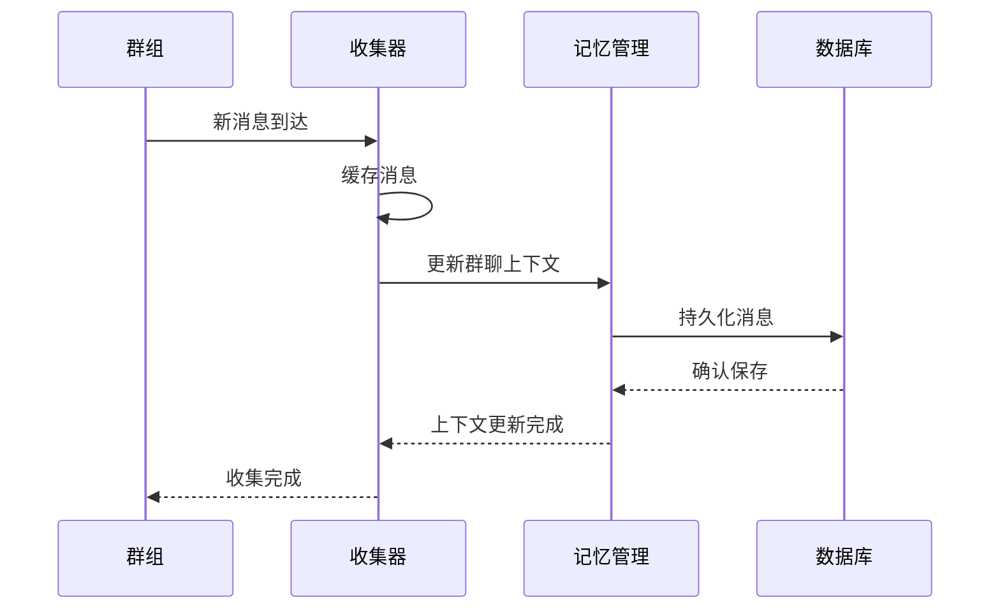
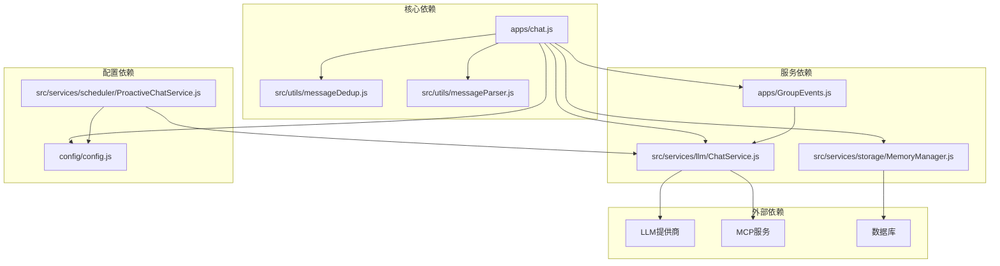
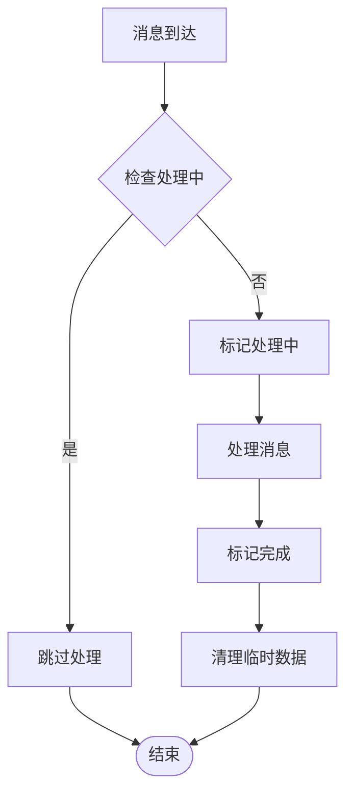

# 聊天处理模块


## 目录
1. [简介](#简介)
2. [项目结构](#项目结构)
3. [核心组件](#核心组件)
4. [架构概览](#架构概览)
5. [详细组件分析](#详细组件分析)
6. [依赖关系分析](#依赖关系分析)
7. [性能考虑](#性能考虑)
8. [故障排除指南](#故障排除指南)
9. [结论](#结论)

## 简介

聊天处理模块是Yunzai插件生态系统中的核心组件，负责处理各种平台的聊天消息，包括私聊和群聊场景。该模块实现了智能的消息触发机制、权限控制系统、消息去重保护、群组消息收集、前缀检查、@机器人处理等功能。

模块采用模块化设计，通过事件驱动的方式处理消息，支持多种触发模式和灵活的配置选项。它集成了上下文管理、工具调用、记忆管理、主动聊天等多种高级功能。

## 项目结构

聊天处理模块主要由以下几个核心部分组成：



**图表来源**
- [chat.js](file://apps/chat.js#L89-L203)
- [messageDedup.js](file://src/utils/messageDedup.js#L1-L368)
- [messageParser.js](file://src/utils/messageParser.js#L1-L800)
- [ChatService.js](file://src/services/llm/ChatService.js#L46-L110)

**章节来源**
- [chat.js](file://apps/chat.js#L1-L962)
- [index.js](file://index.js#L1-L258)

## 核心组件

### Chat 类

Chat 类是聊天处理模块的核心控制器，继承自 Yunzai 的 plugin 基类，负责统一处理所有聊天消息。

#### 主要职责
- **消息入口处理**: 统一的 handleMessage 方法处理所有消息事件
- **触发条件判断**: 智能判断消息是否应该被处理
- **权限控制**: 验证用户和群组的访问权限
- **消息去重**: 防止重复处理相同消息
- **回复生成**: 调用聊天服务生成AI回复

#### 关键特性
- 支持私聊和群聊两种模式
- 灵活的触发模式配置
- 多层次的权限验证
- 智能的消息去重机制
- 支持前缀人格和@机器人功能

**章节来源**
- [chat.js](file://apps/chat.js#L89-L203)

### 消息去重模块

消息去重模块通过多种机制防止重复处理相同消息：

#### 去重策略
1. **事件对象去重**: 使用 WeakMap 记录已处理的事件对象
2. **消息ID去重**: 基于 message_id 的去重机制
3. **消息哈希去重**: 综合多个因素生成消息哈希
4. **正在处理标记**: 防止并发重复处理

#### 时间控制
- 消息去重过期时间: 10秒
- 发送消息指纹过期时间: 30秒
- 消息ID过期时间: 60秒

**章节来源**
- [messageDedup.js](file://src/utils/messageDedup.js#L1-L368)

### 消息解析器

消息解析器负责将不同平台的消息格式统一转换为标准格式：

#### 支持的消息类型
- 文本消息 (text)
- 图片消息 (image)
- 语音消息 (record)
- 视频消息 (video)
- 文件消息 (file)
- @消息 (at)
- 引用消息 (reply)
- 转发消息 (forward)
- JSON卡片 (json)
- XML消息 (xml)

#### 解析功能
- 统一消息段格式
- 提取@用户信息
- 处理图片URL
- 解析引用消息
- 清理CQ码

**章节来源**
- [messageParser.js](file://src/utils/messageParser.js#L1-L800)

### 聊天服务

聊天服务是AI对话的核心处理引擎：

#### 核心功能
- **上下文管理**: 维护对话历史和上下文
- **预设管理**: 支持多种预设配置
- **工具调用**: 集成MCP工具系统
- **记忆集成**: 与记忆管理系统协作
- **渠道管理**: 支持多个AI服务提供商

#### 高级特性
- 群聊共享上下文
- 用户独立人设
- 记忆上下文增强
- 知识库集成
- 错误自动清理

**章节来源**
- [ChatService.js](file://src/services/llm/ChatService.js#L46-L110)

## 架构概览

聊天处理模块采用分层架构设计，各层职责明确，耦合度低：



**图表来源**
- [chat.js](file://apps/chat.js#L89-L203)
- [ChatService.js](file://src/services/llm/ChatService.js#L20-L31)

## 详细组件分析

### Chat 类详细分析

#### 消息处理流程



**图表来源**
- [chat.js](file://apps/chat.js#L109-L203)
- [messageDedup.js](file://src/utils/messageDedup.js#L177-L212)

#### 触发条件判断机制

触发条件检查是聊天模块的核心逻辑：



**图表来源**
- [chat.js](file://apps/chat.js#L122-L192)

#### 权限控制系统

权限控制采用多层次验证机制：

1. **全局黑名单/白名单**: 用户和群组级别的全局控制
2. **群组独立配置**: 每个群组的独立黑白名单设置
3. **列表模式**: 支持黑名单模式和白名单模式
4. **实时检查**: 每次消息到达时进行权限验证

**章节来源**
- [chat.js](file://apps/chat.js#L245-L293)

### 消息去重机制

消息去重是防止系统重复处理相同消息的重要机制：

#### 去重策略详解



**图表来源**
- [messageDedup.js](file://src/utils/messageDedup.js#L1-L368)
- [chat.js](file://apps/chat.js#L109-L203)

#### 去重算法复杂度

- **时间复杂度**: O(1) 平均情况，基于哈希表查找
- **空间复杂度**: O(n) 其中 n 是缓存的消息数量
- **内存管理**: 自动清理过期数据，防止内存泄漏

**章节来源**
- [messageDedup.js](file://src/utils/messageDedup.js#L1-L368)

### 群组消息收集

群组消息收集功能用于构建群聊上下文和记忆：

#### 收集机制



**图表来源**
- [GroupEvents.js](file://apps/GroupEvents.js#L117-L150)
- [MemoryManager.js](file://src/services/storage/MemoryManager.js#L114-L156)

#### 上下文分析

群组消息收集不仅用于实时响应，还用于：

1. **记忆提取**: 从群聊对话中提取有价值的信息
2. **话题分析**: 识别群聊的主要讨论话题
3. **关系建立**: 分析群成员之间的关系
4. **用户画像**: 建立群成员的特征画像

**章节来源**
- [GroupEvents.js](file://apps/GroupEvents.js#L114-L156)
- [MemoryManager.js](file://src/services/storage/MemoryManager.js#L163-L346)

### 前缀检查和@机器人处理

#### 前缀检查机制

前缀检查支持多种前缀类型：

1. **普通前缀**: 如 "#chat"、"#ai"
2. **前缀人格**: 特定场景下的专用前缀
3. **多语言支持**: 支持中英文前缀
4. **动态配置**: 支持运行时修改前缀

#### @机器人处理

@机器人功能支持多种格式：

```mermaid
flowchart LR
Input[输入消息] --> Clean[清理@标记]
Clean --> CheckAt{检查@格式}
CheckAt --> |CQ码格式| ParseCQ[解析CQ码]
CheckAt --> |文本格式| ParseText[解析文本@]
CheckAt --> |昵称格式| ParseNick[解析昵称@]
ParseCQ --> Filter[过滤机器人ID]
ParseText --> Filter
ParseNick --> Filter
Filter --> Result[清理后的消息]
```

**图表来源**
- [chat.js](file://apps/chat.js#L418-L444)

**章节来源**
- [chat.js](file://apps/chat.js#L386-L444)

## 依赖关系分析

聊天处理模块的依赖关系呈现清晰的分层结构：



**图表来源**
- [chat.js](file://apps/chat.js#L1-L34)
- [ChatService.js](file://src/services/llm/ChatService.js#L1-L19)

### 模块间耦合度分析

- **低耦合设计**: 各模块职责明确，接口清晰
- **依赖注入**: 通过构造函数和工厂模式管理依赖
- **事件驱动**: 通过事件机制实现模块间通信
- **配置驱动**: 通过配置文件控制行为

**章节来源**
- [index.js](file://index.js#L114-L136)
- [config.js](file://config/config.js#L1-L631)

## 性能考虑

### 内存管理

聊天模块采用了多项内存优化策略：

1. **缓存过期机制**: 自动清理过期的缓存数据
2. **弱引用使用**: 对事件对象使用 WeakMap 防止内存泄漏
3. **批量处理**: 群组消息采用批量处理减少内存占用
4. **延迟初始化**: 按需初始化昂贵的资源

### 并发处理



**图表来源**
- [messageDedup.js](file://src/utils/messageDedup.js#L157-L170)

### 性能优化建议

1. **合理配置缓存大小**: 根据服务器资源调整缓存容量
2. **监控内存使用**: 定期检查内存使用情况
3. **异步处理**: 对耗时操作使用异步处理
4. **连接池管理**: 合理管理外部服务连接

## 故障排除指南

### 常见问题诊断

#### 消息不响应

1. **检查触发配置**: 确认触发模式和前缀设置
2. **验证权限设置**: 检查用户和群组的权限配置
3. **查看日志**: 分析系统日志定位问题
4. **测试去重机制**: 确认消息去重功能正常

#### 性能问题

1. **监控内存使用**: 检查是否有内存泄漏
2. **分析缓存命中率**: 优化缓存配置
3. **检查并发处理**: 确认并发处理配置合理
4. **评估外部服务**: 监控LLM服务响应时间

#### 配置问题

1. **验证配置文件**: 检查 YAML 配置语法
2. **测试配置加载**: 确认配置正确加载
3. **检查权限设置**: 验证文件权限配置
4. **验证依赖服务**: 确认外部服务可用

**章节来源**
- [chat.js](file://apps/chat.js#L634-L640)
- [messageDedup.js](file://src/utils/messageDedup.js#L347-L368)

## 结论

聊天处理模块是一个设计精良、功能完备的聊天系统，具有以下特点：

### 核心优势

1. **模块化设计**: 清晰的分层架构，职责分离明确
2. **灵活配置**: 支持丰富的配置选项和动态调整
3. **高性能**: 优化的内存管理和并发处理机制
4. **扩展性强**: 良好的接口设计支持功能扩展
5. **稳定性高**: 完善的错误处理和恢复机制

### 技术亮点

- **智能触发机制**: 支持多种触发模式和灵活的配置
- **强大的去重系统**: 多层次的去重策略防止重复处理
- **上下文管理**: 智能的对话上下文维护
- **工具集成**: 完整的MCP工具系统集成
- **记忆管理**: 基于AI的记忆提取和管理

### 应用场景

该模块适用于各种聊天应用场景，包括但不限于：

- **智能客服**: 自动回答用户问题
- **群组管理**: 群组活动管理和事件响应
- **内容创作**: 基于上下文的创意内容生成
- **数据分析**: 群组对话分析和洞察
- **主动交互**: 基于情境的主动聊天功能

通过其强大的功能和灵活的设计，聊天处理模块为构建智能化的聊天系统提供了坚实的基础。
