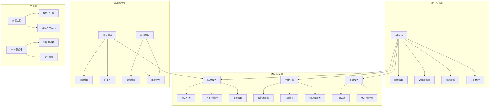
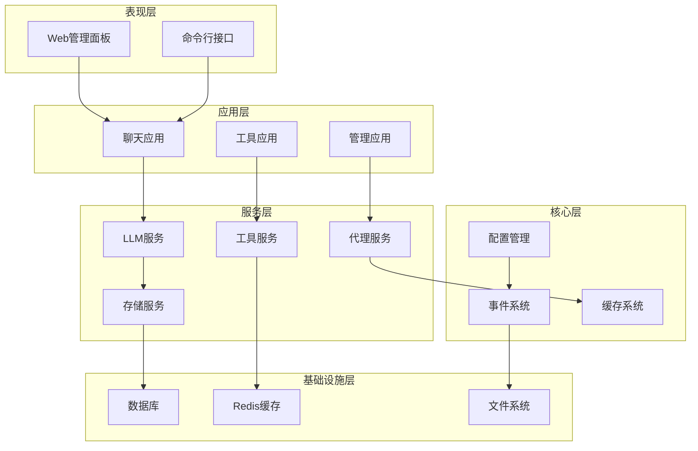
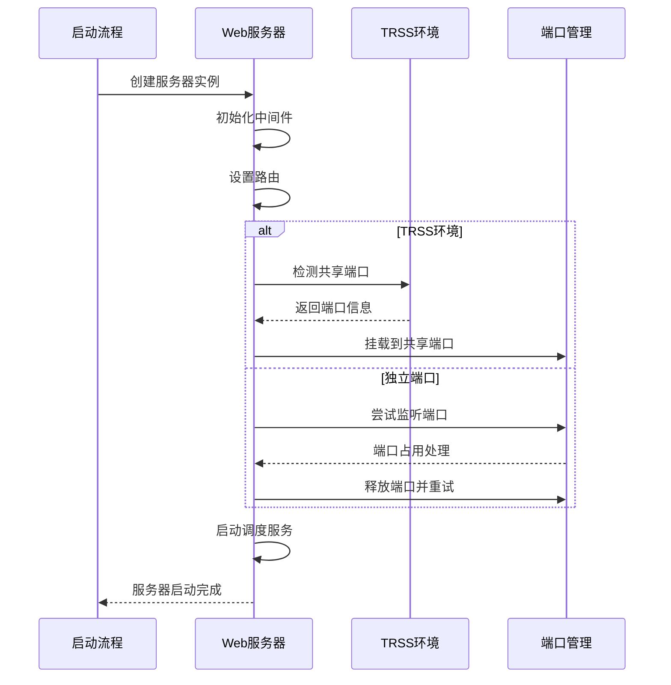
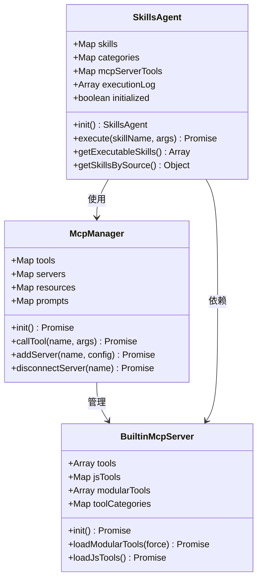
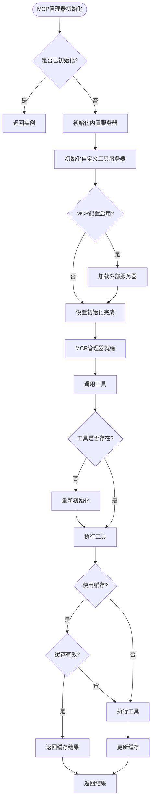
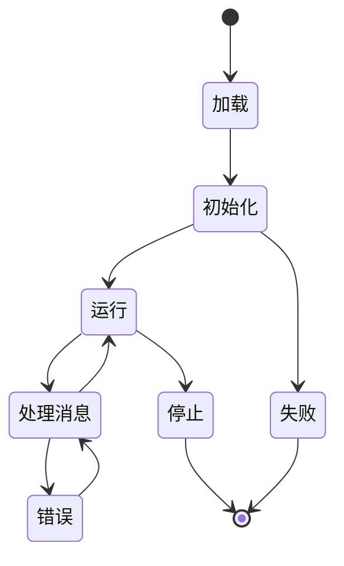
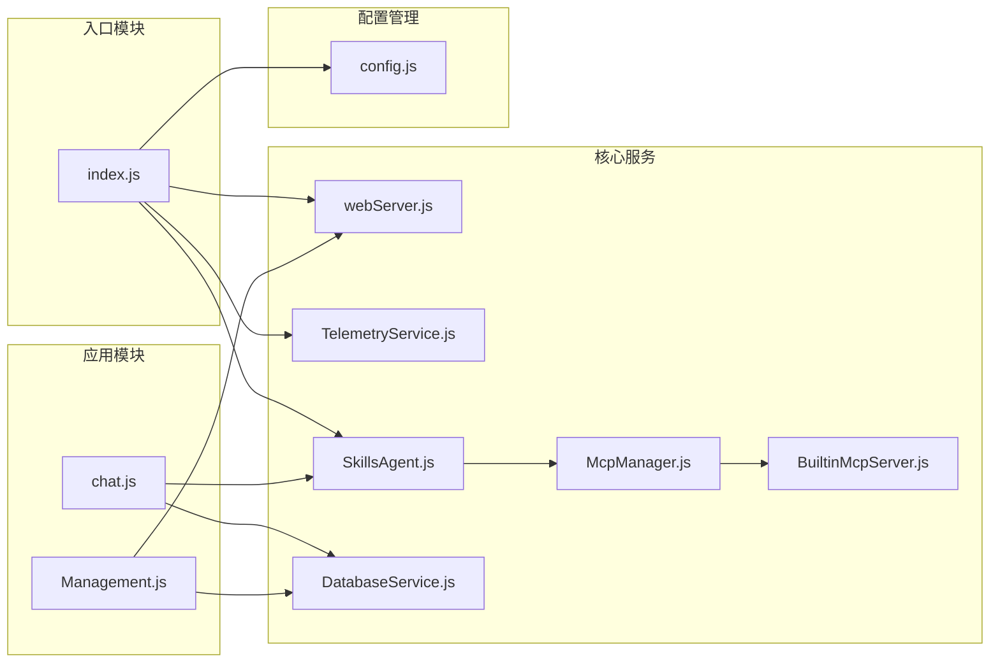

# 模块生命周期


## 目录
1. [简介](#简介)
2. [项目结构](#项目结构)
3. [核心组件](#核心组件)
4. [架构概览](#架构概览)
5. [详细组件分析](#详细组件分析)
6. [依赖分析](#依赖分析)
7. [性能考虑](#性能考虑)
8. [故障排除指南](#故障排除指南)
9. [结论](#结论)

## 简介

ChatAI 插件为 Yunzai-Bot 提供了完整的 AI 聊天功能，包含多模型支持、MCP 工具调用、智能对话管理、长期记忆系统等强大功能。本文档深入分析该插件的模块生命周期管理，涵盖从模块加载、初始化、运行到卸载的完整过程。

## 项目结构

ChatAI 插件采用模块化架构设计，主要分为以下几个层次：



**图表来源**
- [index.js](file://index.js#L1-L258)
- [config.js](file://config/config.js#L1-L631)

**章节来源**
- [index.js](file://index.js#L1-L258)
- [package.json](file://package.json#L1-L53)

## 核心组件

### 插件入口模块 (index.js)

插件入口模块负责整个插件的生命周期管理，包括模块加载、初始化和资源管理。

**初始化流程**：
1. **环境准备**：检查并设置全局 segment 对象
2. **配置同步**：初始化配置管理系统
3. **并行初始化**：同时启动 Web 服务器、遥测服务、技能代理
4. **应用模块加载**：动态加载所有应用模块
5. **状态报告**：输出初始化完成信息

**关键特性**：
- 使用 Promise.allSettled 并行初始化多个服务
- 支持模块热重载和动态加载
- 提供统一的技能代理接口

**章节来源**
- [index.js](file://index.js#L1-L258)

### 配置管理系统 (config.js)

配置管理系统提供完整的配置管理功能，支持 YAML 格式的配置文件管理和运行时配置更新。

**核心功能**：
- 配置文件的加载和解析
- 默认配置的合并和覆盖
- 运行时配置的动态更新
- 配置验证和类型检查

**章节来源**
- [config.js](file://config/config.js#L1-L631)

## 架构概览

ChatAI 插件采用分层架构设计，各层之间职责清晰，耦合度低：



**图表来源**
- [index.js](file://index.js#L1-L258)
- [chat.js](file://apps/chat.js#L1-L962)
- [Management.js](file://apps/Management.js#L1-L1217)

## 详细组件分析

### Web 服务器生命周期 (webServer.js)

Web 服务器提供管理面板和 API 接口，支持 TRSS 环境下的端口共享模式。



**图表来源**
- [webServer.js](file://src/services/webServer.js#L582-L756)

**生命周期阶段**：
1. **启动阶段**：初始化 Express 应用、设置中间件、配置路由
2. **端口分配**：检测 TRSS 环境，选择共享端口或独立端口
3. **服务启动**：启动 HTTP 服务器，注册健康检查和认证中间件
4. **调度初始化**：启动周期性任务调度服务
5. **运行阶段**：处理请求，提供管理面板和 API 接口
6. **停止阶段**：优雅关闭 HTTP 服务器，清理资源

**章节来源**
- [webServer.js](file://src/services/webServer.js#L1-L807)

### 技能代理生命周期 (SkillsAgent.js)

技能代理提供统一的工具/技能管理接口，整合内置工具、自定义 JS 工具和外部 MCP 服务器工具。



**图表来源**
- [SkillsAgent.js](file://src/services/agent/SkillsAgent.js#L21-L601)
- [McpManager.js](file://src/mcp/McpManager.js#L27-L800)
- [BuiltinMcpServer.js](file://src/mcp/BuiltinMcpServer.js#L218-L800)

**生命周期管理**：
1. **初始化阶段**：加载 MCP 管理器和工具过滤服务，设置工具上下文
2. **工具加载**：从 MCP 管理器获取工具列表，应用权限过滤
3. **MCP 服务器管理**：加载外部 MCP 服务器工具，按服务器分组管理
4. **执行阶段**：权限检查、参数填充、工具执行、结果处理
5. **缓存管理**：工具结果缓存，过期清理
6. **状态跟踪**：执行日志记录，性能监控

**章节来源**
- [SkillsAgent.js](file://src/services/agent/SkillsAgent.js#L1-L601)

### MCP 管理器生命周期 (McpManager.js)

MCP 管理器负责管理内置工具、自定义 JS 工具和外部 MCP 服务器。



**图表来源**
- [McpManager.js](file://src/mcp/McpManager.js#L106-L800)

**核心功能**：
- **服务器管理**：连接、断开、重连外部 MCP 服务器
- **工具管理**：工具发现、注册、执行、缓存
- **配置管理**：服务器配置的加载、保存、更新
- **资源管理**：工具资源的管理和访问
- **安全控制**：危险工具拦截、权限检查

**章节来源**
- [McpManager.js](file://src/mcp/McpManager.js#L1-L1268)

### 数据库服务生命周期 (DatabaseService.js)

数据库服务提供统一的数据持久化管理，基于 better-sqlite3 实现。

**生命周期阶段**：
1. **初始化阶段**：创建数据目录，初始化 SQLite 数据库
2. **表结构创建**：创建消息、记忆、键值存储等表结构
3. **连接管理**：建立数据库连接，配置 WAL 模式
4. **数据操作**：提供 CRUD 操作接口
5. **清理阶段**：优雅关闭数据库连接

**章节来源**
- [DatabaseService.js](file://src/services/storage/DatabaseService.js#L1-L809)

### 应用模块生命周期

应用模块采用插件化设计，每个应用模块都有独立的生命周期管理。



**章节来源**
- [chat.js](file://apps/chat.js#L89-L962)
- [Management.js](file://apps/Management.js#L18-L1217)

## 依赖分析

### 外部依赖关系

```mermaid
graph TB
subgraph "核心依赖"
A[Node.js 18+] --> B[better-sqlite3]
A --> C[express]
A --> D[axios]
A --> E[uuid]
end
subgraph "AI服务依赖"
F[OpenAI SDK] --> G[openai]
H[Anthropic SDK] --> I[@anthropic-ai/sdk]
J[Google SDK] --> K[@google/generative-ai]
end
subgraph "工具依赖"
L[Canvas] --> M[@napi-rs/canvas]
N[Sharp] --> O[sharp]
P[Tesseract] --> Q[tesseract.js]
R[QRCode] --> S[qrcode]
end
subgraph "网络依赖"
T[WebSocket] --> U[ws]
W[EventSource] --> X[eventsource]
Y[HTTP代理] --> Z[http-proxy-agent]
end
```

**图表来源**
- [package.json](file://package.json#L16-L45)

### 内部模块依赖



**图表来源**
- [index.js](file://index.js#L1-L258)
- [SkillsAgent.js](file://src/services/agent/SkillsAgent.js#L1-L601)
- [McpManager.js](file://src/mcp/McpManager.js#L1-L1268)

**章节来源**
- [package.json](file://package.json#L1-L53)

## 性能考虑

### 并行初始化优化

插件采用并行初始化策略，显著提升启动性能：

1. **配置同步**：立即开始配置文件同步
2. **Web服务器**：异步启动 HTTP 服务器
3. **遥测服务**：并行初始化遥测客户端
4. **技能代理**：异步加载技能和工具
5. **应用模块**：并行加载所有应用模块

### 缓存策略

- **工具结果缓存**：MCP 工具调用结果缓存，支持 TTL 过期
- **配置缓存**：群组触发配置缓存，减少重复查询
- **数据库连接池**：SQLite 连接复用，减少连接开销
- **文件监听缓存**：自定义工具文件变化监听，避免频繁重载

### 资源管理

- **内存管理**：及时清理工具执行日志和临时数据
- **连接管理**：外部 MCP 服务器连接池管理
- **文件句柄**：数据库文件句柄自动管理
- **定时器清理**：遥测服务定时器的优雅关闭

## 故障排除指南

### 常见启动问题

**数据库初始化失败**：
- 检查 better-sqlite3 原生模块编译
- 验证 data 目录写入权限
- 清理损坏的数据库文件

**端口占用问题**：
- 检查端口占用情况
- 配置自动端口切换
- TRSS 环境下的端口共享

**配置加载失败**：
- 验证 YAML 格式正确性
- 检查配置文件权限
- 使用默认配置回退

### 运行时问题诊断

**MCP 服务器连接失败**：
- 检查服务器配置正确性
- 验证网络连接和认证
- 查看服务器日志

**工具执行异常**：
- 检查工具参数验证
- 查看工具执行日志
- 验证权限配置

**内存泄漏问题**：
- 监控工具执行日志大小
- 检查定时器清理
- 验证事件监听器移除

**章节来源**
- [README.md](file://README.md#L553-L793)

## 结论

ChatAI 插件的模块生命周期管理体现了现代 Node.js 应用的最佳实践：

1. **模块化设计**：清晰的分层架构，职责分离明确
2. **异步初始化**：并行启动多个服务，提升启动性能
3. **资源管理**：完善的生命周期管理，支持优雅关闭
4. **错误处理**：全面的错误处理和恢复机制
5. **监控诊断**：详细的日志记录和状态监控

该插件为 Yunzai-Bot 生态系统提供了强大而灵活的 AI 聊天能力，其模块化架构设计为未来的功能扩展和维护奠定了坚实基础。通过合理的生命周期管理策略，确保了系统的稳定性、性能和可维护性。
