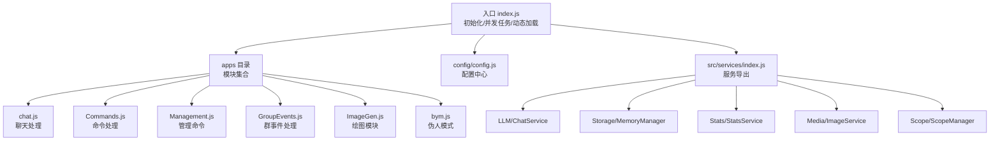
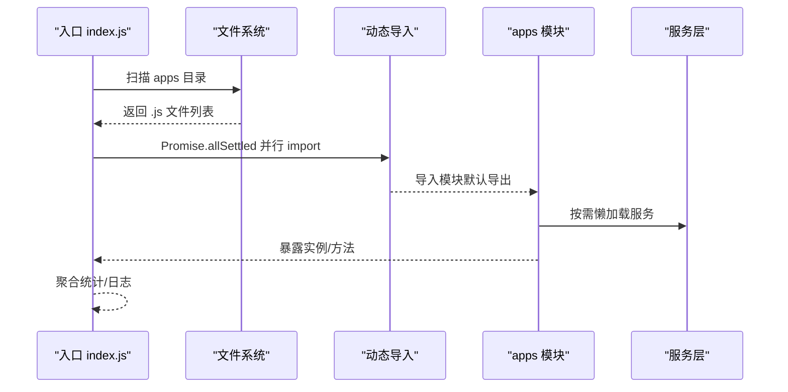
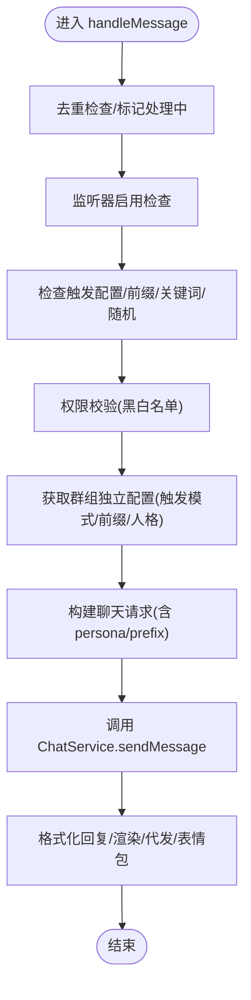
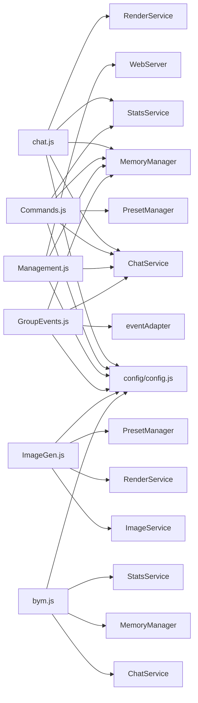
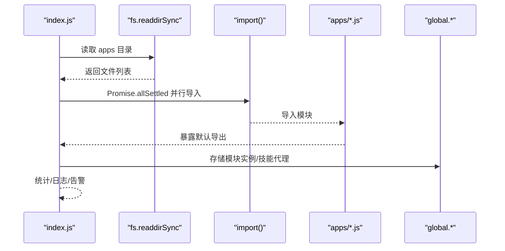

# 模块系统

<cite>
**本文档引用的文件**
- [index.js](file://index.js)
- [chat.js](file://apps/chat.js)
- [Commands.js](file://apps/Commands.js)
- [Management.js](file://apps/Management.js)
- [GroupEvents.js](file://apps/GroupEvents.js)
- [ImageGen.js](file://apps/ImageGen.js)
- [bym.js](file://apps/bym.js)
- [config.js](file://config/config.js)
- [index.js](file://src/services/index.js)
</cite>

## 目录
1. [简介](#简介)
2. [项目结构](#项目结构)
3. [核心组件](#核心组件)
4. [架构总览](#架构总览)
5. [详细组件分析](#详细组件分析)
6. [依赖分析](#依赖分析)
7. [性能考虑](#性能考虑)
8. [故障排查指南](#故障排查指南)
9. [结论](#结论)
10. [附录](#附录)

## 简介
本文件系统性阐述 ChatAI 插件的模块化设计与实现，重点覆盖以下方面：
- 应用模块的组织结构与职责划分
- 动态加载机制与模块生命周期
- 模块间通信方式与配置驱动的可扩展性
- apps 目录下各模块的职责与交互
- 模块加载流程（从文件扫描到动态导入）
- 生命周期管理（初始化、运行时状态维护、卸载）
- 模块开发最佳实践与扩展指南

## 项目结构
插件采用“入口聚合 + 动态模块加载 + 配置驱动”的架构：
- 入口文件负责初始化、并发任务、动态加载 apps 目录下的模块，并汇总统计与日志
- apps 目录下的每个 JS 文件代表一个独立的插件模块，遵循统一的插件基类规范
- config 目录提供集中配置管理，支持默认值合并与持久化
- src/services 提供核心服务层（LLM、存储、统计、媒体、路由等），被各模块按需懒加载

图表来源
- [index.js](file://index.js#L114-L136)
- [chat.js](file://apps/chat.js#L89-L104)
- [Commands.js](file://apps/Commands.js#L119-L181)
- [Management.js](file://apps/Management.js#L18-L135)
- [GroupEvents.js](file://apps/GroupEvents.js#L392-L420)
- [ImageGen.js](file://apps/ImageGen.js#L298-L323)
- [bym.js](file://apps/bym.js#L19-L34)
- [config.js](file://config/config.js#L1-L631)
- [index.js](file://src/services/index.js#L1-L68)

章节来源
- [index.js](file://index.js#L114-L136)
- [config.js](file://config/config.js#L18-L38)

## 核心组件
- 入口与动态加载
  - 并发初始化：segment 兼容库、Web 服务、遥测、技能代理、Hitokoto
  - 动态加载：扫描 apps 目录，过滤 update.js，Promise.allSettled 并行导入，聚合结果与统计
  - 导出：apps（模块实例）、skills（技能代理门面）
- 配置中心
  - YAML 持久化配置，深合并默认配置与用户配置，提供 get/set
- 服务层
  - LLM、存储、统计、媒体、代理、路由、作用域、QQBot 代理等

章节来源
- [index.js](file://index.js#L17-L174)
- [config.js](file://config/config.js#L18-L626)
- [index.js](file://src/services/index.js#L1-L68)

## 架构总览
模块系统采用“事件驱动 + 插件基类 + 懒加载 + 配置驱动”的组合：
- 每个模块通过继承统一的插件基类注册事件、规则与优先级
- 模块内部按需懒加载所需服务，避免启动时的资源浪费
- 配置中心贯穿全局，决定触发策略、功能开关、模型与渠道等

图表来源
- [index.js](file://index.js#L117-L121)
- [chat.js](file://apps/chat.js#L37-L47)
- [Commands.js](file://apps/Commands.js#L1-L25)
- [Management.js](file://apps/Management.js#L1-L16)
- [GroupEvents.js](file://apps/GroupEvents.js#L24-L36)
- [ImageGen.js](file://apps/ImageGen.js#L15-L43)
- [bym.js](file://apps/bym.js#L1-L13)

## 详细组件分析

### 聊天处理模块（apps/chat.js）
- 职责
  - 统一消息入口，解析触发条件（@机器人、前缀、关键词、随机等）
  - 权限校验（黑白名单、群组独立配置）
  - 构造聊天请求，调用 ChatService 发送消息
  - 处理回复（文本/图片/音频），支持数学公式渲染、表情包小偷、官方Bot代发
  - 记录统计、消息去重、群消息缓存
- 关键点
  - 通过 config.get('trigger') 与群组 ScopeManager 获取独立配置
  - setToolContext/mcpManager.setToolContext 为工具链注入上下文
  - 懒加载 QQBotSender 与 ScopeManager

图表来源
- [chat.js](file://apps/chat.js#L109-L203)
- [chat.js](file://apps/chat.js#L298-L381)
- [chat.js](file://apps/chat.js#L464-L641)

章节来源
- [chat.js](file://apps/chat.js#L89-L104)
- [chat.js](file://apps/chat.js#L109-L203)
- [chat.js](file://apps/chat.js#L298-L381)
- [chat.js](file://apps/chat.js#L464-L641)

### 命令处理模块（apps/Commands.js）
- 职责
  - 高优先级命令处理（结束对话、清除记忆、对话状态、群聊总结、个人画像、管理面板等）
  - 调用 LLM/存储/统计/渲染等服务，支持 Markdown 渲染为图片
  - 群组功能开关与模型配置的独立控制
- 关键点
  - 通过 ScopeManager 获取群组独立配置
  - 私聊/临时消息安全发送管理面板链接
  - Debug 模式会话状态（内存）

章节来源
- [Commands.js](file://apps/Commands.js#L119-L181)
- [Commands.js](file://apps/Commands.js#L234-L279)
- [Commands.js](file://apps/Commands.js#L565-L690)
- [Commands.js](file://apps/Commands.js#L695-L800)

### 管理模块（apps/Management.js）
- 职责
  - 提供群内管理命令（群伪人开关、群绘图开关、群设置、管理面板、状态、帮助、调试开关、伪人开关、模型设置、渠道与限制等）
  - 严格权限控制（群管理员/群主/插件主人）
  - 通过 Web 服务生成一次性登录链接，支持二维码（QQBot 平台）
- 关键点
  - 管理面板链接生成与私聊/临时消息发送
  - 群组独立功能开关与模型配置

章节来源
- [Management.js](file://apps/Management.js#L18-L135)
- [Management.js](file://apps/Management.js#L275-L512)
- [Management.js](file://apps/Management.js#L536-L559)

### 群事件处理模块（apps/GroupEvents.js）
- 职责
  - 统一监听群事件（入群、退群、撤回、禁言、精华、管理员变更、运气王、荣誉等）
  - 支持自定义提示词模板与占位符替换
  - 事件概率控制、去重、消息缓存与群活跃度统计
- 关键点
  - 适配多平台事件（icqq/NapCat/OneBot/TRSS/Lagrange 等）
  - 懒加载 ScopeManager 与数据库服务
  - 通过 ChatService 生成 AI 响应并发送

章节来源
- [GroupEvents.js](file://apps/GroupEvents.js#L392-L420)
- [GroupEvents.js](file://apps/GroupEvents.js#L482-L659)
- [GroupEvents.js](file://apps/GroupEvents.js#L664-L754)

### 绘图模块（apps/ImageGen.js）
- 职责
  - 文生图/图生图/文生视频/图生视频
  - 预设模板管理（内置/自定义/远程缓存），支持热重载与更新
  - 群组独立开关与模型配置
  - API 状态查询与 Markdown 渲染为图片
- 关键点
  - 预设管理器 PresetManager，构建正则匹配关键词
  - 懒加载 StatsService/ImageService/ScopeManager/DatabaseService
  - 通过 RenderService 渲染状态图

章节来源
- [ImageGen.js](file://apps/ImageGen.js#L298-L323)
- [ImageGen.js](file://apps/ImageGen.js#L437-L466)
- [ImageGen.js](file://apps/ImageGen.js#L471-L604)
- [ImageGen.js](file://apps/ImageGen.js#L739-L782)

### 伪人模式模块（apps/bym.js）
- 职责
  - 随机触发模拟真人回复，支持继承用户/群组独立人格
  - 关键词触发、概率控制、图片处理、上下文注入
  - 统计记录与表情包小偷联动
- 关键点
  - 通过 ScopeManager 获取有效配置（含群组知识库）
  - 伪人模式专用系统提示词与行为指导
  - 与 MemoryManager、ChatService、StatsService 协作

章节来源
- [bym.js](file://apps/bym.js#L19-L34)
- [bym.js](file://apps/bym.js#L39-L559)

## 依赖分析
- 模块耦合
  - apps 模块之间低耦合，通过 config 与服务层间接交互
  - 服务层集中于 src/services，模块按需懒加载，避免全局依赖
- 外部依赖
  - 配置中心：YAML 文件持久化
  - 平台适配：支持多适配器（icqq/NapCat/OneBot/TRSS/Lagrange 等）
  - Web 服务：提供管理面板与登录链接
- 循环依赖
  - 通过懒加载避免循环依赖；若出现，建议拆分接口或引入中间层

图表来源
- [chat.js](file://apps/chat.js#L1-L25)
- [Commands.js](file://apps/Commands.js#L1-L16)
- [Management.js](file://apps/Management.js#L1-L10)
- [GroupEvents.js](file://apps/GroupEvents.js#L17-L75)
- [ImageGen.js](file://apps/ImageGen.js#L1-L8)
- [bym.js](file://apps/bym.js#L1-L12)
- [config.js](file://config/config.js#L1-L631)
- [index.js](file://src/services/index.js#L1-L68)

章节来源
- [index.js](file://src/services/index.js#L1-L68)

## 性能考虑
- 动态加载优化
  - 并行 Promise.allSettled 导入 apps 模块，缩短启动时间
  - 模块内部懒加载服务，避免冷启动时的资源占用
- 缓存与去重
  - 消息去重、群消息缓存、事件去重，减少重复处理
- 配置驱动
  - 通过 config.get 控制功能开关与阈值，避免无效计算
- 渲染与 IO
  - 数学公式渲染与图片生成异步执行，必要时降级为文本输出

## 故障排查指南
- 模块加载失败
  - 检查 apps 目录文件命名与导出是否符合规范
  - 查看入口日志中的失败统计与错误信息
- 触发不生效
  - 核对 config 中 trigger 配置与群组独立配置
  - 确认黑白名单、@触发、前缀、关键词、随机概率设置
- 功能未启用
  - 检查 features.* 与群组独立开关
  - 确认 ScopeManager 与数据库初始化
- 绘图/渲染异常
  - 使用 #画图状态 查看 API 状态
  - 检查 RenderService 渲染失败回退逻辑
- 管理面板无法访问
  - 确认 Web 服务端口与登录链接生成
  - 检查私聊/临时消息权限

章节来源
- [index.js](file://index.js#L168-L173)
- [config.js](file://config/config.js#L564-L584)
- [ImageGen.js](file://apps/ImageGen.js#L471-L604)
- [Management.js](file://apps/Management.js#L275-L512)

## 结论
该模块系统通过“入口聚合 + 动态加载 + 配置驱动 + 懒加载服务”的设计，在保证灵活性的同时兼顾性能与可维护性。apps 目录下的模块职责清晰、边界明确，配合统一的插件基类与服务层，实现了良好的扩展性与可观测性。

## 附录

### 模块加载流程（代码级）

图表来源
- [index.js](file://index.js#L117-L121)
- [index.js](file://index.js#L123-L136)

### 模块生命周期（概览）
- 初始化
  - 入口并发初始化 segment/Web/遥测/技能代理
  - 动态加载 apps 模块并注册事件
- 运行时
  - 按需懒加载服务，事件驱动处理
  - 通过 config 控制行为与开关
- 卸载/重载
  - 通过重新导入入口实现模块重载
  - 配置变更通过 config.set 触发持久化与生效

章节来源
- [index.js](file://index.js#L17-L112)
- [config.js](file://config/config.js#L591-L626)

### 模块开发最佳实践
- 命名与导出
  - 模块文件名与类名语义化，导出统一的插件类实例
- 事件与优先级
  - 明确 event、rule、priority，避免与其他模块抢占
- 懒加载与性能
  - 将重型服务与第三方库懒加载，减少冷启动开销
- 配置驱动
  - 将可变行为通过 config.get 控制，支持群组独立配置
- 错误处理
  - 捕获并记录异常，必要时回退到安全行为
- 日志与统计
  - 使用统一的日志与统计服务，便于监控与排障