# 模块间通信

<cite>
**本文档引用的文件**
- [index.js](file://index.js)
- [README.md](file://README.md)
- [eventAdapter.js](file://src/utils/eventAdapter.js)
- [common.js](file://src/utils/common.js)
- [chat.js](file://apps/chat.js)
- [Management.js](file://apps/Management.js)
- [webServer.js](file://src/services/webServer.js)
- [config.js](file://config/config.js)
- [McpManager.js](file://src/mcp/McpManager.js)
- [ChatService.js](file://src/services/llm/ChatService.js)
- [toolAdapter.js](file://src/core/utils/toolAdapter.js)
</cite>

## 目录
1. [引言](#引言)
2. [项目结构](#项目结构)
3. [核心组件](#核心组件)
4. [架构概览](#架构概览)
5. [详细组件分析](#详细组件分析)
6. [依赖分析](#依赖分析)
7. [性能考虑](#性能考虑)
8. [故障排除指南](#故障排除指南)
9. [结论](#结论)

## 引言

ChatAI 插件采用模块化架构设计，通过多种通信机制实现各应用模块之间的协作。该系统主要基于事件驱动模式、消息传递机制和共享状态管理，为 Yunzai-Bot 提供了完整的 AI 聊天解决方案。

## 项目结构

项目采用清晰的分层架构，主要分为以下几个层次：

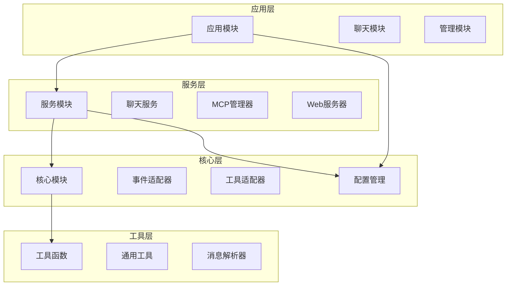

**图表来源**
- [index.js](file://index.js#L114-L136)
- [chat.js](file://apps/chat.js#L89-L104)
- [Management.js](file://apps/Management.js#L18-L35)

**章节来源**
- [README.md](file://README.md#L356-L396)
- [index.js](file://index.js#L114-L136)

## 核心组件

### 全局对象管理

系统通过全局对象实现模块间的统一访问：

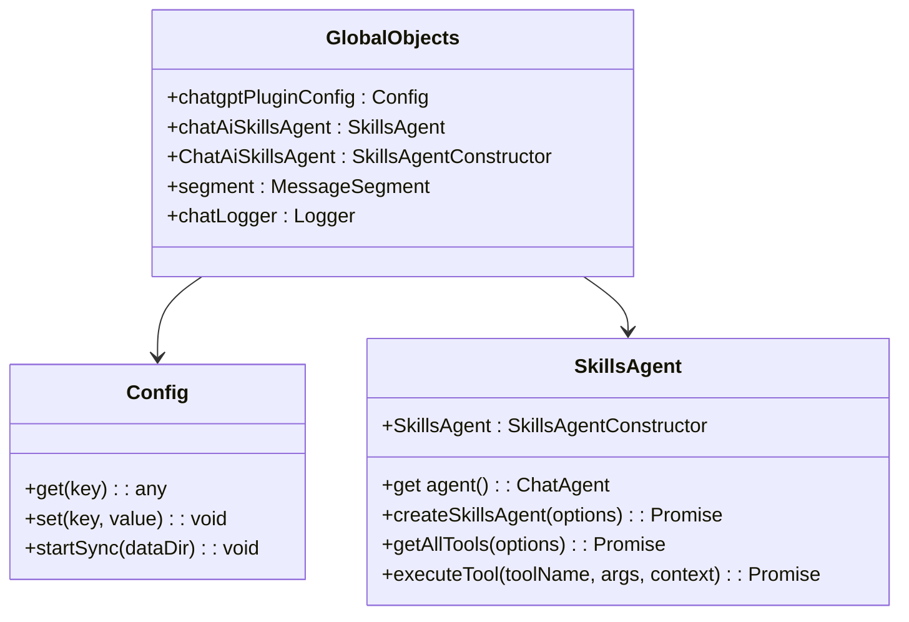

**图表来源**
- [index.js](file://index.js#L36-L91)
- [config.js](file://config/config.js#L8-L630)

### 事件驱动架构

系统采用事件驱动模式处理各种消息和事件：

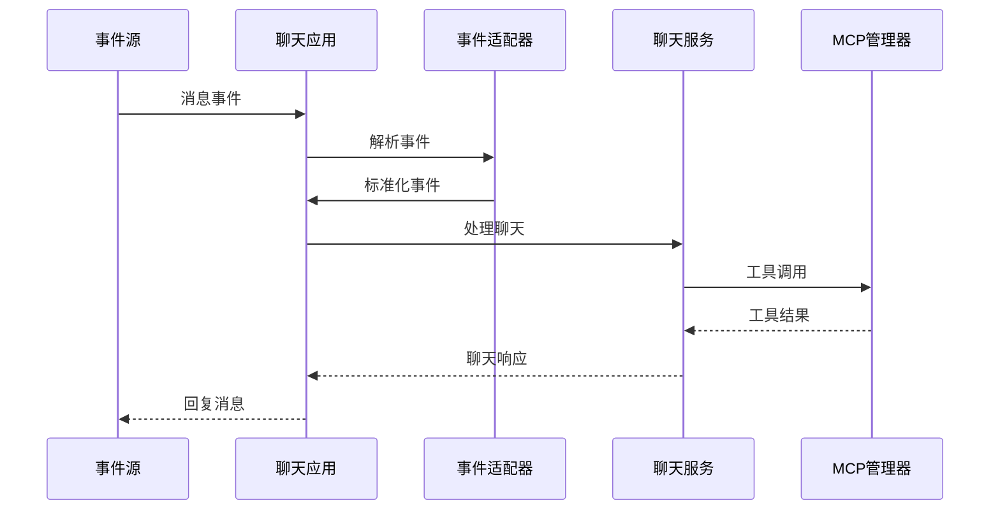

**图表来源**
- [chat.js](file://apps/chat.js#L109-L203)
- [eventAdapter.js](file://src/utils/eventAdapter.js#L13-L43)
- [ChatService.js](file://src/services/llm/ChatService.js#L68-L110)

**章节来源**
- [chat.js](file://apps/chat.js#L89-L203)
- [eventAdapter.js](file://src/utils/eventAdapter.js#L1-L800)

## 架构概览

### 模块间通信机制

系统实现了多层次的通信架构：

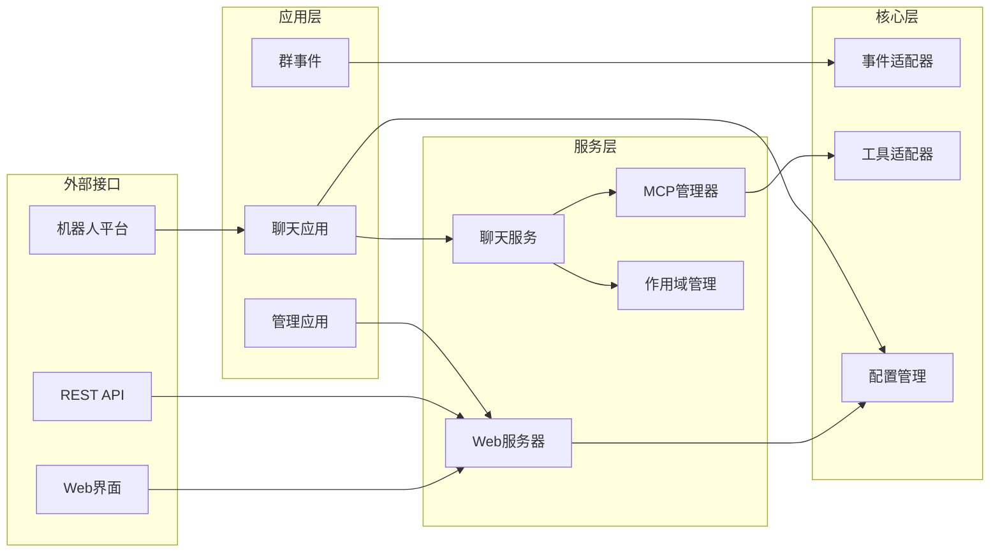

**图表来源**
- [webServer.js](file://src/services/webServer.js#L279-L356)
- [ChatService.js](file://src/services/llm/ChatService.js#L46-L66)
- [McpManager.js](file://src/mcp/McpManager.js#L27-L49)

### 通信协议设计

系统支持多种通信协议：

| 协议类型 | 用途 | 实现方式 |
|---------|------|----------|
| HTTP/HTTPS | Web API通信 | Express.js框架 |
| WebSocket | 实时数据传输 | SSE和WebSocket |
| JSON-RPC | 远程过程调用 | 自定义RPC实现 |
| 事件总线 | 模块间事件传递 | EventEmitter模式 |

**章节来源**
- [webServer.js](file://src/services/webServer.js#L1-L807)
- [config.js](file://config/config.js#L283-L287)

## 详细组件分析

### 聊天应用模块

聊天应用模块是系统的核心交互层：

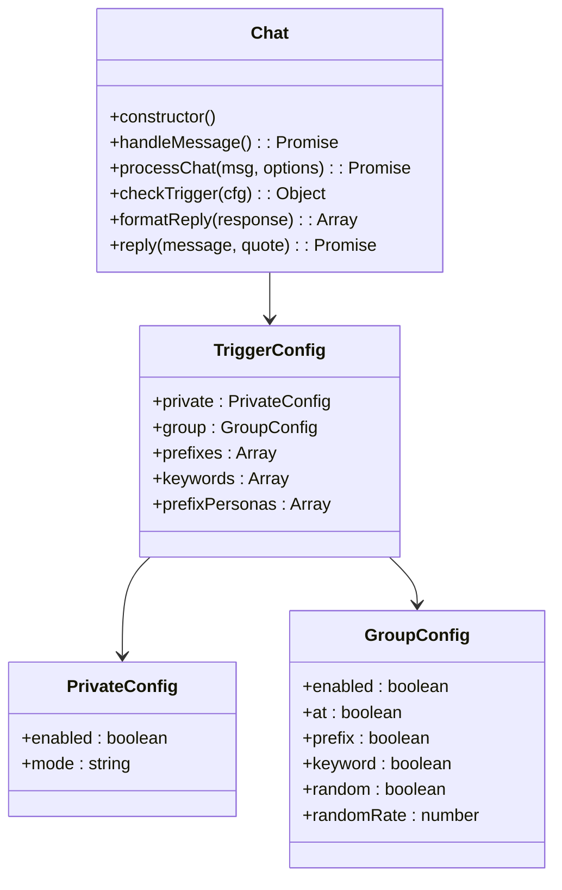

**图表来源**
- [chat.js](file://apps/chat.js#L89-L203)
- [chat.js](file://apps/chat.js#L208-L240)

#### 触发机制分析

系统实现了灵活的触发机制：

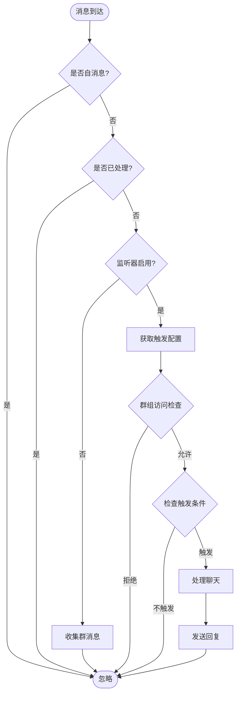

**图表来源**
- [chat.js](file://apps/chat.js#L109-L203)
- [chat.js](file://apps/chat.js#L298-L381)

**章节来源**
- [chat.js](file://apps/chat.js#L89-L641)

### 管理应用模块

管理应用模块提供 Web 界面和命令行管理功能：

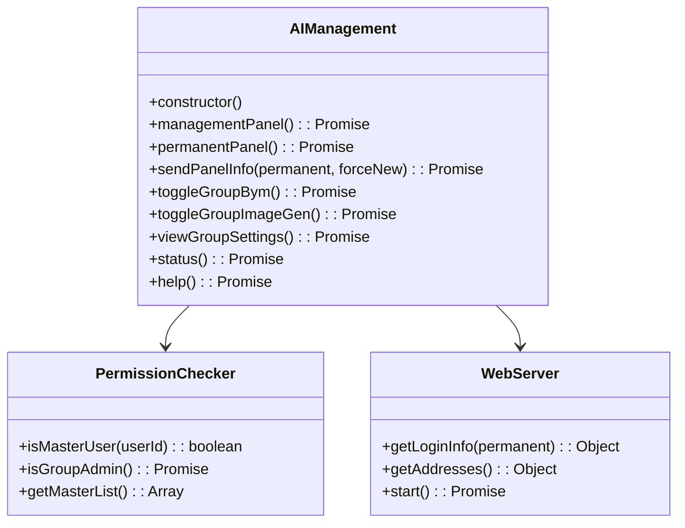

**图表来源**
- [Management.js](file://apps/Management.js#L18-L135)
- [Management.js](file://apps/Management.js#L140-L178)
- [webServer.js](file://src/services/webServer.js#L539-L580)

**章节来源**
- [Management.js](file://apps/Management.js#L18-L800)

### MCP 管理器

MCP（Model Context Protocol）管理器负责工具调用和外部服务集成：

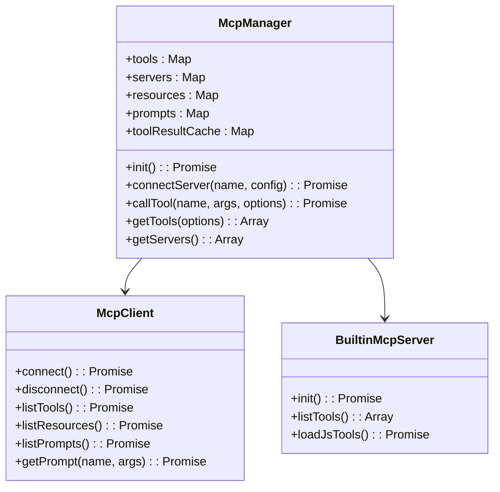

**图表来源**
- [McpManager.js](file://src/mcp/McpManager.js#L27-L49)
- [McpManager.js](file://src/mcp/McpManager.js#L311-L405)

**章节来源**
- [McpManager.js](file://src/mcp/McpManager.js#L1-L1268)

### 聊天服务

聊天服务模块协调各个组件完成对话处理：

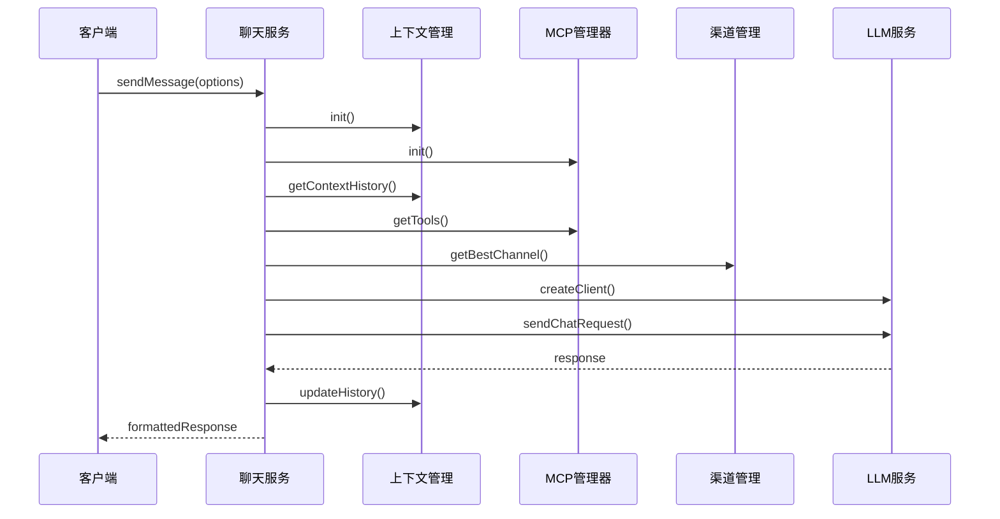

**图表来源**
- [ChatService.js](file://src/services/llm/ChatService.js#L68-L110)
- [ChatService.js](file://src/services/llm/ChatService.js#L115-L200)

**章节来源**
- [ChatService.js](file://src/services/llm/ChatService.js#L1-L1689)

## 依赖分析

### 模块依赖关系

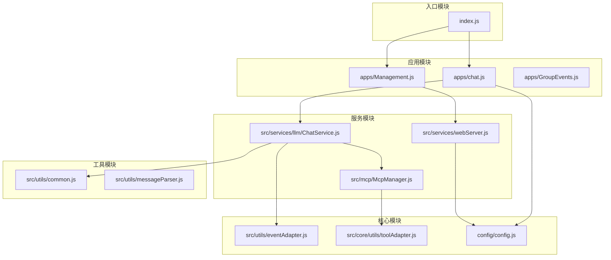

**图表来源**
- [index.js](file://index.js#L114-L136)
- [chat.js](file://apps/chat.js#L1-L25)
- [webServer.js](file://src/services/webServer.js#L124-L144)

### 通信安全性

系统实现了多层安全防护机制：

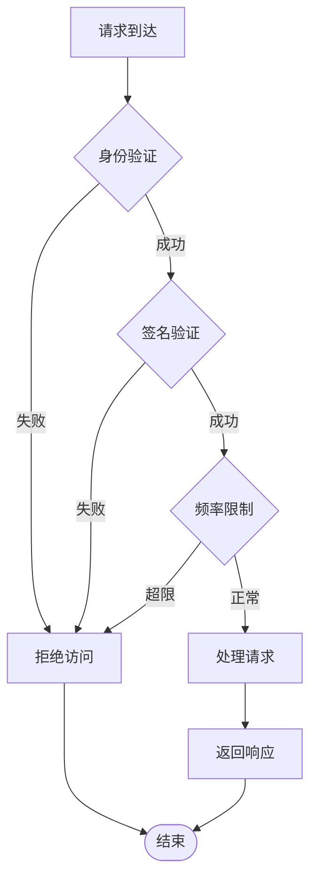

**章节来源**
- [webServer.js](file://src/services/webServer.js#L156-L199)
- [webServer.js](file://src/services/webServer.js#L230-L279)

## 性能考虑

### 异步处理策略

系统采用多种异步处理策略优化性能：

1. **并发控制**: 使用 Promise.allSettled 并行加载模块
2. **缓存机制**: 实现工具调用结果缓存和配置缓存
3. **流式处理**: 支持流式响应处理大量数据
4. **连接池**: 管理外部服务连接复用

### 内存管理

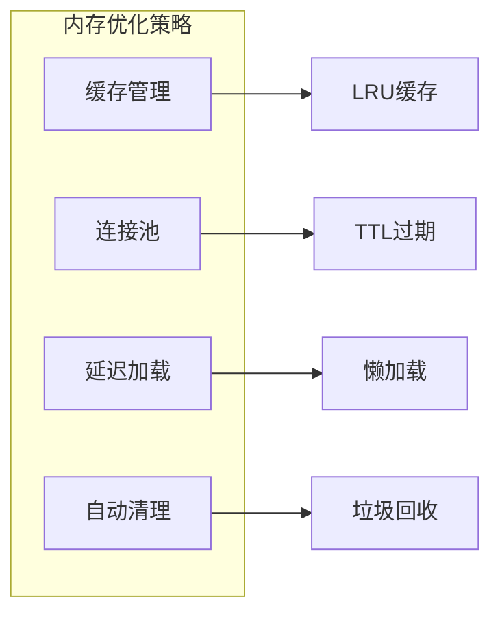

**章节来源**
- [common.js](file://src/utils/common.js#L308-L330)
- [McpManager.js](file://src/mcp/McpManager.js#L444-L455)

## 故障排除指南

### 常见问题诊断

1. **模块加载失败**: 检查模块路径和依赖关系
2. **配置错误**: 验证 YAML 配置文件语法
3. **网络连接问题**: 测试 API 服务可达性
4. **权限问题**: 确认用户权限和访问控制

### 日志记录

系统提供详细的日志记录机制：

| 日志级别 | 用途 | 示例 |
|---------|------|------|
| DEBUG | 详细调试信息 | 模块加载状态 |
| INFO | 一般信息 | 系统启动完成 |
| WARN | 警告信息 | 配置警告 |
| ERROR | 错误信息 | 异常和错误 |

**章节来源**
- [webServer.js](file://src/services/webServer.js#L1-L807)
- [config.js](file://config/config.js#L1-L631)

## 结论

ChatAI 插件通过精心设计的模块间通信机制，实现了高度解耦和可扩展的架构。系统采用事件驱动模式、消息传递机制和共享状态管理相结合的方式，为 AI 聊天应用提供了稳定可靠的技术基础。

该架构的主要优势包括：

1. **模块解耦**: 通过全局对象和接口设计实现松耦合
2. **异步处理**: 采用 Promise 和事件驱动模式处理并发请求
3. **安全防护**: 多层认证和授权机制保障系统安全
4. **性能优化**: 缓存、连接池和并发控制提升系统性能
5. **可扩展性**: 模块化设计便于功能扩展和维护

未来可以在以下方面进一步改进：
- 增强监控和可观测性
- 优化大规模部署场景下的性能
- 扩展更多通信协议支持
- 完善错误恢复和容错机制