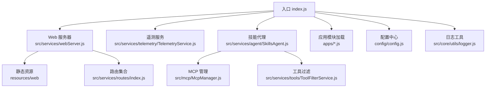
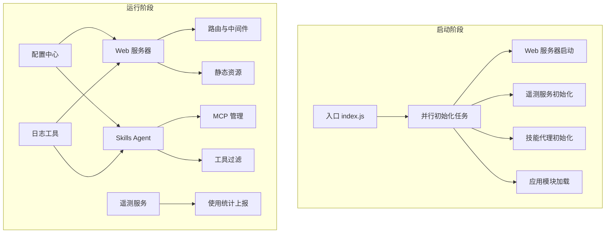
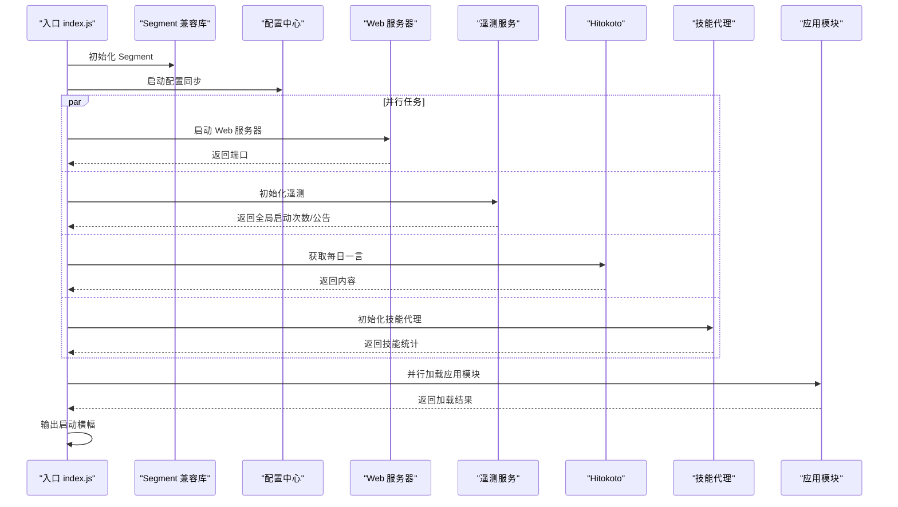
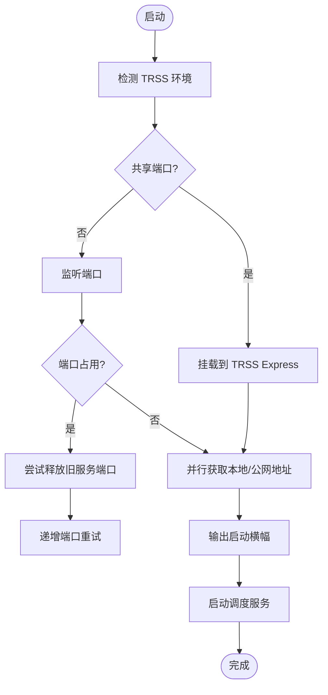
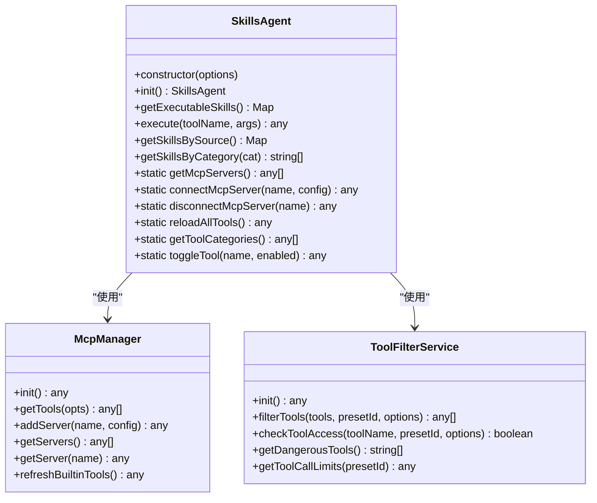
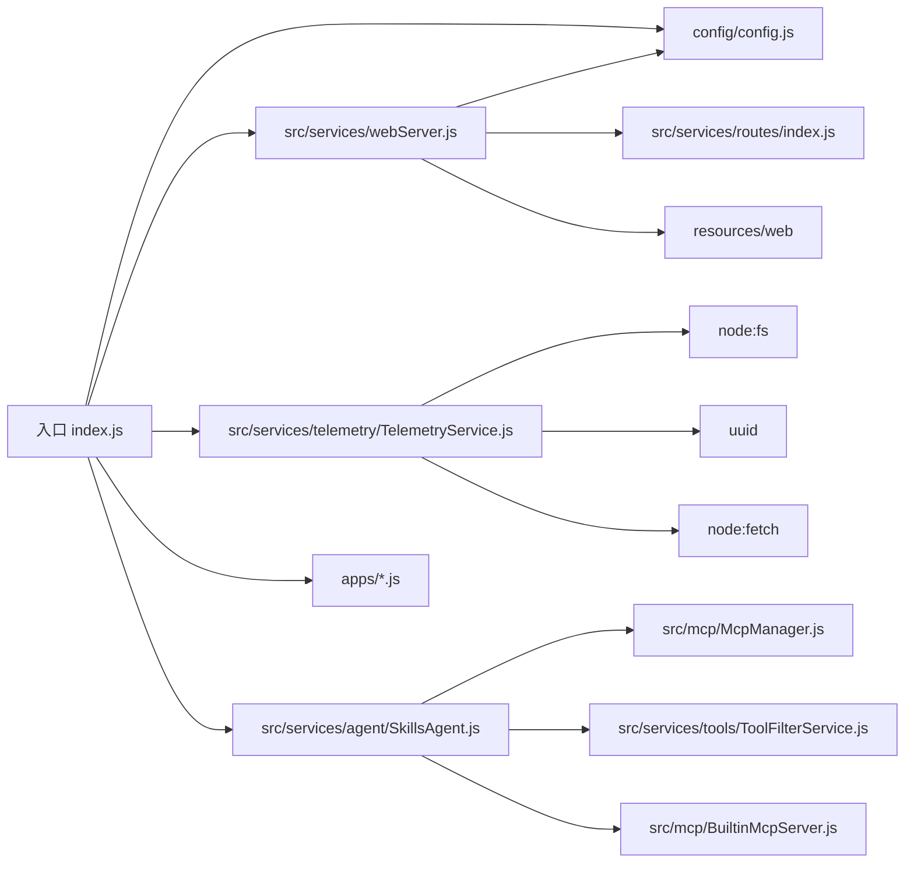

# 系统概览

<cite>
**本文引用的文件**
- [index.js](file://index.js)
- [package.json](file://package.json)
- [README.md](file://README.md)
- [src/services/webServer.js](file://src/services/webServer.js)
- [src/services/index.js](file://src/services/index.js)
- [src/services/agent/index.js](file://src/services/agent/index.js)
- [src/services/agent/SkillsAgent.js](file://src/services/agent/SkillsAgent.js)
- [src/services/telemetry/TelemetryService.js](file://src/services/telemetry/TelemetryService.js)
- [src/services/telemetry/index.js](file://src/services/telemetry/index.js)
- [config/config.js](file://config/config.js)
- [src/core/utils/logger.js](file://src/core/utils/logger.js)
- [docs/ARCHITECTURE.md](file://docs/ARCHITECTURE.md)
</cite>

## 目录
1. [简介](#简介)
2. [项目结构](#项目结构)
3. [核心组件](#核心组件)
4. [架构总览](#架构总览)
5. [详细组件分析](#详细组件分析)
6. [依赖分析](#依赖分析)
7. [性能考量](#性能考量)
8. [故障排查指南](#故障排查指南)
9. [结论](#结论)
10. [附录](#附录)

## 简介
本文件面向开发者与运维人员，提供 ChatAI 插件的系统概览文档。重点阐述插件入口点的初始化流程、核心模块加载顺序与依赖关系；解释系统启动的关键步骤：Web 服务器启动、技能代理初始化、应用模块加载等；说明模块化设计理念与并行初始化任务如何提升启动效率；并给出系统启动时序图，帮助读者建立对整体运行机制的宏观认知。

## 项目结构
插件采用“入口文件 + 多模块服务 + 配置中心 + 日志工具”的分层组织方式：
- 入口文件负责并行初始化任务、加载应用模块、导出统一 API。
- 核心服务模块包括 Web 服务器、LLM 服务、代理系统（Skills Agent）、MCP 管理、工具过滤、统计与遥测等。
- 配置中心集中管理 YAML 配置文件，提供默认配置与运行时合并。
- 日志工具提供统一的彩色日志输出与横幅打印。

图表来源
- [index.js](file://index.js#L17-L181)
- [src/services/webServer.js](file://src/services/webServer.js#L279-L757)
- [src/services/agent/SkillsAgent.js](file://src/services/agent/SkillsAgent.js#L21-L58)
- [config/config.js](file://config/config.js#L18-L38)

章节来源
- [index.js](file://index.js#L1-L258)
- [src/services/webServer.js](file://src/services/webServer.js#L1-L807)
- [src/services/agent/SkillsAgent.js](file://src/services/agent/SkillsAgent.js#L1-L200)
- [config/config.js](file://config/config.js#L1-L631)
- [src/core/utils/logger.js](file://src/core/utils/logger.js#L1-L331)

## 核心组件
- 入口与并行初始化：入口文件创建并行初始化任务，包括 Segment 兼容库、Web 服务器、遥测服务、Hitokoto 获取、技能代理初始化，并行等待完成后加载应用模块。
- Web 服务器：基于 Express，支持 TRSS 环境共享端口或独立端口启动，内置认证、CORS、静态资源托管与路由注册。
- 技能代理（Skills Agent）：统一技能/工具抽象，聚合内置、自定义与外部 MCP 工具，提供权限过滤、参数校验、MCP 服务器管理等能力。
- 配置中心：YAML 配置文件的加载、默认值合并、运行时读写与持久化。
- 遥测服务：版本上报、使用统计缓冲与定时上报、公告与全局启动次数查询。
- 日志工具：统一日志格式、横幅输出、统计卡片与进度条。

章节来源
- [index.js](file://index.js#L17-L181)
- [src/services/webServer.js](file://src/services/webServer.js#L279-L757)
- [src/services/agent/SkillsAgent.js](file://src/services/agent/SkillsAgent.js#L21-L58)
- [config/config.js](file://config/config.js#L18-L626)
- [src/services/telemetry/TelemetryService.js](file://src/services/telemetry/TelemetryService.js#L18-L66)
- [src/core/utils/logger.js](file://src/core/utils/logger.js#L114-L331)

## 架构总览
系统采用“入口并行初始化 + 服务模块化 + 配置驱动 + 统一日志”的架构风格。入口文件作为系统启动的唯一入口，负责并行启动关键服务，随后加载应用模块；Web 服务器提供管理面板与 API；Skills Agent 作为业务层抽象，向上提供统一工具调用接口，向下对接 MCP 管理与工具过滤；配置中心贯穿始终，提供默认配置与运行时覆盖；遥测服务在后台收集使用统计并上报；日志工具贯穿所有模块，提供一致的可观测性。

图表来源
- [index.js](file://index.js#L17-L181)
- [src/services/webServer.js](file://src/services/webServer.js#L279-L757)
- [src/services/agent/SkillsAgent.js](file://src/services/agent/SkillsAgent.js#L21-L58)
- [src/services/telemetry/TelemetryService.js](file://src/services/telemetry/TelemetryService.js#L18-L66)
- [config/config.js](file://config/config.js#L18-L626)
- [src/core/utils/logger.js](file://src/core/utils/logger.js#L114-L331)

## 详细组件分析

### 入口与并行初始化
- 入口文件负责：
  - 初始化 Segment 兼容库（优先加载 icqq，失败回退 oicq）。
  - 创建数据目录并启动配置同步。
  - 并行执行 Web 服务器启动、遥测服务初始化、Hitokoto 获取、技能代理初始化。
  - 并行加载应用模块（apps 目录下的 JS 文件），汇总加载结果。
  - 输出启动横幅，包含模块数量、技能统计、Web 端口、耗时、公告与每日一言等信息。
  - 暴露 skills API，提供技能代理实例、工具管理与 MCP 服务器管理等方法。
- 并行初始化的优势在于显著缩短启动时间，避免串行阻塞。

图表来源
- [index.js](file://index.js#L17-L181)
- [src/services/webServer.js](file://src/services/webServer.js#L582-L602)
- [src/services/telemetry/TelemetryService.js](file://src/services/telemetry/TelemetryService.js#L42-L66)

章节来源
- [index.js](file://index.js#L17-L181)

### Web 服务器
- 功能特性：
  - 支持 TRSS 环境共享端口或独立端口启动。
  - 自动探测本地与公网地址，快速输出启动横幅。
  - 内置 JWT 登录、Token 管理、指纹绑定、请求签名与防重放等安全机制。
  - 提供静态资源托管与路由注册，覆盖系统、渠道、工具、MCP、知识库、图像、日志、内存、群管理、技能等 API。
  - 异步启动周期任务调度服务。
- 启动流程：
  - 判断 TRSS 环境并决定共享端口或独立端口。
  - 独立端口模式下进行端口占用检测与自动释放，必要时递增端口。
  - 并行获取本地与公网地址，输出启动横幅。
  - 启动调度服务。

图表来源
- [src/services/webServer.js](file://src/services/webServer.js#L582-L705)

章节来源
- [src/services/webServer.js](file://src/services/webServer.js#L279-L757)

### 技能代理（Skills Agent）
- 设计理念：
  - 将内置、自定义与外部 MCP 工具统一为“技能”，屏蔽底层差异。
  - 提供权限过滤、参数自动填充、MCP 服务器管理、工具类别与来源统计等能力。
- 初始化流程：
  - 初始化 MCP 管理器与工具过滤服务。
  - 设置内置工具上下文（如消息事件、机器人实例）。
  - 从 MCP 管理器加载工具并应用过滤规则，构建技能与类别映射。
  - 收集外部 MCP 服务器工具并按服务器分组。
- 关键能力：
  - 获取可执行技能列表、按来源分组、按类别筛选。
  - 执行工具（含权限检查、参数校验、路由到本地或外部执行）。
  - 管理 MCP 服务器（连接、断开、重载、移除）。
  - 查询危险工具、检查工具可用性、获取调用限制。

图表来源
- [src/services/agent/SkillsAgent.js](file://src/services/agent/SkillsAgent.js#L21-L200)
- [src/services/agent/index.js](file://src/services/agent/index.js#L1-L66)

章节来源
- [src/services/agent/SkillsAgent.js](file://src/services/agent/SkillsAgent.js#L21-L200)
- [src/services/agent/index.js](file://src/services/agent/index.js#L1-L66)
- [docs/ARCHITECTURE.md](file://docs/ARCHITECTURE.md#L1-L553)

### 配置中心
- 职责：
  - 从 YAML 文件加载配置，合并默认配置与用户配置。
  - 提供 get/set 接口，支持嵌套键访问与持久化。
  - 在启动时创建配置目录与默认配置文件。
- 影响范围：
  - Web 服务器端口、TRSS 共享端口、挂载路径等。
  - 触发模式、命令前缀、调试开关、上下文与记忆配置、工具组与危险工具列表、MCP 开关等。

章节来源
- [config/config.js](file://config/config.js#L18-L626)

### 遥测服务
- 职责：
  - 初始化时上报版本信息，获取全局启动次数与公告。
  - 维护使用统计缓冲（模型调用次数、Token、成功率、耗时等）。
  - 定时（默认 1 小时）上报使用统计，进程退出前也会上报。
  - 提供启用/禁用、实例 ID 管理、服务器地址设置等能力。
- 与入口的关系：
  - 入口并行初始化任务中调用遥测服务初始化，将返回的全局启动次数与公告注入启动横幅。

章节来源
- [src/services/telemetry/TelemetryService.js](file://src/services/telemetry/TelemetryService.js#L18-L382)
- [src/services/telemetry/index.js](file://src/services/telemetry/index.js#L1-L2)
- [index.js](file://index.js#L48-L66)

### 日志工具
- 职责：
  - 提供统一的日志级别与彩色输出。
  - 支持横幅输出、统计卡片、进度条、图标等。
  - 在启动阶段用于输出启动横幅与模块加载统计。
- 使用场景：
  - Web 服务器启动横幅、技能代理初始化统计、应用模块加载结果、遥测服务状态等。

章节来源
- [src/core/utils/logger.js](file://src/core/utils/logger.js#L114-L331)
- [index.js](file://index.js#L149-L174)

## 依赖分析
- 入口依赖：
  - 配置中心：用于启动时创建数据目录与同步配置。
  - Web 服务器：提供管理面板与 API。
  - 遥测服务：用于版本上报与使用统计。
  - 技能代理：用于工具与 MCP 服务器管理。
  - 应用模块：并行加载，汇总结果。
- Web 服务器依赖：
  - 配置中心：读取端口、TRSS 共享端口、挂载路径等。
  - 路由集合：注册系统、渠道、工具、MCP、知识库、图像、日志、内存、群管理、技能等 API。
  - 静态资源：托管前端构建产物。
- 技能代理依赖：
  - MCP 管理器：统一工具注册与调用。
  - 工具过滤服务：权限与预设过滤。
  - 内置工具上下文：设置消息事件与机器人实例。
- 遥测服务依赖：
  - UUID：生成实例 ID。
  - 文件系统：持久化实例 ID。
  - Fetch：上报数据。

图表来源
- [index.js](file://index.js#L17-L181)
- [src/services/webServer.js](file://src/services/webServer.js#L124-L144)
- [src/services/agent/SkillsAgent.js](file://src/services/agent/SkillsAgent.js#L3-L5)
- [src/services/telemetry/TelemetryService.js](file://src/services/telemetry/TelemetryService.js#L6-L10)

章节来源
- [index.js](file://index.js#L17-L181)
- [src/services/webServer.js](file://src/services/webServer.js#L124-L144)
- [src/services/agent/SkillsAgent.js](file://src/services/agent/SkillsAgent.js#L3-L5)
- [src/services/telemetry/TelemetryService.js](file://src/services/telemetry/TelemetryService.js#L6-L10)

## 性能考量
- 并行初始化：入口文件将 Web 服务器、遥测服务、Hitokoto 获取、技能代理初始化等任务并行执行，显著缩短启动时间。
- 端口占用处理：独立端口模式下，若端口被占用，先尝试释放旧服务端口，再递增端口重试，避免长时间阻塞。
- 地址探测优化：本地地址同步获取，公网地址并行获取并在 2 秒内超时，保证启动横幅快速输出。
- 工具加载：应用模块并行加载，汇总结果后统一输出统计。
- 遥测上报：使用定时器与进程退出前上报，避免频繁网络请求影响启动性能。

## 故障排查指南
- Web 服务器无法访问：
  - 检查端口占用与防火墙，确认端口 3000 或后续端口是否被占用。
  - 在 TRSS 环境下确认共享端口与挂载路径配置。
- 技能代理初始化失败：
  - 检查 MCP 服务器连接状态与工具来源配置。
  - 确认危险工具与权限过滤规则是否导致工具不可用。
- 遥测服务异常：
  - 确认网络可达性与服务器地址。
  - 检查实例 ID 文件是否存在与可写。
- 日志定位：
  - 使用统一日志工具输出的横幅与统计信息定位问题模块。

章节来源
- [src/services/webServer.js](file://src/services/webServer.js#L637-L673)
- [src/services/telemetry/TelemetryService.js](file://src/services/telemetry/TelemetryService.js#L314-L344)
- [src/core/utils/logger.js](file://src/core/utils/logger.js#L184-L331)

## 结论
ChatAI 插件通过入口并行初始化、模块化服务与配置驱动的设计，实现了高效启动与清晰的职责分离。Web 服务器提供管理与 API 能力，Skills Agent 作为业务抽象统一工具调用，配置中心与遥测服务贯穿始终，日志工具提供一致的可观测性。该架构既满足了复杂功能需求，又便于扩展与维护。

## 附录
- 项目依赖与脚本：详见 package.json。
- 快速开始与配置说明：详见 README.md。
- 架构与工具体系：详见 docs/ARCHITECTURE.md。

章节来源
- [package.json](file://package.json#L1-L53)
- [README.md](file://README.md#L1-L983)
- [docs/ARCHITECTURE.md](file://docs/ARCHITECTURE.md#L1-L553)