# 组件交互机制

## 目录
1. [简介](#简介)
2. [项目结构](#项目结构)
3. [核心组件](#核心组件)
4. [架构概览](#架构概览)
5. [详细组件分析](#详细组件分析)
6. [依赖关系分析](#依赖关系分析)
7. [性能考虑](#性能考虑)
8. [故障排除指南](#故障排除指南)
9. [结论](#结论)

## 简介

ChatAI 插件是一个基于 Yunzai Bot 的智能对话插件，提供了完整的 AI 对话、工具调用、MCP 服务器管理和 Web 管理面板功能。本文档深入分析系统的组件交互机制，包括同步和异步通信方式、事件驱动机制和消息传递模式。

## 项目结构

ChatAI 插件采用模块化架构设计，主要分为以下几个核心层次：

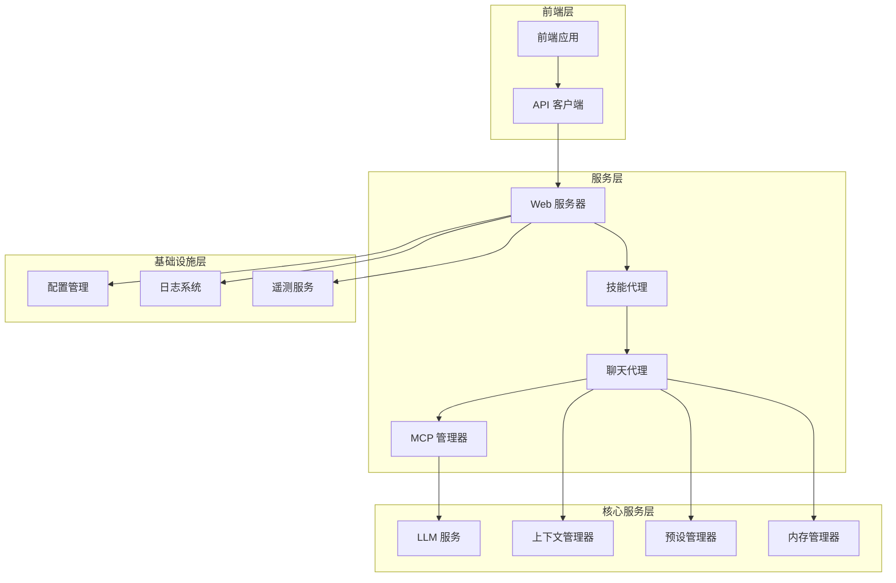

**图表来源**
- [index.js](file://index.js#L1-L258)
- [webServer.js](file://src/services/webServer.js#L1-L807)
- [ChatAgent.js](file://src/services/agent/ChatAgent.js#L1-L925)

**章节来源**
- [index.js](file://index.js#L1-L258)
- [config.js](file://config/config.js#L1-L631)

## 核心组件

### Web 服务器组件

Web 服务器是整个系统的入口点，负责处理 HTTP 请求、身份验证和路由分发：

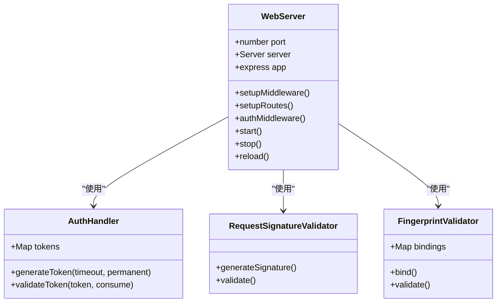

**图表来源**
- [webServer.js](file://src/services/webServer.js#L279-L757)

### 技能代理组件

技能代理负责统一管理和执行各种工具和技能：

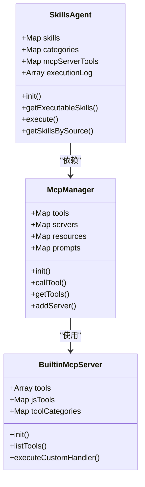

**图表来源**
- [SkillsAgent.js](file://src/services/agent/SkillsAgent.js#L21-L601)
- [McpManager.js](file://src/mcp/McpManager.js#L27-L800)
- [BuiltinMcpServer.js](file://src/mcp/BuiltinMcpServer.js#L218-L800)

### 聊天代理组件

聊天代理处理用户的对话请求，协调各个服务组件：

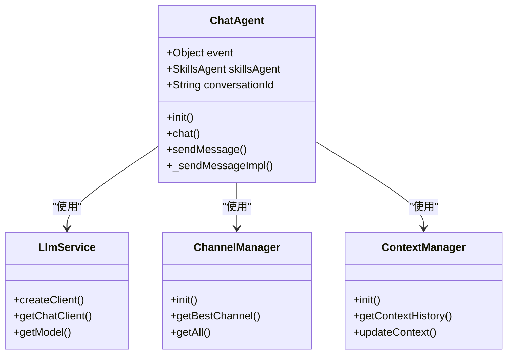

**图表来源**
- [ChatAgent.js](file://src/services/agent/ChatAgent.js#L42-L925)
- [LlmService.js](file://src/services/llm/LlmService.js#L11-L300)

**章节来源**
- [webServer.js](file://src/services/webServer.js#L1-L807)
- [SkillsAgent.js](file://src/services/agent/SkillsAgent.js#L1-L601)
- [ChatAgent.js](file://src/services/agent/ChatAgent.js#L1-L925)

## 架构概览

系统采用事件驱动和消息传递相结合的架构模式，实现了高度解耦的设计：

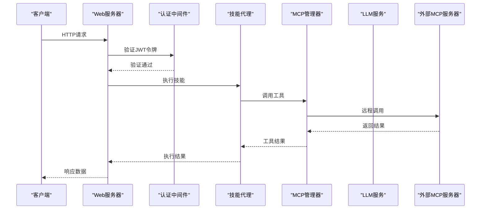

**图表来源**
- [webServer.js](file://src/services/webServer.js#L313-L337)
- [SkillsAgent.js](file://src/services/agent/SkillsAgent.js#L326-L379)
- [McpManager.js](file://src/mcp/McpManager.js#L724-L800)

## 详细组件分析

### Web 服务器交互流程

Web 服务器采用中间件模式处理请求，支持多种认证方式：

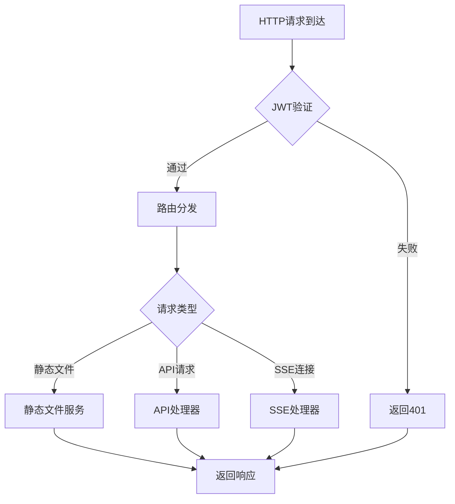

**图表来源**
- [webServer.js](file://src/services/webServer.js#L288-L537)

### 技能执行生命周期

技能代理的执行过程涉及多个组件的协作：

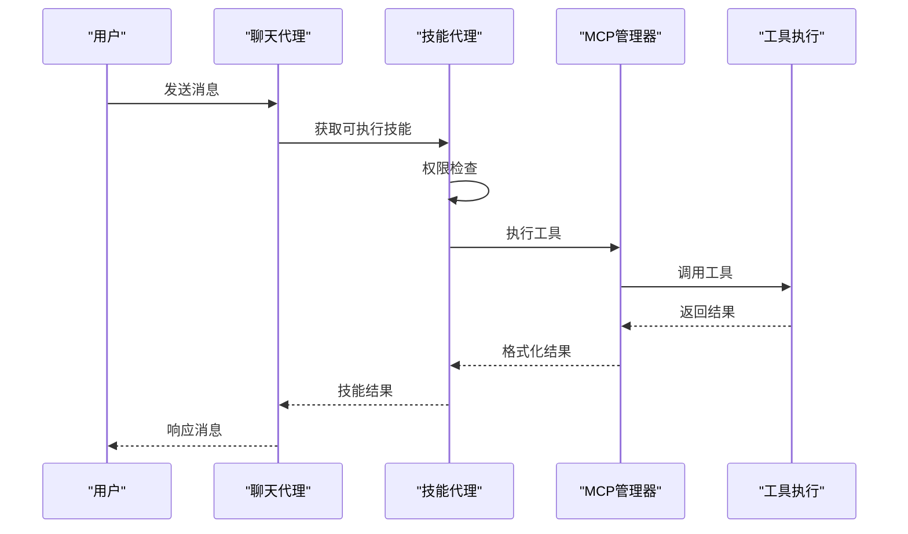

**图表来源**
- [ChatAgent.js](file://src/services/agent/ChatAgent.js#L98-L133)
- [SkillsAgent.js](file://src/services/agent/SkillsAgent.js#L326-L379)

### MCP 服务器管理机制

MCP 管理器负责管理内置、自定义和外部 MCP 服务器：

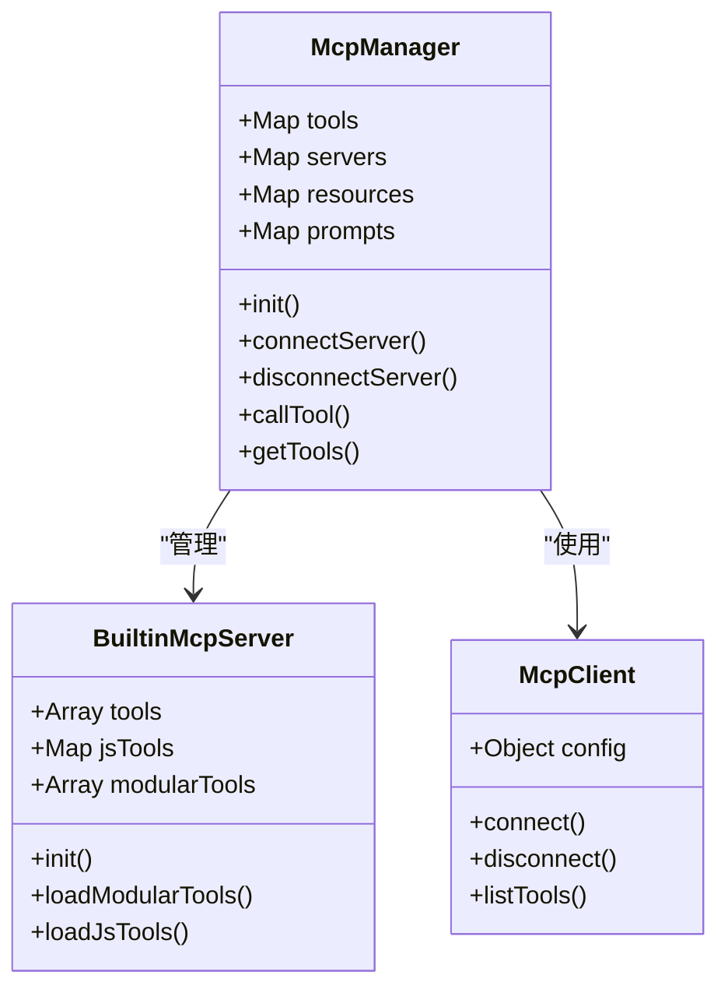

**图表来源**
- [McpManager.js](file://src/mcp/McpManager.js#L27-L800)
- [BuiltinMcpServer.js](file://src/mcp/BuiltinMcpServer.js#L218-L800)

**章节来源**
- [webServer.js](file://src/services/webServer.js#L1-L807)
- [SkillsAgent.js](file://src/services/agent/SkillsAgent.js#L1-L601)
- [McpManager.js](file://src/mcp/McpManager.js#L1-L800)

## 依赖关系分析

系统采用松耦合设计，通过接口和回调实现组件间的解耦：

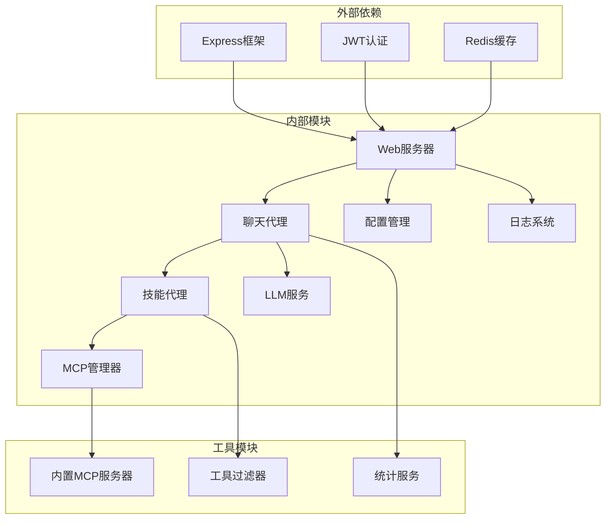

**图表来源**
- [index.js](file://index.js#L1-L258)
- [config.js](file://config/config.js#L1-L631)

**章节来源**
- [index.js](file://index.js#L1-L258)
- [config.js](file://config/config.js#L1-L631)

## 性能考虑

系统在设计时充分考虑了性能优化：

### 缓存策略
- 工具结果缓存：MCP 管理器提供工具调用结果缓存，减少重复计算
- 配置缓存：配置管理器使用内存缓存避免频繁磁盘读取
- 日志缓存：日志系统采用异步写入避免阻塞主线程

### 并发处理
- Promise 并行：初始化任务使用 Promise.all 并行执行
- 流式响应：支持流式 API 响应，提升用户体验
- 连接池：数据库和缓存连接使用连接池管理

### 监控指标
- 使用量统计：遥测服务收集详细的使用统计数据
- 性能监控：内置性能指标收集和报告机制
- 错误追踪：完整的错误日志和异常处理

## 故障排除指南

### 常见问题诊断

#### Web 服务器启动问题
1. **端口占用**：检查端口是否被其他进程占用
2. **权限问题**：确保有足够的文件系统和网络权限
3. **配置错误**：验证配置文件格式和参数有效性

#### MCP 服务器连接问题
1. **网络连接**：检查外部 MCP 服务器可达性
2. **认证失败**：验证服务器凭据和访问权限
3. **协议不匹配**：确认 MCP 协议版本兼容性

#### 工具执行失败
1. **权限检查**：验证用户权限和工具访问控制
2. **参数验证**：检查工具输入参数的有效性
3. **资源限制**：监控内存和 CPU 使用情况

### 日志记录策略

系统提供多层次的日志记录：

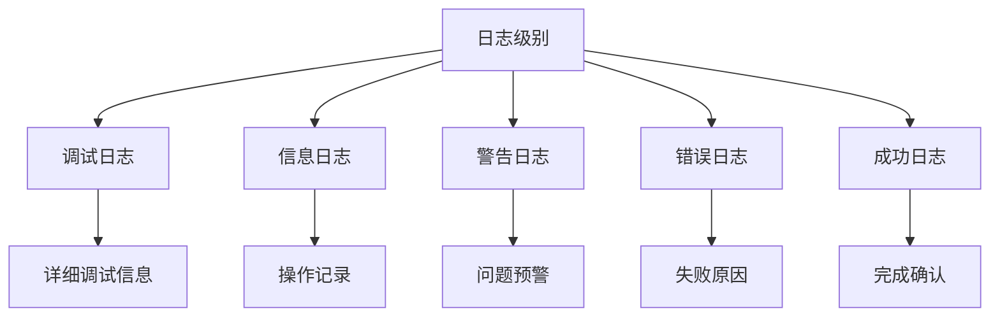

**图表来源**
- [logger.js](file://src/core/utils/logger.js#L62-L69)

### 性能监控

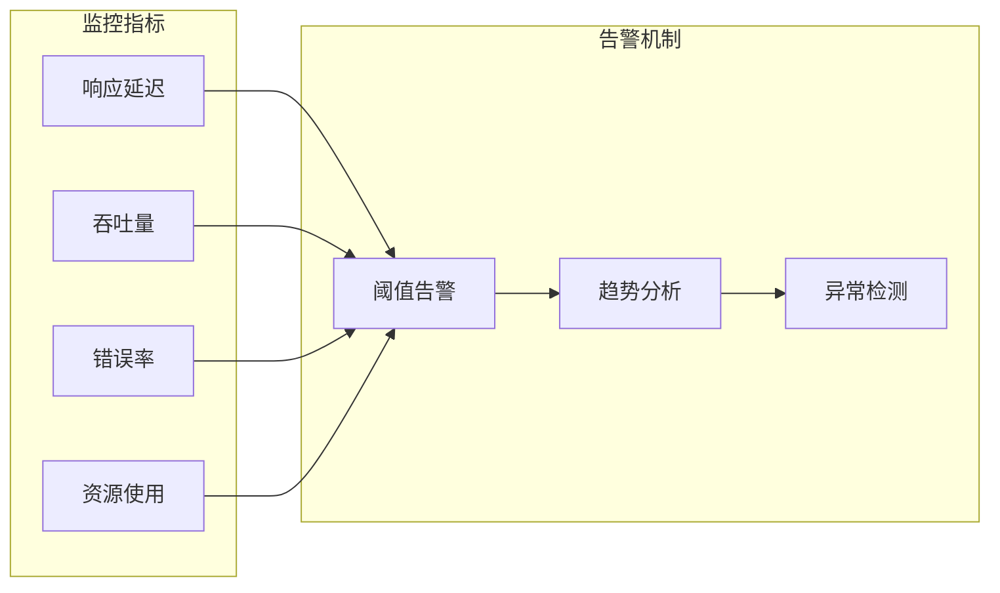

**图表来源**
- [TelemetryService.js](file://src/services/telemetry/TelemetryService.js#L155-L192)

**章节来源**
- [logger.js](file://src/core/utils/logger.js#L1-L331)
- [TelemetryService.js](file://src/services/telemetry/TelemetryService.js#L1-L382)

## 结论

ChatAI 插件通过精心设计的组件交互机制，实现了高度模块化和可扩展的架构。系统采用事件驱动和消息传递相结合的方式，通过松耦合的设计实现了组件间的灵活协作。Web 服务器、聊天代理、MCP 管理器等核心组件通过清晰的接口和回调机制实现了解耦，支持同步和异步通信方式。

系统的性能优化策略包括缓存机制、并发处理和监控指标，确保了在高负载情况下的稳定运行。完善的日志记录和故障排除指南为系统的维护和调试提供了有力支持。

这种架构设计不仅满足了当前的功能需求，还为未来的功能扩展和技术演进奠定了坚实的基础。
