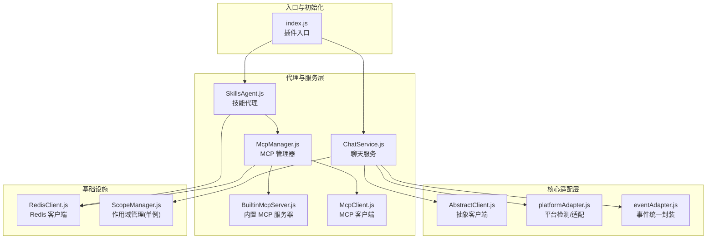
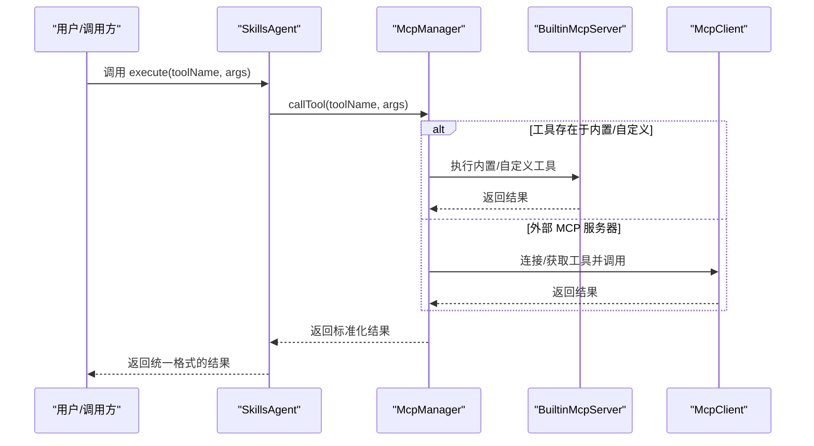
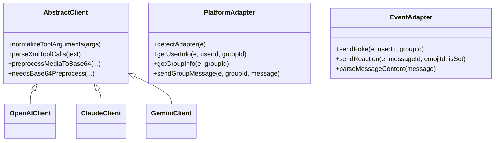
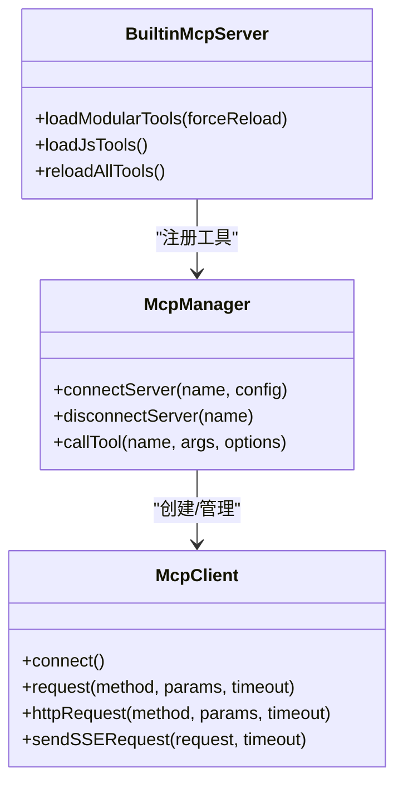
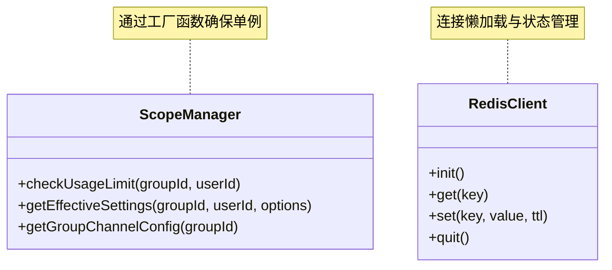
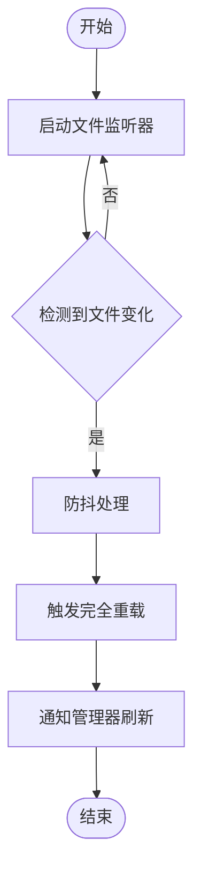
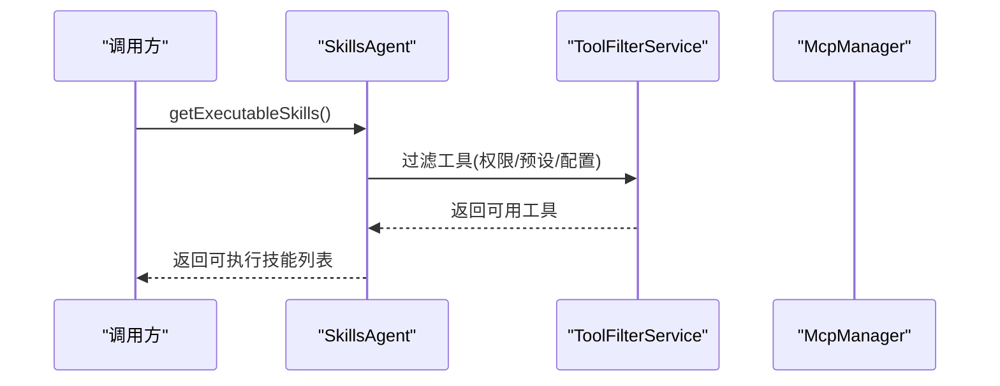
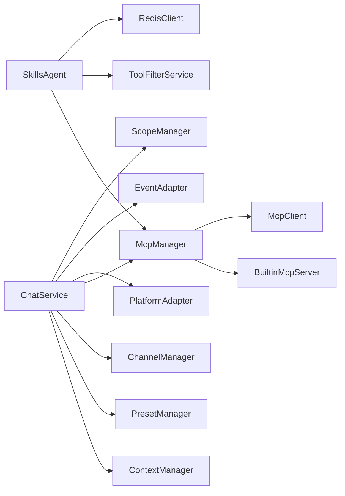

# 设计模式应用

## 目录
1. [简介](#简介)
2. [项目结构](#项目结构)
3. [核心组件](#核心组件)
4. [架构总览](#架构总览)
5. [详细组件分析](#详细组件分析)
6. [依赖关系分析](#依赖关系分析)
7. [性能考量](#性能考量)
8. [故障排查指南](#故障排查指南)
9. [结论](#结论)

## 简介
本文件面向 ChatAI 插件的设计模式应用，系统梳理并深入分析项目中实际采用的适配器模式、工厂模式、单例模式、观察者模式等，并结合具体代码路径说明其在系统中的实现方式、带来的收益以及对可维护性、可扩展性和可测试性的提升。同时提供设计模式选择与应用的指导原则，帮助开发者在类似场景中做出更优决策。

## 项目结构
项目采用分层与模块化组织方式：
- 核心适配层：抽象客户端与平台适配器，屏蔽底层差异
- 代理与服务层：技能代理、聊天服务、MCP 管理器等
- 工具与工具链：内置工具、自定义工具、外部 MCP 服务器集成
- 缓存与基础设施：Redis 客户端、日志、配置等

**图表来源**
- [index.js](file://index.js#L1-L258)
- [AbstractClient.js](file://src/core/adapters/AbstractClient.js#L1-L2098)
- [SkillsAgent.js](file://src/services/agent/SkillsAgent.js#L1-L601)
- [ChatService.js](file://src/services/llm/ChatService.js#L1-L1689)
- [McpManager.js](file://src/mcp/McpManager.js#L1-L1268)
- [BuiltinMcpServer.js](file://src/mcp/BuiltinMcpServer.js#L1-L1462)
- [McpClient.js](file://src/mcp/McpClient.js#L1-L1002)
- [RedisClient.js](file://src/core/cache/RedisClient.js#L1-L130)
- [platformAdapter.js](file://src/utils/platformAdapter.js#L1-L1372)
- [eventAdapter.js](file://src/utils/eventAdapter.js#L1-L1143)
- [ScopeManager.js](file://src/services/scope/ScopeManager.js#L1892-L1911)

**章节来源**
- [index.js](file://index.js#L1-L258)
- [AbstractClient.js](file://src/core/adapters/AbstractClient.js#L1-L2098)
- [SkillsAgent.js](file://src/services/agent/SkillsAgent.js#L1-L601)
- [ChatService.js](file://src/services/llm/ChatService.js#L1-L1689)
- [McpManager.js](file://src/mcp/McpManager.js#L1-L1268)
- [BuiltinMcpServer.js](file://src/mcp/BuiltinMcpServer.js#L1-L1462)
- [McpClient.js](file://src/mcp/McpClient.js#L1-L1002)
- [RedisClient.js](file://src/core/cache/RedisClient.js#L1-L130)
- [platformAdapter.js](file://src/utils/platformAdapter.js#L1-L1372)
- [eventAdapter.js](file://src/utils/eventAdapter.js#L1-L1143)
- [ScopeManager.js](file://src/services/scope/ScopeManager.js#L1892-L1911)

## 核心组件
- 抽象客户端与适配器：统一处理不同 LLM 适配器的差异，提供标准化的工具调用解析与消息封装能力
- 技能代理：聚合内置、自定义与外部 MCP 工具，提供统一的工具发现、过滤与执行接口
- MCP 管理器：集中管理 MCP 服务器连接、工具注册、缓存与日志，支持热重载与配置驱动
- 聊天服务：负责对话流程编排、上下文管理、预设与作用域配置、渠道选择与工具调用
- 平台与事件适配：统一对不同机器人平台的事件、消息、用户信息等进行抽象
- 缓存与单例：Redis 客户端提供高性能缓存，ScopeManager 以单例模式提供作用域配置管理

**章节来源**
- [AbstractClient.js](file://src/core/adapters/AbstractClient.js#L1-L2098)
- [SkillsAgent.js](file://src/services/agent/SkillsAgent.js#L1-L601)
- [McpManager.js](file://src/mcp/McpManager.js#L1-L1268)
- [ChatService.js](file://src/services/llm/ChatService.js#L1-L1689)
- [platformAdapter.js](file://src/utils/platformAdapter.js#L1-L1372)
- [eventAdapter.js](file://src/utils/eventAdapter.js#L1-L1143)
- [RedisClient.js](file://src/core/cache/RedisClient.js#L1-L130)
- [ScopeManager.js](file://src/services/scope/ScopeManager.js#L1892-L1911)

## 架构总览
系统采用“适配器 + 代理 + 管理器”的分层架构：
- 适配器层：屏蔽平台差异，提供统一接口
- 代理层：对外暴露一致的工具/技能 API，内部协调 MCP 管理器与工具过滤
- 管理器层：集中控制生命周期、连接、缓存与配置，支持热重载与可观测性
- 服务层：编排业务流程，结合上下文、预设、作用域与渠道配置

**图表来源**
- [SkillsAgent.js](file://src/services/agent/SkillsAgent.js#L326-L379)
- [McpManager.js](file://src/mcp/McpManager.js#L717-L800)
- [BuiltinMcpServer.js](file://src/mcp/BuiltinMcpServer.js#L623-L676)
- [McpClient.js](file://src/mcp/McpClient.js#L503-L565)

## 详细组件分析

### 适配器模式（Adapter Pattern）
- 目标：屏蔽不同 LLM 适配器与平台的差异，提供统一的客户端与事件接口
- 实现要点：
  - 抽象客户端：统一工具调用解析、消息封装与错误处理
  - 平台适配器：检测平台类型、统一用户/群组/消息等信息获取
  - 事件适配器：统一戳一戳、表情回应、撤回等事件解析与发送
- 应用场景：
  - LLM 适配器切换：OpenAI、Claude、Gemini 等
  - 平台适配：icqq、OneBot、NapCat、Lagrange 等
  - 事件统一封装：跨平台事件解析与动作执行
- 好处：
  - 提升可移植性与可替换性
  - 降低耦合度，便于扩展新适配器
  - 统一错误与日志处理

**图表来源**
- [AbstractClient.js](file://src/core/adapters/AbstractClient.js#L1-L2098)
- [platformAdapter.js](file://src/utils/platformAdapter.js#L1-L1372)
- [eventAdapter.js](file://src/utils/eventAdapter.js#L1-L1143)

**章节来源**
- [AbstractClient.js](file://src/core/adapters/AbstractClient.js#L1-L2098)
- [platformAdapter.js](file://src/utils/platformAdapter.js#L1-L1372)
- [eventAdapter.js](file://src/utils/eventAdapter.js#L1-L1143)

### 工厂模式（Factory Pattern）
- 目标：集中创建与管理 MCP 客户端与工具，支持多种传输类型与动态加载
- 实现要点：
  - McpClient 工厂：根据配置创建 stdio、npm、npx、sse、http 等类型的客户端
  - 工具工厂：内置工具与自定义 JS 工具的动态加载与注册
- 应用场景：
  - 多种 MCP 服务器接入
  - 工具的按需加载与热重载
- 好处：
  - 降低客户端创建复杂度
  - 支持灵活扩展新的传输类型与工具类型

**图表来源**
- [McpClient.js](file://src/mcp/McpClient.js#L37-L800)
- [BuiltinMcpServer.js](file://src/mcp/BuiltinMcpServer.js#L218-L1462)
- [McpManager.js](file://src/mcp/McpManager.js#L27-L1268)

**章节来源**
- [McpClient.js](file://src/mcp/McpClient.js#L37-L800)
- [BuiltinMcpServer.js](file://src/mcp/BuiltinMcpServer.js#L218-L1462)
- [McpManager.js](file://src/mcp/McpManager.js#L27-L1268)

### 单例模式（Singleton Pattern）
- 目标：保证全局唯一实例，减少资源占用并提供一致的状态
- 实现要点：
  - ScopeManager：通过工厂函数确保仅创建一个实例
  - RedisClient：懒加载与连接池管理
- 应用场景：
  - 作用域配置的全局一致性
  - 缓存连接的全局复用
- 好处：
  - 避免重复初始化
  - 统一资源管理与可观测性

**图表来源**
- [ScopeManager.js](file://src/services/scope/ScopeManager.js#L1892-L1911)
- [RedisClient.js](file://src/core/cache/RedisClient.js#L4-L130)

**章节来源**
- [ScopeManager.js](file://src/services/scope/ScopeManager.js#L1892-L1911)
- [RedisClient.js](file://src/core/cache/RedisClient.js#L4-L130)

### 观察者模式（Observer Pattern）
- 目标：实现松耦合的通知与订阅机制，支持工具列表变更、服务器状态变化等
- 实现要点：
  - McpClient 监听通知：tools/list_changed 等通知事件
  - 文件监听器：自动检测工具文件变化并触发热重载
- 应用场景：
  - MCP 服务器工具列表动态更新
  - 内置/自定义工具的热重载
- 好处：
  - 降低轮询成本
  - 提升实时性与可维护性

**图表来源**
- [BuiltinMcpServer.js](file://src/mcp/BuiltinMcpServer.js#L509-L590)
- [McpManager.js](file://src/mcp/McpManager.js#L146-L192)

**章节来源**
- [BuiltinMcpServer.js](file://src/mcp/BuiltinMcpServer.js#L509-L590)
- [McpManager.js](file://src/mcp/McpManager.js#L146-L192)

### 策略模式（Strategy Pattern）
- 目标：在运行时选择不同的算法或行为（如不同传输类型的 MCP 客户端）
- 实现要点：
  - McpClient 根据配置选择连接策略（stdio、npm、sse、http）
- 应用场景：
  - 不同 MCP 服务器接入策略
- 好处：
  - 易于扩展新的传输类型
  - 保持调用方与实现的解耦

**章节来源**
- [McpClient.js](file://src/mcp/McpClient.js#L86-L130)

### 中介者模式（Mediator Pattern）
- 目标：集中协调多个对象之间的交互，降低相互依赖
- 实现要点：
  - SkillsAgent 作为中介，协调工具过滤、权限校验、MCP 管理器调用
  - ChatService 作为对话流程的中介，协调上下文、预设、渠道与工具
- 应用场景：
  - 工具执行的统一入口与结果包装
  - 对话流程的编排与上下文管理
- 好处：
  - 提升可测试性与可维护性
  - 易于扩展新的工具与流程

**图表来源**
- [SkillsAgent.js](file://src/services/agent/SkillsAgent.js#L284-L324)

**章节来源**
- [SkillsAgent.js](file://src/services/agent/SkillsAgent.js#L284-L324)

### 装饰器模式（Decorator Pattern）
- 目标：在不改变原有对象结构的情况下增强功能
- 实现要点：
  - 工具运行时环境装饰：在内置工具执行时注入 Redis、数据库、上下文等服务
- 应用场景：
  - 工具执行上下文的动态扩展
- 好处：
  - 提升工具的可组合性与可扩展性

**章节来源**
- [BuiltinMcpServer.js](file://src/mcp/BuiltinMcpServer.js#L725-L800)

## 依赖关系分析
- 组件内聚与耦合：
  - SkillsAgent 与 McpManager 高内聚，通过统一接口解耦工具来源
  - ChatService 依赖上下文、预设、渠道与工具，形成清晰的职责边界
  - 平台与事件适配器为底层细节提供稳定接口
- 外部依赖：
  - Redis 用于缓存与计数
  - 多种 MCP 传输协议支持
  - 多平台机器人 SDK

**图表来源**
- [SkillsAgent.js](file://src/services/agent/SkillsAgent.js#L1-L601)
- [ChatService.js](file://src/services/llm/ChatService.js#L1-L1689)
- [McpManager.js](file://src/mcp/McpManager.js#L1-L1268)
- [BuiltinMcpServer.js](file://src/mcp/BuiltinMcpServer.js#L1-L1462)
- [McpClient.js](file://src/mcp/McpClient.js#L1-L1002)
- [platformAdapter.js](file://src/utils/platformAdapter.js#L1-L1372)
- [eventAdapter.js](file://src/utils/eventAdapter.js#L1-L1143)
- [RedisClient.js](file://src/core/cache/RedisClient.js#L1-L130)
- [ScopeManager.js](file://src/services/scope/ScopeManager.js#L1892-L1911)

**章节来源**
- [SkillsAgent.js](file://src/services/agent/SkillsAgent.js#L1-L601)
- [ChatService.js](file://src/services/llm/ChatService.js#L1-L1689)
- [McpManager.js](file://src/mcp/McpManager.js#L1-L1268)
- [BuiltinMcpServer.js](file://src/mcp/BuiltinMcpServer.js#L1-L1462)
- [McpClient.js](file://src/mcp/McpClient.js#L1-L1002)
- [platformAdapter.js](file://src/utils/platformAdapter.js#L1-L1372)
- [eventAdapter.js](file://src/utils/eventAdapter.js#L1-L1143)
- [RedisClient.js](file://src/core/cache/RedisClient.js#L1-L130)
- [ScopeManager.js](file://src/services/scope/ScopeManager.js#L1892-L1911)

## 性能考量
- 缓存与并发：
  - RedisClient 提供键值缓存与列表操作，降低重复计算与 IO
  - McpManager 使用并发 Promise 控制初始化与工具调用，避免阻塞
- 连接与心跳：
  - McpClient 支持自动重连与心跳检测，提升稳定性
- 防抖与热重载：
  - 内置工具文件监听器采用防抖与完全重载策略，平衡实时性与性能

**章节来源**
- [RedisClient.js](file://src/core/cache/RedisClient.js#L1-L130)
- [McpManager.js](file://src/mcp/McpManager.js#L106-L192)
- [McpClient.js](file://src/mcp/McpClient.js#L451-L491)
- [BuiltinMcpServer.js](file://src/mcp/BuiltinMcpServer.js#L521-L590)

## 故障排查指南
- 工具调用失败：
  - 检查工具是否存在与权限配置
  - 查看危险工具拦截与缓存命中情况
- MCP 服务器连接异常：
  - 查看连接日志与自动重连状态
  - 确认传输类型与配置项
- 平台适配问题：
  - 使用平台适配器检测与用户信息获取接口验证
- 缓存异常：
  - 检查 Redis 连接状态与 TTL 设置

**章节来源**
- [McpManager.js](file://src/mcp/McpManager.js#L717-L800)
- [McpClient.js](file://src/mcp/McpClient.js#L420-L491)
- [platformAdapter.js](file://src/utils/platformAdapter.js#L17-L44)
- [RedisClient.js](file://src/core/cache/RedisClient.js#L10-L65)

## 结论
本项目通过适配器、工厂、单例、观察者等多种设计模式，构建了高内聚、低耦合、可扩展且易维护的系统架构。适配器模式屏蔽平台差异，工厂模式简化客户端与工具创建，单例模式保障全局一致性，观察者模式提升动态性与实时性。这些模式共同提升了系统的可测试性与演进能力，为后续功能扩展与平台迁移奠定了坚实基础。
