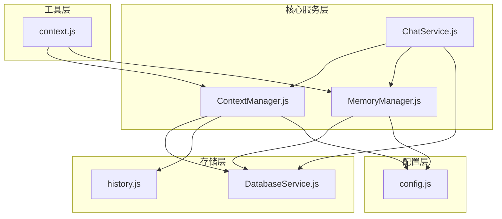
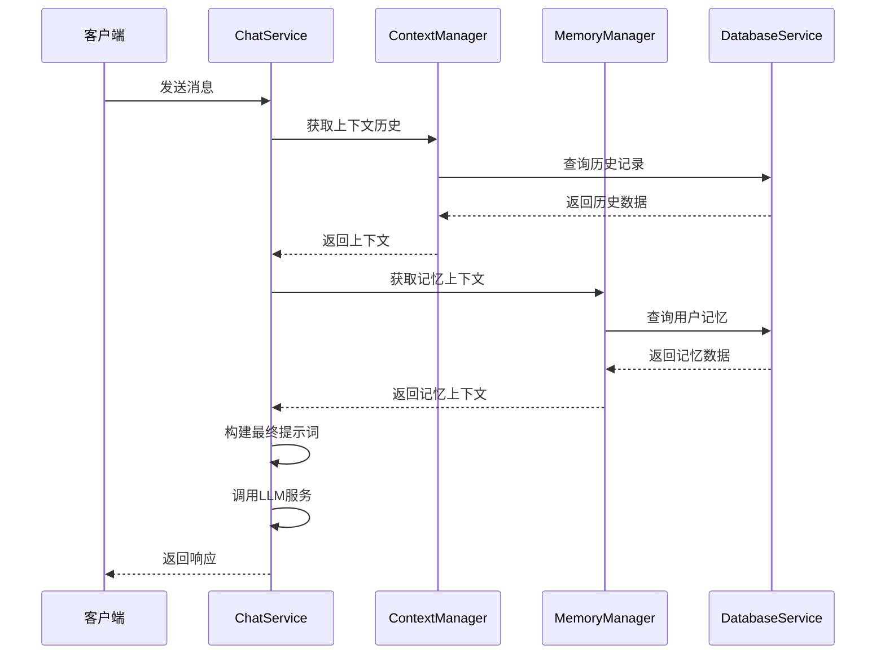
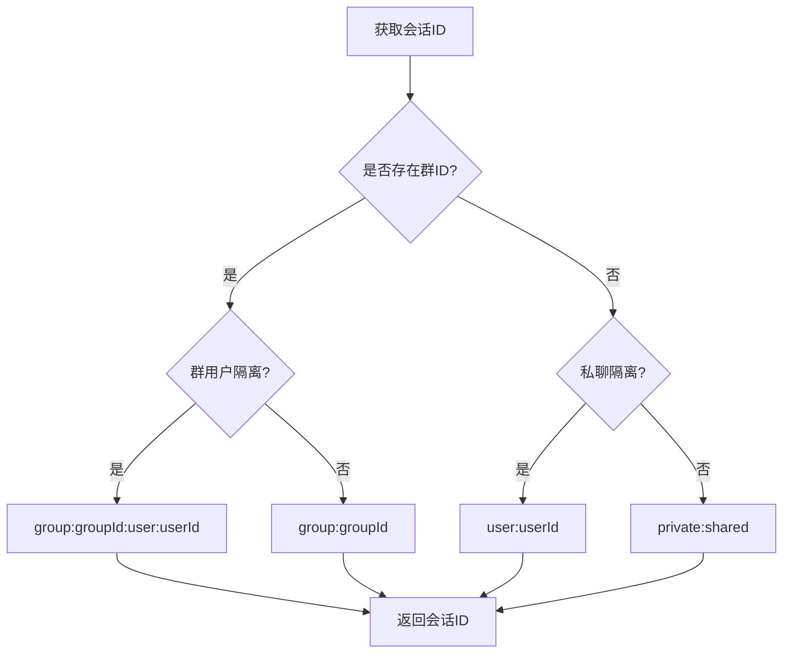
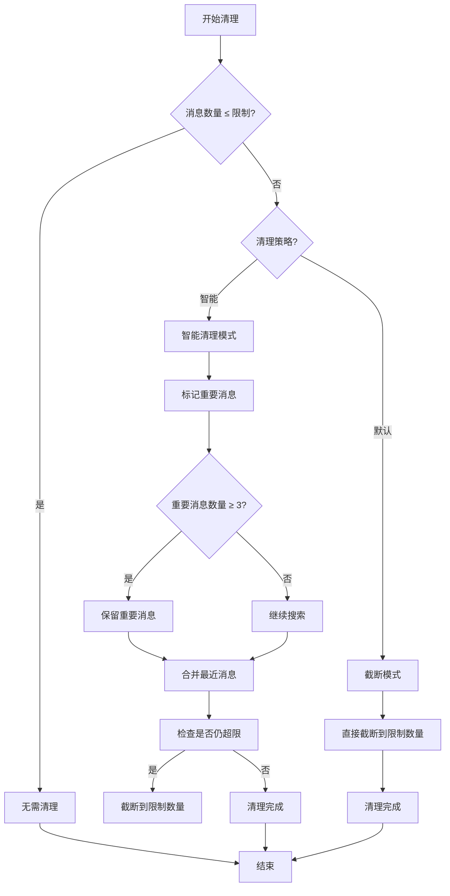
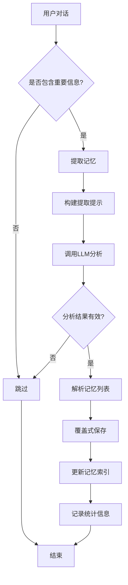
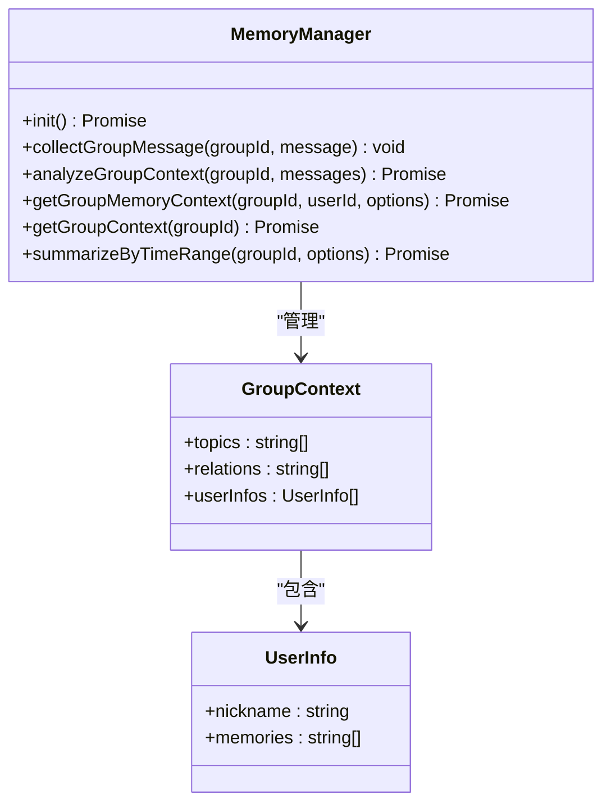
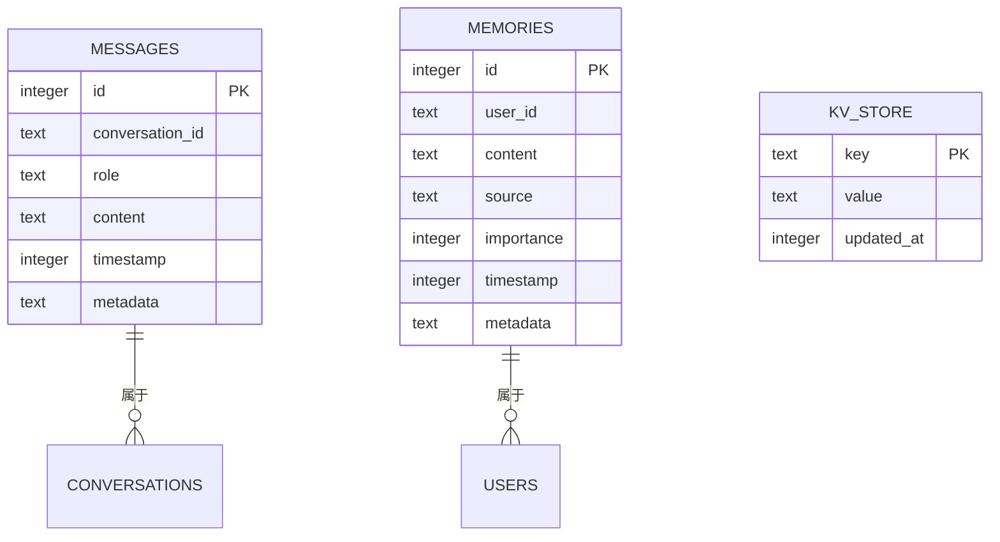
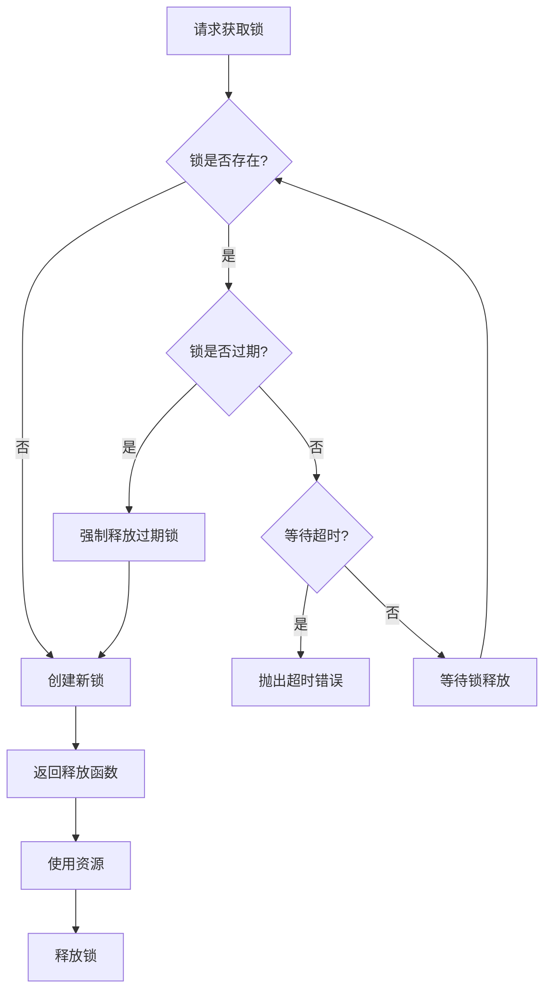
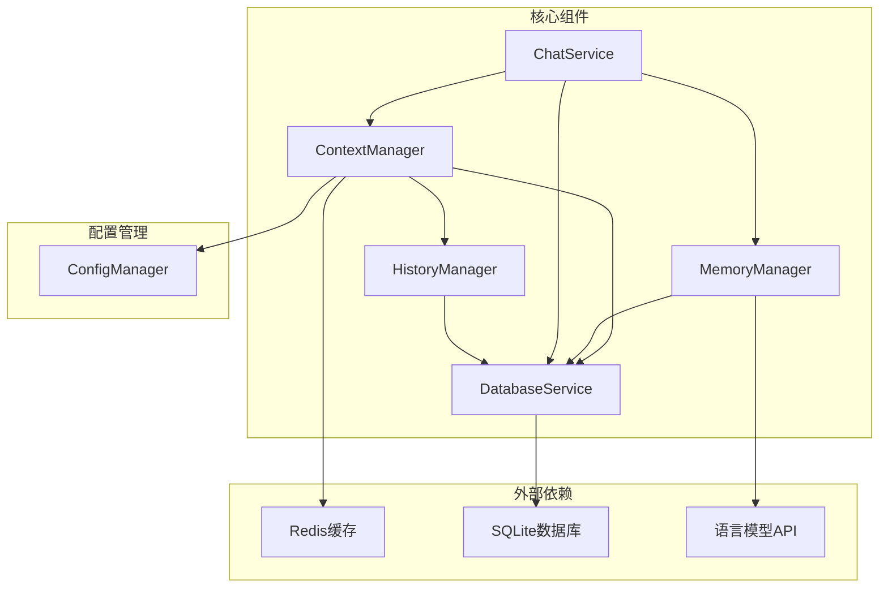
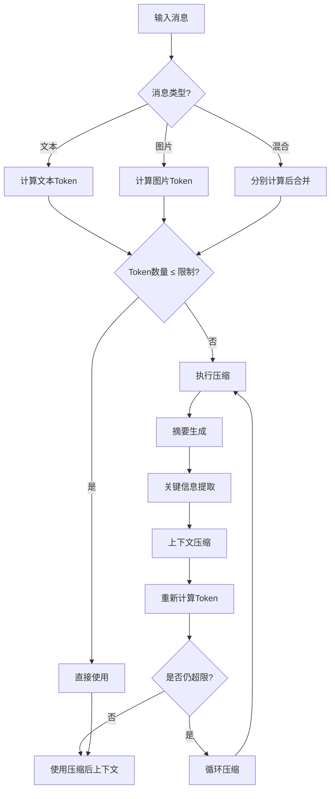

# 上下文管理机制

## 目录
1. [简介](#简介)
2. [项目结构](#项目结构)
3. [核心组件](#核心组件)
4. [架构概览](#架构概览)
5. [详细组件分析](#详细组件分析)
6. [依赖关系分析](#依赖关系分析)
7. [性能考虑](#性能考虑)
8. [故障排除指南](#故障排除指南)
9. [结论](#结论)

## 简介

上下文管理机制是本项目的核心功能之一，负责管理对话历史的存储、检索和使用。该机制实现了多层次的上下文管理策略，包括短期记忆和长期记忆的分离、智能清理算法、上下文压缩和摘要生成等功能。

系统通过ContextManager统一管理对话上下文，通过MemoryManager实现长期记忆管理，通过DatabaseService提供持久化存储，通过history.js实现历史记录管理。所有这些组件协同工作，为用户提供智能的对话体验。

## 项目结构

项目采用模块化设计，主要组件分布如下：

**图表来源**
- [ContextManager.js](file://src/services/llm/ContextManager.js#L1-L50)
- [MemoryManager.js](file://src/services/storage/MemoryManager.js#L1-L30)
- [DatabaseService.js](file://src/services/storage/DatabaseService.js#L1-L40)

**章节来源**
- [ContextManager.js](file://src/services/llm/ContextManager.js#L1-L100)
- [MemoryManager.js](file://src/services/storage/MemoryManager.js#L1-L50)
- [DatabaseService.js](file://src/services/storage/DatabaseService.js#L1-L80)

## 核心组件

### ContextManager - 上下文管理器

ContextManager是系统的核心组件，负责：
- 会话ID生成和管理
- 上下文历史的获取和清理
- 并发控制和消息队列管理
- 自动总结和上下文压缩
- 群聊上下文缓存

### MemoryManager - 记忆管理器

MemoryManager专门负责长期记忆的管理：
- 用户记忆的自动提取和总结
- 群聊记忆的聚合和维护
- 记忆的搜索和检索
- 记忆的持久化存储

### DatabaseService - 数据库服务

提供底层的数据持久化能力：
- SQLite数据库操作
- 记忆和消息的存储
- 查询和索引管理
- 数据库连接池管理

**章节来源**
- [ContextManager.js](file://src/services/llm/ContextManager.js#L8-L30)
- [MemoryManager.js](file://src/services/storage/MemoryManager.js#L8-L32)
- [DatabaseService.js](file://src/services/storage/DatabaseService.js#L19-L45)

## 架构概览

系统采用分层架构设计，实现了上下文管理的完整生命周期：

**图表来源**
- [ChatService.js](file://src/services/llm/ChatService.js#L68-L110)
- [ContextManager.js](file://src/services/llm/ContextManager.js#L419-L463)
- [MemoryManager.js](file://src/services/storage/MemoryManager.js#L820-L896)

## 详细组件分析

### 上下文历史管理

ContextManager实现了灵活的上下文历史管理机制：

#### 会话隔离策略

系统支持多种会话隔离模式：

**图表来源**
- [ContextManager.js](file://src/services/llm/ContextManager.js#L389-L409)

#### 上下文清理算法

系统提供了智能的上下文清理算法：

**图表来源**
- [ContextManager.js](file://src/services/llm/ContextManager.js#L664-L721)

**章节来源**
- [ContextManager.js](file://src/services/llm/ContextManager.js#L389-L463)
- [ContextManager.js](file://src/services/llm/ContextManager.js#L664-L721)

### 记忆管理系统

MemoryManager实现了多层次的记忆管理：

#### 记忆提取流程

**图表来源**
- [MemoryManager.js](file://src/services/storage/MemoryManager.js#L724-L808)

#### 群聊记忆聚合

MemoryManager支持群聊记忆的自动聚合：

**图表来源**
- [MemoryManager.js](file://src/services/storage/MemoryManager.js#L12-L18)
- [MemoryManager.js](file://src/services/storage/MemoryManager.js#L163-L346)

**章节来源**
- [MemoryManager.js](file://src/services/storage/MemoryManager.js#L724-L808)
- [MemoryManager.js](file://src/services/storage/MemoryManager.js#L163-L346)

### 数据持久化层

DatabaseService提供了完整的数据持久化能力：

#### 数据表结构

**图表来源**
- [DatabaseService.js](file://src/services/storage/DatabaseService.js#L47-L77)

**章节来源**
- [DatabaseService.js](file://src/services/storage/DatabaseService.js#L47-L77)
- [DatabaseService.js](file://src/services/storage/DatabaseService.js#L83-L182)

### 并发控制和队列管理

ContextManager实现了完善的并发控制机制：

#### 异步锁机制

**图表来源**
- [ContextManager.js](file://src/services/llm/ContextManager.js#L38-L109)

**章节来源**
- [ContextManager.js](file://src/services/llm/ContextManager.js#L38-L109)

## 依赖关系分析

系统组件之间的依赖关系如下：

**图表来源**
- [ContextManager.js](file://src/services/llm/ContextManager.js#L1-L10)
- [MemoryManager.js](file://src/services/storage/MemoryManager.js#L1-L10)
- [ChatService.js](file://src/services/llm/ChatService.js#L1-L20)

**章节来源**
- [ContextManager.js](file://src/services/llm/ContextManager.js#L1-L10)
- [MemoryManager.js](file://src/services/storage/MemoryManager.js#L1-L10)
- [ChatService.js](file://src/services/llm/ChatService.js#L1-L20)

## 性能考虑

### 内存管理优化

系统采用了多项内存管理优化策略：

1. **智能缓存机制**：ContextManager使用LRU缓存策略管理群聊上下文
2. **消息队列限制**：防止消息队列无限增长，最多保留100条消息
3. **数据库连接池**：使用WAL模式提高并发性能
4. **索引优化**：为常用查询字段建立索引

### Token限制控制

系统实现了多层次的Token限制控制：

**图表来源**
- [ContextManager.js](file://src/services/llm/ContextManager.js#L192-L261)

### 性能监控

系统提供了详细的性能监控机制：

- **请求计数器**：跟踪并发请求数量
- **处理时间统计**：记录各种操作的执行时间
- **内存使用监控**：监控内存使用情况
- **数据库查询优化**：提供查询性能分析

**章节来源**
- [ContextManager.js](file://src/services/llm/ContextManager.js#L268-L290)
- [ContextManager.js](file://src/services/llm/ContextManager.js#L114-L184)

## 故障排除指南

### 常见问题及解决方案

#### 上下文丢失问题

**问题现象**：用户反馈对话历史丢失

**可能原因**：
1. 会话ID生成策略变化
2. 数据库连接异常
3. 缓存失效

**解决方案**：
1. 检查会话隔离配置
2. 验证数据库连接状态
3. 清理缓存并重启服务

#### 性能问题

**问题现象**：系统响应缓慢

**可能原因**：
1. 数据库查询性能问题
2. 缓存命中率低
3. 并发请求过多

**解决方案**：
1. 优化数据库查询索引
2. 调整缓存策略
3. 实施请求限流

#### 记忆提取失败

**问题现象**：记忆提取功能异常

**可能原因**：
1. LLM API调用失败
2. 记忆格式解析错误
3. 数据库存储异常

**解决方案**：
1. 检查LLM API配置
2. 验证记忆格式
3. 重建数据库索引

**章节来源**
- [ContextManager.js](file://src/services/llm/ContextManager.js#L114-L184)
- [MemoryManager.js](file://src/services/storage/MemoryManager.js#L348-L389)

## 结论

本上下文管理机制通过模块化设计实现了高效的对话历史管理。系统的主要优势包括：

1. **灵活的隔离策略**：支持多种会话隔离模式，满足不同场景需求
2. **智能清理算法**：通过重要性标记和智能截断保证上下文质量
3. **多层次记忆管理**：短期记忆和长期记忆分离，提升用户体验
4. **完善的性能优化**：内存管理、Token控制、并发处理等多方面优化
5. **可靠的错误处理**：完善的异常处理和恢复机制

该机制为AI聊天应用提供了坚实的基础，能够有效管理复杂的对话历史，提升AI助手的智能化水平。通过持续的优化和改进，系统能够更好地适应各种应用场景的需求。
