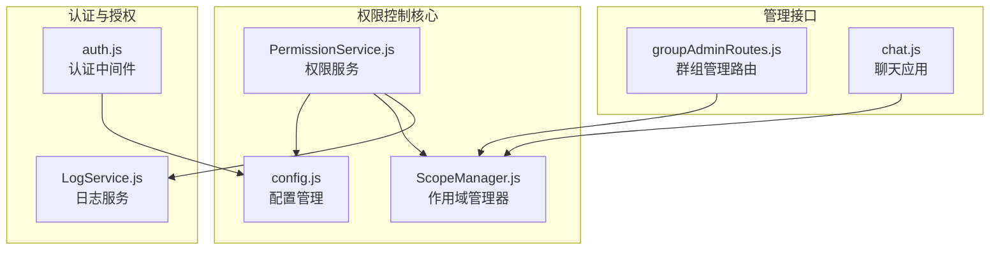
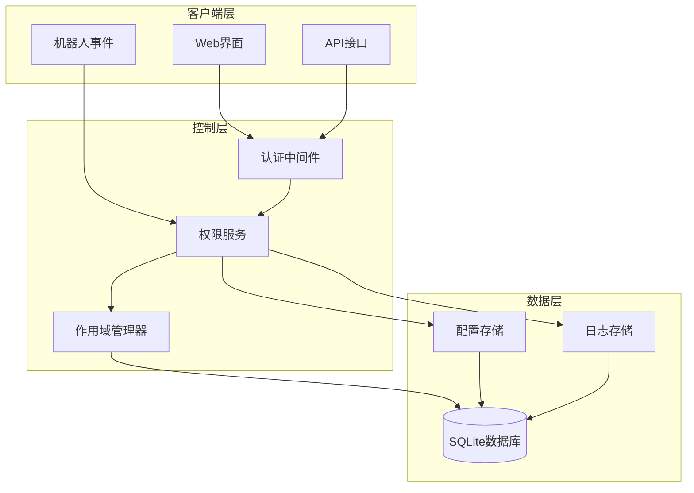
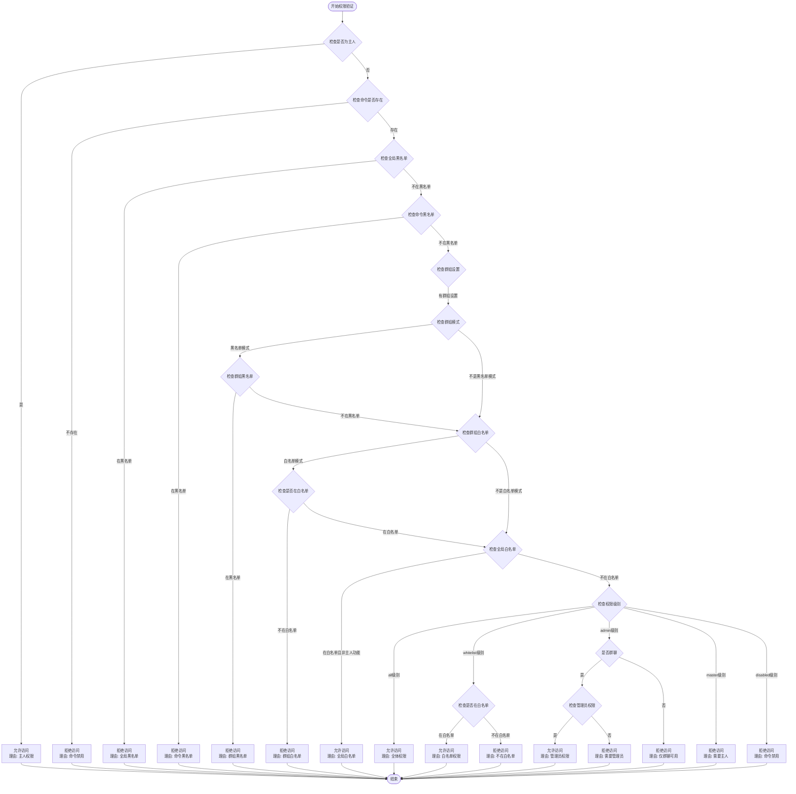
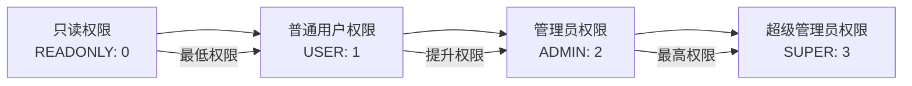
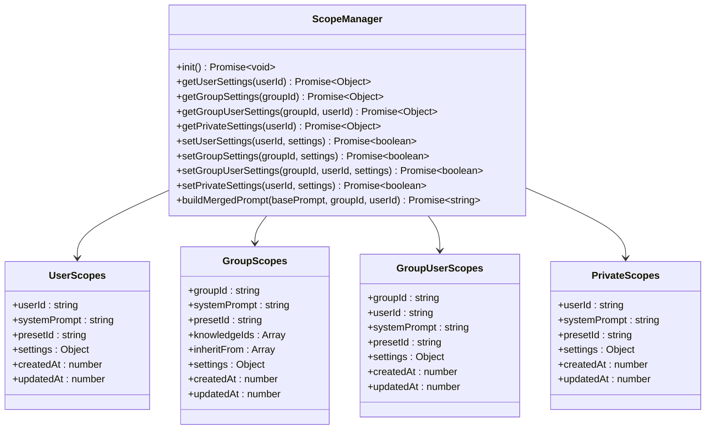
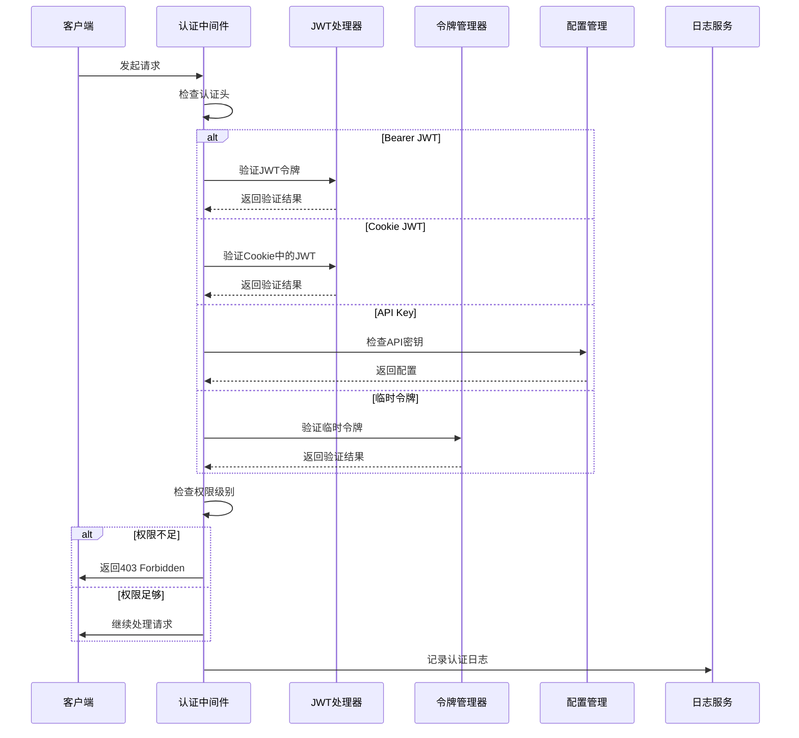
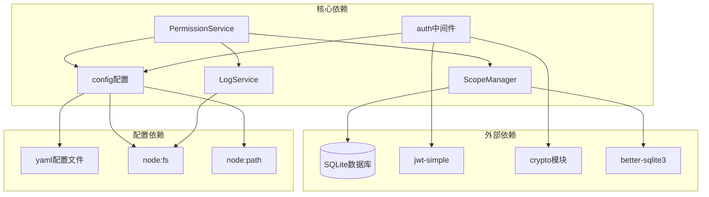
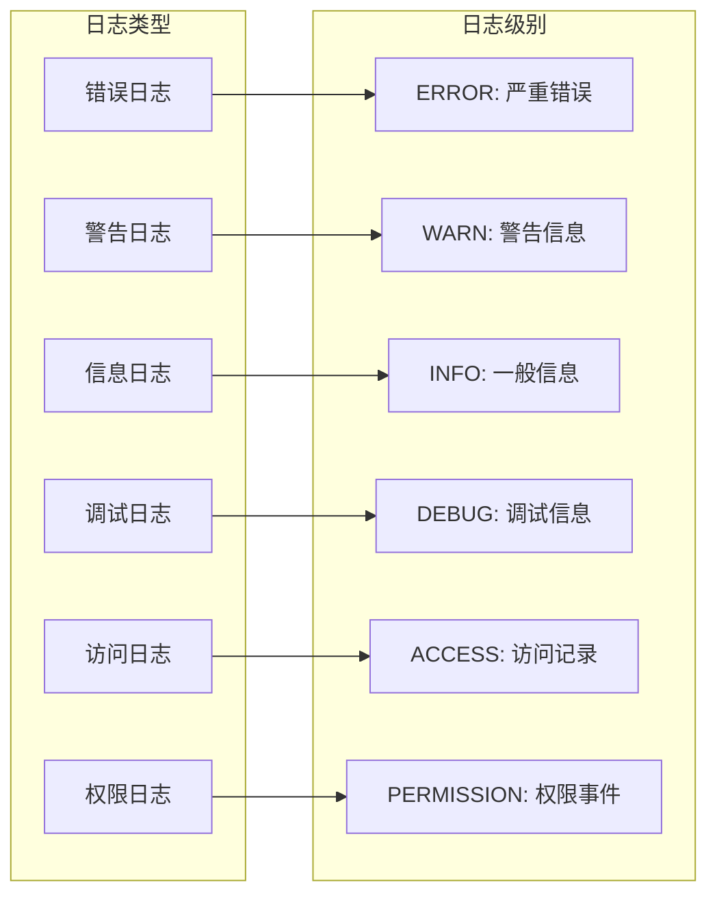

# 权限控制系统

<cite>
**本文档引用的文件**
- [PermissionService.js](file://src/services/permission/PermissionService.js)
- [config.js](file://config/config.js)
- [auth.js](file://src/services/middleware/auth.js)
- [ScopeManager.js](file://src/services/scope/ScopeManager.js)
- [groupAdminRoutes.js](file://src/services/routes/groupAdminRoutes.js)
- [chat.js](file://apps/chat.js)
- [LogService.js](file://src/services/stats/LogService.js)
</cite>

## 目录
1. [简介](#简介)
2. [项目结构](#项目结构)
3. [核心组件](#核心组件)
4. [架构概览](#架构概览)
5. [详细组件分析](#详细组件分析)
6. [依赖关系分析](#依赖关系分析)
7. [性能考虑](#性能考虑)
8. [故障排除指南](#故障排除指南)
9. [结论](#结论)

## 简介

权限控制系统是基于 Yunzai 框架开发的智能聊天插件的核心安全组件，负责管理用户和群组的访问权限、黑白名单机制以及权限验证流程。该系统采用多层次的权限控制策略，支持全局权限配置和群组独立权限设置，实现了灵活而强大的访问控制能力。

系统主要特点包括：
- 多层次权限控制：支持全局、群组、用户级别的权限管理
- 黑白名单机制：提供灵活的用户访问控制策略
- 实时权限验证：支持动态权限变更的即时生效
- 完整的审计日志：记录所有权限相关的操作和事件
- 安全的认证机制：集成 JWT 和临时令牌系统

## 项目结构

权限控制系统在项目中的组织结构如下：

**图表来源**
- [PermissionService.js](file://src/services/permission/PermissionService.js#L1-L50)
- [ScopeManager.js](file://src/services/scope/ScopeManager.js#L1-L30)
- [auth.js](file://src/services/middleware/auth.js#L1-L30)

**章节来源**
- [PermissionService.js](file://src/services/permission/PermissionService.js#L1-L50)
- [ScopeManager.js](file://src/services/scope/ScopeManager.js#L1-L30)
- [auth.js](file://src/services/middleware/auth.js#L1-L30)

## 核心组件

### 权限服务 (PermissionService)

权限服务是整个权限控制系统的核心组件，负责执行具体的权限验证逻辑。它支持以下主要功能：

- **多级别权限检查**：支持 all、whitelist、admin、master 等不同权限级别
- **黑白名单验证**：检查用户是否在全局或群组级别的黑白名单中
- **主人权限管理**：识别和验证系统主人的特殊权限
- **动态权限验证**：支持从事件对象直接进行权限检查

### 作用域管理器 (ScopeManager)

作用域管理器负责管理用户和群组的独立配置，支持五层作用域：

1. **用户全局作用域**：用户在所有场景的默认设置
2. **群组作用域**：特定群组的默认设置
3. **群用户作用域**：特定群组中特定用户的设置
4. **私聊作用域**：用户在私聊场景的独立设置
5. **频道作用域**：预留用于频道/子频道的设置

### 认证中间件 (auth.js)

提供完整的认证和授权机制：

- **JWT 令牌管理**：支持短期和长期 JWT 令牌
- **临时令牌系统**：用于一次性登录和临时访问
- **权限级别控制**：支持只读、用户、管理员、超级管理员四个级别
- **安全头设置**：提供 CSRF 保护和其他安全措施

**章节来源**
- [PermissionService.js](file://src/services/permission/PermissionService.js#L22-L50)
- [ScopeManager.js](file://src/services/scope/ScopeManager.js#L17-L25)
- [auth.js](file://src/services/middleware/auth.js#L13-L25)

## 架构概览

权限控制系统采用分层架构设计，确保了良好的模块分离和扩展性：

**图表来源**
- [PermissionService.js](file://src/services/permission/PermissionService.js#L337-L421)
- [auth.js](file://src/services/middleware/auth.js#L179-L254)
- [ScopeManager.js](file://src/services/scope/ScopeManager.js#L26-L120)

系统的核心交互流程包括：

1. **权限验证流程**：客户端请求 → 认证中间件 → 权限服务 → 作用域管理器
2. **配置管理流程**：管理员操作 → 作用域管理器 → 数据库存储
3. **审计日志流程**：权限事件 → 日志服务 → 文件存储

**章节来源**
- [PermissionService.js](file://src/services/permission/PermissionService.js#L337-L483)
- [auth.js](file://src/services/middleware/auth.js#L179-L275)

## 详细组件分析

### 权限验证算法

权限验证采用多层检查机制，确保安全性和灵活性：

**图表来源**
- [PermissionService.js](file://src/services/permission/PermissionService.js#L337-L421)

### 黑白名单机制

系统支持三种级别的黑白名单控制：

#### 全局黑白名单
- **配置位置**：`config.permissions.globalWhitelist` 和 `config.permissions.globalBlacklist`
- **作用范围**：影响所有命令和功能
- **优先级**：最高优先级，可绕过其他权限检查

#### 命令级黑白名单
- **配置位置**：每个命令配置中的 `whitelist` 和 `blacklist` 字段
- **作用范围**：仅影响特定命令
- **优先级**：仅次于全局黑白名单

#### 群组独立黑白名单
- **配置位置**：通过 `ScopeManager` 管理的群组设置
- **作用范围**：仅影响特定群组内的用户
- **模式支持**：
  - **黑名单模式**：阻止黑名单中的用户访问
  - **白名单模式**：仅允许白名单中的用户访问

### 权限级别体系

系统采用四级权限级别，从低到高依次为：

**图表来源**
- [auth.js](file://src/services/middleware/auth.js#L13-L18)

#### 权限级别说明

- **只读权限 (READONLY: 0)**：仅能查看信息，不能执行任何操作
- **普通用户权限 (USER: 1)**：可以执行基本的用户操作
- **管理员权限 (ADMIN: 2)**：可以管理群组和用户，但不能访问系统管理功能
- **超级管理员权限 (SUPER: 3)**：拥有系统最高权限，可以执行所有操作

### 群组权限配置

群组权限配置通过 `ScopeManager` 实现，支持复杂的继承和覆盖机制：

**图表来源**
- [ScopeManager.js](file://src/services/scope/ScopeManager.js#L17-L120)

### 认证与授权流程

**图表来源**
- [auth.js](file://src/services/middleware/auth.js#L179-L275)

**章节来源**
- [PermissionService.js](file://src/services/permission/PermissionService.js#L337-L483)
- [ScopeManager.js](file://src/services/scope/ScopeManager.js#L17-L120)
- [auth.js](file://src/services/middleware/auth.js#L179-L275)

## 依赖关系分析

权限控制系统的主要依赖关系如下：

**图表来源**
- [PermissionService.js](file://src/services/permission/PermissionService.js#L1-L10)
- [ScopeManager.js](file://src/services/scope/ScopeManager.js#L1-L10)
- [auth.js](file://src/services/middleware/auth.js#L5-L10)

### 模块耦合度分析

系统采用松耦合设计，各模块间通过清晰的接口进行通信：

- **权限服务**：主要依赖配置管理和作用域管理器
- **作用域管理器**：依赖数据库服务和配置管理
- **认证中间件**：依赖配置管理和加密模块
- **日志服务**：独立运作，为其他模块提供审计功能

### 循环依赖检查

经过分析，系统不存在循环依赖问题：
- 权限服务 → 作用域管理器 → 数据库服务（单向依赖）
- 认证中间件 → 配置管理 → 配置文件（单向依赖）
- 日志服务独立于其他模块

**章节来源**
- [PermissionService.js](file://src/services/permission/PermissionService.js#L1-L10)
- [ScopeManager.js](file://src/services/scope/ScopeManager.js#L1-L10)
- [auth.js](file://src/services/middleware/auth.js#L5-L10)

## 性能考虑

### 缓存策略

系统采用多层缓存机制来优化性能：

1. **配置缓存**：配置文件加载后缓存在内存中
2. **权限结果缓存**：近期的权限检查结果进行缓存
3. **数据库连接池**：复用数据库连接减少开销

### 查询优化

- **索引优化**：为常用查询字段建立数据库索引
- **批量操作**：支持批量权限检查和更新操作
- **延迟加载**：按需加载配置和设置数据

### 并发处理

系统支持高并发场景：
- **异步操作**：所有数据库操作都是异步的
- **无锁设计**：避免不必要的锁竞争
- **事务管理**：重要操作使用数据库事务保证一致性

## 故障排除指南

### 常见问题及解决方案

#### 权限验证失败

**症状**：用户无法执行某些操作，系统返回权限不足

**排查步骤**：
1. 检查用户是否在全局黑名单中
2. 验证命令级别的黑白名单设置
3. 确认群组独立权限配置
4. 查看权限验证日志

#### 主人权限异常

**症状**：系统主人无法执行管理操作

**排查步骤**：
1. 验证主人列表配置
2. 检查框架集成配置
3. 确认永久令牌状态
4. 查看认证日志

#### 群组权限不生效

**症状**：群组独立权限设置未按预期工作

**排查步骤**：
1. 检查群组设置是否正确保存
2. 验证权限继承链
3. 确认群组模式配置
4. 查看作用域管理器日志

### 审计日志分析

系统提供全面的审计日志功能：

**图表来源**
- [LogService.js](file://src/services/stats/LogService.js#L12-L25)

### 性能监控

系统内置性能监控功能：
- **响应时间监控**：跟踪权限检查的执行时间
- **内存使用监控**：监控内存占用情况
- **数据库性能监控**：跟踪数据库查询性能
- **并发请求监控**：监控同时处理的请求数量

**章节来源**
- [LogService.js](file://src/services/stats/LogService.js#L12-L553)

## 结论

权限控制系统通过其精心设计的架构和实现，为智能聊天插件提供了强大而灵活的安全保障。系统的主要优势包括：

1. **多层次权限控制**：支持从全局到群组再到用户的细粒度权限管理
2. **灵活的黑白名单机制**：提供多种模式满足不同的安全需求
3. **实时权限验证**：支持动态权限变更的即时生效
4. **完善的审计功能**：提供全面的操作日志和安全审计
5. **高性能设计**：采用缓存和优化策略确保系统性能

该系统不仅满足了当前的功能需求，还为未来的扩展和增强提供了良好的基础。通过合理的架构设计和实现细节，确保了系统的安全性、可靠性和可维护性。