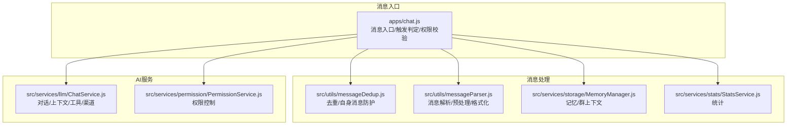
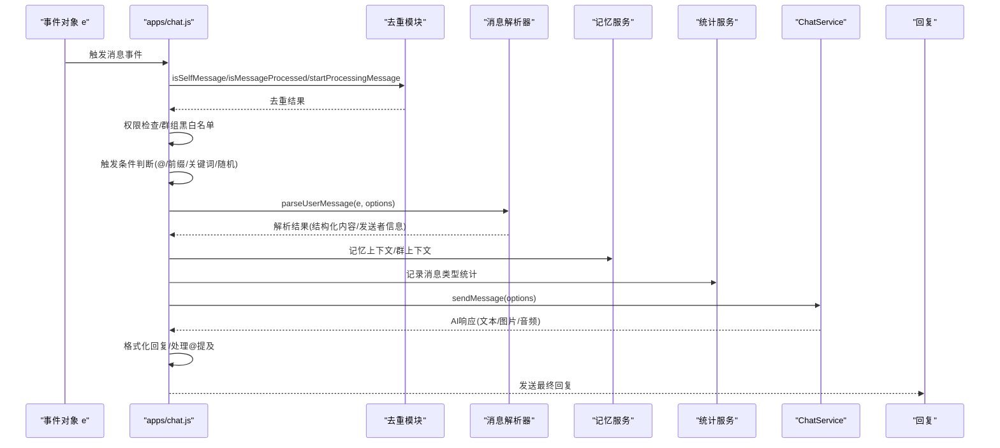
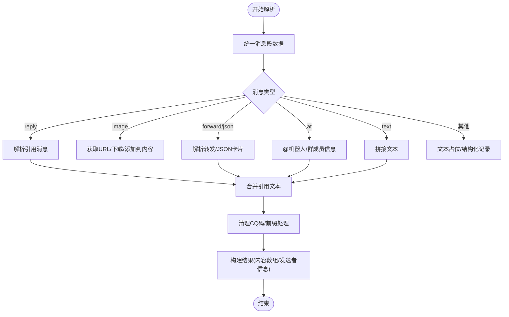
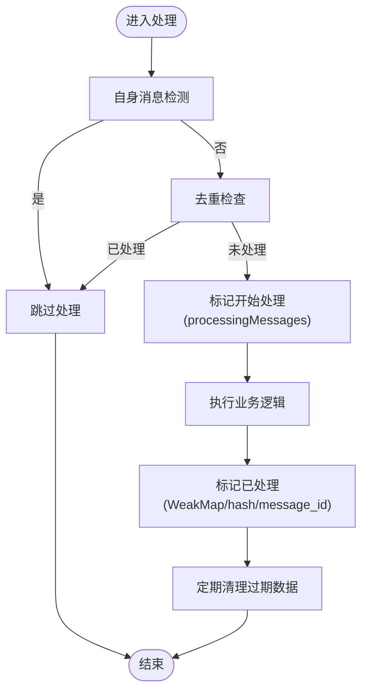
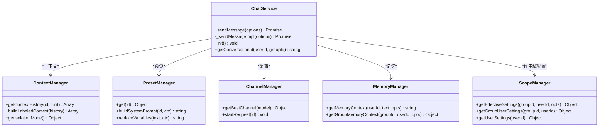
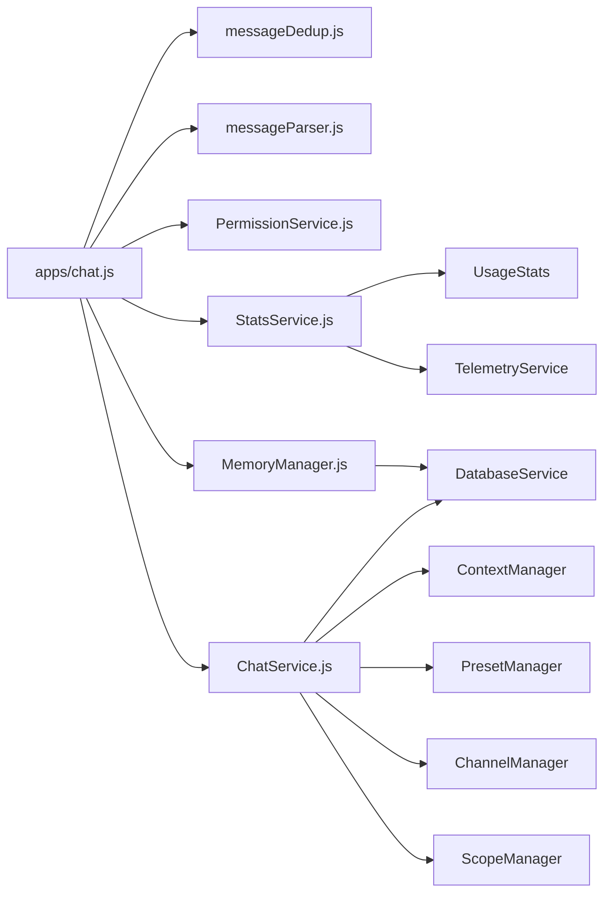

# 消息处理流程

<cite>
**本文档引用的文件**
- [messageParser.js](file://src/utils/messageParser.js)
- [messageDedup.js](file://src/utils/messageDedup.js)
- [chat.js](file://apps/chat.js)
- [ChatService.js](file://src/services/llm/ChatService.js)
- [MemoryManager.js](file://src/services/storage/MemoryManager.js)
- [StatsService.js](file://src/services/stats/StatsService.js)
- [PermissionService.js](file://src/services/permission/PermissionService.js)
</cite>

## 目录
1. [简介](#简介)
2. [项目结构](#项目结构)
3. [核心组件](#核心组件)
4. [架构总览](#架构总览)
5. [详细组件分析](#详细组件分析)
6. [依赖关系分析](#依赖关系分析)
7. [性能考虑](#性能考虑)
8. [故障排查指南](#故障排查指南)
9. [结论](#结论)

## 简介
本文档深入解析从消息接收到最终回复的完整处理链路，涵盖消息接收、预处理、去重检查、触发条件判断、权限验证、消息解析器对多类型内容的处理、消息去重机制、预处理/清理/格式化步骤，以及错误处理、异常恢复与调试信息记录的实现方案。

## 项目结构
消息处理流程主要分布在以下模块：
- apps/chat.js：消息入口与触发判定、权限校验、消息去重、调用LLM服务与回复组装
- src/utils/messageParser.js：消息解析器，统一处理文本、图片、引用、@机器人等多类型消息
- src/utils/messageDedup.js：消息去重与自身消息防护
- src/services/llm/ChatService.js：LLM对话服务，负责上下文构建、工具调用、渠道选择与响应处理
- src/services/storage/MemoryManager.js：记忆与群聊上下文管理
- src/services/stats/StatsService.js：消息与调用统计
- src/services/permission/PermissionService.js：权限控制与黑白名单



**图表来源**
- [chat.js](file://apps/chat.js#L89-L203)
- [messageDedup.js](file://src/utils/messageDedup.js#L1-L368)
- [messageParser.js](file://src/utils/messageParser.js#L137-L812)
- [ChatService.js](file://src/services/llm/ChatService.js#L46-L110)
- [MemoryManager.js](file://src/services/storage/MemoryManager.js#L12-L81)
- [StatsService.js](file://src/services/stats/StatsService.js#L19-L136)
- [PermissionService.js](file://src/services/permission/PermissionService.js#L22-L484)

**章节来源**
- [chat.js](file://apps/chat.js#L89-L203)
- [messageDedup.js](file://src/utils/messageDedup.js#L1-L368)
- [messageParser.js](file://src/utils/messageParser.js#L137-L812)
- [ChatService.js](file://src/services/llm/ChatService.js#L46-L110)
- [MemoryManager.js](file://src/services/storage/MemoryManager.js#L12-L81)
- [StatsService.js](file://src/services/stats/StatsService.js#L19-L136)
- [PermissionService.js](file://src/services/permission/PermissionService.js#L22-L484)

## 核心组件
- 消息解析器：统一多协议消息段，解析文本、图片、引用、@机器人、转发、JSON卡片、语音、视频、表情、骰子/猜拳、地理位置、音乐分享等，支持清理CQ码、提取发送者信息、构建结构化内容数组
- 消息去重模块：基于事件对象、message_id、消息指纹、正在处理集合进行去重，防止重复处理与自身消息回显
- 触发判定与权限：支持@触发、前缀触发、关键词触发、随机触发、群组独立配置、黑白名单、群组独立黑白名单
- LLM服务：上下文管理、预设/作用域配置、工具调用、渠道选择、响应格式化
- 记忆与统计：周期性轮询、群上下文采集、记忆提取、消息与调用统计

**章节来源**
- [messageParser.js](file://src/utils/messageParser.js#L137-L812)
- [messageDedup.js](file://src/utils/messageDedup.js#L28-L212)
- [chat.js](file://apps/chat.js#L298-L381)
- [ChatService.js](file://src/services/llm/ChatService.js#L115-L134)
- [MemoryManager.js](file://src/services/storage/MemoryManager.js#L114-L156)
- [StatsService.js](file://src/services/stats/StatsService.js#L110-L136)

## 架构总览
消息处理链路从apps/chat.js的handleMessage入口开始，依次进行去重检查、权限验证、触发条件判断、消息解析、上下文构建与工具调用，最终格式化回复并发送。



**图表来源**
- [chat.js](file://apps/chat.js#L109-L203)
- [messageDedup.js](file://src/utils/messageDedup.js#L243-L319)
- [messageParser.js](file://src/utils/messageParser.js#L137-L812)
- [ChatService.js](file://src/services/llm/ChatService.js#L68-L110)
- [StatsService.js](file://src/services/stats/StatsService.js#L110-L136)

## 详细组件分析

### 消息解析器（messageParser.js）
- 统一消息段数据：兼容NapCat/OneBot与icqq格式，统一提取type/data
- URL解析与媒体处理：统一获取图片/视频/文件URL，支持HTTP/base64/file路径，QQ图片预下载
- 引用消息解析：跨平台获取引用消息，支持转发合并消息、JSON卡片、视频、表情、原创表情(bface)、@、文件等
- 转发消息解析：递归解析嵌套转发，限制最大深度，支持多平台API
- 文本清理与格式化：清理CQ码、前缀模式清理、@机器人清理、构建最终文本与结构化内容数组
- 发送者信息与引用/转发元数据：提取发送者、消息标识、原始消息段等，便于工具使用



**图表来源**
- [messageParser.js](file://src/utils/messageParser.js#L137-L812)
- [messageParser.js](file://src/utils/messageParser.js#L836-L1289)
- [messageParser.js](file://src/utils/messageParser.js#L1299-L1599)

**章节来源**
- [messageParser.js](file://src/utils/messageParser.js#L37-L116)
- [messageParser.js](file://src/utils/messageParser.js#L137-L812)
- [messageParser.js](file://src/utils/messageParser.js#L836-L1289)
- [messageParser.js](file://src/utils/messageParser.js#L1299-L1599)

### 消息去重与自身消息防护（messageDedup.js）
- 自身消息检测：多平台适配，包括stdin适配器、message_sent/self/sub_type、发送者ID与self_id比对、发送回显指纹
- 并发处理防护：基于message_id的processingMessages集合，防止重复处理
- 去重策略：WeakMap事件对象标记、message_id记录、近期消息hash表、发送指纹表，定期清理过期数据
- 机器人ID集合：支持多账号/多适配器的机器人ID识别



**图表来源**
- [messageDedup.js](file://src/utils/messageDedup.js#L243-L319)
- [messageDedup.js](file://src/utils/messageDedup.js#L157-L170)
- [messageDedup.js](file://src/utils/messageDedup.js#L177-L212)
- [messageDedup.js](file://src/utils/messageDedup.js#L60-L91)

**章节来源**
- [messageDedup.js](file://src/utils/messageDedup.js#L243-L319)
- [messageDedup.js](file://src/utils/messageDedup.js#L157-L170)
- [messageDedup.js](file://src/utils/messageDedup.js#L177-L212)
- [messageDedup.js](file://src/utils/messageDedup.js#L60-L91)

### 触发条件判断与权限验证（apps/chat.js）
- 触发模式：@触发、前缀触发、关键词触发、随机触发，支持群组独立配置与前缀人格
- 权限控制：全局黑白名单、群组独立黑白名单、管理员/群主权限
- 命令与系统消息：拦截特定系统命令，避免与插件命令冲突
- 去重与缓存：消息去重、群消息缓存、群触发配置缓存

```mermaid
flowchart TD
A(["checkTrigger"]) --> Mode{"触发模式"}
Mode --> |@触发| At["检查atBot/引用机器人"]
Mode --> |前缀| Prefix["检查前缀/前缀人格"]
Mode --> |关键词| Keyword["检查关键词"]
Mode --> |随机| Random["按概率触发"]
At --> Result["返回触发结果"]
Prefix --> Result
Keyword --> Result
Random --> Result
```

**图表来源**
- [chat.js](file://apps/chat.js#L298-L381)
- [chat.js](file://apps/chat.js#L418-L444)

**章节来源**
- [chat.js](file://apps/chat.js#L298-L381)
- [chat.js](file://apps/chat.js#L418-L444)
- [chat.js](file://apps/chat.js#L245-L293)

### LLM服务与上下文构建（ChatService.js）
- 会话隔离：群聊共享上下文，私聊用户独立上下文
- 预设与作用域：预设ID/模型ID/功能配置，支持群组/用户独立配置
- 记忆与知识库：用户记忆、群聊记忆、知识库上下文拼接
- 工具调用：根据配置加载工具，支持MCP工具
- 渠道选择：群独立渠道优先，否则使用全局渠道
- 错误处理：自动清理历史对话（可配置）



**图表来源**
- [ChatService.js](file://src/services/llm/ChatService.js#L46-L110)
- [ChatService.js](file://src/services/llm/ChatService.js#L115-L134)
- [ChatService.js](file://src/services/llm/ChatService.js#L160-L226)
- [ChatService.js](file://src/services/llm/ChatService.js#L336-L399)

**章节来源**
- [ChatService.js](file://src/services/llm/ChatService.js#L46-L110)
- [ChatService.js](file://src/services/llm/ChatService.js#L115-L134)
- [ChatService.js](file://src/services/llm/ChatService.js#L160-L226)
- [ChatService.js](file://src/services/llm/ChatService.js#L336-L399)

### 记忆与群上下文（MemoryManager.js）
- 群聊上下文采集：内存缓冲区+数据库持久化，周期性分析提取话题、关系、用户信息
- 用户记忆：周期性轮询分析对话，提取个人信息并覆盖式保存
- 记忆解析：过滤无效内容，合并现有与新增记忆

**章节来源**
- [MemoryManager.js](file://src/services/storage/MemoryManager.js#L114-L156)
- [MemoryManager.js](file://src/services/storage/MemoryManager.js#L163-L346)
- [MemoryManager.js](file://src/services/storage/MemoryManager.js#L535-L653)

### 统计与监控（StatsService.js）
- 消息统计：按类型、群组、用户、小时分布统计
- API调用统计：内存统计+遥测+Redis详细记录，支持估算与实际usage
- 实时RPM：滑动窗口统计请求速率

**章节来源**
- [StatsService.js](file://src/services/stats/StatsService.js#L110-L136)
- [StatsService.js](file://src/services/stats/StatsService.js#L230-L360)
- [StatsService.js](file://src/services/stats/StatsService.js#L42-L72)

### 权限控制（PermissionService.js）
- 命令权限：支持all/whitelist/admin/master等权限级别
- 黑白名单：全局/群组独立黑白名单，支持白名单模式
- 主人判定：多来源合并（插件配置/框架配置/开发者列表）

**章节来源**
- [PermissionService.js](file://src/services/permission/PermissionService.js#L337-L421)
- [PermissionService.js](file://src/services/permission/PermissionService.js#L457-L480)

## 依赖关系分析
- apps/chat.js依赖去重模块、消息解析器、权限服务、统计服务、记忆服务、LLM服务
- ChatService依赖上下文管理、预设管理、渠道管理、记忆服务、作用域管理
- MemoryManager依赖数据库服务、LLM服务、统计服务
- StatsService与Telemetry/UsageStats协作记录详细使用情况



**图表来源**
- [chat.js](file://apps/chat.js#L1-L33)
- [ChatService.js](file://src/services/llm/ChatService.js#L1-L30)
- [MemoryManager.js](file://src/services/storage/MemoryManager.js#L1-L8)
- [StatsService.js](file://src/services/stats/StatsService.js#L1-L17)

**章节来源**
- [chat.js](file://apps/chat.js#L1-L33)
- [ChatService.js](file://src/services/llm/ChatService.js#L1-L30)
- [MemoryManager.js](file://src/services/storage/MemoryManager.js#L1-L8)
- [StatsService.js](file://src/services/stats/StatsService.js#L1-L17)

## 性能考虑
- 去重与并发：processingMessages集合与定期清理，避免重复处理与内存膨胀
- 缓存与懒加载：群触发配置缓存、ScopeManager延迟初始化
- 媒体处理：图片预下载与base64传输，减少下游API负担
- 统计频率：批量保存统计，降低IO开销
- 上下文长度：合理限制历史消息数量，平衡上下文质量与性能

[本节为通用指导，无需特定文件引用]

## 故障排查指南
- 自身消息回显：检查isSelfMessage与发送指纹记录，确认adapter与self_id识别
- 重复消息：检查message_id与hash去重，确认processingMessages与清理逻辑
- 触发失败：核对@触发、前缀、关键词、随机触发配置，检查群组独立配置
- 权限拒绝：检查全局/群组黑白名单、管理员权限、命令级别
- LLM错误：查看自动清理配置，确认渠道可用性与密钥轮换
- 统计异常：检查统计服务初始化与保存时机，确认遥测与Redis连接

**章节来源**
- [messageDedup.js](file://src/utils/messageDedup.js#L243-L319)
- [chat.js](file://apps/chat.js#L112-L113)
- [chat.js](file://apps/chat.js#L155-L165)
- [PermissionService.js](file://src/services/permission/PermissionService.js#L337-L421)
- [ChatService.js](file://src/services/llm/ChatService.js#L68-L110)
- [StatsService.js](file://src/services/stats/StatsService.js#L93-L104)

## 结论
该消息处理流程通过“入口去重+权限校验+触发判定+消息解析+上下文构建+LLM服务”的分层设计，实现了对多协议、多类型消息的统一处理与高效扩展。消息解析器提供强大的内容抽取与格式化能力，去重模块保障稳定性，权限与作用域配置确保可控性，统计与遥测提供可观测性。整体架构清晰、职责分离、易于维护与演进。