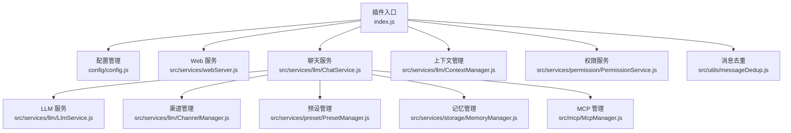
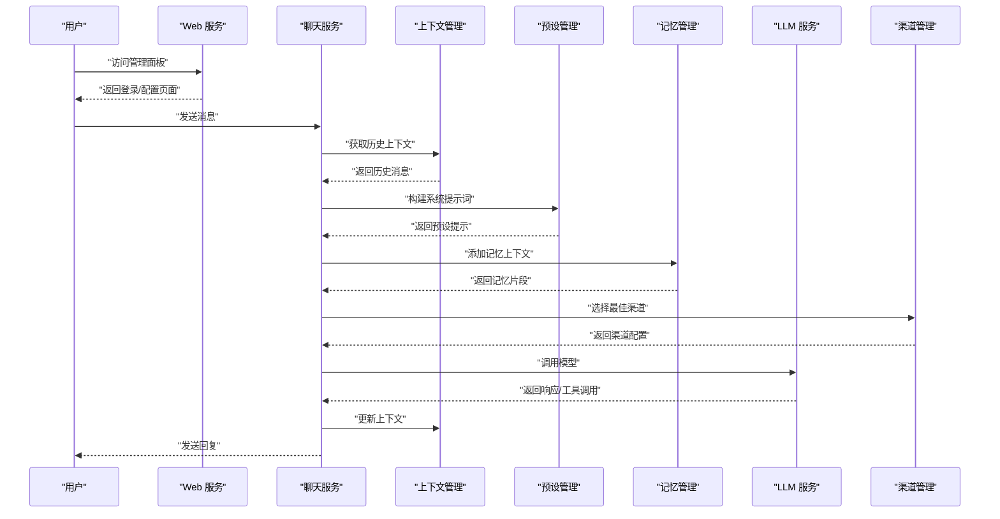
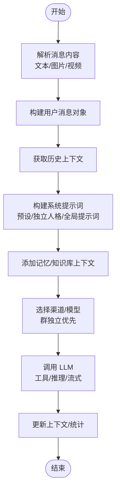
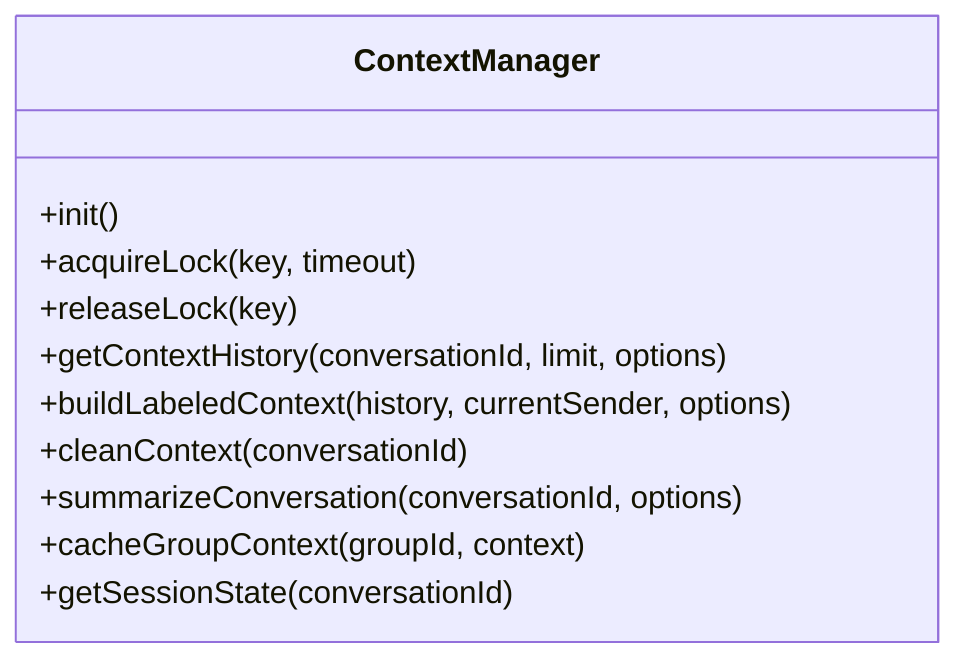
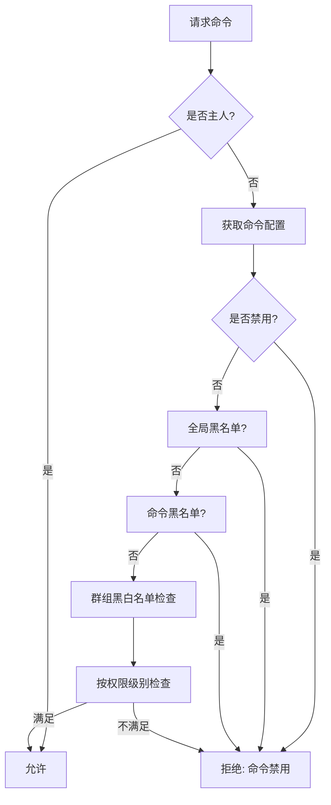
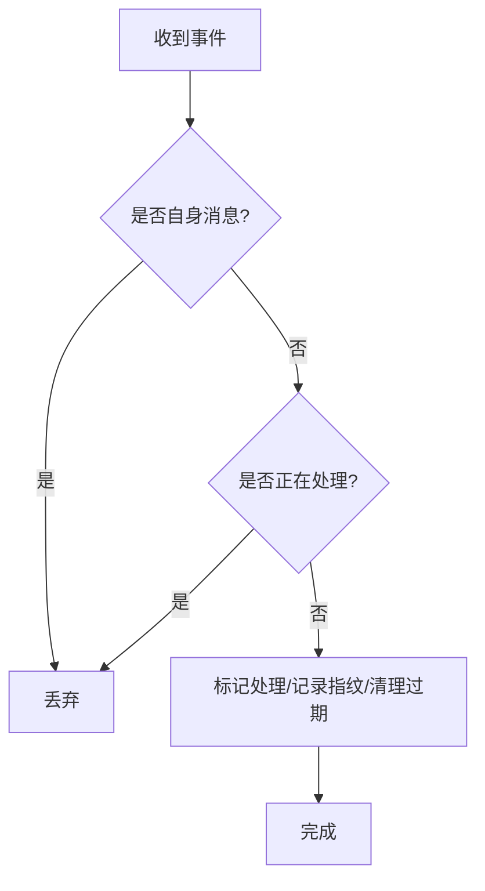
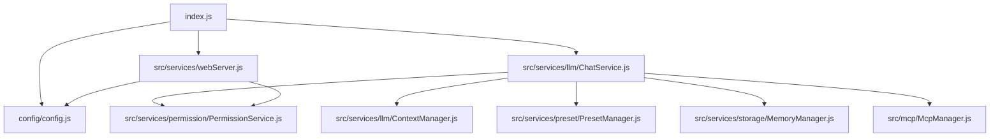

# 聊天服务系统

<cite>
**本文档引用的文件**
- [index.js](file://index.js)
- [README.md](file://README.md)
- [config.js](file://config/config.js)
- [ChatService.js](file://src/services/llm/ChatService.js)
- [ContextManager.js](file://src/services/llm/ContextManager.js)
- [ChatAgent.js](file://src/services/agent/ChatAgent.js)
- [PermissionService.js](file://src/services/permission/PermissionService.js)
- [messageDedup.js](file://src/utils/messageDedup.js)
- [webServer.js](file://src/services/webServer.js)
</cite>

## 目录
1. [简介](#简介)
2. [项目结构](#项目结构)
3. [核心组件](#核心组件)
4. [架构总览](#架构总览)
5. [详细组件分析](#详细组件分析)
6. [依赖关系分析](#依赖关系分析)
7. [性能考虑](#性能考虑)
8. [故障排除指南](#故障排除指南)
9. [结论](#结论)

## 简介
本项目是一个基于 Yunzai-Bot 的多功能聊天插件，集成了多模型适配、工具调用、上下文管理、记忆系统、Web 管理面板与权限控制等能力。系统通过统一的聊天服务协调各个组件，完成从消息接收、预处理、AI 模型调用到响应生成的完整对话处理流程。

## 项目结构
插件采用模块化分层设计：
- 入口与初始化：插件入口负责加载配置、启动 Web 服务、初始化技能代理与应用模块
- 配置中心：集中管理基础、LLM、渠道、上下文、记忆、触发等配置
- 服务层：LLM 服务、聊天服务、上下文管理、权限控制、存储、统计等
- 工具层：消息去重、消息解析、平台适配等
- Web 管理：基于 Express 的管理面板，提供可视化配置与监控

**图表来源**
- [index.js](file://index.js#L1-L258)
- [config.js](file://config/config.js#L1-L631)
- [webServer.js](file://src/services/webServer.js#L1-L807)
- [ChatService.js](file://src/services/llm/ChatService.js#L1-L800)
- [ContextManager.js](file://src/services/llm/ContextManager.js#L1-L800)
- [PermissionService.js](file://src/services/permission/PermissionService.js#L1-L484)
- [messageDedup.js](file://src/utils/messageDedup.js#L1-L368)

**章节来源**
- [index.js](file://index.js#L1-L258)
- [README.md](file://README.md#L356-L396)

## 核心组件
- 聊天服务（ChatService）：统一的消息处理入口，负责上下文构建、预设与系统提示词组装、工具调用、渠道选择与回退、统计记录与错误处理
- 上下文管理（ContextManager）：负责历史消息的存储、检索、清理与智能总结，支持群聊共享/用户隔离、并发锁与队列
- 权限服务（PermissionService）：提供命令权限检查、黑白名单、群组权限、主人列表等
- 消息去重（messageDedup）：防止重复处理与自身消息回显，支持指纹与消息ID双重去重
- Web 服务（webServer）：提供管理面板、认证与鉴权、静态资源托管、健康检查与路由注册
- 配置中心（config）：集中管理 YAML 配置，支持默认值合并、热更新与层级查询

**章节来源**
- [ChatService.js](file://src/services/llm/ChatService.js#L46-L110)
- [ContextManager.js](file://src/services/llm/ContextManager.js#L8-L30)
- [PermissionService.js](file://src/services/permission/PermissionService.js#L22-L50)
- [messageDedup.js](file://src/utils/messageDedup.js#L1-L36)
- [webServer.js](file://src/services/webServer.js#L279-L311)
- [config.js](file://config/config.js#L8-L38)

## 架构总览
系统通过入口模块初始化配置与 Web 服务，随后在聊天服务中协调 LLM 适配器、渠道管理、预设与记忆模块，结合上下文管理与权限控制，形成完整的对话处理闭环。

**图表来源**
- [webServer.js](file://src/services/webServer.js#L339-L537)
- [ChatService.js](file://src/services/llm/ChatService.js#L115-L800)
- [ContextManager.js](file://src/services/llm/ContextManager.js#L419-L463)
- [config.js](file://config/config.js#L563-L584)

## 详细组件分析

### 聊天服务（ChatService）
- 消息接收与预处理：解析文本与图片引用，构建用户消息对象，支持私聊/群聊上下文隔离
- 预设与系统提示词：按作用域优先级（群组/用户/默认）构建 systemPrompt，支持前缀人格叠加与全局提示词模式
- 工具调用：根据预设与作用域配置决定是否启用工具，加载 MCP 工具并传递事件上下文
- 渠道选择与回退：优先群独立渠道，其次全局渠道，支持备选模型轮询与模型映射
- 记忆与知识库：按配置注入用户记忆与群聊记忆，以及知识库上下文
- 统计与调试：记录请求耗时、Token 使用、工具调用日志，支持调试模式输出详细信息

**图表来源**
- [ChatService.js](file://src/services/llm/ChatService.js#L115-L800)

**章节来源**
- [ChatService.js](file://src/services/llm/ChatService.js#L68-L110)
- [ChatService.js](file://src/services/llm/ChatService.js#L115-L800)

### 上下文管理（ContextManager）
- 并发控制：基于 Map 的异步锁，防止并发写入导致的数据竞争
- 历史管理：支持自动上下文、工具调用过滤、历史截断与智能清理
- 群聊上下文：支持群共享与用户隔离两种模式，可为历史消息添加用户标签与时间戳
- 自动总结：对长时间未活跃的长对话进行摘要并重置为短上下文
- 缓存与状态：群聊上下文缓存、会话状态跟踪与活动上下文集合

**图表来源**
- [ContextManager.js](file://src/services/llm/ContextManager.js#L8-L800)

**章节来源**
- [ContextManager.js](file://src/services/llm/ContextManager.js#L38-L109)
- [ContextManager.js](file://src/services/llm/ContextManager.js#L419-L463)
- [ContextManager.js](file://src/services/llm/ContextManager.js#L664-L721)

### 权限服务（PermissionService）
- 命令权限：内置默认命令清单，支持按级别（所有人、管理员、主人）与黑白名单控制
- 主人列表：聚合插件配置与框架配置，支持多 Bot 场景
- 群组权限：支持群组独立黑白名单与模式（黑名单/白名单）
- 事件检查：从事件对象直接检查权限并返回拒绝消息

**图表来源**
- [PermissionService.js](file://src/services/permission/PermissionService.js#L337-L421)

**章节来源**
- [PermissionService.js](file://src/services/permission/PermissionService.js#L22-L50)
- [PermissionService.js](file://src/services/permission/PermissionService.js#L337-L421)

### 消息去重（messageDedup）
- 多层去重：WeakMap 标记、消息ID记录、消息hash缓存、发送指纹缓存
- 自身消息防护：识别机器人自身消息与回显，避免重复处理
- 并发保护：processingMessages 集合防止同一消息并发处理

**图表来源**
- [messageDedup.js](file://src/utils/messageDedup.js#L157-L212)

**章节来源**
- [messageDedup.js](file://src/utils/messageDedup.js#L1-L36)

### Web 服务（webServer）
- 认证与鉴权：JWT 签名验证、Token 生成/验证、指纹绑定、请求签名验证
- 路由与中间件：CORS、静态资源、健康检查、权限中间件
- 管理面板：提供登录、配置、工具、记忆、渠道等管理接口
- 端口与部署：支持独立端口与 TRSS 共享端口模式，自动端口探测与释放

**章节来源**
- [webServer.js](file://src/services/webServer.js#L279-L311)
- [webServer.js](file://src/services/webServer.js#L339-L537)
- [webServer.js](file://src/services/webServer.js#L582-L756)

## 依赖关系分析
- 插件入口依赖配置中心与 Web 服务，初始化技能代理与应用模块
- 聊天服务依赖上下文管理、渠道管理、预设管理、记忆管理、MCP 管理与统计服务
- 权限服务依赖配置中心与框架配置，提供命令级权限控制
- Web 服务依赖配置中心与认证模块，提供管理接口与静态资源

**图表来源**
- [index.js](file://index.js#L1-L258)
- [ChatService.js](file://src/services/llm/ChatService.js#L1-L18)
- [webServer.js](file://src/services/webServer.js#L1-L13)

**章节来源**
- [index.js](file://index.js#L1-L258)
- [ChatService.js](file://src/services/llm/ChatService.js#L1-L18)
- [webServer.js](file://src/services/webServer.js#L1-L13)

## 性能考虑
- 上下文长度控制：通过 maxMessages 与 autoContext 配置限制历史消息数量，避免 Token 超限
- 智能清理策略：在清理策略为 smart 时保留重要消息，平衡上下文质量与长度
- 并发锁与队列：使用异步锁与消息队列避免并发写入与消息丢失
- 渠道与模型回退：启用备选模型轮询，提升可用性与稳定性
- 缓存与摘要：群聊上下文缓存与自动总结，减少重复计算与存储压力
- 流式响应：在支持的渠道启用流式传输，改善用户体验

[本节为通用指导，无需具体文件引用]

## 故障排除指南
- API 401/403：检查渠道配置与 API Key，确认权限与套餐状态
- API 429：配置多个渠道实现负载均衡，降低请求频率或升级套餐
- 消息重复：检查消息去重与自身消息防护配置，确认协议端正确配置
- Web 面板无法访问：检查端口占用与防火墙，确认监听地址与端口
- 内存占用过高：减少上下文长度、禁用不需要的功能、定期清理对话

**章节来源**
- [README.md](file://README.md#L665-L746)

## 结论
本聊天服务系统通过模块化设计与清晰的职责划分，实现了从消息接收、上下文管理、预设与记忆注入、工具调用到响应生成的完整链路。配合权限控制、消息去重与 Web 管理面板，系统具备良好的可扩展性与运维友好性。建议在生产环境中合理配置上下文长度、启用智能清理与自动总结，并结合权限与安全策略保障稳定运行。