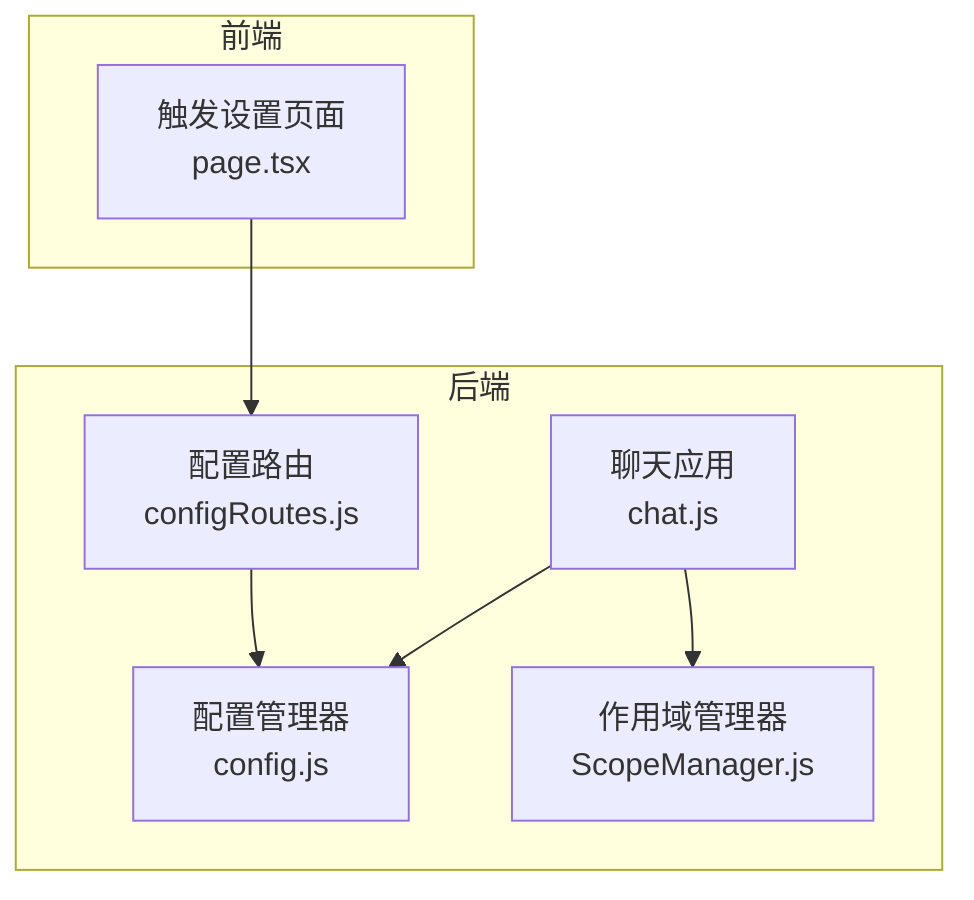
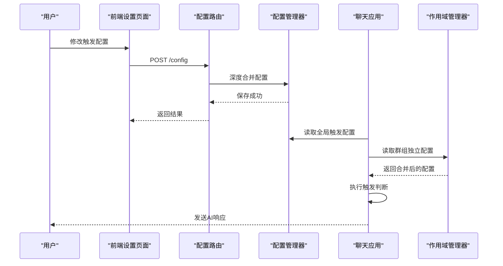
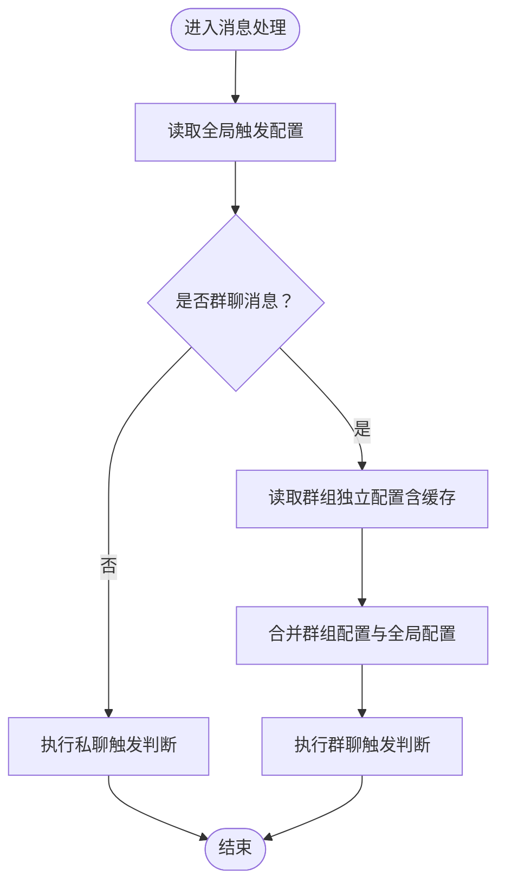
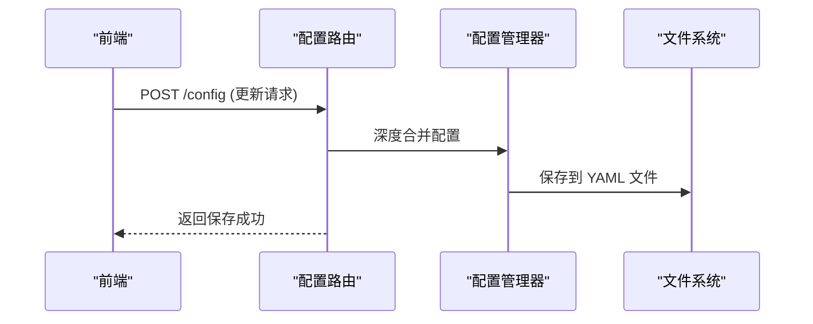
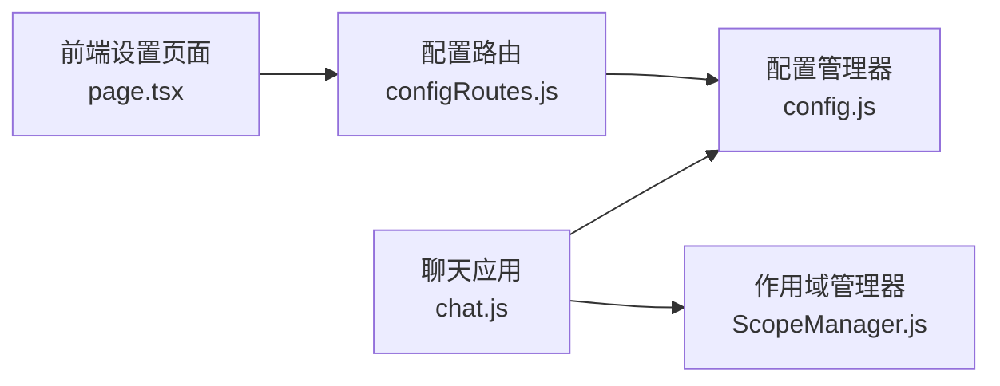

# 触发模式配置


## 目录
1. [简介](#简介)
2. [项目结构](#项目结构)
3. [核心组件](#核心组件)
4. [架构概览](#架构概览)
5. [详细组件分析](#详细组件分析)
6. [依赖分析](#依赖分析)
7. [性能考虑](#性能考虑)
8. [故障排除指南](#故障排除指南)
9. [结论](#结论)

## 简介
本文件详细阐述 ChatAI 插件中的触发模式配置体系，涵盖以下触发方式的工作原理与配置方法：
- @触发（机器人被 @ 时响应）
- 前缀触发（消息以指定前缀开头时响应）
- 关键词触发（消息包含预设关键词时响应）
- 随机触发（基于概率的随机响应）

同时，文档将解释：
- 触发模式的适用场景与配置参数
- 全局配置与群组独立配置的区别、继承与覆盖规则
- 触发模式的缓存机制、性能优化策略与配置热更新
- 最佳实践、安全考虑与故障排除指南

## 项目结构
触发模式配置涉及前后端多个模块协同工作：
- 前端设置页面：提供触发模式的可视化配置界面
- 配置路由：提供配置的获取与更新接口
- 配置管理器：负责配置的持久化与合并
- 触发逻辑实现：在消息处理流程中执行触发判断
- 群组作用域管理：支持群组独立配置与继承



**图表来源**
- [page.tsx](file://frontend/app/(dashboard)/settings/trigger/page.tsx#L1-L386)
- [configRoutes.js](file://src/services/routes/configRoutes.js#L1-L257)
- [config.js](file://config/config.js#L1-L631)
- [chat.js](file://apps/chat.js#L1-L962)
- [ScopeManager.js](file://src/services/scope/ScopeManager.js#L1-L800)

**章节来源**
- [index.js](file://index.js#L1-L258)
- [config.js](file://config/config.js#L1-L631)
- [chat.js](file://apps/chat.js#L1-L962)
- [ScopeManager.js](file://src/services/scope/ScopeManager.js#L1-L800)
- [configRoutes.js](file://src/services/routes/configRoutes.js#L1-L257)
- [page.tsx](file://frontend/app/(dashboard)/settings/trigger/page.tsx#L1-L386)

## 核心组件
- 触发配置数据结构
  - 私聊触发配置（private）：启用状态与触发模式（始终响应、前缀触发、@触发）
  - 群聊触发配置（group）：启用状态、@触发、前缀触发、关键词触发、随机触发及概率
  - 触发前缀列表（prefixes）与关键词列表（keywords）
  - 黑名单与白名单（用户/群组）
  - 群组消息采集开关（collectGroupMsg）

- 触发判断流程
  - 私聊：优先检查前缀，其次依据模式判断是否触发
  - 群聊：@触发优先于前缀触发，随后检查关键词触发与随机触发
  - 群组独立配置：支持覆盖全局配置，具备缓存与继承能力

**章节来源**
- [config.js](file://config/config.js#L563-L584)
- [chat.js](file://apps/chat.js#L298-L381)
- [chat.js](file://apps/chat.js#L66-L87)

## 架构概览
触发模式配置的运行时架构如下：



**图表来源**
- [configRoutes.js](file://src/services/routes/configRoutes.js#L54-L90)
- [config.js](file://config/config.js#L591-L626)
- [chat.js](file://apps/chat.js#L129-L203)
- [ScopeManager.js](file://src/services/scope/ScopeManager.js#L205-L228)

## 详细组件分析

### 触发模式类型与适用场景
- @触发（群聊）
  - 适用场景：需要明确指示机器人响应的场合，避免误触发
  - 配置参数：group.at（启用/禁用）、replyBot（引用机器人消息时是否响应）
  - 优先级：高于前缀触发
- 前缀触发（私聊/群聊）
  - 适用场景：用户习惯使用固定前缀发起对话
  - 配置参数：prefixes（前缀列表）、private.mode（私聊模式）
  - 优先级：在私聊中优先于“始终响应”，在群聊中次于@触发
- 关键词触发（群聊）
  - 适用场景：在特定关键词出现时自动响应
  - 配置参数：group.keyword（启用）、keywords（关键词列表）
  - 优先级：次于@触发与前缀触发
- 随机触发（群聊）
  - 适用场景：营造更自然的互动氛围
  - 配置参数：group.random（启用）、group.randomRate（触发概率）
  - 优先级：最低

**章节来源**
- [config.js](file://config/config.js#L563-L584)
- [chat.js](file://apps/chat.js#L298-L381)

### 全局配置与群组独立配置
- 全局配置
  - 存储于配置文件（YAML），通过配置管理器读取与保存
  - 触发模式的默认行为由全局配置决定
- 群组独立配置
  - 通过作用域管理器为特定群组设置独立触发规则
  - 支持继承与覆盖：当群组配置中设置为“使用全局”时，回退到全局配置
  - 群组配置缓存：为减少数据库查询开销，采用内存缓存（TTL 60 秒）



**图表来源**
- [chat.js](file://apps/chat.js#L129-L203)
- [chat.js](file://apps/chat.js#L66-L87)
- [ScopeManager.js](file://src/services/scope/ScopeManager.js#L205-L228)

**章节来源**
- [chat.js](file://apps/chat.js#L66-L87)
- [ScopeManager.js](file://src/services/scope/ScopeManager.js#L205-L228)

### 触发判断算法
触发判断遵循以下优先级顺序：
- 私聊：前缀匹配 → 模式判断（始终响应/前缀触发/@触发）
- 群聊：@触发（含引用机器人消息） → 前缀触发 → 关键词触发 → 随机触发

```mermaid
flowchart TD
S(["开始"]) --> IsGroup{"是否群聊？"}
IsGroup --> |否| PrivateCheck["私聊触发判断"]
IsGroup --> |是| GroupCheck["群聊触发判断"]
PrivateCheck --> PrefixPrivate["检查私聊前缀"]
PrefixPrivate --> ModePrivate{"私聊模式"}
ModePrivate --> |始终响应| TriggerTrue["触发"]
ModePrivate --> |前缀触发| PrefixPrivate2["匹配前缀"] --> TriggerTrue
ModePrivate --> |@触发| AtPrivate["匹配@"] --> TriggerTrue
ModePrivate --> |无匹配| TriggerFalse["不触发"]
GroupCheck --> AtGroup["@机器人触发"]
AtGroup --> ReplyBot{"是否引用机器人消息？"}
ReplyBot --> |是且允许| TriggerTrue
ReplyBot --> |否| PrefixGroup["前缀触发"]
PrefixGroup --> KeywordGroup["关键词触发"]
KeywordGroup --> RandomGroup["随机触发"]
RandomGroup --> Decision{"随机数 < 概率？"}
Decision --> |是| TriggerTrue
Decision --> |否| TriggerFalse
TriggerTrue --> E(["结束"])
TriggerFalse --> E
```

**图表来源**
- [chat.js](file://apps/chat.js#L298-L381)

**章节来源**
- [chat.js](file://apps/chat.js#L298-L381)

### 配置热更新与持久化
- 前端通过配置路由提交更新，后端对配置进行深度合并并一次性保存
- 配置热更新：配置变更后立即生效，无需重启服务
- 配置文件：使用 YAML 格式存储，支持复杂嵌套结构



**图表来源**
- [configRoutes.js](file://src/services/routes/configRoutes.js#L54-L90)
- [config.js](file://config/config.js#L591-L626)

**章节来源**
- [configRoutes.js](file://src/services/routes/configRoutes.js#L54-L90)
- [config.js](file://config/config.js#L591-L626)

### 前端触发设置界面
- 触发前缀管理：支持添加/删除前缀，自动保存
- 私聊设置：启用/禁用私聊响应与触发模式选择
- 群聊设置：启用/禁用群聊响应、@触发、前缀触发开关
- 自动保存：防抖自动保存，提升用户体验

**章节来源**
- [page.tsx](file://frontend/app/(dashboard)/settings/trigger/page.tsx#L1-L386)

## 依赖分析
- 组件耦合关系
  - 聊天应用依赖配置管理器与作用域管理器
  - 配置路由依赖配置管理器进行读写
  - 前端设置页面依赖配置路由进行配置同步
- 外部依赖
  - YAML 解析与序列化
  - 数据库存储群组独立配置
  - Web 服务器提供配置接口



**图表来源**
- [chat.js](file://apps/chat.js#L1-L962)
- [config.js](file://config/config.js#L1-L631)
- [ScopeManager.js](file://src/services/scope/ScopeManager.js#L1-L800)
- [configRoutes.js](file://src/services/routes/configRoutes.js#L1-L257)
- [page.tsx](file://frontend/app/(dashboard)/settings/trigger/page.tsx#L1-L386)

**章节来源**
- [chat.js](file://apps/chat.js#L1-L962)
- [config.js](file://config/config.js#L1-L631)
- [ScopeManager.js](file://src/services/scope/ScopeManager.js#L1-L800)
- [configRoutes.js](file://src/services/routes/configRoutes.js#L1-L257)
- [page.tsx](file://frontend/app/(dashboard)/settings/trigger/page.tsx#L1-L386)

## 性能考虑
- 群组触发配置缓存
  - 缓存键：群组 ID
  - TTL：60 秒，减少数据库查询压力
  - 适用场景：高并发群聊环境下的触发判断
- 配置热更新
  - 深度合并与一次性保存，避免频繁磁盘 IO
- 触发判断优化
  - 优先级判断减少不必要的字符串匹配
  - 前缀匹配与关键词匹配采用短路逻辑

**章节来源**
- [chat.js](file://apps/chat.js#L66-L87)
- [configRoutes.js](file://src/services/routes/configRoutes.js#L54-L90)

## 故障排除指南
- 常见问题
  - 配置未生效：确认是否通过配置路由提交更新，检查 YAML 文件是否正确保存
  - 群组触发异常：检查群组独立配置是否覆盖了全局配置，确认缓存是否过期
  - 随机触发概率异常：核对 group.randomRate 配置范围（0-0.5）
- 排查步骤
  - 查看配置文件内容与保存状态
  - 检查聊天应用的日志输出，定位触发判断分支
  - 验证群组独立配置的继承与覆盖逻辑

**章节来源**
- [configRoutes.js](file://src/services/routes/configRoutes.js#L54-L90)
- [chat.js](file://apps/chat.js#L129-L203)

## 结论
本触发模式配置体系通过清晰的优先级设计、灵活的全局与群组独立配置、以及高效的缓存与热更新机制，实现了稳定可靠的触发判断。建议在生产环境中结合业务场景合理设置触发模式，并利用群组独立配置实现精细化运营。
