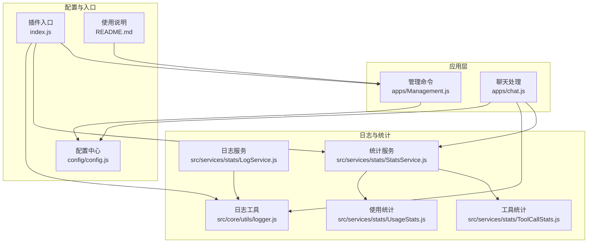
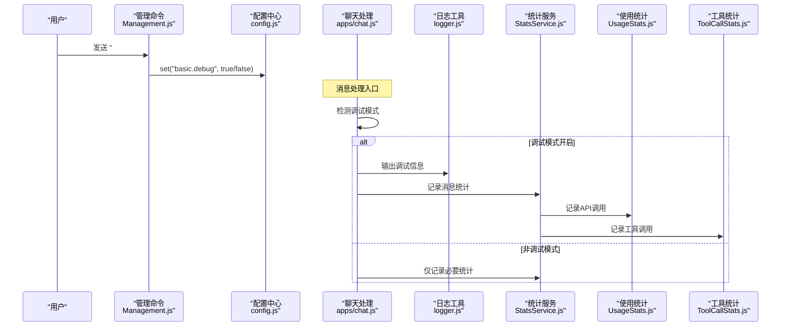
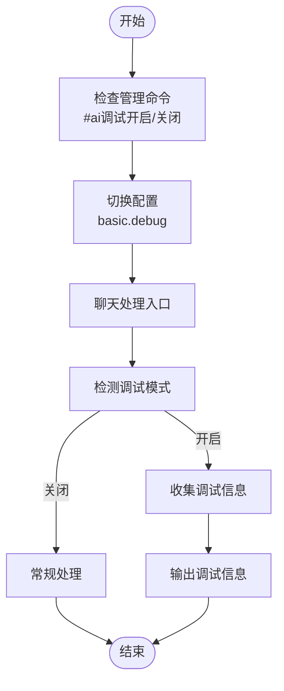
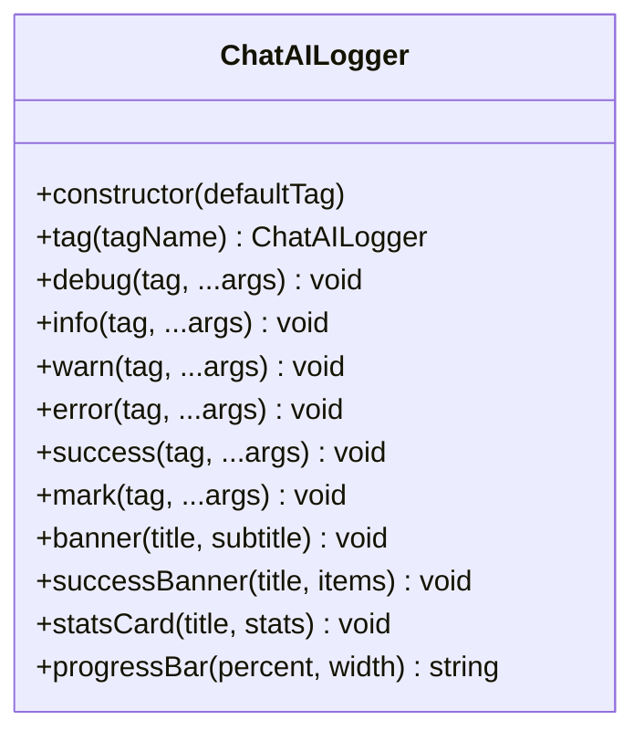
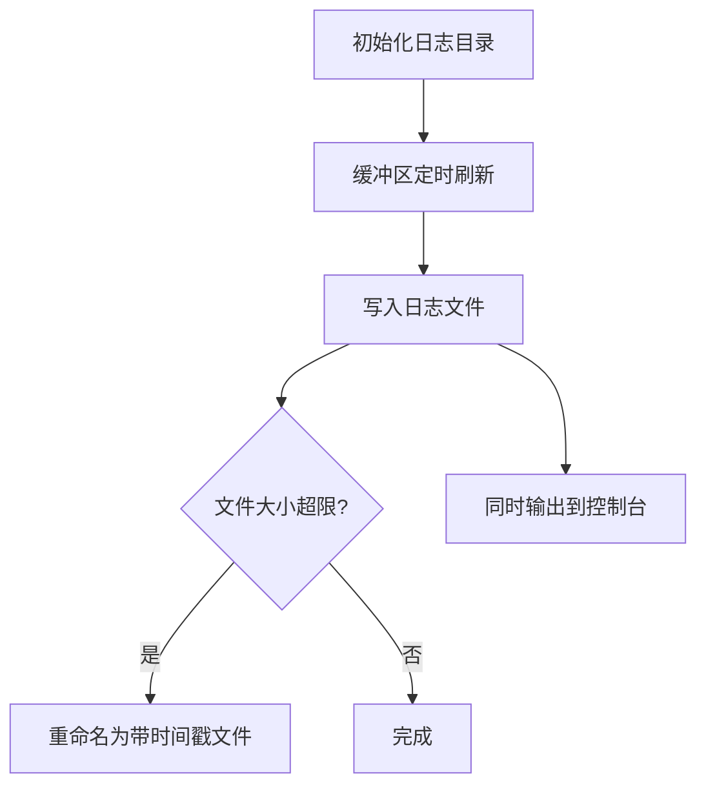
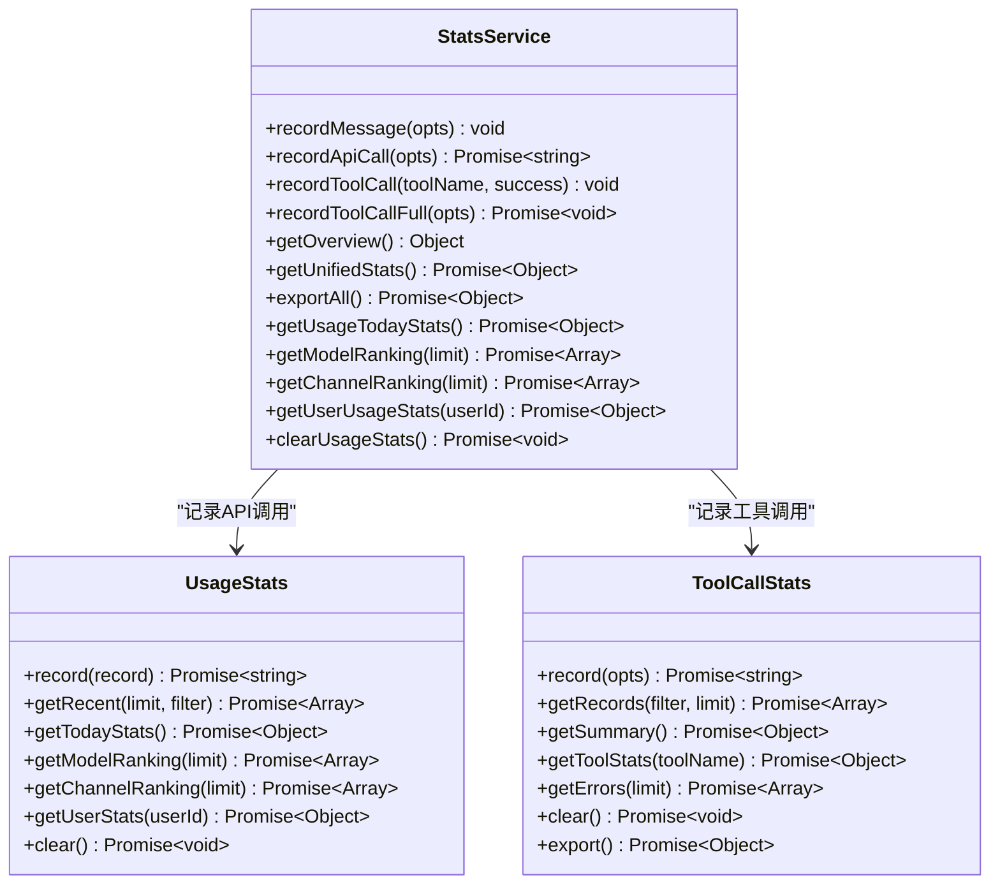
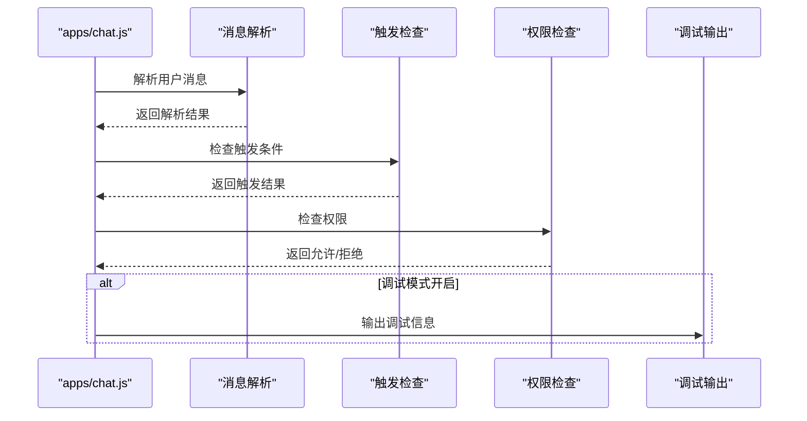
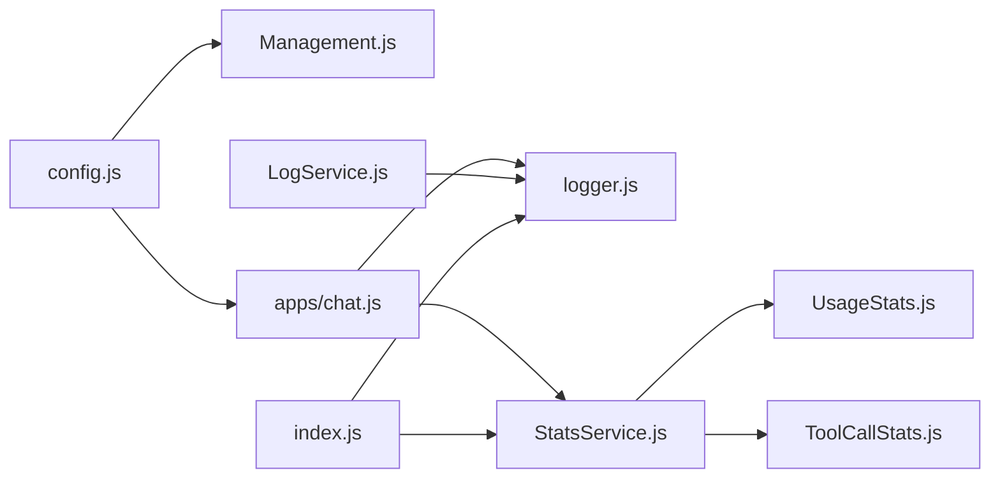

# 调试模式与日志

<cite>
**本文档引用的文件**
- [index.js](file://index.js)
- [README.md](file://README.md)
- [logger.js](file://src/core/utils/logger.js)
- [LogService.js](file://src/services/stats/LogService.js)
- [StatsService.js](file://src/services/stats/StatsService.js)
- [UsageStats.js](file://src/services/stats/UsageStats.js)
- [ToolCallStats.js](file://src/services/stats/ToolCallStats.js)
- [Management.js](file://apps/Management.js)
- [chat.js](file://apps/chat.js)
- [config.js](file://config/config.js)
</cite>

## 目录
1. [简介](#简介)
2. [项目结构](#项目结构)
3. [核心组件](#核心组件)
4. [架构总览](#架构总览)
5. [详细组件分析](#详细组件分析)
6. [依赖关系分析](#依赖关系分析)
7. [性能考虑](#性能考虑)
8. [故障排除指南](#故障排除指南)
9. [结论](#结论)

## 简介
本文件系统性阐述该 ChatGPT 插件的调试模式与日志体系，涵盖调试模式的启用方式、调试信息的收集与展示机制、日志分类与级别控制、输出格式规范、统计信息记录与分析、日志过滤聚合与导出能力，以及调试模式对系统性能的影响与优化策略。目标读者既包括一线运维与开发者，也包括需要进行问题排查与性能分析的使用者。

## 项目结构
围绕调试与日志的关键目录与文件如下：
- 核心日志工具：src/core/utils/logger.js
- 日志服务：src/services/stats/LogService.js
- 统计服务：src/services/stats/StatsService.js、src/services/stats/UsageStats.js、src/services/stats/ToolCallStats.js
- 调试命令与入口：apps/Management.js、apps/chat.js
- 配置中心：config/config.js
- 插件入口与启动流程：index.js
- 使用说明与命令参考：README.md

**图表来源**
- [index.js](file://index.js#L1-L258)
- [logger.js](file://src/core/utils/logger.js#L1-L331)
- [LogService.js](file://src/services/stats/LogService.js#L1-L553)
- [StatsService.js](file://src/services/stats/StatsService.js#L1-L682)
- [UsageStats.js](file://src/services/stats/UsageStats.js#L1-L592)
- [ToolCallStats.js](file://src/services/stats/ToolCallStats.js#L1-L379)
- [Management.js](file://apps/Management.js#L1-L1217)
- [chat.js](file://apps/chat.js#L1-L962)
- [config.js](file://config/config.js#L1-L631)

**章节来源**
- [index.js](file://index.js#L1-L258)
- [README.md](file://README.md#L1-L983)

## 核心组件
- 调试模式开关：通过管理命令切换全局调试模式，并在聊天处理逻辑中即时生效。
- 日志工具：提供多级别日志输出、带标签的结构化输出、横幅与统计卡片打印等能力。
- 日志服务：负责将错误、警告、API、工具、渠道、调度、对话等日志落盘与轮转，支持缓冲刷新与敏感信息脱敏。
- 统计服务：统一聚合消息、模型、Token、工具调用等统计数据，提供概览、今日统计、排行榜、导出等功能。
- 使用统计：基于 Redis 的高吞吐使用记录，支持估算 Token、请求/响应截断、聚合统计与查询。
- 工具统计：记录工具调用详情与错误，支持过滤、汇总、导出与内存/Redis双态持久化。

**章节来源**
- [Management.js](file://apps/Management.js#L788-L796)
- [chat.js](file://apps/chat.js#L464-L641)
- [logger.js](file://src/core/utils/logger.js#L62-L69)
- [LogService.js](file://src/services/stats/LogService.js#L12-L22)
- [StatsService.js](file://src/services/stats/StatsService.js#L19-L37)
- [UsageStats.js](file://src/services/stats/UsageStats.js#L44-L50)
- [ToolCallStats.js](file://src/services/stats/ToolCallStats.js#L32-L47)

## 架构总览
调试模式与日志系统在运行时的交互流程如下：

**图表来源**
- [Management.js](file://apps/Management.js#L788-L796)
- [config.js](file://config/config.js#L600-L626)
- [chat.js](file://apps/chat.js#L464-L641)
- [logger.js](file://src/core/utils/logger.js#L114-L172)
- [StatsService.js](file://src/services/stats/StatsService.js#L230-L360)
- [UsageStats.js](file://src/services/stats/UsageStats.js#L199-L263)
- [ToolCallStats.js](file://src/services/stats/ToolCallStats.js#L86-L143)

## 详细组件分析

### 调试模式与命令
- 全局调试模式：通过管理命令切换，影响聊天处理流程中的调试信息输出与统计细节。
- 聊天调试模式：支持在消息末尾附加调试关键字以临时开启本次调试输出。
- 调试信息收集：在消息解析、工具调用、API 请求等关键节点收集调试信息，按需输出至控制台或专用调试通道。

**图表来源**
- [Management.js](file://apps/Management.js#L788-L796)
- [chat.js](file://apps/chat.js#L464-L484)

**章节来源**
- [Management.js](file://apps/Management.js#L788-L796)
- [chat.js](file://apps/chat.js#L464-L484)
- [config.js](file://config/config.js#L64-L75)

### 日志工具与输出格式
- 日志级别：debug、info、warn、error、success、mark。
- 输出格式：包含时间戳、级别标识、插件名、标签、彩色控制码与结构化消息。
- 辅助输出：横幅、列表项、统计卡片、进度条、图标映射等，便于仪表盘与控制台阅读。

**图表来源**
- [logger.js](file://src/core/utils/logger.js#L114-L325)

**章节来源**
- [logger.js](file://src/core/utils/logger.js#L62-L69)
- [logger.js](file://src/core/utils/logger.js#L89-L109)
- [logger.js](file://src/core/utils/logger.js#L184-L221)
- [logger.js](file://src/core/utils/logger.js#L258-L283)

### 日志服务与分类
- 日志类型：error、warn、api、tool、channel、dispatch、conversation、debug。
- 落盘策略：按日期命名、大小轮转、缓冲定时刷新、异常时输出到控制台。
- 敏感信息处理：头部与参数脱敏、URL 截断、工具参数与响应截断。
- 查询与统计：按类型统计、获取最近错误、列出日志文件、生成摘要。

**图表来源**
- [LogService.js](file://src/services/stats/LogService.js#L27-L40)
- [LogService.js](file://src/services/stats/LogService.js#L45-L54)
- [LogService.js](file://src/services/stats/LogService.js#L91-L119)
- [LogService.js](file://src/services/stats/LogService.js#L264-L284)

**章节来源**
- [LogService.js](file://src/services/stats/LogService.js#L12-L22)
- [LogService.js](file://src/services/stats/LogService.js#L127-L158)
- [LogService.js](file://src/services/stats/LogService.js#L219-L236)
- [LogService.js](file://src/services/stats/LogService.js#L378-L391)
- [LogService.js](file://src/services/stats/LogService.js#L398-L412)
- [LogService.js](file://src/services/stats/LogService.js#L439-L453)
- [LogService.js](file://src/services/stats/LogService.js#L476-L527)

### 统计服务与分析
- 统计维度：消息总数、按类型/群/用户/小时分布；模型调用总量、按模型/渠道分布；Token 总量与按模型/用户分布；工具调用总量与排行榜。
- 实时 RPM：基于滑动时间窗的请求速率统计。
- 汇总接口：提供概览、今日统计、工具调用汇总、API 使用排行、导出等。
- 清理与重置：支持重置统计、清空工具与使用统计。

**图表来源**
- [StatsService.js](file://src/services/stats/StatsService.js#L19-L682)
- [UsageStats.js](file://src/services/stats/UsageStats.js#L44-L592)
- [ToolCallStats.js](file://src/services/stats/ToolCallStats.js#L32-L379)

**章节来源**
- [StatsService.js](file://src/services/stats/StatsService.js#L19-L37)
- [StatsService.js](file://src/services/stats/StatsService.js#L110-L136)
- [StatsService.js](file://src/services/stats/StatsService.js#L230-L360)
- [StatsService.js](file://src/services/stats/StatsService.js#L423-L489)
- [StatsService.js](file://src/services/stats/StatsService.js#L572-L593)
- [UsageStats.js](file://src/services/stats/UsageStats.js#L199-L263)
- [UsageStats.js](file://src/services/stats/UsageStats.js#L302-L341)
- [UsageStats.js](file://src/services/stats/UsageStats.js#L346-L375)
- [ToolCallStats.js](file://src/services/stats/ToolCallStats.js#L86-L143)
- [ToolCallStats.js](file://src/services/stats/ToolCallStats.js#L239-L274)

### 调试信息的收集与展示
- 消息解析日志：包含引用消息、@处理、发送者信息等，支持在调试模式下输出。
- 触发条件日志：群/私聊触发模式、前缀、关键词、随机触发等判定过程。
- 权限检查日志：黑白名单、群组独立配置、工具调用权限等。
- 调试信息展示：在聊天处理完成后，按调试模式输出调试信息与日志列表。

**图表来源**
- [chat.js](file://apps/chat.js#L488-L517)
- [chat.js](file://apps/chat.js#L298-L381)
- [chat.js](file://apps/chat.js#L245-L293)

**章节来源**
- [chat.js](file://apps/chat.js#L488-L517)
- [chat.js](file://apps/chat.js#L298-L381)
- [chat.js](file://apps/chat.js#L245-L293)

### 日志过滤、聚合与导出
- 日志过滤：按类型、时间范围、成功/失败、渠道/模型/来源等条件筛选。
- 日志聚合：按日/小时/渠道/模型维度统计调用次数、成功/失败率、Token 消耗、平均耗时。
- 日志导出：支持导出通用统计与工具调用详情，便于离线分析与审计。

**章节来源**
- [LogService.js](file://src/services/stats/LogService.js#L318-L341)
- [LogService.js](file://src/services/stats/LogService.js#L287-L315)
- [StatsService.js](file://src/services/stats/StatsService.js#L598-L607)
- [ToolCallStats.js](file://src/services/stats/ToolCallStats.js#L367-L374)

## 依赖关系分析
- 调试模式依赖配置中心的开关状态，贯穿聊天处理、统计记录与日志输出。
- 日志服务依赖文件系统与 Redis（在统计模块中），提供持久化与查询能力。
- 统计服务聚合使用统计与工具统计，形成统一的数据视图。
- 插件入口负责初始化日志工具、统计服务与 Web 服务，确保调试与日志能力在启动阶段可用。

**图表来源**
- [config.js](file://config/config.js#L600-L626)
- [Management.js](file://apps/Management.js#L788-L796)
- [chat.js](file://apps/chat.js#L464-L641)
- [logger.js](file://src/core/utils/logger.js#L114-L325)
- [StatsService.js](file://src/services/stats/StatsService.js#L19-L682)
- [UsageStats.js](file://src/services/stats/UsageStats.js#L44-L592)
- [ToolCallStats.js](file://src/services/stats/ToolCallStats.js#L32-L379)
- [LogService.js](file://src/services/stats/LogService.js#L12-L553)
- [index.js](file://index.js#L1-L258)

**章节来源**
- [index.js](file://index.js#L1-L258)
- [config.js](file://config/config.js#L1-L631)

## 性能考虑
- 调试模式对性能的影响：调试模式会增加日志输出与统计记录的开销，建议在生产环境谨慎开启。
- 日志缓冲与轮转：日志服务采用缓冲定时刷新与文件大小轮转，避免频繁 IO；建议合理设置缓冲大小与刷新周期。
- 统计记录的异步化：统计服务在记录 API 调用时异步上报遥测与 Redis，减少主线程阻塞。
- Token 估算与截断：使用统计模块对请求/响应进行截断与估算，避免大文本带来的内存与序列化压力。
- Redis 缓存与过期：使用统计与工具统计为 Redis 键设置合理过期时间，避免无限增长。

**章节来源**
- [LogService.js](file://src/services/stats/LogService.js#L18-L22)
- [LogService.js](file://src/services/stats/LogService.js#L45-L54)
- [StatsService.js](file://src/services/stats/StatsService.js#L314-L325)
- [UsageStats.js](file://src/services/stats/UsageStats.js#L248-L263)
- [UsageStats.js](file://src/services/stats/UsageStats.js#L268-L295)

## 故障排除指南
- 调试模式无法生效：检查管理命令是否正确执行，确认配置中心的开关状态。
- 日志未落盘：检查日志目录是否存在、权限是否足够、文件大小是否达到轮转阈值。
- 统计缺失：确认统计服务初始化成功，Redis 是否可用，相关键是否存在。
- 性能下降：评估调试模式开启比例、日志缓冲与刷新周期、统计记录频率，必要时关闭调试模式或调整缓冲参数。
- 常见问题排查：参考使用说明中的常见问题章节，定位 API 错误、速率限制、内存占用等问题。

**章节来源**
- [Management.js](file://apps/Management.js#L788-L796)
- [LogService.js](file://src/services/stats/LogService.js#L27-L40)
- [StatsService.js](file://src/services/stats/StatsService.js#L77-L88)
- [README.md](file://README.md#L553-L793)

## 结论
该调试模式与日志系统通过配置驱动的调试开关、结构化的日志输出、多维度的统计聚合与持久化，为插件的运行监控、问题排查与性能分析提供了完整支撑。建议在生产环境中谨慎开启调试模式，结合日志轮转与统计清理策略，确保系统稳定与可观测性。