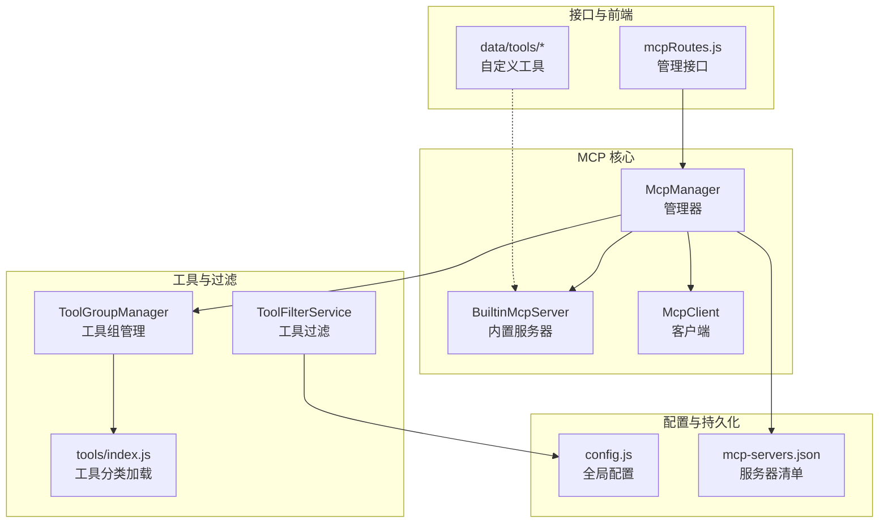
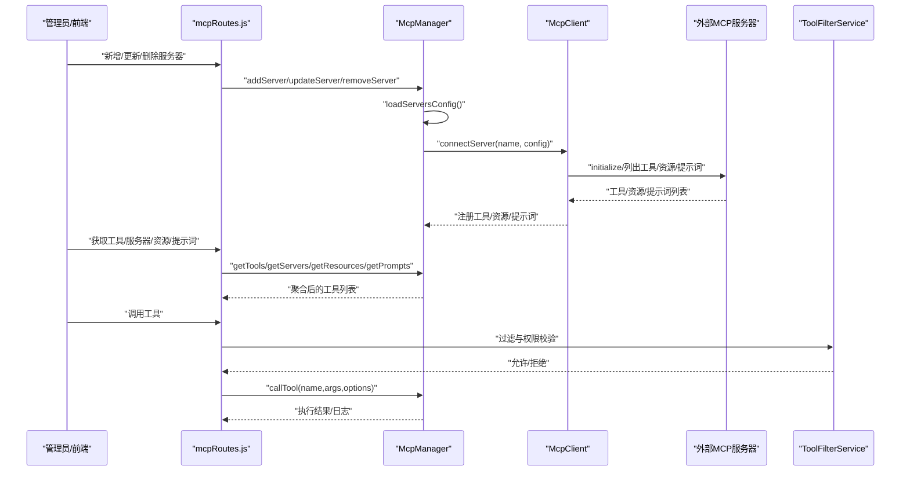
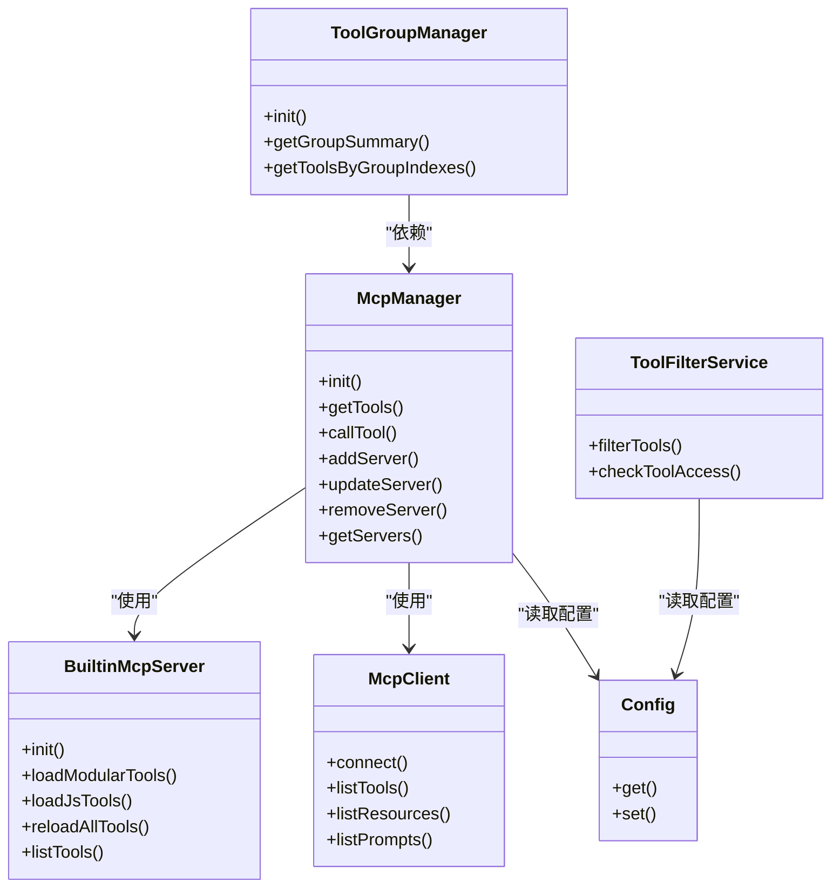

# MCP 配置

<cite>
**本文引用的文件**
- [McpManager.js](file://src/mcp/McpManager.js)
- [BuiltinMcpServer.js](file://src/mcp/BuiltinMcpServer.js)
- [McpClient.js](file://src/mcp/McpClient.js)
- [ToolGroupManager.js](file://src/services/tools/ToolGroupManager.js)
- [ToolFilterService.js](file://src/services/tools/ToolFilterService.js)
- [tools/index.js](file://src/mcp/tools/index.js)
- [config.js](file://config/config.js)
- [mcp-servers.json](file://data/mcp-servers.json)
- [README.md（工具目录）](file://data/tools/README.md)
- [example_tool.js](file://data/tools/example_tool.js)
- [TOOLS.md](file://docs/TOOLS.md)
- [mcpRoutes.js](file://src/services/routes/mcpRoutes.js)
- [helpers.js](file://src/mcp/tools/helpers.js)
</cite>

## 目录
1. [简介](#简介)
2. [项目结构](#项目结构)
3. [核心组件](#核心组件)
4. [架构总览](#架构总览)
5. [详细组件分析](#详细组件分析)
6. [依赖关系分析](#依赖关系分析)
7. [性能考量](#性能考量)
8. [故障排查指南](#故障排查指南)
9. [结论](#结论)
10. [附录](#附录)

## 简介
本文件面向 MCP（Model Context Protocol）工具系统的配置与运维，系统性阐述以下主题：
- MCP 服务的启用状态、连接配置与工具发现机制
- 工具组配置的结构与管理方式（索引、名称、描述、工具列表）
- 内置工具的权限控制（允许/禁用/危险工具处理）
- 工具调用的日志记录与执行策略
- MCP 服务的部署与维护流程

## 项目结构
围绕 MCP 的核心代码位于 src/mcp 目录，配合工具管理、过滤与路由模块协同工作；配置集中于 config/config.js，MCP 服务器清单持久化至 data/mcp-servers.json。

图表来源
- [McpManager.js](file://src/mcp/McpManager.js#L27-L139)
- [BuiltinMcpServer.js](file://src/mcp/BuiltinMcpServer.js#L218-L253)
- [McpClient.js](file://src/mcp/McpClient.js#L37-L113)
- [ToolGroupManager.js](file://src/services/tools/ToolGroupManager.js#L22-L43)
- [tools/index.js](file://src/mcp/tools/index.js#L68-L113)
- [config.js](file://config/config.js#L268-L270)
- [mcp-servers.json](file://data/mcp-servers.json#L1-L8)
- [mcpRoutes.js](file://src/services/routes/mcpRoutes.js#L8-L19)

章节来源
- [McpManager.js](file://src/mcp/McpManager.js#L106-L139)
- [BuiltinMcpServer.js](file://src/mcp/BuiltinMcpServer.js#L234-L253)
- [McpClient.js](file://src/mcp/McpClient.js#L86-L113)
- [ToolGroupManager.js](file://src/services/tools/ToolGroupManager.js#L33-L43)
- [config.js](file://config/config.js#L268-L270)
- [mcp-servers.json](file://data/mcp-servers.json#L1-L8)
- [mcpRoutes.js](file://src/services/routes/mcpRoutes.js#L10-L19)

## 核心组件
- McpManager：统一管理内置工具、自定义 JS 工具与外部 MCP 服务器，负责工具发现、连接、缓存与日志。
- BuiltinMcpServer：内置 MCP 服务器，负责加载工具分类、JS 工具、热重载与上下文注入。
- McpClient：支持 stdio、npm/npx、SSE、HTTP 等传输类型的 MCP 客户端，负责连接、心跳与请求转发。
- ToolGroupManager：将内置工具类别与外部 MCP 工具整合为“工具组”，提供索引、名称、描述与工具列表。
- ToolFilterService：基于预设与全局配置进行工具过滤（白名单/黑名单、危险工具、MCP 服务器黑白名单、权限校验）。
- tools/index.js：按类别组织内置工具，支持热重载与统计。
- config.js：全局配置入口，包含 mcp、builtinTools、tools 等关键配置项。
- mcp-servers.json：外部 MCP 服务器持久化配置文件。
- mcpRoutes.js：提供服务器增删改查、导入、资源与提示词读取等管理接口。
- data/tools：自定义 JS 工具目录，支持热加载与开发指南。

章节来源
- [McpManager.js](file://src/mcp/McpManager.js#L27-L600)
- [BuiltinMcpServer.js](file://src/mcp/BuiltinMcpServer.js#L218-L676)
- [McpClient.js](file://src/mcp/McpClient.js#L37-L800)
- [ToolGroupManager.js](file://src/services/tools/ToolGroupManager.js#L22-L579)
- [ToolFilterService.js](file://src/services/tools/ToolFilterService.js#L28-L314)
- [tools/index.js](file://src/mcp/tools/index.js#L68-L181)
- [config.js](file://config/config.js#L256-L270)
- [mcp-servers.json](file://data/mcp-servers.json#L1-L8)
- [mcpRoutes.js](file://src/services/routes/mcpRoutes.js#L10-L249)
- [README.md（工具目录）](file://data/tools/README.md#L1-L90)

## 架构总览
MCP 配置体系由“配置—连接—发现—过滤—执行—日志”构成闭环。McpManager 作为中枢，协调内置与外部 MCP 服务器，聚合工具与资源；ToolGroupManager 将工具归组以便调度；ToolFilterService 在调用前进行安全与权限过滤；McpClient 提供多传输类型连接；config.js 与 mcp-servers.json 提供持久化配置。

图表来源
- [mcpRoutes.js](file://src/services/routes/mcpRoutes.js#L32-L116)
- [McpManager.js](file://src/mcp/McpManager.js#L262-L405)
- [McpClient.js](file://src/mcp/McpClient.js#L86-L113)
- [ToolFilterService.js](file://src/services/tools/ToolFilterService.js#L89-L173)

章节来源
- [mcpRoutes.js](file://src/services/routes/mcpRoutes.js#L32-L116)
- [McpManager.js](file://src/mcp/McpManager.js#L262-L405)
- [McpClient.js](file://src/mcp/McpClient.js#L86-L113)
- [ToolFilterService.js](file://src/services/tools/ToolFilterService.js#L89-L173)

## 详细组件分析

### MCP 服务启用与连接配置
- 启用状态
  - mcp.enabled 控制是否启用外部 MCP 服务器（默认启用）。当禁用时，仅使用内置工具。
- 连接配置
  - 支持四种传输类型：stdio、npm/npx、SSE、HTTP。McpClient 根据 type 选择不同连接策略。
  - 支持环境变量、请求头、超时、自动重连等参数。
- 工具发现
  - 连接成功后，McpClient 调用 listTools/listResources/listPrompts 并由 McpManager 注册到内存。
- 配置持久化
  - 服务器配置保存在 data/mcp-servers.json，支持导入/导出与批量添加。

章节来源
- [config.js](file://config/config.js#L268-L270)
- [McpClient.js](file://src/mcp/McpClient.js#L37-L113)
- [McpManager.js](file://src/mcp/McpManager.js#L262-L405)
- [mcp-servers.json](file://data/mcp-servers.json#L1-L8)
- [mcpRoutes.js](file://src/services/routes/mcpRoutes.js#L32-L194)

### 工具组配置与管理
- 工具组结构
  - 每个工具组包含：index、name、displayName、description、tools（工具名数组）、enabled、source（builtin/mcp）、serverName/serverType（外部服务器时）。
- 组来源
  - 内置：来自 tools/index.js 的工具分类（如基础、用户、群组、消息、管理、媒体、网页、搜索、实用、记忆、上下文、Bot、语音、扩展、系统命令、定时任务）。
  - 外部：来自外部 MCP 服务器的工具列表。
- 组汇总与调度
  - ToolGroupManager 将两类来源整合为统一索引，buildDispatchPrompt 生成调度提示词，parseDispatchResponseV2 解析调度结果并返回任务序列。

章节来源
- [ToolGroupManager.js](file://src/services/tools/ToolGroupManager.js#L44-L101)
- [tools/index.js](file://src/mcp/tools/index.js#L29-L58)
- [ToolGroupManager.js](file://src/services/tools/ToolGroupManager.js#L149-L199)
- [ToolGroupManager.js](file://src/services/tools/ToolGroupManager.js#L275-L394)

### 内置工具权限控制
- 全局配置
  - builtinTools.enabled：启用/禁用内置工具
  - builtinTools.allowedTools：白名单（为空表示不限制）
  - builtinTools.disabledTools：黑名单
  - builtinTools.dangerousTools：危险工具清单
  - builtinTools.allowDangerous：是否允许危险工具
- 预设级覆盖
  - ToolFilterService 会合并全局与预设配置，按优先级应用。
- 运行时拦截
  - McpManager 在 callTool 时对危险工具进行拦截，若未允许则返回拦截结果并记录日志。

章节来源
- [config.js](file://config/config.js#L256-L266)
- [ToolFilterService.js](file://src/services/tools/ToolFilterService.js#L61-L80)
- [ToolFilterService.js](file://src/services/tools/ToolFilterService.js#L147-L173)
- [McpManager.js](file://src/mcp/McpManager.js#L752-L767)

### 工具调用日志与执行策略
- 日志记录
  - McpManager 维护工具调用日志数组，记录工具名、参数、时间、用户、耗时、结果/错误等。
  - 支持日志上限与缓存清理。
- 执行策略
  - 支持缓存（useCache + TTL），命中则直接返回缓存结果。
  - 支持并行执行与中间回复（tools.parallelExecution、sendIntermediateReply）。
  - 支持工具参数校验与错误包装（helpers.validateParams）。

章节来源
- [McpManager.js](file://src/mcp/McpManager.js#L41-L42)
- [McpManager.js](file://src/mcp/McpManager.js#L778-L800)
- [McpManager.js](file://src/mcp/McpManager.js#L448-L455)
- [config.js](file://config/config.js#L208-L216)
- [helpers.js](file://src/mcp/tools/helpers.js#L702-L773)

### 自定义 JS 工具开发与热重载
- 开发指南
  - data/tools 目录下新增 .js 文件即自动加载；支持简单对象与类继承两种格式。
  - 工具需提供 name、function（含 name/description/parameters）与 run(args, context)。
- 热重载机制
  - BuiltinMcpServer 监听 data/tools 与内置工具目录，文件变化后触发 McpManager.reinit 完全重载。
  - tools/index.js 使用动态导入 + 时间戳避免缓存，支持强制重载。

章节来源
- [README.md（工具目录）](file://data/tools/README.md#L1-L90)
- [example_tool.js](file://data/tools/example_tool.js#L1-L43)
- [BuiltinMcpServer.js](file://src/mcp/BuiltinMcpServer.js#L509-L567)
- [BuiltinMcpServer.js](file://src/mcp/BuiltinMcpServer.js#L386-L405)
- [tools/index.js](file://src/mcp/tools/index.js#L68-L113)

### MCP 服务器管理接口
- 服务器管理
  - GET/POST/PUT/DELETE /servers 及 /servers/:name/reconnect
  - 支持导入 mcpServers 对象批量添加
- 资源与提示词
  - GET /resources 与 POST /resources/read
  - GET /prompts 与 POST /prompts/get

章节来源
- [mcpRoutes.js](file://src/services/routes/mcpRoutes.js#L10-L249)

## 依赖关系分析
- McpManager 依赖
  - BuiltinMcpServer：内置工具加载、JS 工具加载、热重载、上下文注入
  - McpClient：外部服务器连接、心跳、请求转发
  - config：全局配置读取（mcp、builtinTools、tools）
  - data/mcp-servers.json：外部服务器持久化配置
- ToolGroupManager 依赖
  - mcpManager：获取服务器与工具
  - tools/index.js：内置工具分类
- ToolFilterService 依赖
  - config：全局与预设配置
  - presetManager：预设工具配置（间接）

图表来源
- [McpManager.js](file://src/mcp/McpManager.js#L106-L139)
- [BuiltinMcpServer.js](file://src/mcp/BuiltinMcpServer.js#L234-L253)
- [McpClient.js](file://src/mcp/McpClient.js#L86-L113)
- [ToolGroupManager.js](file://src/services/tools/ToolGroupManager.js#L33-L43)
- [ToolFilterService.js](file://src/services/tools/ToolFilterService.js#L50-L54)
- [config.js](file://config/config.js#L600-L626)

章节来源
- [McpManager.js](file://src/mcp/McpManager.js#L106-L139)
- [BuiltinMcpServer.js](file://src/mcp/BuiltinMcpServer.js#L234-L253)
- [McpClient.js](file://src/mcp/McpClient.js#L86-L113)
- [ToolGroupManager.js](file://src/services/tools/ToolGroupManager.js#L33-L43)
- [ToolFilterService.js](file://src/services/tools/ToolFilterService.js#L50-L54)
- [config.js](file://config/config.js#L600-L626)

## 性能考量
- 并行执行与中间回复
  - tools.parallelExecution 与 sendIntermediateReply 可提升交互体验，但需注意资源竞争与并发限制。
- 缓存策略
  - callTool 支持 useCache 与 TTL，减少重复调用；建议针对稳定工具启用缓存。
- 心跳与自动重连
  - McpClient 启动心跳与指数退避重连，保障连接稳定性。
- 热重载成本
  - 热重载会重建工具集合与上下文，频繁变更建议在维护窗口进行。

章节来源
- [config.js](file://config/config.js#L208-L216)
- [McpManager.js](file://src/mcp/McpManager.js#L769-L776)
- [McpClient.js](file://src/mcp/McpClient.js#L473-L471)

## 故障排查指南
- 无法连接外部服务器
  - 检查 mcp.enabled、服务器类型与必需字段（command/package/url），查看日志中的错误堆栈。
  - 使用 /servers/:name/reconnect 重连，或通过 /import 导入配置。
- 工具不可用或被拦截
  - 检查 builtinTools.allowedTools/disabledTools/dangerousTools/allowDangerous。
  - 使用 ToolFilterService.checkToolAccess 定位原因。
- 工具组为空或未显示
  - 确认服务器连接状态与工具列表；检查 ToolGroupManager 的组汇总逻辑。
- 自定义工具未生效
  - 确认文件命名与导出格式；检查 data/tools 目录权限；观察热重载日志。
- 调度异常
  - 检查 buildDispatchPrompt 生成的提示词与 parseDispatchResponseV2 的解析结果。

章节来源
- [mcpRoutes.js](file://src/services/routes/mcpRoutes.js#L118-L141)
- [ToolFilterService.js](file://src/services/tools/ToolFilterService.js#L182-L214)
- [McpManager.js](file://src/mcp/McpManager.js#L555-L600)
- [BuiltinMcpServer.js](file://src/mcp/BuiltinMcpServer.js#L509-L567)

## 结论
本配置体系通过 McpManager 统一编排内置与外部 MCP 能力，结合 ToolGroupManager 的工具组抽象与 ToolFilterService 的安全过滤，形成“可配置、可扩展、可审计”的工具生态。配合热重载与管理接口，实现开发与运维的高效闭环。

## 附录

### MCP 服务部署与维护步骤
- 启用外部 MCP
  - 在 config.yaml 中设置 mcp.enabled 为 true（默认已启用）。
- 添加外部服务器
  - 通过管理接口 POST /servers 或导入 mcpServers 对象，填写 type 与对应字段（stdio/command、npm/npx/package、sse/http/url）。
- 验证连接
  - GET /servers/:name/tools 检查工具列表；GET /resources 与 /prompts 检查资源与提示词。
- 管理与维护
  - 使用 /servers/:name/reconnect 重连；PUT /servers/:name 更新配置；DELETE /servers/:name 删除。
  - 通过 /import 批量导入；通过 /export 导出当前配置（可扩展）。

章节来源
- [config.js](file://config/config.js#L268-L270)
- [mcpRoutes.js](file://src/services/routes/mcpRoutes.js#L32-L194)