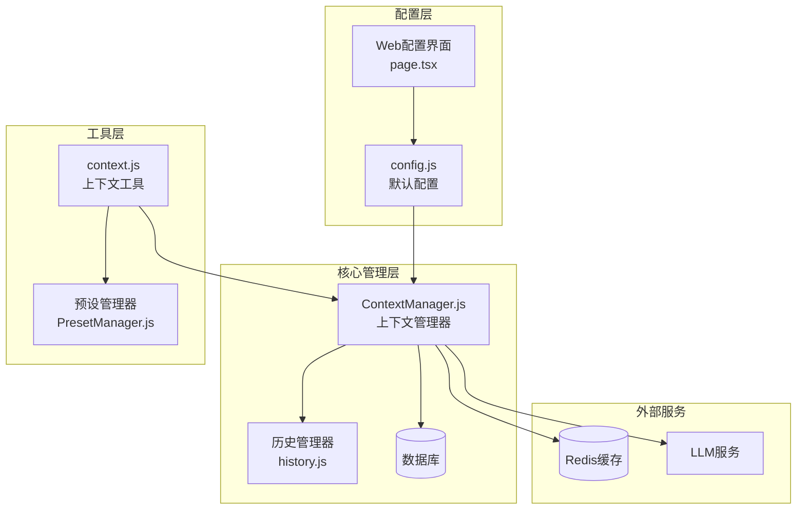
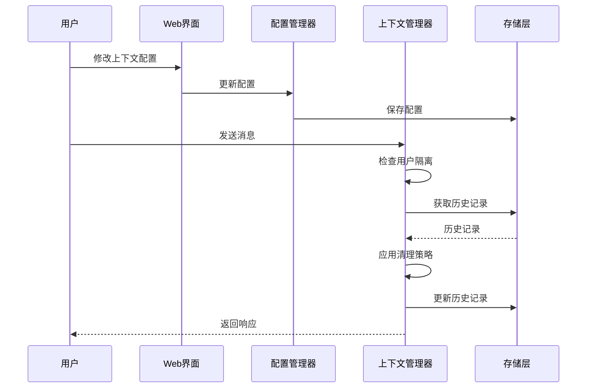
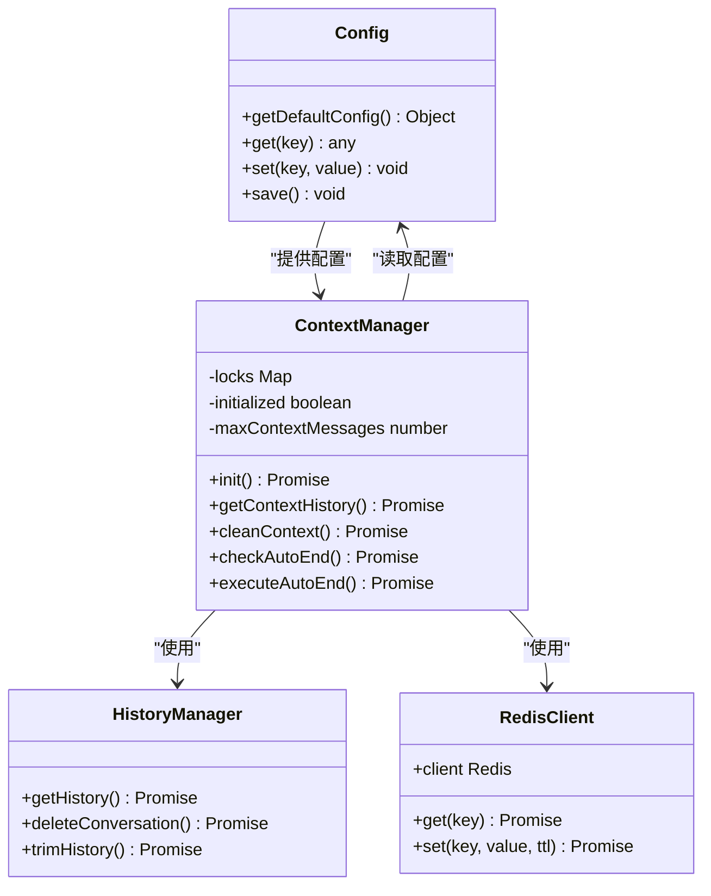

# 上下文配置

## 目录
1. [简介](#简介)
2. [项目结构](#项目结构)
3. [核心组件](#核心组件)
4. [架构概览](#架构概览)
5. [详细组件分析](#详细组件分析)
6. [依赖关系分析](#依赖关系分析)
7. [性能考虑](#性能考虑)
8. [故障排除指南](#故障排除指南)
9. [结论](#结论)

## 简介

上下文配置是 ChatAI 插件中最重要的功能之一，它负责管理对话历史、用户隔离、自动清理和智能总结等功能。本文档将深入解释上下文管理系统的所有配置选项，包括消息数量限制、令牌数限制、清理策略等基础配置，以及自动总结功能的各项参数。

## 项目结构

ChatAI 插件采用模块化的架构设计，上下文管理功能分布在多个组件中：

**图表来源**
- [config.js](file://config/config.js#L304-L342)
- [ContextManager.js](file://src/services/llm/ContextManager.js#L1-L30)
- [page.tsx](file://frontend/app/(dashboard)/settings/context/page.tsx#L1-L50)

## 核心组件

### 配置管理器 (Config)

配置管理器负责管理所有上下文相关的配置选项，包括默认值和运行时配置。

**章节来源**
- [config.js](file://config/config.js#L304-L342)

### 上下文管理器 (ContextManager)

上下文管理器是核心组件，负责处理所有上下文相关的操作，包括历史记录管理、用户隔离、自动清理等。

**章节来源**
- [ContextManager.js](file://src/services/llm/ContextManager.js#L8-L30)

### Web 配置界面

提供可视化的上下文配置界面，支持实时调整各种配置参数。

**章节来源**
- [page.tsx](file://frontend/app/(dashboard)/settings/context/page.tsx#L172-L251)

## 架构概览

上下文管理系统采用分层架构设计，确保各个组件职责清晰、耦合度低：

**图表来源**
- [ContextManager.js](file://src/services/llm/ContextManager.js#L389-L409)
- [config.js](file://config/config.js#L304-L342)

## 详细组件分析

### 基础配置参数

#### 消息数量限制 (maxMessages)

消息数量限制是上下文管理的基础参数，决定了系统保留的历史消息数量。

**配置位置**: `context.maxMessages`
**默认值**: 20
**范围**: 1-100
**作用**: 控制每次对话保留的历史消息数量

**章节来源**
- [config.js](file://config/config.js#L305-L305)
- [ContextManager.js](file://src/services/llm/ContextManager.js#L665-L672)

#### 令牌数限制 (maxTokens)

令牌数限制用于控制上下文的总令牌数量，防止超出模型的上下文窗口限制。

**配置位置**: `context.maxTokens`
**默认值**: 4000
**范围**: 100-128000
**作用**: 限制上下文的总令牌消耗

**章节来源**
- [config.js](file://config/config.js#L306-L306)
- [README.md](file://README.md#L249-L259)

#### 清理策略 (cleaningStrategy)

清理策略定义了当历史记录超过限制时的处理方式。

**配置位置**: `context.cleaningStrategy`
**默认值**: 'auto'
**可选值**: 'auto', 'manual', 'smart'

**章节来源**
- [config.js](file://config/config.js#L307-L307)
- [ContextManager.js](file://src/services/llm/ContextManager.js#L666-L721)

### 自动总结功能

自动总结功能可以定期清理长时间不活跃的长对话，将其总结为短上下文。

#### 触发条件

自动总结功能基于以下条件触发：
- 对话消息数超过 `maxMessagesBefore` 配置
- 最后活跃时间超过 `minInactiveMinutes` 配置
- 距离上次总结时间超过一定间隔

**章节来源**
- [ContextManager.js](file://src/services/llm/ContextManager.js#L135-L184)

#### 总结间隔

总结间隔由 `intervalMinutes` 参数控制，默认每10分钟检查一次。

**章节来源**
- [ContextManager.js](file://src/services/llm/ContextManager.js#L115-L129)

#### 窗口大小

窗口大小由 `windowMessages` 参数控制，默认处理最近80条消息。

**章节来源**
- [ContextManager.js](file://src/services/llm/ContextManager.js#L148-L150)

### 隔离模式配置

隔离模式决定了用户上下文的共享策略。

#### 群聊用户隔离

**配置位置**: `context.isolation.groupUserIsolation`
**默认值**: false
**含义**: 
- false: 群内用户共享上下文
- true: 每个用户拥有独立上下文

**章节来源**
- [config.js](file://config/config.js#L319-L321)
- [ContextManager.js](file://src/services/llm/ContextManager.js#L389-L409)

#### 私聊隔离

**配置位置**: `context.isolation.privateIsolation`
**默认值**: true
**含义**:
- true: 每个用户拥有独立上下文
- false: 所有私聊共享上下文

**章节来源**
- [config.js](file://config/config.js#L320-L322)
- [ContextManager.js](file://src/services/llm/ContextManager.js#L389-L409)

### 自动上下文配置

自动上下文功能可以自动携带历史消息作为上下文。

**配置位置**: `context.autoContext`
**默认值**: 
- enabled: true
- maxHistoryMessages: 20
- includeToolCalls: false

**章节来源**
- [config.js](file://config/config.js#L324-L328)
- [ContextManager.js](file://src/services/llm/ContextManager.js#L419-L463)

### 自动结束对话机制

自动结束对话功能可以在达到指定轮数后自动结束对话。

**配置位置**: `context.autoEnd`
**默认值**:
- enabled: false
- maxRounds: 50
- notifyUser: true
- notifyMessage: '对话已达到最大轮数限制，已自动开始新会话。'

**章节来源**
- [config.js](file://config/config.js#L330-L335)
- [ContextManager.js](file://src/services/llm/ContextManager.js#L826-L871)

## 依赖关系分析

上下文管理系统涉及多个组件之间的复杂依赖关系：

**图表来源**
- [config.js](file://config/config.js#L8-L631)
- [ContextManager.js](file://src/services/llm/ContextManager.js#L8-L19)

**章节来源**
- [config.js](file://config/config.js#L1-L631)
- [ContextManager.js](file://src/services/llm/ContextManager.js#L1-L1433)

## 性能考虑

### 内存优化策略

1. **智能清理算法**: 使用智能清理策略保留重要消息，减少不必要的历史记录
2. **缓存机制**: 使用 Redis 缓存群聊上下文，避免重复计算
3. **异步锁机制**: 防止并发访问导致的数据竞争

### 存储优化

1. **历史记录截断**: 当超过限制时自动截断历史记录
2. **增量更新**: 只更新必要的上下文数据
3. **TTL管理**: 自动清理过期的上下文元数据

### 网络优化

1. **防抖机制**: Web界面配置变更采用防抖处理，减少频繁的API调用
2. **批量处理**: 自动总结功能采用批量处理，避免阻塞系统

## 故障排除指南

### 常见问题及解决方案

#### 上下文过大导致内存溢出

**症状**: 系统内存使用率持续上升
**解决方案**:
1. 减少 `context.maxMessages` 配置
2. 调整 `context.cleaningStrategy` 为 'smart'
3. 启用自动总结功能

**章节来源**
- [ContextManager.js](file://src/services/llm/ContextManager.js#L676-L721)

#### 隔离模式配置错误

**症状**: 用户间上下文互相影响
**解决方案**:
1. 检查 `context.isolation.groupUserIsolation` 配置
2. 确认 `context.isolation.privateIsolation` 配置
3. 重启插件应用新的配置

**章节来源**
- [ContextManager.js](file://src/services/llm/ContextManager.js#L389-L409)

#### 自动总结功能异常

**症状**: 自动总结不生效或频繁触发
**解决方案**:
1. 检查 `context.autoSummarize.enabled` 配置
2. 调整 `context.autoSummarize.intervalMinutes` 参数
3. 验证数据库连接状态

**章节来源**
- [ContextManager.js](file://src/services/llm/ContextManager.js#L114-L130)

### 调试技巧

1. **启用调试模式**: 在基础配置中启用 `debug` 模式
2. **查看日志**: 关注 `[ContextManager]` 相关的日志信息
3. **监控内存**: 使用系统监控工具观察内存使用情况

**章节来源**
- [config.js](file://config/config.js#L66-L66)

## 结论

上下文配置系统为 ChatAI 插件提供了强大而灵活的对话管理能力。通过合理配置各项参数，可以实现：

1. **高效的上下文管理**: 通过智能清理和缓存机制优化性能
2. **灵活的用户隔离**: 支持群聊和私聊的不同隔离策略
3. **自动化的维护**: 通过自动总结和自动结束功能减少人工干预
4. **可扩展的架构**: 模块化设计便于功能扩展和维护

建议根据实际使用场景调整配置参数，在性能和功能之间找到最佳平衡点。对于大型群组或高并发场景，建议启用智能清理策略和自动总结功能，以确保系统的稳定性和响应速度。
