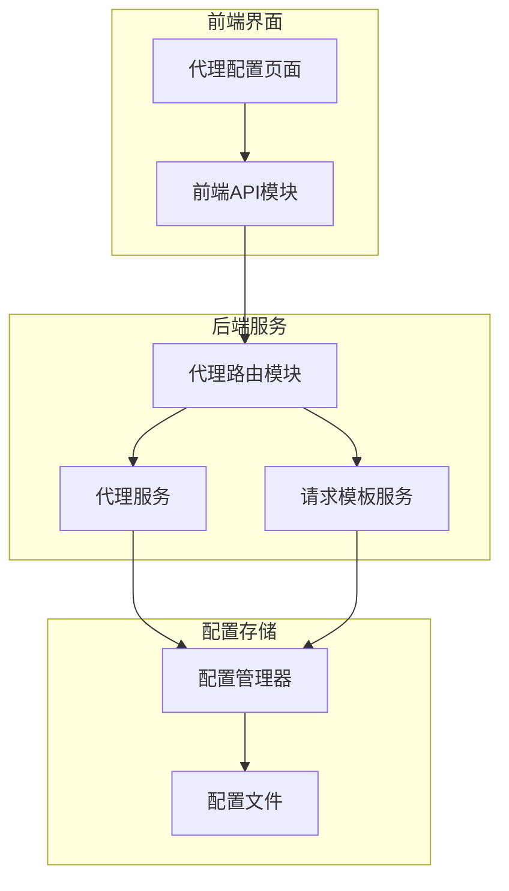
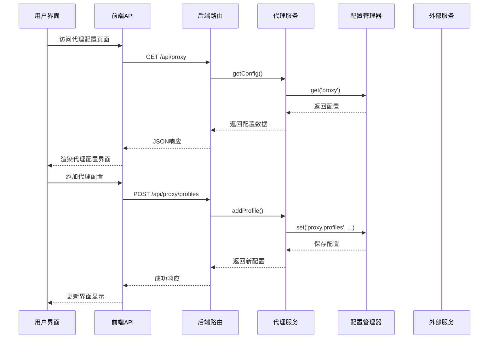
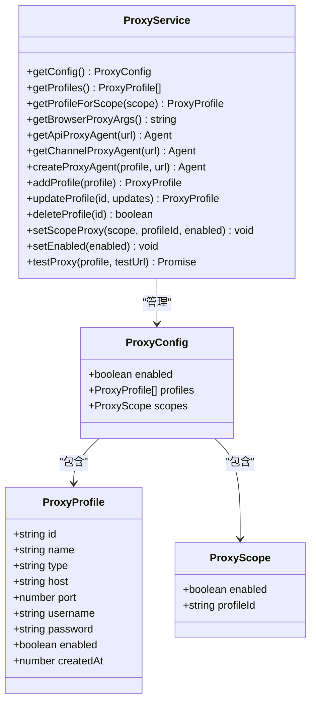
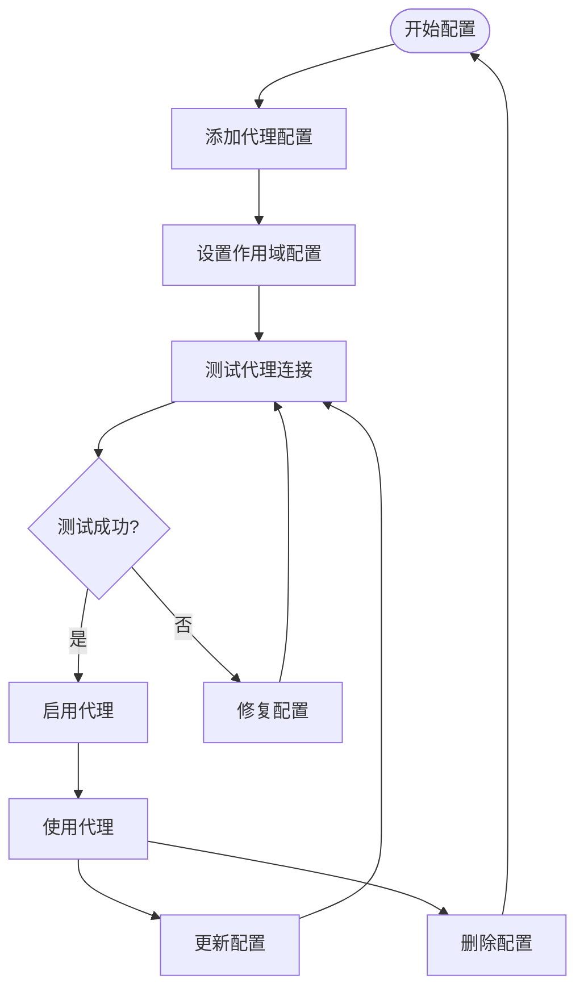
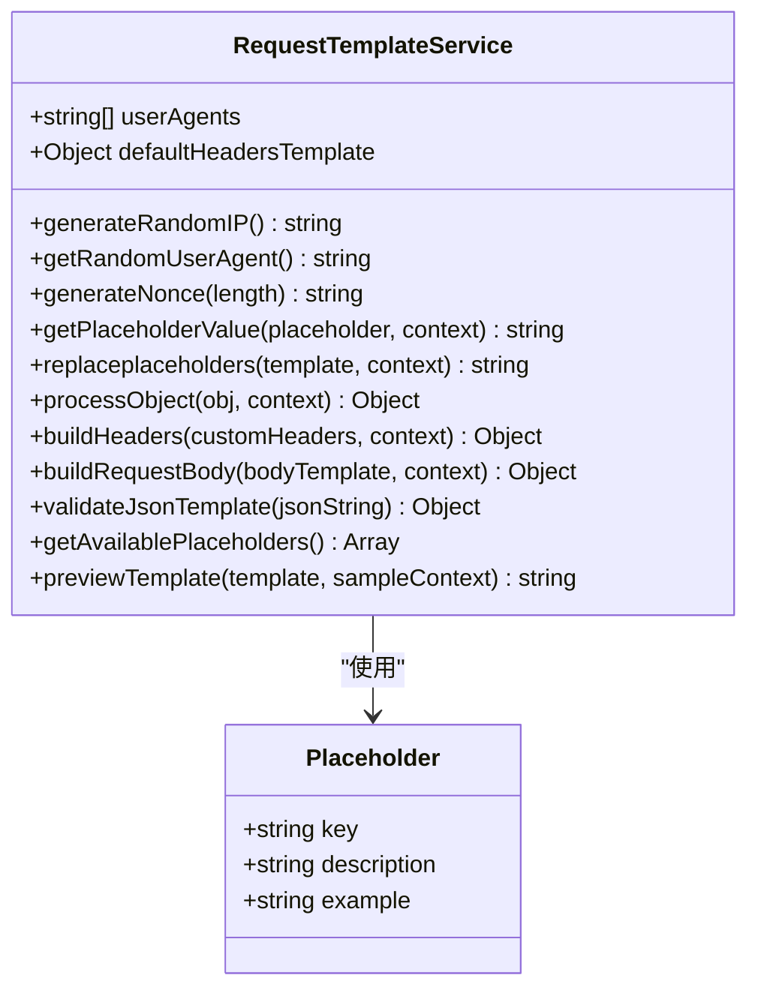
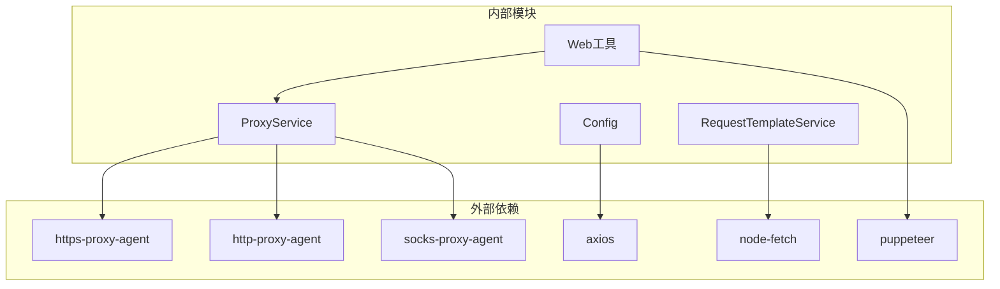

# 代理配置

## 目录
1. [简介](#简介)
2. [项目结构](#项目结构)
3. [核心组件](#核心组件)
4. [架构概览](#架构概览)
5. [详细组件分析](#详细组件分析)
6. [依赖关系分析](#依赖关系分析)
7. [性能考虑](#性能考虑)
8. [安全考虑](#安全考虑)
9. [最佳实践](#最佳实践)
10. [故障排除指南](#故障排除指南)
11. [结论](#结论)

## 简介

本文件详细说明了聊天机器人插件中的代理配置系统，包括网络代理和请求模板的配置选项。该系统支持三种代理作用域（浏览器、API、渠道），提供完整的代理配置管理、测试和使用功能。同时介绍了请求模板服务的配置和使用场景，以及相关的安全考虑和性能影响。

## 项目结构

代理配置系统由以下主要部分组成：

**图表来源**
- [page.tsx](file://frontend/app/(dashboard)/settings/proxy/page.tsx#L85-L619)
- [proxyRoutes.js](file://src/services/routes/proxyRoutes.js#L1-L127)
- [ProxyService.js](file://src/services/proxy/ProxyService.js#L13-L315)

**章节来源**
- [page.tsx](file://frontend/app/(dashboard)/settings/proxy/page.tsx#L85-L619)
- [proxyRoutes.js](file://src/services/routes/proxyRoutes.js#L1-L127)
- [ProxyService.js](file://src/services/proxy/ProxyService.js#L13-L315)

## 核心组件

### 代理服务 (ProxyService)

代理服务是整个代理配置系统的核心，负责管理不同环境的代理配置。它支持以下功能：

- **代理配置管理**：添加、更新、删除代理配置
- **作用域配置**：为浏览器、API、渠道三种环境分别配置代理
- **代理Agent创建**：根据配置创建相应的HTTP/HTTPS/SOCKS代理Agent
- **代理测试**：验证代理连接的有效性
- **缓存机制**：优化代理Agent的性能

### 请求模板服务 (RequestTemplateService)

请求模板服务提供占位符替换功能，支持复杂的请求头和请求体模板配置：

- **占位符系统**：支持多种内置占位符（API密钥、时间戳、随机IP等）
- **模板处理**：支持JSON格式的请求体和请求头模板
- **随机化功能**：提供随机User-Agent、随机IP等安全特性
- **预览功能**：允许用户预览占位符替换结果

### 配置管理器 (Config)

配置管理器负责持久化存储代理配置信息：

- **默认配置**：提供完整的代理配置默认值
- **配置合并**：支持用户自定义配置与默认配置的合并
- **热重载**：支持运行时配置的动态更新

**章节来源**
- [ProxyService.js](file://src/services/proxy/ProxyService.js#L13-L315)
- [RequestTemplateService.js](file://src/services/proxy/RequestTemplateService.js#L23-L303)
- [config.js](file://config/config.js#L295-L303)

## 架构概览

代理配置系统的整体架构如下：

**图表来源**
- [page.tsx](file://frontend/app/(dashboard)/settings/proxy/page.tsx#L98-L126)
- [proxyRoutes.js](file://src/services/routes/proxyRoutes.js#L7-L18)
- [ProxyService.js](file://src/services/proxy/ProxyService.js#L187-L204)

## 详细组件分析

### 代理作用域配置

系统支持三种代理作用域，每种都有特定的用途和配置方式：

#### 浏览器作用域 (browser)
- **用途**：用于网页访问工具（website工具）
- **实现方式**：通过Puppeteer启动参数配置代理
- **配置示例**：`--proxy-server=http://127.0.0.1:8080`

#### API作用域 (api)
- **用途**：用于通用HTTP请求（fetch/axios）
- **实现方式**：创建HTTP/HTTPS代理Agent
- **适用场景**：第三方API调用、数据抓取等

#### 渠道作用域 (channel)
- **用途**：用于LLM API调用（OpenAI等）
- **实现方式**：创建适合SDK使用的代理Agent
- **适用场景**：与AI服务提供商的通信

**图表来源**
- [ProxyService.js](file://src/services/proxy/ProxyService.js#L13-L315)
- [api.ts](file://frontend/lib/api.ts#L273-L298)

**章节来源**
- [ProxyService.js](file://src/services/proxy/ProxyService.js#L48-L123)
- [page.tsx](file://frontend/app/(dashboard)/settings/proxy/page.tsx#L47-L63)

### 代理配置管理流程

**图表来源**
- [proxyRoutes.js](file://src/services/routes/proxyRoutes.js#L70-L103)
- [ProxyService.js](file://src/services/proxy/ProxyService.js#L275-L310)

**章节来源**
- [proxyRoutes.js](file://src/services/routes/proxyRoutes.js#L70-L125)
- [ProxyService.js](file://src/services/proxy/ProxyService.js#L275-L310)

### 请求模板系统

请求模板服务提供了强大的占位符替换功能：

**图表来源**
- [RequestTemplateService.js](file://src/services/proxy/RequestTemplateService.js#L23-L303)

**章节来源**
- [RequestTemplateService.js](file://src/services/proxy/RequestTemplateService.js#L7-L283)

## 依赖关系分析

代理配置系统的主要依赖关系如下：

**图表来源**
- [ProxyService.js](file://src/services/proxy/ProxyService.js#L1-L4)
- [web.js](file://src/mcp/tools/web.js#L107-L150)

**章节来源**
- [ProxyService.js](file://src/services/proxy/ProxyService.js#L1-L4)
- [web.js](file://src/mcp/tools/web.js#L107-L150)

## 性能考虑

### 代理Agent缓存
代理服务实现了智能缓存机制来提升性能：
- **缓存键**：基于代理URL和目标协议（HTTP/HTTPS）
- **缓存策略**：避免重复创建相同的代理Agent实例
- **内存管理**：提供缓存清理功能

### 并发处理
- **异步操作**：代理测试采用异步方式，不影响主线程
- **超时控制**：代理测试设置合理的超时时间（10秒）
- **错误恢复**：代理创建失败时提供降级处理

### 资源优化
- **按需加载**：代理Agent按需创建，减少内存占用
- **连接复用**：缓存的代理Agent可重复使用
- **类型检查**：运行时验证代理类型，避免无效配置

## 安全考虑

### 凭据管理
- **密码加密**：代理密码以明文形式存储，建议使用强密码
- **传输安全**：代理URL中的凭据使用URL编码
- **权限控制**：仅授权用户可访问代理配置界面

### 网络安全
- **代理类型**：支持HTTP、HTTPS、SOCKS4、SOCKS5四种类型
- **认证机制**：支持用户名密码认证
- **连接验证**：提供代理连接测试功能

### 数据保护
- **配置存储**：代理配置存储在配置文件中
- **日志记录**：代理相关错误会记录到日志中
- **敏感信息**：API密钥等敏感信息应谨慎处理

### 最佳安全实践
- 使用HTTPS代理而非明文HTTP代理
- 定期更换代理密码
- 限制代理使用范围，避免过度暴露
- 定期测试代理连接有效性

## 最佳实践

### 代理配置最佳实践

#### 选择合适的代理类型
- **HTTP代理**：适用于大多数Web请求
- **HTTPS代理**：适用于需要SSL/TLS支持的场景
- **SOCKS代理**：适用于需要更复杂网络路由的场景

#### 作用域配置策略
- **浏览器作用域**：主要用于网页抓取和自动化测试
- **API作用域**：用于通用HTTP API调用
- **渠道作用域**：专门用于AI服务提供商的API

#### 性能优化建议
- 启用代理Agent缓存以提升性能
- 合理设置代理测试间隔
- 使用稳定的代理服务器

### 请求模板最佳实践

#### 占位符使用
- **API密钥管理**：使用占位符动态注入API密钥
- **时间戳应用**：合理使用时间戳确保请求新鲜度
- **随机化策略**：利用随机IP和User-Agent避免被识别

#### 模板设计原则
- 保持模板简洁明了
- 使用有意义的占位符名称
- 提供适当的默认值

## 故障排除指南

### 常见问题及解决方案

#### 代理连接失败
**症状**：代理测试结果显示连接失败
**可能原因**：
- 代理服务器不可达
- 认证信息错误
- 网络防火墙阻拦

**解决步骤**：
1. 验证代理服务器地址和端口
2. 检查用户名密码是否正确
3. 确认网络连接正常
4. 尝试使用其他代理服务器

#### 代理配置不生效
**症状**：配置了代理但请求未通过代理
**可能原因**：
- 代理未启用
- 作用域配置错误
- 缓存问题

**解决步骤**：
1. 确认代理全局开关已启用
2. 检查对应作用域的配置
3. 清理代理Agent缓存
4. 重启相关服务

#### 性能问题
**症状**：代理响应缓慢
**可能原因**：
- 代理服务器性能差
- 网络延迟高
- 缓存未充分利用

**解决步骤**：
1. 更换性能更好的代理服务器
2. 优化网络连接
3. 检查缓存配置
4. 调整代理测试频率

### 调试工具和方法

#### 代理测试
系统提供了完整的代理测试功能：
- **在线测试**：实时测试代理连接
- **延迟测量**：显示代理响应时间
- **状态监控**：跟踪代理健康状况

#### 日志分析
- 查看代理服务错误日志
- 分析代理Agent创建失败原因
- 监控代理使用统计

#### 配置验证
- 验证代理配置格式正确性
- 检查作用域配置完整性
- 确认占位符替换结果

**章节来源**
- [ProxyService.js](file://src/services/proxy/ProxyService.js#L275-L310)
- [page.tsx](file://frontend/app/(dashboard)/settings/proxy/page.tsx#L266-L287)

## 结论

代理配置系统为聊天机器人插件提供了灵活而强大的网络代理能力。通过支持三种不同的代理作用域、完善的配置管理、智能的缓存机制和全面的测试功能，系统能够满足各种复杂的网络访问需求。

关键优势包括：
- **多作用域支持**：针对不同使用场景提供专门的代理配置
- **智能缓存**：显著提升代理Agent的使用效率
- **完整测试**：确保代理配置的可靠性和有效性
- **安全考虑**：提供必要的安全特性和最佳实践指导

建议在生产环境中：
- 使用稳定可靠的代理服务器
- 定期测试和监控代理连接
- 实施适当的缓存策略
- 遵循安全最佳实践

通过合理配置和使用，代理系统能够有效提升系统的网络访问能力和安全性。
